# 163. 考试系统：新增试卷、回收站

这节我们实现新增试卷和回收站的功能。

先在 interfaces/index.tsx 加一下 add 接口：

```javascript
export async function examAdd(values: ExamAdd) {
    return await examServiceInstance.post('/exam/add', values);
}
```
然后写一下新增试卷的弹窗：

pages/ExamList/ExamAddModal.tsx

```javascript
import { Button, Form, Input, Modal, message } from "antd";
import { useForm } from "antd/es/form/Form";
import TextArea from "antd/es/input/TextArea";
import { examAdd } from "../../interfaces";

interface ExamAddModalProps {
    isOpen: boolean;
    handleClose: Function
}

const layout = {
    labelCol: { span: 6 },
    wrapperCol: { span: 18 }
}

export interface ExamAdd {
    name: string;
}

export function ExamAddModal(props: ExamAddModalProps) {

    const [form] = useForm<ExamAdd>();

    const handleOk = async function() {
        await form.validateFields();

        const values = form.getFieldsValue();

        try{
            const res = await examAdd(values);

            if(res.status === 201 || res.status === 200) {
                message.success('创建成功');
                form.resetFields();
                props.handleClose();
            }
        } catch(e: any){
            message.error(e.response?.data?.message || '系统繁忙，请稍后再试');
        }
    }

    return <Modal 
        title="新增试卷"
        open={props.isOpen}
        onOk={handleOk}
        onCancel={() => props.handleClose()}
        okText={'创建'}
        cancelText={'取消'}    
    >
        <Form
            form={form}
            colon={false}
            {...layout}
        >
            <Form.Item
                label="试卷名"
                name="name"
                rules={[
                    { required: true, message: '请输入试卷名!' },
                ]}
            >
                <Input />
            </Form.Item>
        </Form>
    </Modal>
}
```

Modal 内是一个表单，点击创建会调用 examAdd 接口。

在 ExamList/index.tsx 里调用下：

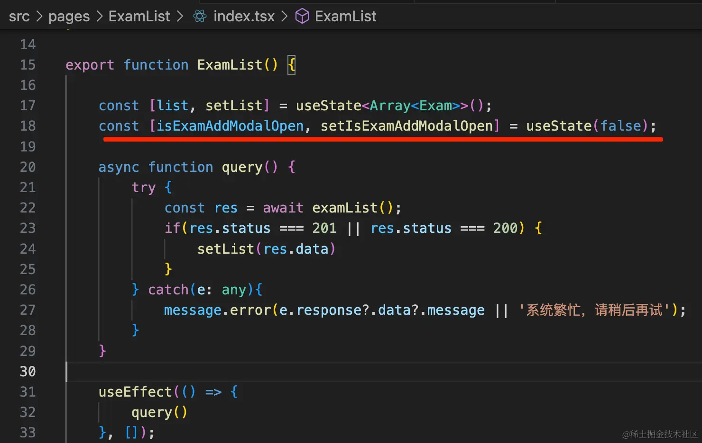

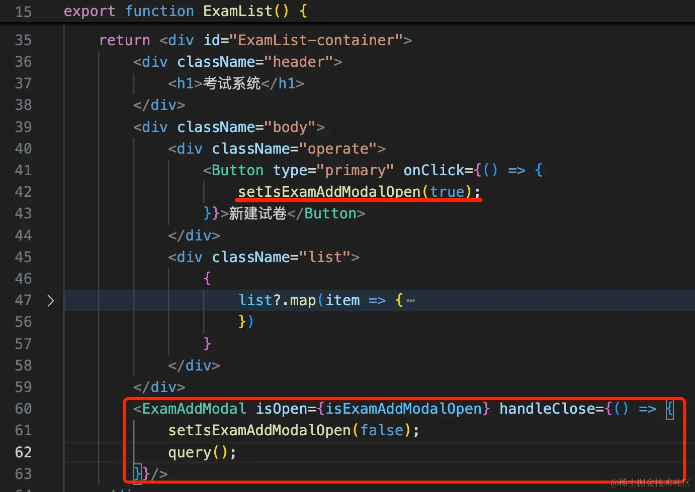
```javascript
import { Button, message } from "antd";
import "./index.scss";
import { useEffect, useState } from "react";
import { examList } from "../../interfaces";
import { ExamAddModal } from "./ExamAddModal";

interface Exam {
    id: number
    name: string
    isPublish: boolean
    isDelete: boolean
    content: string
}

export function ExamList() {

    const [list, setList] = useState<Array<Exam>>();
    const [isExamAddModalOpen, setIsExamAddModalOpen] = useState(false);

    async function query() {
        try {
            const res = await examList();
            if(res.status === 201 || res.status === 200) {
                setList(res.data)
            } 
        } catch(e: any){
            message.error(e.response?.data?.message || '系统繁忙，请稍后再试');
        }
    }

    useEffect(() => {
        query()
    }, []);

    return <div id="ExamList-container">
        <div className="header">
            <h1>考试系统</h1>
        </div>
        <div className="body">
            <div className="operate">
                <Button type="primary" onClick={() => {
                    setIsExamAddModalOpen(true);
                }}>新建试卷</Button>
            </div>
            <div className="list">
                {
                    list?.map(item => {
                        return <div className="item">
                            <p>{item.name}</p>
                            <div className="btns">
                                <Button className="btn" type="primary" style={{background: 'darkblue'}}>{item.isPublish ?  '停止' : '发布' }</Button>
                                <Button className="btn" type="primary" style={{background: 'green'}}>编辑</Button>
                                <Button className="btn" type="primary" style={{background: 'darkred'}}>删除</Button>
                            </div>
                        </div>
                    })
                }
            </div>
        </div>
        <ExamAddModal isOpen={isExamAddModalOpen} handleClose={() => {
            setIsExamAddModalOpen(false);
            query();
        }}/>
    </div>
}
```
测试下：


没啥问题。

然后实现发布状态的修改：

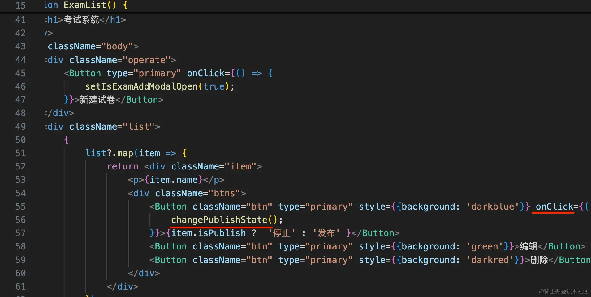

之前我们只实现了 publish 接口，没实现 unpublish 接口。

在后端代码加一下：

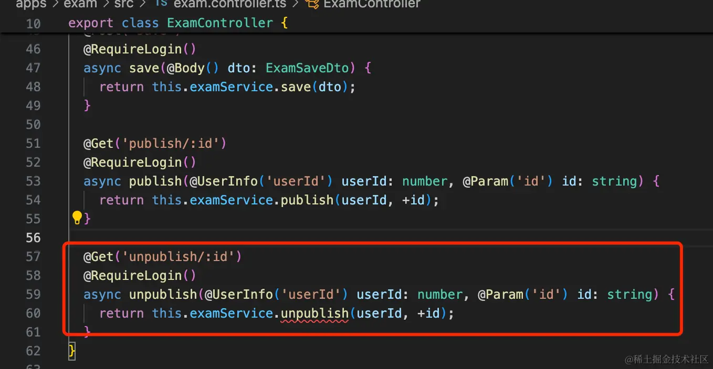

```javascript
@Get('unpublish/:id')
@RequireLogin()
async unpublish(@UserInfo('userId') userId: number, @Param('id') id: string) {
    return this.examService.unpublish(userId, +id);
}
```

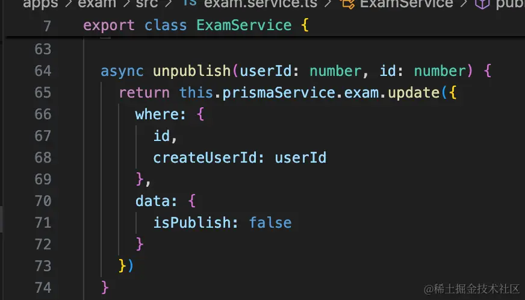

```javascript
async unpublish(userId: number, id: number) {
    return this.prismaService.exam.update({
      where: {
        id,
        createUserId: userId
      },
      data: {
        isPublish: false
      }
    })
}
```
试下效果：

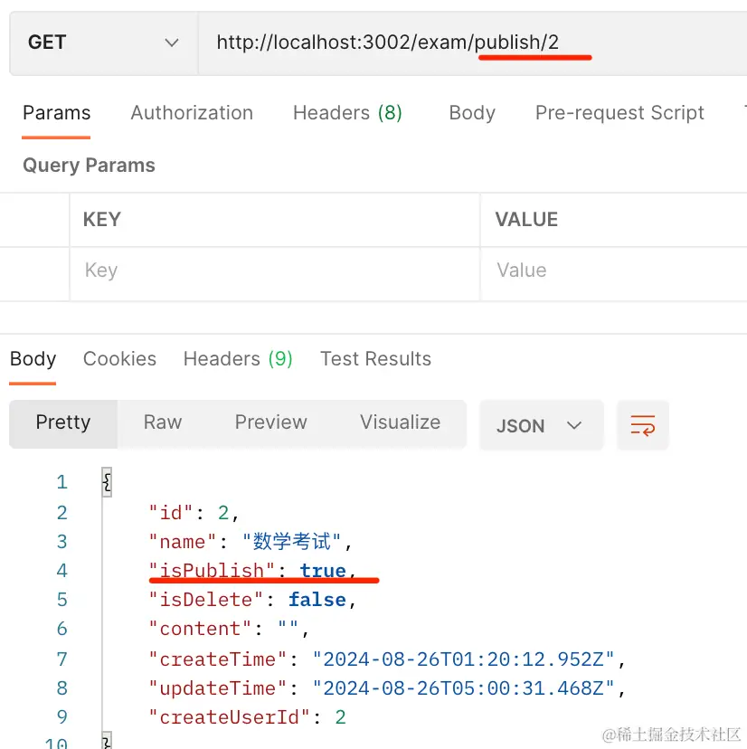

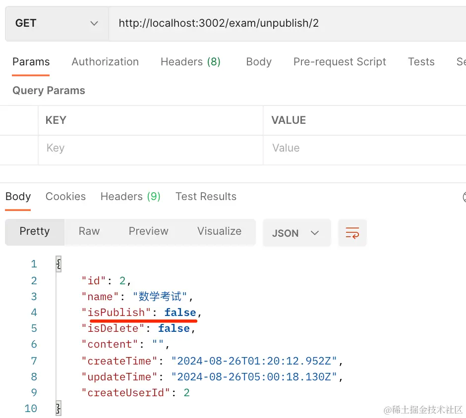

在前端代码的 interfaces/index.tsx 调用下：

```javascript
export async function examPublish(id: number) {
    return await examServiceInstance.get('/exam/publish/' + id );
}

export async function examUnpublish(id: number) {
    return await examServiceInstance.get('/exam/unpublish/' + id );
}
```
然后在 ExamList/index.tsx 组件里用一下：

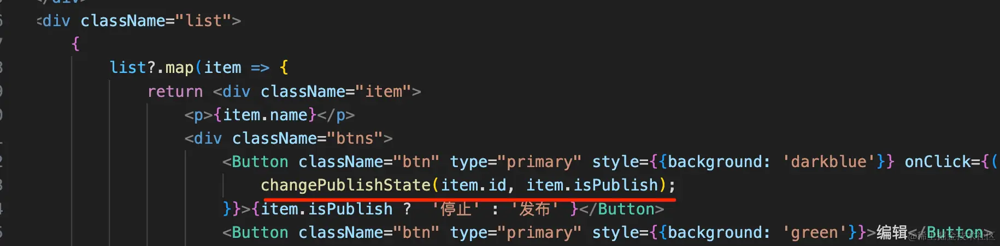


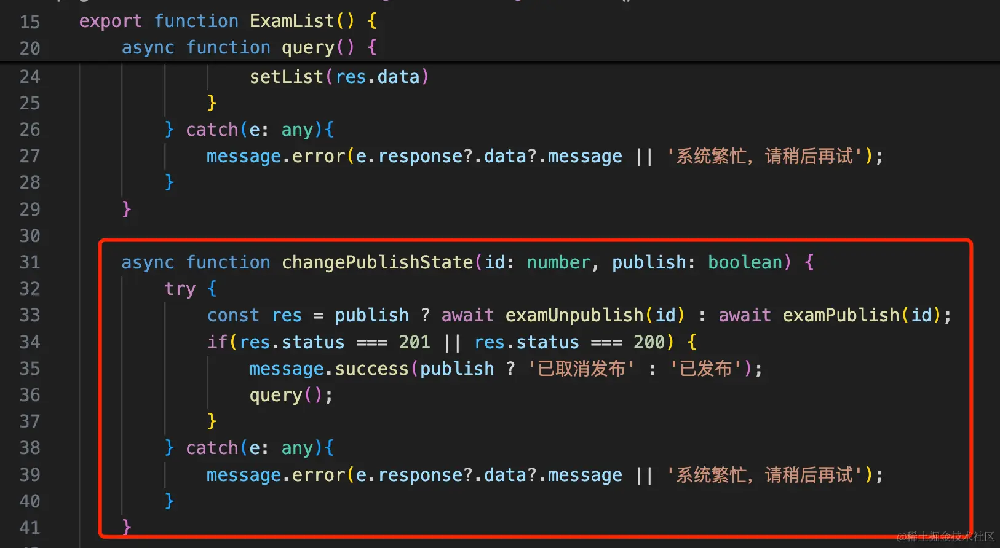
```javascript
async function changePublishState(id: number, publish: boolean) {
    try {
        const res = publish ? await examUnpublish(id) : await examPublish(id);
        if(res.status === 201 || res.status === 200) {
            message.success(publish ? '已取消发布' : '已发布');
            query();
        } 
    } catch(e: any){
        message.error(e.response?.data?.message || '系统繁忙，请稍后再试');
    }
}
```

试一下：


没啥问题。

然后再来实现删除功能。

在 interfaces/index.tsx 增加删除接口：

```javascript
export async function examDelete(id: number) {
    return await examServiceInstance.delete('/exam/delete/' + id );
}
```
点击删除按钮的时候调用下：


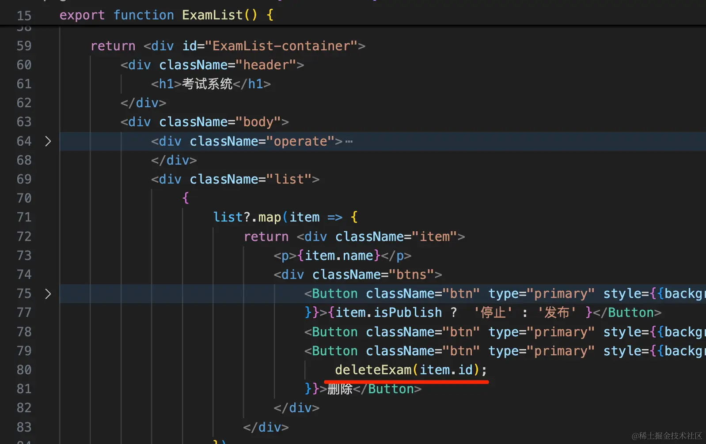


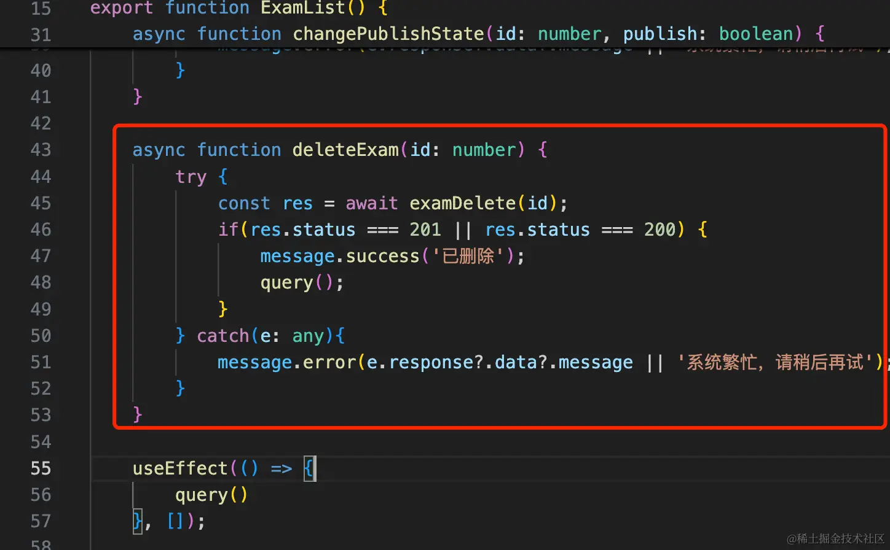

```javascript
async function deleteExam(id: number) {
    try {
        const res = await examDelete(id);
        if(res.status === 201 || res.status === 200) {
            message.success('已删除');
            query();
        } 
    } catch(e: any){
        message.error(e.response?.data?.message || '系统繁忙，请稍后再试');
    }
}
```
试一下：


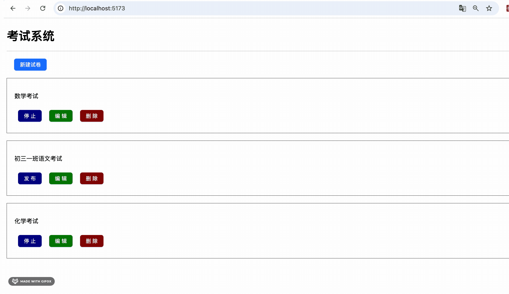

这时候其实已经删除了，只不过我们用的逻辑删除。

在列表过滤下：

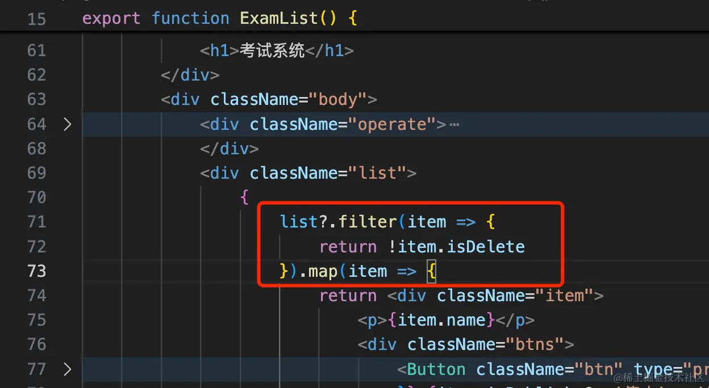

```javascript
list?.filter(item => {
    return !item.isDelete
})
```

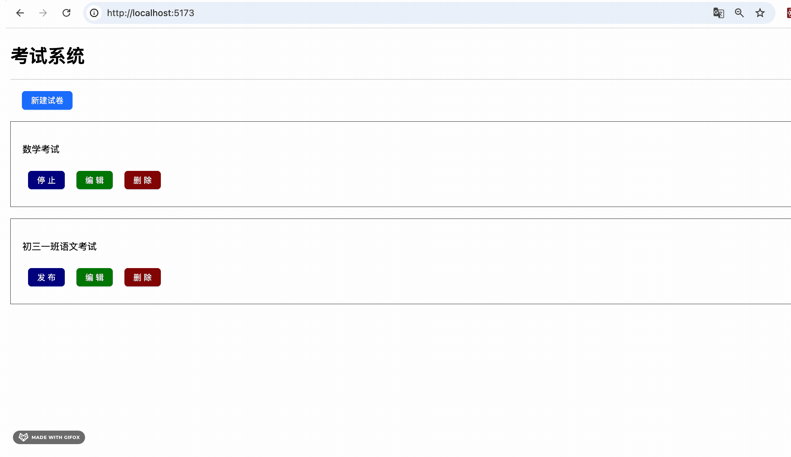

然后支持下回收站的显示：

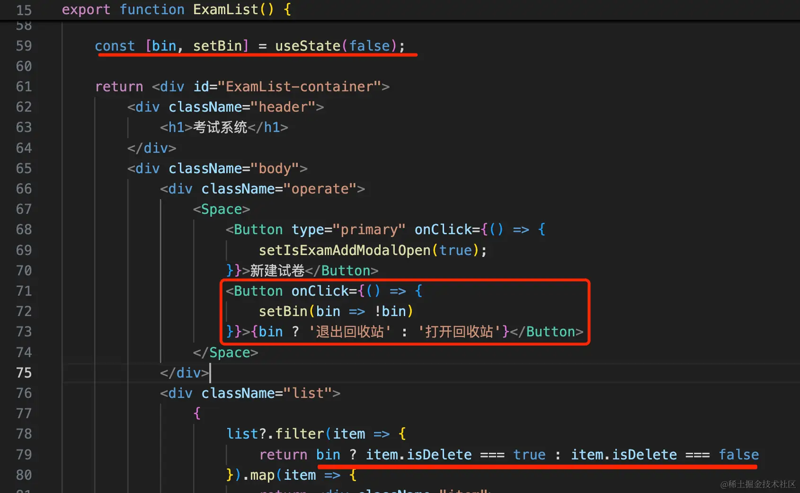

加一个状态表示是否在回收站，点击按钮切换状态。

显示的时候根据是否在回收站决定显示 isDelete 是 true 还是 false 的数据。

```javascript
const [bin, setBin] = useState(false);
```

```javascript
<Button onClick={() => {
    setBin(bin => !bin)
}}>{bin ? '退出回收站' : '打开回收站'}</Button>
```
```javascript
list?.filter(item => {
    return bin ? item.isDelete === true : item.isDelete === false
})
```

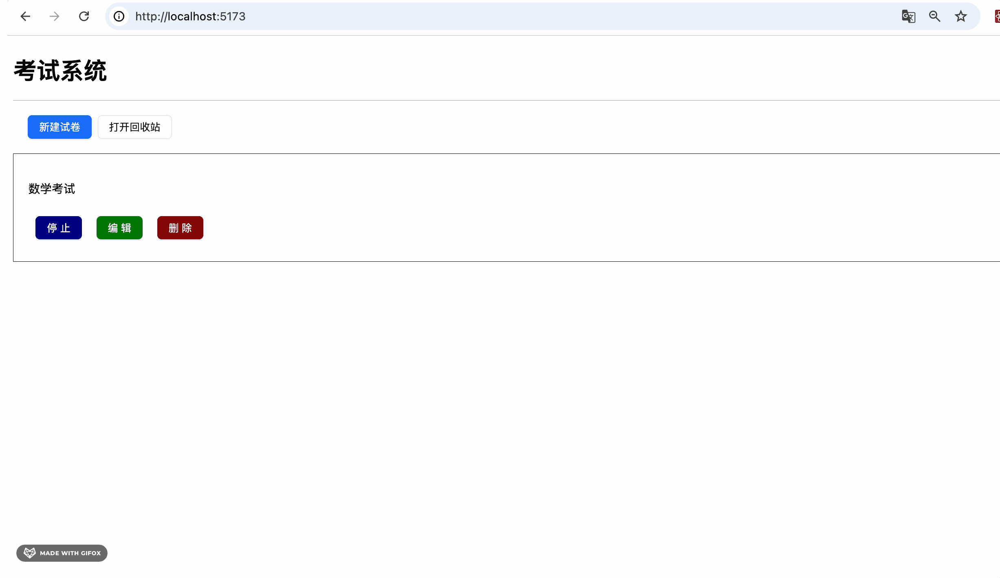

这样，回收站功能就完成了。

我们再给删除加个二次确认弹窗：

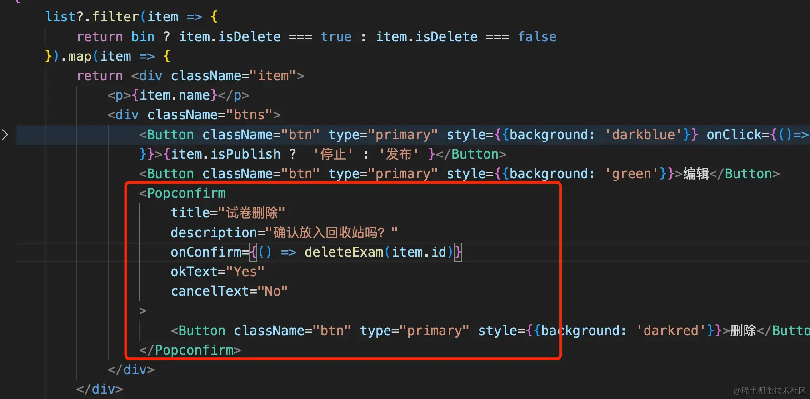

```javascript
<Popconfirm
    title="试卷删除"
    description="确认放入回收站吗？"
    onConfirm={() => deleteExam(item.id)}
    okText="Yes"
    cancelText="No"
>                                  
    <Button className="btn" type="primary" style={{background: 'darkred'}}>删除</Button>
</Popconfirm>
```


整体测试下：

创建两个考试：


删除其中一个，然后进回收站看一下：


再试下发布功能：


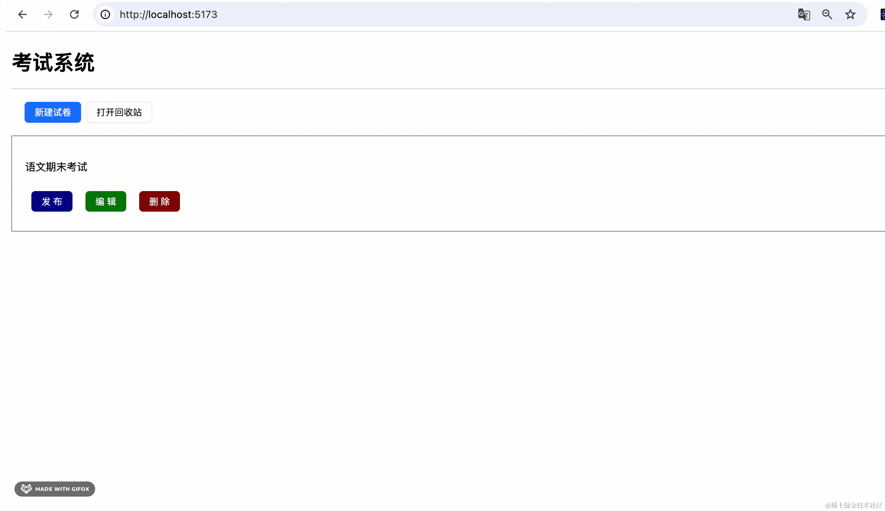

没啥问题。

这样，试卷的新增、删除、回收站就都完成了。

案例代码在小册仓库：

[前端代码](https://github.com/QuarkGluonPlasma/nestjs-course-code/tree/main/exam-system-frontend)

[后端代码](https://github.com/QuarkGluonPlasma/nestjs-course-code/tree/main/exam-system)

## 总结

这节我们实现了试卷新增、发布试卷、回收站功能。

新增试卷会弹窗展示表单，输入信息后调用接口并刷新列表。

删除、发布后也会刷新列表。

回收站就是根据 isDelete 来过滤列表里的数据。

下节我们来做试卷编辑的功能。
