# 164. 考试系统：试卷编辑器

这节我们来写下试卷编辑器。

和问卷星的类似：


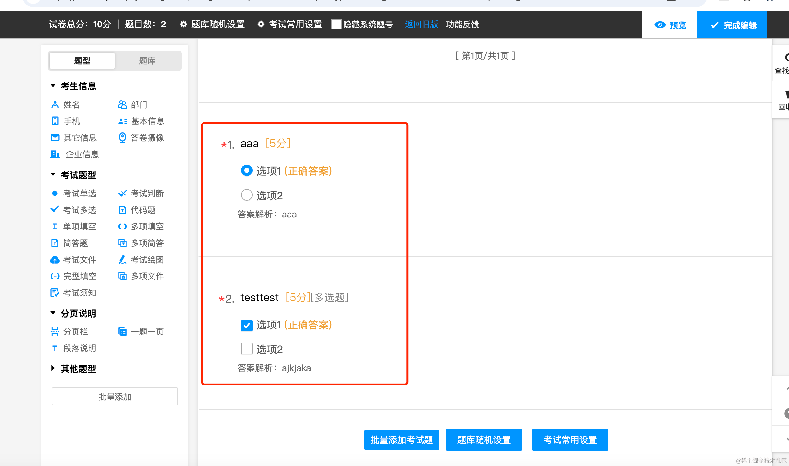

可以选择不同的题型，然后设置题目的内容，答案、分值、答案解析等。

我们先来设计下 json 的数据结构：

这只是一个列表的 json，比较简单。

大概是这样的结构：

```json
[
    {
        "type": "radio",
        "question": "最长的河？",
        "options": [
            "选项1",
            "选项2"
        ],
        "score": 5,
        "answer": "选项1",
        "answerAnalyse": "答案解析"
    }
]
```
type 是题型

options 是单选的选项

score 是题目分数

answer 是答案

answerAnalyse 是答案解析

我们加一个 /edit/:id 的路由：


写下内容：

pages/Edit/index.tsx

```javascript
import { useParams } from "react-router-dom";

export function Edit() {

    let { id } = useParams();

    return <div>Edit: {id}</div>
}

```

我们按照低代码编辑器这种布局来写，比如 [amis](https://aisuda.github.io/amis-editor-demo/#/edit/0) 编辑器：

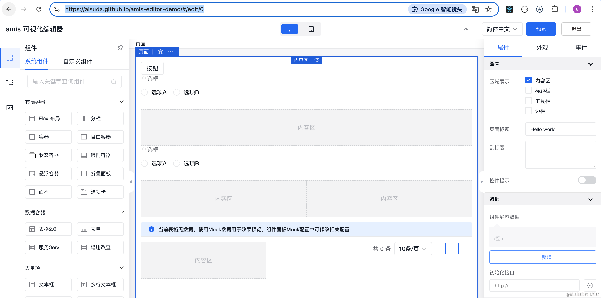

左边是物料区、中间是画布区、右边是属性编辑区。

写下布局：

```javascript
import { useParams } from "react-router-dom";
import './index.scss';
import { Button } from "antd";

export function Edit() {

    let { id } = useParams();

    return <div id="edit-container">
        <div className="header">
            <div>试卷编辑器</div>
            <Button type="primary">预览</Button>
        </div>
        <div className="body">
            <div className="materials">
                <div className="meterial-item">单选题</div>
                <div className="meterial-item">多选题</div>
                <div className="meterial-item">填空题</div>
            </div>
            <div className="edit-area">

            </div>
            <div className="setting">

            </div>
        </div>
    </div>
}
```
index.scss
```scss
* {
    margin: 0;
    padding: 0;
}

#edit-container {
    .header {
        display: flex;
        justify-content: space-between;
        align-items: center;

        height: 80px;
        font-size: 30px;
        line-height: 80px;
        border-bottom: 1px solid #000;
        padding:0 20px;
    }

    .body {
        height: calc(100vh - 80px);

        display: flex;
        .materials {
            height: 100%;
            width: 300px;
            border-right: 1px solid #000;

            .meterial-item {
                padding: 20px;
                border: 1px solid #000;
                display: inline-block;
                margin: 10px;
                cursor: move;
            }
        }
        
        .edit-area {
            height: 100%;
            flex: 1;
        }

        .setting {
            height: 100%;
            width: 400px;
            border-left: 1px solid #000;
        }
    }
}
```

就是 flex、width、height、padding 这些布局。

看下效果：

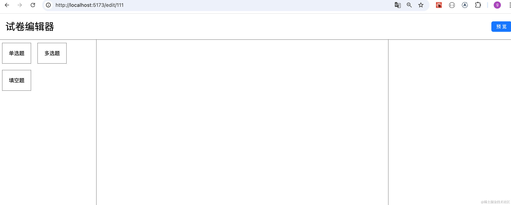

中间部分通过就是递归渲染 json 为组件：

```javascript
import { useParams } from "react-router-dom";
import './index.scss';
import { Button, Radio, Checkbox, Input } from "antd";

export type Question =  {
    id: number
    question: string
    type: 'radio' | 'checkbox' | 'input' 
    options?: string[]
    score: number
    answer: string
    answerAnalyse: string
}

const json: Array<Question> = [
    {
        id: 1,
        type: "radio",
        question: "最长的河？",
        options: [
            "选项1",
            "选项2"
        ],
        score: 5,
        answer: "选项1",
        answerAnalyse: "答案解析"
    },
    {
        id: 2,
        type: "checkbox",
        question: "最高的山？",
        options: [
            "选项1",
            "选项2"
        ],
        score: 5,
        answer: "选项1",
        answerAnalyse: "答案解析"
    },
    {
        id: 2,
        type: "input",
        question: "测试问题",
        score: 5,
        answer: "选项1",
        answerAnalyse: "答案解析"
    },

]

export function Edit() {

    let { id } = useParams();

    function renderComponents(arr: Array<Question>) {
        return arr.map(item => {
            let formComponent;
            if(item.type === 'radio') {
                formComponent = <Radio.Group>
                    {
                        item.options?.map(option => <Radio value={option}>{option}</Radio>)
                    }
                </Radio.Group>
            } else if(item.type === 'checkbox') {
                formComponent = <Checkbox.Group options={item.options} />
            } else if(item.type === 'input'){
                formComponent =  <Input/>
            }

            return <div className="component-item"  key={item.id}>
                <p className="question">{item.question}</p>
                <div className="options">
                    {formComponent}
                </div>
                <p className="score">
                    分值：{item.score}
                </p>
                <p className="answer">
                    答案：{item.answer}
                </p>
                <p className="answerAnalyse">
                    答案解析：{item.answerAnalyse}
                </p>
            </div>
        })
    }

    return <div id="edit-container">
        <div className="header">
            <div>试卷编辑器</div>
            <Button type="primary">预览</Button>
        </div>
        <div className="body">
            <div className="materials">
                <div className="meterial-item">单选题</div>
                <div className="meterial-item">多选题</div>
                <div className="meterial-item">填空题</div>
            </div>
            <div className="edit-area">
                {
                    renderComponents(json)
                }
            </div>
            <div className="setting">

            </div>
        </div>
    </div>
}
```

我们写死了一个 json：

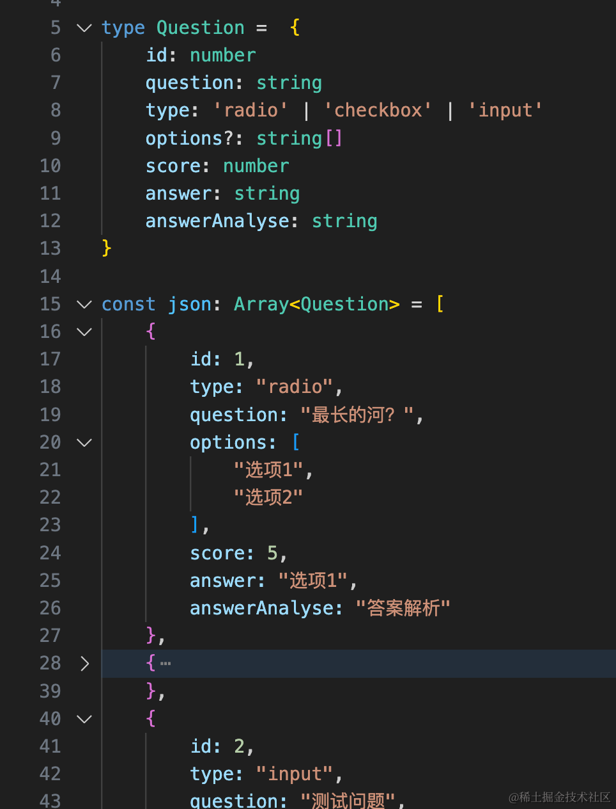

然后写了一个 renderComponents 方法来渲染它：


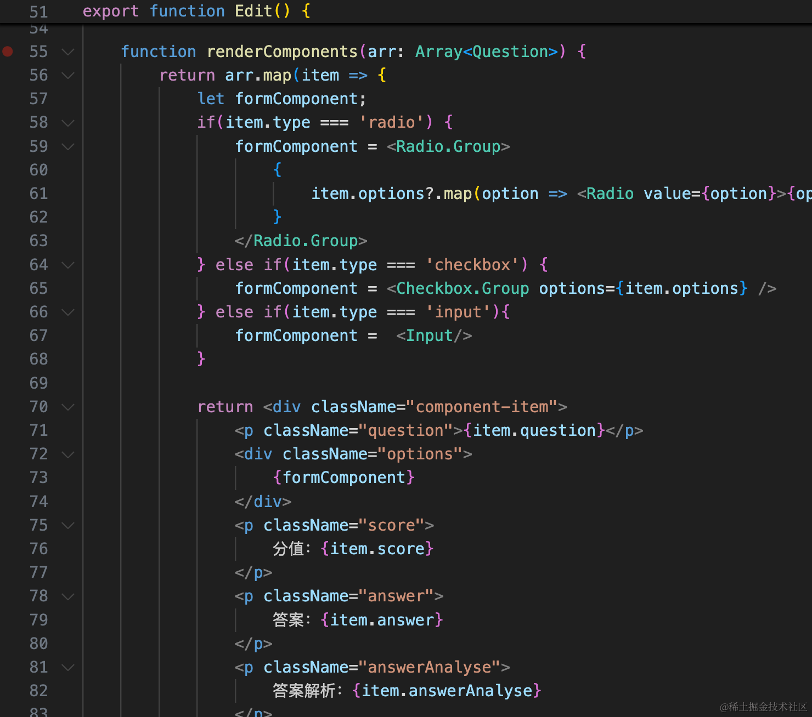

css 如下：


```css
.component-item {
    margin: 20px;

    line-height: 40px;
    font-size: 20px;

    border-bottom: 1px solid #000;
}
```

渲染出来是这样的：

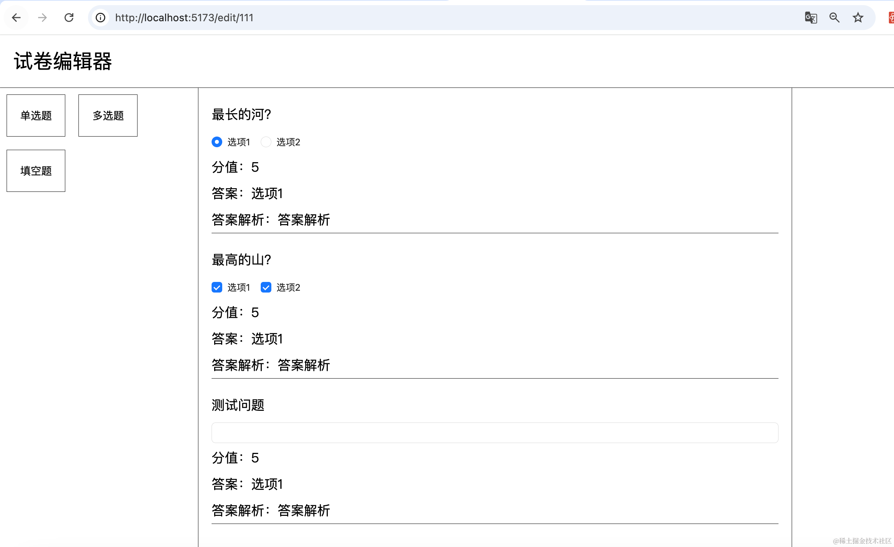

然后我们拖拽左边的物料到画布的时候，在 json 数组加一个元素。

我们用 react-dnd 实现拖拽，安装用到的包：
```
npm install react-dnd react-dnd-html5-backend
```

在最外层加一下 DndProvider，这是 react-dnd 用来跨组件通信的：

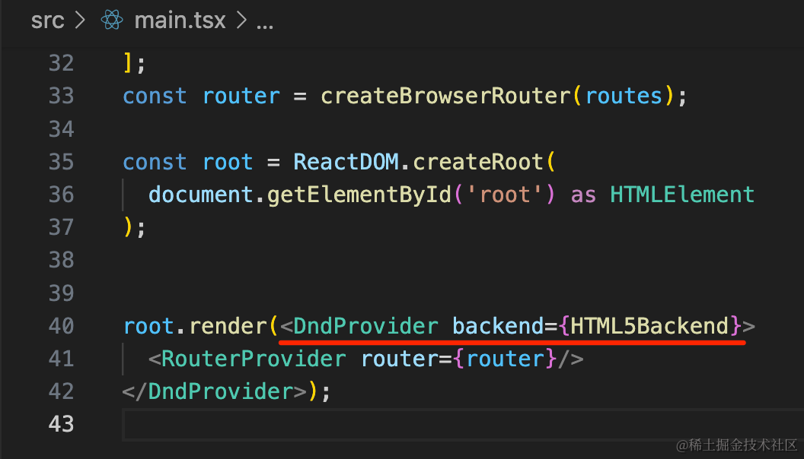

在物料上加上 useDrag：

封装一个 pages/Edit/Material.tsx 组件

```javascript
import { useDrag } from "react-dnd";

export function MaterialItem(props: { name: string, type: string}) {

    const [_, drag] = useDrag({
        type: props.type,
        item: {
            type: props.type
        }    
    });

    return <div className="meterial-item" ref={drag}>{props.name}</div>;
}
```
用 useDrag 给它加上拖拽。

item 是传递的数据

用一下：


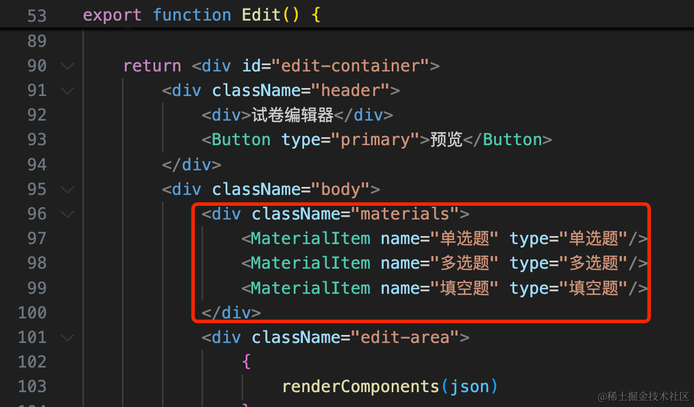

```javascript
<MaterialItem name="单选题" type="单选题"/>
<MaterialItem name="多选题" type="多选题"/>
<MaterialItem name="填空题" type="填空题"/>
```
这样，就可以拖拽了：


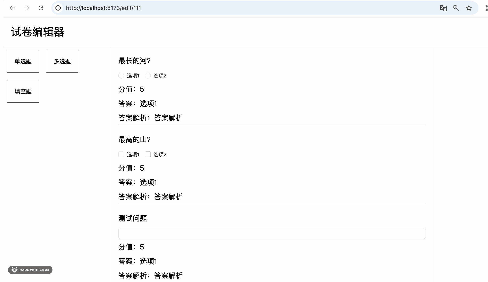

然后处理 drop：


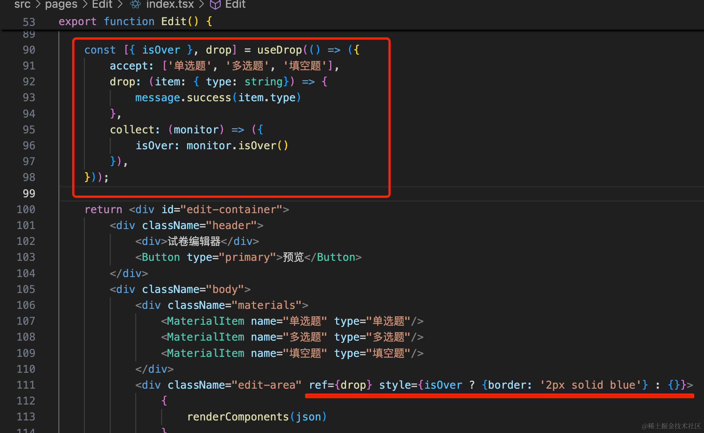

accept 是可以接收的 drag 的类型，也就是这个：


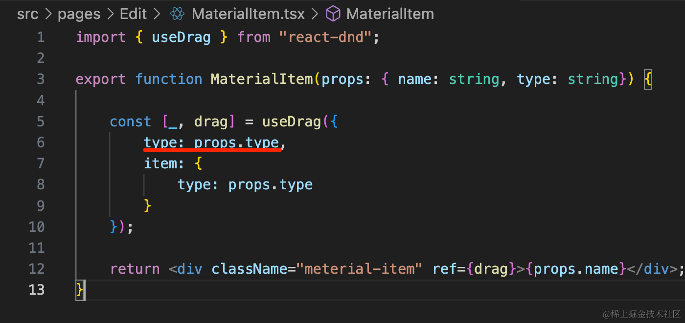

drop 的时候显示个消息提示。

over 的时候加个蓝色边框

测试下：


没啥问题。

然后我们 drop 的时候把它加到 json 里就好了。

把写死的 json 清空，然后 drop 的时候往里 push 元素

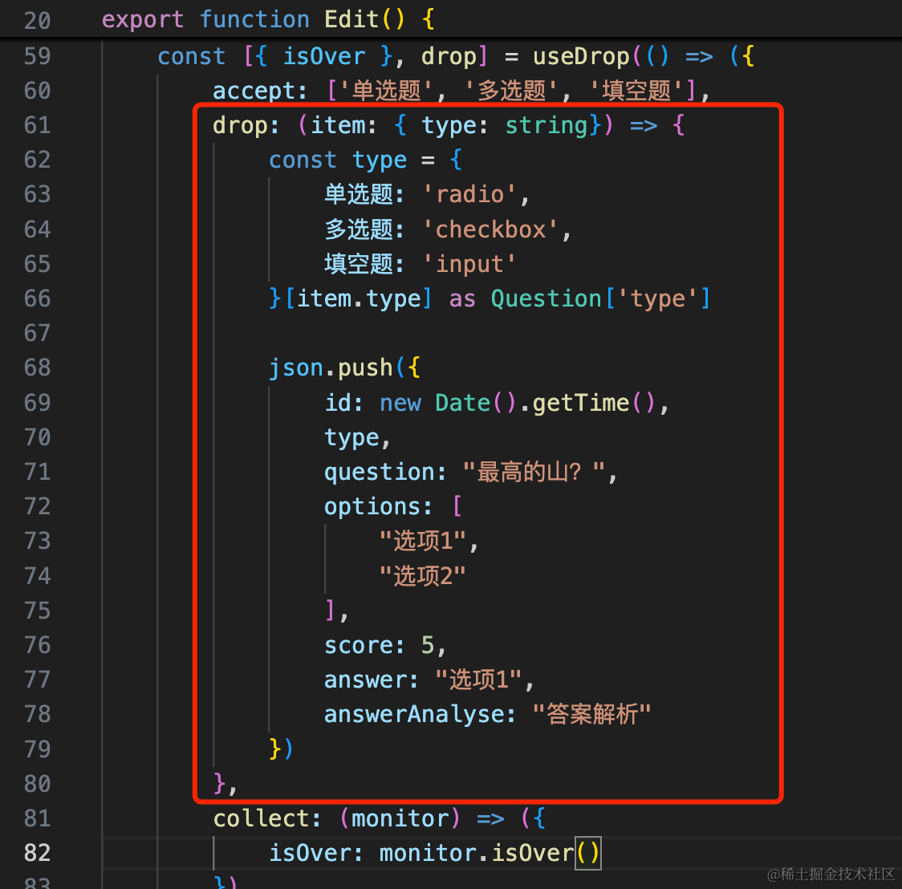

```javascript
const [{ isOver }, drop] = useDrop(() => ({
    accept: ['单选题', '多选题', '填空题'],
    drop: (item: { type: string}) => {
        const type = {
            单选题: 'radio',
            多选题: 'checkbox',
            填空题: 'input'
        }[item.type] as Question['type']

        json.push({
            id: new Date().getTime(),
            type,
            question: "最高的山？",
            options: [
                "选项1",
                "选项2"
            ],
            score: 5,
            answer: "选项1",
            answerAnalyse: "答案解析"
        })
    },
    collect: (monitor) => ({
        isOver: monitor.isOver()
    }),
}));
```
在右边展示下 json：

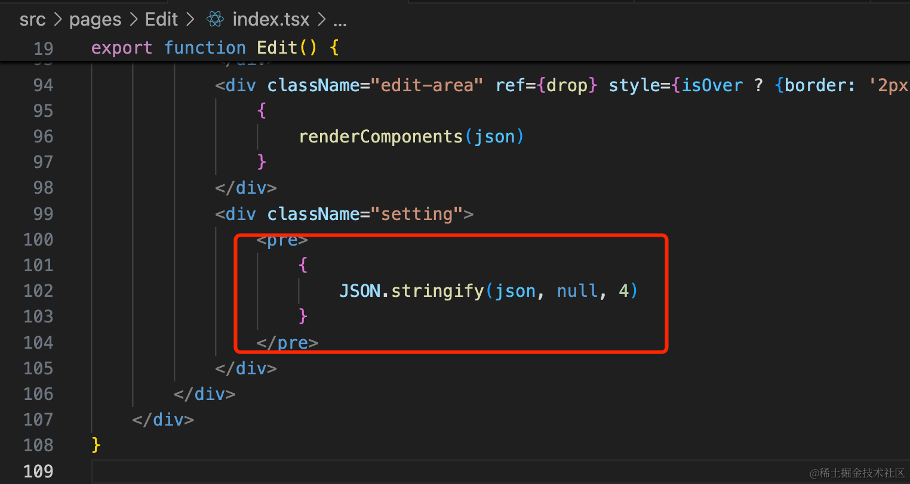

```javascript
<pre>
    {
        JSON.stringify(json, null, 4)
    }
</pre>
```


然后点击问题的时候加一个高亮框：

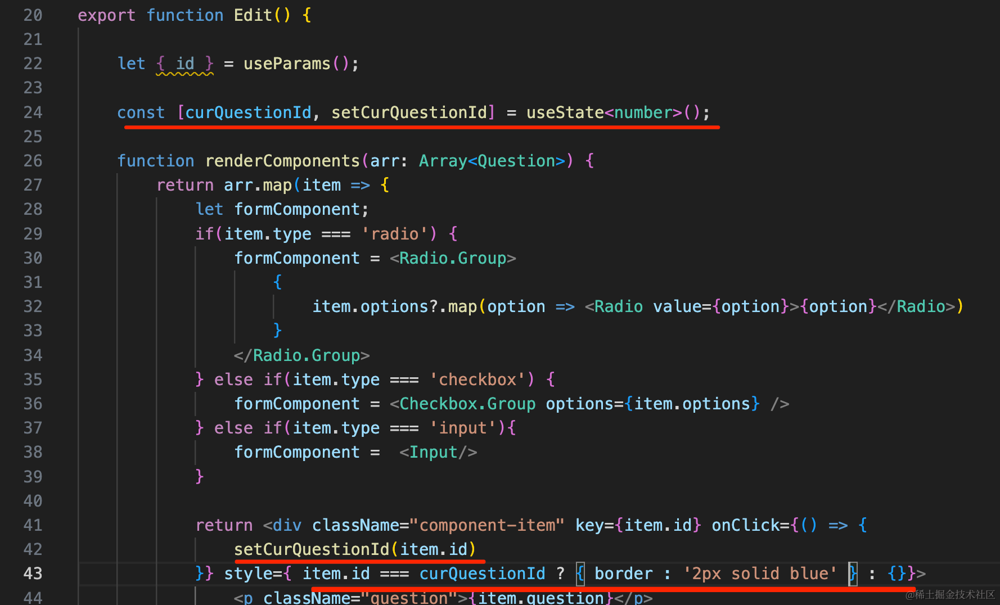

```javascript
const [curQuestionId, setCurQuestionId] = useState<number>();
```
```javascript
<div className="component-item" key={item.id} onClick={() => {
    setCurQuestionId(item.id)
}} style={ item.id === curQuestionId ? { border : '2px solid blue' } : {}}>
```

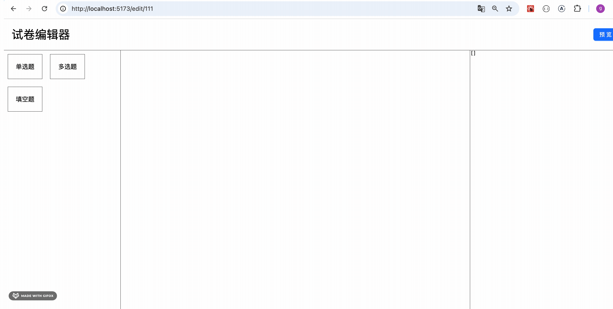

然后选中的时候在右边展示对应的编辑表单：

首先把 json 拿进来作为一个 state：

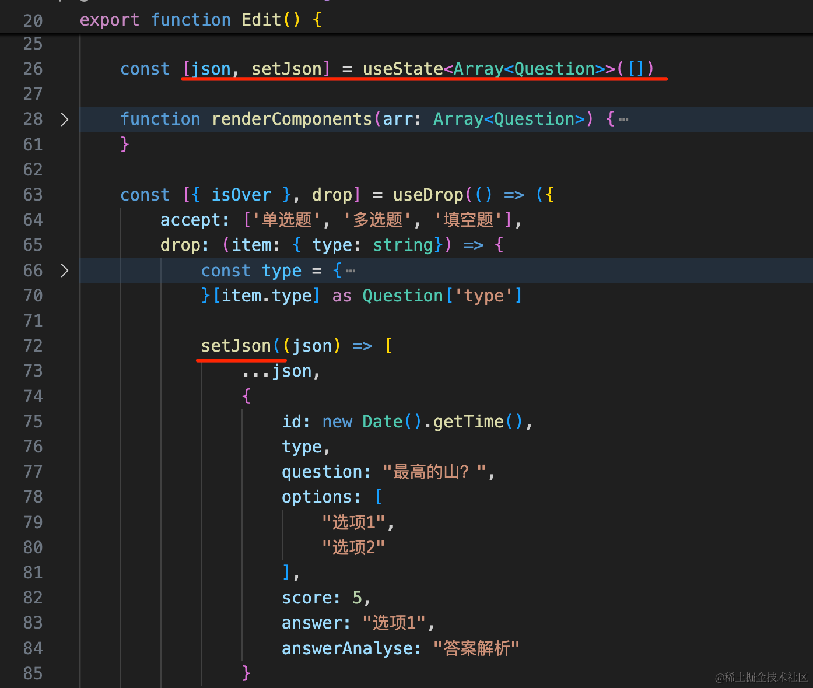

```javascript
const [json, setJson] = useState<Array<Question>>([])
```

```javascript
setJson((json) => [
    ...json,
    {
        id: new Date().getTime(),
        type,
        question: "最高的山？",
        options: [
            "选项1",
            "选项2"
        ],
        score: 5,
        answer: "选项1",
        answerAnalyse: "答案解析"
    }
])
```
然后写下选中时的表单：


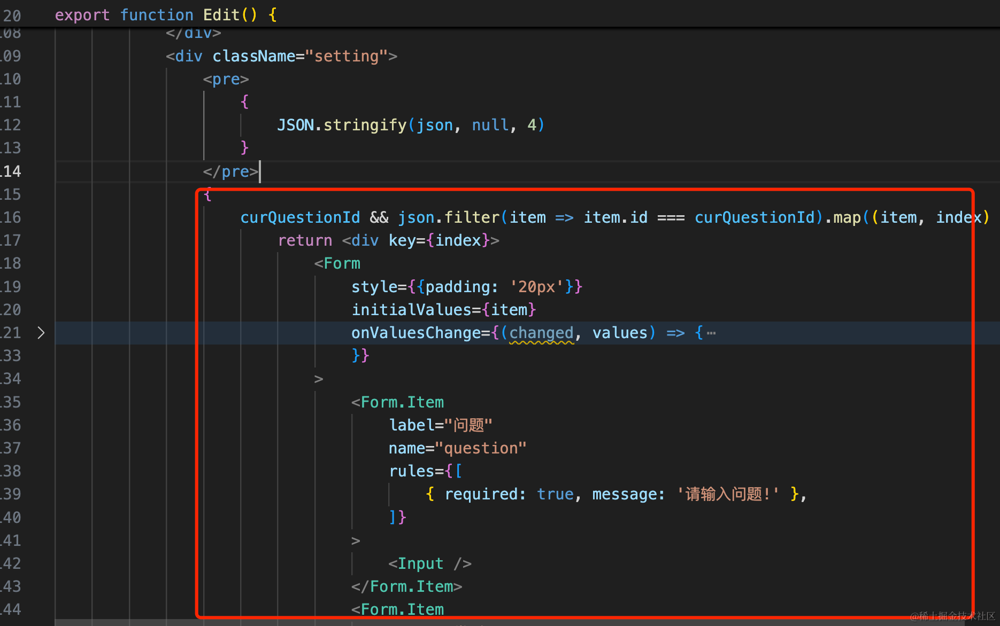

```javascript
{
    curQuestionId && json.filter(item => item.id === curQuestionId).map((item, index) => {
        return <div key={index}>
            <Form
                style={{padding: '20px'}}
                initialValues={item}
                onValuesChange={(changed, values) => {
                    setJson(json => {
                        return json.map((cur) => {
                            return cur.id === item.id ? {
                                id: item.id,
                                ...values,
                                options: typeof values.options === 'string' 
                                    ? values.options?.split(',')
                                    : values.options
                            } : cur
                        })
                    });
                }}
            >
                <Form.Item
                    label="问题"
                    name="question"
                    rules={[
                        { required: true, message: '请输入问题!' },
                    ]}
                >
                    <Input />
                </Form.Item>
                <Form.Item
                    label="类型"
                    name="type"
                    rules={[
                        { required: true, message: '请选择类型!' },
                    ]}
                >
                    <Radio.Group>
                        <Radio value='radio'>单选题</Radio>
                        <Radio value='checkbox'>多选题</Radio>
                        <Radio value='input'>填空题</Radio>
                    </Radio.Group>
                </Form.Item>
                {
                    item.type !== 'input' && <Form.Item
                        label="选项（逗号分割）"
                        name="options"
                        rules={[
                            { required: true, message: '请输入选项!' },
                        ]}
                    >
                        <Input/>
                    </Form.Item>
                }
                <Form.Item
                    label="分数"
                    name="score"
                    rules={[
                        { required: true, message: '请输入分数!' },
                    ]}
                >
                    <InputNumber/>
                </Form.Item>
                <Form.Item
                    label="答案"
                    name="answer"
                    rules={[
                        { required: true, message: '请输入答案!' },
                    ]}
                >
                    <Input/>
                </Form.Item>
                <Form.Item
                    label="答案分析"
                    name="answerAnalyse"
                    rules={[
                        { required: true, message: '请输入答案分析!' },
                    ]}
                >
                    <TextArea/>
                </Form.Item>
            </Form>
        </div>
    })
}
```
就是根据 curQuesitonId 从 json 中找到对应的数据，用 Form 来回显

当 onValuesChange 的时候，设置回 json


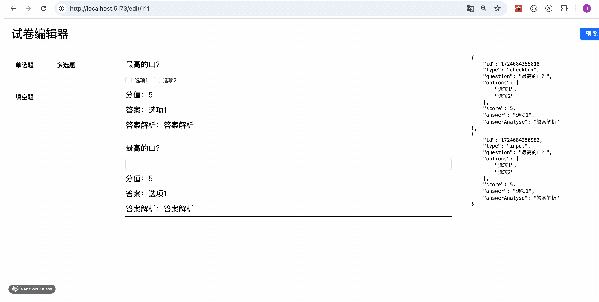

切换选中的问题的时候，有的表单值没变。

因为我们设置的是 initialValues，它只影响初始值。


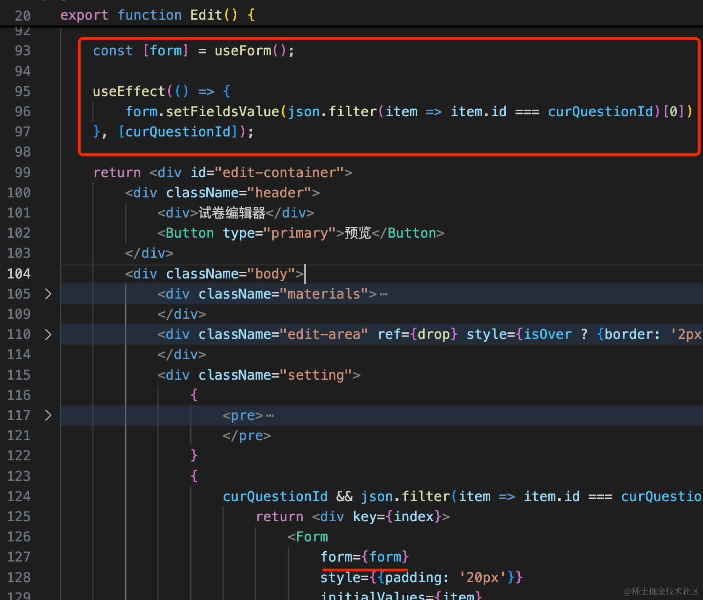

```javascript
const [form] = useForm();

useEffect(() => {
    form.setFieldsValue(json.filter(item => item.id === curQuestionId)[0])
}, [curQuestionId]);
```
做下同步就好了。

试一下：


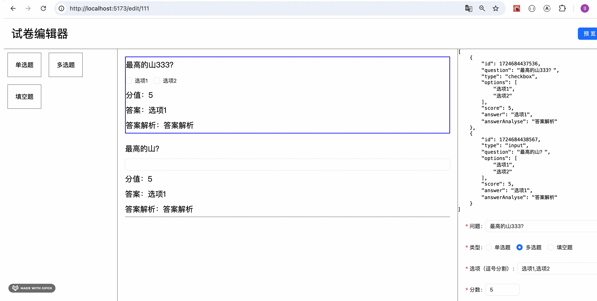

没啥问题。

然后再试下编辑：
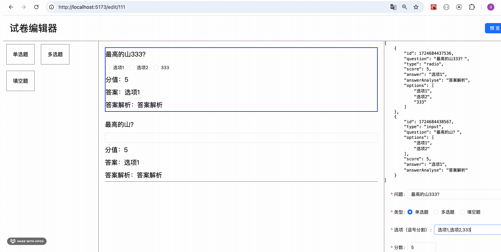

可以看到，选中的问题，会回显在表单，编辑后会同步修改对应 json。

我们再加一个 antd 的 Segmented 组件来做 Tab

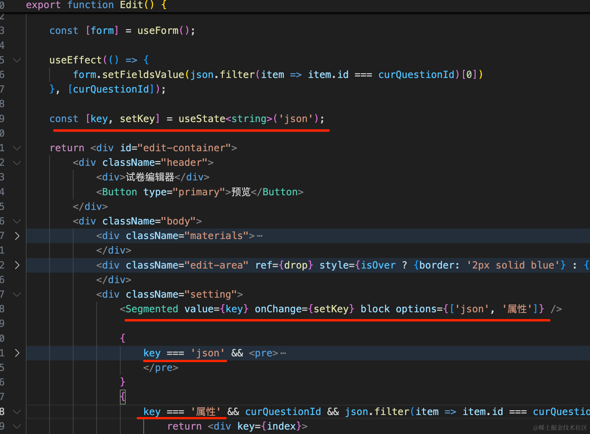

```javascript
const [key, setKey] = useState<string>('json');
```
```javascript
<Segmented value={key} onChange={setKey} block options={['json', '属性']} />
```


有了 tab 之后好看多了。

这样，试卷编辑功能就完成了。

案例代码在小册仓库：

[前端代码](https://github.com/QuarkGluonPlasma/nestjs-course-code/tree/main/exam-system-frontend)

## 总结

这节我们实现了试卷编辑器的功能。

左边是物料区，中间是画布区，右边是属性编辑区。

中间画布区就是渲染 json。

用 react-dnd 实现了拖拽，拖拽物料到中间的画布区，会在 json 中增加一条。

然后点击问题的时候会高亮，并且在右边展示编辑的表单。

编辑的时候会同步修改 json，中间画布区也会重新渲染。

当然，现在的 json 还没有保存，下节我们把它保存到数据库。


