# 166. 考试系统：答卷微服务

这节回过头来继续写答卷微服务。

首先创建答卷表：

| 字段名 | 数据类型 | 描述 |
| --- | --- | --- |
| id | INT | 答卷ID |
| answererId | INT | 答题人ID |
| examId | INT | 答卷ID |
| content | TEXT |答卷JSON |
| score | INT | 分数 |
| create_time | DATETIME | 创建时间 |
| update_time | DATETIME | 更新时间 |

改下 schema 文件：


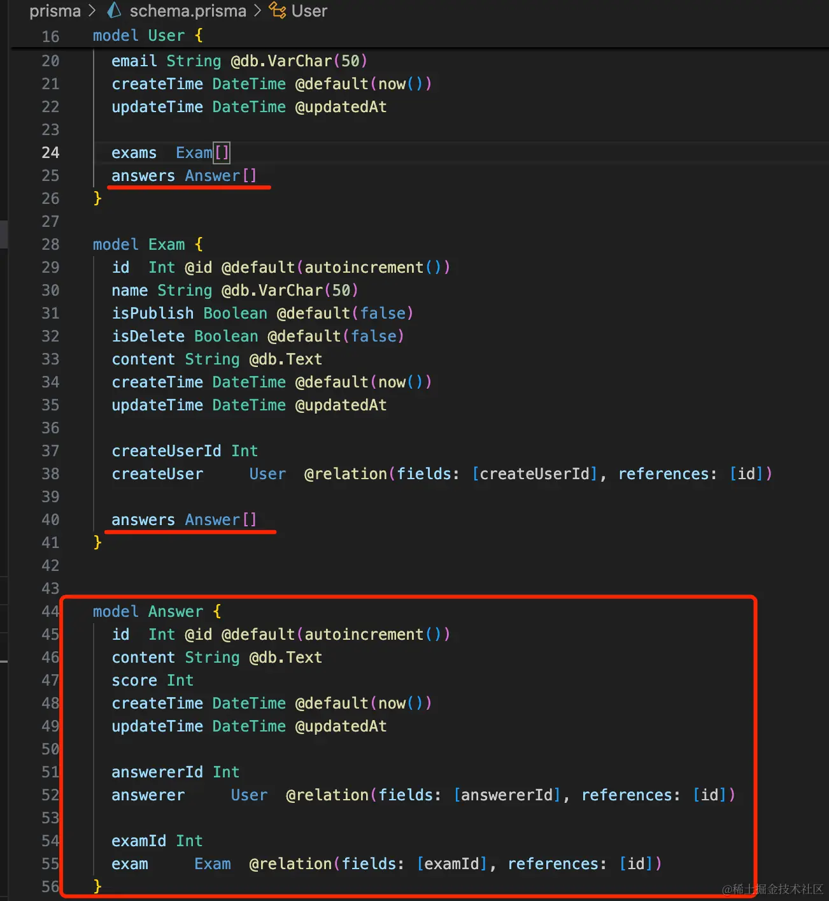
```javascript

model User {
  id  Int @id @default(autoincrement())
  username String @db.VarChar(50) @unique
  password String @db.VarChar(50)
  email String @db.VarChar(50)
  createTime DateTime @default(now())
  updateTime DateTime @updatedAt

  exams  Exam[]
  answers Answer[]
}

model Exam {
  id  Int @id @default(autoincrement())
  name String @db.VarChar(50)
  isPublish Boolean @default(false)
  isDelete Boolean @default(false)
  content String @db.Text 
  createTime DateTime @default(now())
  updateTime DateTime @updatedAt

  createUserId Int
  createUser     User  @relation(fields: [createUserId], references: [id])

  answers Answer[]
}


model Answer {
  id  Int @id @default(autoincrement())
  content String @db.Text 
  score Int
  createTime DateTime @default(now())
  updateTime DateTime @updatedAt

  answererId Int
  answerer     User  @relation(fields: [answererId], references: [id])

  examId Int
  exam     Exam  @relation(fields: [examId], references: [id])
}
```
answer 和 user 还有 exam 都是多对一关系。

所以在 User、Exam 的 modal 里都有个 answer 数组。

创建这个表：
```
npx prisma migrate dev --name answer
```
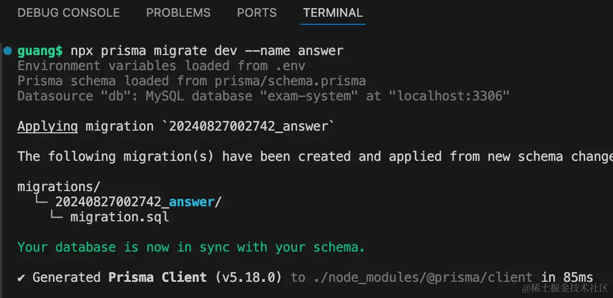


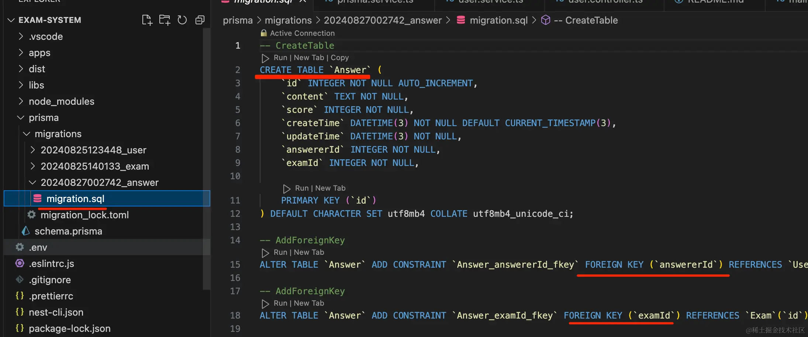

生成的 sql 没问题。

数据库里也多了这个表：


然后来实现接口：

有这些接口：

| 接口路径 | 请求方式 | 描述 |
| -- |-- |-- |
| /answer/add | POST | 添加答卷 |
| /answer/list | GET | 答卷列表 |
| /answer/export | GET | 导出答卷列表为 excel|

先实现添加答卷，在 AnswerController 加一个路由：


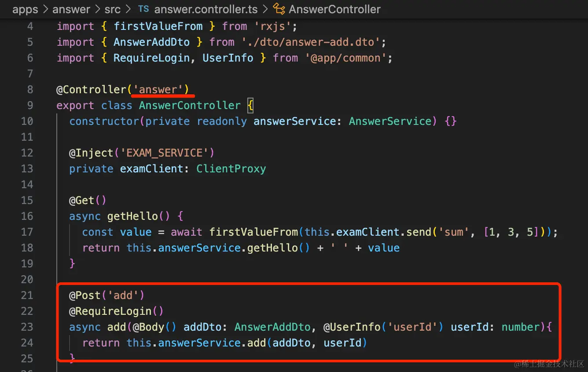

```javascript
@Post('add')
@RequireLogin()
async add(@Body() addDto: AnswerAddDto, @UserInfo('userId') userId: number){
    return this.answerService.add(addDto, userId)
}
```
创建用到的 dto：

dto/answer-add.dto.ts

```javascript
import { IsNotEmpty, IsString } from "class-validator";

export class AnswerAddDto {
    @IsNotEmpty({message: '答卷内容不能为空'})
    @IsString()
    content: string;

    @IsNotEmpty()
    examId: number;
}
```

然后在 AnswerService 实现下 add 方法：

```javascript
@Inject(PrismaService)
private prismaService: PrismaService;

async add(dto: AnswerAddDto, userId: number) {
    return this.prismaService.answer.create({
      data: {
        content: dto.content,
        score: 0,
        answerer: {
          connect: {
              id: userId
          }
        },
        exam: {
          connect: {
              id: dto.examId
          }
        }
      },
    })
}
```
这里用到了 PrismaService，并且还需要登录。

我们引入下 PrismaModule 和 CommonModule 模块，注册全局 Guard：


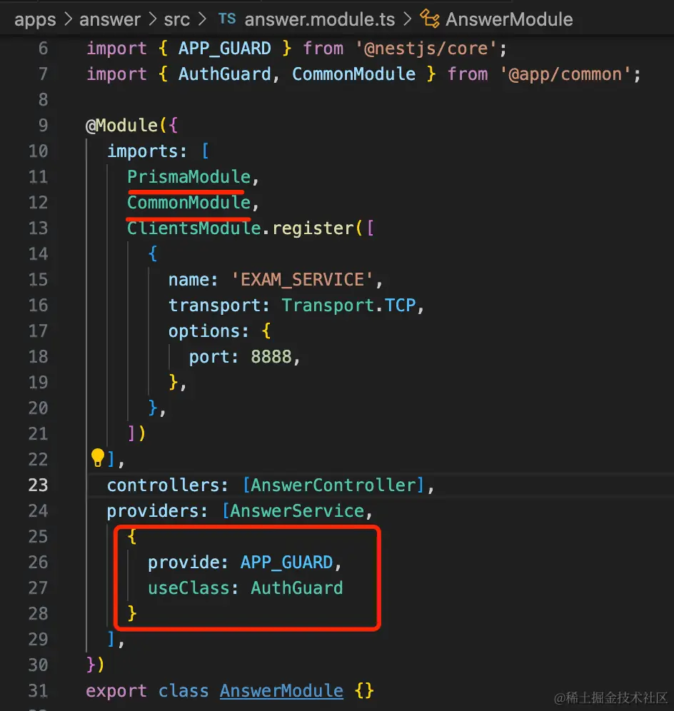

```javascript
import { Module } from '@nestjs/common';
import { AnswerController } from './answer.controller';
import { AnswerService } from './answer.service';
import { ClientsModule, Transport } from '@nestjs/microservices';
import { PrismaModule } from '@app/prisma';
import { APP_GUARD } from '@nestjs/core';
import { AuthGuard, CommonModule } from '@app/common';

@Module({
  imports: [
    PrismaModule,
    CommonModule,
    ClientsModule.register([
      {
        name: 'EXAM_SERVICE',
        transport: Transport.TCP,
        options: {
          port: 8888,
        },
      },
    ])
  ],
  controllers: [AnswerController],
  providers: [AnswerService,
    {
      provide: APP_GUARD,
      useClass: AuthGuard
    }
  ],
})
export class AnswerModule {}
```
然后在 main.ts 里启用下 ValidationPipe

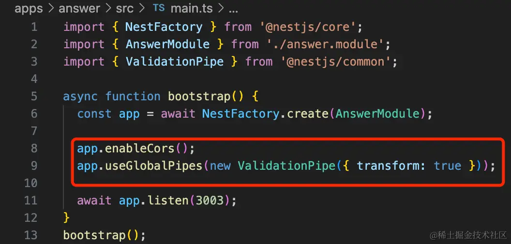

```javascript
app.enableCors();
app.useGlobalPipes(new ValidationPipe({ transform: true }));
```
把服务跑起来：

```
npm run start:dev answer
```

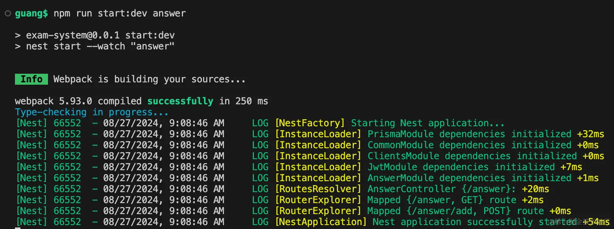

测试下：

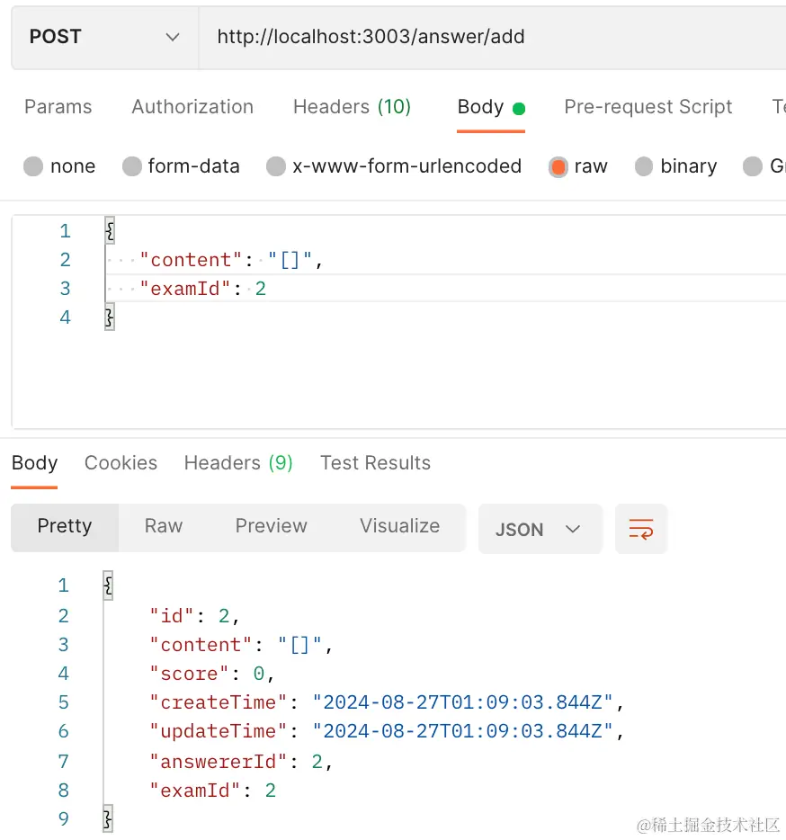

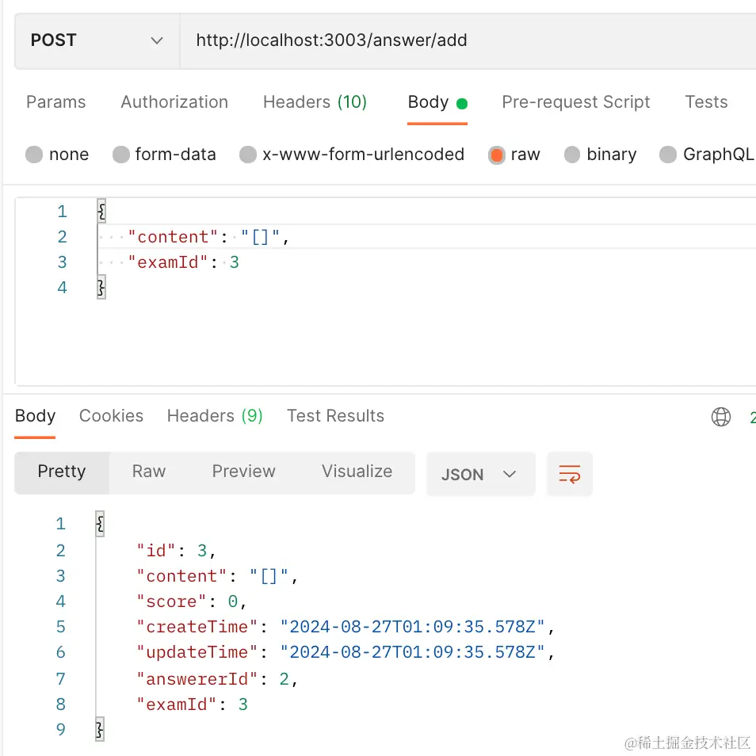


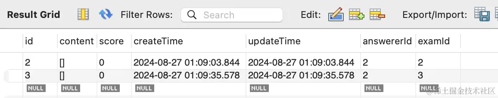

添加成功。

然后我们实现下 list 和 find 接口：

添加两个路由：

```javascript
@Get('list')
@RequireLogin()
async list(@Query('examId') examId: string){
    if(!examId) {
      throw new BadRequestException('examId 不能为空');
    }
    return this.answerService.list(+examId)
}

@Get('find/:id')
@RequireLogin()
async find(@Param('id') id: string){
    return this.answerService.find(+id)
}
```
实现下 service：

```javascript
async list(examId: number) {
    return this.prismaService.answer.findMany({
      where: {
        examId
      },
      include: {
        exam: true,
        answerer: true
      }
    })
}

async find(id: number) {
    return this.prismaService.answer.findUnique({
      where: {
        id
      },
      include: {
        exam: true,
        answerer: true
      }
    })
}
```
这里关联查出 exam 和 answerer 的信息。


测试下：

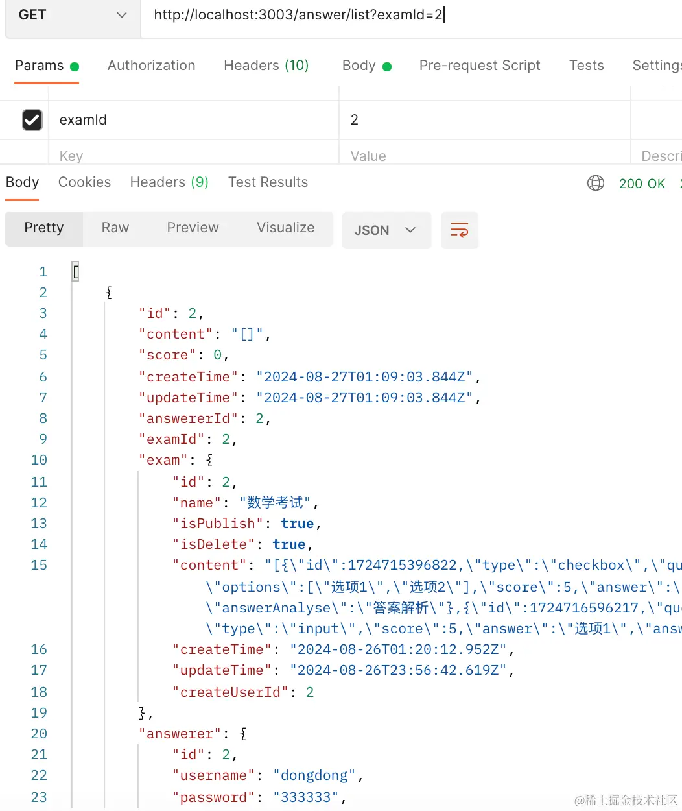

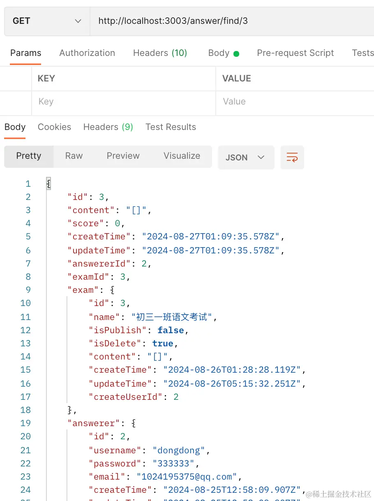

list 和 find 接口都没问题。

然后再实现导出 excel 的接口：

```javascript
@Get('export')
async export(@Query('examId') examId: string){
    if(!examId) {
      throw new BadRequestException('examId 不能为空');
    }
    return this.answerService.export(+examId)
}
```
这里用到 excel 的功能，创建个 lib：

```
nest g lib excel
```

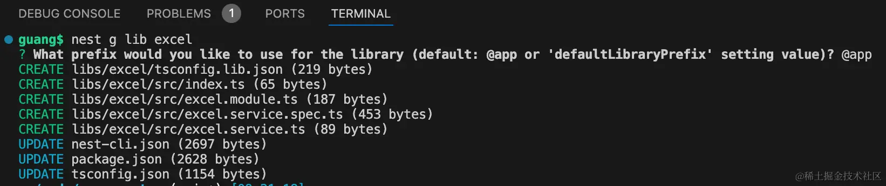

安装用到的包：

```
npm install --save exceljs
```
改下 ExcelService：

```javascript
import { Injectable, StreamableFile } from '@nestjs/common';
import { Workbook } from 'exceljs';
import { PassThrough } from 'stream';

@Injectable()
export class ExcelService {

    async export() {
        const workbook = new Workbook();

        const worksheet = workbook.addWorksheet('guang111');
    
        worksheet.columns = [
            { header: 'ID', key: 'id', width: 20 },
            { header: '姓名', key: 'name', width: 30 },
            { header: '出生日期', key: 'birthday', width: 30},
            { header: '手机号', key: 'phone', width: 50 }
        ];
    
        const data = [
            { id: 1, name: '光光', birthday: new Date('1994-07-07'), phone: '13255555555' },
            { id: 2, name: '东东', birthday: new Date('1994-04-14'), phone: '13222222222' },
            { id: 3, name: '小刚', birthday: new Date('1995-08-08'), phone: '13211111111' }
        ]
        worksheet.addRows(data);

        const stream = new PassThrough();

        await workbook.xlsx.write(stream);

        return new StreamableFile(stream, {
            type: 'application/vnd.openxmlformats-officedocument.spreadsheetml.sheet',
            disposition: 'attachment; filename=exported-data.xlsx'
        });
    }
}
```
这里 stream 是 node 内置模块，new PassThrough 创建一个流。

然后返回 StreamalbeFile，这个处理了 transfer-encoding:chunked，也就是支持流式传输。

在 answer 微服务引入这个模块：


```javascript
@Inject(ExcelService)
excelService: ExcelService;

@Get('export')
async export(@Query('examId') examId: string){
    if(!examId) {
      throw new BadRequestException('examId 不能为空');
    }

    return this.excelService.export()
}

```
试一下：


导出成功。

然后我们传入具体的参数：

```javascript
import { Injectable, StreamableFile } from '@nestjs/common';
import { Column, Workbook } from 'exceljs';
import { PassThrough } from 'stream';

@Injectable()
export class ExcelService {

    async export(columns: Partial<Column>[], data: Array<Record<string, any>>, filename: string) {
        const workbook = new Workbook();

        const worksheet = workbook.addWorksheet('guang111');
    
        worksheet.columns = columns;

        worksheet.addRows(data);

        const stream = new PassThrough();

        await workbook.xlsx.write(stream);

        return new StreamableFile(stream, {
            type: 'application/vnd.openxmlformats-officedocument.spreadsheetml.sheet',
            disposition: 'attachment; filename=' + filename
        });
    }
}
```
传入 columns、data 和 filename，来动态生成 excel。

调用的地方传下参数：

```javascript
@Get('export')
async export(@Query('examId') examId: string){
    if(!examId) {
      throw new BadRequestException('examId 不能为空');
    }

    const data = await this.answerService.list(+examId);

    const columns = [
        { header: 'ID', key: 'id', width: 20 },
        { header: '分数', key: 'score', width: 30 },
        { header: '答题人', key: 'answerer', width: 30 },
        { header: '试卷', key: 'exam', width: 30 },
        { header: '创建时间', key: 'createTime', width: 30},
    ]

    const res = data.map(item => {
      return {
        id: item.id,
        score: item.score,
        answerer: item.answerer.username,
        exam: item.exam.name,
        createTime: item.createTime
      }
    })
    return this.excelService.export(columns, res, 'answers.xlsx')
}
```
试一下：

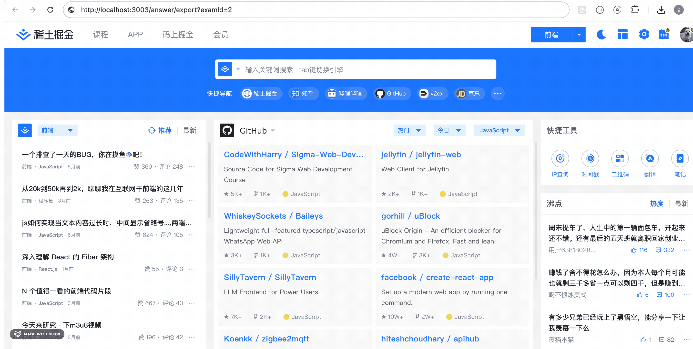

导出成功。

案例代码在小册仓库：

[后端代码](https://github.com/QuarkGluonPlasma/nestjs-course-code/tree/main/exam-system)

## 总结

这节我们实现了答卷微服务，包括创建答卷、答卷列表、答卷详情接口，导出答卷列表 excel。

并且封装了 excel 的 lib。

这样，答卷微服务就完成了。
