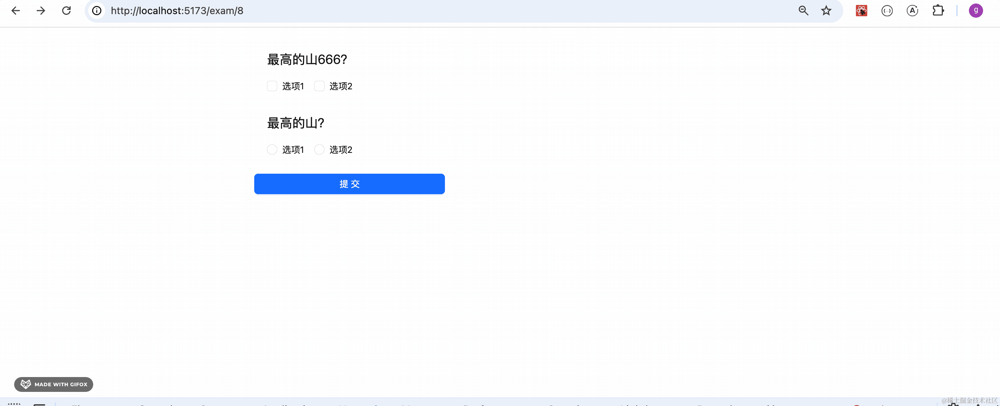
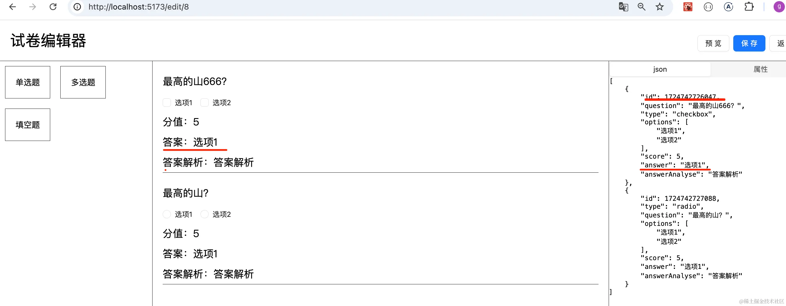
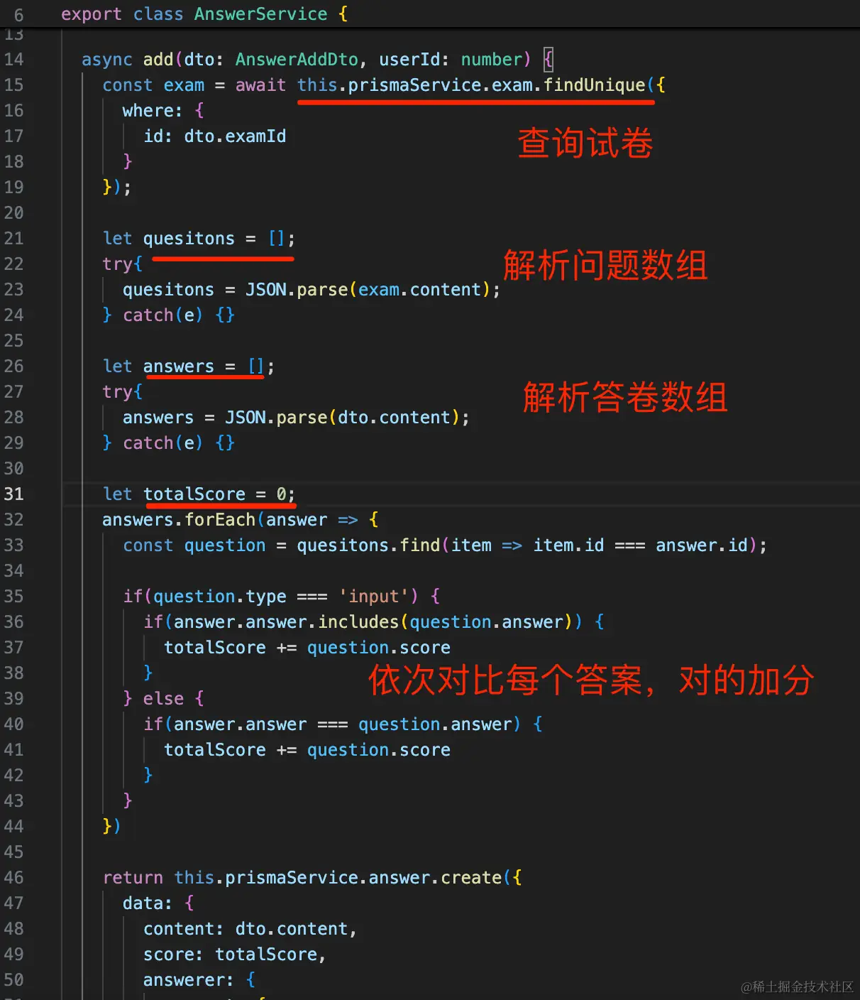
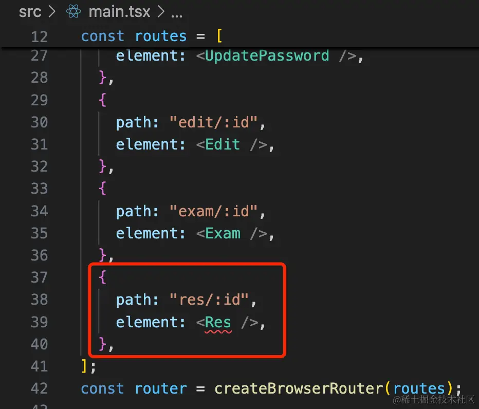
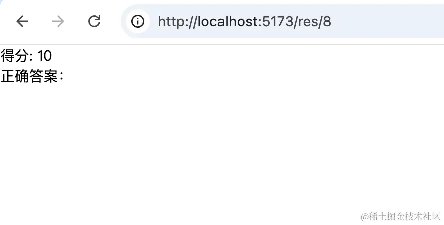
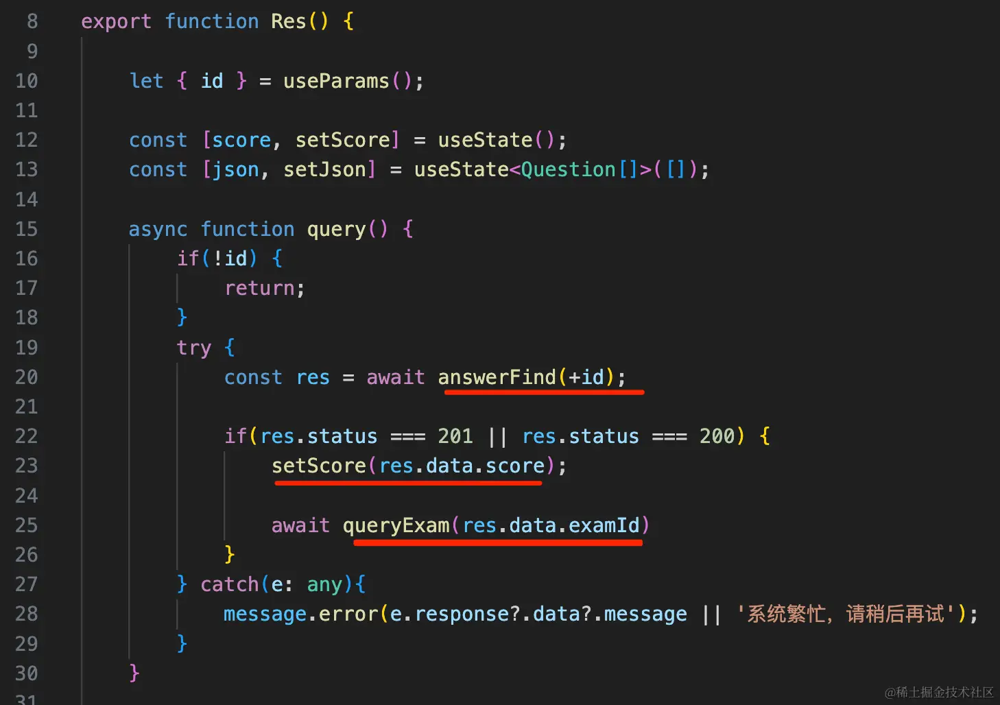
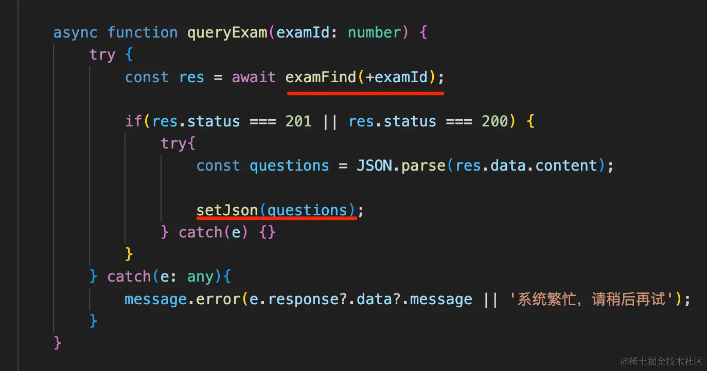
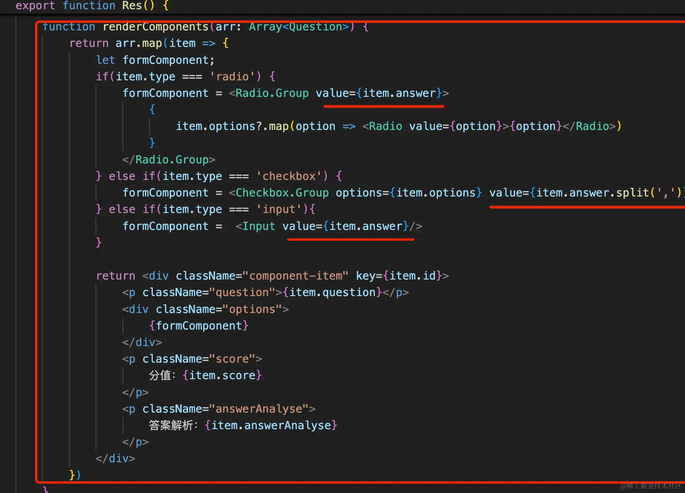
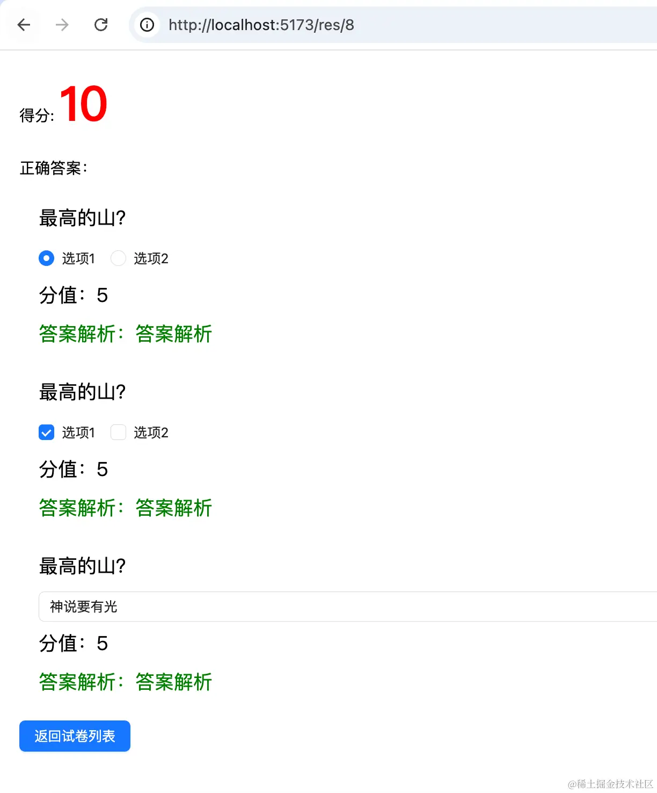

# 168. 考试系统：自动判卷

上节实现了答卷的提交，但是提交之后的分数页面还没写：



这节来写一下。

我们现在并没有做分数的计算：


答卷表里的 score 都是 0

那怎么实现分数的计算呢？

也很简单，每个试卷的内容保存在 exam 表里，并且都保存了正确答案。

我们只要根据 id 和 answer 表里的答案对比下就知道了：




改下 AnswerService 的 add 方法：



```javascript
async add(dto: AnswerAddDto, userId: number) {
  const exam = await this.prismaService.exam.findUnique({
    where: {
      id: dto.examId
    }
  });

  let quesitons = [];
  try{
    quesitons = JSON.parse(exam.content);
  } catch(e) {}

  let answers = [];
  try{
    answers = JSON.parse(dto.content);
  } catch(e) {}
  
  let totalScore = 0;
  answers.forEach(answer => {
    const question = quesitons.find(item => item.id === answer.id);

    if(question.type === 'input') {
      if(answer.answer.includes(question.answer)) {
        totalScore += question.score
      }
    } else {
      if(answer.answer === question.answer) {
        totalScore += question.score
      }
    }
  })

  return this.prismaService.answer.create({
    data: {
      content: dto.content,
      score: totalScore,
      answerer: {
        connect: {
            id: userId
        }
      },
      exam: {
        connect: {
            id: dto.examId
        }
      }
    },
  })
}
```
测试下：

新建试卷，进入编辑器：


每种类型问题添加一个：


点击保存后，去答卷：


可以看到，计算出的分数是对的：


然后我们写下结果页面，显示下分数：



```javascript
{
    path: "res/:id",
    element: <Res />,
},
```
创建 pages/Res/index.tsx

```javascript
import { Link, useParams } from "react-router-dom";
import { useEffect } from "react";

export function Res() {

    let { id } = useParams();

    async function query() {
        if(!id) {
            return;
        }

    }

    useEffect(() => {
        query();        
    }, [])

    return <div id="res-container">
        <div>
            得分: 10
        </div>
        <div>
            正确答案：
        </div>
    </div>
}
```



在 interface/index.tsx 添加 find 接口：

```javascript
export async function answerFind(id: number) {
    return await answerServiceInstance.get('/answer/find/' + id);
}
```
调用下：



根据 id 查询答卷，设置 score。

并且根据 examId 查询下试卷：



渲染 json 的逻辑和编辑器一样，只不过 value 直接指定为正确答案：





```javascript
import { Link, useParams } from "react-router-dom";
import { useEffect, useState } from "react";
import { answerFind, examFind } from "../../interfaces";
import { Button, Checkbox, Input, message, Radio } from "antd";
import { Question } from "../Edit";
import './index.scss';

export function Res() {

    let { id } = useParams();

    const [score, setScore] = useState();
    const [json, setJson] = useState<Question[]>([]);

    async function query() {
        if(!id) {
            return;
        }
        try {
            const res = await answerFind(+id);

            if(res.status === 201 || res.status === 200) {
                setScore(res.data.score);

                await queryExam(res.data.examId)
            } 
        } catch(e: any){
            message.error(e.response?.data?.message || '系统繁忙，请稍后再试');
        }
    }

    async function queryExam(examId: number) {
        try {
            const res = await examFind(+examId);

            if(res.status === 201 || res.status === 200) {
                try{
                    const questions = JSON.parse(res.data.content);

                    setJson(questions);
                } catch(e) {}
            } 
        } catch(e: any){
            message.error(e.response?.data?.message || '系统繁忙，请稍后再试');
        }
    }

    useEffect(() => {
        query();        
    }, [])

    function renderComponents(arr: Array<Question>) {
        return arr.map(item => {
            let formComponent;
            if(item.type === 'radio') {
                formComponent = <Radio.Group value={item.answer}>
                    {
                        item.options?.map(option => <Radio value={option}>{option}</Radio>)
                    }
                </Radio.Group>
            } else if(item.type === 'checkbox') {
                formComponent = <Checkbox.Group options={item.options} value={item.answer.split(',')}/>
            } else if(item.type === 'input'){
                formComponent =  <Input value={item.answer}/>
            }

            return <div className="component-item" key={item.id}>
                <p className="question">{item.question}</p>
                <div className="options">
                    {formComponent}
                </div>
                <p className="score">
                    分值：{item.score}
                </p>
                <p className="answerAnalyse">
                    答案解析：{item.answerAnalyse}
                </p>
            </div>
        })
    }

    return <div id="res-container">
        <div className="score-container">
            得分: <span>{score}</span>
        </div>
        <div className="answer-list">
            正确答案：{renderComponents(json)}
        </div>
        <Button type="primary"><Link to="/">返回试卷列表</Link></Button>
    </div>
}


```
index.scss
```scss
#res-container {
    padding: 20px;

    .score-container {
        span {
            font-size: 50px;
            color: red;
            font-weight: bold;
        }
        margin-bottom: 20px;
    }

    .component-item {
        margin: 20px;

        line-height: 40px;
        font-size: 20px;

        .answerAnalyse {
            color: green;
        }
    }
}
```

看下效果：



没啥问题。

我们整体试一下：


没啥问题。

案例代码在小册仓库：

[前端代码](https://github.com/QuarkGluonPlasma/nestjs-course-code/tree/main/exam-system-frontend)

[后端代码](https://github.com/QuarkGluonPlasma/nestjs-course-code/tree/main/exam-system)

## 总结

这节我们实现了自动判卷，其实就是根据 id 一一对比试卷里的正确答案和答卷里的答案。

然后实现了结果页面，查询判卷的分数还有试卷的正确答案。

这样，从新建试卷、编辑试卷、答卷、到自动判卷的流程就完成了。
