# 169. 考试系统：分析微服务、排行榜页面

这节来写下分析的微服务。

主要是排行榜的接口：

| 接口路径 | 请求方式 | 描述 |
| -- |-- |-- |
| /analyse/ranking | GET | 成绩排行榜 |

只要涉及到排行榜，一般都是用 redis 的 zset （有序集合）来做。

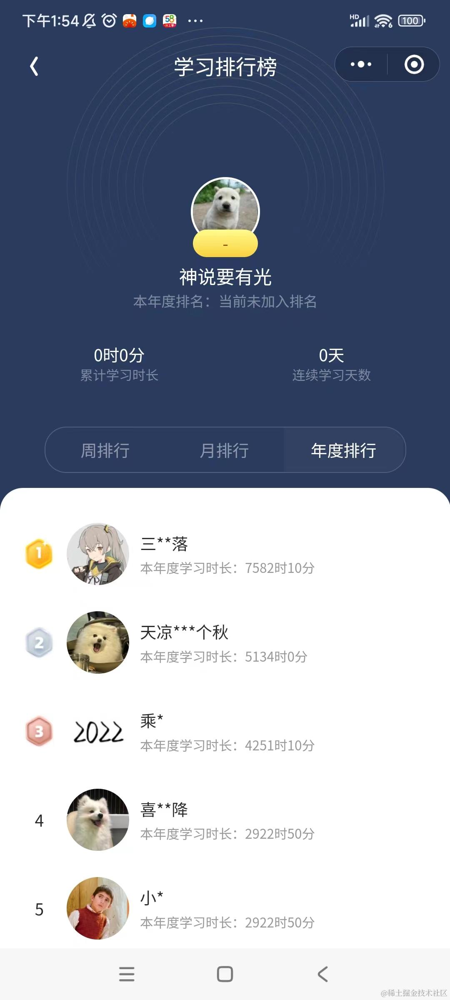

而且 zset 可以用 zuion 取并集来合并。

日榜合并就是周榜，周榜合并就是月榜，月榜合并就是年榜。

简单回顾下 zset 的命令：

**ZADD**：往集合中添加成员

**ZREM**：从集合中删除成员

**ZCARD**：集合中的成员个数

**ZSCORE**：某个成员的分数

**ZINCRBY**：增加某个成员的分数

**ZRANK**：成员在集合中的排名

**ZRANGE**：打印某个范围内的成员

**ZRANGESTORE**：某个范围内的成员，放入新集合

**ZCOUNT**：集合中分数在某个返回的成员个数

**ZDIFF**：打印两个集合的差集

**ZDIFFSTORE**：两个集合的差集，放入新集合

**ZINTER**：打印两个集合的交集

**ZINTERSTORE**：两个集合的交集，放入新集合

**ZINTERCARD**：两个集合的交集的成员个数

**ZUNION**：打印两个集合的并集

**ZUNIONSTORE**：两个集合的并集，放回新集合

我们实现分数的排行榜就是用 ZADD 添加成员，然后用 ZRANGE 取前面的成员就好了，zset 会自动排序。

默认是分数从小到大排序，也可以从大到小，加个 REV 就行：

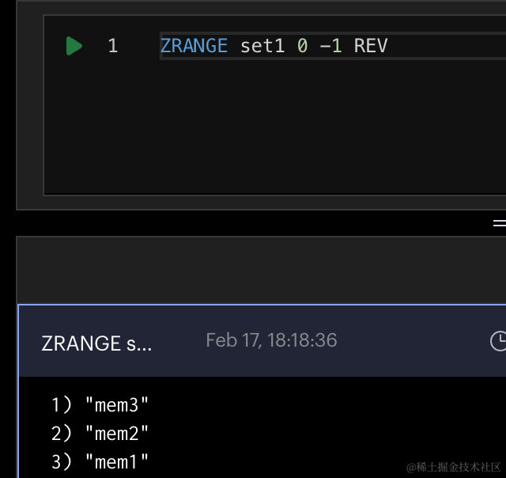

改下 RedisService 添加 zAdd、zRankingList、zScore 方法：

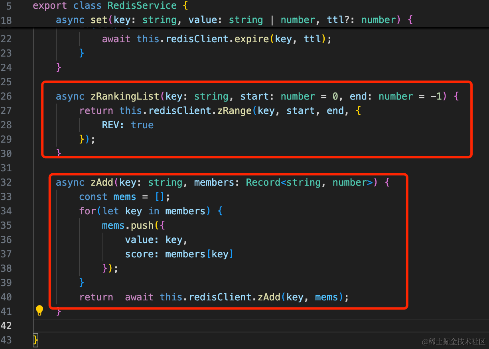

zRankingList 查询排行榜成员，加上 REV 是按分数从大到小排。

```javascript
async zRankingList(key: string, start: number = 0, end: number = -1) {
    return this.redisClient.zRange(key, start, end, {
        REV: true
    });
}

async zAdd(key: string, members: Record<string, number>) {
    const mems = [];
    for(let key in members) {
        mems.push({
            value: key,
            score: members[key]
        });        
    }
    return  await this.redisClient.zAdd(key, mems);
}
```

然后我们在 analyse 微服务里引入下 RedisModule：

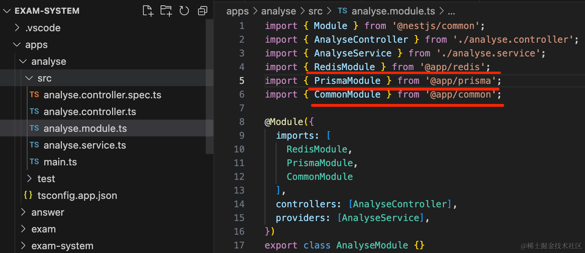

顺便引入下 PrismaModule 和 CommonModule。

然后加个路由：

```javascript
import { BadRequestException, Controller, Get, Query } from '@nestjs/common';
import { AnalyseService } from './analyse.service';

@Controller()
export class AnalyseController {
  constructor(private readonly analyseService: AnalyseService) {}

  @Get()
  getHello(): string {
    return this.analyseService.getHello();
  }

  @Get('ranking')
  async ranking(@Query('examId') examId: string) {
    if(!examId) {
      throw new BadRequestException('examId 不能为空')
    }
    return this.analyseService.ranking(+examId)
  }
}
```
然后在 service 里实现下排行榜：

```javascript
import { PrismaService } from '@app/prisma';
import { RedisService } from '@app/redis';
import { Inject, Injectable } from '@nestjs/common';

@Injectable()
export class AnalyseService {
  getHello(): string {
    return 'Hello World!';
  }

  @Inject(PrismaService)
  prismaService: PrismaService;

  @Inject(RedisService)
  redisService: RedisService;

  async ranking(examId: number) {
    const answers = await this.prismaService.answer.findMany({
      where: {
        examId
      }
    });

    for(let i = 0; i< answers.length; i++) {
      await this.redisService.zAdd('ranking:' + examId, {
        [answers[i].id]: answers[i].score
      })
    }
    return this.redisService.zRankingList('ranking:' + examId, 0, 10)
  }
}
```
查询 examId 对应的答卷数据，用 zAdd 加到对应的榜单里，然后返回榜单前 10 名。

把服务跑起来：

```
npm run start:dev analyse
```
测试下：


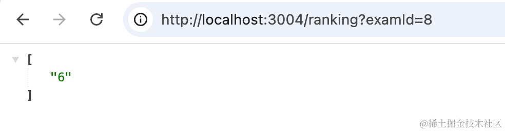


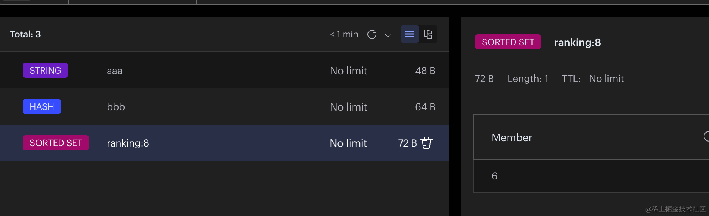

当然，现在答卷不多。

我们再登录两个账号做一下试卷：


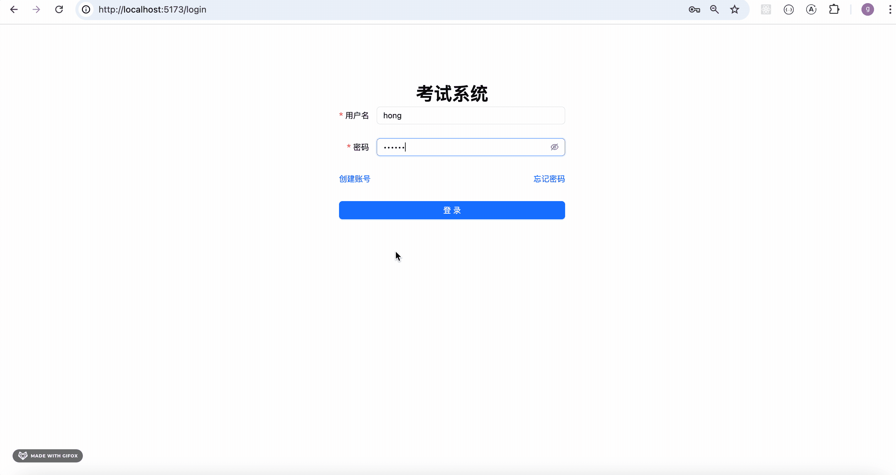

然后再调用下 ranking 接口：


现在只返回了 id，我们返回下详细信息。


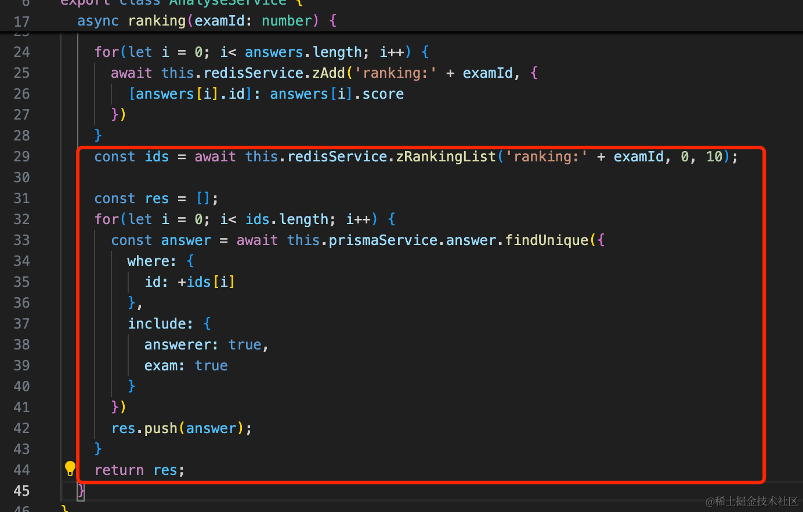

```javascript
async ranking(examId: number) {
  const answers = await this.prismaService.answer.findMany({
    where: {
      examId
    }
  });

  for(let i = 0; i< answers.length; i++) {
    await this.redisService.zAdd('ranking:' + examId, {
      [answers[i].id]: answers[i].score
    })
  }
  const ids = await this.redisService.zRankingList('ranking:' + examId, 0, 10);

  const res = [];
  for(let i = 0; i< ids.length; i++) {
    const answer = await this.prismaService.answer.findUnique({
      where: {
        id: +ids[i]
      },
      include: {
        answerer: true,
        exam: true
      }
    })
    res.push(answer);
  }
  return res;
}
```
include 关联查询答题者和试卷的信息，一起返回。

测试下：

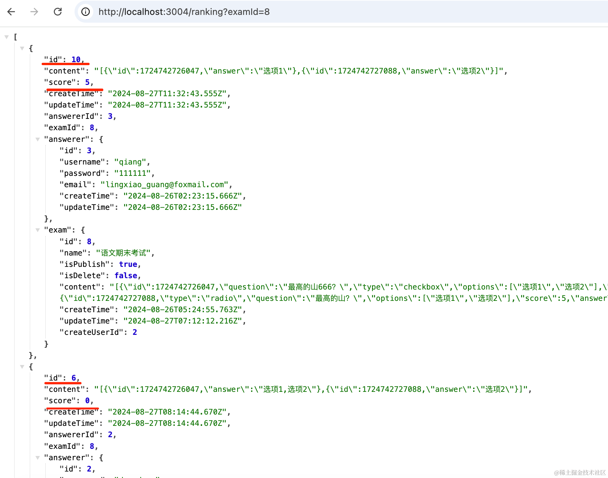

这样就返回了排行榜的详细信息。

加下前缀：
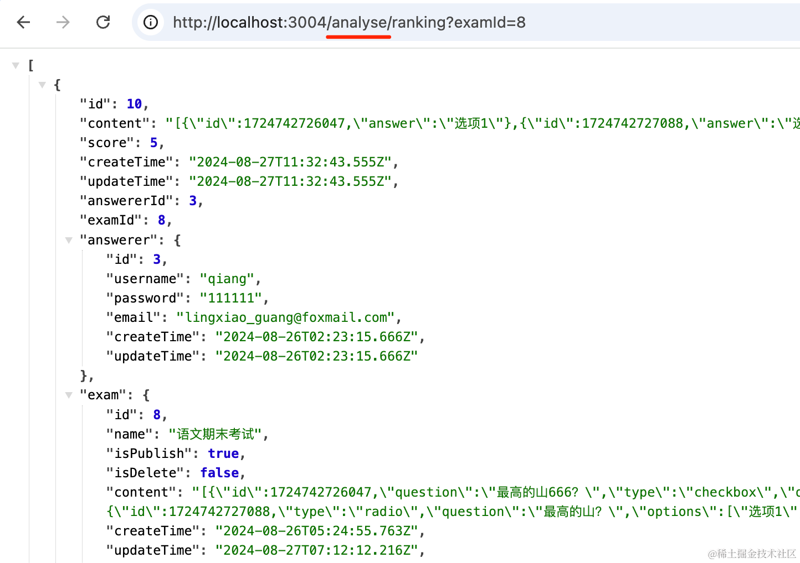

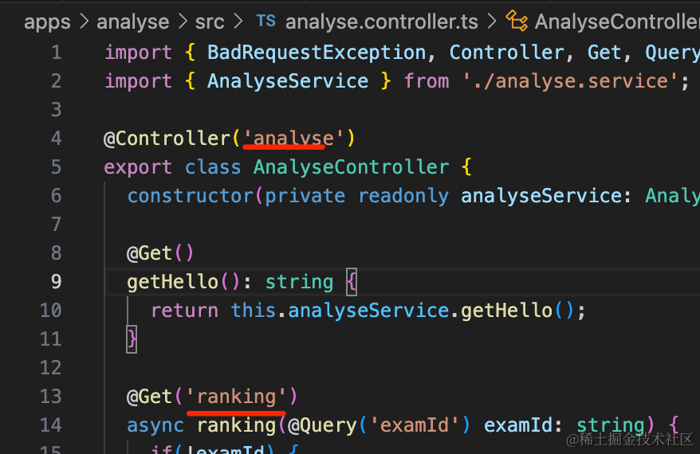

加一下 AuthGuard 做下登录鉴权：

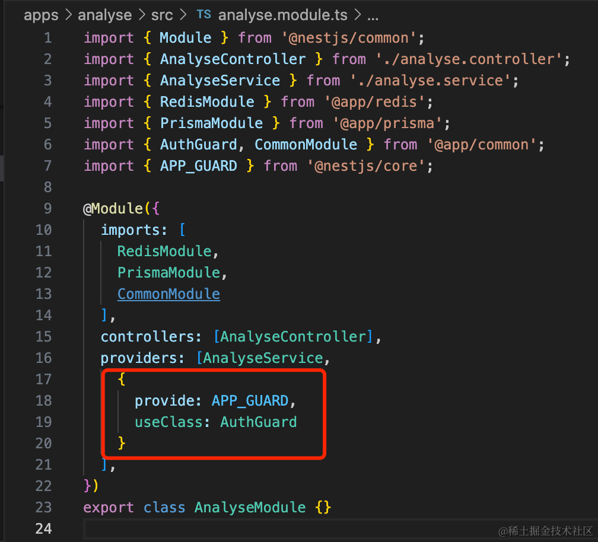
```javascript
{
  provide: APP_GUARD,
  useClass: AuthGuard
}
```
支持下跨域：


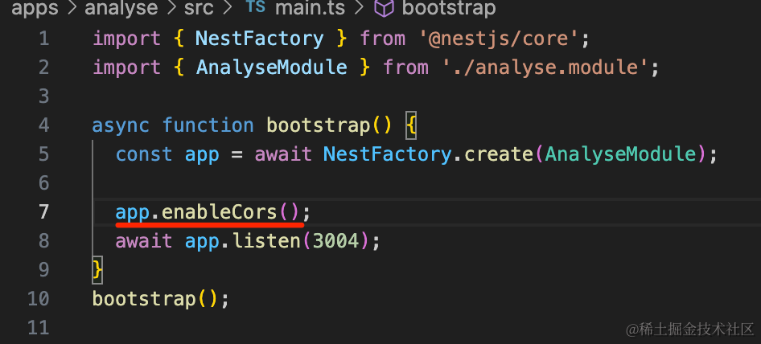

然后写下前端页面：

在 interfaces/index.tsx 加一下这个接口：

```javascript
const analyseServiceInstance = axios.create({
    baseURL: 'http://localhost:3004/',
    timeout: 3000
});

analyseServiceInstance.interceptors.request.use(requestInterceptor)

analyseServiceInstance.interceptors.response.use(
    responseIntercepor, 
    responseErrorIntercepor
)

export async function ranking(examId: number) {
    return await answerServiceInstance.get('/analyse/ranking', {
        params: {
            examId
        }
    });
}
```
写个 Modal

pages/ExamList/RankingModal.tsx

```javascript
import { Button, Form, Input, Modal, Table, TableColumnsType, message } from "antd";
import { useEffect, useState } from "react";
import { ranking } from "../../interfaces";


interface RankingModalProps {
    isOpen: boolean;
    handleClose: Function
    examId?: number
}

export function RankingModal(props: RankingModalProps) {

    const [list, setList] = useState([]);

    useEffect(() => {
        query();
    }, [props.examId]);

    async function query(){
        if(!props.examId) {
            return;
        }
        try{
            const res = await ranking(props.examId);

            if(res.status === 201 || res.status === 200) {
                setList(res.data);
            }
        } catch(e: any){
            message.error(e.response?.data?.message || '系统繁忙，请稍后再试');
        }
    }

    const columns: TableColumnsType = [
        {
            title: '名字',
            key: 'name',
            render: (_, record) => (
                <div>
                    {record.answerer.username}
                </div>
            )
          },
          {
            title: '分数',
            dataIndex: 'score',
            key: 'score',
          }
    ]

    return <Modal 
        title="排行榜"
        open={props.isOpen}
        onOk={() => props.handleClose()}
        onCancel={() => props.handleClose()}
        okText={'确认'}
        cancelText={'取消'}    
    >

        <Table dataSource={list} columns={columns} />;

    </Modal>
}
```
传入 examId 参数，查询对应的排行榜信息。

用 table 渲染返回的列表。

引入下：


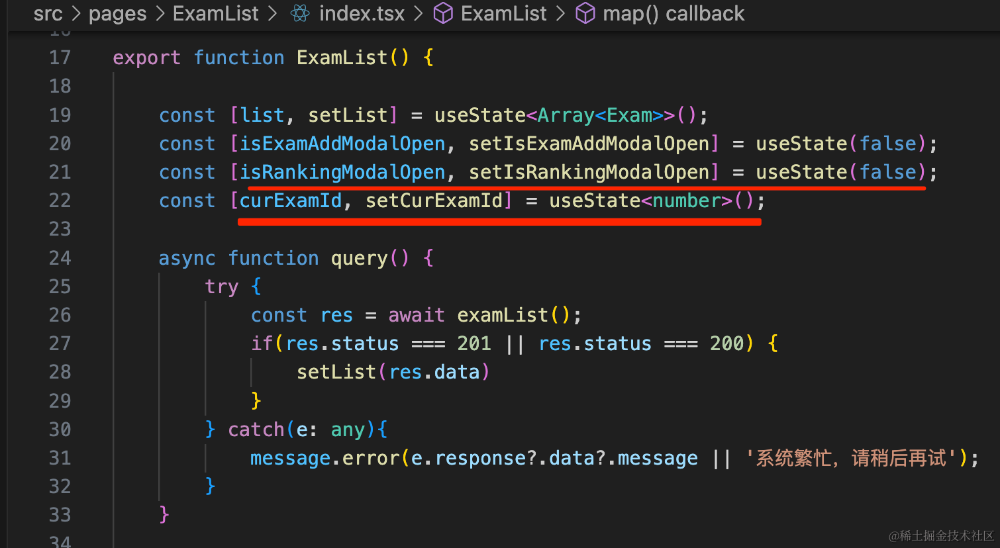


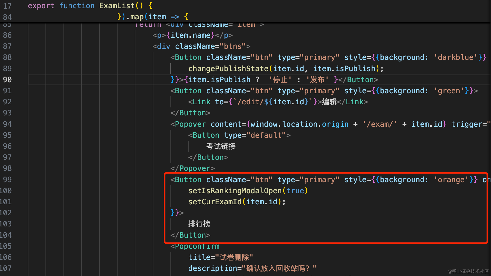


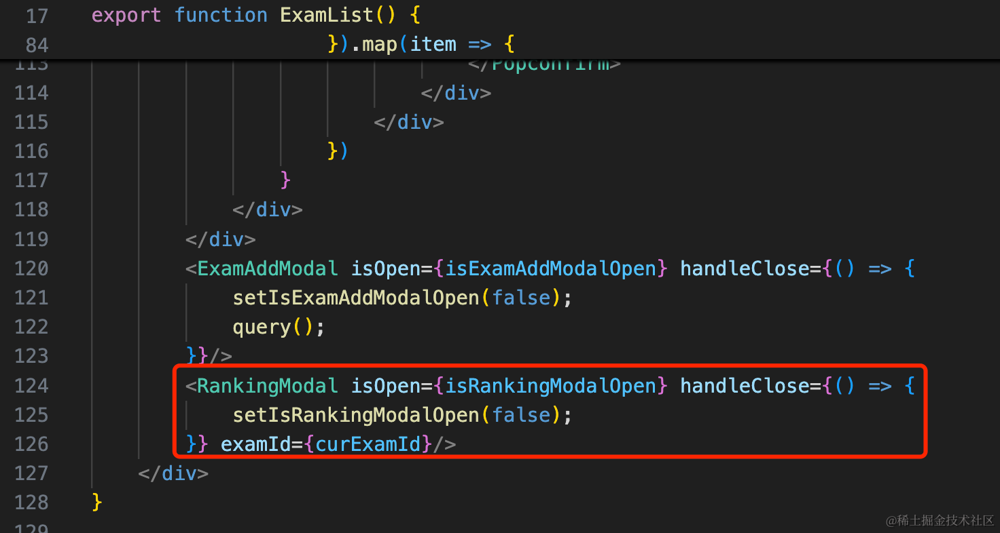

```javascript
const [isRankingModalOpen, setIsRankingModalOpen] = useState(false);
const [curExamId, setCurExamId] = useState<number>();
```
```javascript
<Button className="btn" type="primary" style={{background: 'orange'}} onClick={() => {
    setIsRankingModalOpen(true)
    setCurExamId(item.id);
}}>
    排行榜
</Button>
```
```javascript
<RankingModal isOpen={isRankingModalOpen} handleClose={() => {
    setIsRankingModalOpen(false);
}} examId={curExamId}/>
```
加一个 curExamId 记录当前的考试 id。

然后加一个 state 来切换弹窗的打开状态。

测试下：


这样，排行榜功能就完成了。

之前还有个下载所有答卷 excel 的功能没有接入。

加个按钮：


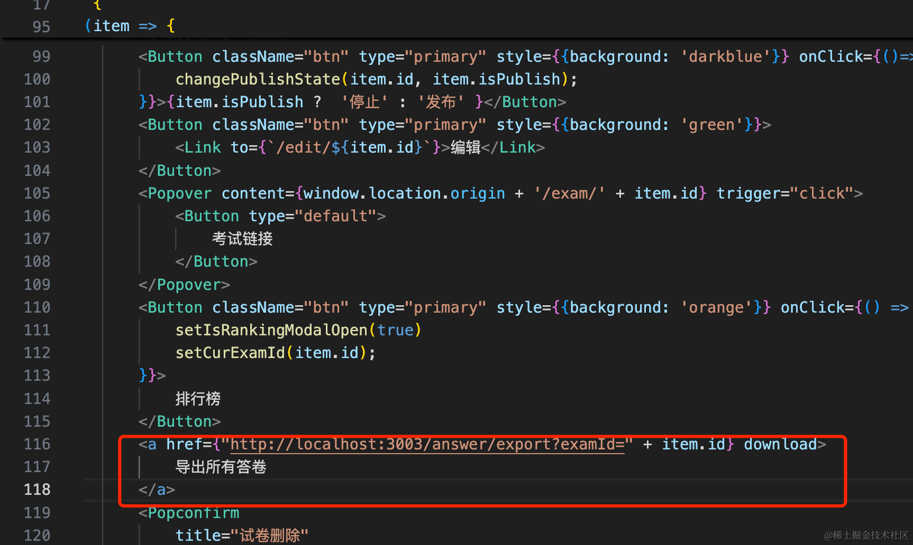

```javascript
<a href={"http://localhost:3003/answer/export?examId=" + item.id} download>
    导出所有答卷
</a>
```


案例代码在小册仓库：

[前端代码](https://github.com/QuarkGluonPlasma/nestjs-course-code/tree/main/exam-system-frontend)

[后端代码](https://github.com/QuarkGluonPlasma/nestjs-course-code/tree/main/exam-system)

## 总结

这节我们实现了排行榜的功能。

排行榜的功能基于 redis 的 zset 实现，用 zadd 往其中添加元素，用 zrang 取排好序的前多少个元素，加上 REV 就是按照分数从大到小排序。

然后加了一个弹窗来展示排行榜。

这样，问卷系统的全部功能就完成了。
