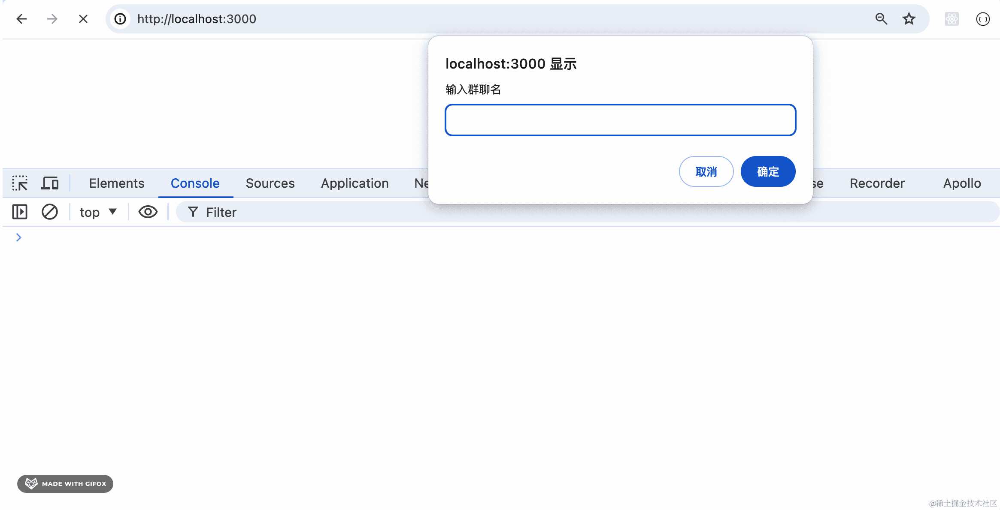
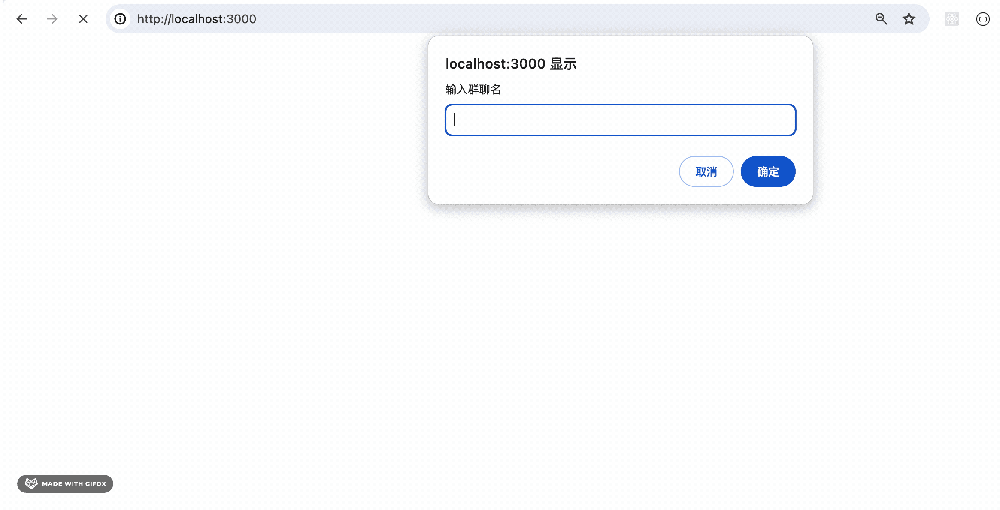

# 174. 基于 Socket.io 的 room 实现群聊

上节学了 Nest 里如何创建 WebSocket 服务，这节我们实现下群聊功能。

微信我们可以在不同的群聊里聊天：


如何实现这种功能呢？

这就要用到 socket.io 的 room 功能了。

socket.io 支持加入房间：

```javascript
socket.join('room666')
```
可以向对应房间发消息：

```javascript
serveer.to("room666").emit("新成员加入了群聊")
```


这样就实现了群聊功能。

我们来写一下：

```
nest new group-chat-room
```


进入项目，安装 websocket 的包：
```
npm i --save @nestjs/websockets @nestjs/platform-socket.io socket.io
```
然后创建个 websocket 模块：

```
nest g resource chatroom
```


注意，选择生成 WebSockets 类型的代码。

这样，基于 websocket 的 crud 代码就生成了：


这些我们上节写过。

在 main.ts 里支持下 pages 这个静态目录的访问：

```javascript
import { NestApplication, NestFactory } from '@nestjs/core';
import { AppModule } from './app.module';
import { NestExpressApplication } from '@nestjs/platform-express';

async function bootstrap() {
  const app = await NestFactory.create<NestExpressApplication>(AppModule);

  app.useStaticAssets('pages');
  await app.listen(3000);
}
bootstrap();
```

创建 pages/index.html


```html
<html>
  <head>
    <script src="https://cdn.socket.io/4.3.2/socket.io.min.js"></script>
    <script>
      const socket = io('http://localhost:3000');
      socket.on('connect', function() {
        console.log('Connected');

        socket.emit('findAllChatroom', function(data) {
            console.log('allChatroom', data);
        });
      });
      socket.on('disconnect', function() {
        console.log('Disconnected');
      });
    </script>
  </head>

  <body></body>
</html>

```
把服务跑起来：

```
npm run start:dev
```


浏览器访问下：


打印了返回的消息。

然后我们实现下房间的功能：

```javascript
import { MessageBody,SubscribeMessage, WebSocketGateway, WebSocketServer } from '@nestjs/websockets';
import { Server, Socket } from 'socket.io';

@WebSocketGateway()
export class ChatroomGateway {
  @WebSocketServer() server: Server;

  @SubscribeMessage('joinRoom')
  joinRoom(client: Socket, room: string): void {
    console.log(room);
    client.join(room);
    this.server.to(room).emit('message', `新用户加入了 ${room} 房间`);
  }

  @SubscribeMessage('sendMessage')
  sendMessage(client: Socket, payload: any): void {
    console.log(payload);
    this.server.to(payload.room).emit('message', payload.message);
  }
}
```
添加一个 joinRoom 的路由，它接收 room 参数，把 client 加入对应房间。

然后给这个房间发送一个欢迎消息。

然后加一个 sendMessage 的路由，接收房间和消息，可以给对应 room 发送消息。

之前我们都是这样取消息：


这两种是等价写法：


然后我们在客户端也加入 room 功能：

```javascript
<html>
  <head>
    <script src="https://cdn.socket.io/4.3.2/socket.io.min.js"></script>
    <script>
        const roomName = prompt('输入群聊名');
        if(roomName) {
            const socket = io('http://localhost:3000');
            socket.on('connect', function() {
                console.log('Connected');

                socket.emit('joinRoom', roomName);

                socket.on('message', (message) => {
                    console.log('收到来自房间的消息:', message);
                });

                socket.emit('sendMessage', { room: roomName, message: 'Hello, everyone!' });
            });
            socket.on('disconnect', function() {
                console.log('Disconnected');
            });
        } else {
            alert('请输入群聊名');
        }
    </script>
  </head>

  <body></body>
</html>
```
进入页面首先输入群聊名，然后加入对应房间，并发一个消息。

测试下：

打开页面，进入 aaa 房间，发送了一条消息：


再打开一个页面，进入 aaa 房间：


这时候之前那个房间就有 2 条消息了：


再打开一个页面，进入 bbb 房间，这时候之前的 aaa 房间并没有收到消息：


这样，群聊房间功能就实现了。

我们再完善一下：

首先 payload 都传入 room 和 nickName。


```javascript
import { MessageBody,SubscribeMessage, WebSocketGateway, WebSocketServer } from '@nestjs/websockets';
import { Server, Socket } from 'socket.io';

@WebSocketGateway()
export class ChatroomGateway {
  @WebSocketServer() server: Server;

  @SubscribeMessage('joinRoom')
  joinRoom(client: Socket, payload: any): void {
    console.log(payload.roomName);
    client.join(payload.roomName);
    this.server.to(payload.roomName).emit('message', {
      nickName: payload.nickName,
      message: `${payload.nickName} 加入了 ${payload.roomName} 房间`
    });
  }

  @SubscribeMessage('sendMessage')
  sendMessage(@MessageBody() payload: any): void {
    console.log(payload);
    this.server.to(payload.room).emit('message', { nickName: payload.nickName, message: payload.message});
  }
}
```

然后改下 client：

```javascript
<html>
  <head>
    <script src="https://cdn.socket.io/4.3.2/socket.io.min.js"></script>
  </head>
  <body>

    <div id="messageBox">
    </div>

    <input id="messageInput"/>
    <button id="sendMessage">发送</button>

    <script>
        const messageBox = document.getElementById('messageBox');
        const messageInput = document.getElementById('messageInput');
        const sendMessage = document.getElementById('sendMessage');

        const roomName = prompt('输入群聊名');
        const nickName = prompt('输入昵称');
        if(roomName && nickName) {
            const socket = io('http://localhost:3000');
            socket.on('connect', function() {
                console.log('Connected');

                socket.emit('joinRoom', { roomName, nickName});

                socket.on('message', (payload) => {
                    console.log('收到来自房间的消息:', payload);

                    const item = document.createElement('div');
                    item.className = 'message'
                    item.textContent = payload.nickName + ':  ' + payload.message;
                    messageBox.appendChild(item);
                });
            });

            sendMessage.onclick = function() {
                socket.emit('sendMessage', { room: roomName, nickName, message: messageInput.value });
            }

            socket.on('disconnect', function() {
                console.log('Disconnected');
            });
        }
    </script>
  </body>
</html>
```
进入页面输入群聊名和昵称。

加上 messageBox 用于显示消息。

在输入框输入内容，点击的时候发送消息。

测试下：

打开一个页面发消息：


再打开一个页面：



可以看到，另一个页面也收到消息了，因为这俩在一个房间。

我们进入其他房间发消息试试：


这时候另外两个页面就没收到消息了：


因为在不同房间。

代码在[小册仓库](https://github.com/QuarkGluonPlasma/nestjs-course-code/tree/main/group-chat-room)。

## 总结

这节我们实现了群聊功能。

主要是基于 socket.io 的 room 实现的，可以把 client socket 加入某个 room，然后向这个 room 发消息。

这样，发消息的时候带上昵称、群聊名等内容，就可以往指定群聊发消息了。

更完善的聊天室，会带上 userId、groupId 等，然后可以根据这俩 id 查询更详细的信息，但只是消息格式更复杂一些，原理都是 room。