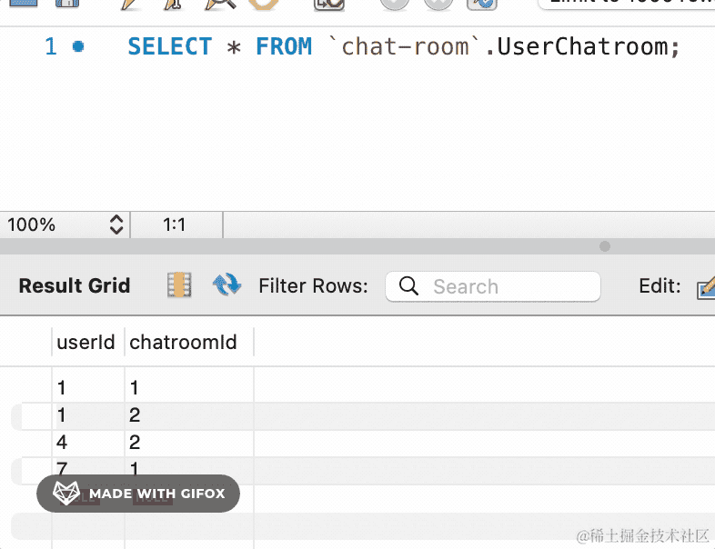

# 181. 聊天室：创建聊天室、加入群聊

好友功能开发完，这节来开发聊天室的功能。

聊天室涉及到两个表：

聊天室表 chatroom：

| 字段名 | 数据类型 | 描述 |
| --- | --- | --- |
| id | INT | 聊天室ID |
| name | VARCHAR(50) |群聊名 |
| type | BOOLEAN | 类型（单聊、群聊） |
| create_time | DATETIME | 创建时间 |
| update_time | DATETIME | 更新时间 |

用户所在聊天室表 user_chatroom：

| 字段名 | 数据类型 | 描述 |
| --- | --- | --- |
| user_id | INT | 用户ID |
| chatroom_id | INT |聊天室ID |

chatroom 表保存聊天室信息，user_chatroom 表保存聊天室里有哪些用户，或者说用户在哪些聊天室。

创建对应的 modal


```
model Chatroom {
  id  Int @id @default(autoincrement())
  name String @db.VarChar(50)
  // 聊天室类型 true 群聊 false 单聊
  type Boolean @default(false)
  createTime DateTime @default(now())
  updateTime DateTime @updatedAt
}

model UserChatroom {
  userId    Int 
  chatroomId  Int

  @@id([userId, chatroomId])
}

```

这里的 UserChatroom 表我们就不创建外键了。

执行 migrate dev：

```
npx prisma migrate dev --name chatroom
```


会生成 migration 的 sql 文件，并且会更新 client 代码。

看下生成的 sql：


还有生成的表：


都没问题。

我们创建一个聊天室模块：

```
nest g resource chatroom --no-spec
```


然后加一个创建聊天室的接口：

```javascript
import { BadRequestException, Controller, Get, Query } from '@nestjs/common';
import { ChatroomService } from './chatroom.service';
import { RequireLogin, UserInfo } from 'src/custom.decorator';

@Controller('chatroom')
@RequireLogin()
export class ChatroomController {
  constructor(private readonly chatroomService: ChatroomService) {}

  @Get('create-one-to-one')
  async oneToOne(@Query('friendId') friendId: number, @UserInfo('userId') userId: number) {
    if(!friendId) {
      throw new BadRequestException('聊天好友的 id 不能为空');
    }
    return this.chatroomService.createOneToOneChatroom(friendId, userId);
  }

  @Get('create-group')
  async group(@Query('name') name: string, @UserInfo('userId') userId: number) {
    return this.chatroomService.createGroupChatroom(name, userId);
  }
}
```

声明 /chatroom/create-one-to-one 和 /chatroom/create-group 两个路由

一对一聊天需要知道对方的 id。

群聊的话需要传入名字。

在 controller 加上 @RequireLogin 的装饰器，然后通过 @Query 取 userId 传入

然后在 ChatroomService 实现对应的方法：

```javascript
import { Inject, Injectable } from '@nestjs/common';
import { PrismaService } from 'src/prisma/prisma.service';

@Injectable()
export class ChatroomService {

    @Inject(PrismaService)
    private prismaService: PrismaService;

    async createOneToOneChatroom(friendId: number, userId: number) {
        const { id } = await this.prismaService.chatroom.create({
            data: {
                name: '聊天室' + Math.random().toString().slice(2, 8),
                type: false,
            },
            select: {
                id: true
            }
        });

        await this.prismaService.userChatroom.create({
            data: {
                userId,
                chatroomId: id
            }
        });
        await this.prismaService.userChatroom.create({
            data: {
                userId: friendId,
                chatroomId: id
            }
        });
        return '创建成功'
    }

    async createGroupChatroom(name: string, userId: number) {
        const { id } = await this.prismaService.chatroom.create({
            data: {
                name,
                type: true
            }
        })
        await this.prismaService.userChatroom.create({
            data: {
                userId,
                chatroomId: id
            }
        });
        return '创建成功'
    }
}
```

一对一聊天不需要聊天室名，所以随机生成一个就行：


聊天室创建完成后，单聊把 user 和 friend 加入聊天室，群聊只把 user 加入聊天室。

测试下：


sql 没啥问题：


看下数据库：


可以看到，聊天室创建成功，并且有两个人。

再创建个群聊：


看下数据库：


没啥问题。

然后我们加一个查看所有群聊的接口：

```javascript
@Get('list')
async list(@UserInfo('userId') userId: number) {
    if(!userId) {
      throw new BadRequestException('userId 不能为空')
    }
    return this.chatroomService.list(userId);
}
```
在 CharoomService 实现这个方法：

```javascript
async list(userId: number) {
    const chatroomIds = await this.prismaService.userChatroom.findMany({
        where: {
            userId
        },
        select: {
            chatroomId: true
        }
    })
    const chatrooms = await this.prismaService.chatroom.findMany({
        where: {
            id: {
                in: chatroomIds.map(item => item.chatroomId)
            }
        },
        select: {
            id: true,
            name: true,
            type: true,
            createTime: true
        }
    });
    return chatrooms;
}
```
首先查询 userId 的所有 chatrooms 的 id，然后查询 id 对应的 chatroom

测试下：


然后加一个查询聊天室的所有用户的接口：

```javascript
@Get('members')
async members(@Query('chatroomId') chatroomId: number) {
    if(!chatroomId) {
      throw new BadRequestException('chatroomId 不能为空')
    }
    return this.chatroomService.members(chatroomId);
}
```
实现下 service 的方法：

```javascript
async members(chatroomId: number) {
    const userIds = await this.prismaService.userChatroom.findMany({
        where: {
            chatroomId
        },
        select: {
            userId: true
        }
    })
    const users = await this.prismaService.user.findMany({
        where: {
            id: {
                in: userIds.map(item => item.userId)
            }
        },
        select: {
            id: true,
            username: true,
            nickName: true,
            headPic: true,
            createTime: true,
            email: true
        }
    });
    return users;
}
```


没啥问题。

然后 chatrooms 接口应该返回群聊的用户数，我们实现一下：


就是在查询出 chatroom 之后，再查询下相关 user 的信息：

```javascript
async list(userId: number) {
    const chatroomIds = await this.prismaService.userChatroom.findMany({
        where: {
            userId
        },
        select: {
            chatroomId: true
        }
    })
    const chatrooms = await this.prismaService.chatroom.findMany({
        where: {
            id: {
                in: chatroomIds.map(item => item.chatroomId)
            }
        },
        select: {
            id: true,
            name: true,
            type: true,
            createTime: true
        }
    });

    const res = [];
    for (let i = 0; i < chatrooms.length; i++) {
        const userIds = await this.prismaService.userChatroom.findMany({
            where: {
                chatroomId: chatrooms[i].id
            },
            select: {
                userId: true
            }
        })
        res.push({
            ...chatrooms[i],
            userCount: userIds.length,
            userIds: userIds.map(item => item.userId)
        })
    }

    return res;
}
```
测试下：


然后我们再加一个查询单个 chatroom 所有信息的接口：

```javascript
@Get('info/:id')
async info(@Param('id') id: number) {
    if(!id) {
      throw new BadRequestException('id 不能为空')
    }
    return this.chatroomService.info(id);
}
```
实现下 info 方法：

```javascript
async info(id: number) {
    const chatroom = await this.prismaService.chatroom.findUnique({
        where: {
            id
        }
    });
    return {...chatroom, users: await this.members(id)}
}
```


没啥问题。

最后，我们再来实现下加入群聊、退出群聊的功能。

```javascript
@Get('join/:id')
async join(@Param('id') id: number, @Query('joinUserId')  joinUserId: number) {
    if(!id) {
      throw new BadRequestException('id 不能为空')
    }
    if(!joinUserId) {
      throw new BadRequestException('joinUserId 不能为空')
    }
    return this.chatroomService.join(id, joinUserId);
}
```
实现下 join 方法：

```javascript
async join(id: number, userId: number) {
    const chatroom = await this.prismaService.chatroom.findUnique({
        where: {
            id
        }
    });
    if(chatroom.type === false) {
        throw new BadRequestException('一对一聊天室不能加人');
    }

    await this.prismaService.userChatroom.create({
        data: {
            userId,
            chatroomId: id
        }
    })

    return '加入成功';
}
```

测试下：


没啥问题。

然后实现下退出群聊：

```javascript
@Get('quit/:id')
async quit(@Param('id') id: number, @Query('quitUserId') quitUserId: number) {
    if(!id) {
      throw new BadRequestException('id 不能为空')
    }
    if(!quitUserId) {
      throw new BadRequestException('quitUserId 不能为空')
    }
    return this.chatroomService.quit(id, quitUserId);
}
```
实现下 quit 方法：

```javascript
async quit(id: number, userId: number) {
    const chatroom = await this.prismaService.chatroom.findUnique({
        where: {
            id
        }
    });
    if(chatroom.type === false) {
        throw new BadRequestException('一对一聊天室不能退出');
    }

    await this.prismaService.userChatroom.deleteMany({
        where: {
            userId,
            chatroomId: id
        }
    })

    return '退出成功';
}
```
测试下：




这样，聊天室的加入和退出功能就完成了。

代码在[小册仓库](https://github.com/QuarkGluonPlasma/nestjs-course-code/tree/main/chat-room-backend)。

## 总结

这节我们实现了聊天室创建、加入群聊、退出群聊的功能。

聊天室创建包括一对一聊天和群聊，一对一聊天就是创建聊天室后加入两个 user。

而群聊会加入当前用户，后面可以单独 join 加人。

我们还实现了查询聊天室列表的接口。

至此，好友和聊天室功能都完成了。
