# 184. 聊天室：头像上传

上节实现了用户信息的更改，但是是直接修改的文件路径：

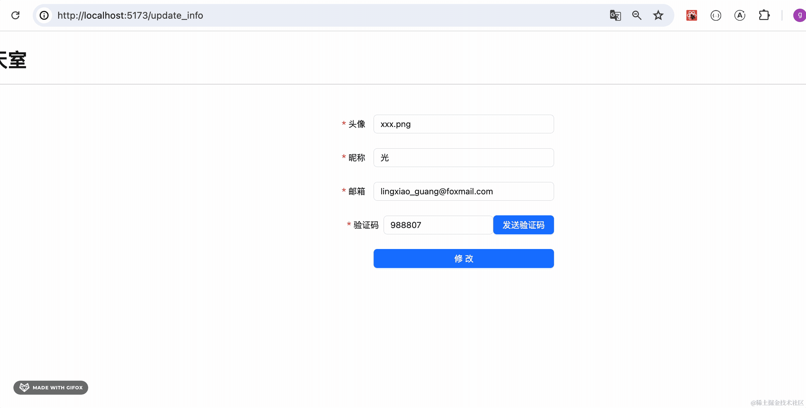

这节我们来实现下头像上传。

我们用 minio 来搭 OSS 服务。

把 minio 的 docker 镜像跑起来：

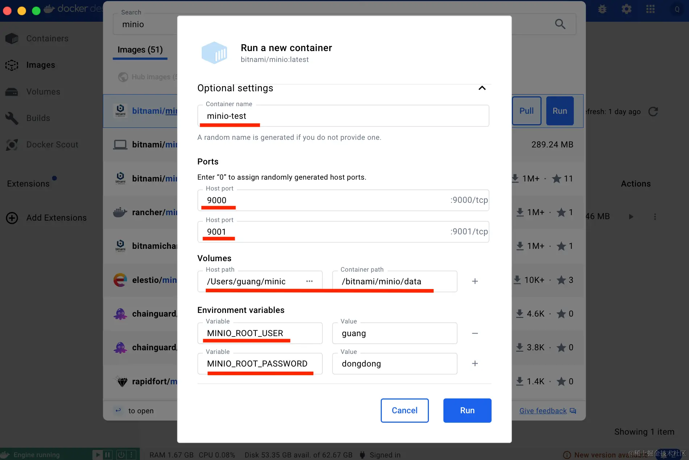

指定本地的某个目录，映射到容器里的 /bitnami/minio/data 目录。

指定端口 9000 和 9001 的映射。(9000 是文件访问的端口，9001 是管理页面的端口)

然后指定登录的用户名、密码 MINIO_ROOT_USER、MINIO_ROOT_PASSWORD

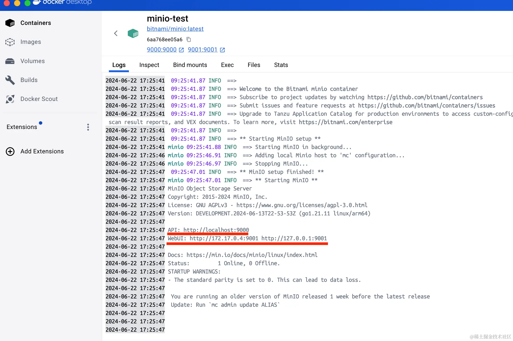

跑起来之后，访问下 http://localhost:9001

输入用户名密码后点击登录：

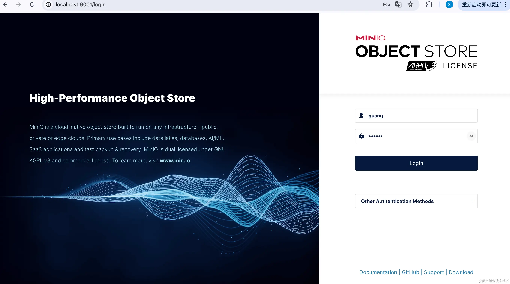

创建个 bucket：

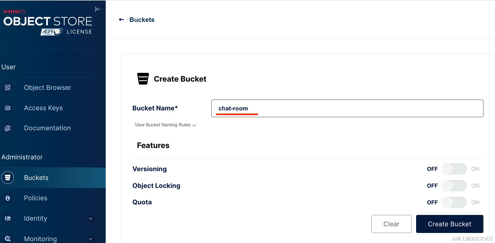

设置下可以公开访问：

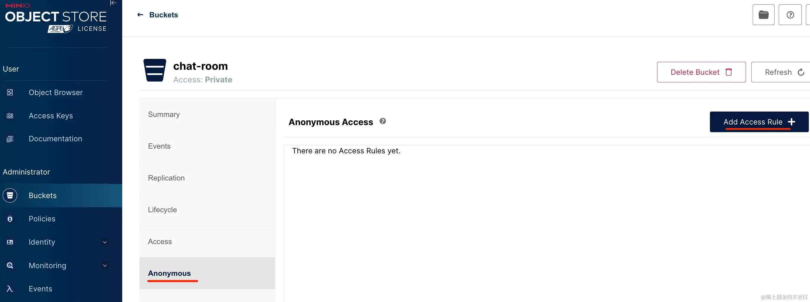

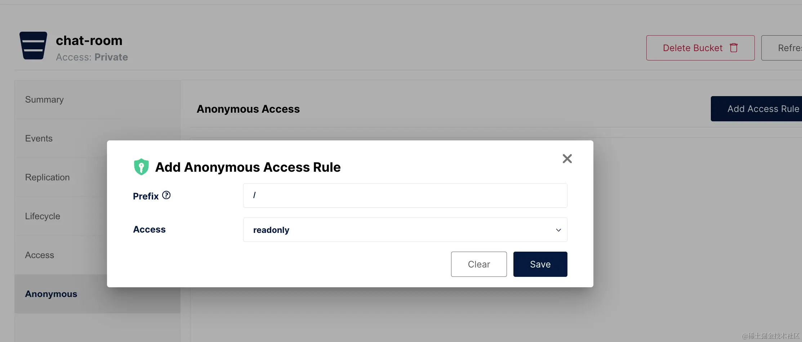

然后上传个文件：

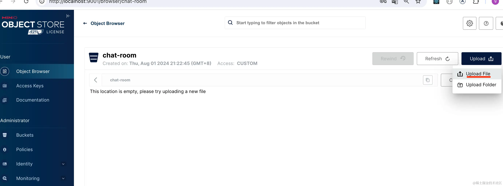

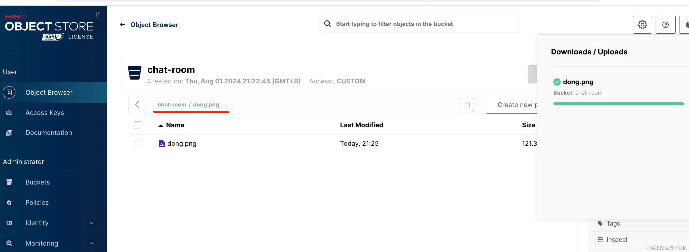

浏览器访问下这个路径：

http://localhost:9000/chat-room/dong.png


这样，文件就上传到了 OSS 里的 bucket，并且能够访问了。

然后我们直接前端直传 minio 就好了：


上传完之后把 url 给服务端保存到数据库就行。

但是这个 accessKey 也不能暴露到前端代码里，需要在服务端做预签名。

这个在[前端直传文件到 minio](https://juejin.cn/book/7226988578700525605/section/7364018227191496704)那节讲过。

我们进入 backend 的项目，安装 minio 的包：
```
npm install --save minio
```
然后创建个 minio 模块：

```
nest g module minio
```
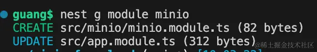

```javascript
import { Global, Module } from '@nestjs/common';
import * as Minio from 'minio';

@Global()
@Module({
    providers: [
        {
            provide: 'MINIO_CLIENT',
            async useFactory() {
                const client = new Minio.Client({
                        endPoint: 'localhost',
                        port: 9000,
                        useSSL: false,
                        accessKey: '',
                        secretKey: ''
                    })
                return client;
            }
          }
    ],
    exports: ['MINIO_CLIENT']
})
export class MinioModule {}
```
把 minio client 封装成 provider，放到 exports 里，并设置模块为 @Global。

用到 accessKey 和 secretKey 在这里创建：

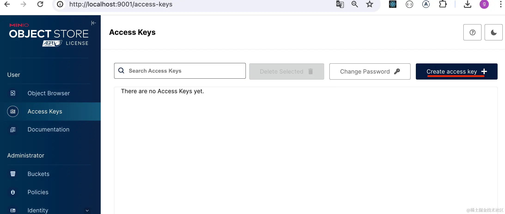

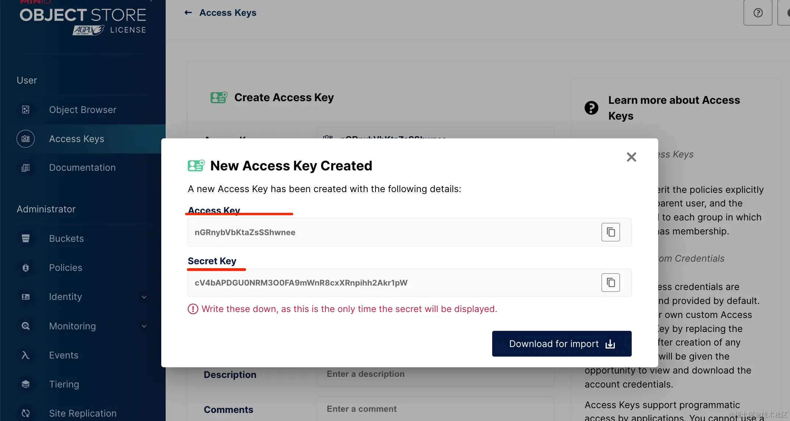

然后创建 MinioController

```
nest g controller minio --no-spec
```

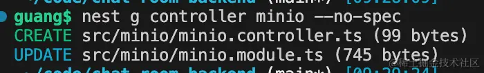

注入 Minio Client：

```javascript
import { Controller, Get, Inject, Query } from '@nestjs/common';
import * as Minio from 'minio';

@Controller('minio')
export class MinioController {

    @Inject('MINIO_CLIENT')
    private minioClient: Minio.Client;

    @Get('presignedUrl') 
    presignedPutObject(@Query('name') name: string) {
        return this.minioClient.presignedPutObject('chat-room', name, 3600);
    }
}
```

presignedPutObject 第一个参数是 buckectName，第二个参数是 objectName，第三个参数是 expires。

bucketName 就是 chat-rom

objectName 需要上传文件的时候拿到 file.name 作为参数传入。

expires 是生成的临时签名的过期时间，我们指定 3600 秒，也就是一小时。

调用下这个接口试试：

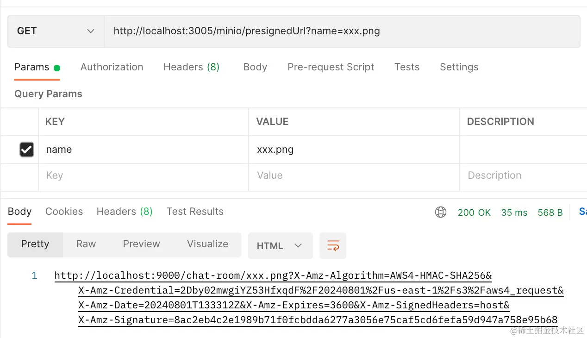

可以看到，返回了 xxx.png 的预签名的 url，这样前端不需要 accessKey 也可以用这个 url 来上传文件到 minio 了。

我们在 frontend 项目里用一下：

在 src/pages/UpdateInfo 下增加一个 HeadPicUpload.tsx

```javascript
import { InboxOutlined } from "@ant-design/icons";
import { message } from "antd";
import Dragger, { DraggerProps } from "antd/es/upload/Dragger";
import axios from "axios";

interface HeadPicUploadProps {
    value?: string;
    onChange?: Function
}

let onChange: Function;

const props: DraggerProps = {
    name: 'file',
    action: 'http://localhost:3005/xxxx',
    onChange(info) {
        const { status } = info.file;
        if (status === 'done') {
            onChange('http://localhost:9000/chat-room/' + info.file.name);
            message.success(`${info.file.name} 文件上传成功`);
        } else if (status === 'error') {
            message.error(`${info.file.name} 文件上传失败`);
        }
    }
};

const dragger = <Dragger {...props}>
    <p className="ant-upload-drag-icon">
        <InboxOutlined />
    </p>
    <p className="ant-upload-text">点击或拖拽文件到这个区域来上传</p>
</Dragger>

export function HeadPicUpload(props: HeadPicUploadProps) {

    onChange = props.onChange!

    return props?.value ? <div>
        
        {dragger}
    </div>: <div>
        {dragger}
    </div>
}
```
用 antd 的 Dragger 组件实现拖拽上传，如果有值的话，就展示之前的头像。

在上传头像的地方引入下：

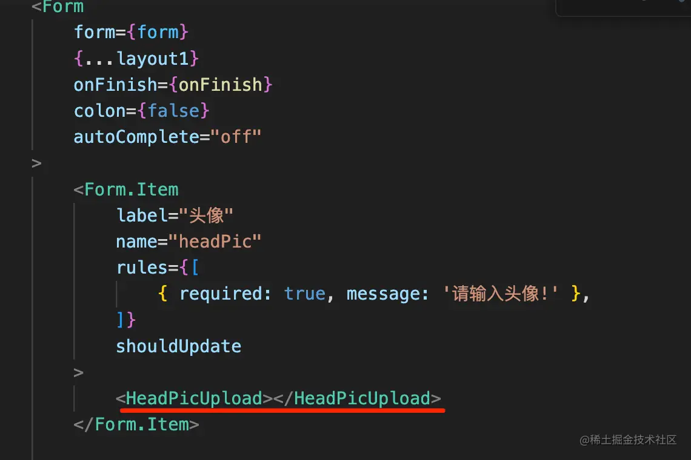

为什么是 value 和 onChange 两个参数呢？

因为 antd 的 Form.Item 在渲染时会给子组件传这两个参数。

渲染出来是这样的：

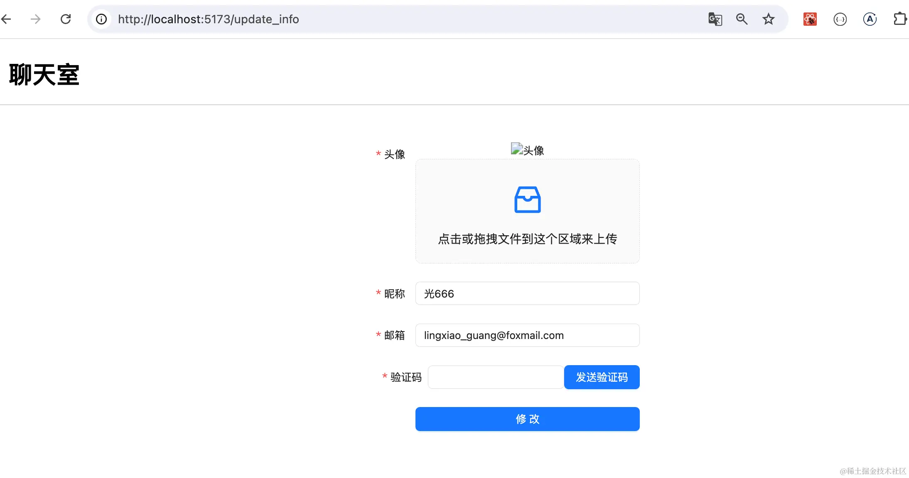

不过现在 action 的路径不对，我们改一下：

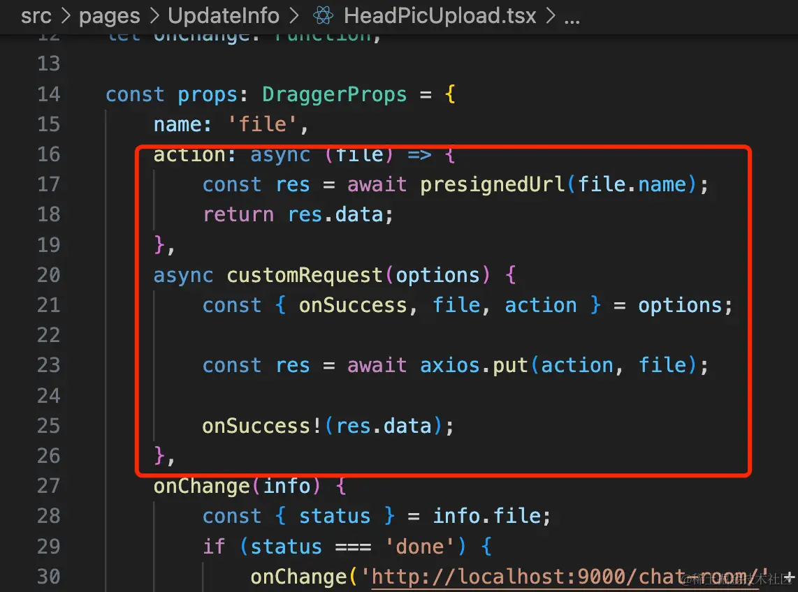

```javascript
action: async (file) => {
    const res = await presignedUrl(file.name);
    return res.data;
},
async customRequest(options) {
    const { onSuccess, file, action } = options;

    const res = await axios.put(action, file);

    onSuccess!(res.data);
},
```
customRequest 就是自定义请求怎么发。

为什么要 customRequest 呢？

因为默认 Dragger 是用 FormData 的格式上传的，也就是 key value 的格式。

我们指定的 name 就是 key。

但是 minio 要求直接把文件放到 body 里。

所以我们要用 customRequest 自定义请求方式。

在 interfaces 创建这个 presignedUrl 方法：

```javascript
export async function presignedUrl(fileName: string) {

    return axiosInstance.get(`/minio/presignedUrl?name=${ fileName}`);
}
```

试一下：


提示上传成功。

在 minio 管理界面也可以看到这个文件：


输入验证码，点击修改，会提示更新成功：

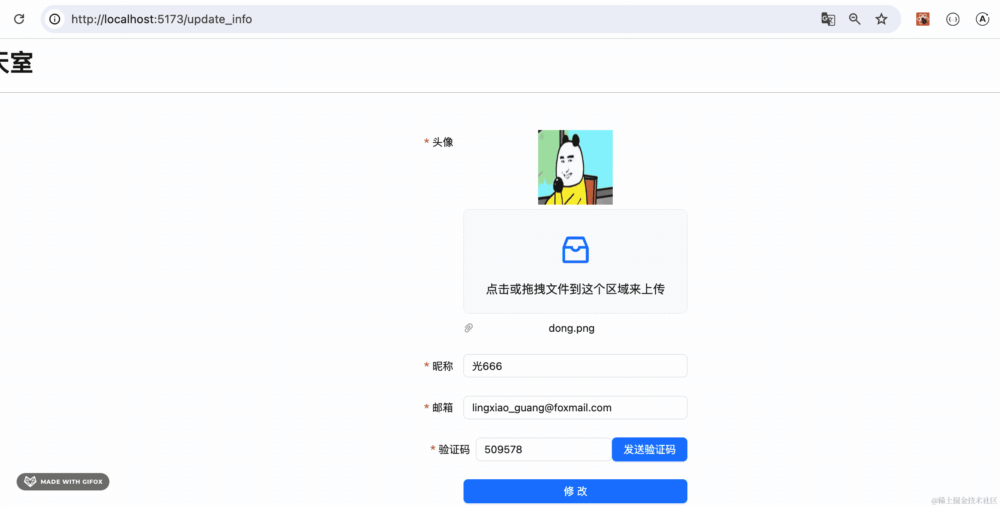

去数据库里看下：

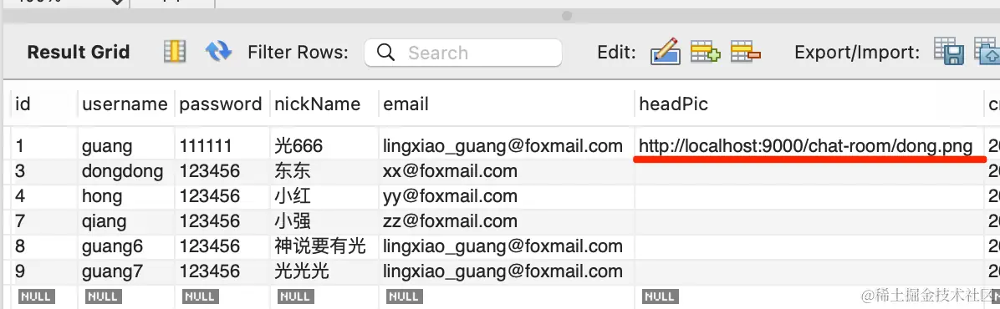

确实改过来了。

这样，基于 minio 搭的 OSS 服务的图片上传功能就完成了。

然后我们改下右上角按钮，改成显示用户头像：

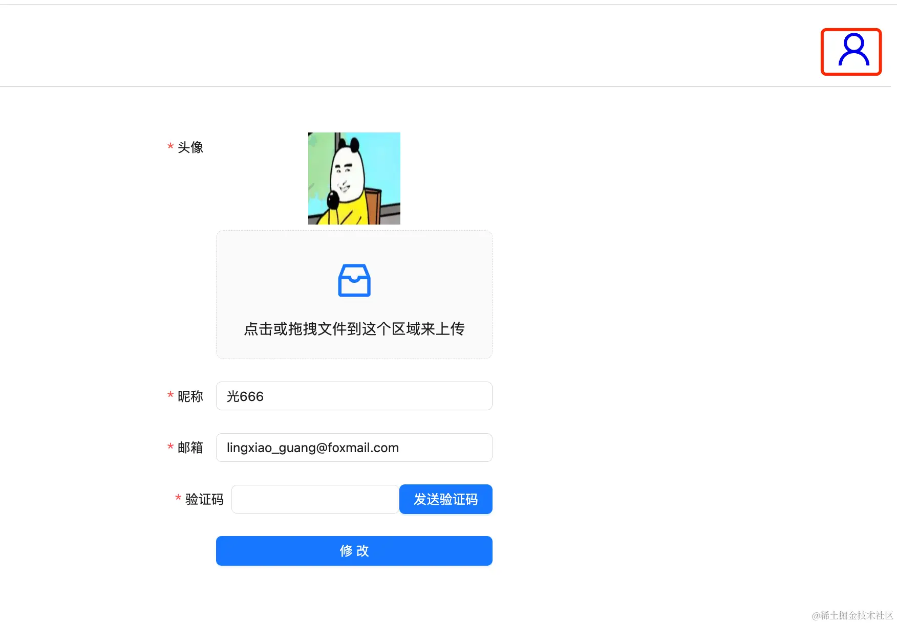

首先，用户信息更新完后，同步修改下 localStorage 里的 userInfo

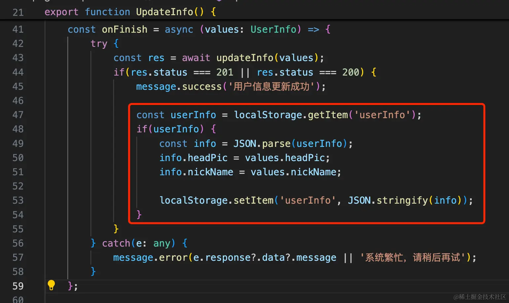

```javascript
const userInfo = localStorage.getItem('userInfo');
if(userInfo) {
    const info = JSON.parse(userInfo);
    info.headPic = values.headPic;
    info.nickName = values.nickName;

    localStorage.setItem('userInfo', JSON.stringify(info));
}
```
测试下：


可以看到，点击修改后，localStorage 里的数据也同步更新了。

然后右上角的按钮也可以从 localStorage 里取最新的 headPic：

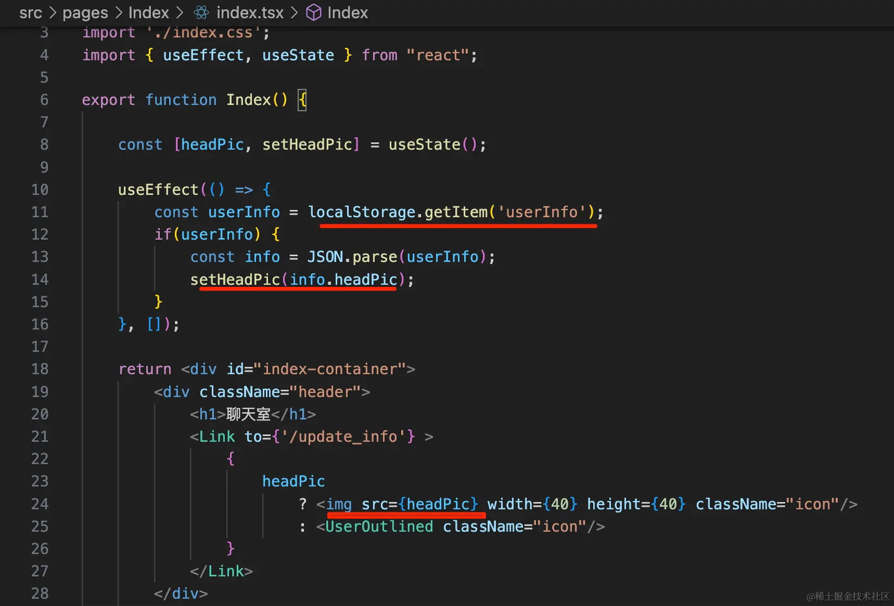

```javascript
import { UserOutlined } from "@ant-design/icons";
import { Link, Outlet } from "react-router-dom";
import './index.css';
import { useEffect, useState } from "react";

export function Index() {

    const [headPic, setHeadPic] = useState();

    useEffect(() => {
        const userInfo = localStorage.getItem('userInfo');
        if(userInfo) {
            const info = JSON.parse(userInfo);
            setHeadPic(info.headPic);
        }
    }, []);

    return <div id="index-container">
        <div className="header">
            <h1>聊天室</h1>
            <Link to={'/update_info'} >
                {
                    headPic 
                        ?  
                        : <UserOutlined className="icon"/>
                }                
            </Link>
        </div>
        <div className="body">
            <Outlet></Outlet>
        </div>
    </div>
}

```
useState 创建一个状态来保存 headPic。

在 useEffect 里读取 localStrage 里的值，调用 setHeadPic。

渲染的时候如果 headPic 有值就渲染 img，否则渲染默认的 icon。

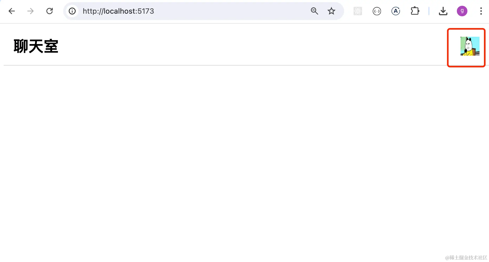

这样，头像就正确显示了。

案例代码在小册仓库：

[前端代码](https://github.com/QuarkGluonPlasma/nestjs-course-code/tree/main/chat-room-frontend)

[后端代码](https://github.com/QuarkGluonPlasma/nestjs-course-code/tree/main/chat-room-backend)

## 总结

我们用 minio 实现了 OSS 服务。

用前端直传 OSS，然后把文件 url 发给应用服务器的方式。

不想在前端代码暴露 accessKey，所以是用的预签名的方式，服务端用 presignedPutObject 返回一个预签名 url 给前端。前端用这个 url 来发送 put 请求，来把文件直传 minio。

antd 的 Dragger 组件默认用 form data 来发送请求，我们通过 customRequest 来重写了上传逻辑。

这样，文件就都保存在了 minio 服务里，可以更方便的管理。
