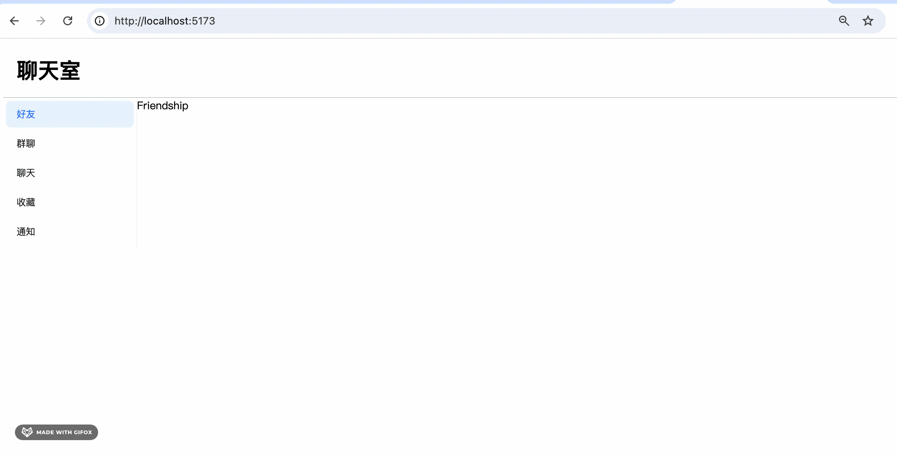
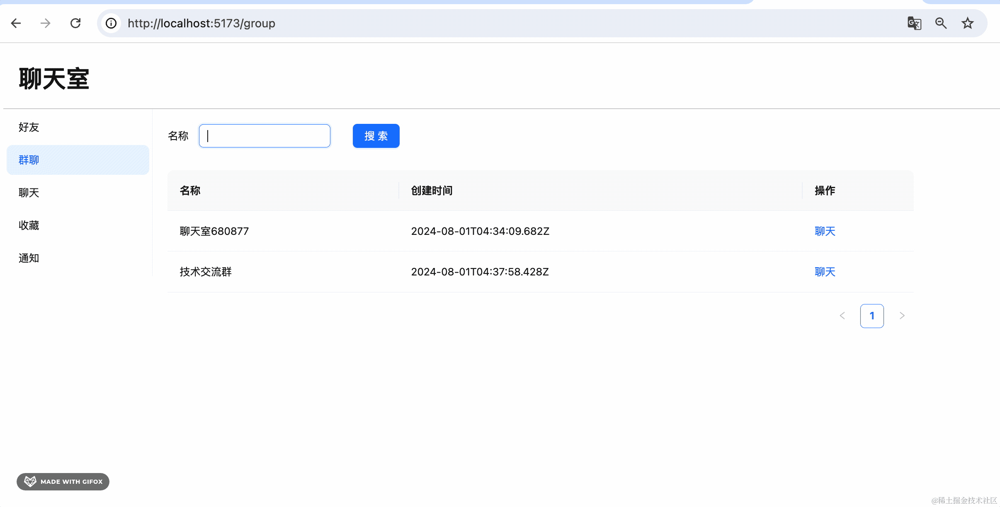

# 185. 聊天室：好友∕群聊列表页面

这节来实现下好友/群聊页面：


现在首页是这样的：


需要在 / 下添加一个二级路由：


```javascript
{
  path: '/',
  element: <Menu/>,
  children: [
    {
      path: '/',
      element: <Friendship/>
    },
    {
      path: '/group',
      element: <Group/>
    },
    {
      path: 'chat',
      element: <Chat/>
    },
    {
      path: 'collection',
      element: <Collection/>
    },
    {
      path: 'notification',
      element: <Notification/>
    }
  ]
}
```
然后分别实现这几个组件：

src/pages/Menu/index.tsx

```javascript
import { Outlet, useLocation } from "react-router-dom";
import { Menu as AntdMenu, MenuProps } from 'antd';
import './menu.css';
import { MenuClickEventHandler } from "rc-menu/lib/interface";
import { router } from "../../main";

const items: MenuProps['items'] = [
    {
        key: '1',
        label: "好友"
    },
    {
        key: '2',
        label: "群聊"
    },
    {
        key: '3',
        label: "聊天"
    },
    {
        key: '4',
        label: "收藏"
    },
    {
        key: '5',
        label: "通知"
    }
];

const handleMenuItemClick: MenuClickEventHandler = (info) => {
    let path = '';
    switch(info.key) {
        case '1':
            path = '/';
            break;
        case '2':
            path = '/group';
            break;
        case '3':
            path = '/chat';
            break;
        case '4':
            path = '/collection';
            break;
        case '5':
            path = '/notification';
            break;      
    }
    router.navigate(path);
}


export function Menu() {

    const location = useLocation();

    function getSelectedKeys() {
        if(location.pathname === '/group') {
            return ['2']
        } else if(location.pathname === '/chat') {
            return ['3']
        } else if(location.pathname === '/collection') {
            return ['4']
        } else if(location.pathname === '/notification') {
            return ['5']
        } else {
            return ['1']
        }
    }

    return <div id="menu-container">
        <div className="menu-area">
            <AntdMenu
                defaultSelectedKeys={getSelectedKeys()}
                items={items}
                onClick={handleMenuItemClick}
            />
        </div>
        <div className="content-area">
            <Outlet></Outlet>
        </div>
    </div>
}
```
引入 antd 的 Menu 实现菜单。

渲染的时候根据 useLocation 拿到的 pathname 来设置选中的菜单项。

点击菜单项的时候用 router.push 修改路径。

这里用到的 router 需要在 index.tsx 导出：


menu.css 如下：

```css
#menu-container {
    display: flex;
    flex-direction: row;
}
#menu-container .menu-area {
    width: 200px;
}
```
然后创建 src/pages/Friendship/index.tsx

```javascript
export function Friendship() {
    return <div>Friendship</div>
}
```

src/pages/Group/index.tsx

```javascript
export function Group() {
    return <div>Group</div>
}
```
src/pages/Chat/index.tsx

```javascript
export function Chat() {
    return <div>Chat</div>
}
```
src/pages/Collection/index.tsx

```javascript
export function Collection() {
    return <div>Collection</div>
}
```
src/pages/Notification/index.tsx

```javascript
export function Notification() {
    return <div>Notification</div>
}
```

在 index.tsx 里导入这些组件后，我们跑起来看看：

```
npm run dev
```

点击菜单项的路由切换，以及刷新选中对应菜单项，都没问题。



然后来写下好友页面：


```javascript
import { Badge, Button, Form, Input, Popconfirm, Table, message } from "antd";
import { useCallback, useEffect, useMemo, useState } from "react";
import './index.css';
import { ColumnsType } from "antd/es/table";
import { useForm } from "antd/es/form/Form";

interface SearchFriend {
    name: string;
}

interface FriendshipSearchResult {
    id: number;
    username: string;
    nickName: string;
    headPic: string;
    email: string;
}

export function Friendship() {
    const [friendshipResult, setFriendshipResult] = useState<Array<FriendshipSearchResult>>([]);

    const columns: ColumnsType<FriendshipSearchResult> = useMemo(() => [
        {
            title: '昵称',
            dataIndex: 'nickName'
        },
        {
            title: '头像',
            dataIndex: 'headPic',
            render: (_, record) => (
                <div>
                    
                </div>
            )
        },
        {
            title: '邮箱',
            dataIndex: 'email'
        },
        {
            title: '操作',
            render: (_, record) => (
                <div>
                    <a href="#">聊天</a>
                </div>
            )
        }
    ], []);

    const searchFriend = async (values: SearchFriend) => {
        
    };

    const [form ]  = useForm();

    useEffect(() => {
        searchFriend({
            name: form.getFieldValue('name')
        });
    }, []);


    return <div id="friendship-container">
        <div className="friendship-form">
            <Form
                form={form}
                onFinish={searchFriend}
                name="search"
                layout='inline'
                colon={false}
            >
                <Form.Item label="名称" name="name">
                    <Input />
                </Form.Item>

                <Form.Item label=" ">
                    <Button type="primary" htmlType="submit">
                        搜索
                    </Button>
                </Form.Item>
            </Form>
        </div>
        <div className="friendship-table">
            <Table columns={columns} dataSource={friendshipResult} style={{width: '1000px'}}/>
        </div>
    </div>
}
```
上面是 form、下面是 table。

调用搜索接口来搜索列表数据，然后设置到 table 的 dataSource。

css 部分如下：

```css
#friendship-container {
    padding: 20px;
}
#friendship-container .friendship-form {
    margin-bottom: 30px;
}
```
看下效果：


然后我们对接下后端接口：

当时我们的好友列表接口没支持按照昵称搜索，加一下：


```javascript
return res.filter((item: User) => item.nickName.includes(name))
```

试下效果：


没啥问题。

然后在前端页面调用下：

在 interfaces 调用下 list 接口：

```javascript
export async function friendshipList(name?: string) {
    return axiosInstance.get(`/friendship/list?name=${name || ''}`);
}
```
组件里调用下：

```javascript
const searchFriend = async (values: SearchFriend) => {
    try{
        const res = await friendshipList(values.name || '');

        if(res.status === 201 || res.status === 200) {
            setFriendshipResult(res.data.map((item: FriendshipSearchResult) => {
                return {
                    ...item,
                    key: item.id
                }
            }));
        }
    } catch(e: any){
        message.error(e.response?.data?.message || '系统繁忙，请稍后再试');
    }
};
```


没啥问题。

然后我们同样的方式写下 Group 组件：

之前的 /chatroom/list 接口也没支持 name 参数，加一下：


测试下：


在 interfaces 加一下：

```javascript
export async function chatroomList(name: string) {
    return axiosInstance.get(`/chatroom/list?name=${name}`);
}
```
写下 Group 组件：

```javascript
import { Badge, Button, Form, Input, Popconfirm, Table, message } from "antd";
import { useCallback, useEffect, useMemo, useState } from "react";
import './index.css';
import { ColumnsType } from "antd/es/table";
import { useForm } from "antd/es/form/Form";
import { chatroomList } from "../../interfaces";

interface SearchGroup {
    name: string;
}

interface GroupSearchResult {
    id: number;
    name: string;
    createTime: Date;
}

export function Group() {
    const [groupResult, setGroupResult] = useState<Array<GroupSearchResult>>([]);

    const columns: ColumnsType<GroupSearchResult> = useMemo(() => [
        {
            title: '名称',
            dataIndex: 'name'
        },
        {
            title: '创建时间',
            dataIndex: 'createTime'
        },
        {
            title: '操作',
            render: (_, record) => (
                <div>
                    <a href="#">聊天</a>
                </div>
            )
        }
    ], []);

    const searchGroup = async (values: SearchGroup) => {
        try{
            const res = await chatroomList(values.name || '');

            if(res.status === 201 || res.status === 200) {
                setGroupResult(res.data.map((item: GroupSearchResult) => {
                    return {
                        ...item,
                        key: item.id
                    }
                }));
            }
        } catch(e: any){
            message.error(e.response?.data?.message || '系统繁忙，请稍后再试');
        }
    };

    const [form ]  = useForm();

    useEffect(() => {
        searchGroup({
            name: form.getFieldValue('name')
        });
    }, []);


    return <div id="group-container">
        <div className="group-form">
            <Form
                form={form}
                onFinish={searchGroup}
                name="search"
                layout='inline'
                colon={false}
            >
                <Form.Item label="名称" name="name">
                    <Input />
                </Form.Item>

                <Form.Item label=" ">
                    <Button type="primary" htmlType="submit">
                        搜索
                    </Button>
                </Form.Item>
            </Form>
        </div>
        <div className="group-table">
            <Table columns={columns} dataSource={groupResult} style={{width: '1000px'}}/>
        </div>
    </div>
}
```
还有 css

```css
#group-container {
    padding: 20px;
}
#group-container .group-form {
    margin-bottom: 30px;
}
```
测试下：



没啥问题。

[前端代码](https://github.com/QuarkGluonPlasma/nestjs-course-code/tree/main/chat-room-frontend)

[后端代码](https://github.com/QuarkGluonPlasma/nestjs-course-code/tree/main/chat-room-backend)

## 总结

这节我们实现了好友和群聊的列表和搜索。

首先我们添加了二级路由，通过 Menu 组件实现了菜单，点击切换不同页面。

然后实现了好友列表和群聊列表，搜索框输入内容，点击搜索调用 list 接口，返回的数据设置到 table。

这样，好友和群聊列表就完成了

