# 186. 聊天室：添加好友弹窗、通知页面

上节实现了好友、群聊的列表，这节来实现添加好友功能

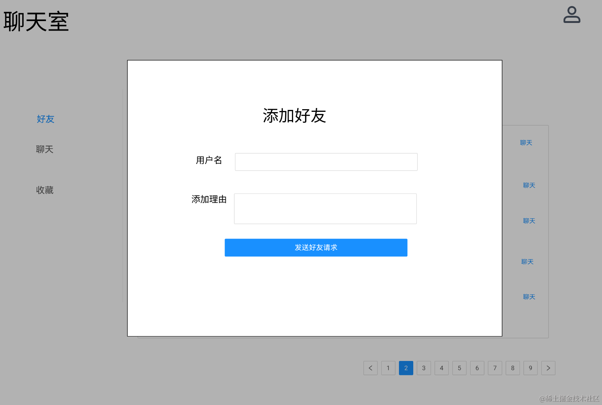

添加 src/pages/Friendship/AddFriendModal.tsx

```javascript
import { Button, Form, Input, InputNumber, Modal, message } from "antd";
import { useForm } from "antd/es/form/Form";
import TextArea from "antd/es/input/TextArea";
import { useState } from "react";

interface AddFriendModalProps {
    isOpen: boolean;
    handleClose: Function
}

const layout = {
    labelCol: { span: 6 },
    wrapperCol: { span: 18 }
}

export interface AddFriend {
    username: string;
    reason: string;
}

export function AddFriendModal(props: AddFriendModalProps) {

    const [form] = useForm<AddFriend>();

    const handleOk = async function() {

    }

    return <Modal 
        title="添加好友"
        open={props.isOpen}
        onOk={handleOk}
        onCancel={() => props.handleClose()}
        okText={'发送好友请求'}
        cancelText={'取消'}    
    >
        <Form
            form={form}
            colon={false}
            {...layout}
        >
            <Form.Item
                label="用户名"
                name="username"
                rules={[
                    { required: true, message: '请输入用户名!' },
                ]}
            >
                <Input />
            </Form.Item>
            <Form.Item
                label="添加理由"
                name="reason"
                rules={[
                    { required: true, message: '请输入添加理由!' },
                ]}
            >
                <TextArea />
            </Form.Item>
        </Form>
    </Modal>
}
```
然后在 Friednship/index.tsx 里引入下：

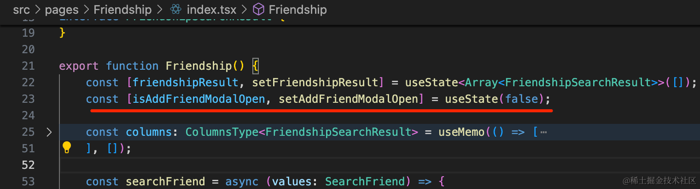

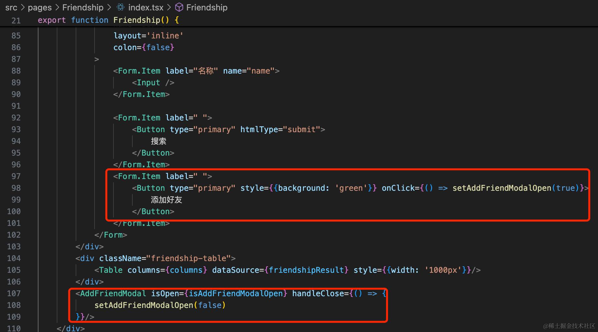

添加一个 state 控制弹窗显示隐藏，然后加一个按钮，点击的时候设置 state 为 true，关闭弹窗的时候设置 state 为 false

```javascript
const [isAddFriendModalOpen, setAddFriendModalOpen] = useState(false);
```

```javascript
<Form.Item label=" ">
    <Button type="primary" style={{background: 'green'}} onClick={() => setAddFriendModalOpen(true)}>
        添加好友
    </Button>
</Form.Item>
```

```javascript
<AddFriendModal isOpen={isAddFriendModalOpen} handleClose={() => {
    setAddFriendModalOpen(false)
}}/>
```
测试下：

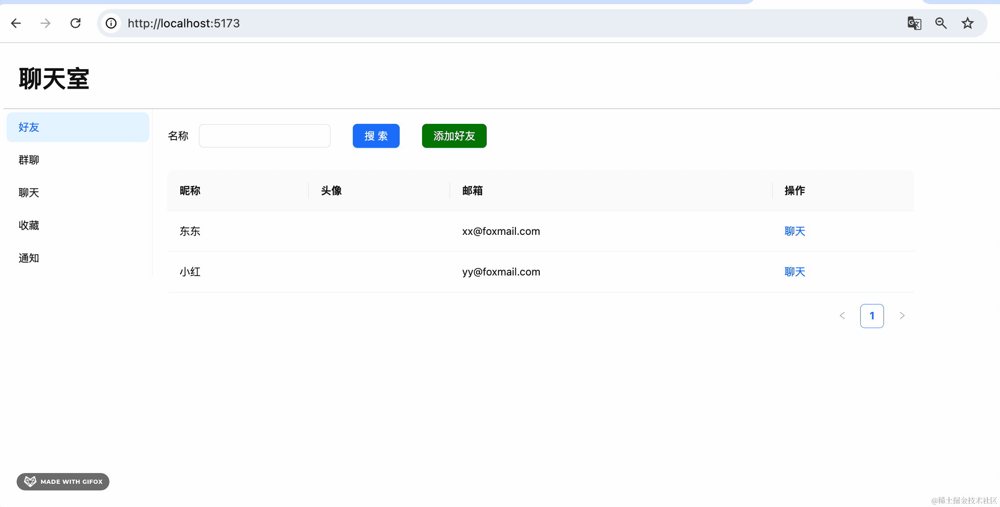

然后调用下添加好友的接口。

之前是通过 id 来添加的好友：

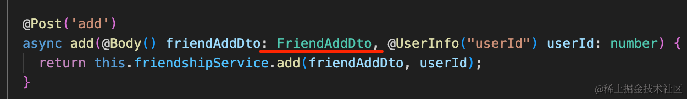

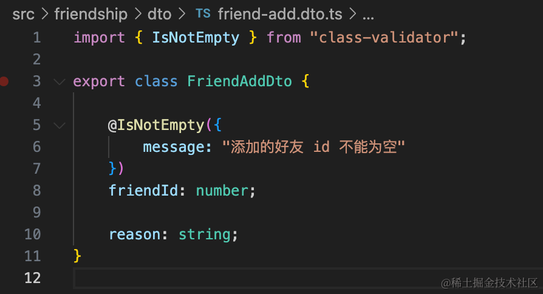

现在要改一下：

```javascript
import { IsNotEmpty } from "class-validator";

export class FriendAddDto {

    @IsNotEmpty({
        message: "添加好友的 username 不能为空"
    })
    username: string;

    reason: string;    
}
```
然后改下 service 的实现：

```javascript
async add(friendAddDto: FriendAddDto, userId: number) {
    const friend = await this.prismaService.user.findUnique({
        where: {
            username: friendAddDto.username
        }
    });

    if(!friend) {
        throw new BadRequestException('要添加的 username 不存在');
    }

    if(friend.id === userId) {
        throw new BadRequestException('不能添加自己为好友');
    }

    const found = await this.prismaService.friendship.findMany({
        where: {
            userId,
            friendId: friend.id
        }
    })

    if(found.length) {
        throw new BadRequestException('该好友已经添加过');
    }

    return await this.prismaService.friendRequest.create({
        data: {
            fromUserId: userId,
            toUserId: friend.id,
            reason: friendAddDto.reason,
            status: 0
        }
    })
}
```
先根据 username 查询 user，如果不存在就返回错误，提示 username 不存在。

如果添加的是自己，返回错误，提示不能添加自己为好友。

如果已经添加过，返回错误，提示已经添加。

否则，创建好友申请。

在页面调用下：

interfaces 加一下这个接口

```javascript
export async function friendAdd(data: AddFriend) {
    return axiosInstance.post('/friendship/add', data);
}
```
组件里调用下：

```javascript
const handleOk = async function() {
    await form.validateFields();

    const values = form.getFieldsValue();

    try{
        const res = await friendAdd(values);

        if(res.status === 201 || res.status === 200) {
            message.success('好友申请已发送');
            form.resetFields();
            props.handleClose();
        }
    } catch(e: any){
        message.error(e.response?.data?.message || '系统繁忙，请稍后再试');
    }
}
```
试下效果：


提示好友申请已发送。

其中 hong 提示已经是好友了，我们查一下：

/friendship/list 

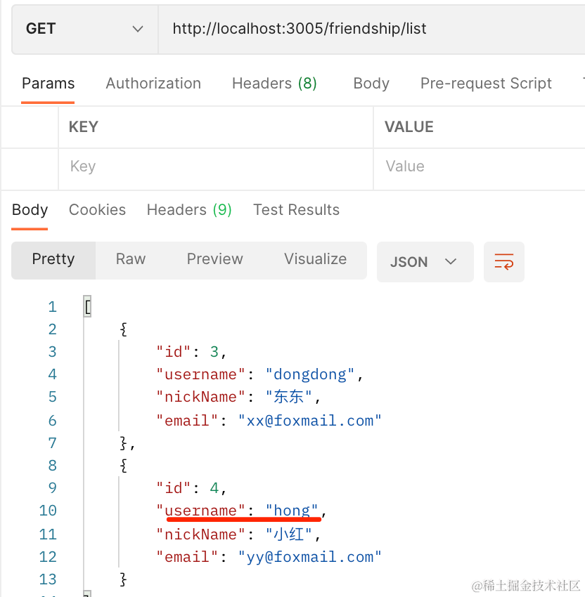

确实。

然后查一下新的好友请求：

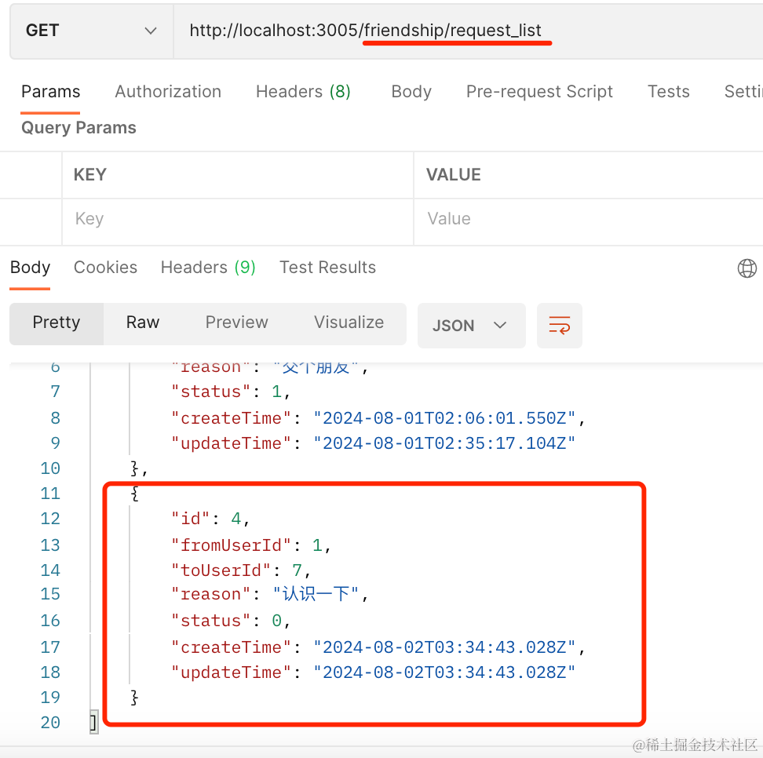

已经有了。

然后我们写一下通知页面：


之前的好友请求列表接口有点问题：

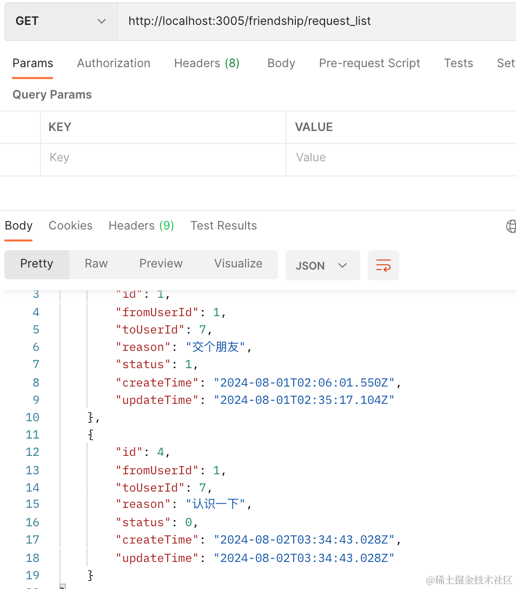

其实用户发出的好友请求、发给用户的好友请求，都应该展示出来。

并且接口应该顺带把用户信息也给查出来返回。

我们完善下：

```javascript
async list(userId: number) {
    const fromMeRequest = await this.prismaService.friendRequest.findMany({
        where: {
            fromUserId: userId
        }
    })

    const toMeRequest =  await this.prismaService.friendRequest.findMany({
        where: {
            toUserId: userId
        }
    })

    const res = {
        toMe: [],
        fromMe: []
    }

    for (let i = 0; i < fromMeRequest.length; i++) {
        const user = await this.prismaService.user.findUnique({
            where: {
                id: fromMeRequest[i].toUserId
            },
            select: {
                id: true,
                username: true,
                nickName: true,
                email: true,
                headPic: true,
                createTime: true
            }
        })
        res.fromMe.push({
            ...fromMeRequest[i],
            toUser: user
        })
    }

    for (let i = 0; i < toMeRequest.length; i++) {
        const user = await this.prismaService.user.findUnique({
            where: {
                id: toMeRequest[i].fromUserId
            },
            select: {
                id: true,
                username: true,
                nickName: true,
                email: true,
                headPic: true,
                createTime: true
            }
        })
        res.toMe.push({
            ...toMeRequest[i],
            fromUser: user
        })
    }

    return res;
}
```
分别查询 fromUserId、toUsrId 为 userId 的好友请求，然后把其中的 user 查出来返回。

测试下：


因为现在还没有发送给当前用户的好友请求。

我们在界面发送一个：

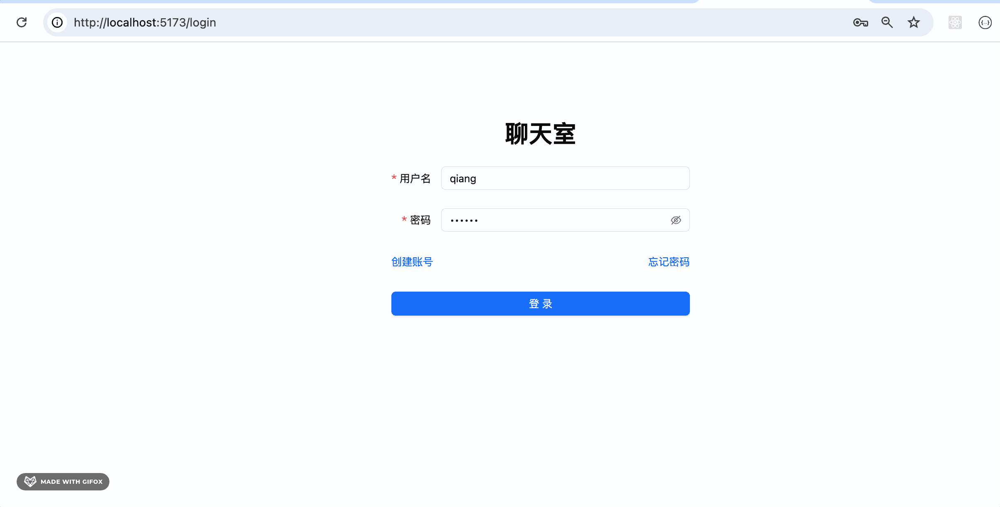

再查询就有了：

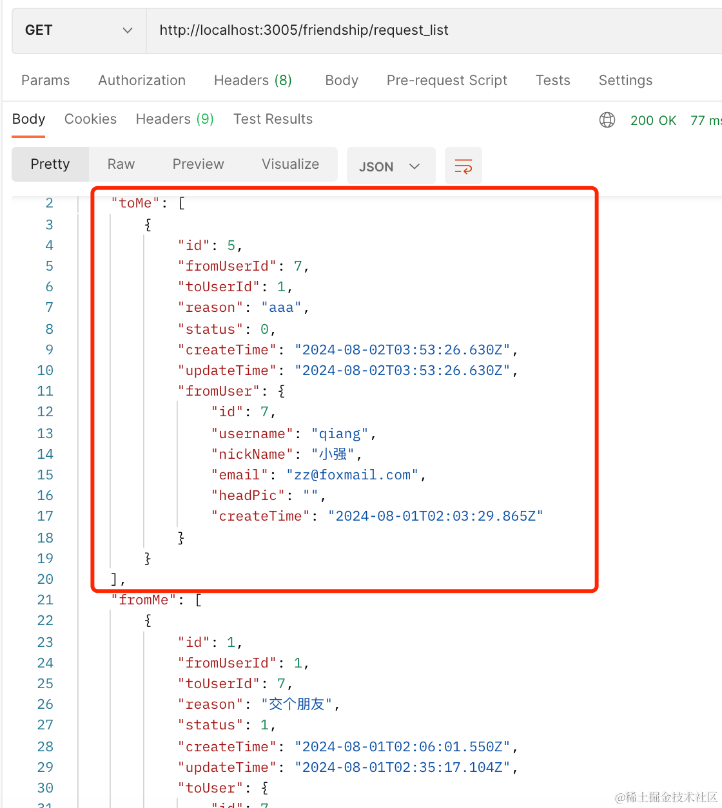

然后我们在页面把这个显示下就行：

src/pages/Notification.tsx

```javascript
import { Button, Form, Input, Popconfirm, Table, Tabs, TabsProps, message } from "antd";
import { useForm } from "antd/es/form/Form";
import './index.css';

export function Notification() {

    const [form ]  = useForm();

    const onChange = (key: string) => {
        console.log(key);
    };
      
    const items: TabsProps['items'] = [
        {
          key: '1',
          label: '我发出的',
          children: '发给我的',
        },
        {
          key: '2',
          label: '我发出的',
          children: '我发出的',
        }
    ];

    return <div id="notification-container">
        <div className="notification-list">
            <Tabs defaultActiveKey="1" items={items} onChange={onChange} />
        </div>
    </div>
}
```
css
```css
#notification-container {
    padding: 20px;
}
```

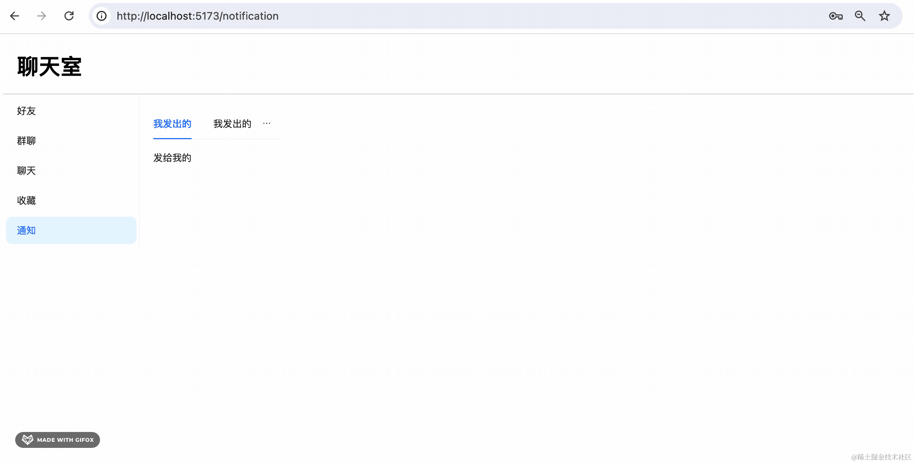

然后在 interfaces 添加下接口：

```javascript
export async function friendRequestList() {
    return axiosInstance.get('/friendship/request_list');
}
```

在页面调用下：

```javascript
import { Button, Form, Input, Popconfirm, Table, Tabs, TabsProps, message } from "antd";
import { useForm } from "antd/es/form/Form";
import './index.css';
import { useEffect, useState } from "react";
import { friendRequestList } from "../../interfaces";

interface User {
    id: number;
    headPic: string;
    nickName: string;
    email: string;
    captcha: string;
}

interface FriendRequest {
    id: number
    fromUserId: number
    toUserId: number
    reason: string
    createTime: Date
    fromUser: User
    toUser: User
    status: number
}

export function Notification() {

    const [form ]  = useForm();
    const [fromMe, setFromMe] = useState<Array<FriendRequest>>([]);
    const [toMe, setToMe] = useState<Array<FriendRequest>>([]);

    async function queryFriendRequestList() {
        try{
            const res = await friendRequestList();

            if(res.status === 201 || res.status === 200) {
                setFromMe(res.data.fromMe.map((item: FriendRequest) => {
                    return {
                        ...item,
                        key: item.id
                    }
                }));
                setToMe(res.data.toMe.map((item: FriendRequest) => {
                    return {
                        ...item,
                        key: item.id
                    }
                }));
            }
        } catch(e: any){
            message.error(e.response?.data?.message || '系统繁忙，请稍后再试');
        }
    }

    useEffect(() => {
        queryFriendRequestList();
    }, []);

    const onChange = (key: string) => {
        console.log(key);
    };
      
    const items: TabsProps['items'] = [
        {
            key: '1',
            label: '我发出的',
            children: <div style={{width: 1000}}>
                {JSON.stringify(fromMe)}
            </div>
        },
        {
            key: '2',
            label: '发给我的',
            children: <div style={{width: 1000}}>
                {JSON.stringify(toMe)}
            </div>
        }
    ];

    return <div id="notification-container">
        <div className="notification-list">
            <Tabs defaultActiveKey="1" items={items} onChange={onChange} />
        </div>
    </div>
}
```

请求下接口，设置到 fromMe、toMe 的 state：


然后在 tab 内容展示下：

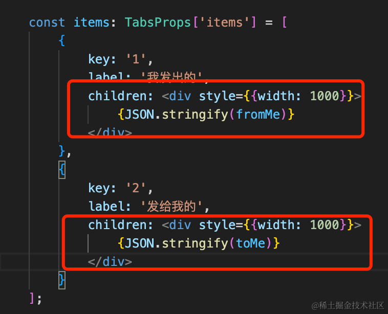

看下效果：

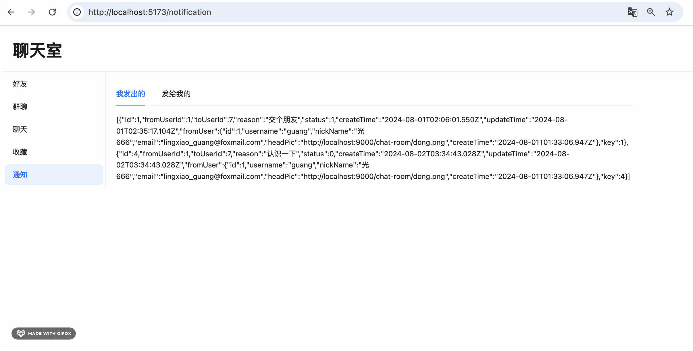

数据请求成功。

我们用 table 展示下就好了：

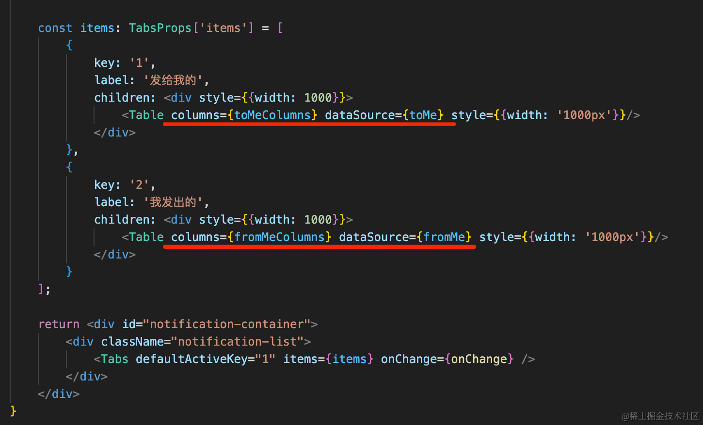

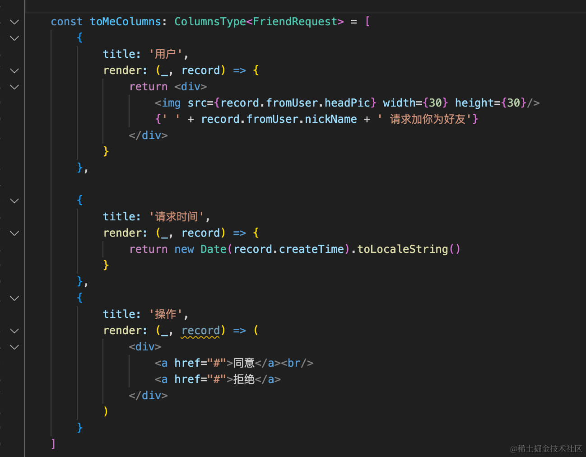

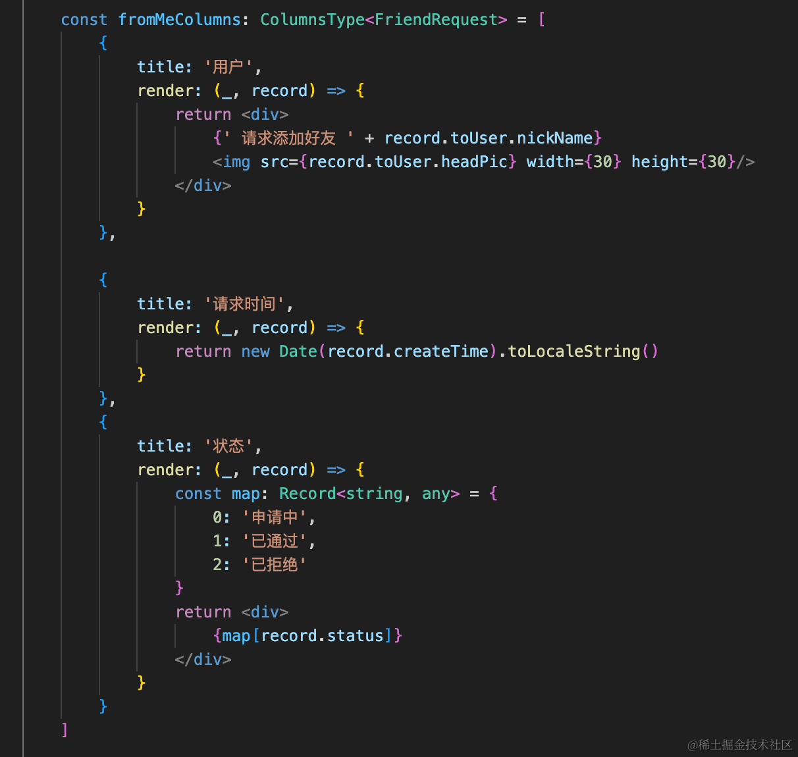
```javascript
import { Button, Form, Input, Popconfirm, Table, Tabs, TabsProps, message } from "antd";
import { useForm } from "antd/es/form/Form";
import './index.css';
import { useEffect, useMemo, useState } from "react";
import { friendRequestList } from "../../interfaces";
import { ColumnsType } from "antd/es/table";

interface User {
    id: number;
    headPic: string;
    nickName: string;
    email: string;
    captcha: string;
}

interface FriendRequest {
    id: number
    fromUserId: number
    toUserId: number
    reason: string
    createTime: Date
    fromUser: User
    toUser: User
    status: number
}

export function Notification() {

    const [form ]  = useForm();
    const [fromMe, setFromMe] = useState<Array<FriendRequest>>([]);
    const [toMe, setToMe] = useState<Array<FriendRequest>>([]);

    async function queryFriendRequestList() {
        try{
            const res = await friendRequestList();

            if(res.status === 201 || res.status === 200) {
                setFromMe(res.data.fromMe.map((item: FriendRequest) => {
                    return {
                        ...item,
                        key: item.id
                    }
                }));
                setToMe(res.data.toMe.map((item: FriendRequest) => {
                    return {
                        ...item,
                        key: item.id
                    }
                }));
            }
        } catch(e: any){
            message.error(e.response?.data?.message || '系统繁忙，请稍后再试');
        }
    }

    useEffect(() => {
        queryFriendRequestList();
    }, []);

    const onChange = (key: string) => {
        console.log(key);
    };
      
    const toMeColumns: ColumnsType<FriendRequest> = [
        {
            title: '用户',
            render: (_, record) => {
                return <div>
                    
                    {' ' + record.fromUser.nickName + ' 请求加你为好友'}
                </div>
            }
        },
        
        {
            title: '请求时间',
            render: (_, record) => {
                return new Date(record.createTime).toLocaleString()
            }
        },
        {
            title: '操作',
            render: (_, record) => (
                <div>
                    <a href="#">同意</a><br/>
                    <a href="#">拒绝</a>
                </div>
            )
        }
    ]

    const fromMeColumns: ColumnsType<FriendRequest> = [
        {
            title: '用户',
            render: (_, record) => {
                return <div>
                    {' 请求添加好友 ' + record.toUser.nickName}
                    
                </div>
            }
        },
        
        {
            title: '请求时间',
            render: (_, record) => {
                return new Date(record.createTime).toLocaleString()
            }
        },
        {
            title: '状态',
            render: (_, record) => {
                const map: Record<string, any> = {
                    0: '申请中',
                    1: '已通过',
                    2: '已拒绝'
                }
                return <div>
                    {map[record.status]}
                </div>
            }
        }
    ]

    const items: TabsProps['items'] = [
        {
            key: '1',
            label: '发给我的',
            children: <div style={{width: 1000}}>
                <Table columns={toMeColumns} dataSource={toMe} style={{width: '1000px'}}/>
            </div>
        },
        {
            key: '2',
            label: '我发出的',
            children: <div style={{width: 1000}}>
                <Table columns={fromMeColumns} dataSource={fromMe} style={{width: '1000px'}}/>
            </div>
        }
    ];

    return <div id="notification-container">
        <div className="notification-list">
            <Tabs defaultActiveKey="1" items={items} onChange={onChange} />
        </div>
    </div>
}
```
看下效果：

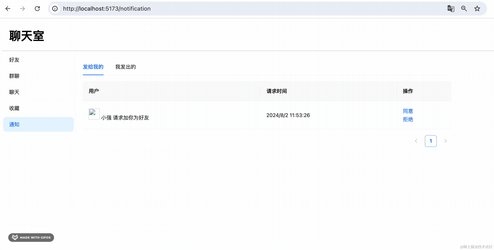

没啥问题。

然后加一下同意和拒绝的接口调用：

```javascript
export async function agreeFriendRequest(id: number) {
    return axiosInstance.get(`/friendship/agree/${id}`);
}

export async function rejectFriendRequest(id: number) {
    return axiosInstance.get(`/friendship/reject/${id}`);
}
```
然后页面上调用下：

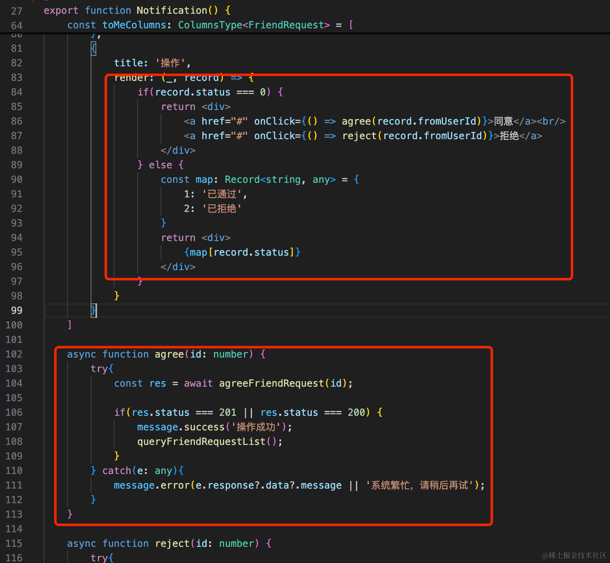

```javascript
{
    title: '操作',
    render: (_, record) => {
        if(record.status === 0) {
            return <div>
                <a href="#" onClick={() => agree(record.fromUserId)}>同意</a><br/>
                <a href="#" onClick={() => reject(record.fromUserId)}>拒绝</a>
            </div>
        } else {
            const map: Record<string, any> = {
                1: '已通过',
                2: '已拒绝'
            }
            return <div>
                {map[record.status]}
            </div>
        }
    }
}
```

```javascript
async function agree(id: number) {
    try{
        const res = await agreeFriendRequest(id);

        if(res.status === 201 || res.status === 200) {
            message.success('操作成功');
            queryFriendRequestList();
        }
    } catch(e: any){
        message.error(e.response?.data?.message || '系统繁忙，请稍后再试');
    }
}

async function reject(id: number) {
    try{
        const res = await rejectFriendRequest(id);

        if(res.status === 201 || res.status === 200) {
            message.success('操作成功');
            queryFriendRequestList();
        }
    } catch(e: any){
        message.error(e.response?.data?.message || '系统繁忙，请稍后再试');
    }
}
```
试下效果：

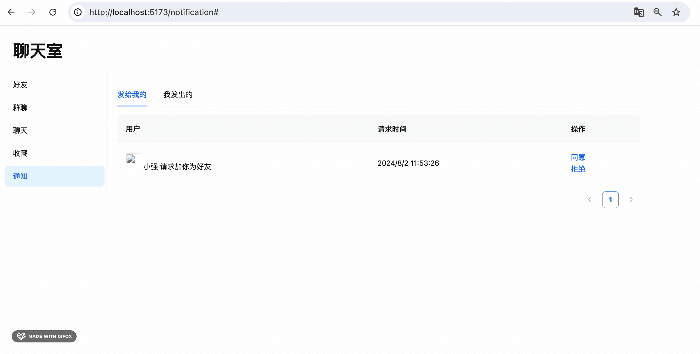

同意后再看下好友列表：

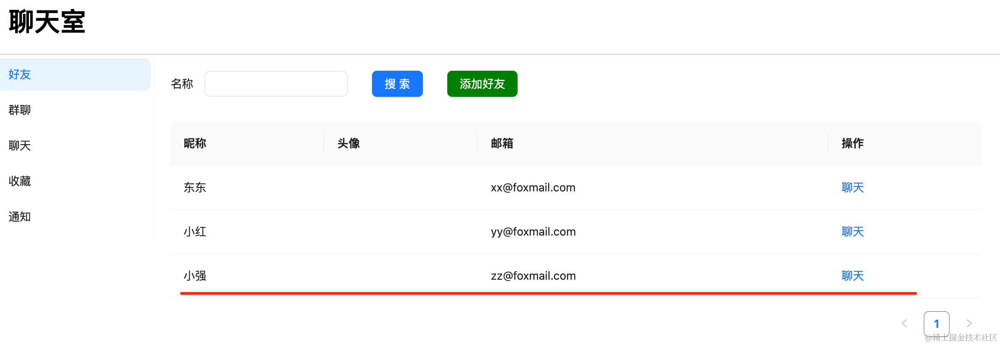

多了小强这个好友。

我们好像忘记展示 reason 了，补一下：

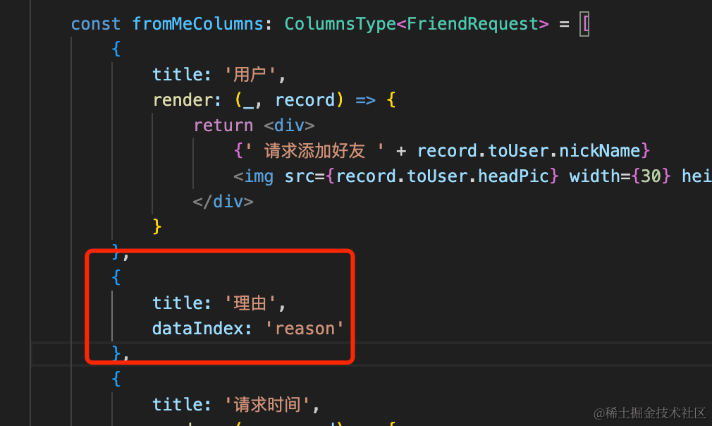

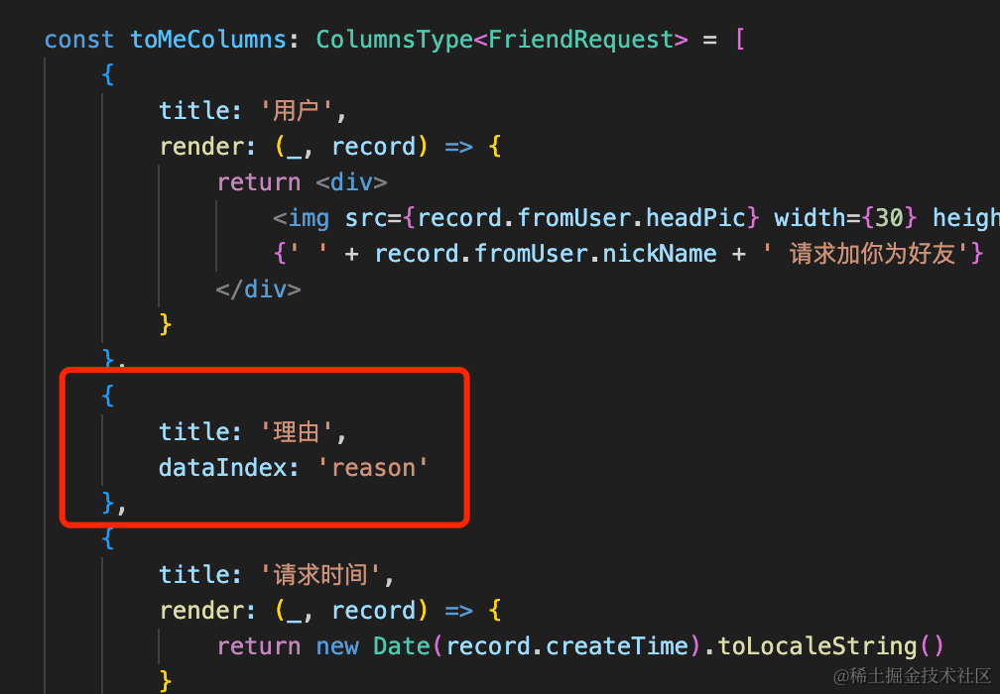

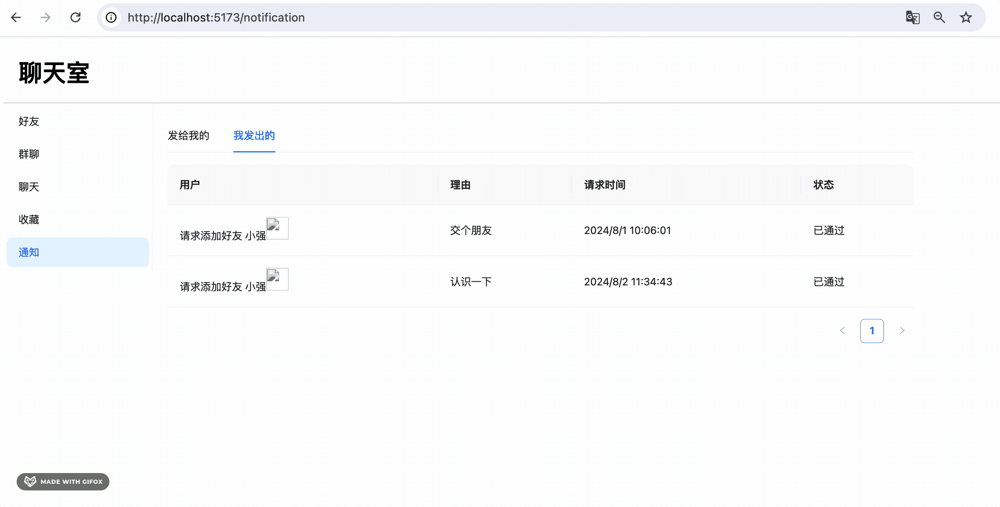

最后，我们整体测试下添加好友的功能：

首先登录一个用户的账号，给 guang 发送好友请求：


然后登录 guang 的账号：


同意之后，就可以在好友列表看到这个好友了。

[前端代码](https://github.com/QuarkGluonPlasma/nestjs-course-code/tree/main/chat-room-frontend)

[后端代码](https://github.com/QuarkGluonPlasma/nestjs-course-code/tree/main/chat-room-backend)

## 总结

这节我们实现了添加好友。

首先点击添加好友按钮的时候会有个弹窗，输入 username 和理由之后，会发送一个好友请求。

在通知页面分别展示发给我的和我发出的好友请求，对方点击同意后，就会成为好友了。

这样添加好友、好友请求的功能就完成了。
