# 187. 聊天室：聊天功能后端开发

写完注册、登录、添加好友、群聊列表等前后端代码后，我们继续来开发聊天的功能。

创建一个 websocket 模块：

```
nest g resource chat --no-spec
```


安装 websocket 的包：
```
npm i --save @nestjs/websockets @nestjs/platform-socket.io socket.io
```
改下 ChatGateway：

```javascript
import { MessageBody, SubscribeMessage, WebSocketGateway, WebSocketServer } from '@nestjs/websockets';
import { ChatService } from './chat.service';
import { Server, Socket } from 'socket.io';

interface JoinRoomPayload {
  chatroomId: number
  userId: number
}

interface SendMessagePayload {
  sendUserId: number;
  chatroomId: number;
  message: {
    type: 'text' | 'image',
    content: string
  }
}

@WebSocketGateway({cors: { origin: '*' }})
export class ChatGateway {
  constructor(private readonly chatService: ChatService) {}

  @WebSocketServer() server: Server;

  @SubscribeMessage('joinRoom')
  joinRoom(client: Socket, payload: JoinRoomPayload): void {
    const roomName = payload.chatroomId.toString();

    client.join(roomName)

    this.server.to(roomName).emit('message', {
      type: 'joinRoom',
      userId: payload.userId
    });
  }

  @SubscribeMessage('sendMessage')
  sendMessage(@MessageBody() payload: SendMessagePayload): void {
    const roomName = payload.chatroomId.toString();

    this.server.to(roomName).emit('message', { 
      type: 'sendMessage',
      userId: payload.sendUserId,
      message: payload.message
    });
  }
}
```
监听 joinRoom、sendMessage 消息。

joinRoom 把 client socket 加入房间，房间号为直接用聊天室 id。

sendMessage 接收并广播消息到对应房间。

message 的格式为 type、content，type 可以是 text、image，也就是可以发送文字、图片。

注意，这里要开启 cors 跨域，websocket 也是有跨域问题的。

在前端项目里引入下 socket.io

```
npm install socket.io-client
```
然后改下 src/pages/Chat/index.tsx

```javascript
import { Input } from "antd";
import { useEffect, useRef, useState } from "react";
import { io, Socket } from "socket.io-client";

interface JoinRoomPayload {
    chatroomId: number
    userId: number
}

interface SendMessagePayload {
    sendUserId: number;
    chatroomId: number;
    message: Message
}

interface Message {
    type: 'text' | 'image'
    content: string
}

type Reply  = {
    type: 'sendMessage'
    userId: number
    message: Message
} | {
    type: 'joinRoom'
    userId: number
}

export function Chat() {

    const [messageList, setMessageList] = useState<Array<Message>>([]);
    const socketRef = useRef<Socket>();

    useEffect(() => {
        const socket = socketRef.current = io('http://localhost:3005');
        socket.on('connect', function() {
    
            const payload: JoinRoomPayload = {
                chatroomId: 1,
                userId: 1
            }
    
            socket.emit('joinRoom', payload);
    
            socket.on('message', (reply: Reply) => {
                if(reply.type === 'joinRoom') {
                    setMessageList(messageList => [...messageList, {
                        type: 'text',
                        content: '用户 ' + reply.userId + '加入聊天室'
                    }])
                } else {
                    setMessageList(messageList => [...messageList, reply.message])    
                }
            });
    
        });
    }, []);

    function sendMessage(value: string) {
        const payload2: SendMessagePayload = {
            sendUserId: 1,
            chatroomId: 1,
            message: {
                type: 'text',
                content: value
            }
        }

        socketRef.current?.emit('sendMessage', payload2);
    }

    return <div>
        <Input onBlur={(e) => {
            sendMessage(e.target.value);
        }}/>
        <div>
            {messageList.map(item => {
                return <div>
                    {item.type === 'image' ?  : item.content }
                </div>
            })}
        </div>
    </div>
}
```
连接服务端的 ws 服务，发送 joinRoom 消息。

然后监听服务端的 message。

如果传过来的是 joinRoom 的消息，就添加一条 用户 xxx 加入聊天室的消息到 messageList。

否则就把传过来 message 加到 messageList。

创建一个 Input，当 blur 的时候发送消息到服务端。

测试下：


现在两个 socket 都在 chatroomId 为 1 的房间里，可以相互发消息。

而用户所在的聊天室会有不同的 chatroomId，不同登录用户会有不同的 userId

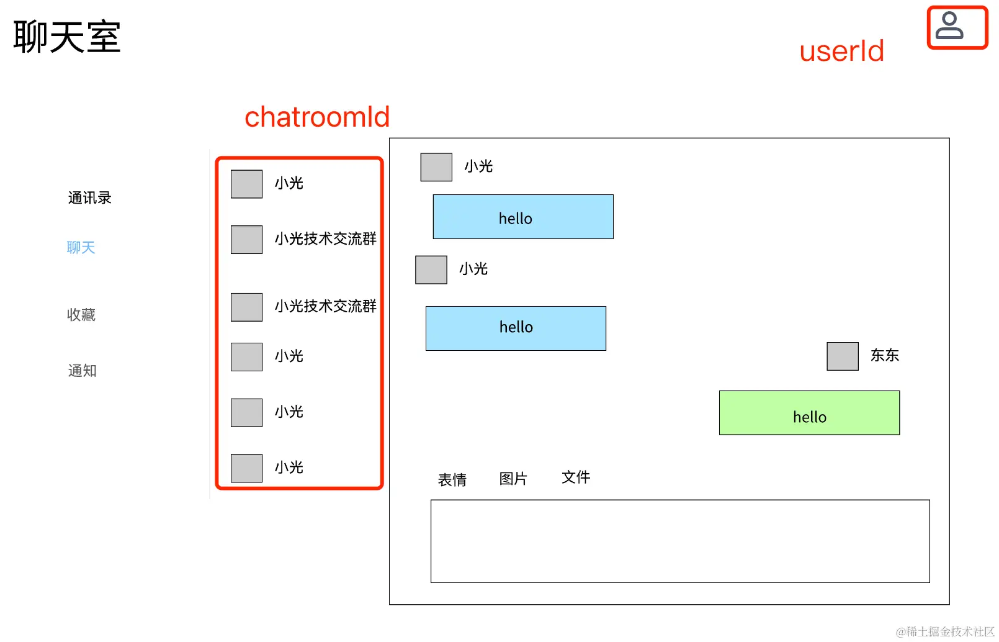

把 chatroomId 和 userId 换成真实的，不就能在不同房间聊天了么？

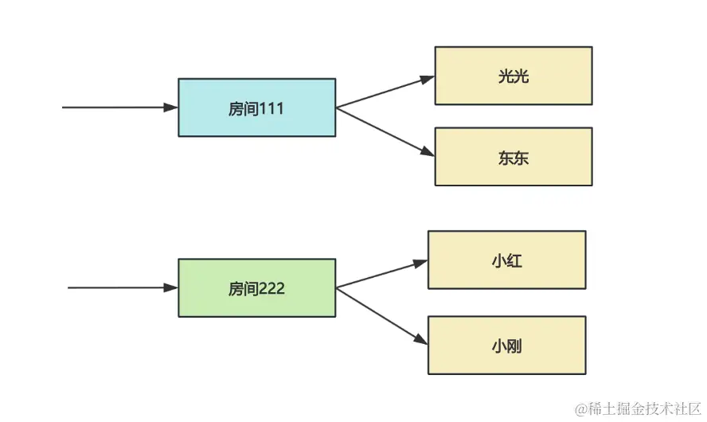

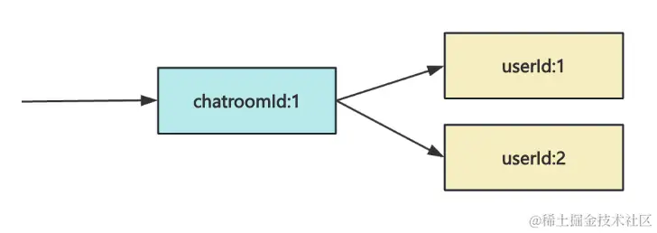

这部分是前端逻辑，我们下节再写。

接下来我们实现下聊天记录的保存，也就是把聊天室里的消息存到数据库表里。

在 prisma 的 schema 添加这个 model

```
model ChatHistory {
  id Int @id @default(autoincrement())
  content String @db.VarChar(500)
  //聊天记录类型 text:0、image:1、file:2
  type Int
  chatroomId Int
  senderId Int
  createTime DateTime @default(now())
  updateTime DateTime @updatedAt
}
```

执行 migrate dev 生成迁移 sql 并更新 client 代码：

```
npx prisma migrate dev --name chat-history
```

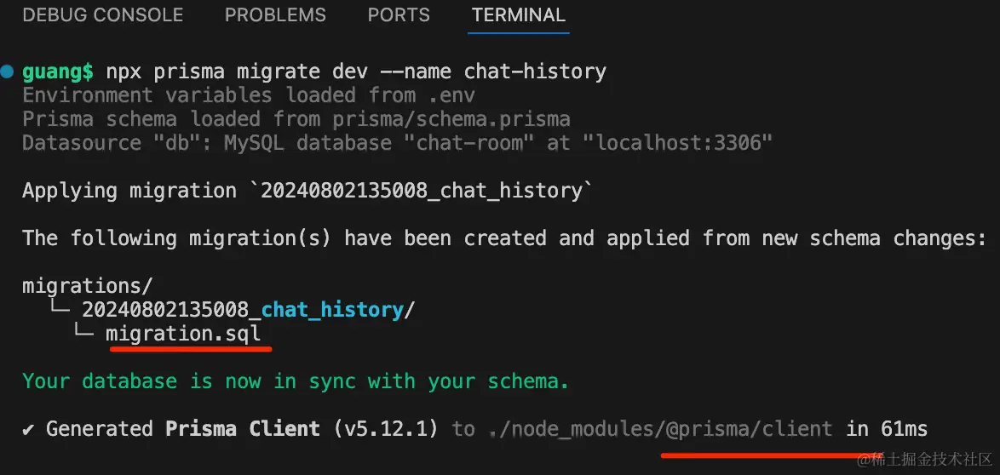

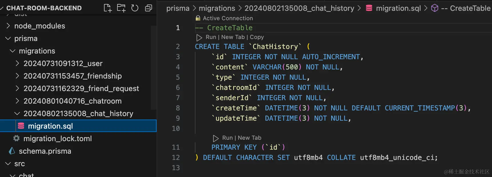

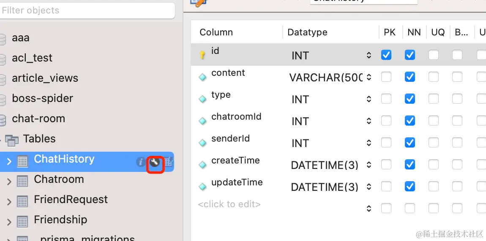

没啥问题。

然后创建 chat-history 模块：

```
nest g resource chat-history --no-spec
```


先改下 ChatHistoryService，实现 list、add 方法：

```javascript
import { Inject, Injectable } from '@nestjs/common';
import { ChatHistory } from '@prisma/client';
import { PrismaService } from 'src/prisma/prisma.service';

export type HistoryDto = Pick<ChatHistory, 'chatroomId' | 'senderId' | 'type' | 'content'>;

@Injectable()
export class ChatHistoryService {
    @Inject(PrismaService)
    private prismaService: PrismaService;

    async list(chatroomId: number) {
        return this.prismaService.chatHistory.findMany({
            where: {
                chatroomId
            }
        });
    }

    async add(chatroomId: number, history: HistoryDto) {
        return this.prismaService.chatHistory.create({
            data: history
        });
    }

}
```
我们把 ChatHistoryService 暴露出去，让别的模块可以调用：

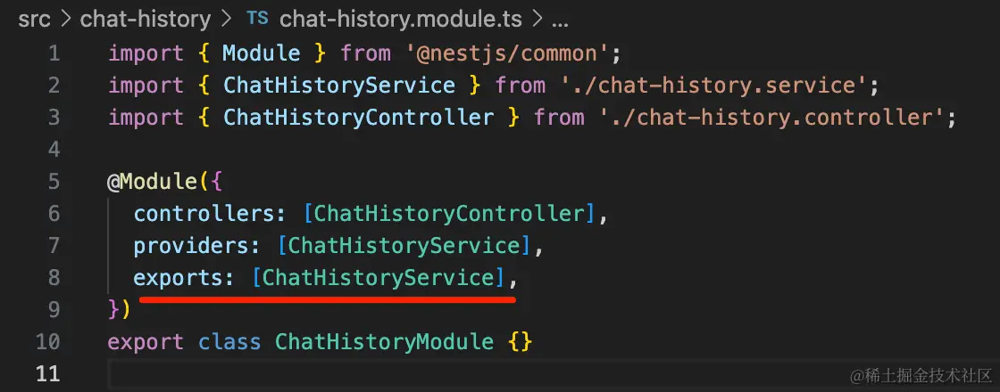

在 ChatModule 引入下：

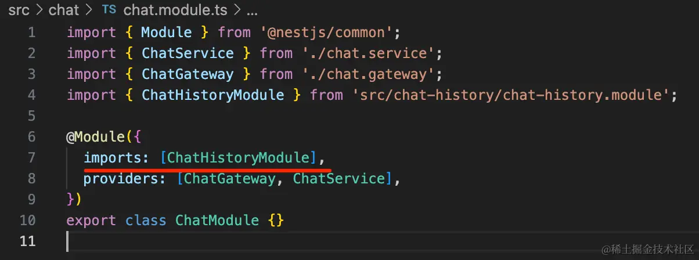

发消息的时候就可以保存聊天记录了：

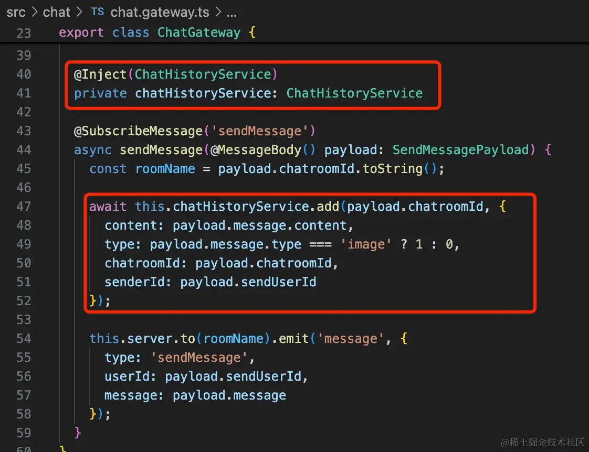

```javascript
@Inject(ChatHistoryService)
private chatHistoryService: ChatHistoryService

@SubscribeMessage('sendMessage')
async sendMessage(@MessageBody() payload: SendMessagePayload) {
  const roomName = payload.chatroomId.toString();

  await this.chatHistoryService.add(payload.chatroomId, {
    content: payload.message.content,
    type: payload.message.type === 'image' ? 1 : 0,
    chatroomId: payload.chatroomId,
    senderId: payload.sendUserId
  });

  this.server.to(roomName).emit('message', { 
    type: 'sendMessage',
    userId: payload.sendUserId,
    message: payload.message
  });
}
```
再聊会天：


这时候聊天内容就保存到了数据库里：

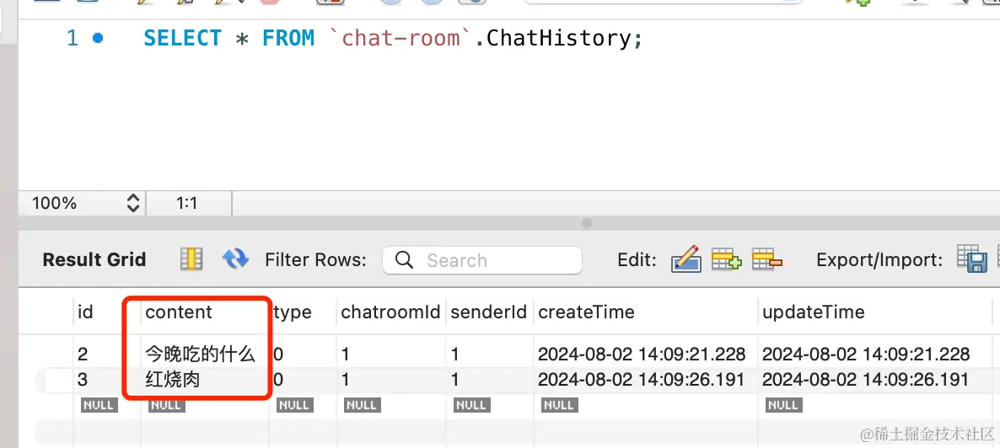

我们还要加一个查询聊天记录的接口：

```javascript
import { Controller, Get, Query } from '@nestjs/common';
import { ChatHistoryService } from './chat-history.service';

@Controller('chat-history')
export class ChatHistoryController {
  constructor(private readonly chatHistoryService: ChatHistoryService) {}

  @Get('list')
  async list(@Query('chatroomId') chatroomId: string) {
    return this.chatHistoryService.list(+chatroomId);
  }
}
```
postman 里调用下：

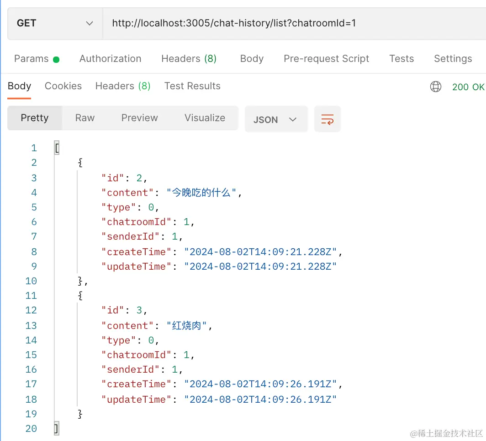

我们顺带把 user 信息查出来返回：

```javascript
async list(chatroomId: number) {
    const history = await this.prismaService.chatHistory.findMany({
        where: {
            chatroomId
        }
    });

    const res = [];
    for(let i = 0; i < history.length; i++) {
        const user = await this.prismaService.user.findUnique({
            where: {
                id: history[i].senderId
            },
            select: {
                id: true,
                username: true,
                nickName: true,
                email: true,
                createTime: true,
                headPic: true
            }
        });
        res.push({
            ...history[i],
            sender: user
        });
    }
    return res;
}
```
测试下：

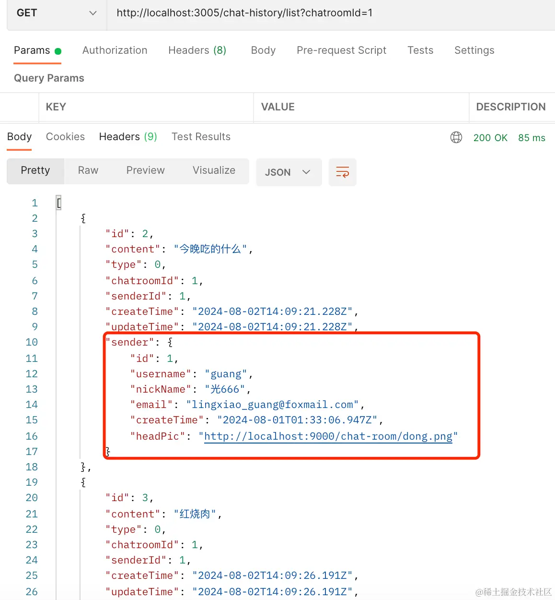

这样，点击切换不同聊天室的时候，就可以把聊天历史记录查出来展示了：


[前端代码](https://github.com/QuarkGluonPlasma/nestjs-course-code/tree/main/chat-room-frontend)

[后端代码](https://github.com/QuarkGluonPlasma/nestjs-course-code/tree/main/chat-room-backend)

## 总结

这节我们基于 socket.io 实现了 websocket 服务的前后端。

发送 joinRoom 消息的时候把 client socket 加入房间，房间名为 chatroomId

发送 sendMessage 消息的时候把 message 发送给房间的所有用户。

前端通过 socket.io-client 来实现。

我们还做了聊天记录的保存，每个房间聊天的时候都会把聊天内容存到数据库里。

这样，聊天功能的后端部分就完成了。
