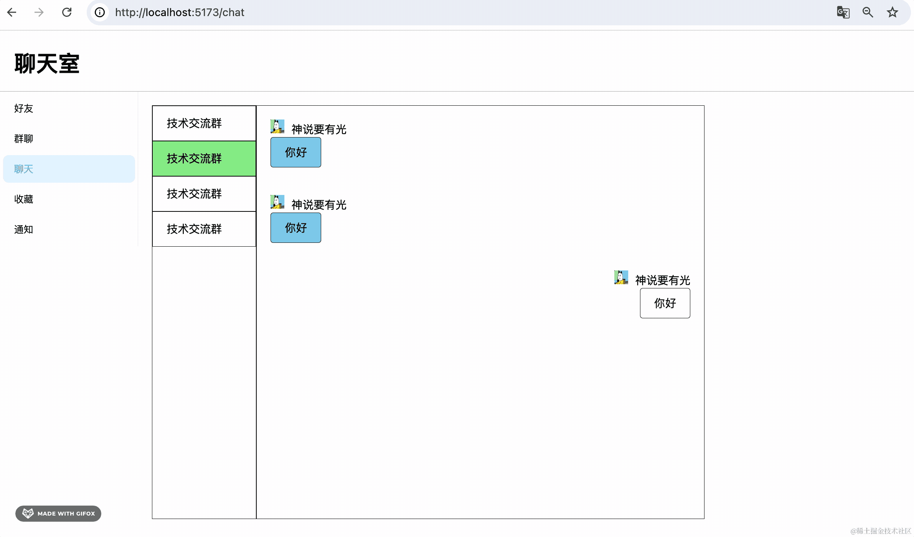

# 188. 聊天室：聊天功能前端开发

这节来写下聊天的前端页面：


左侧是聊天室列表，右边是聊天界面。

点击左侧切换聊天室，就可以在不同聊天室聊天。

先写下样式：


```javascript
return <div id="chat-container">
        <div className="chat-room-list">
            <div className="chat-room-item">技术交流群</div>
            <div className="chat-room-item selected">技术交流群</div>
            <div className="chat-room-item">技术交流群</div>
            <div className="chat-room-item">技术交流群</div>
        </div>
        <div className="message-list">
            <div className="message-item">
                <div className="message-sender">
                    
                    <span className="sender-nickname">神说要有光</span>
                </div>
                <div className="message-content">
                    你好
                </div>
            </div>
            <div className="message-item">
                <div className="message-sender">
                    
                    <span className="sender-nickname">神说要有光</span>
                </div>
                <div className="message-content">
                    你好
                </div>
            </div>
            <div className="message-item from-me">
                <div className="message-sender">
                    
                    <span className="sender-nickname">神说要有光</span>
                </div>
                <div className="message-content">
                    你好
                </div>
            </div>
        </div>
    </div>
```
样式 index.scss

```scss
#chat-container {
    margin: 20px;
    display: flex;
    flex-direction: row;
    width: 800px;
    height: 600px;

    .chat-room-list {
        width: 150px;
        border: 1px solid #000;
        overflow-y: auto;
    }

    .chat-room-item {
        line-height: 50px;
        padding-left: 20px;
        border: 1px solid #000;
        cursor: pointer;

        &:hover, &.selected{
            background: lightgreen;
        }
    }

    .message-list {
        border: 1px solid #000;
        flex: 1;
        overflow-y: auto;

        .message-item {
            padding: 20px;
        
            display: flex;
            flex-wrap: wrap;

            .message-sender {
                width:100%;

                img{
                    width: 20px;
                    height: 20px;
                    padding-right: 10px;
                }
            }

            .message-content{
                border: 1px solid #000;
                width:max-content;
                padding: 10px 20px;
                border-radius: 4px;
                background: skyblue;
            }
            
            &.from-me{
                text-align: right;
                justify-content: right;

                .message-content{
                    text-align: right;
                    justify-content: right;
                    background: #fff;
                }
            }
        }
    }
}
```
因为样式比较复杂，我们用到了 sass

安装下：

```
npm install --save-dev sass
```
看下效果：



布局比较简单，整体宽度 800px，左侧宽度固定，右侧 flex:1

然后右边的布局也是 flex 布局，有 .from-me 的设置 justify-content:right;

然后我们请求下聊天室列表：


```javascript
const [roomList, setRoomList] = useState<Array<Chatroom>>();

async function queryChatroomList() {
    try{
        const res = await chatroomList();

        if(res.status === 201 || res.status === 200) {
            setRoomList(res.data.map((item: Chatroom) => {
                return {
                    ...item,
                    key: item.id
                }
            }));
        }
    } catch(e: any){
        message.error(e.response?.data?.message || '系统繁忙，请稍后再试');
    }
}

useEffect(() => {
    queryChatroomList();
}, []);
```
```javascript
{
    roomList?.map(item => {
        return <div className="chat-room-item" data-id={item.id}  key={item.id} >{item.name}</div>
    })
}
```

然后 interfaces 加一下请求聊天记录的接口：

```javascript
export async function chatHistoryList(id: number) {
    return axiosInstance.get(`/chat-history/list?chatroomId=${id}`);
}
```
组件里当点击聊天室的时候，就查询对应的聊天记录显示：


```javascript
useEffect(() => {
    queryChatroomList();
}, []);

interface ChatHistory {
    id: number
    content: string
    type: number
    chatroomId: number
    senderId: number
    createTime: Date,
    sender: UserInfo
}

const [chatHistory, setChatHistory] = useState<Array<ChatHistory>>();

async function queryChatHistoryList(chatroomId: number) {
    try{
        const res = await chatHistoryList(chatroomId);

        if(res.status === 201 || res.status === 200) {
            setChatHistory(res.data.map((item: Chatroom) => {
                return {
                    ...item,
                    key: item.id
                }
            }));
        }
    } catch(e: any){
        message.error(e.response?.data?.message || '系统繁忙，请稍后再试');
    }
}
```
```javascript
return <div id="chat-container">
    <div className="chat-room-list">
        {
            roomList?.map(item => {
                return <div className="chat-room-item" data-id={item.id}  key={item.id}  onClick={() => {
                    queryChatHistoryList(item.id);
                }}>{item.name}</div>
            })
        }
    </div>
    <div className="message-list">
        {chatHistory?.map(item => {
            return <div className="message-item" data-id={item.id}  key={item.id} >
                <div className="message-sender">
                    
                    <span className="sender-nickname">{item.sender.nickName}</span>
                </div>
                <div className="message-content">
                    {item.content}
                </div>
            </div>
        })}
    </div>
</div>
```


然后我们加上聊天的功能：


用绝对定位把这个 div 定位在右下角：


```scss
position: relative;
```
```scss
.message-input {
    width: 648px;
    border: 1px solid #000;

    height: 100px;
    position: absolute;
    bottom: 0;
    right: 0;

    .message-type {
        display: flex;

        .message-type-item {
            width: 100px;
            &:hover {
                font-weight: bold;
                cursor: pointer;
            }
        }
    }

    .message-input-area {
        width: 650px;

        display: flex;
        .message-send-btn {
            width: 50px;
            height: 50px;
        }
    }
}
```
但这样会和 .message-list 重合：


我们改下 .message-list 的高度


```css
height: calc(100% - 100px);
```
然后把它的 border-bottom 去掉：


```css
border-bottom: 0;
```


这样，布局就完成了。

我们来加一下发消息的功能：


用 inputText 的 state 保存输入的内容，点击发送的时候调用 sendMessage 方法。


sendMessage 方法从 localStorage 拿 userId，然后单独一个 state 保存 chatroomId。


点击切换聊天室的时候 setChatroomId


当收到新的消息的时候重新查询聊天记录


roomId 改变的时候重新链接一下：


```javascript
import { Button, Input, message } from "antd";
import { useEffect, useRef, useState } from "react";
import { io, Socket } from "socket.io-client";
import './index.scss';
import { chatHistoryList, chatroomList } from "../../interfaces";
import { UserInfo } from "../UpdateInfo";
import TextArea from "antd/es/input/TextArea";

interface JoinRoomPayload {
    chatroomId: number
    userId: number
}

interface SendMessagePayload {
    sendUserId: number;
    chatroomId: number;
    message: Message
}

interface Message {
    type: 'text' | 'image'
    content: string
}

type Reply  = {
    type: 'sendMessage'
    userId: number
    message: Message
} | {
    type: 'joinRoom'
    userId: number
}


interface Chatroom {
    id: number;
    name: string;
    createTime: Date;
}

interface ChatHistory {
    id: number
    content: string
    type: number
    chatroomId: number
    senderId: number
    createTime: Date,
    sender: UserInfo
}

interface User {
    id: number;
    email: string;
    headPic: string;
    nickName: string;
    username: string;
    createTime: Date;
}

export function getUserInfo(): User {
    return JSON.parse(localStorage.getItem('userInfo')!);
}

export function Chat() {
    const socketRef = useRef<Socket>();
    const [roomId, setChatroomId] = useState<number>();

    useEffect(() => {
        if(!roomId) {
            return;
        }
        const socket = socketRef.current = io('http://localhost:3005');
        socket.on('connect', function() {
    
            const payload: JoinRoomPayload = {
                chatroomId: roomId,
                userId: getUserInfo().id
            }
    
            socket.emit('joinRoom', payload);
    
            socket.on('message', (reply: Reply) => {
                queryChatHistoryList(roomId);
            });
    
        });
        return () => {
            socket.disconnect();
        }
    }, [roomId]);

    function sendMessage(value: string) {
        if(!value) {
            return;
        }
        if(!roomId) {
            return;
        }

        const payload: SendMessagePayload = {
            sendUserId: getUserInfo().id,
            chatroomId: roomId,
            message: {
                type: 'text',
                content: value
            }
        }

        socketRef.current?.emit('sendMessage', payload);
    }

    const [roomList, setRoomList] = useState<Array<Chatroom>>();

    async function queryChatroomList() {
        try{
            const res = await chatroomList();

            if(res.status === 201 || res.status === 200) {
                setRoomList(res.data.map((item: Chatroom) => {
                    return {
                        ...item,
                        key: item.id
                    }
                }));
            }
        } catch(e: any){
            message.error(e.response?.data?.message || '系统繁忙，请稍后再试');
        }
    }

    useEffect(() => {
        queryChatroomList();
    }, []);

    const [chatHistory, setChatHistory] = useState<Array<ChatHistory>>();

    async function queryChatHistoryList(chatroomId: number) {
        try{
            const res = await chatHistoryList(chatroomId);

            if(res.status === 201 || res.status === 200) {
                setChatHistory(res.data.map((item: Chatroom) => {
                    return {
                        ...item,
                        key: item.id
                    }
                }));
            }
        } catch(e: any){
            message.error(e.response?.data?.message || '系统繁忙，请稍后再试');
        }
    }
    const [inputText, setInputText] = useState('');

    return <div id="chat-container">
        <div className="chat-room-list">
            {
                roomList?.map(item => {
                    return <div className="chat-room-item" key={item.id} data-id={item.id} onClick={() => {
                        queryChatHistoryList(item.id);
                        setChatroomId(item.id);
                    }}>{item.name}</div>
                })
            }
        </div>
        <div className="message-list">
            {chatHistory?.map(item => {
                return <div className="message-item" data-id={item.id}>
                    <div className="message-sender">
                        
                        <span className="sender-nickname">{item.sender.nickName}</span>
                    </div>
                    <div className="message-content">
                        {item.content}
                    </div>
                </div>
            })}
        </div>
        <div className="message-input">
            <div className="message-type">
                <div className="message-type-item" key={1}>表情</div>
                <div className="message-type-item" key={2}>图片</div>
                <div className="message-type-item" key={3}>文件</div>
            </div>
            <div className="message-input-area">
                <TextArea className="message-input-box" value={inputText} onChange={(e) => {
                    setInputText(e.target.value)
                }}/>
                <Button className="message-send-btn" type="primary" onClick={() => {
                    sendMessage(inputText)
                    setInputText('');
                }}>发送</Button>
            </div>
        </div>
    </div>
}
```
测试下：


聊天没问题，就是样式不大对。

我们加一下判断：


```javascript
className={`message-item ${item.senderId === userInfo.id ? 'from-me' : ''}`}
```


现在样式就对了，只不过自己聊没意思。

在数据库里查一下上面那个聊天室的另一个用户：


换个浏览器登录小强的账号：


然后在光的账号这边看下：


收到了小强的消息。

我们聊一会天：


能聊天了。

就是每次需要手动滚动到底部才能看到新消息。

我们加一下自动滚动：


```javascript
<div id="bottom-bar" key='bottom-bar'></div>
```
```javascript
setTimeout(() => {
    document.getElementById('bottom-bar')?.scrollIntoView({block: 'end'});
}, 300);
```


这样，基本聊天功能就完成了。

但这样其实性能并不好，没必要每发一条消息就查一下聊天记录。

我们在服务端把消息存到聊天记录表之后，把这条消息返回：


此外，sender 的信息也要查出来：

把 UserService 导出，然后在 chat 模块引入：


返回 history 的时候把 sender 也查出来：


```javascript
@Inject(UserService)
private userService: UserService

@SubscribeMessage('sendMessage')
async sendMessage(@MessageBody() payload: SendMessagePayload) {
    const roomName = payload.chatroomId.toString();

    const history = await this.chatHistoryService.add(payload.chatroomId, {
      content: payload.message.content,
      type: payload.message.type === 'image' ? 1 : 0,
      chatroomId: payload.chatroomId,
      senderId: payload.sendUserId
    });
    const sender = await this.userService.findUserDetailById(history.senderId);

    this.server.to(roomName).emit('message', { 
      type: 'sendMessage',
      userId: payload.sendUserId,
      message: {
        ...history,
        sender
      }
    });
}
```
然后前端就可以直接在后面添加了：


```javascript
socket.on('message', (reply: Reply) => {
    if(reply.type === 'sendMessage') {
        setChatHistory((chatHistory) => {
            return chatHistory ? [...chatHistory, reply.message] : [reply.message]
        });   
        setTimeout(() => {
            document.getElementById('bottom-bar')?.scrollIntoView({block: 'end'});
        }, 300);
    }
});
```


这样，全程只需要查询一次聊天记录，性能好很多。

[前端代码](https://github.com/QuarkGluonPlasma/nestjs-course-code/tree/main/chat-room-frontend)

[后端代码](https://github.com/QuarkGluonPlasma/nestjs-course-code/tree/main/chat-room-backend)
## 总结

这节我们实现了聊天页面。

首先，我们写了布局，在左侧展示聊天室列表。

点击聊天室的时候，在右侧展示查询出的聊天记录。

点击发送消息的时候，通过 socket 链接来 emit 消息。

监听服务端的 message 消息，有新消息的时候添加到聊天记录里，并通过 scrollIntoView 滚动到底部。

这样，多个用户在不同房间聊天的功能就完成了。
