# 189. 聊天室：一对一聊天

上节实现了聊天界面，但是聊天室不是通过 UI 操作创建的，是我们之前通过接口创建的。

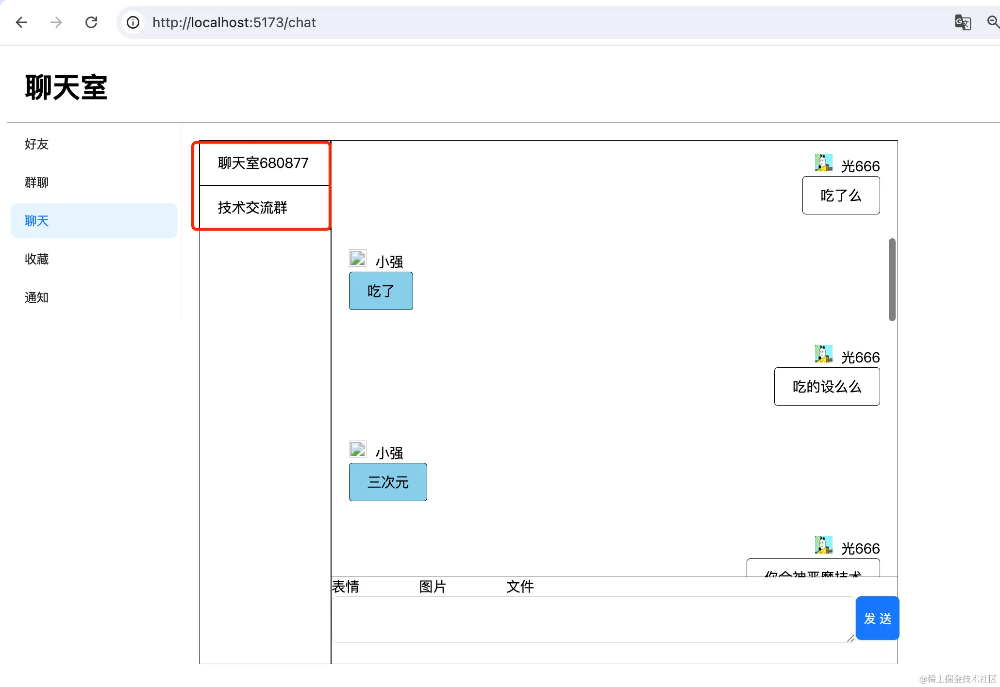

这节就来实现下进入聊天的入口。

也就是这两个：

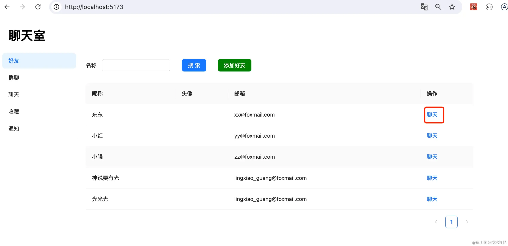

点击聊天按钮的时候，要创建聊天室，或者查找已有的聊天室，然后带着 id 跳到聊天页面：

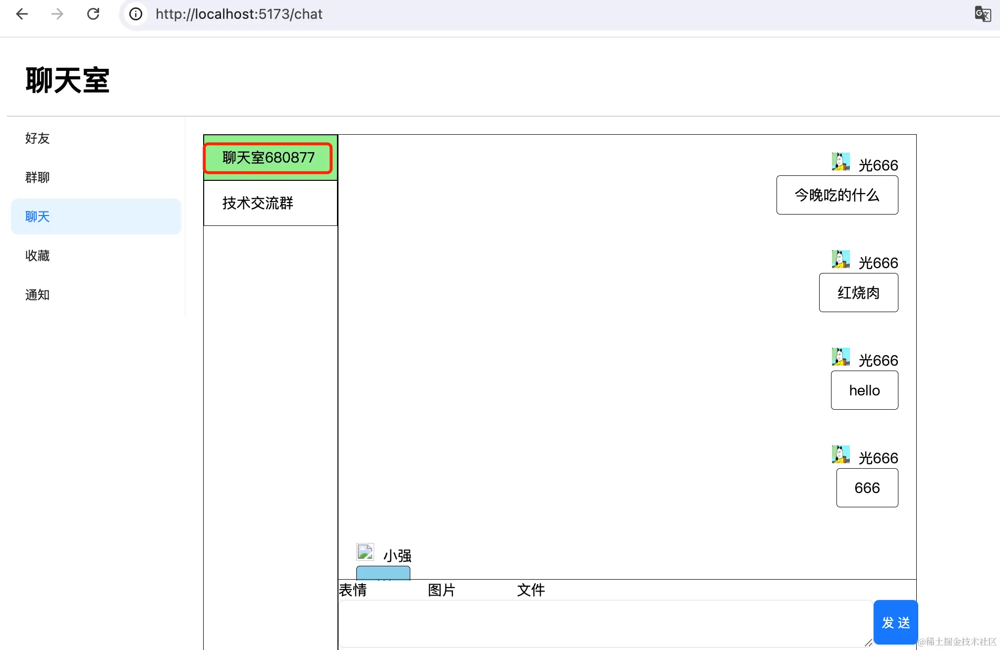

聊天页面选中 id 对应的聊天室。

给聊天按钮加一个点击事件，点击的时候传入对应用户的 id：

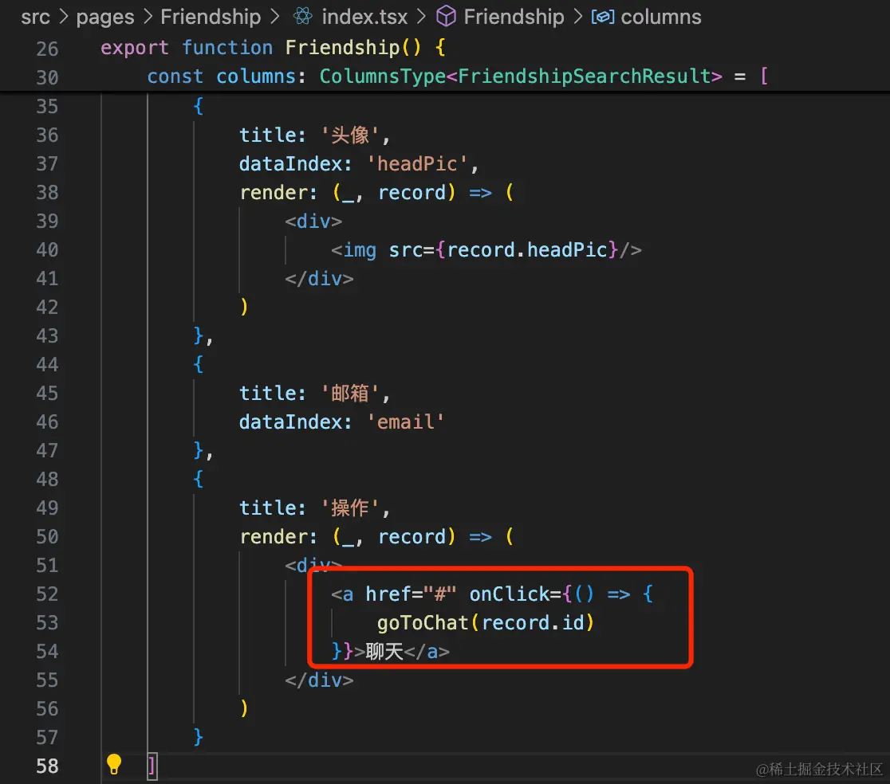
```javascript
<a href="#" onClick={() => {
    goToChat(record.id)
}}>聊天</a>
```
goToChat 能拿到两个用户的 id，自然就能查到对应的聊天室：

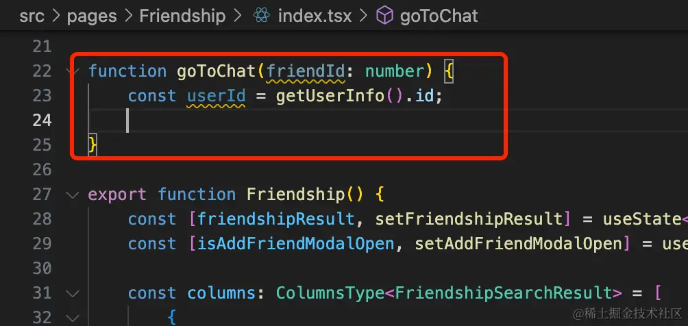

现在没这个接口，我们加一下：

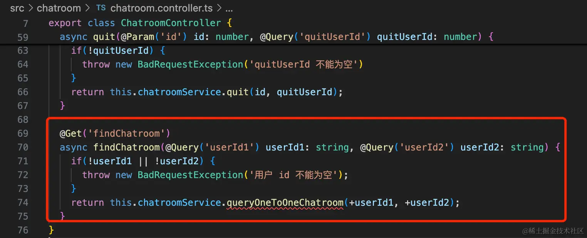

```javascript
@Get('findChatroom')
async findChatroom(@Query('userId1') userId1: string, @Query('userId2') userId2: string) {
    if(!userId1 || !userId2) {
      throw new BadRequestException('用户 id 不能为空');
    }
    return this.chatroomService.queryOneToOneChatroom(+userId1, +userId2);
}
```
在 service 实现这个方法：

```javascript
async queryOneToOneChatroom(userId1: number, userId2: number) {
    const chatrooms = await this.prismaService.userChatroom.findMany({
        where: {
            userId: userId1
        }
    })
    const chatrooms2 = await this.prismaService.userChatroom.findMany({
        where: {
            userId: userId2
        }
    })

    let res;
    for(let i = 0; i < chatrooms.length; i++) {
        const chatroom = await this.prismaService.chatroom.findFirst({
            where: {
                id: chatrooms[i].chatroomId
            }
        })
        if(chatroom.type === true) {
            continue;
        }

        const found = chatrooms2.find(item2 => item2.chatroomId === chatroom.id)
        if(found) {
            res = found.chatroomId
            break;
        }
    }

    return res
}
```
因为我们没用外键关联，实现起来麻烦一些。

先查询 userId1 的所有 chatrooms，再查询 userId2 的所有 chatrooms2。

然后再查询 chatrooms 和 chatroom2 的交集，返回第一个 chatroomId

过程中要过滤掉类型为群聊的聊天室。

这就是两个 user 都在的 1-1 聊天室。

测试下：

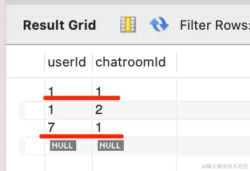

现在只有这两个用户在一个聊天室。

结果是对的：

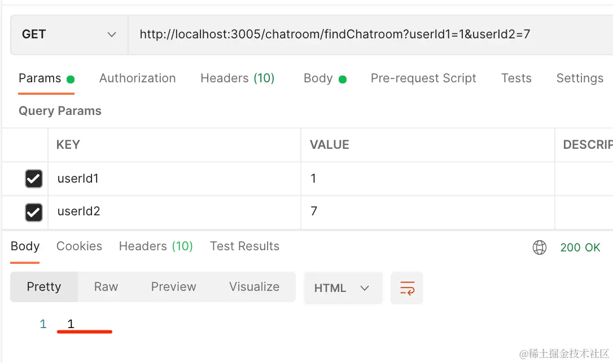

然后在前端调用下：

```javascript
export async function findChatroom(userId1: number, userId2: number) {
    return axiosInstance.get(`/chatroom/findChatroom`, {
        params: {
            userId1,
            userId2
        }
    });
}

export async function createOneToOne(friendId: number,) {
    return axiosInstance.get(`/chatroom/create-one-to-one`, {
        params: {
            friendId,
        }
    });
}
```
在 interfaces 调用下查找聊天室和创建一对一聊天室的接口。

之前 create-one-to-one 接口没有返回聊天室 id，我们返回下：

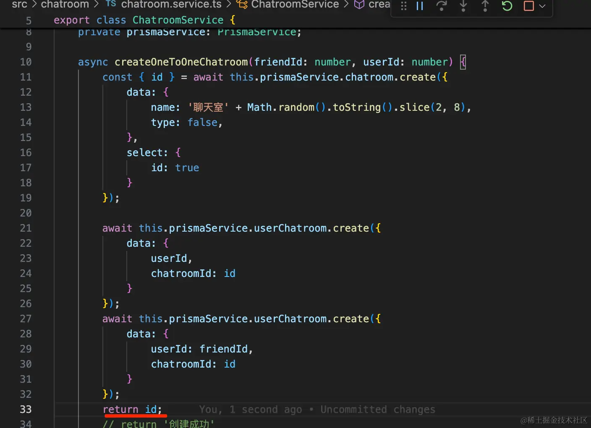

在组件里调用下：

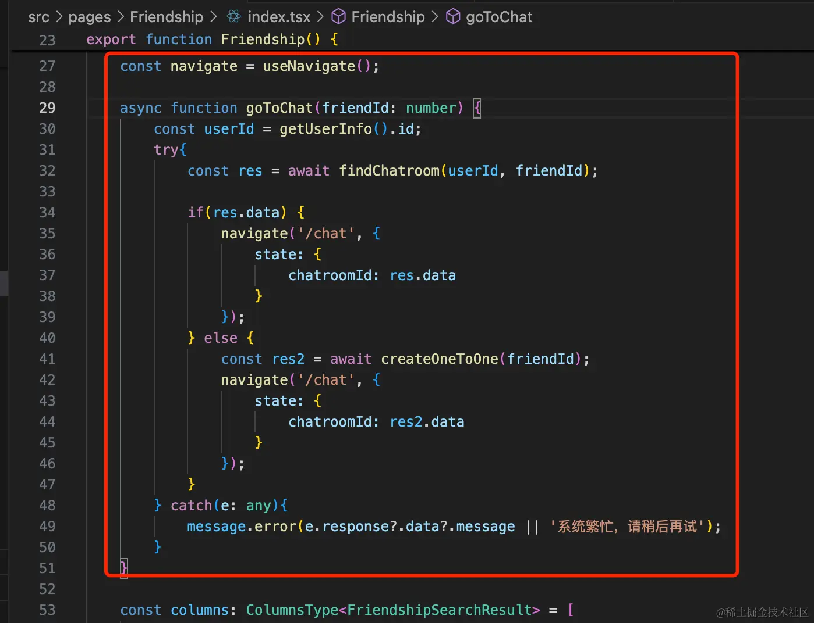
```javascript
const navigate = useNavigate();

async function goToChat(friendId: number) {
    const userId = getUserInfo().id;
    try{
        const res = await findChatroom(userId, friendId);

        if(res.data) {
            navigate('/chat', {
                state: {
                    chatroomId: res.data
                }
            });
        } else {
            const res2 = await createOneToOne(friendId);
            navigate('/chat', {
                state: {
                    chatroomId: res2.data
                }
            });
        }
    } catch(e: any){
        message.error(e.response?.data?.message || '系统繁忙，请稍后再试');
    }
}
```
在 Chat 组件里取出 state 里的数据：

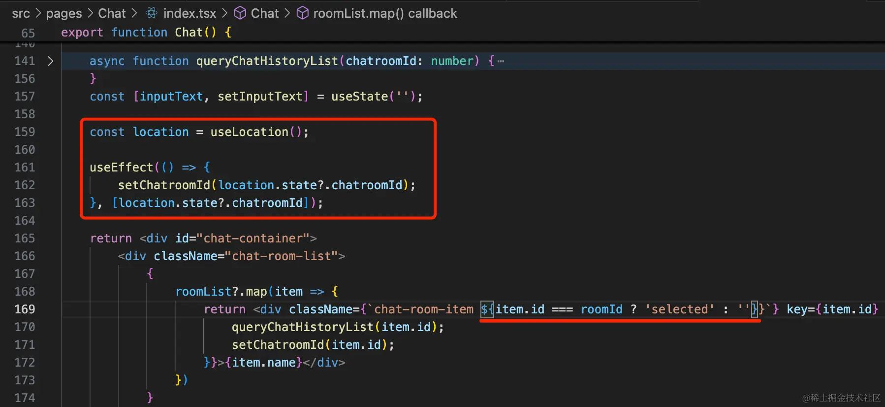

如果 state 里有 chatroomId，就选中对应的聊天室。

并且选中的聊天室加上 selected 的 className。

```javascript
const location = useLocation();

useEffect(() => {
    setChatroomId(location.state?.chatroomId);
}, [location.state?.chatroomId]);
```

```javascript
className={`chat-room-item ${item.id === roomId ? 'selected' : ''}`}
```
测试下：


没啥问题，和小强聊过天，会选中已有的聊天室。

和小红没有聊过天，会创建一个新聊天室然后选中。

只不过现在聊天室名字不大好。

一对一聊天室的名字之前是随机生成的，我们在查询聊天室列表的时候改一下：

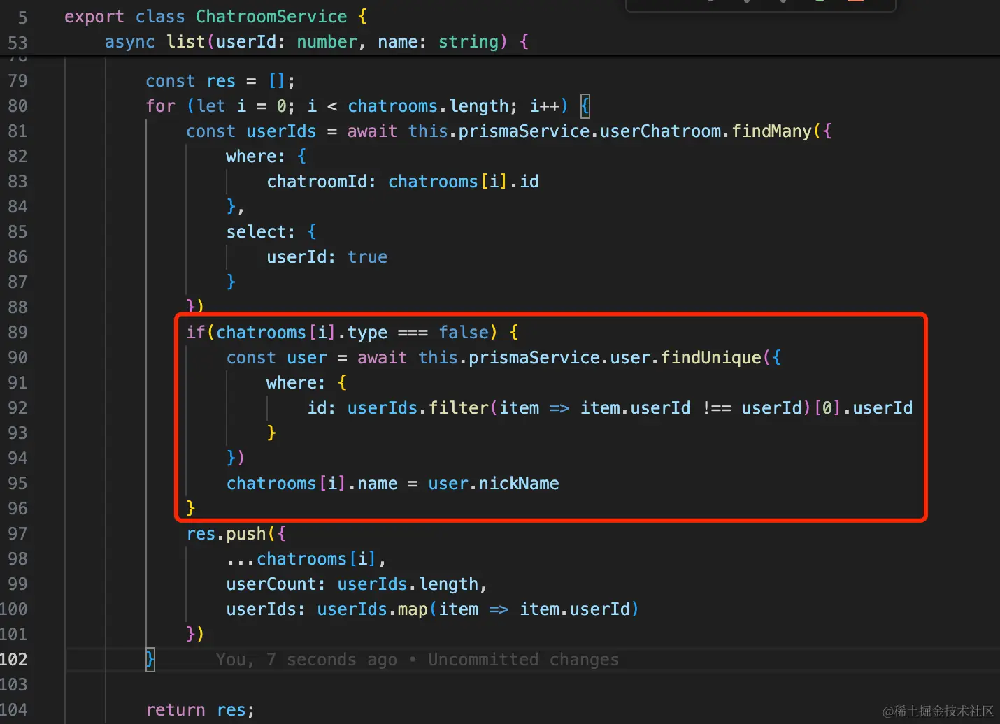

```javascript
if(chatrooms[i].type === false) {
    const user = await this.prismaService.user.findUnique({
        where: {
            id: userIds.filter(item => item.userId !== userId)[0].userId
        }
    })
    chatrooms[i].name = user.nickName
}
```
返回聊天室列表的时候，如果是一对一聊天室，就查询下对方用户的信息，用他的名字替换聊天室名字。

刷新下：

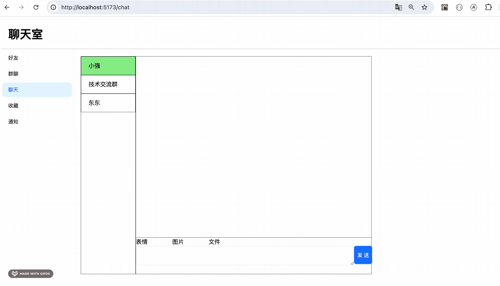

现在，聊天室名字就和平时用的聊天软件一样了。

我们登录神说要有光账号聊聊天：


没啥问题，这样和好友聊天的功能就完成了。

和前面的注册用户、添加好友、发起聊天连起来测试下：

注册个账号：

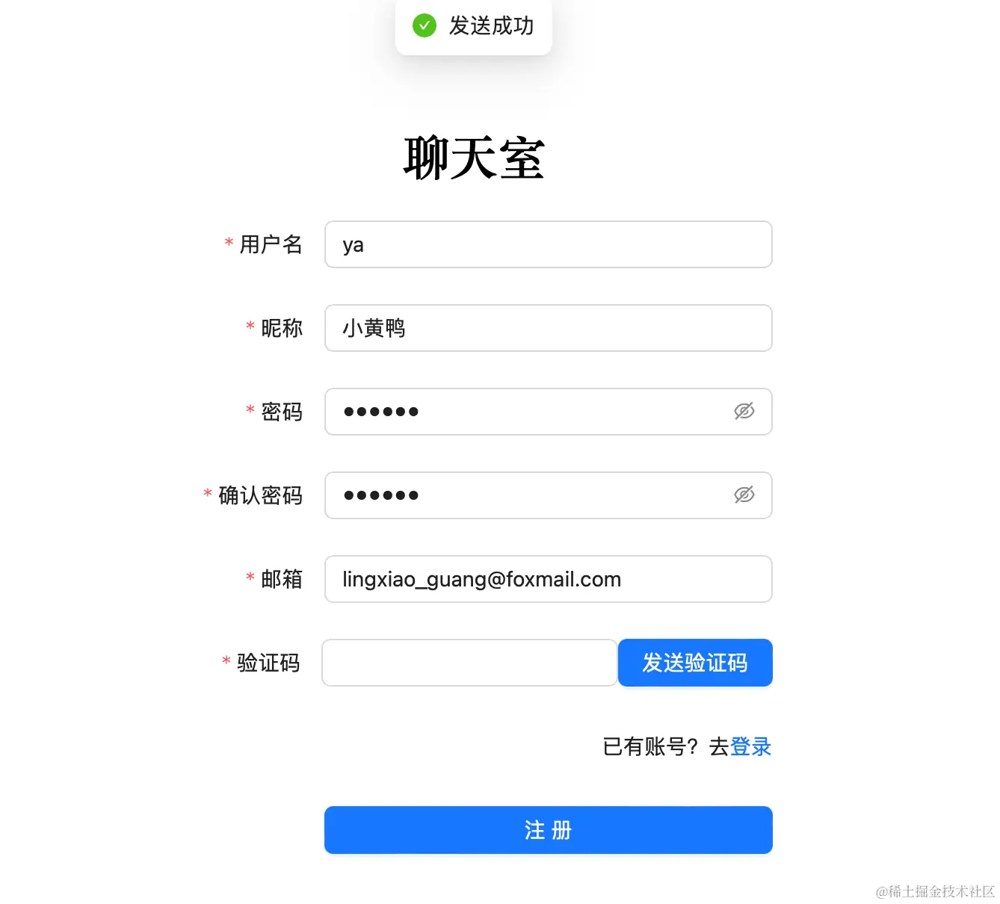

登录，添加光为好友：


光这边可以看到这个好友请求，同意之后就可以在好友列表看到了：


然后回到小黄鸭这边：


可以看到好友申请已经通过，可以在好友列表看到光，然后进入聊天：


从加好友到聊天，整个流程都没问题。

[前端代码](https://github.com/QuarkGluonPlasma/nestjs-course-code/tree/main/chat-room-frontend)

[后端代码](https://github.com/QuarkGluonPlasma/nestjs-course-code/tree/main/chat-room-backend)

## 总结

这节我们打通了一对一聊天的流程。

在好友列表点击聊天，会查询 userId 和 friendId 所在的一对一聊天室的 id（如果没查到，会创建一个），然后跳转到聊天页面，选中对应的聊天室。

接下来就可以在聊天室进行一对一聊天了。

我们测试了从注册用户、添加好友到聊天的流程，都没问题。
