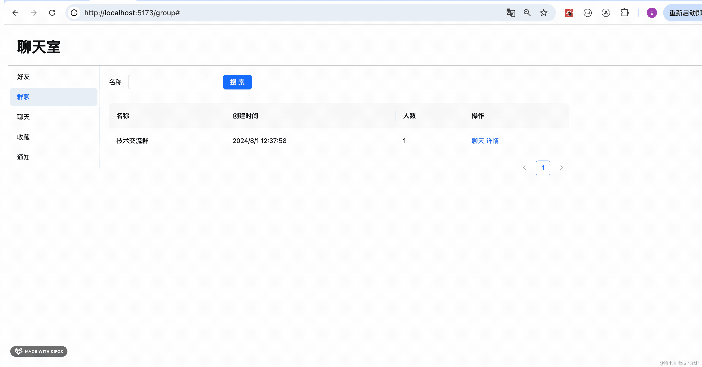
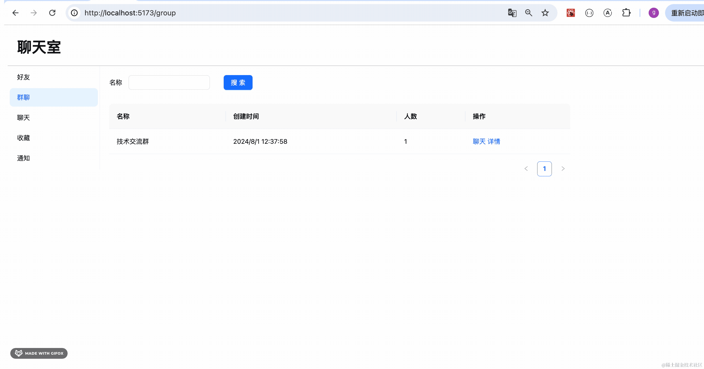
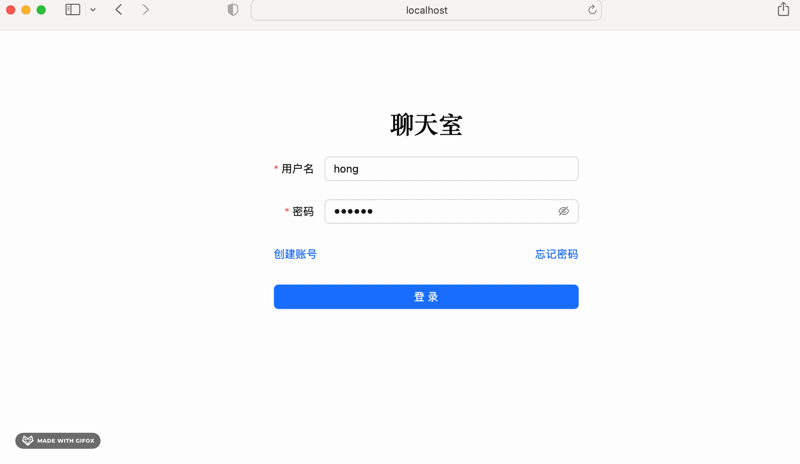
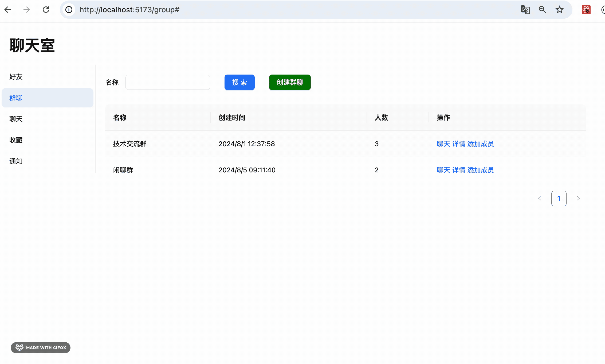
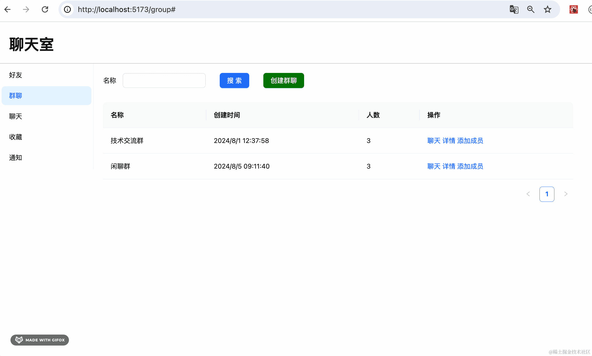
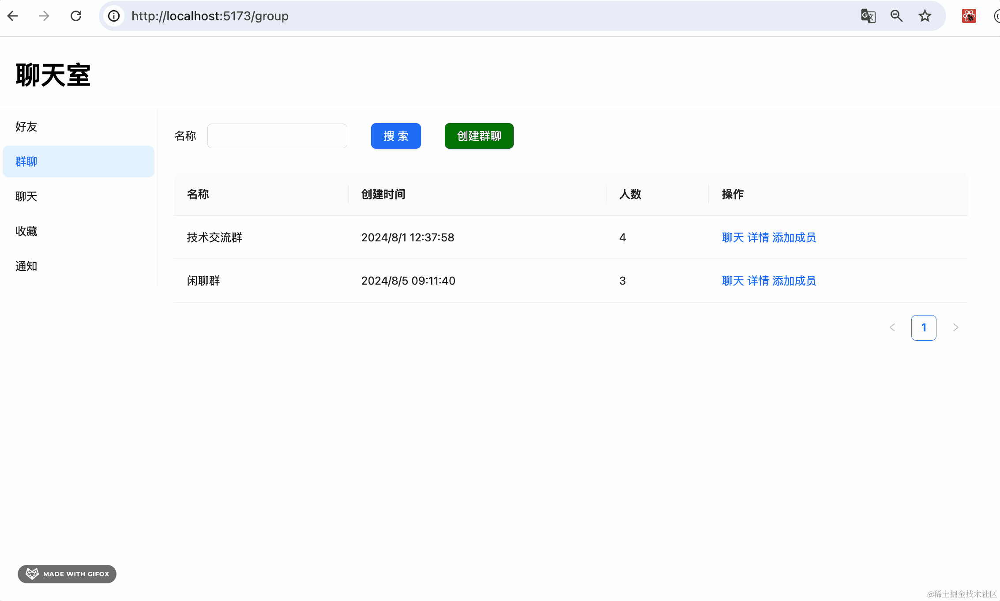
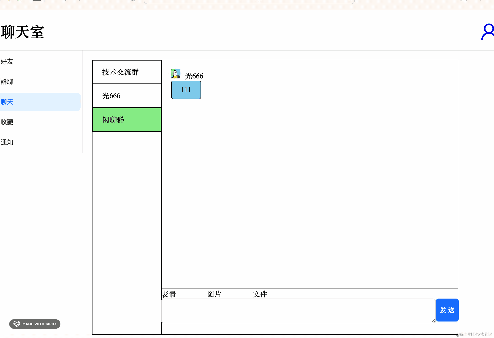
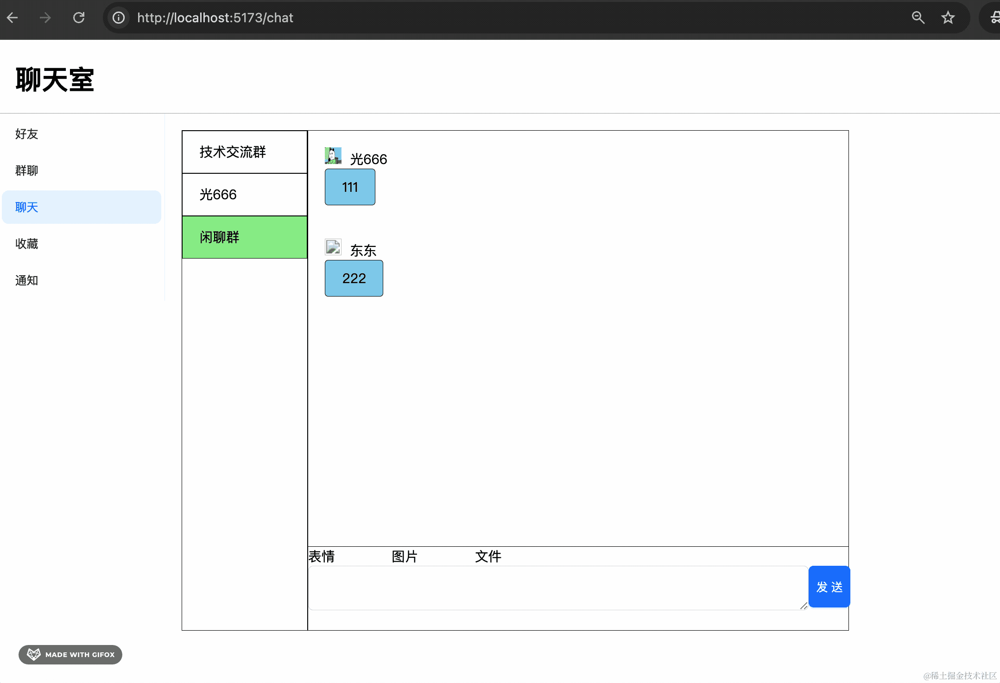

# 190. 聊天室：创建群聊、进入群聊

上节打通了一对一聊天的流程，这节继续打通群聊的流程。


其实现在展示的群聊列表有点问题，应该把一对一的聊天室过滤掉，而且把群聊人数显示出来。

我们改一下：


```javascript
interface GroupSearchResult {
    id: number;
    name: string;
    type: boolean;
    userCount: number;
    userIds: Array<number>;
    createTime: Date;
}
```
```javascript
setGroupResult(res.data.filter((item: GroupSearchResult) => {
    return item.type === true
}).map((item: GroupSearchResult) => {
    return {
        ...item,
        key: item.id
    }
}));
```
现在就只剩下群聊了：


然后我们优化下日期展示，加上人数展示，加一个详情按钮：


```javascript
{
    title: '创建时间',
    dataIndex: 'createTime',
    render: (_, record) => {
        return new Date(record.createTime).toLocaleString()
    }
},
{
    title: '人数',
    dataIndex: 'userCount'
},
{
    title: '操作',
    render: (_, record) => (
        <div>
            <a href="#">聊天</a>&nbsp;
            <a href="#">详情</a>
        </div>
    )
}
```


点击详情按钮的时候，通过弹窗展示群聊的成员。

我们加一个 Modal 组件：

src/pages/Group/MembersModal.tsx

```javascript
import { message, Modal, Table } from "antd";
import { ColumnsType } from "antd/es/table";
import { useEffect, useState } from "react";
import { groupMembers } from "../../interfaces";

export interface MembersModalProps {
    isOpen: boolean
    chatroomId: number
    handleClose: () => void
}

interface User {
    id: number;
    username: string;
    nickName: string;
    headPic: string;
    email: string;
}

export function MembersModal(props: MembersModalProps) {

    const [members, setMembers] = useState<Array<User>>();

    const queryMembers = async () => {
        try{
            const res = await groupMembers(props.chatroomId);

            if(res.status === 201 || res.status === 200) {
                setMembers(res.data.map((item: User) => {
                    return {
                        ...item,
                        key: item.id
                    }
                }));
            }
        } catch(e: any){
            message.error(e.response?.data?.message || '系统繁忙，请稍后再试');
        }
    };

    useEffect(() => {
        queryMembers();
    }, [props.chatroomId]);

    const columns: ColumnsType<User> = [
        {
            title: 'ID',
            dataIndex: 'id'
        },
        {
            title: '用户名',
            dataIndex: 'username'
        },
        {
            title: '昵称',
            dataIndex: 'nickName'
        },
        {
            title: '头像',
            dataIndex: 'headPic',
            render: (_, record) => (
                <div>
                    
                </div>
            )
        },
        {
            title: '邮箱',
            dataIndex: 'email'
        }
    ]

    return <Modal 
        title="群聊成员"
        open={props.isOpen}
        onCancel={() => props.handleClose()}
        onOk={() => props.handleClose()}
        width={1000}
    >
        <Table columns={columns} dataSource={members} pagination={false}/>
    </Modal>
}
```

它就是调用 members 接口查询成员数据，用 table 展示。

在 interface 加一下这个接口：

```javasript
export async function groupMembers(chatroomId: number) {
    return axiosInstance.get(`/chatroom/members`, {
        params: {
            chatroomId
        }
    });
}
```
然后在 Group/index.tsx 调用下：


就是用一个 state 保存 Modal 打开状态，一个 state 保存当前的 chatroomId

```javascript
import { Badge, Button, Form, Input, Popconfirm, Table, message } from "antd";
import { useCallback, useEffect, useMemo, useState } from "react";
import './index.css';
import { ColumnsType } from "antd/es/table";
import { useForm } from "antd/es/form/Form";
import { chatroomList } from "../../interfaces";
import { MembersModal } from "./MembersModal";

interface SearchGroup {
    name: string;
}

interface GroupSearchResult {
    id: number;
    name: string;
    type: boolean;
    userCount: number;
    userIds: Array<number>;
    createTime: Date;
}

export function Group() {
    const [groupResult, setGroupResult] = useState<Array<GroupSearchResult>>([]);

    const [isMembersModalOpen, setMembersModalOpen] = useState(false);
    const [chatroomId, setChatroomId] = useState<number>(-1);

    const columns: ColumnsType<GroupSearchResult> = [
        {
            title: '名称',
            dataIndex: 'name'
        },
        {
            title: '创建时间',
            dataIndex: 'createTime',
            render: (_, record) => {
                return new Date(record.createTime).toLocaleString()
            }
        },
        {
            title: '人数',
            dataIndex: 'userCount'
        },
        {
            title: '操作',
            render: (_, record) => (
                <div>
                    <a href="#">聊天</a>&nbsp;
                    <a href="#" onClick={() => {
                        setChatroomId(record.id);
                        setMembersModalOpen(true);
                    }}>详情</a>
                </div>
            )
        }
    ]

    const searchGroup = async (values: SearchGroup) => {
        try{
            const res = await chatroomList(values.name || '');

            if(res.status === 201 || res.status === 200) {
                setGroupResult(res.data.filter((item: GroupSearchResult) => {
                    return item.type === true
                }).map((item: GroupSearchResult) => {
                    return {
                        ...item,
                        key: item.id
                    }
                }));
            }
        } catch(e: any){
            message.error(e.response?.data?.message || '系统繁忙，请稍后再试');
        }
    };

    const [form ]  = useForm();

    useEffect(() => {
        searchGroup({
            name: form.getFieldValue('name')
        });
    }, []);

    return <div id="group-container">
        <div className="group-form">
            <Form
                form={form}
                onFinish={searchGroup}
                name="search"
                layout='inline'
                colon={false}
            >
                <Form.Item label="名称" name="name">
                    <Input />
                </Form.Item>

                <Form.Item label=" ">
                    <Button type="primary" htmlType="submit">
                        搜索
                    </Button>
                </Form.Item>
            </Form>
        </div>
        <div className="group-table">
            <Table columns={columns} dataSource={groupResult} style={{width: '1000px'}}/>
        </div>
        <MembersModal isOpen={isMembersModalOpen} handleClose={() => {
            setMembersModalOpen(false)
        }} chatroomId={chatroomId}/>
    </div>
}
```
试下效果：



没啥问题。

其实好友列表那里也应该把 id 和 username 展示出来：


然后群聊点击聊天的时候可以直接知道 chatroomId，跳到聊天页面：


```javascript
<a href="" onClick={() => {
    navigate('/chat', {
        state: {
            chatroomId: record.id
        }
    });
}}>聊天</a>
```



没啥问题。

但现在这个群就一个人，没啥好聊的。

我们加一下添加成员的功能。

同样，我们要加一个弹窗：

src/pages/Group/AddMemberModal.tsx

```javascript
import { Button, Form, Input, InputNumber, Modal, message } from "antd";
import { useForm } from "antd/es/form/Form";
import { addMember } from "../../interfaces";

interface AddMemberModalProps {
    chatroomId: number;
    isOpen: boolean;
    handleClose: Function
}

const layout = {
    labelCol: { span: 6 },
    wrapperCol: { span: 18 }
}

export interface AddMember {
    username: string;
}

export function AddMemberModal(props: AddMemberModalProps) {

    const [form] = useForm<AddMember>();

    const handleOk = async function() {
        await form.validateFields();

        const values = form.getFieldsValue();

        try{
            const res = await addMember(values.username);

            if(res.status === 201 || res.status === 200) {
                message.success('成员添加成功');
                form.resetFields();
                props.handleClose();
            }
        } catch(e: any){
            message.error(e.response?.data?.message || '系统繁忙，请稍后再试');
        }
    }

    return <Modal 
        title="添加成员"
        open={props.isOpen}
        onOk={handleOk}
        onCancel={() => props.handleClose()}
        okText={'添加'}
        cancelText={'取消'}    
    >
        <Form
            form={form}
            colon={false}
            {...layout}
        >
            <Form.Item
                label="用户名"
                name="username"
                rules={[
                    { required: true, message: '请输入用户名!' },
                ]}
            >
                <Input />
            </Form.Item>
        </Form>
    </Modal>
}
```
这里调用 memberAdd 接口来添加成员。

我们之前的接口有点问题，没有支持根据 username 加人。

改一下：


接收 username 参数，根据 username 查询用户，如果用户不存在，返回错误，否则，把用户加入聊天室。

```javascript
@Get('join/:id')
async join(@Param('id') id: number, @Query('joinUsername') joinUsername: string) {
    if(!id) {
      throw new BadRequestException('id 不能为空')
    }
    if(!joinUsername) {
      throw new BadRequestException('joinUsername 不能为空')
    }
    return this.chatroomService.join(id, joinUsername);
}
```
```javascript
async join(id: number, username: string) {
    const chatroom = await this.prismaService.chatroom.findUnique({
        where: {
            id
        }
    });

    if(chatroom.type === false) {
        throw new BadRequestException('一对一聊天室不能加人');
    }

    const user = await this.prismaService.user.findUnique({
        where: {
            username
        }
    });

    if(!user) {
        throw new BadRequestException('用户不存在');
    }

    await this.prismaService.userChatroom.create({
        data: {
            userId: user.id,
            chatroomId: id
        }
    })

    return chatroom.id;
}
```
然后 interfaces 里调用下：

```javascript
export async function addMember(chatroomId: number, joinUsername: string) {
    return axiosInstance.get(`/chatroom/join/${chatroomId}`, {
        params: {
            joinUsername
        }
    });
}
```
改下参数：


在 Group/index.tsx 调用下：


加一个 state 来保存弹窗状态，点击添加成员的时候展示，关闭弹窗的时候重新搜索。

测试下：


可以看到，添加成功后成员数量变了，但点击详情还是一个成员。

这是因为 chatroomId 参数没变， MembersModal 并没有触发重新搜索。


我们加一个 queryKey 参数来控制重新查询：


在 Group/index.tsx 组件里传进来：


```javascript
const [queryKey, setQueryKey] = useState<string>('');
```
```javascript
setQueryKey(Math.random().toString().slice(2, 10))
```
当添加成员完毕，设置 queryKey 为一个新的随机值，从而触发重新请求：


现在群里有三个成员，我们登录另外两个账号聊聊天试试：

登录小红的账号：



确实，她有了这个群聊。

再登录东东的账号聊天试试：


没问题，可以三人在房间里聊天。

但现在还有个 bug：


点击聊天进入聊天室的时候，并不会查询聊天记录，只有切换聊天室才会。

当解析 state 中的 chatroomId 的时候，再查一下聊天记录就好了：


```javascript
useEffect(() => {
    if(location.state?.chatroomId) {
        setChatroomId(location.state?.chatroomId);

        queryChatHistoryList(location.state?.chatroomId);
    }
}, [location.state?.chatroomId]);
```
而且也要判断下，chatroomId 不为空才查聊天记录。

现在从群聊、从好友点进来，就都会查询聊天记录了：


此外，我们还要添加下创建群聊的功能。

同样，要写一个 Modal：

src/pages/CreateGroupModal.tsx

```javascript
import { Button, Form, Input, InputNumber, Modal, message } from "antd";
import { useForm } from "antd/es/form/Form";
import { createGroup } from "../../interfaces";

interface CreateGroupModalProps {
    isOpen: boolean;
    handleClose: Function
}

const layout = {
    labelCol: { span: 6 },
    wrapperCol: { span: 18 }
}

export interface GroupGroup {
    name: string;
}

export function CreateGroupModal(props: CreateGroupModalProps) {

    const [form] = useForm<GroupGroup>();

    const handleOk = async function() {
        await form.validateFields();

        const values = form.getFieldsValue();

        try{
            const res = await createGroup(values.name);

            if(res.status === 201 || res.status === 200) {
                message.success('群聊创建成功过');
                form.resetFields();
                props.handleClose();
            }
        } catch(e: any){
            message.error(e.response?.data?.message || '系统繁忙，请稍后再试');
        }
    }

    return <Modal 
        title="创建群聊"
        open={props.isOpen}
        onOk={handleOk}
        onCancel={() => props.handleClose()}
        okText={'创建'}
        cancelText={'取消'}    
    >
        <Form
            form={form}
            colon={false}
            {...layout}
        >
            <Form.Item
                label="群聊名称"
                name="name"
                rules={[
                    { required: true, message: '请输入群聊名称!' },
                ]}
            >
                <Input />
            </Form.Item>
        </Form>
    </Modal>
}
```
和之前的 Modal 一样，创建群聊需要填入群聊名称。

在 interfaces 添加这个接口：

```javascript
export async function createGroup(name: string) {
    return axiosInstance.get(`/chatroom/create-group`, {
        params: {
            name
        }
    });
}
```
在 Group/index.tsx 里用一下：


加一个按钮，点击显示创建群聊弹窗，关闭弹窗的时候刷新列表。

```javascript
import { Badge, Button, Form, Input, Popconfirm, Table, message } from "antd";
import { useCallback, useEffect, useMemo, useState } from "react";
import './index.css';
import { ColumnsType } from "antd/es/table";
import { useForm } from "antd/es/form/Form";
import { chatroomList } from "../../interfaces";
import { MembersModal } from "./MembersModal";
import { useNavigate } from "react-router-dom";
import { AddMemberModal } from "./AddMemberModal";
import { CreateGroupModal } from "./CreateGroupModal";

interface SearchGroup {
    name: string;
}

interface GroupSearchResult {
    id: number;
    name: string;
    type: boolean;
    userCount: number;
    userIds: Array<number>;
    createTime: Date;
}

export function Group() {
    const [groupResult, setGroupResult] = useState<Array<GroupSearchResult>>([]);

    const [isMembersModalOpen, setMembersModalOpen] = useState(false);
    const [isMemberAddModalOpen, setMemberAddModalOpen] = useState(false);
    const [isCreateGroupModalOpen, setCreateGroupModalOpen] = useState(false);

    const [chatroomId, setChatroomId] = useState<number>(-1);

    const navigate = useNavigate();

    const columns: ColumnsType<GroupSearchResult> = [
        {
            title: '名称',
            dataIndex: 'name'
        },
        {
            title: '创建时间',
            dataIndex: 'createTime',
            render: (_, record) => {
                return new Date(record.createTime).toLocaleString()
            }
        },
        {
            title: '人数',
            dataIndex: 'userCount'
        },
        {
            title: '操作',
            render: (_, record) => (
                <div>
                    <a href="javascript:void(0);" onClick={() => {
                        navigate('/chat', {
                            state: {
                                chatroomId: record.id
                            }
                        });
                    }}>聊天</a>&nbsp;
                    <a href="#" onClick={() => {
                        setChatroomId(record.id);
                        setMembersModalOpen(true);
                    }}>详情</a>&nbsp;
                    <a href="#" onClick={() => {
                        setChatroomId(record.id);
                        setMemberAddModalOpen(true);
                    }}>添加成员</a>
                </div>
            )
        }
    ]

    const searchGroup = async (values: SearchGroup) => {
        try{
            const res = await chatroomList(values.name || '');

            if(res.status === 201 || res.status === 200) {
                setGroupResult(res.data.filter((item: GroupSearchResult) => {
                    return item.type === true
                }).map((item: GroupSearchResult) => {
                    return {
                        ...item,
                        key: item.id
                    }
                }));
            }
        } catch(e: any){
            message.error(e.response?.data?.message || '系统繁忙，请稍后再试');
        }
    };

    const [form ]  = useForm();

    useEffect(() => {
        searchGroup({
            name: form.getFieldValue('name')
        });
    }, []);

    const [queryKey, setQueryKey] = useState<string>('');
    return <div id="group-container">
        <div className="group-form">
            <Form
                form={form}
                onFinish={searchGroup}
                name="search"
                layout='inline'
                colon={false}
            >
                <Form.Item label="名称" name="name">
                    <Input />
                </Form.Item>

                <Form.Item label=" ">
                    <Button type="primary" htmlType="submit">
                        搜索
                    </Button>
                </Form.Item>

                <Form.Item label=" ">
                    <Button type="primary" style={{background: 'green'}} onClick={() => setCreateGroupModalOpen(true)}>
                        创建群聊
                    </Button>
                </Form.Item>
            </Form>
        </div>
        <div className="group-table">
            <Table columns={columns} dataSource={groupResult} style={{width: '1000px'}}/>
        </div>
        <MembersModal isOpen={isMembersModalOpen} handleClose={() => {
            setMembersModalOpen(false)
        }} chatroomId={chatroomId} queryKey={queryKey}/>
        <AddMemberModal isOpen={isMemberAddModalOpen} handleClose={() => {
            setMemberAddModalOpen(false)

            setQueryKey(Math.random().toString().slice(2, 10))
            searchGroup({
                name: form.getFieldValue('name')
            });
        }} chatroomId={chatroomId}/>
        <CreateGroupModal isOpen={isCreateGroupModalOpen} handleClose={() => {
            setCreateGroupModalOpen(false)

            searchGroup({
                name: form.getFieldValue('name')
            });
        }}/>
    </div>
}
```


然后给这个闲聊群加几个成员：





进入聊天：







三个人都能正常聊天。

从创建聊天、加入聊天到在群里聊天，整个流程都没问题。

过程中发现一个小问题：


刚加载出聊天记录的时候，不会滚动到底部。

我们也加一下自动滚动：


```javascript
useEffect(() => {
    setTimeout(() => {
        document.getElementById('bottom-bar')?.scrollIntoView({block: 'end'});
    }, 300);
}, [roomId])
```


这样就好了。

[前端代码](https://github.com/QuarkGluonPlasma/nestjs-course-code/tree/main/chat-room-frontend)

[后端代码](https://github.com/QuarkGluonPlasma/nestjs-course-code/tree/main/chat-room-backend)

## 总结

这节我们打通了群聊的流程。

首先支持了查看群聊成员，通过弹窗展示。

然后支持了添加成员，填入对方的 username 即可。

之后实现了点击聊天进入群聊。

然后实现了创建群聊。

最后从创建群聊、添加成员、查看成员、开始聊天，到三个人在群里聊天，都没问题。

这样，群聊功能就完成了。
