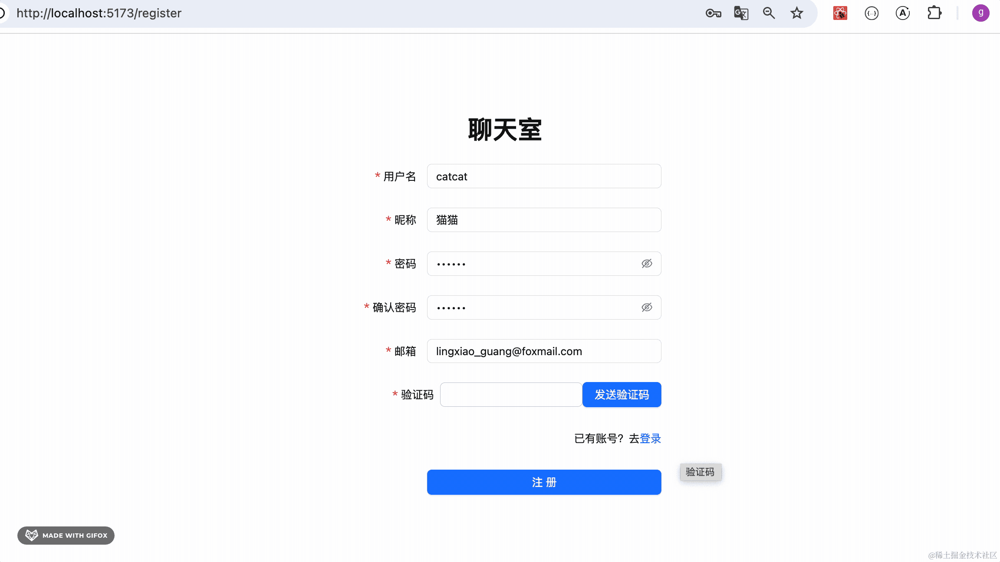
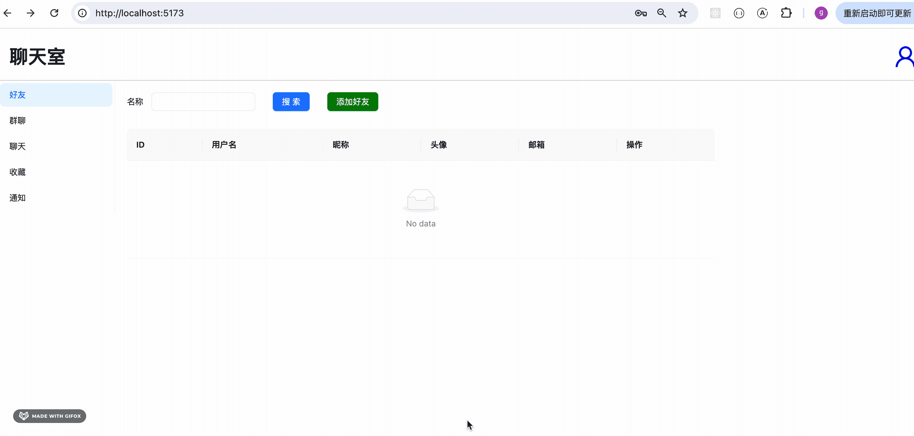
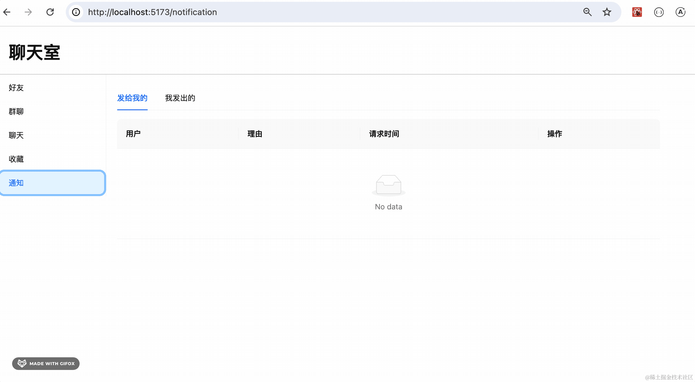
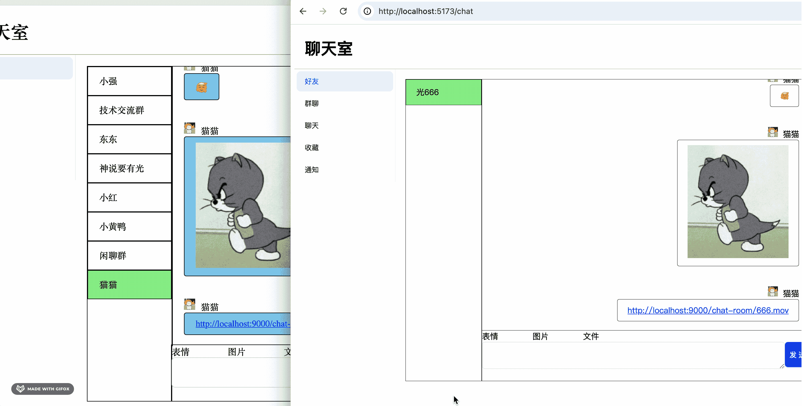

# 193. 聊天室：全部功能测试

做完项目之后，我们整体测试一下。

按照之前的需求分析来测：

 

把 backend 服务跑起来：

```
npm run start:dev
```


然后把 frontend 项目跑起来：

```
npm run dev
```


### 注册

首先填入信息，发送验证码：




注册成功后我们登录下：

### 登录


刚才注册的账号可以登录。

忘了密码可以修改：

### 修改密码

填入用户名、邮箱，点击发送验证码：


修改成功，再登录下：


### 修改个人信息

登录后可以修改个人信息：




修改完之后，右上角头像就变了：


### 添加好友

现在没有好友，我们添加一个：


输入添加好友的 username，填写添加理由，就会发送好友请求。

在通知列表可以看到所有好友请求的状态：



登录 guang 的账号，通过下好友请求：


通过后就可以在好友列表里看到这个好友。

回到 catcat 的账号：


可以看到好友请求变成了通过状态，好友列表里也可以看到这个好友了。

## 聊天

点击好友列表里的聊天按钮，可以和对应好友聊天：


可以发送表情、图片、文件：


文件点击就可以下载。

双方是实时通信的：



## 群聊

除了和好友聊天，还可以创建群聊：


创建后成员只有当前用户。

可以添加成员：


然后进入群聊：


qiang 和 guang 也会收到消息，因为都在这个群聊里：


可以一起聊天。

## 收藏

聊天记录可以双击收藏：


收藏可以删除：


这就是聊天室的全部功能了。

看下之前的需求分析：

 

基本都完成了。

## 总结

我们过了一遍聊天室的功能。

首先是注册、登录、修改密码、修改个人信息这些功能。

然后可以添加好友、查看好友列表，和好友聊天。

可以创建群聊、加入群聊、查看群聊成员、在群聊聊天。

聊天可以发送表情、图片、文件，文件可以下载。

聊天记录可以收藏，在收藏列表里查看，也可以删除收藏。

这就是聊天室的全部功能。

项目部署上线之后，就可以和别的用户聊天了。