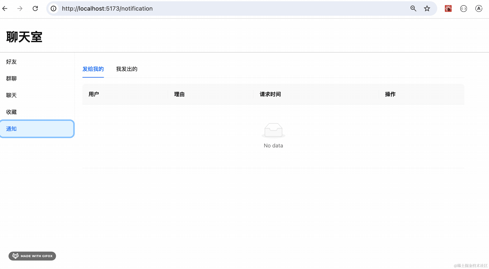
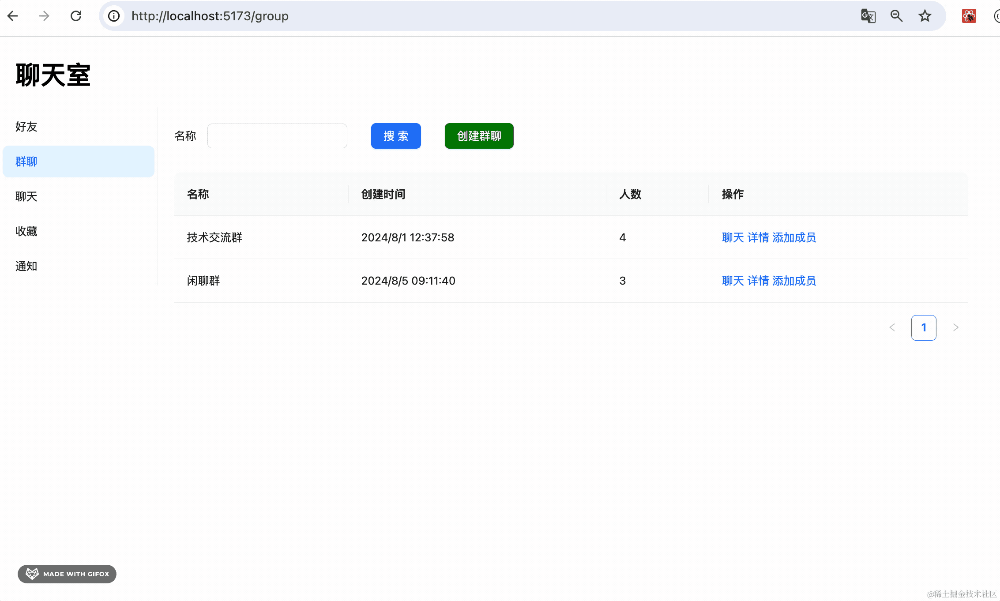
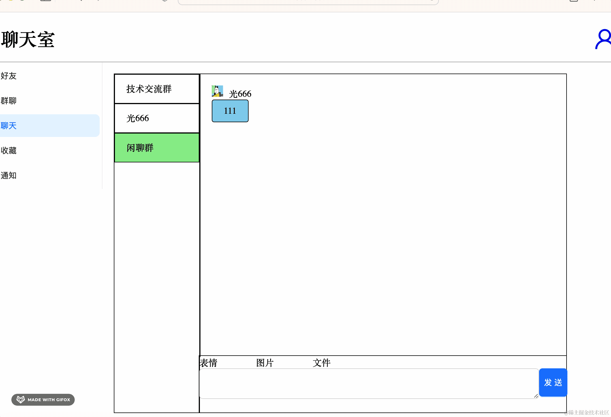
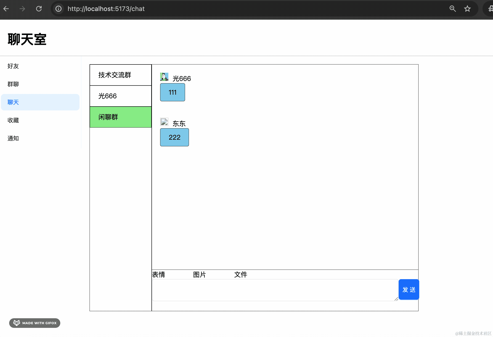

# 194. 聊天室：项目总结

学完了 WebSocket 后，我们做了这个聊天室项目。

用户登录之后可以添加别的用户为好友。

发送好友申请后，对方同意之后就会出现在好友列表，然后就可以聊天了。

可以创建群聊，添加别的用户进入群聊。

群聊里可以多人聊天。

聊天记录做了服务端的存储，并且可以收藏聊天记录。

整个项目是围绕 WebSocket 来的，用的 socket.io 的包。

socket.io 支持把 socket 加入 room，房间内可以广播通信。

这样一对一聊天、群聊只是房间内人数的不同。

我们围绕这个聊天过程，做了一系列数据库的设计

首先，房间名存储的是 id

我们创建了一个 chatroom 表来存储聊天室的信息。

这样你可以根据 id 查出这个聊天室的名字、是一对一聊天还是群聊等：

| 字段名 | 数据类型 | 描述 |
| --- | --- | --- |
| id | INT | 聊天室ID |
| name | VARCHAR(50) |群聊名 |
| type | BOOLEAN | 类型（单聊、群聊） |
| create_time | DATETIME | 创建时间 |
| update_time | DATETIME | 更新时间 |

这个聊天室表和用户表是多对多关联：

在中间表里存储了这种关联关系：

user_chatroom：

| 字段名 | 数据类型 | 描述 |
| --- | --- | --- |
| user_id | INT | 用户ID |
| chatroom_id | INT |聊天室ID |

那我们就可以查出这个聊天室里有多少人。

反过来也可以查出用户在那些聊天室里。

用户登录之后，和服务端建立 WebSocket 连接的时候就可以根据 userId 查出他所在的聊天室，然后把它加入对应 room。

之后，用户就可以这些房间聊天了。

每条聊天记录都会做保存，存在聊天记录表里：

每条聊天记录关联了发送用户、聊天室的信息。

这样用户进入聊天室的时候，就可以关联查出历史聊天记录，并且显示是哪个用户发的。

收藏表就是记录了哪条用户、收藏了哪条聊天历史。

然后用户和用户的好友关系就是多对多关联：

但是添加好友关系之间，会发好友申请，放在 friend_request 表里，通过后才会加入好友关系表。

你看，通过一个简单的房间的 id，我们就可以关联查出这么多东西：

你从聊天室表为起点往左边看：

可以关联查出来聊天记录、聊天室成员、成员的好友列表、成员的收藏等。

这就是关系型数据库的魅力，通过外键关联，你可以存储很多的关联的信息。

业务的复杂度一般取决于你关联存储的东西的多少。

所以很多人用表的数量来衡量业务复杂度，有一定的道理。

回顾下我们做这个项目的整个过程：

首先我们做了需求分析，分析了下有哪些功能，并画了原型图。

 

这一步主要是明确做什么。

最后我们做出来的也是符合这些需求分析和原型图的。

然后我们设计了下技术方案，做了技术选型：

数据库设计：

分析了下接口：

接下来进入开发：

我们首先创建了 nest 项目，并引入了 prisma 和 redis，实现了注册功能。

通过 prisma 的 migrate 功能，生成迁移 sql 并同步到数据库。

这样，线上也可以用这些 sql 来初始化数据库。

之前用 TypeORM 也要做数据库迁移，不过需要自己准备这些 sql：

从数据库迁移方面来说，prisma 确实方便很多。

之后加上了登录鉴权，做了 token 的自动续期，也就是访问接口后在 header 返回新 token，这样比双 token 的方案简单。

然后封装了 @RequireLogin 和 @UserInfo 两个自定义装饰器。

实现了用户密码修改、用户信息修改的功能。

之后进入好友模块的开发，实现了好友列表和添加好友的功能。

好友关系就是用户和用户的多对多关系，需要一个中间表来保存。

好友列表就是根据当前用户 id 查询它的好友关系。

添加好友需要创建一个好友请求，状态为申请中，同意之后改为已同意，然后添加一条好友关系的记录。

删除好友的话就是删除好友关系表中对应的记录。

之后进入页面开发，写了登录、注册、修改密码、修改信息的页面。

因为我们之前写过，所以这里大部分是复制过来的。

之后又写了好友列表、好友申请、发送好友请求的页面：

上面都是准备工作，接下来进入聊天功能的开发：

我们基于 socket.io 实现了 websocket 服务的前后端。

发送 joinRoom 消息的时候把 client socket 加入房间，房间名为 chatroomId

发送 sendMessage 消息的时候把 message 发送给房间的所有用户。

我们还做了聊天记录的保存，每个房间聊天的时候都会把聊天内容存到数据库里。

之后写了聊天的前端部分，通过 socket.io-client 来实现。

监听服务端的 message 消息，有新消息的时候添加到聊天记录里，并通过 scrollIntoView 滚动到底部。

然后串联起了从好友列表，点击聊天进入对应聊天室：

还有从群聊列表点击进入聊天室：

把整个流程串联了起来。

在好友列表点击聊天，会查询 userId 和 friendId 所在的一对一聊天室的 id（如果没查到，会创建一个），然后跳转到聊天页面，选中对应的聊天室。

群聊列表则是直接有 chatroomId。

然后实现了发送表情、图片、文件的功能：

表情用 emoji-mart 这个包实现。

图片就是之前的上传图片，只是上传完把 url 作为消息发过去，设置下 type 为 image。

文件也是一样上传，上传完把 url 作为消息发过去，设置 type 为 file。

然后展示 image 和 file 的时候分别作为图片展示，以及支持下载。

最后实现了收藏功能，双击聊天记录的时候调用 /favorite/add 添加收藏，参数是聊天记录 id：

然后结合当前登录用户的 userId，就生成了一条收藏：

这样，聊天室的前后端就都开发完了。

这个项目主要是练习 WebSocket 的，但也不是纯粹的 WebSocket，我们把它和之前学的关系型数据库结合了起来，实现了一个完整的系统。

项目重点有两个： 如何基于 WebSocket 实现聊天功能，如何把聊天功能和关系型数据库结合，也就是结合登录、好友、群聊、收藏等一系列功能。

微信、qq 等聊天软件它们也不是存粹的 WebSocket 聊天，也是和数据库结合了起来。

经过这个项目，你知道 WebSocket 如何在项目里用了么？
