# 196. 使用 mongoose 操作 MongoDB 数据库

上节我们用了下 mongodb，这节在 node 里操作下。

在 node 里操作 mongodb 我们常用的是 mongoose 这个包。

创建个项目：

```shell
mkdir mongoose-test
cd mongoose-test
npm init -y
```
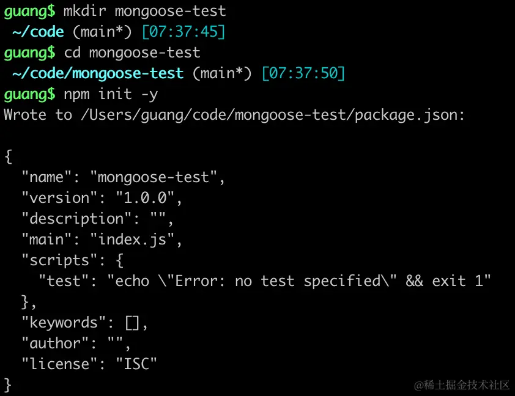

进入项目，安装 mongoose 包。

```shell
npm install --save mongoose
```
在 Docker Desktop 里把 mongodb 的容器跑起来：

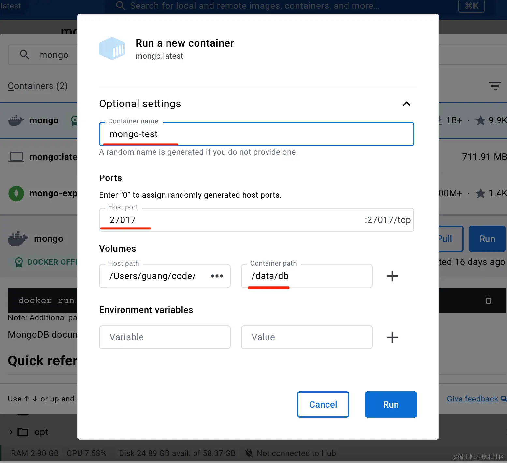

然后用 node 代码连接下。

创建 index.js

```javascript
const mongoose = require('mongoose');

main().catch(err => console.log(err));

async function main() {
  await mongoose.connect('mongodb://localhost:27017/guang');

  const PersonSchema = new mongoose.Schema({
    name: String,
    age: Number,
    hobbies: [String]
  });

  const Person = mongoose.model('Person', PersonSchema);

  const guang = new Person();
  guang.name = 'guang';
  guang.age = 20;

  await guang.save();

  const dong = new Person();
  dong.name = 'dong';
  dong.age = 21;
  dong.hobbies = ['reading', 'football']

  await dong.save();

  const persons = await Person.find();
  console.log(persons);
}
```
首先创建 Schema 描述对象的形状，然后根据 Schema 创建 Model，每一个 model 对象存储一个文档的信息，可以单独 CRUD。

因为 collection 中的 document 可以是任意形状：

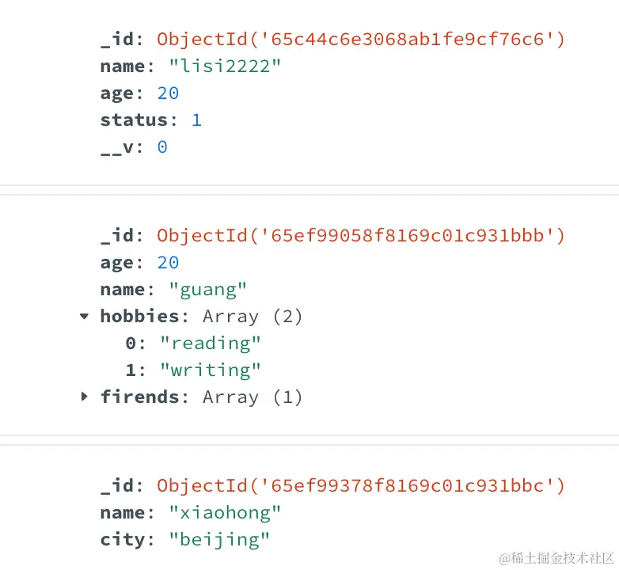

我们需要先用 Schema 声明具体有哪些属性再操作。

跑一下：
```
node index.js
```

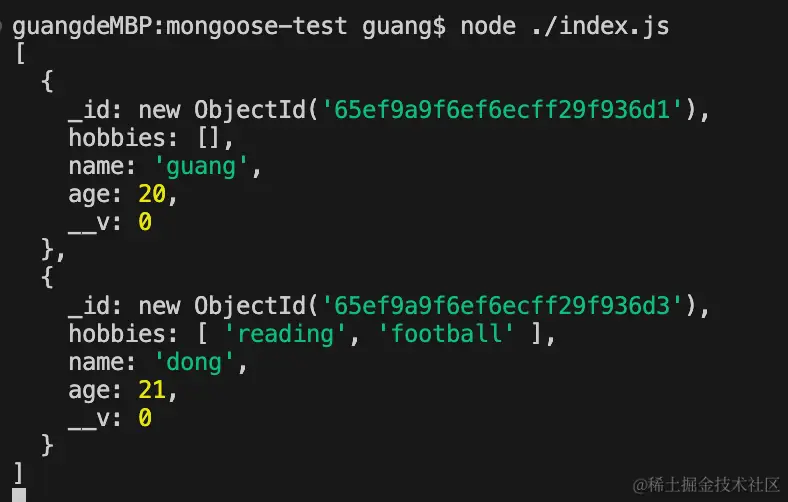

在 MongoDB Compass 里看下：

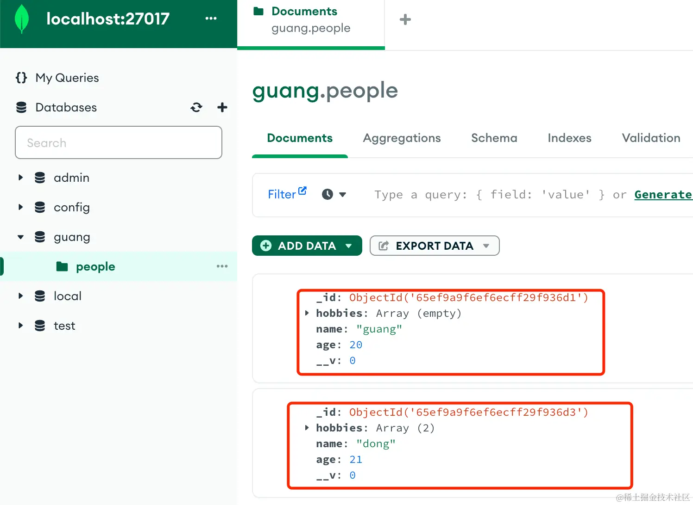

两条数据都插入了。

而且在 mongoose 里查询的语法和上节我们学的 mongodb 的 api 一模一样：

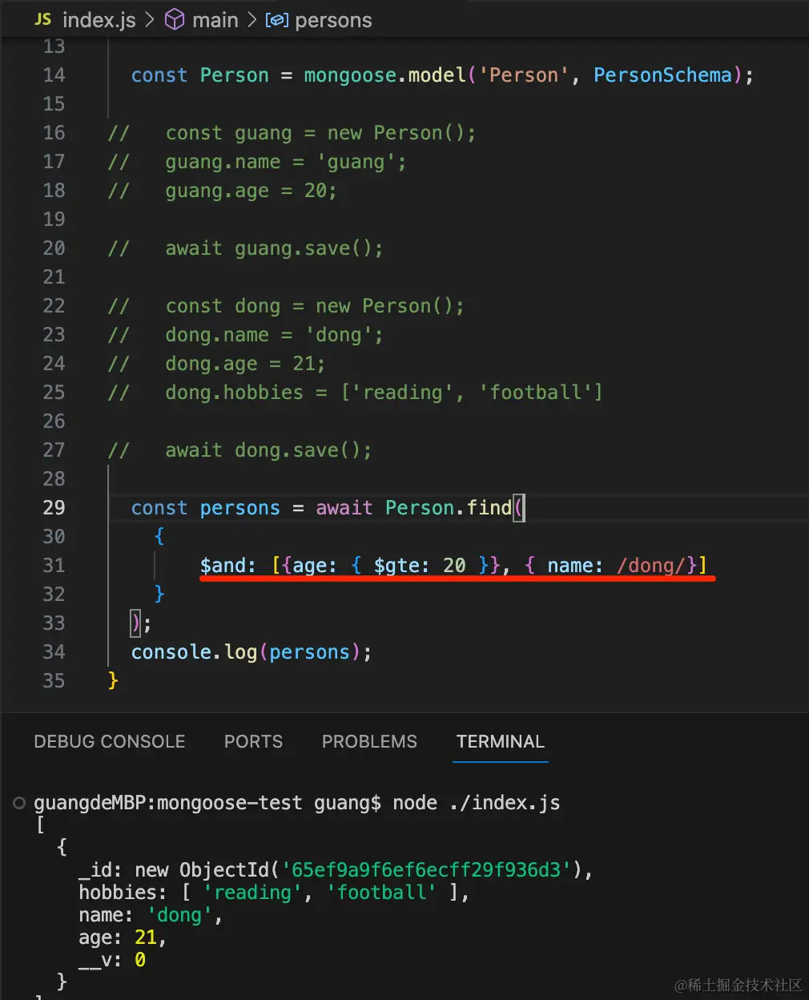

```javascript
const persons = await Person.find(
    {
        $and: [{age: { $gte: 20 }}, { name: /dong/}]
    }
);
console.log(persons);
```
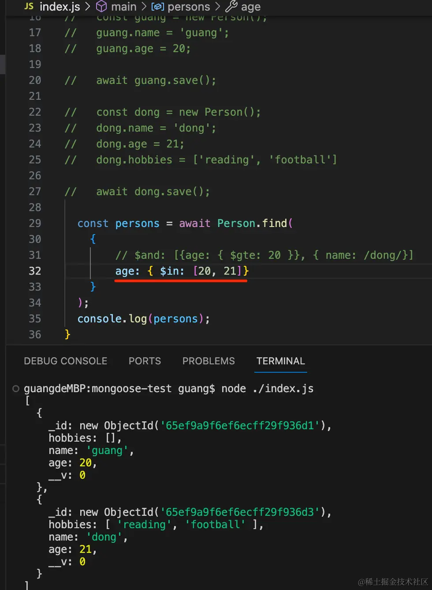

```javascript
const persons = await Person.find(
    {
        age: { $in: [20, 21]}
    }
);
console.log(persons);
```

增删改查的方法都比较简单，就不一个个试了：

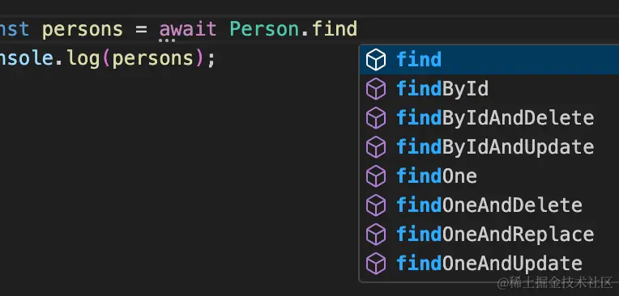

然后在 nest 项目里操作下。

创建个项目：

```shell
nest new nest-mongoose
```
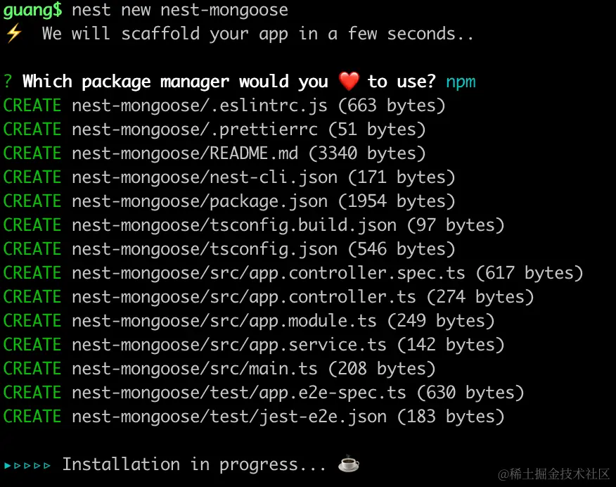

进入项目，安装用到的包：

```
npm install @nestjs/mongoose mongoose
```
在 AppModule 里引入下 MongooseModule

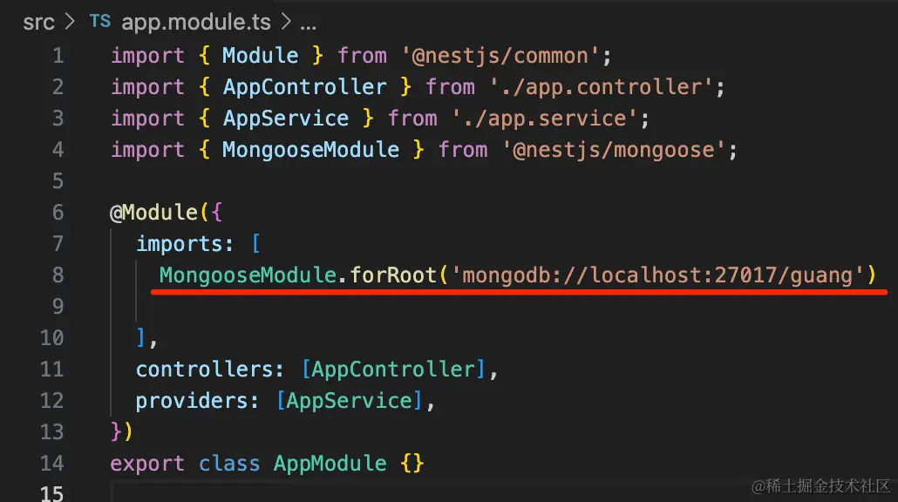

```javascript
import { Module } from '@nestjs/common';
import { AppController } from './app.controller';
import { AppService } from './app.service';
import { MongooseModule } from '@nestjs/mongoose';

@Module({
  imports: [
    MongooseModule.forRoot('mongodb://localhost:27017/guang')
      
  ],
  controllers: [AppController],
  providers: [AppService],
})
export class AppModule {}
```
创建个模块：

```
nest g resource dog --no-spec
```
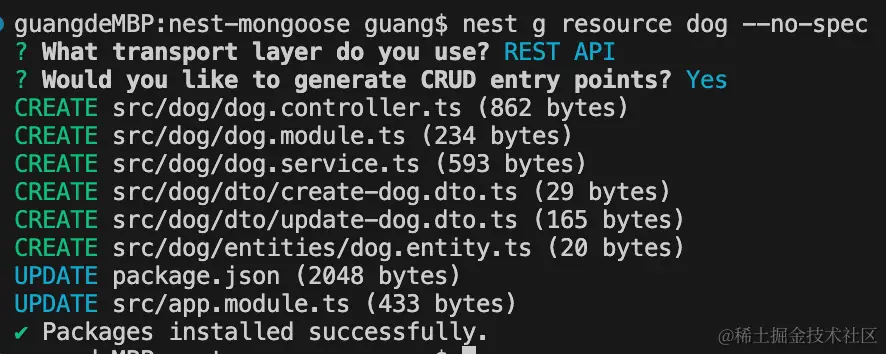

改下 dog.entities.ts
```javascript
import { Prop, Schema, SchemaFactory } from '@nestjs/mongoose';
import { HydratedDocument } from 'mongoose';

@Schema()
export class Dog {
  @Prop()
  name: string;

  @Prop()
  age: number;
  
  @Prop([String])
  tags: string[];
}

export type DogDocument = HydratedDocument<Dog>;

export const DogSchema = SchemaFactory.createForClass(Dog);
```
用 @Schema 创建 schema，然后用 @Prop 声明属性。

之后用 SchemaFactory.createForClass 来根据 class 创建 Schema。

这个 HydratedDocument 只是在 Dog 类型的基础上加了一个 _id 属性：

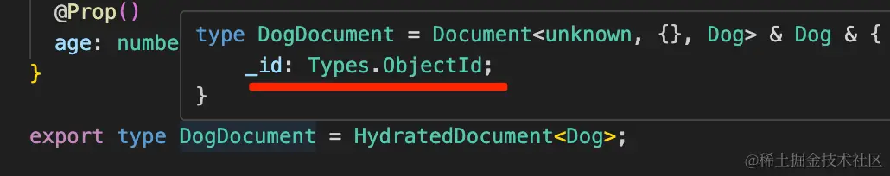

然后 dog.module.ts 里注入 Schema 对应的 Model

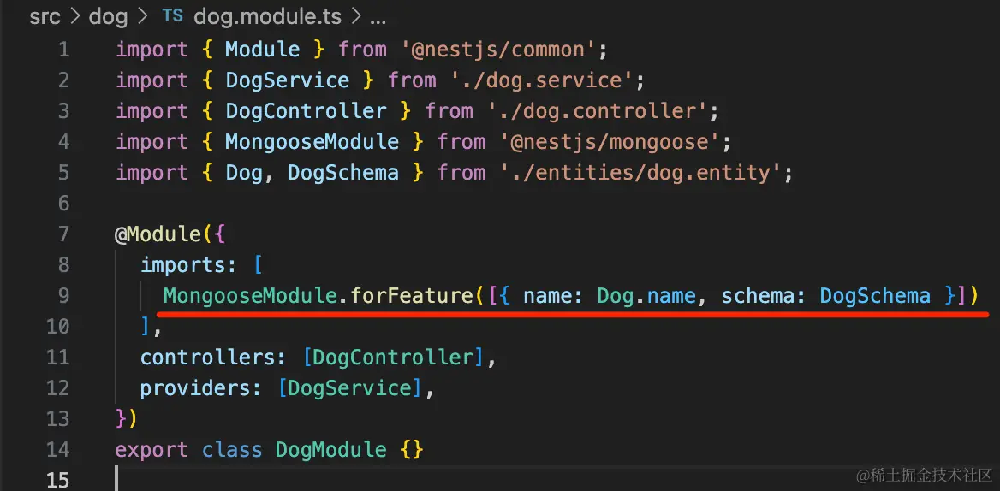

```javascript
import { Module } from '@nestjs/common';
import { DogService } from './dog.service';
import { DogController } from './dog.controller';
import { MongooseModule } from '@nestjs/mongoose';
import { Dog, DogSchema } from './entities/dog.entity';

@Module({
  imports: [
    MongooseModule.forFeature([{ name: Dog.name, schema: DogSchema }])
  ],
  controllers: [DogController],
  providers: [DogService],
})
export class DogModule {}
```

这样在 DogService 里就可以用 Model 来做 CRUD 了。

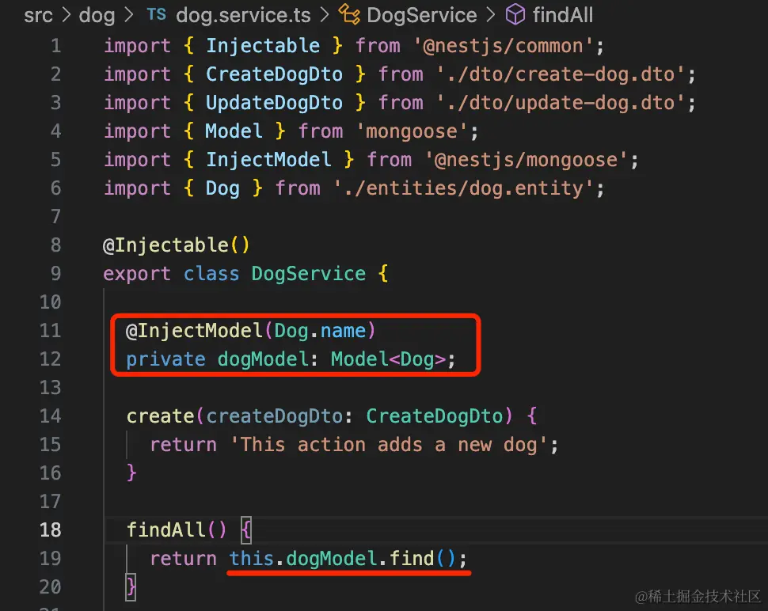

```javascript
import { Injectable } from '@nestjs/common';
import { CreateDogDto } from './dto/create-dog.dto';
import { UpdateDogDto } from './dto/update-dog.dto';
import { Model } from 'mongoose';
import { InjectModel } from '@nestjs/mongoose';
import { Dog } from './entities/dog.entity';

@Injectable()
export class DogService {

  @InjectModel(Dog.name)
  private dogModel: Model<Dog>;

  create(createDogDto: CreateDogDto) {
    return 'This action adds a new dog';
  }

  findAll() {
    return this.dogModel.find();
  }

  findOne(id: number) {
    return `This action returns a #${id} dog`;
  }

  update(id: number, updateDogDto: UpdateDogDto) {
    return `This action updates a #${id} dog`;
  }

  remove(id: number) {
    return `This action removes a #${id} dog`;
  }
}
```
然后我们改下 create-dog.dto.ts

```javascript
import { IsNotEmpty, IsNumber, IsString, Length } from "class-validator";

export class CreateDogDto {

    @IsString()
    @IsNotEmpty()
    @Length(30)
    name: string;

    @IsNumber()
    @IsNotEmpty()
    age: number;
  
    tags: string[];
}
```
安装用到的包：

```
npm install class-validator class-transformer
```
之后完善下 DogService：

```javascript
import { Injectable } from '@nestjs/common';
import { CreateDogDto } from './dto/create-dog.dto';
import { UpdateDogDto } from './dto/update-dog.dto';
import { Model } from 'mongoose';
import { InjectModel } from '@nestjs/mongoose';
import { Dog } from './entities/dog.entity';

@Injectable()
export class DogService {

  @InjectModel(Dog.name)
  private dogModel: Model<Dog>;

  create(createDogDto: CreateDogDto) {
    const dog = new this.dogModel(createDogDto);
    return dog.save();
  }

  findAll() {
    return this.dogModel.find();
  }

  findOne(id: string) {
    return this.dogModel.findById(id);
  }

  update(id: string, updateDogDto: UpdateDogDto) {
    return this.dogModel.findByIdAndUpdate(id, updateDogDto);
  }

  remove(id: number) {
    return this.dogModel.findByIdAndDelete(id);
  }
}
```
之前把 id 转为 number 的 + 去掉，因为 mongodb 的 id 是 stirng：

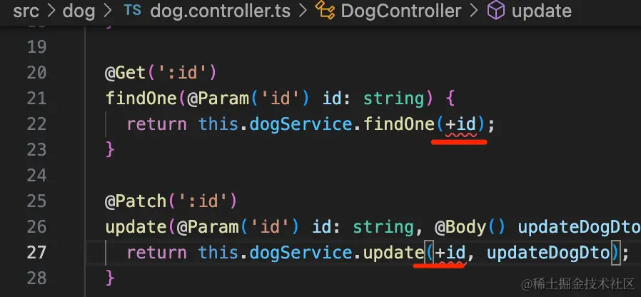

把服务跑起来：

```
npm run start:dev
```

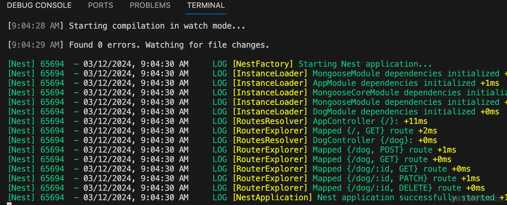

然后在 postman 里测试下：


先创建 2 个 dog：

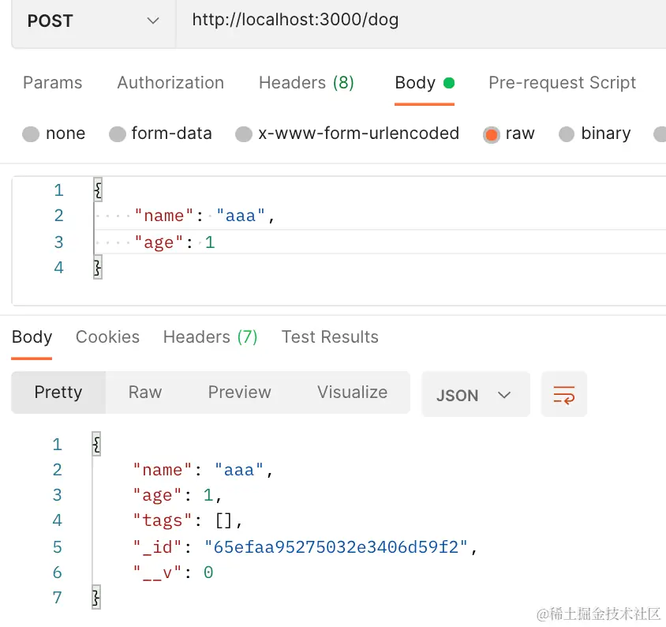

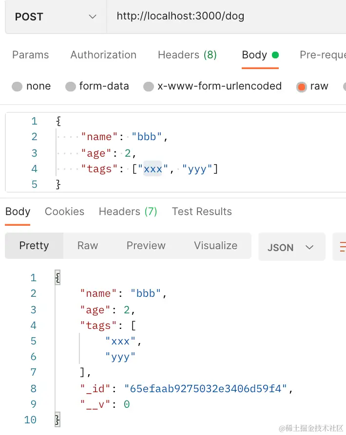

查询下全部：

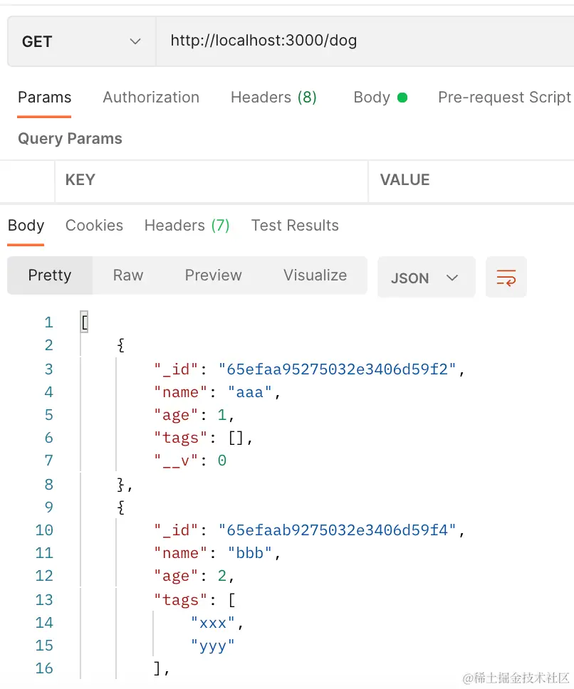

单个：

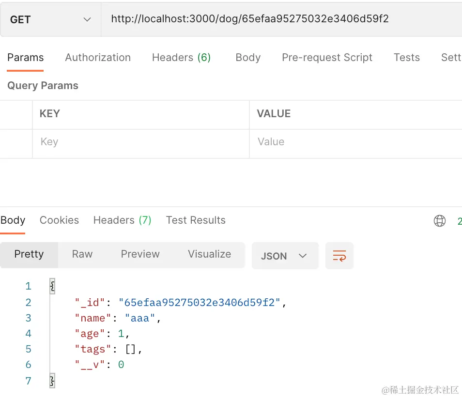

然后修改下：

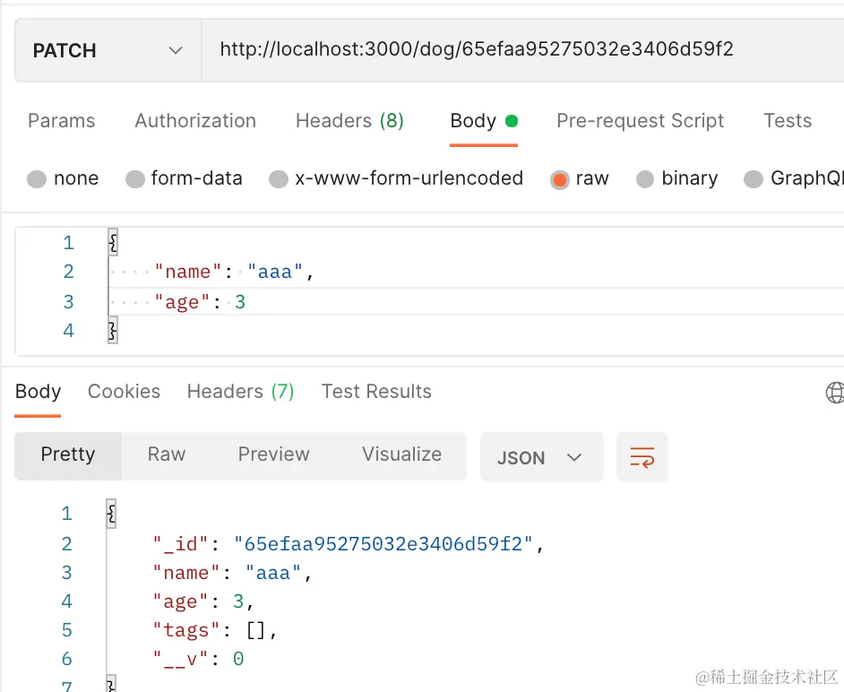

再查询下：
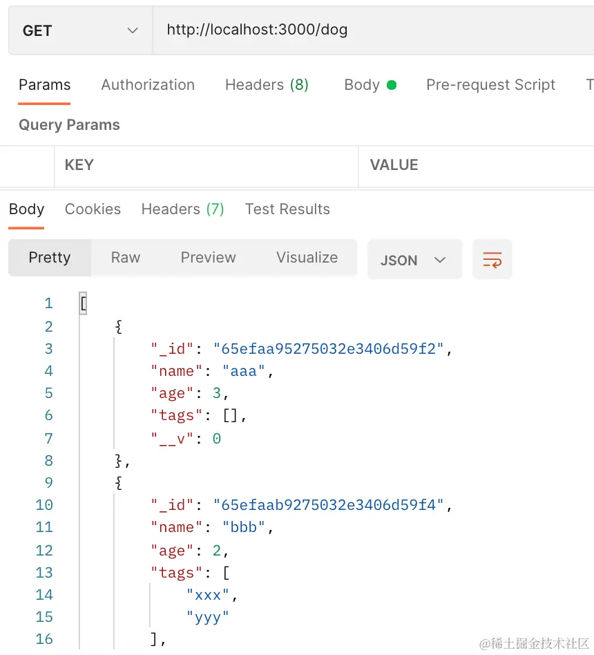

之后删除：

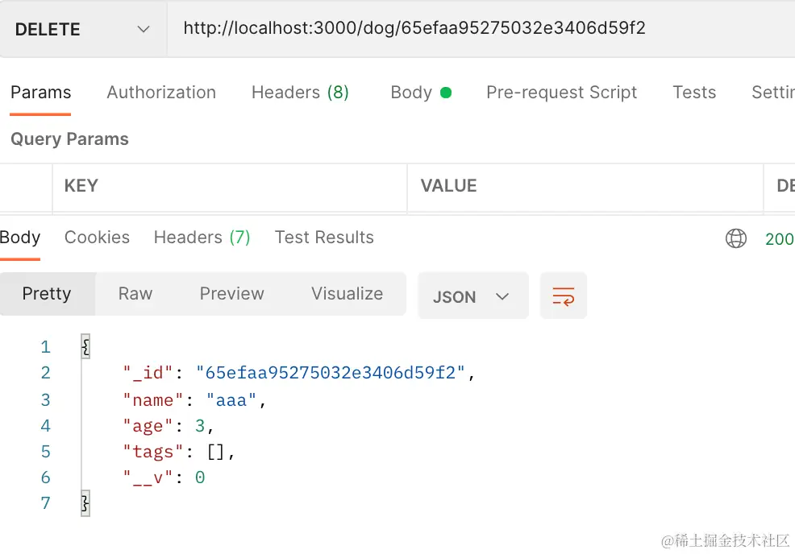

在 Mongodb Compass 里点击刷新，也可以看到数据确实被删掉了：

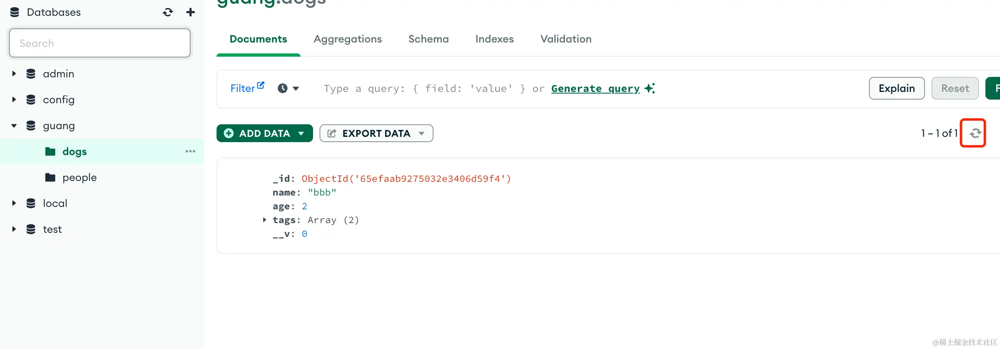

这就是在 nest 里对 MongoDB 做 CRUD 的方式。

案例代码在小册仓库：

[mongoose 操作 mongodb](https://github.com/QuarkGluonPlasma/nestjs-course-code/tree/main/mongoose-test)

[nest 集成 mongoose](https://github.com/QuarkGluonPlasma/nestjs-course-code/tree/main/nest-mongoose)

## 总结

我们学习了用 mongoose 操作 MongoDB 以及在 Nest 里集成 mongoose。

主要是通过 Schema 描述形状，然后创建 Model，通过一个个 model 对象保存数据和做 CRUD。

因为 mongodb 本身提供的就是 api 的操作方式，而 mongoose 的 api 也是对底层 api 的封装，
所以基本可以直接上手用。
