# 198. Nest 开发 GraphQL 服务：实现 CRUD

上节我们知道了什么是 graphql，它就是通过模式定义语言 SDL（Schema Definition Language) 定义对象和对象之间关系的 schema：

比如：

```graphql
const typeDefs = `
  type Student {
    id: String,
    name: String,
    sex: Boolean
    age: Int
  }

  type Teacher {
    id: String,
    name: String,
    age: Int,
    subject: [String],
    students: [Student]
  }

  type Query {
    students: [Student],
    teachers: [Teacher],
  }

  type Res {
     success: Boolean
     id: String
  }

  type Mutation {
    addStudent(name:String! age:Int! sex:Boolean!): Res

    updateStudent(id: String! name:String! age:Int! sex:Boolean!): Res

    deleteStudent(id: String!): Res
}

schema {
    mutation: Mutation
    query: Query
}
`;
```
这个 schema 只是类型，负责实现 schema 对应数据的部分叫做 resolver：

```javascript
const students = [
    {
      id: '1',
      name: async () => {
        await '取数据';
        return '光光'
      },
      sex: true,
      age: 12
    },
    {
      id: '2',
      name:'东东',
      sex: true,
      age: 13
    },
    {
      id: '3',
      name:'小红',
      sex: false,
      age: 11
    },
];

const teachers = [
  {
    id: '1',
    name: '神光',
    sex: true,
    subject: ['体育', '数学'],
    age: 28,
    students: students
  }
]

const resolvers = {
    Query: {
      students: () => students,
      teachers: () => teachers
    }
}
```

schema 结合 resolver，这样客户端就可以按照 schema 的结构来存取数据了：


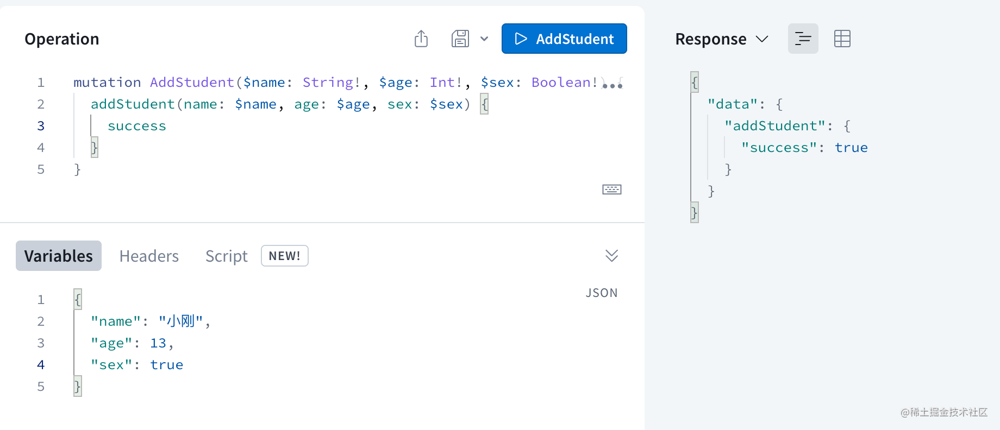

这节我们在 Nest 里集成下 graphql。

新建个项目：

```bash
nest new nest-graphql
```

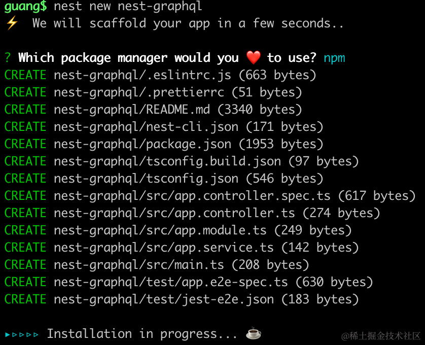

进入项目，安装 graphql 和 apollo 的包：

```bash
npm i @nestjs/graphql @nestjs/apollo @apollo/server graphql
```
在 main.ts 引入 GraphQLModule：

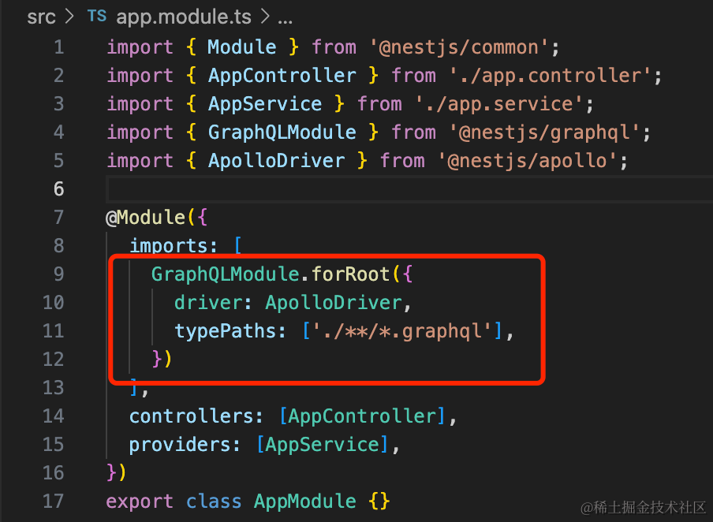

```javascript
import { Module } from '@nestjs/common';
import { AppController } from './app.controller';
import { AppService } from './app.service';
import { GraphQLModule } from '@nestjs/graphql';
import { ApolloDriver } from '@nestjs/apollo';

@Module({
  imports: [
    GraphQLModule.forRoot({
      driver: ApolloDriver,
      typePaths: ['./**/*.graphql'],
    })
  ],
  controllers: [AppController],
  providers: [AppService],
})
export class AppModule {}
```
创建 schema 文件  schema.graphql

```graphql
type Student {
  id: String,
  name: String,
  sex: Boolean
  age: Int
}

type Teacher {
  id: String,
  name: String,
  age: Int,
  subject: [String],
  students: [Student]
}

type Query {
  students: [Student],
  teachers: [Teacher],
}

type Mutation {
  addStudent(name:String! age:Int! sex:Boolean!): Res

  updateStudent(id: String! name:String! age:Int! sex:Boolean!): Res

  deleteStudent(id: String!): Res
}
```
这里直接复制的上节的 schema 定义。

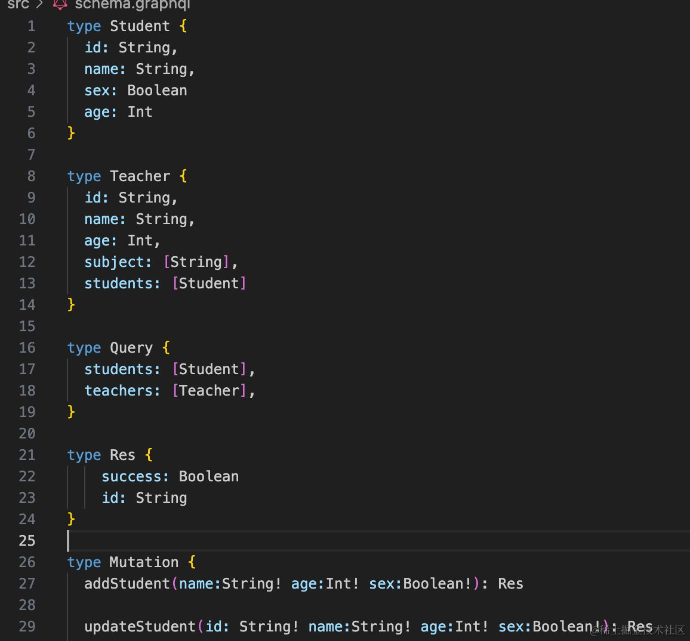

语法高亮需要安装下 graphql 插件：

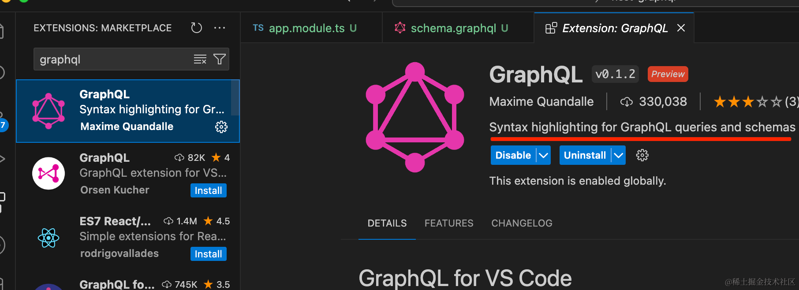

然后定义它的 resolver：

```
nest g resolver student
```

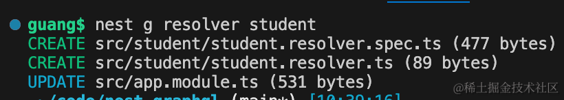

实现下 Query、Mutation 对应的逻辑：

```javascript
import { Args, Mutation, Query, Resolver } from '@nestjs/graphql';

const students = [ 
    { id: 1, name: '光光', sex: true, age: 20},
    { id: 2, name: '东东', sex: true, age: 21},
    { id: 3, name: '小红', sex: false, age: 20},
];

const teachers = [
    { 
        id: 1, 
        name: "小刚", 
        age: 30, 
        subject: ['体育', '英语'],
        students: students
    },
]

@Resolver()
export class StudentResolver {

    @Query("students")
    students() {
        return students;
    }


    @Query("teachers")
    teachers() {
        return teachers;
    }

    @Mutation()
    addStudent(
        @Args('name') name: string, 
        @Args('age') age: number, 
        @Args('sex') sex: boolean
    ) {
        const id = Math.floor(Math.random() * 1000);
        students.push({
            id,
            name,
            age,
            sex
        });
        return {
            id,
            success: true
        }
    }

    @Mutation()
    updateStudent(
        @Args('id') id,
        @Args('name') name: string, 
        @Args('age') age: number, 
        @Args('sex') sex: boolean
    ) { 
        const index = students.findIndex(item => {
            return item.id === parseInt(id)
        });

        if(index ===-1) {
            return {
                id: null,
                success: true
            }
        }

        students[index].name = name;
        students[index].age = age;
        students[index].sex = sex;
        return {
            id,
            success: true
        }
    }

    @Mutation()
    deleteStudent(@Args('id') id) { 
        const index = students.findIndex(item => {
            return item.id === parseInt(id)
        });
        
        if(index ===-1) {
            return {
                id: null,
                success: true
            }
        }

        students.splice(index, 1);
        return {
            id,
            success: true
        }
    }
      
}
```
比较容易看懂，用 @Query 和 @Mutation 分别实现 Query 和 Mutation 对应的方法。

把服务跑起来：

```
npm run start:dev
```


浏览器访问下 http://localhost:3000/graphql

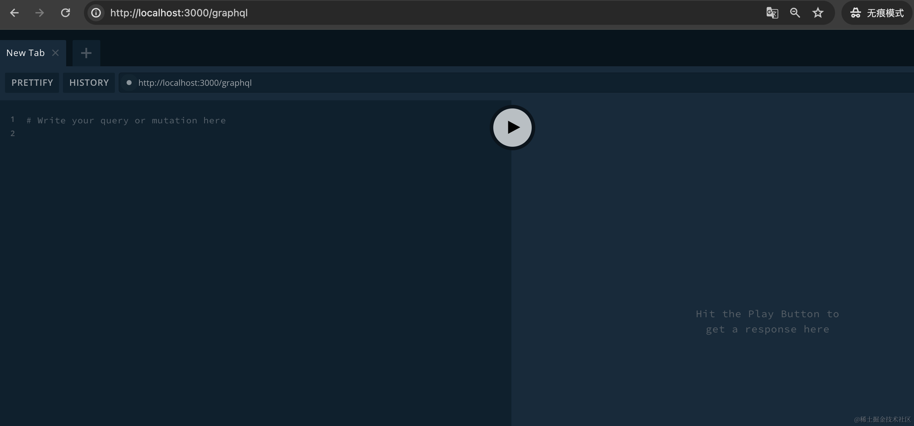

右侧可以看到 schema 定义还有文档：

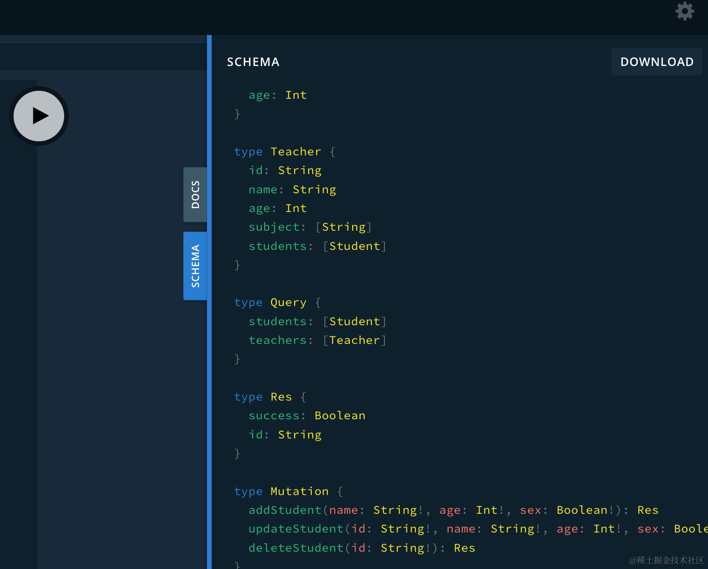

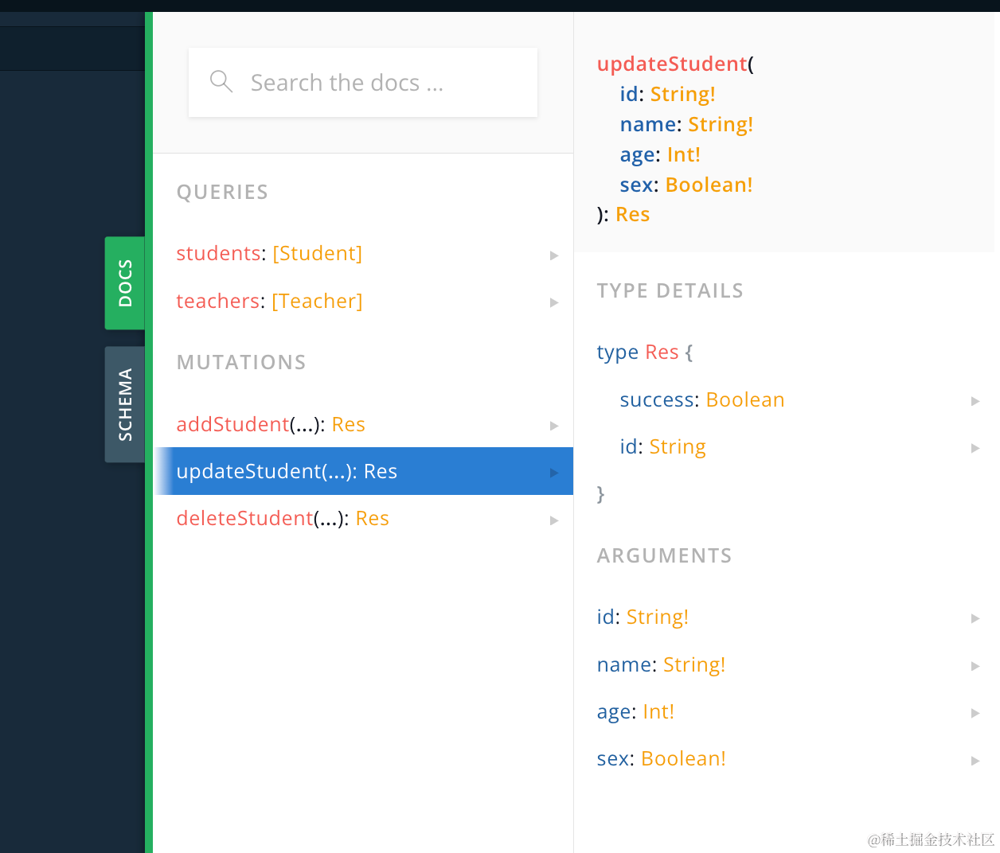

这个东西就是 graphql 的接口文档了。

我们在左侧输入下查询语法：


```graphql
query Xxx {
  students {
    id
    name
    age
  }
}
```
对新手来说，写 query language 还是有点难度的，因为不熟悉。

上节那个 playground 就好很多，可以直接生成。

我们换上节的 playground：

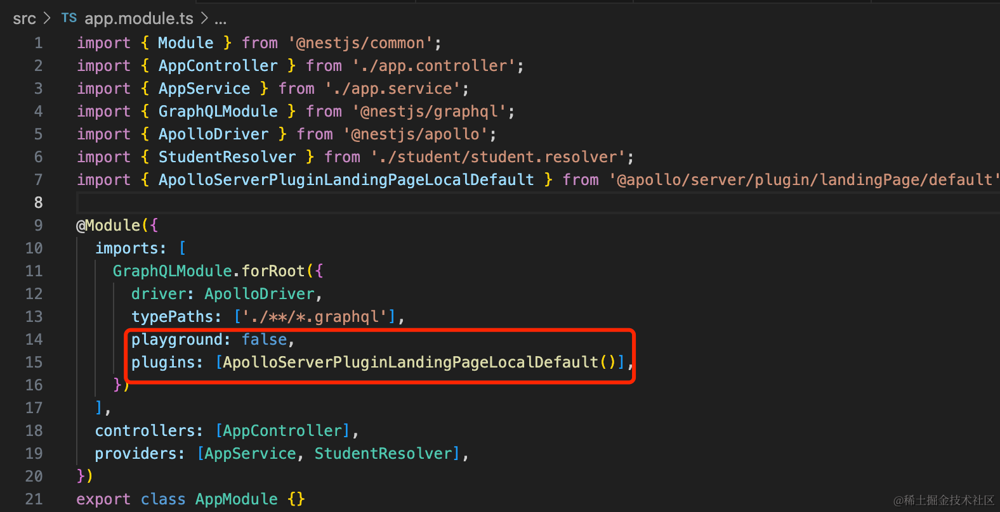

```javascript
import { Module } from '@nestjs/common';
import { AppController } from './app.controller';
import { AppService } from './app.service';
import { GraphQLModule } from '@nestjs/graphql';
import { ApolloDriver } from '@nestjs/apollo';
import { StudentResolver } from './student/student.resolver';
import { ApolloServerPluginLandingPageLocalDefault } from '@apollo/server/plugin/landingPage/default';

@Module({
  imports: [
    GraphQLModule.forRoot({
      driver: ApolloDriver,
      typePaths: ['./**/*.graphql'],
      playground: false,
      plugins: [ApolloServerPluginLandingPageLocalDefault()],
    })
  ],
  controllers: [AppController],
  providers: [AppService, StudentResolver],
})
export class AppModule {}
```
刷新就可以看到换成 apollo 的 playground 的了：

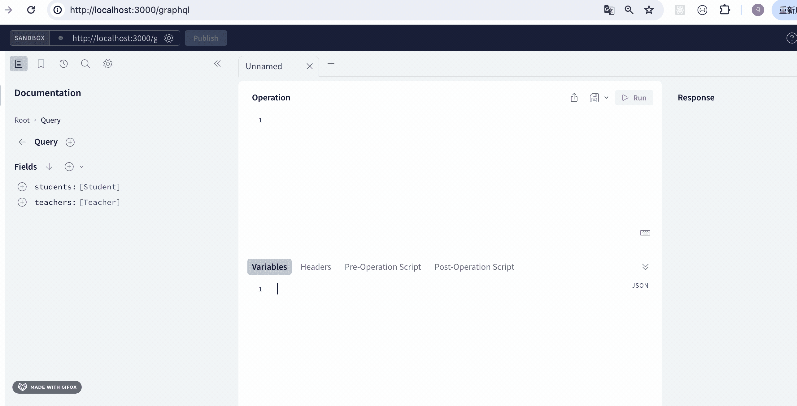

点击加号就可以生成查询。

试一下添加：

```graphql
mutation Mutation($name: String!, $age: Int!, $sex: Boolean!) {
  addStudent(name: $name, age: $age, sex: $sex) {
    id
    success
  }
}
```
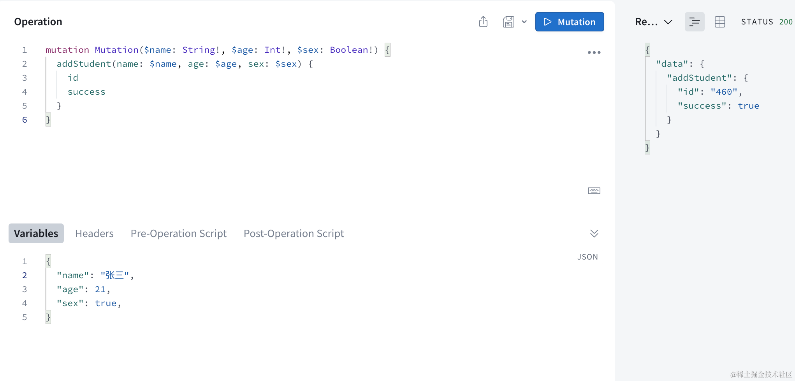

再查一下：

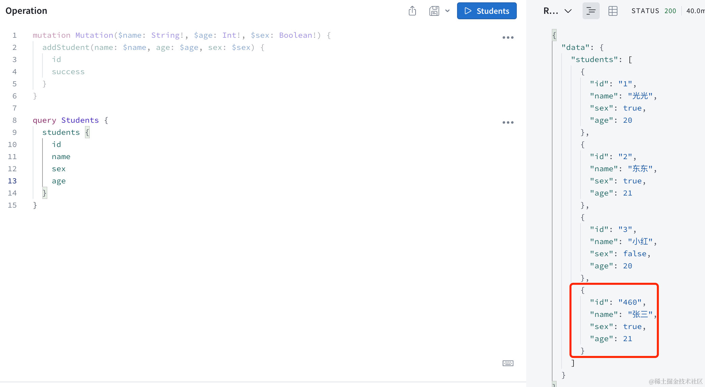

可以看到，添加成功了。

然后再来试下修改：

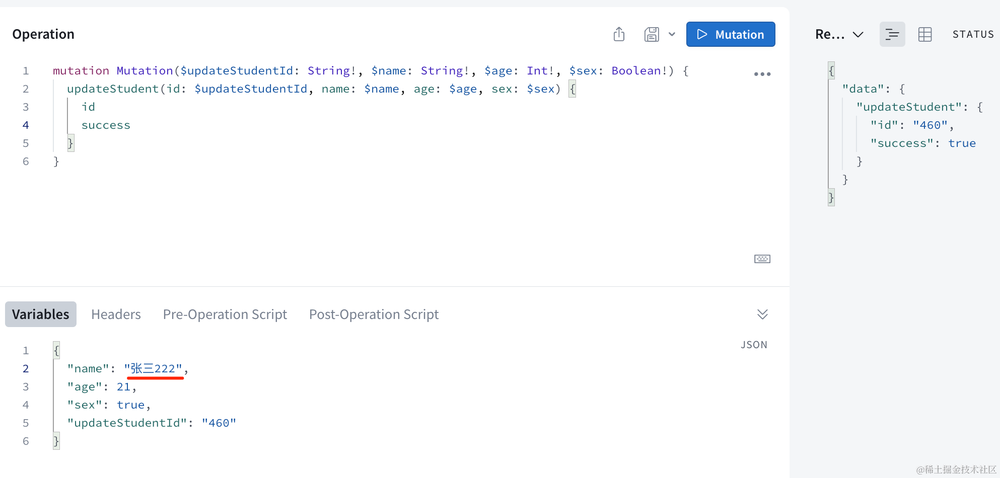

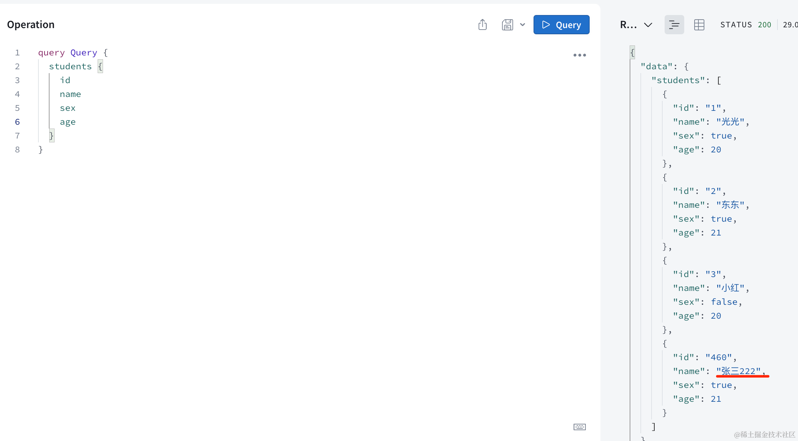

修改成功！

试下删除：

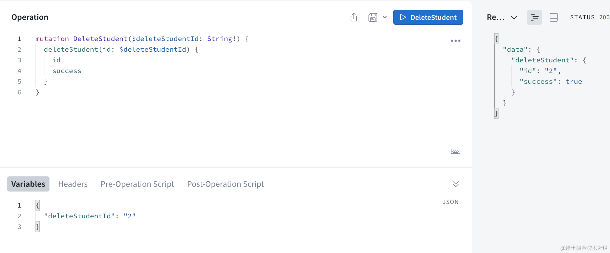

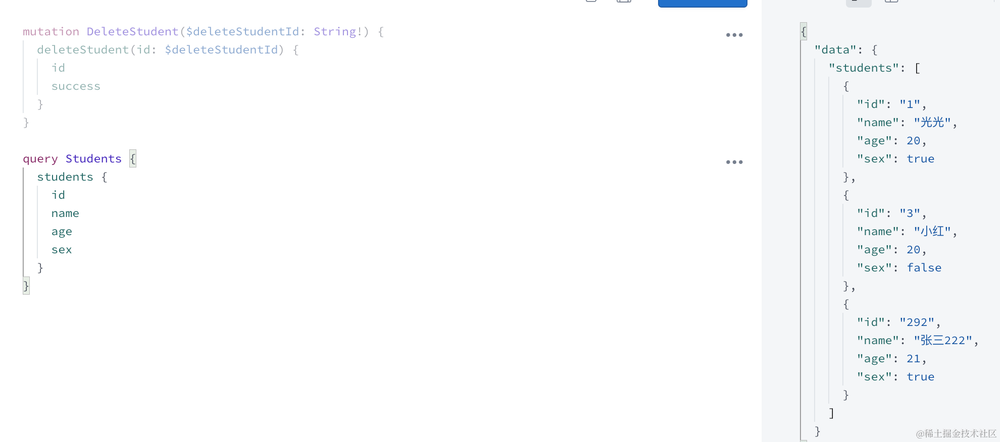

删除成功！

其实还少了个根据 id 查询的方法。

在 schema 里加一下：

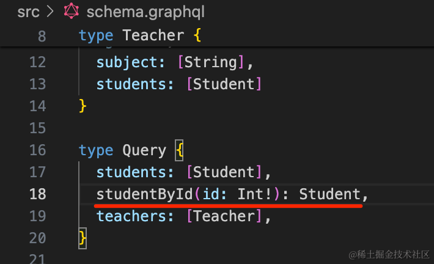

! 代表必填。

在 resolver 里加一下它的实现：

```javascript
@Query("studentById")
studentById(@Args('id') id) {
    return students.find(item => {
        return item.id === id
    });
}
```

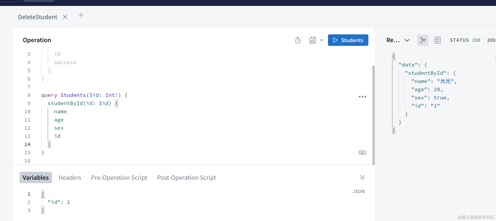

查询成功！

至此，Nest + GrphQL 的 CRUD 就完成了。

案例代码在[小册仓库](https://github.com/QuarkGluonPlasma/nestjs-course-code/tree/main/nest-graphql)。

## 总结

这节我们在 Nest 里集成了 GraphQL，并做了 CRUD。

graphql 主要是分为 schema、resolver 两部分。

GraphQLModule.forRoot 指定 typePaths 也就是 schema 文件的位置。

然后用 nest g resolver 生成 resolver 文件，实现 Query、Mutaion 的方法。

并且还可以切换 playground 为 apollo 的。

之后就可以在 palyground 里发送 graphql 请求，做 CRUD 了。


