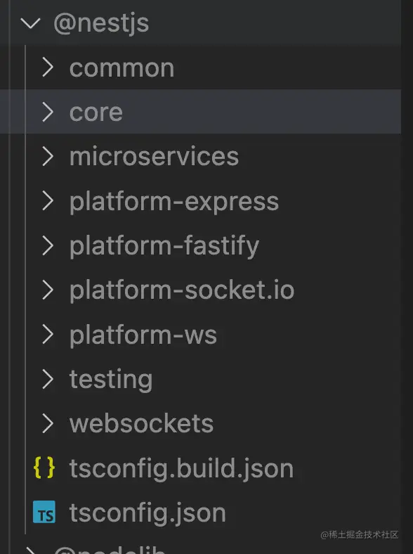
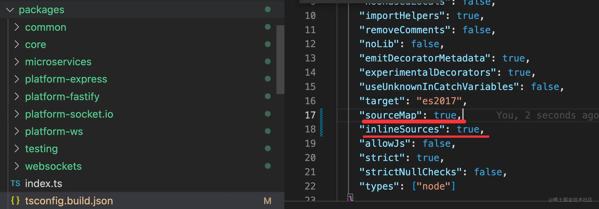
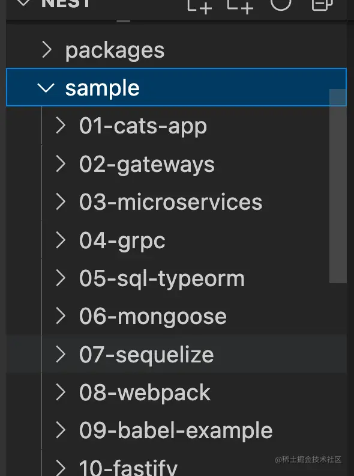

# 200. 如何调试 Nest 源码？

前面我们学过如何调试 Nest 项目，那如何调试 Nest 源码呢？

有的同学说，调试 Nest 项目的时候，调用栈里不就有源码部分么？

其实不是的，这部分是编译后的代码：


我们新建个 Nest 项目：

```
nest new debug-nest-source
```


点击 debug 面板的 create a launch.json file按钮：


输入 npm，选择 launch via npm，创建一个调试 npm scripts 的配置：


改为这样：

```json
{
    "name": "Launch via NPM",
    "request": "launch",
    "runtimeArgs": [
        "run-script",
        "start:dev"
    ],
    "runtimeExecutable": "npm",
    "console": "integratedTerminal",
    "skipFiles": [
        "<node_internals>/**"
    ],
    "type": "node"
}
```

这个就是跑 npm run start:dev 的调试配置。

指定 console 为 integratedTerminal，这样日志会输出在 terminal。

不然，日志会输出在 debug console。颜色等都不一样：


在 AppController 的 getHello 打个断点：


点击 debug 启动：


然后浏览器重新访问 http://localhost:3000

这时候代码就会在断点处断住：


这样就可以断点调试 Nest 项目了。

但如果想调试源码，还需要再做一步：

因为现在调用栈里的 Nest 源码部分都是编译后的：


我们想调试 Nest 的 ts 源码，这就需要用到 sourcemap 了。

用 npm install 下载的包没有 sourcemap 的代码，想要 sourcemap，需要自己 build 源码。

把 Nest 项目下载下来，并安装依赖（加个 --depth=1 是下载单 commit，--single-branch 是下载单个分支，这样速度会快很多）：

```
git clone --depth=1 --single-branch https://github.com/nestjs/nest
```
build 下：
```
npm install
npm run build
```
会在 node_modules/@nestjs 下生成编译后的代码。

看下 npm scripts：


可以看到它做的事情就是 tsc 编译代码，然后把编译后的文件移动到 node_modules/@nestjs 目录下。

move 的具体实现可以看 tools/gulp/tasks/move.ts 的代码：


所以，执行 npm run build，你就会在 node_modules/@nestjs 下看到这样的代码：



只包含了 js 和 ts，没有 sourcemap：


生成 sourcemap 需要改下 tsc 编译配置，也就是 packages/tsconfig.build.json 文件：



设置 sourceMap 为 true 也就是生成 sourcemap，但默认的 sourcemap 里不包含内联的源码，也就是 sourcesContent 部分，需要设置 inlineSources 来包含。

再次执行 npm run build，就会生成带有 sourcemap 的代码：


并且 sourcemap 是内联了源码的：


然后我们跑一下 Nest 的项目，直接跑 samples 目录下的项目即可，这是 Nest 内置的一些案例项目：



进入 01-cats-app 目录，安装依赖

```
npm install
```
然后把根目录 node_modules 下生成的代码覆盖下 cats 项目的 node_modules 下的代码：


创建一个调试配置：


改成这样：


```json
{
    "name": "调试 nest 源码",
    "request": "launch",
    "runtimeArgs": [
        "run-script",
        "start:dev"
    ],
    "runtimeExecutable": "npm",
    "console": "integratedTerminal",
    "cwd": "${workspaceFolder}/sample/01-cats-app/",
    "resolveSourceMapLocations": [
        "${workspaceFolder}/**",
        // "!**/node_modules/**"
    ],
    "skipFiles": [
        "<node_internals>/**"
    ],
    "type": "node"
}
```
指定 cwd 为那个项目的目录，也就是在那个目录下执行 npm run start:dev。

resolveSourceMapLocations 是从哪里找 sourcemap，默认排除掉了 node_modules，我们把它去掉。

在 sample/01-cats-app 的 src/cats/cats.controller.ts 打个断点：


然后点击 debug 调试：


如果提示端口被占用，你需要先 kill 掉之前的进程再跑：


浏览器访问 http://localhost:3000/cats

断住之后你看下调用栈：


这时候 sourcemap 就生效了，可以看到调用栈中的就是 Nest 的 ts 源码。

这样就可以调试 Nest 源码了。

比如我们看下 Nest 的 AOP 部分的源码：

点击这个调用栈：


可以看到它先创建了所有的 pipes、interceptors、guards 的实例，然后封装了调用 pipe 和 guard 的函数：


下面调用 hander 的时候，先调用 guard、再调用 interceptor，然后调用 handler，并且 handler 里会先用 pipe 处理参数：


这就是 AOP 机制的源码。

而如果你想在你的项目里调试 Nest 源码，只要把 node_modules/@nestjs 覆盖你项目下那个就好了。

## 总结

这节我们学习了如何调试 Nest 源码。

vscode 里创建 npm scripts 的调试配置，就可以调试 npm run start:dev 的服务。

但如果想调试源码，需要把 Nest  源码下载下来，build 出一份带有 sourcemap 版本的代码。

同时还要设置 resolveSourcemapLocations 去掉排除 node_modules 的配置。

然后再调试，就可以直接调试 Nest 的 ts 源码了。

我们调试了下 AOP 部分的源码，以后你对哪部分的实现原理感兴趣，也可以自己调试源码了。
