# 26. Nest 如何使用 multer 实现文件上传

上节我们学了在 Express 里用 multer 包处理 multipart/form-data 类型的请求中的 file。

单个、多个字段的单个、多个 file 都能轻松取出来。

那在 Nest 里怎么用呢？

我们新建个 nest 项目来试试：

```
nest new nest-multer-upload -p npm
```
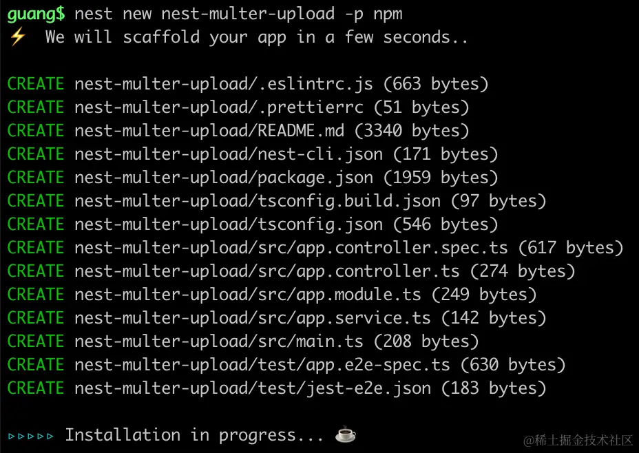

还需要安装下 multer 的 ts 类型的包：
```
npm install -D @types/multer
```
在 AppController 添加这样一个 handler：

```javascript
@Post('aaa')
@UseInterceptors(FileInterceptor('aaa', {
    dest: 'uploads'
}))
uploadFile(@UploadedFile() file: Express.Multer.File, @Body() body) {
    console.log('body', body);
    console.log('file', file);
}
```

使用 FileInterceptor 来提取 aaa 字段，然后通过 UploadedFile 装饰器把它作为参数传入。

用 npm run start:dev 把服务跑起来，一保存，就可以看到这个目录被创建了：

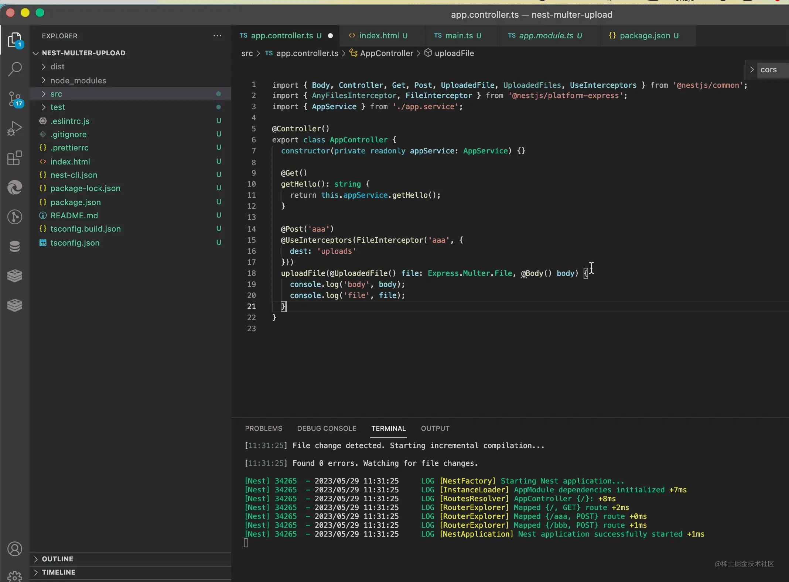

然后来写前端代码。

之前我们用过这种方式：

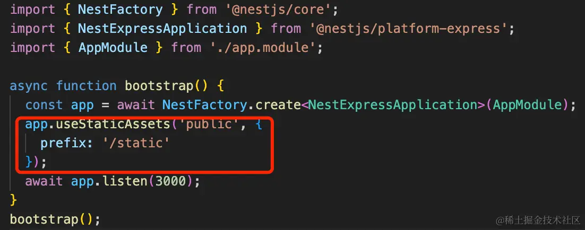

就是让 nest 服务支持静态文件的访问。

现在我们换种方式，让 nest 服务支持跨域，再单独跑个 http-server 来提供静态服务：

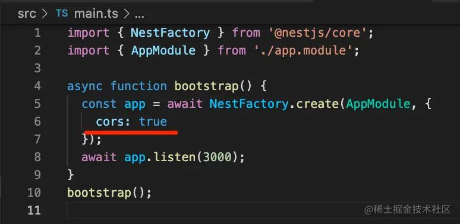

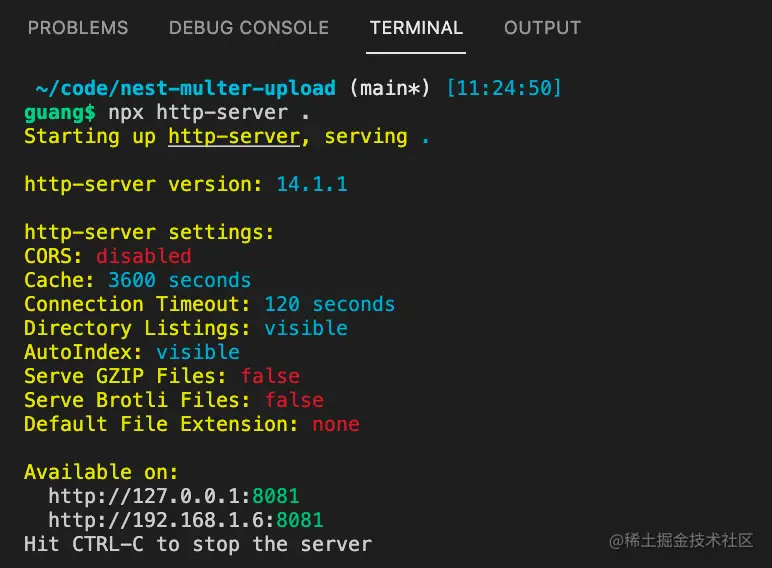

在根目录创建 index.html，前端代码和之前差不多：

```html
<!DOCTYPE html>
<html lang="en">
<head>
    <meta charset="UTF-8">
    <meta http-equiv="X-UA-Compatible" content="IE=edge">
    <meta name="viewport" content="width=device-width, initial-scale=1.0">
    <title>Document</title>
    <script src="https://unpkg.com/axios@0.24.0/dist/axios.min.js"></script>
</head>
<body>
    <input id="fileInput" type="file" multiple/>
    <script>
        const fileInput = document.querySelector('#fileInput');

        async function formData() {
            const data = new FormData();
            data.set('name','光');
            data.set('age', 20);
            data.set('aaa', fileInput.files[0]);

            const res = await axios.post('http://localhost:3000/aaa', data);
            console.log(res);
        }

        fileInput.onchange = formData;
    </script>
</body>
</html>
```

浏览器访问下：

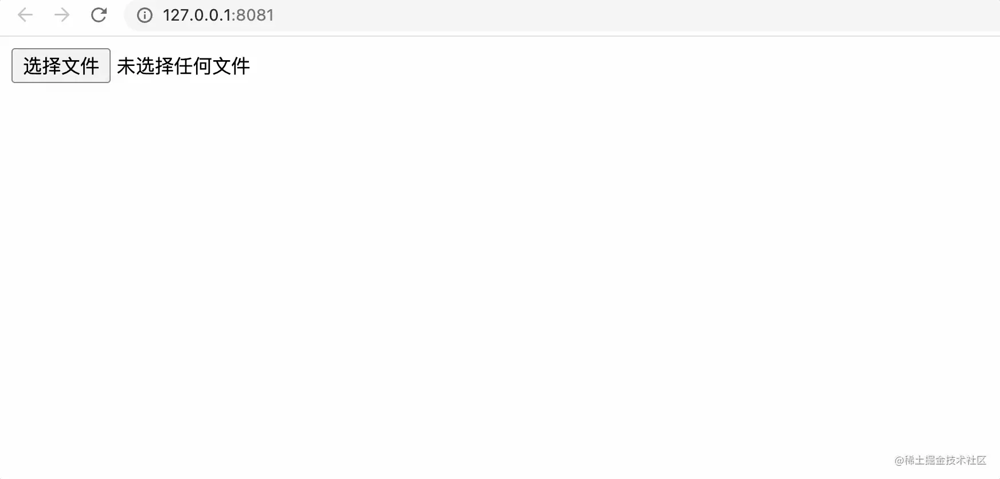

服务端就打印了 file 对象，并且文件也保存到了 uploads 目录：

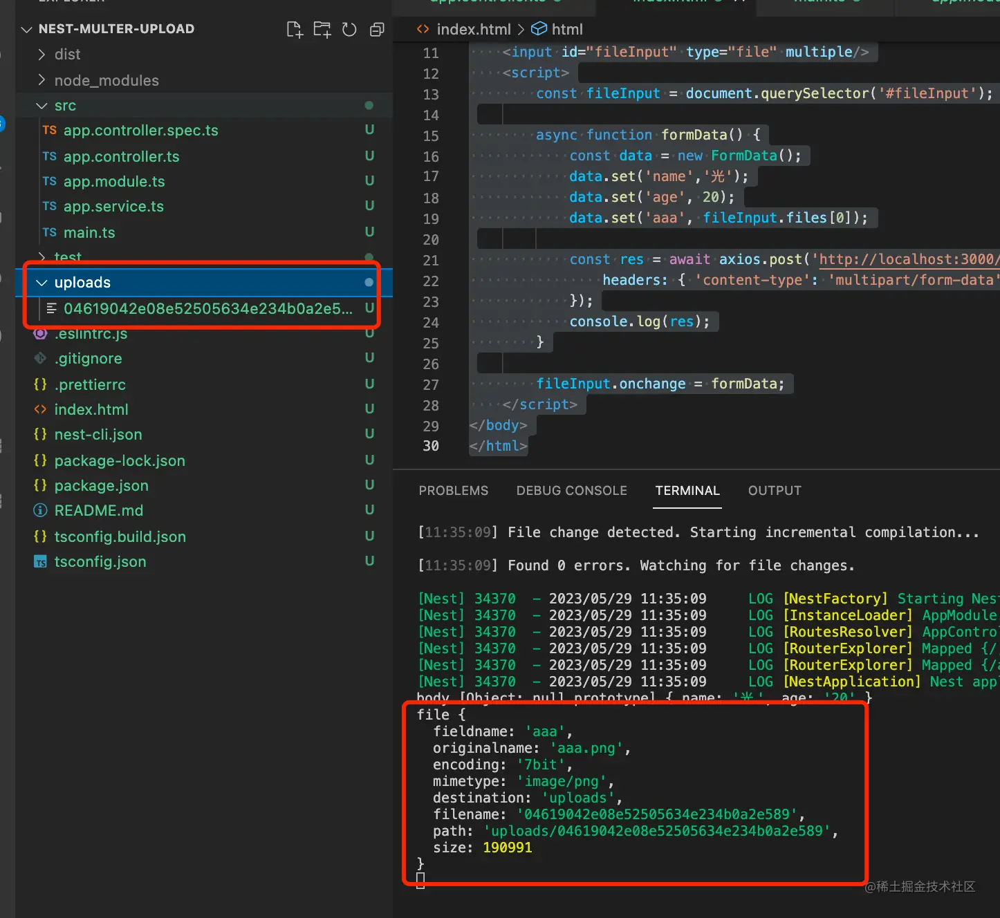

其他字段通过 @Body 装饰器获取。

再来试下多文件上传：

```javascript
@Post('bbb')
@UseInterceptors(FilesInterceptor('bbb', 3, {
    dest: 'uploads'
}))
uploadFiles(@UploadedFiles() files: Array<Express.Multer.File>, @Body() body) {
    console.log('body', body);
    console.log('files', files);
}
```

把 FileInterceptor 换成 FilesInterceptor，把 UploadedFile 换成 UploadedFiles，都是多加一个 s。

然后写下前端代码：

```javascript
async function formData2() {
    const data = new FormData();
    data.set('name','光');
    data.set('age', 20);
    [...fileInput.files].forEach(item => {
        data.append('bbb', item)
    })

    const res = await axios.post('http://localhost:3000/bbb', data, {
        headers: { 'content-type': 'multipart/form-data' }
    });
    console.log(res);
}
```

这样就可以上传多文件了：

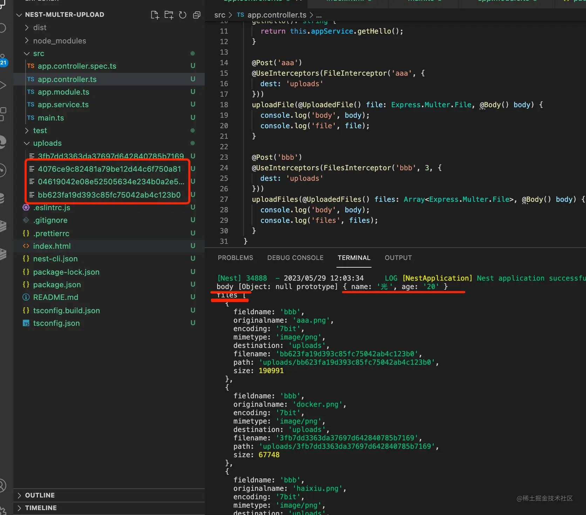

那如果有多个文件的字段呢？

和 multer 里类似，使用这种方式来指定：

```javascript
@Post('ccc')
@UseInterceptors(FileFieldsInterceptor([
    { name: 'aaa', maxCount: 2 },
    { name: 'bbb', maxCount: 3 },
], {
    dest: 'uploads'
}))
uploadFileFields(@UploadedFiles() files: { aaa?: Express.Multer.File[], bbb?: Express.Multer.File[] }, @Body() body) {
    console.log('body', body);
    console.log('files', files);
}
```

然后前端代码这样写：

```javascript
async function formData3() {
    const data = new FormData();
    data.set('name','光');
    data.set('age', 20);
    data.append('aaa', fileInput.files[0]);
    data.append('aaa', fileInput.files[1]);
    data.append('bbb', fileInput.files[2]);
    data.append('bbb', fileInput.files[3]);

    const res = await axios.post('http://localhost:3000/ccc', data);
    console.log(res);
}
```

这里应该用两个 file input 来分别上传 aaa 和 bbb 对应的文件，我这里为了测试方便就简化了下。


后端收到了上传的 aaa、bbb 的文件：

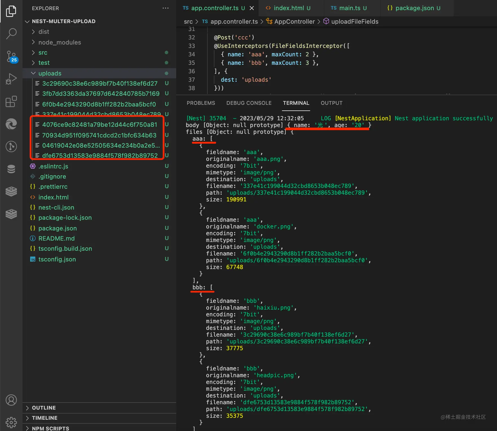

那如果并不知道有哪些字段是 file 呢？

这时可以用 AnyFilesInterceptor：

```javascript
@Post('ddd')
@UseInterceptors(AnyFilesInterceptor({
    dest: 'uploads'
}))
uploadAnyFiles(@UploadedFiles() files: Array<Express.Multer.File>, @Body() body) {
    console.log('body', body);
    console.log('files', files);
}
```

然后写下前端代码：

```javascript
async function formData4() {
    const data = new FormData();
    data.set('name','光');
    data.set('age', 20);
    data.set('aaa', fileInput.files[0]);
    data.set('bbb', fileInput.files[1]);
    data.set('ccc', fileInput.files[2]);
    data.set('ddd', fileInput.files[3]);

    const res = await axios.post('http://localhost:3000/ddd', data);
    console.log(res);
}
```

同样识别出了所有 file 字段：

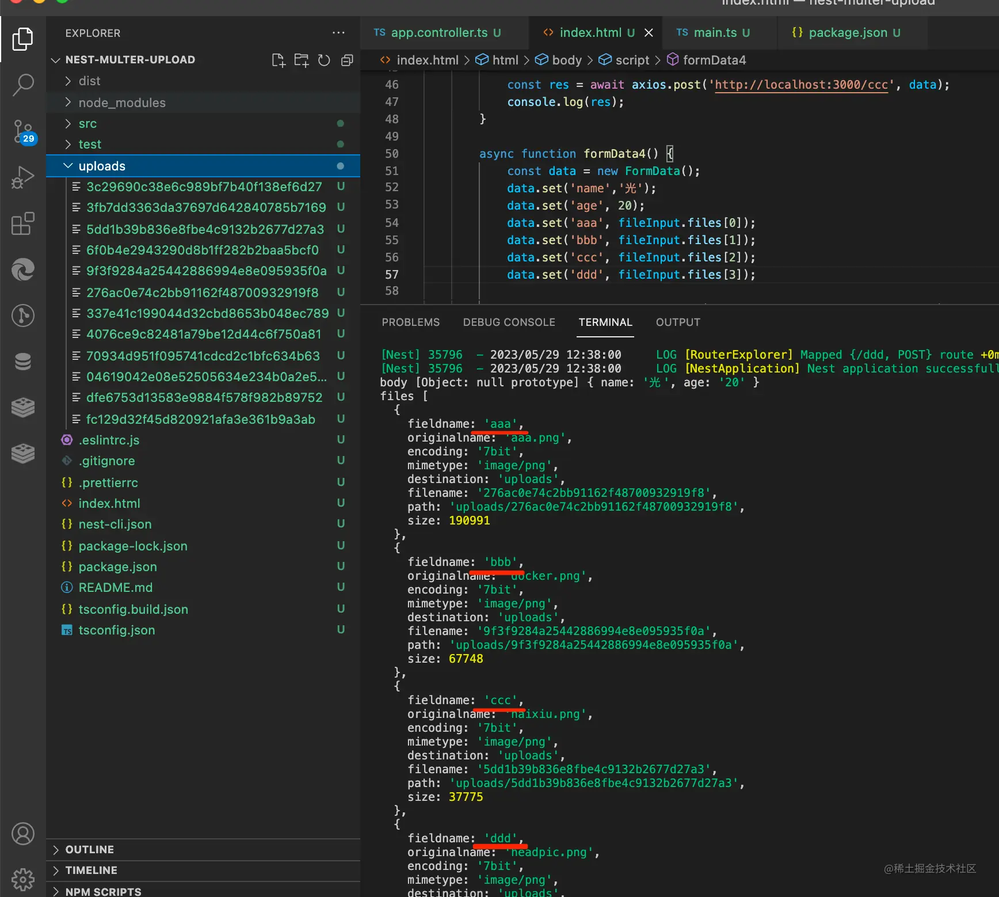

这就是 Nest 上传文件的方式。

而且你也同样可以指定 storage：

```javascript
import * as multer from "multer";
import * as fs from 'fs';
import * as path from "path";

const storage = multer.diskStorage({
    destination: function (req, file, cb) {
        try {
            fs.mkdirSync(path.join(process.cwd(), 'my-uploads'));
        }catch(e) {}

        cb(null, path.join(process.cwd(), 'my-uploads'))
    },
    filename: function (req, file, cb) {
        const uniqueSuffix = Date.now() + '-' + Math.round(Math.random() * 1E9) + '-' + file.originalname
        cb(null, file.fieldname + '-' + uniqueSuffix)
    }
});

export { storage };
```

把我们之前写的这个 storage 拿过来，在 controller 里用一下：

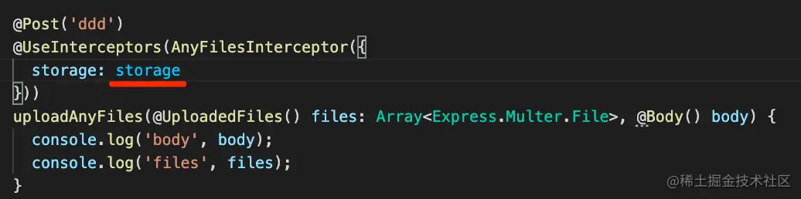

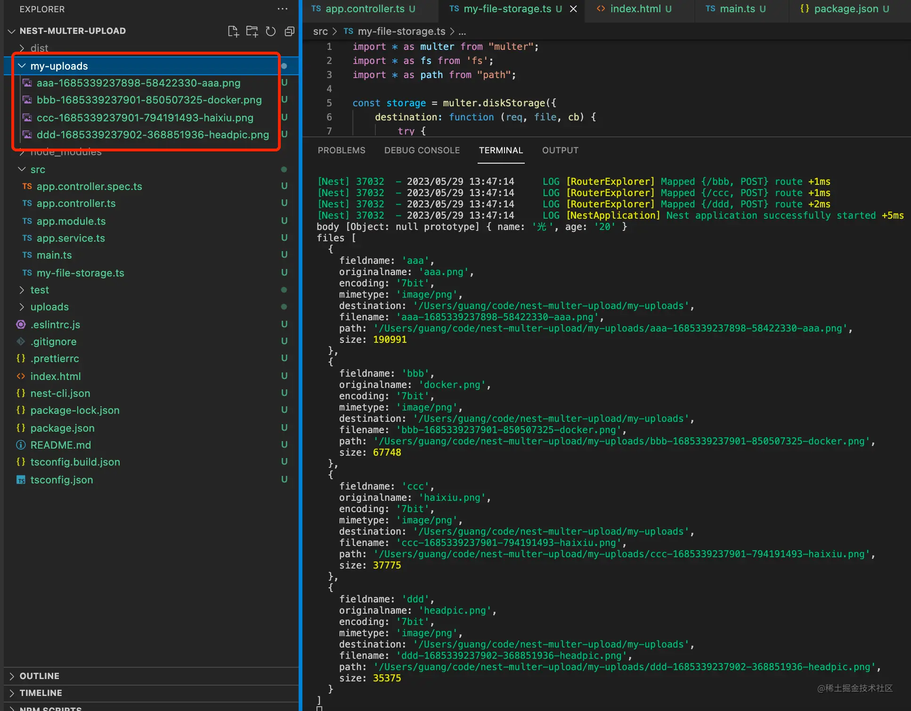
为什么 Nest 上传文件的方式和直接使用 multer 这么像呢？

因为它就是对 multer 做了一层简单的封装呀。

比如在 multer 里我们是通过 single 方法来处理单个 file 的字段：

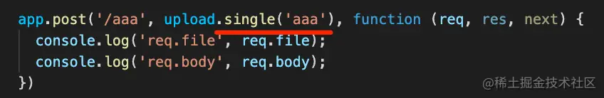

在 FileInterceptor 里也是一样：

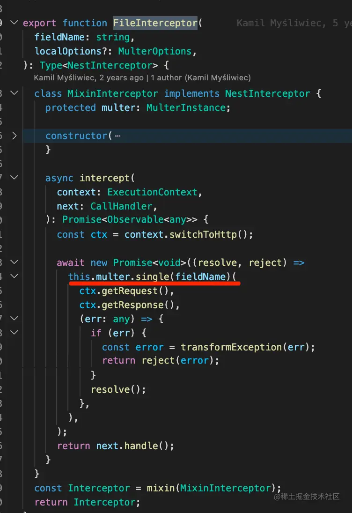

在 multer 里我们是通过 array 方法来处理多个 file 的字段：

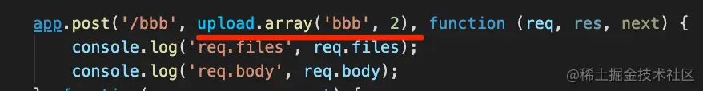

在 FilesInterceptor 里也一样：

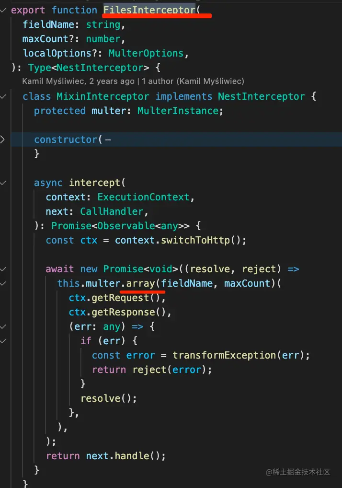

另外两个装饰器也是同理：

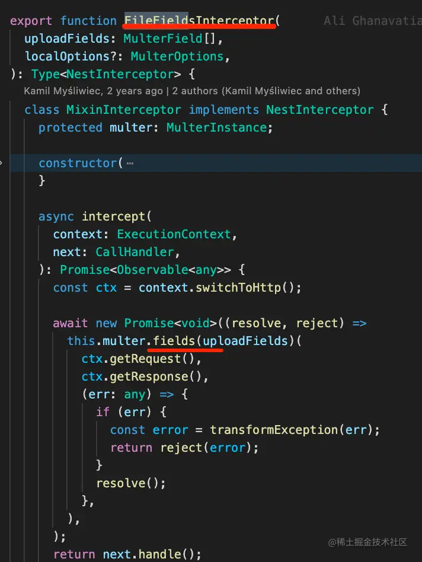

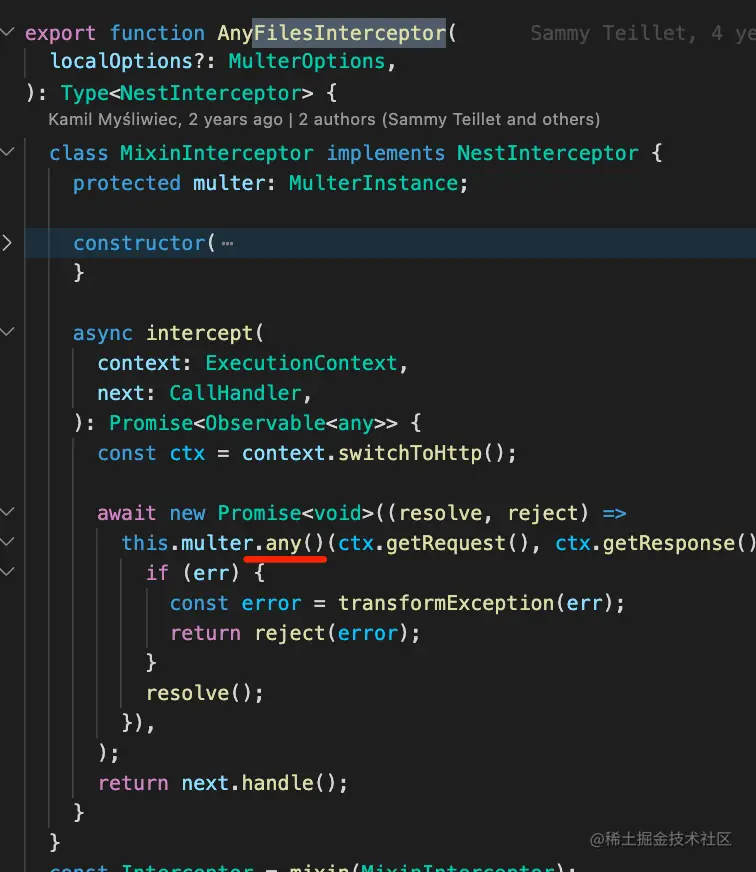

而 UploadedFile、UploadedFiles 这些装饰器，只是从 request 中取出处理完的 file、files 等属性作为参数传入 handler：

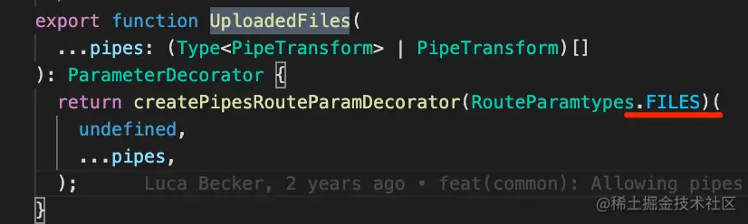

了解了这些装饰器的原理之后，回头再来看这些文件上传用的装饰器，是不是就很清晰了呢：

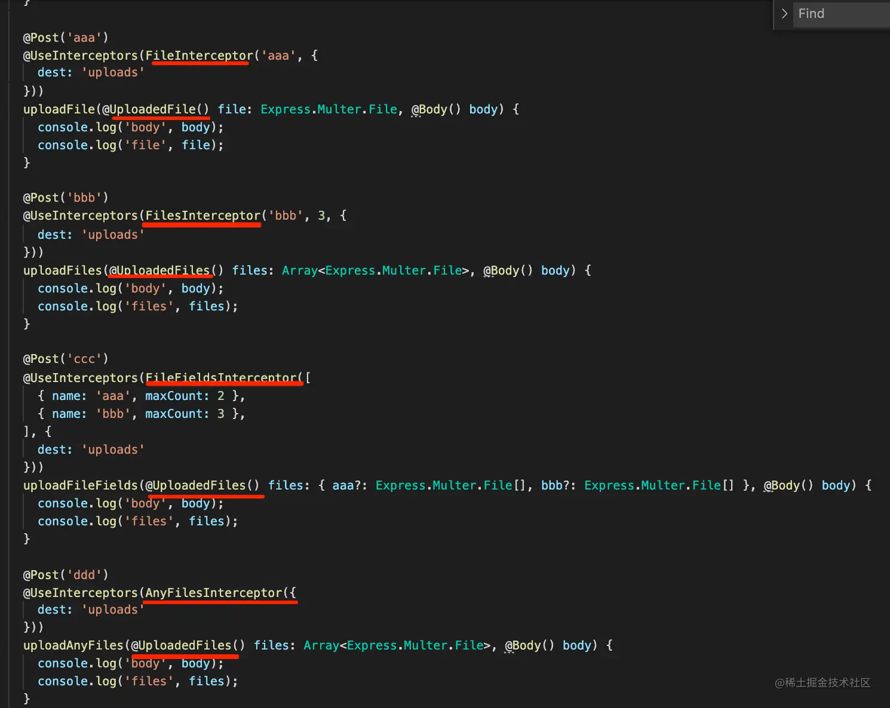

此外，我们还要对上传的文件做一些限制，比如文件大小、类型等，很明显，这部分可以放在 pipe 里做：

比如我们生成一个 pipe：

    nest g pipe file-size-validation-pipe --no-spec --flat

然后添加检查文件大小的逻辑：

```javascript
import { PipeTransform, Injectable, ArgumentMetadata, HttpException, HttpStatus } from '@nestjs/common';

@Injectable()
export class FileSizeValidationPipe implements PipeTransform {
  transform(value: Express.Multer.File, metadata: ArgumentMetadata) {
    if(value.size > 10 * 1024) {
      throw new HttpException('文件大于 10k', HttpStatus.BAD_REQUEST);
    }
    return value;
  }
}
```

大于 10k 就抛出异常，返回 400 的响应。

把它加到 UploadedFile 的参数里：

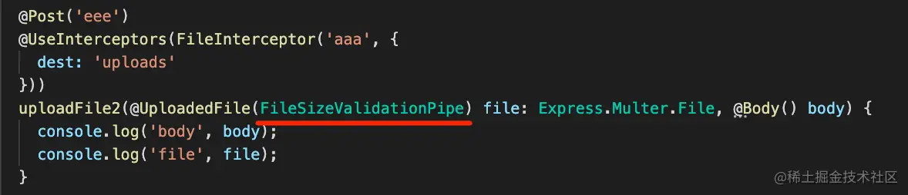

然后访问下：

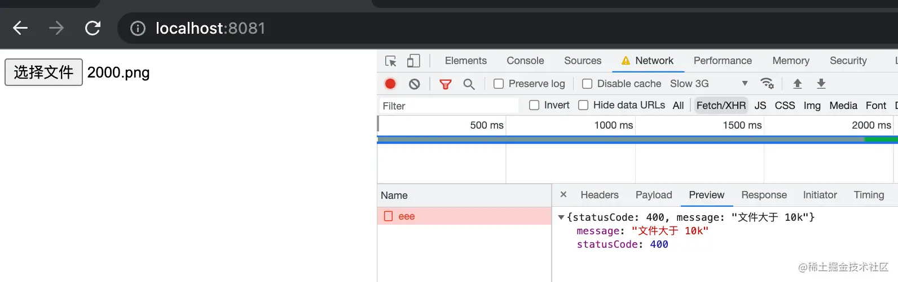

这样就可以实现文件的校验了。

但像文件大小、类型的校验这种逻辑太过常见，Nest 给封装好了，可以直接用：

```javascript
@Post('fff')
@UseInterceptors(FileInterceptor('aaa', {
    dest: 'uploads'
}))
uploadFile3(@UploadedFile(new ParseFilePipe({
    validators: [
      new MaxFileSizeValidator({ maxSize: 1000 }),
      new FileTypeValidator({ fileType: 'image/jpeg' }),
    ],
})) file: Express.Multer.File, @Body() body) {
    console.log('body', body);
    console.log('file', file);
}
```

之前内置的 pipe 还有个没讲，就是这个 ParseFilePipe。

它的作用是调用传入的 validator 来对文件做校验。

比如 MaxFileSizeValidator 是校验文件大小、FileTypeValidator 是校验文件类型。

常用的也就是校验这俩东西。

我们来试试：

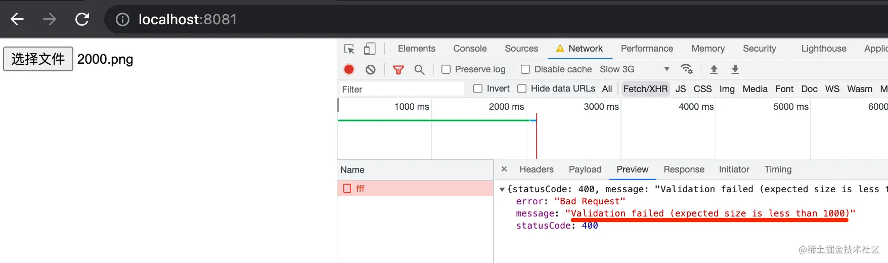

可以看到，返回的也是 400 响应，并且 message 说明了具体的错误信息。

而且这个错误信息可以自己修改：

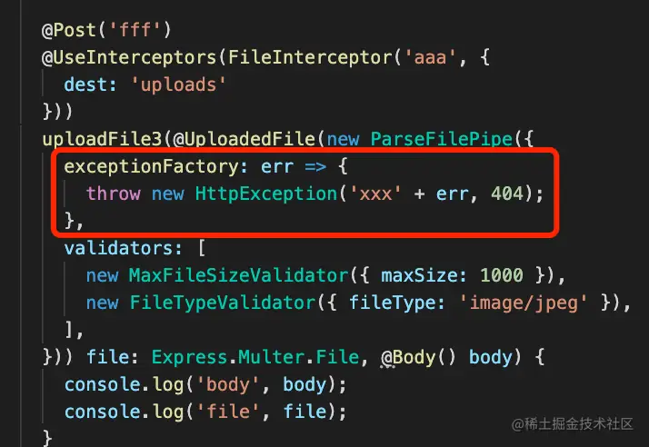

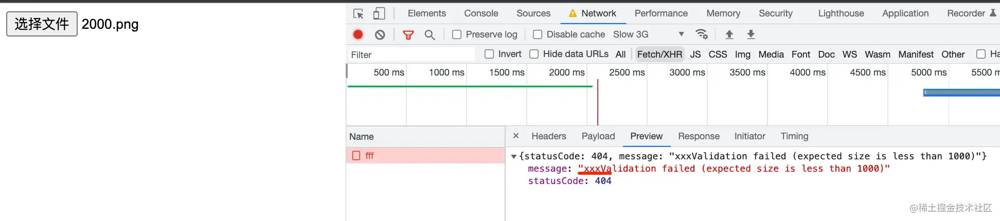

我们也可以自己实现这样的 validator，只要继承 FileValidator 就可以：

```javascript
import { FileValidator } from "@nestjs/common";

export class MyFileValidator extends FileValidator{
    constructor(options) {
        super(options);
    }

    isValid(file: Express.Multer.File): boolean | Promise<boolean> {
        if(file.size > 10000) {
            return false;
        }
        return true;
    }
    buildErrorMessage(file: Express.Multer.File): string {
        return `文件 ${file.originalname} 大小超出 10k`;
    }
}
```

然后在 controller 用一下：

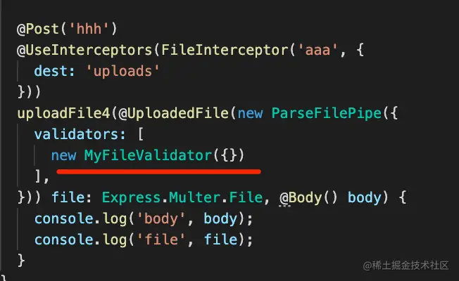

在浏览器上传个文件：

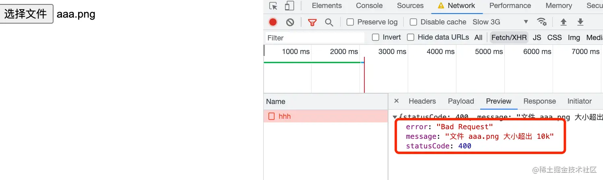

可以看到我们自定义的 FileValidator 生效了。

案例代码在[小册仓库](https://github.com/QuarkGluonPlasma/nestjs-course-code/tree/main/nest-multer-upload)。

## 总结

Nest 的文件上传也是基于 multer 实现的，它对 multer api 封装了一层，提供了 FileInterceptor、FilesInterceptor、FileFieldsInterceptor、AnyFilesInterceptor 的拦截器，分别用到了 multer 包的 single、array、fields、any 方法。

它们把文件解析出来，放到 request 的某个属性上，然后再用 @UploadedFile、@UploadedFiles 的装饰器取出来传入 handler。

并且这个过程还可以使用 ParseFilePipe 来做文件的验证，它内置了 MaxFileSizeValidator、FileTypeValidator，你也可以实现自己的 FileValidator。

这就是 Nest 里处理文件上传的方式。