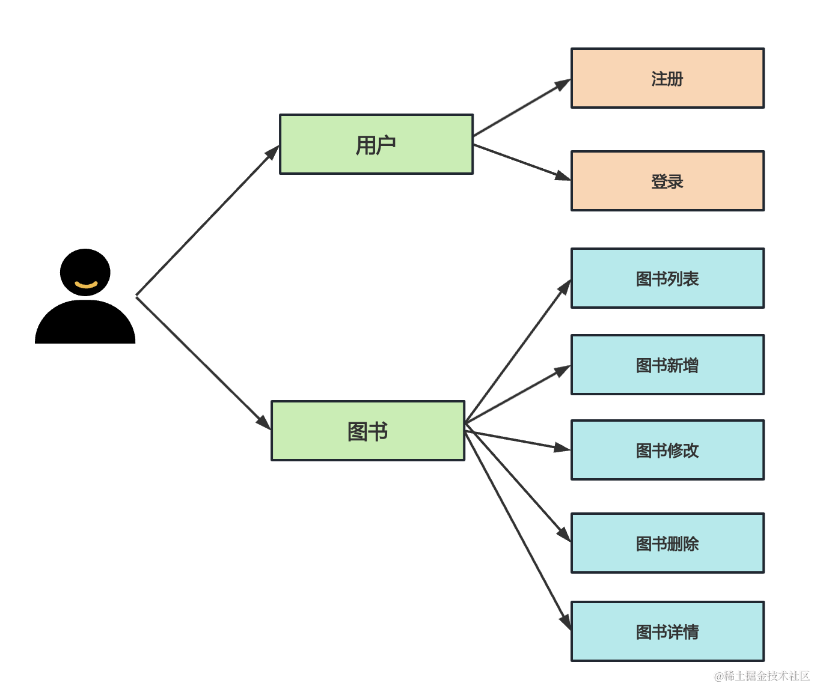
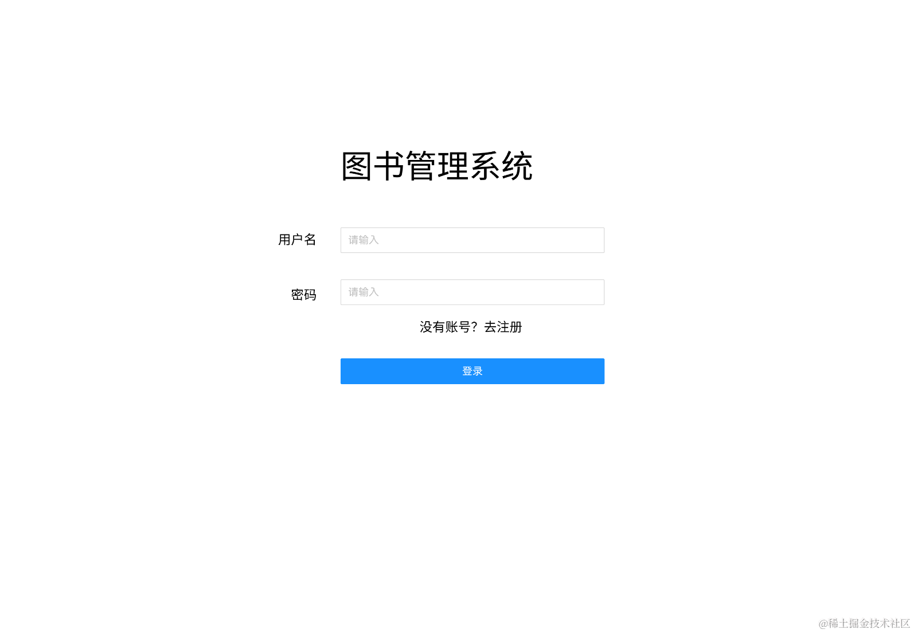
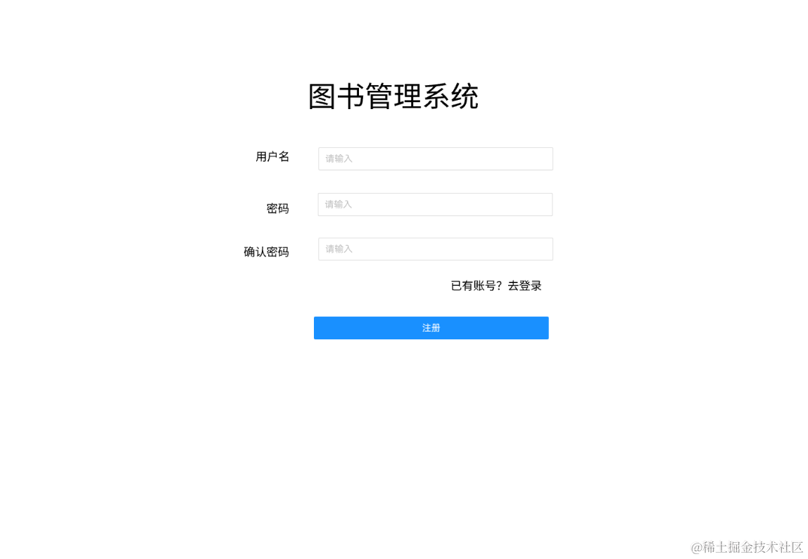
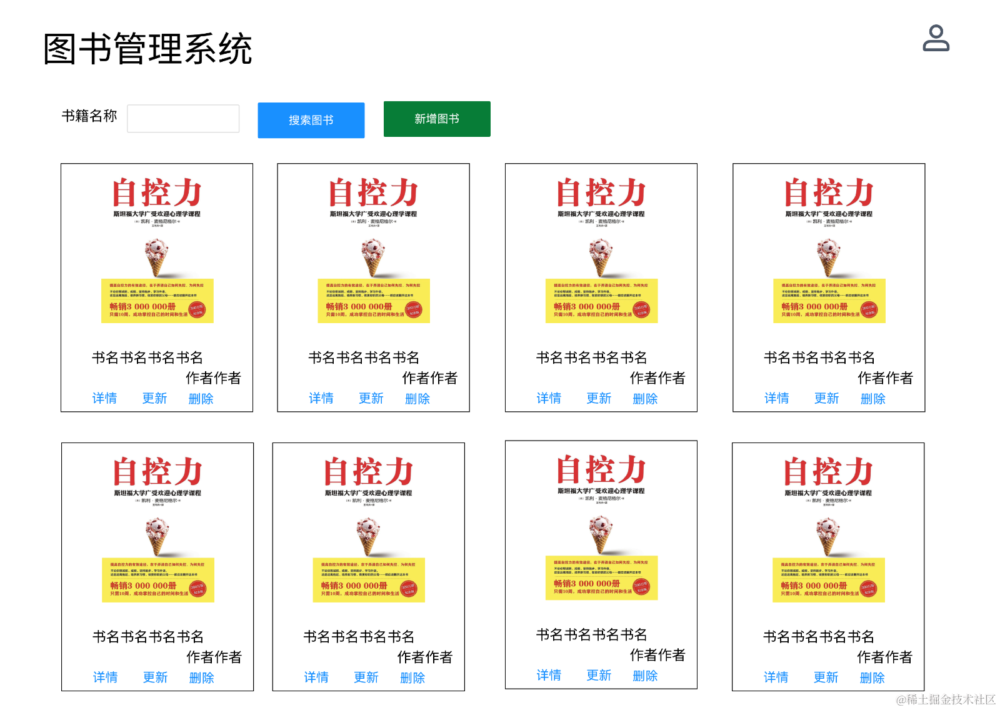
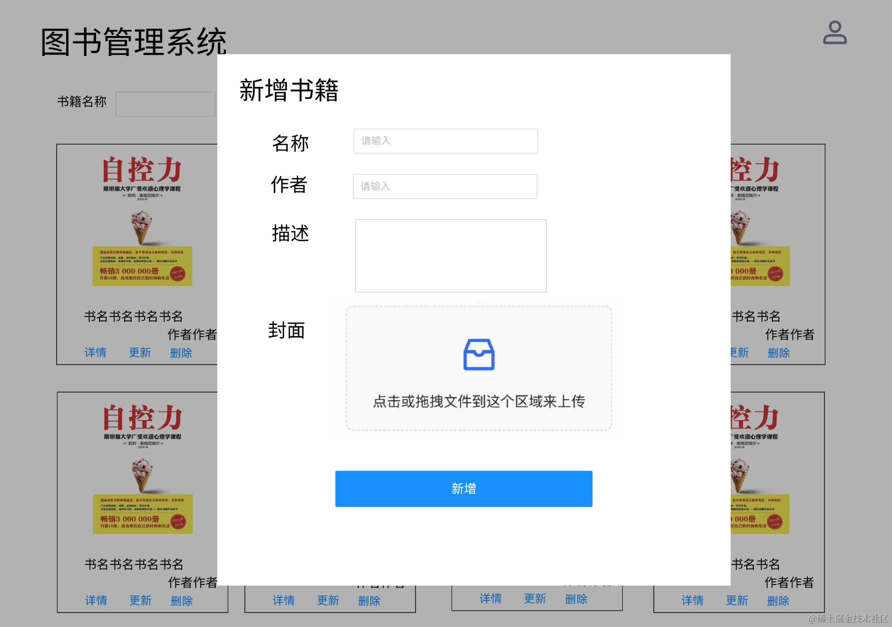
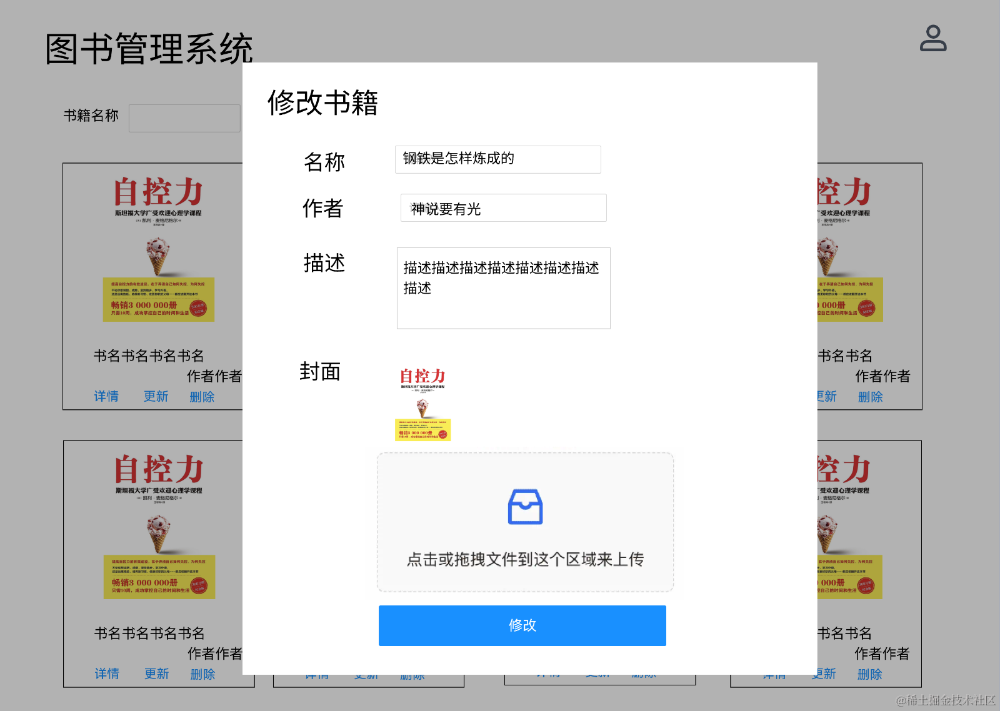
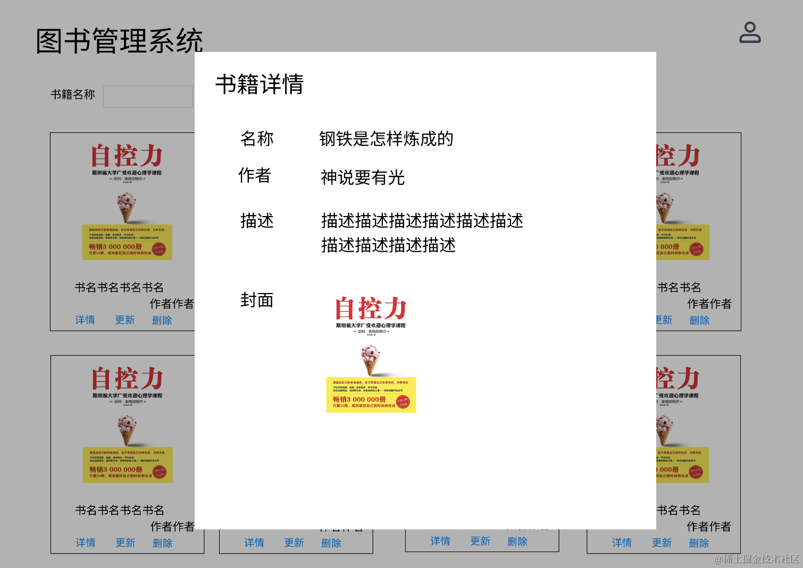

# 27. 图书管理系统：需求分析和原型图

学到这里，我们 Nest 基础的学习就告一段落了。

我们学了 nest cli、调试、provider、动态模块、ioc、aop、middleware、interceptor、pipe、自定义装饰器等。

但是在正式做项目之前还要学习一些别的知识：

mysql 做关系型数据库、redis 做缓存和临时数据存储、minio 做 OSS 服务、docker 和 docker compose 做部署、typeorm 做 ORM 框架等。

好像离项目还有很远。

其实也不是，就算不学数据库，我们现在掌握的 Nest 知识也能够做项目了。

这节开始我们做一个综合的小实战：图书管理系统。

当然，我们会尽量简化，目的只是为了把基础知识串联起来用一下，加深理解。

我们先来分析下需求：

有用户和图书两个模块：

用户模块包含注册、登录。

图书模块包含图书列表、图书新增、图书修改、图书删除、图书详情。

然后来画下原型图：

## 登录

通过用户名、密码登录。

## 注册

注册需要填入用户名、密码、确认密码。

## 书籍列表

登录后可以查看书籍列表，可以通过书名来模糊搜索。

## 新增书籍

点击新增书籍按钮会有个弹窗，输入书名、作者、描述，上传封面后，点击新增就可以新增书籍。

## 修改书籍

点击书籍列表里的修改按钮，可以修改书籍信息。

## 书籍详情

点击书籍列表里的详情按钮，可以查看书籍详细信息。

原型图：https://js.design/f/jmJQ8y?mode=design&p=FPRc1zBMPx&linkelement=0-630 

## 总结

我们学完了 Nest 基础，现在做一个综合小实战巩固下。

我们分析了图书管理系统的需求，有登录、注册、书籍列表、书籍新增、书籍详情、书籍修改这些功能。

并且画了原型图。

下节开始，就通过这个实战项目来综合练习下前面学到的基础知识。
