# 36. Nest 里如何打印日志？

前面我们都是用 console.log 打印的日志，这样有不少弊端：没有日志的不同级别的区分，不能通过开关控制是否打印等。

其实 Nest 提供了打印日志的 api，这节我们就来学习一下吧。

还是先创建个项目：
```
nest new logger-test -p npm
```
进入目录，执行 nest start --watch 把服务跑起来。

Nest 会打印这些日志：

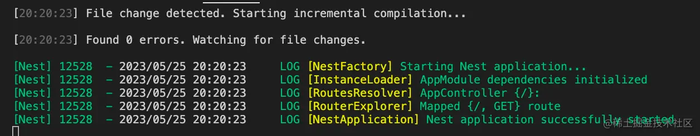

它也同样提供了打印这种日志的 api。

我们在 AppController 里创建个 logger 对象，使用它的 api 打印日志：

```javascript
import { ConsoleLogger, Controller, Get, Logger } from '@nestjs/common';
import { AppService } from './app.service';

@Controller()
export class AppController {
  private logger = new Logger();

  constructor(private readonly appService: AppService) {}

  @Get()
  getHello(): string {
    this.logger.debug('aaa', AppController.name);
    this.logger.error('bbb', AppController.name);
    this.logger.log('ccc', AppController.name);
    this.logger.verbose('ddd', AppController.name);
    this.logger.warn('eee', AppController.name);
    
    return this.appService.getHello();
  }
}

```

浏览器访问下：

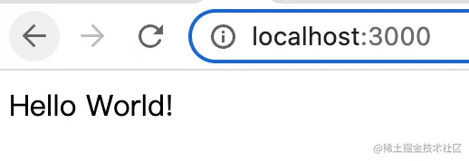

会打印这样的日志：

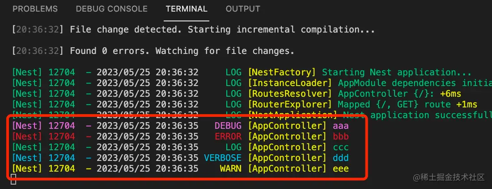

这里的 verbose、debug、log、warn、error 就是日志级别，而 \[] 中的是 context，也就是当前所在的上下文，最后是日志的内容。

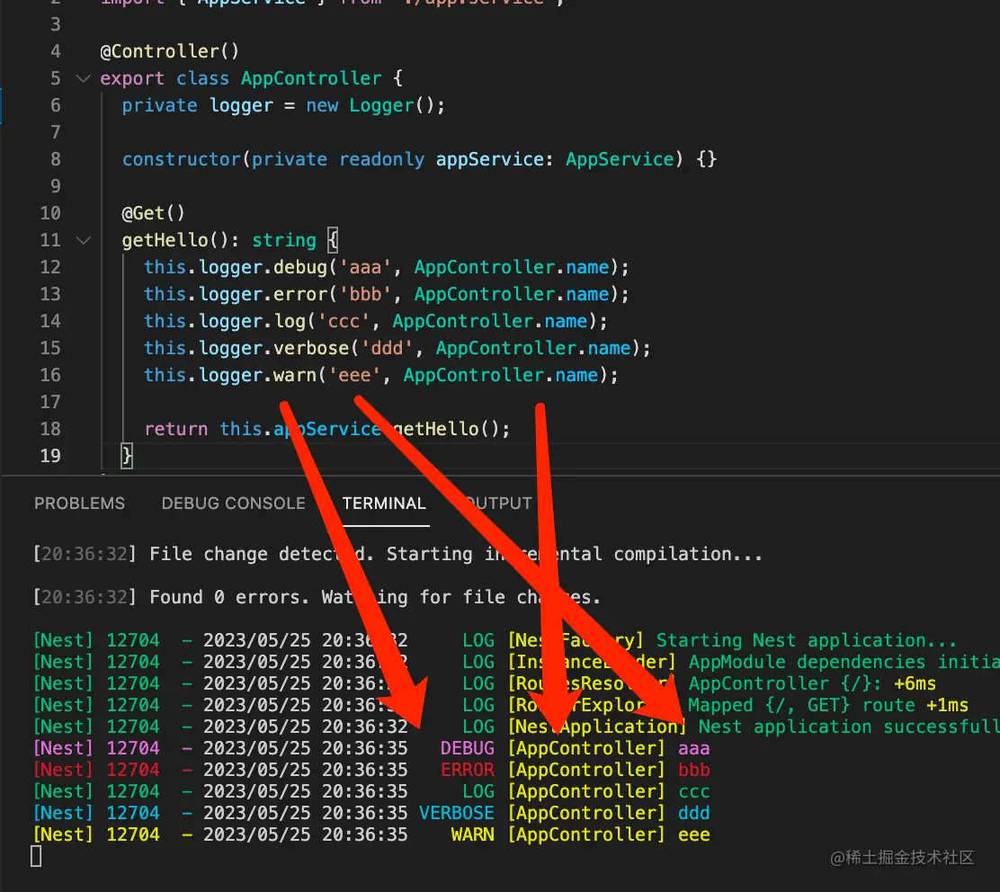

这个日志是受 Nest 控制的，可以在创建应用的时候指定是否开启：

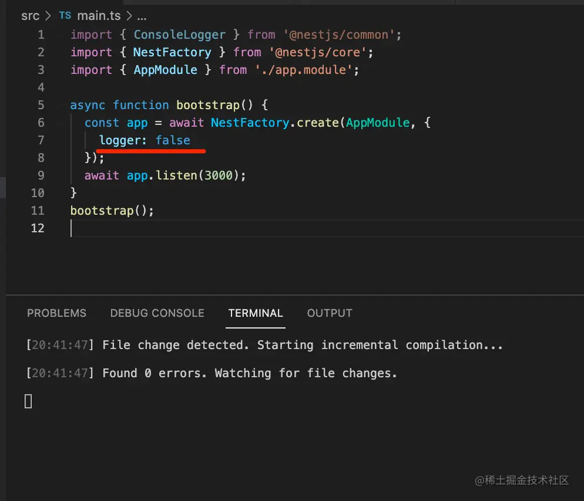

设置 logger 为 false 之后就没有日志了。

你也可以自己决定输出什么级别的日志：

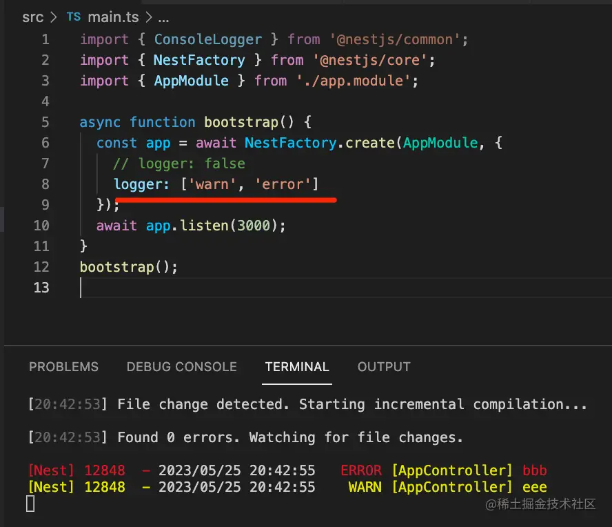

此外，你还可以自定义日志打印的方式，定义一个实现 LoggerService 接口的类：

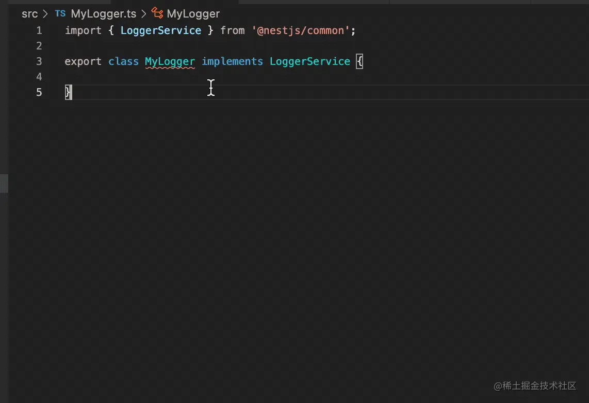

只要实现 log、warn、error 3 个方法就好了：

```javascript
import { LoggerService, LogLevel } from '@nestjs/common';

export class MyLogger implements LoggerService {
    log(message: string, context: string) {
        console.log(`---log---[${context}]---`, message)
    }

    error(message: string, context: string) {
        console.log(`---error---[${context}]---`, message)
    }

    warn(message: string, context: string) {
        console.log(`---warn---[${context}]---`, message)
    }
}
```

在创建应用时指定这个 logger：

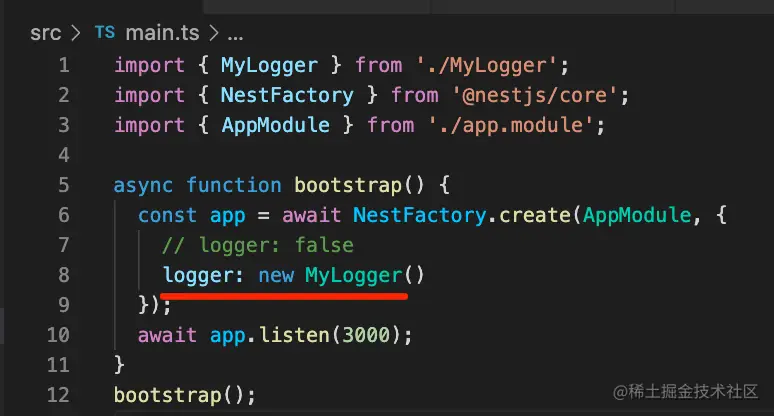

然后现在项目启动就是这样了：

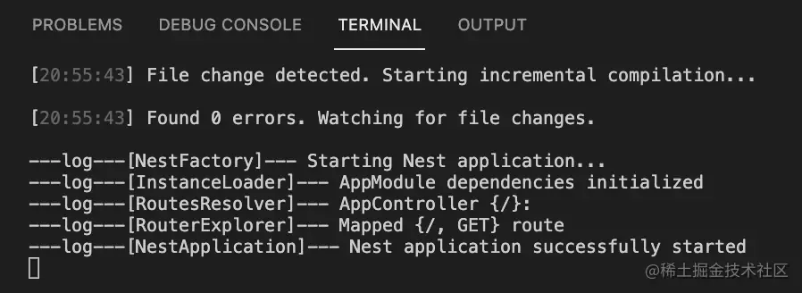

刷新页面打印的日志是这样的：

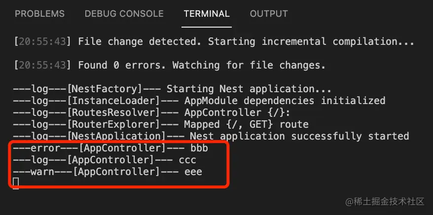

确实还挺丑的。。

我们只是测试下自定义 Logger。

你也可以不自己实现 LoggerService 的全部方法，而是继承 ConsoleLogger，重写一些方法：

```javascript
import { ConsoleLogger } from '@nestjs/common';

export class MyLogger2 extends ConsoleLogger{
    log(message: string, context: string) {
        console.log(`[${context}]`,message)
    }
}
```

因为 ConsoleLogger 实现了 LoggerService 接口：

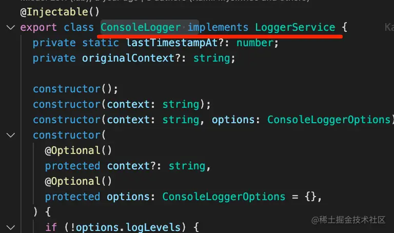

这样你没重写的方法就是原来的：

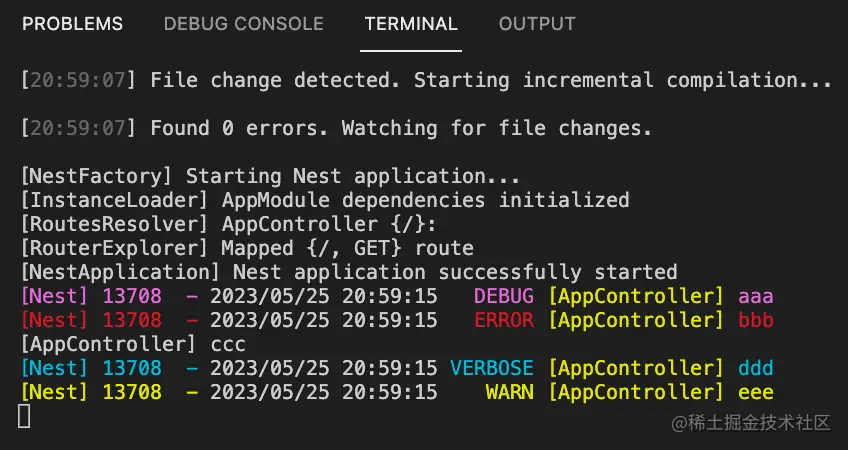

这就是创建应用时 logger 的 3 种取值：

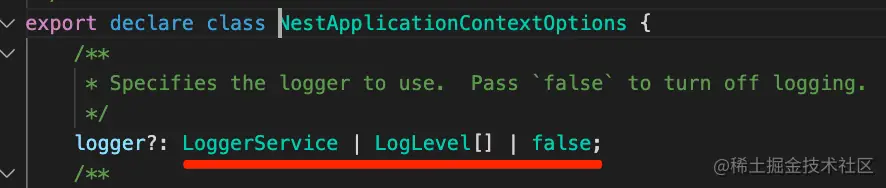

但这样有个问题，没法注入依赖，因为 Logger 是在容器外面，手动 new 的对象。

怎么办呢？

这时候可以这样：

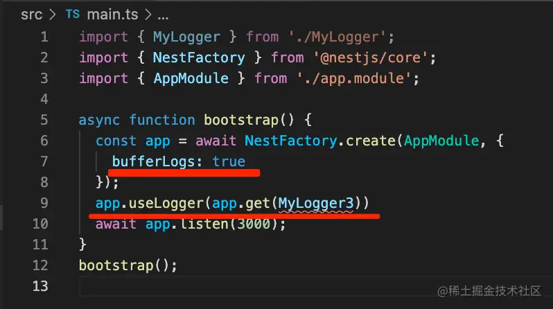

bufferLogs 就是先不打印日志，把它放到 buffer 缓冲区，直到用 useLogger 指定了 Logger 并且应用初始化完毕。

app.get 就是从容器中取这个类的实例的，我们写一个 Logger 类放到容器里：

```javascript
import { Inject } from '@nestjs/common';
import { ConsoleLogger, Injectable } from '@nestjs/common';
import { AppService } from './app.service';

@Injectable()
export class MyLogger3 extends ConsoleLogger{
    @Inject(AppService)
    private appService: AppService;

    log(message, context) {
        console.log(this.appService.getHello());
        console.log(`[${context}]`, message);
        console.log('--------------')
    }
}
```

添加 @Injectable() 装饰器，代表这是一个 provider，并且要在 Module 里引入：

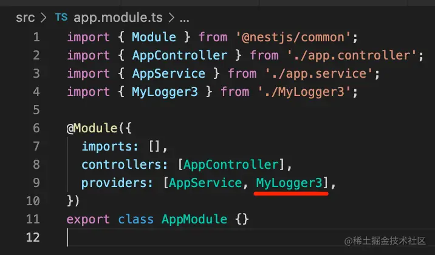

通过 @Inject 注入 AppService，并在 log 的时候调用。

现在的日志是这样的：

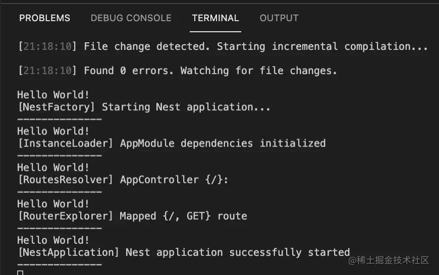

很明显，logger 里成功注入了 appService 的依赖。

我们可以单独搞一个模块来放 Logger。

    nest g module logger

把这个 Module 设置为全局模块：

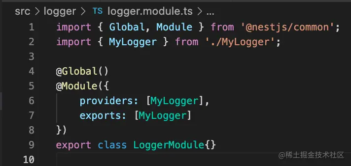

这样在任何地方都可以注入这个 logger 对象了。

我们创建个新模块：

```
nest g resource aaa 
```

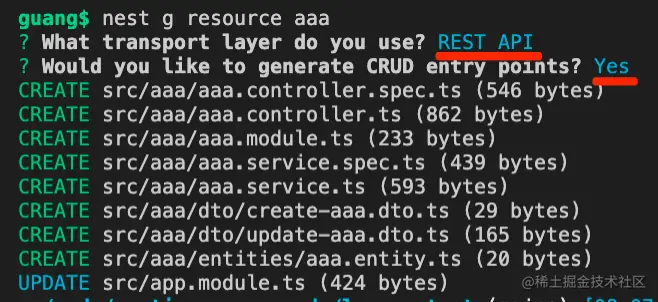

在这个模块里可以直接注入 MyLogger，不用 imports 那个 Module。

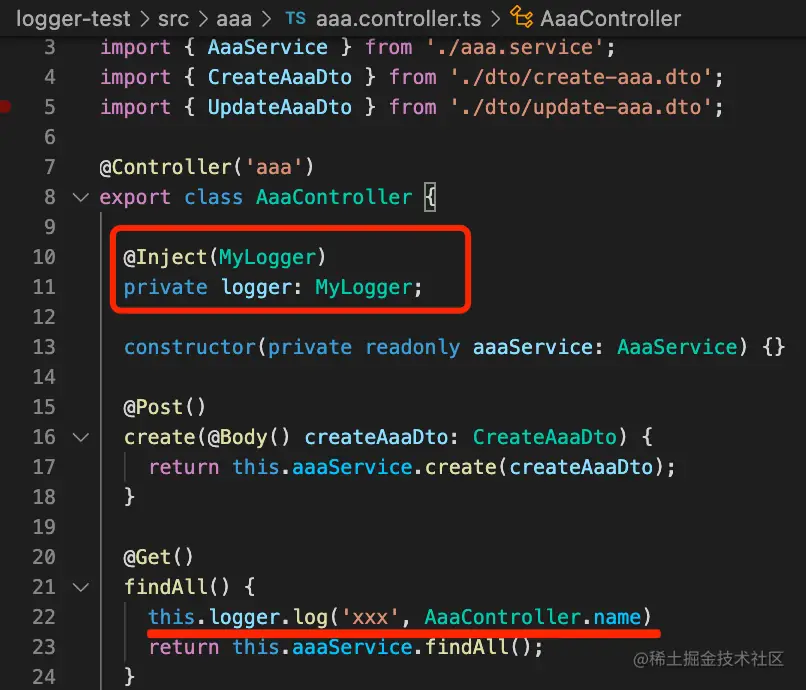

测试下：

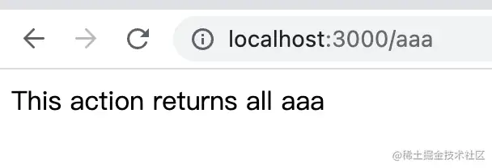

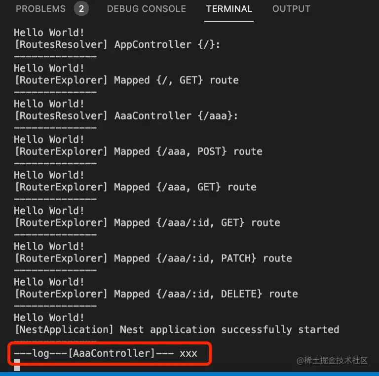

可以看到，成功注入了 MyLogger。

或者你也可以声明一个动态模块，每次 imports 的时候配置下：

```javascript
import { DynamicModule, Global, Module } from '@nestjs/common';
import { MyLogger } from './MyLogger';

@Module({})
export class Logger2Module{

    static register(options): DynamicModule {
        return {
            module: Logger2Module,
            providers: [
                MyLogger, 
                {
                    provide: 'LOG_OPTIONS',
                    useValue: options
                }
            ],
            exports: [MyLogger, 'LOG_OPTIONS']
        }
    }
}
```
把传入的 options 作为 provider，在 Logger 里注入：

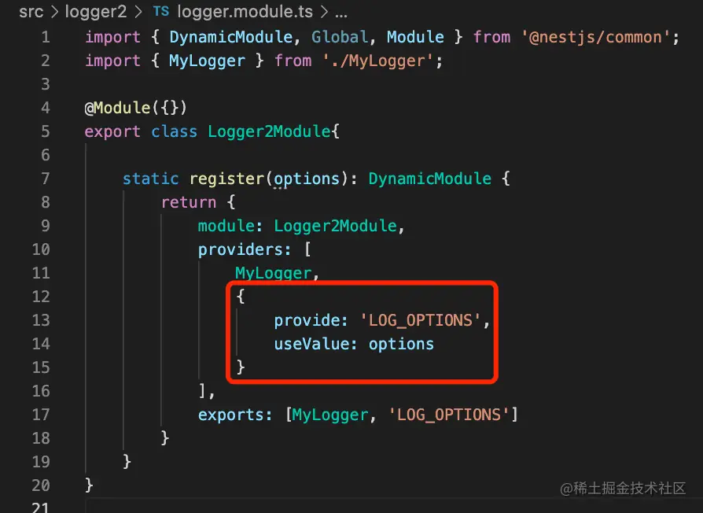


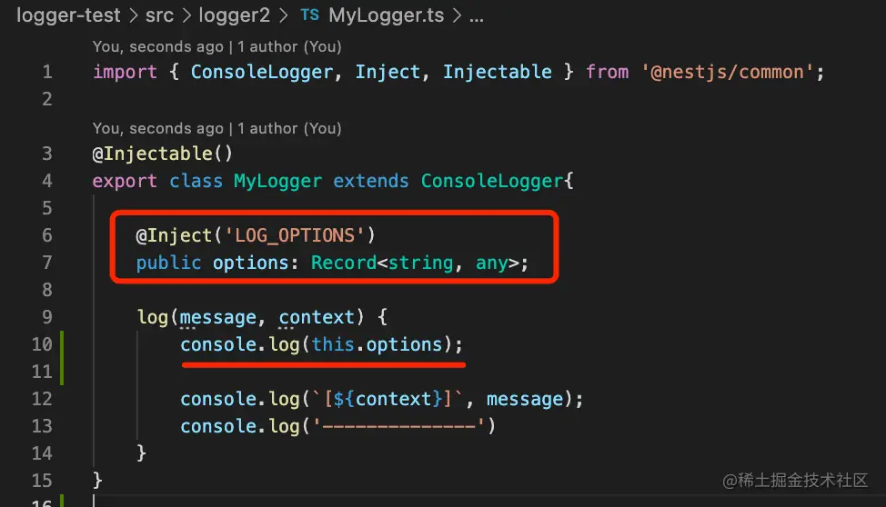

每次 imports 的时候传入不同的配置：

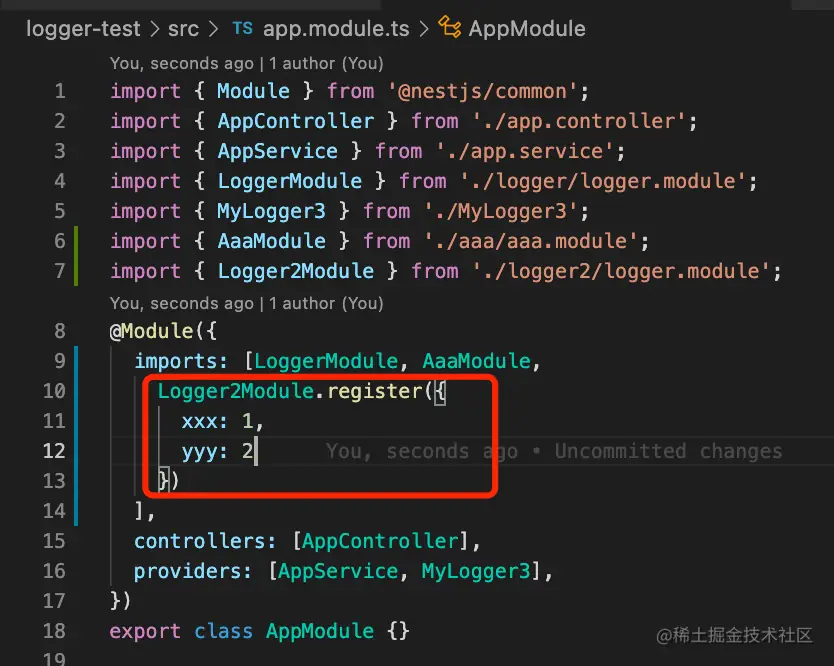

在 AppService 里注入下：

```javascript
import { Inject, Injectable } from '@nestjs/common';
import { MyLogger } from './logger2/MyLogger';

@Injectable()
export class AppService {

  @Inject(MyLogger)
  private logger: MyLogger;

  getHello(): string {
    this.logger.log('yyy', AppService.name);
    
    return 'Hello World!';
  }
}

```
浏览器访问 http://localhost:3000 就可以看到 MyLogger 打印的传入的 option：

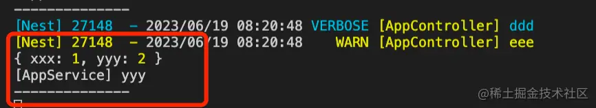

具体是用全局模块还是动态模块，可以根据情况来选择。

案例代码在[小册仓库](https://github.com/QuarkGluonPlasma/nestjs-course-code/tree/main/logger-test)。

## 总结

日志打印可以用 Nest 的 Logger，它支持在创建应用的时候指定 logger 是否开启，打印的日志级别，还可以自定义 logger。

自定义 Logger 需要实现 LoggerService 接口，或者继承 ConsoleLogger 然后重写部分方法。

如果想在 Logger 注入一些 provider，就需要创建应用时设置 bufferLogs 为 true，然后用 app.useLogger(app.get(xxxLogger)) 来指定 Logger。

你可以把这个自定义 Logger 封装到全局模块，或者动态模块里。

当然，一般情况下，直接使用 Logger 就可以了。
