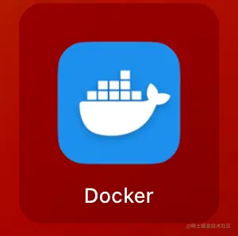

# 39. 通过 Desktop 学 Docker 也太简单了

后端系统会部署很多服务，包括我们自己开发的服务，还有 mysql、redis 等中间件的服务，部署它们需要一系列依赖的安装、环境变量的设置等等。

如果你要部署多台机器的话，同样的操作要重复多次，万一哪一步漏掉了，服务就跑不起来了。

就很麻烦。

而 Docker 就能完美解决这个问题：

它把系统的所有文件封装成一个镜像，镜像跑起来作为容器，它可以在一台机器上跑多个容器，每个容器都有独立的操作系统环境，比如文件系统、网络端口等，在容器内跑各种服务。

这样整个环境都保存在这个镜像里，部署多个实例只要通过这个镜像跑多个容器就行。

这也是为什么它的 logo 是这样的：

Docker 提供了 Docker Hub 镜像仓库，可以把本地镜像 push 到仓库或者从仓库 pull 镜像到本地。

我们 pull 个镜像下来试试看：

首先需要安装 Docker，直接从[官网](https://docker.com)下载 docker desktop 就行：

（windows 选择 widnows 的安装包。m1 要注意芯片类型，选择 apple chip 那个包）

它内置了 docker 命令。

把它安装到系统之后，可以在命令行看下 docker 命令是否可用：

如果不可用，那要设置下这个：

点击 Settings > Advanced，里面有两种安装路径，如果是 /usr/local/bin，那 docker 命令就是直接可用的，因为这个路径在 PATH 变量里。

如果是第二种，那就需要手动把它加到 PATH 环境变量里。

然后我们来看看 docker desktop 的界面：

images 是本地的所有镜像，containers 是镜像跑起来的容器。

docker desktop 可以可视化的管理它们，很方便。

我们 pull 一个镜像试试看。

搜索 nginx 镜像，点击 pull（搜索这步需要翻墙，不然搜不到）。

pull 下来之后，就可以在本地 images 看到了：

如果搜不到，那直接在命令行用 docker search、docker pull 搜索和拉取镜像也可以：

点击 run 会让你填一些参数：

首先是名字，如果不填，docker desktop 会给你生成随机的容器名字。

就是这种：

然后是端口，容器内跑的 nginx 服务是在 80 端口，你要把宿主机的某个端口映射到容器的 80 端口才可以访问。

接下来是数据卷 volume，这个是把宿主机某个目录挂到容器内。

因为容器是镜像跑起来的，下次再用这个镜像跑的还是同样的容器，那你在容器内保存的数据就会消失。

所以我们都是把某个宿主机目录，挂载到容器内的某个保存数据的目录，这样数据是保存在宿主机的，下次再用镜像跑一个新容器，只要把这个目录挂载上去就行。

至于环境变量，这个就很容易理解了。

我们分别设置一下：

挂载本地的 /tmp/aaa 到容器内的 /usr/share/nginx/html 目录。

这里的 /tmp/aaa 可以换成宿主机的任何目录，如果是 windows 系统，那就是类似 D://tmp/aaa 这种。

**（注意，这里是 /usr 而不是 /user）**

点击 run：

可以看到容器内的 nginx 服务跑起来了。

我们在 /tmp/aaa 目录下添加一个 index.html:

浏览器访问 <http://localhost> 就可以访问到：

这就说明数据卷挂载成功了。

点击 files 标签就可以看到容器内的文件。

可以看到 /usr/share/nginx/html 被标识为 mounted，就是挂载目录的意思：

我们再在本地添加一个文件：

你会发现容器内这个目录内容也变了：

这就是 volume 挂载的作用。

如果你挂载某些目录报错，是因为 docker desktop 挂载的目录是需要配置的，在 Settings > Resources > File Sharing 里加一下就行：

至于挂载到的目录，在镜像搜索结果页有写：

通过命令行  docker run 来跑镜像， -v 是指定挂载的数据卷，后面的 :ro 代表 readonly，也就是容器内这个目录只读，:rw 表示容器内可以读写这个目录。

这就是数据卷的作用。

此外，你还可以进入到容器内执行各种命令：

是不是感觉 docker 学起来还挺简单的？

docker 常用的就是这些东西。

当然，在服务器上没有 Docker Desktop 这种东西，还是要敲命令的。

比如我们点击 pull 按钮，就相当于执行了 docker pull：

    docker pull nginx:latest

latest 是标签，也就是这个：

然后我们点击 run 按钮，填了个表单，就相当于执行了 docker run：

    docker run --name nginx-test2 -p 80:80 -v /tmp/aaa:/usr/share/nginx/html -e KEY1=VALUE1 -d nginx:latest 

\-p 是端口映射

\-v 是指定数据卷挂载目录

\-e 是指定环境变量

\-d 是后台运行

对照下前面可视化界面，是不是瞬间就懂了：

docker run 会返回一个容器的 hash：

就是这里的 id：

这个界面可以用 docker ps 来获取：

它是显示容器列表的，默认是运行中的。

想显示全部的，可以加个 -a

除了 container 列表，image 镜像列表也可以通过 docker images 命令获取：

我们在容器的 terminal 里执行命令，对应的是  docker exec 命令：

\-i 是 terminal 交互的方式运行

\-t 是 tty 终端类型

然后指定容器 id 和 shell 类型，就可以交互的方式在容器内执行命令了。

查看日志，对应 docker logs 命令：

输入 exit 退出：

docker inspect 可以查看容器的详情

对应 desktop 里的 inspect 的 tab：

docker volume 可以管理数据卷：

对应 desktop 的这部分：

此外，还有这些常用命令：

*   docker start：启动一个已经停止的容器
*   docker rm：删除一个容器
*   docker stop：停止一个容器

都可以通过 docker desktop 很方便的操作

## 总结

Docker 可以把环境封装成镜像，镜像跑起来是一个独立的容器。通过这种方式可以快速部署多个相同的实例。

docker 提供了一个 desktop 工具，可以可视化的操作 docker，包括容器、镜像、volume 等

我们 pull 了一个 nginx 镜像下来，指定端口映射、挂载的数据卷，并把它跑起来了。

这就是 docker 的基本用法。

当然，这些可视化的操作都有对应的命令，当服务器上没有桌面的时候，就需要用命令行操作了。

不得不说，用 desktop 来学 docker 真是太简单了。
