前面我们都是 node 直接跑的 Nest 应用，但生产环境我们不会直接跑 node，而会用 pm2 来跑。

为什么要用 pm2 呢？它解决了啥问题？

想一下：

如果你的 node 应用跑的时候突然抛了个错，崩溃了，是不是需要重新跑起来？

这时候是不是就需要另一个进程来自动做重启这件事情？

node 应用的日志默认输出在控制台，如果想输出到不同的日志文件，是不是可以让另一个进程获取 node 应用的输出，然后写文件来实现？

node 是单线程的，而机器是多个 cpu 的，为了充分利用 cpu 的能力，我们会用多个进程来跑 node 应用，这种通用逻辑是不是也可以放到一个单独进程里来实现？

node 运行时的 cpu、内存等资源的占用，是不是需要监控？这时候是不是可以让另一个进程来做？

线上的 node 应用不只是跑起来就行了，还要做自动重启、日志、多进程、监控这些事情。

而这些事情，都可以用 pm2 来做。

pm2 是 process manager，进程管理，它是第二个大版本，和前一个版本差异很大，所以叫 pm2.

pm2 的主要功能就是**进程管理、日志管理、负载均衡、性能监控**这些。

我们分别来看一下：

首先安装 pm2:

    npm install -g pm2

然后跑一个 node 应用，我这里跑一个 Nest 的应用：

直接 node 跑是这样的，日志打印在控制台：

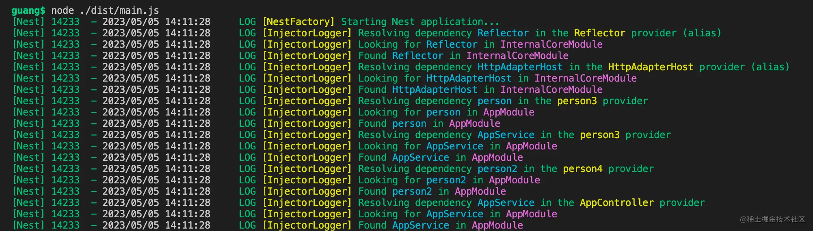

而用 pm2 的话，就可以这样跑：

    pm2 start ./dist/main.js

它会把这个 node 进程跑起来，然后管理起来：

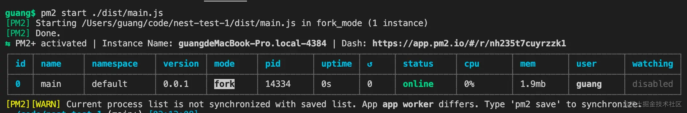

管理起来之后，就有我们上面说的那些功能了，比如自动重启、日志管理、性能监控等。

首先看下日志，执行

    pm2 logs

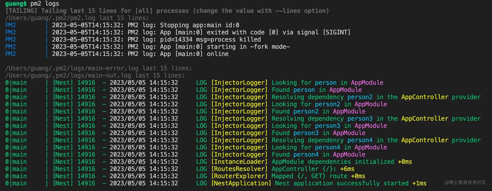

可以看到 pm2 会把所有进程的日志打印出来，通过前面的“进程id|进程名字”来区分，比如 0|main。

而且，它会把它写到日志文件里，在 \~/.pm2/logs 下，以“进程名-out.log”和“进程名-error.log”分别保存不同进程的日志：

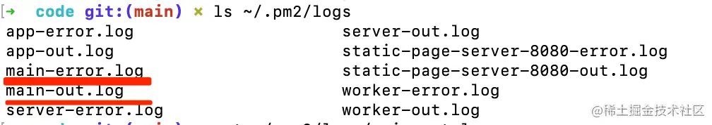

比如 main-out.log 里保存了 main 进程的正常日志，而 main-error.log 里保存了它的报错日志：

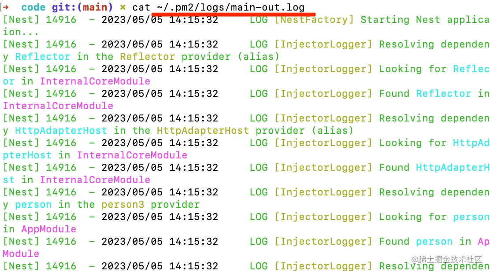

我们再跑一个进程试试：

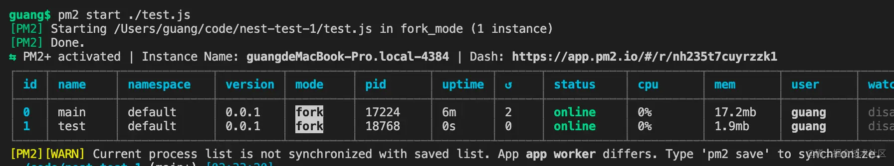

现在有两个进程了，pm2 logs 可以看到这两个进程的日志：

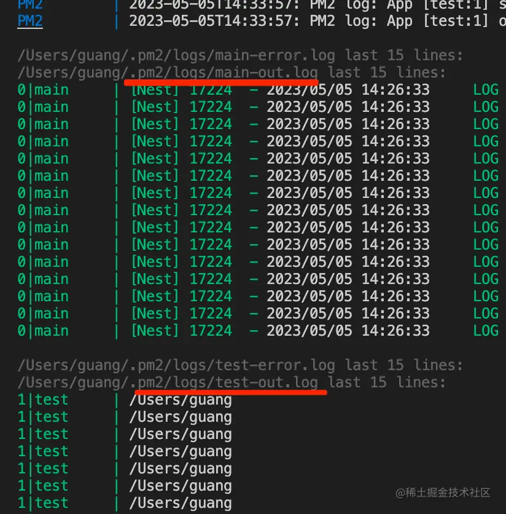

也可以

    pm2 logs 进程名
    pm2 logs 进程id

这样查看单个进程的日志：

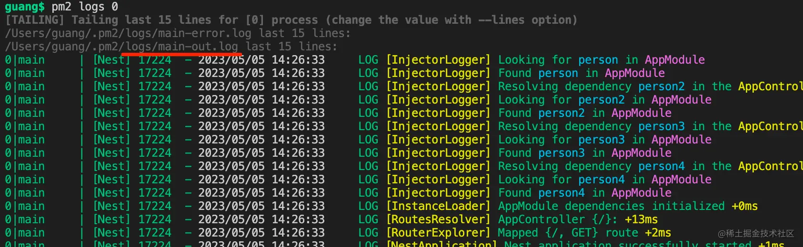

这就是 pm2 的日志管理的功能。

进程管理的话就是可以手动启动、重启、停止某个进程，而且崩溃了会自动重启，也可以定时自动重启。

只需要 pm2 start 的时候带上几个选项就好了：

超过 200M 内存自动重启：

    pm2 start xxx --max-memory-restart 200M

从 2s 开始每 3s 重启一次：

    pm2 start xxx --cron-restart "2/3 * * * * *"

当文件内容改变自动重启：

    pm2 start xxx --watch

不自动重启：

    pm2 start xxx --no-autorestart

我们分别试一下：

把之前的进程删掉：

    pm2 delete 0

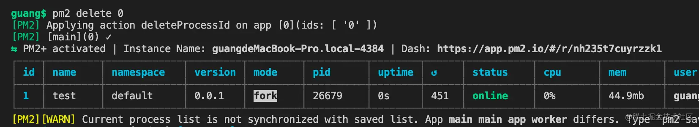

我们指定 1k 内存就重启：

    pm2 start xxx --max-memory-restart 1K

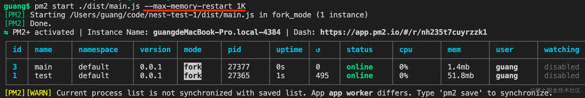

然后在 nest 代码里用超过 1k 的内存：

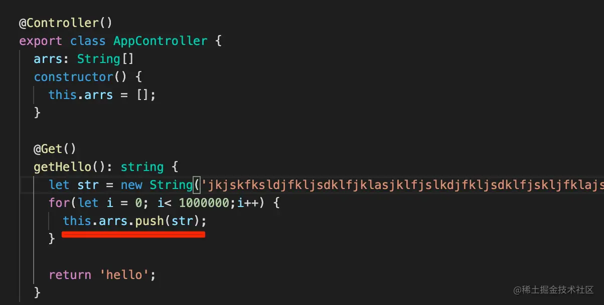

先把之前的日志清空，使用 pm2 flush 或者 pm2 flush 进程名|id

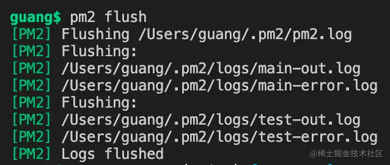

确实清空了：

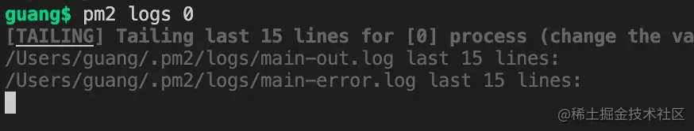

访问下这个 controller：


查看 main 进程的前 100 行日志：

    pm2 logs main --lines 100 

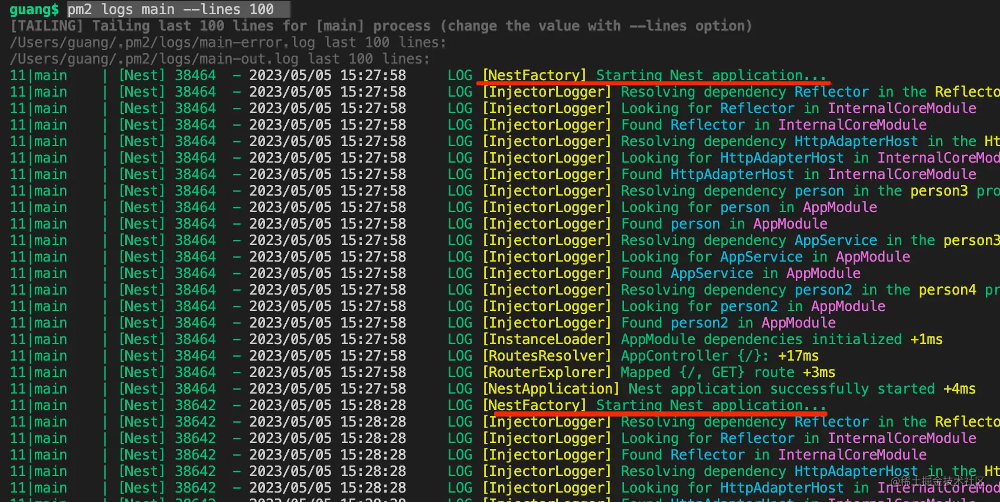

明显看到重启了。

这是超过内存的自动重启。

崩溃的自动重启、定时自动重启、文件变动自动重启等也是类似 。

我们前面用到的 pm2 start、pm2 stop、pm2 restart、pm2 delete 等就是进程管理的功能。

再就是负载均衡，node 应用是单进程的，而为了充分利用多核 cpu，我们会使用多进程来提高性能。

node 提供的 cluster 模块就是做这个的，pm2 就是基于这个实现了负载均衡。

我们只要启动进程的时候加上 -i num 就是启动 num 个进程做负载均衡的意思。

    pm2 start app.js -i max 
    pm2 start app.js -i 0

这俩是启动 cpu 数量的进程。

用多进程的方式跑 nest 应用：

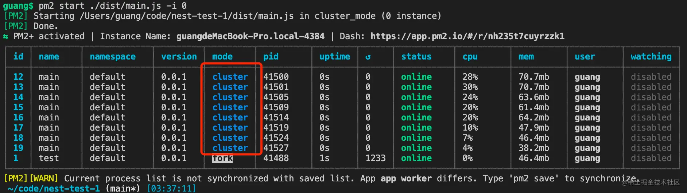

可以看到启动了 8 个进程，因为我是 8 核 cpu。

跑起来之后，还可以动态调整进程数，通过 pm2 scale：

    pm2 scale main 3

我把 main 的集群调整为 3 个进程：

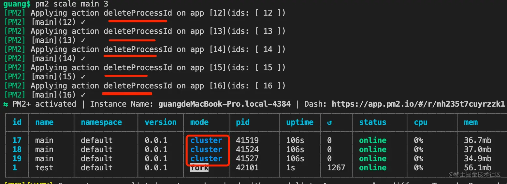

可以看到 pm2 删除了 5 个，留下了 3 个。

    pm2 scale main +3

我又加了 3 个，现在变成了 6 个：

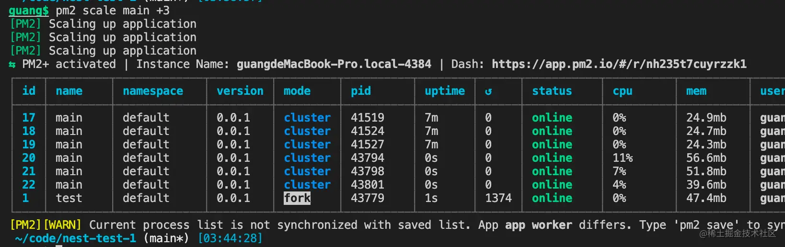

可以动态伸缩进程的数量，pm2 会把请求分配到不同进程上去。

这就是负载均衡功能。

此外，还有个性能监控功能，执行 pm2 monit:

    pm2 monit


可以看到不同进程的 cpu 和内存占用情况。

大概就是这些功能，但是当进程多了之后，难道都要手动通过命令行来启动么？

肯定不会每次都敲一遍。

pm2 支持配置文件的方式启动多个应用。

执行 pm2 ecosystem，会创建一个配置文件：

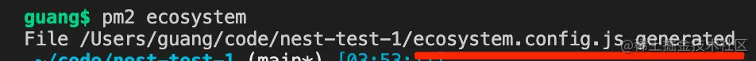

apps 部分就是配置应用的，scripts 就是应用的启动路径：

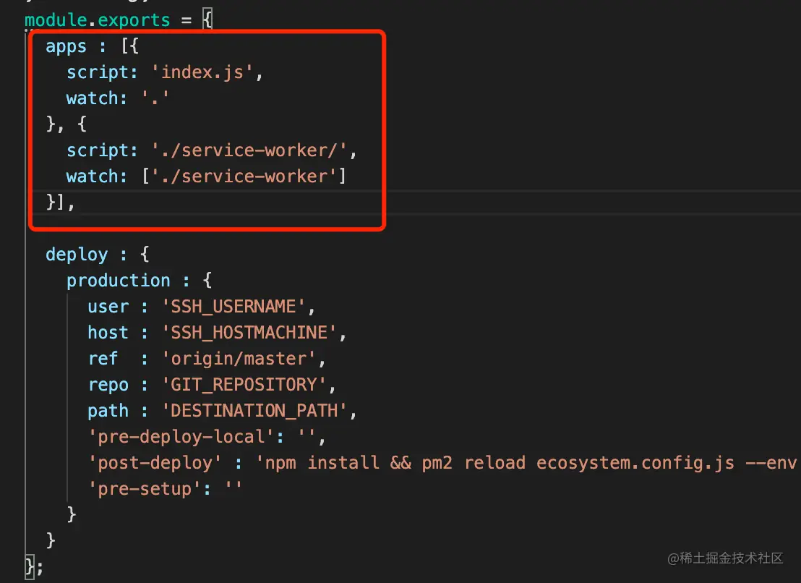

它可以指定的配置非常多，基本就是命令行有啥选项，这里就有啥属性：

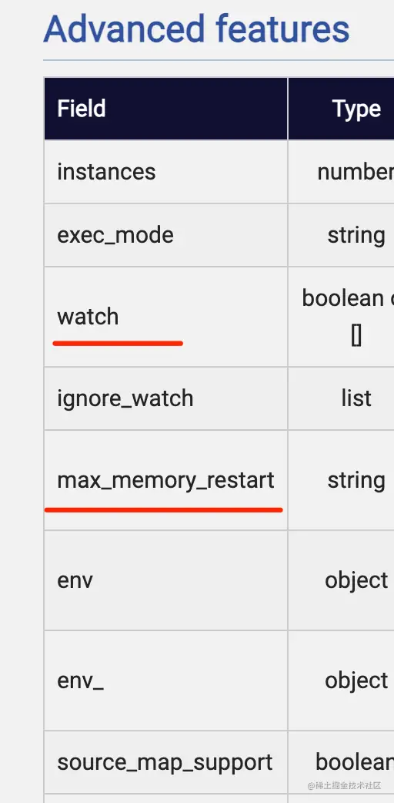

然后 pm2 start ecosystem.config.js 就可以批量跑一批应用。

就相当于 pm2 根据配置文件自动执行这些命令，不用我们手动敲了。

这样，我们就可以把启动的选项保存在配置文件里。

最后，还有个 pm2 plus，这个是收费功能，看看就行：

访问 pm2 的网站，登录，创建 bucket：

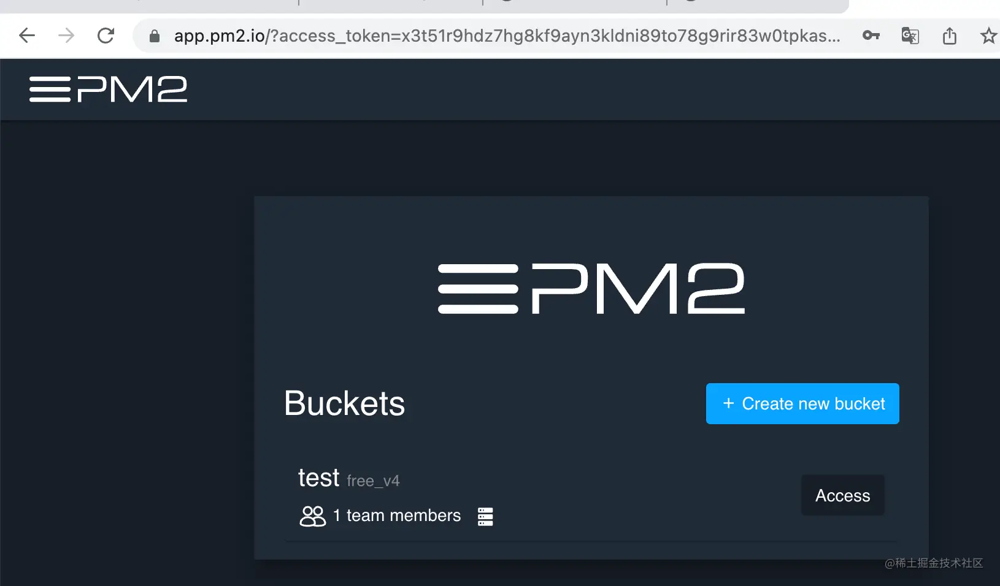

然后在本地执行 pm2 link xxx xxx，把本地的 pm2 和那个网站关联起来：

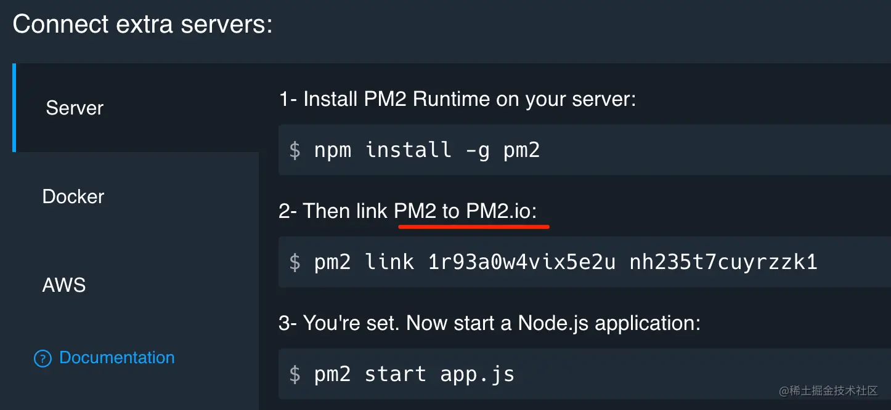

再执行 pm2 plus 就会打开 bucket 对应的网页：

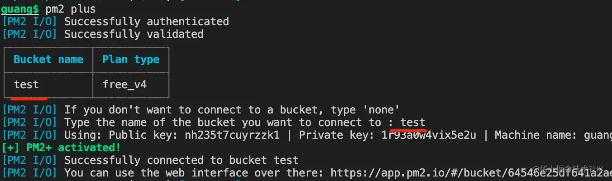

可以在线监控你的应用：

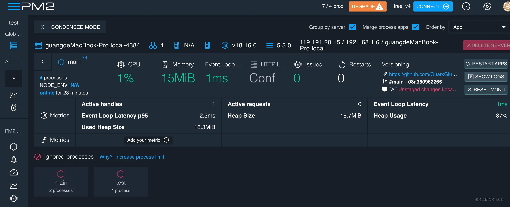

下面这些 plus 的功能都是收费的：

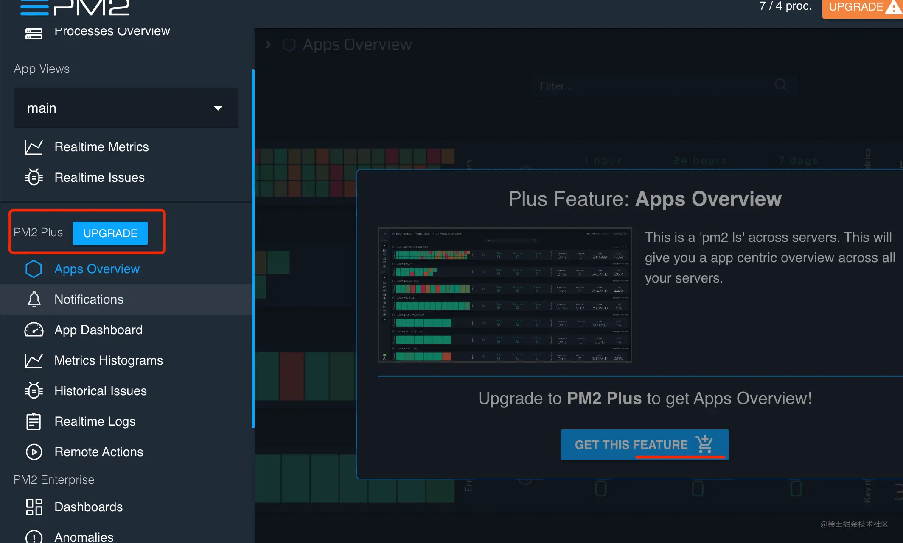

一般也不需要用，用免费的本地功能就好了。

有同学说，不都是 docker 部署了么？还需要 pm2 么？

当然需要了，万一 docker 容器内 node 服务崩溃了，是不是需要重启？

docker 容器内的进程同样有日志管理、进程管理和监控的需求。

一般都是 [docker 镜像](https://github.com/Unitech/pm2/blob/master/examples/docker-pm2/Dockerfile)内安装 pm2 来跑 node：

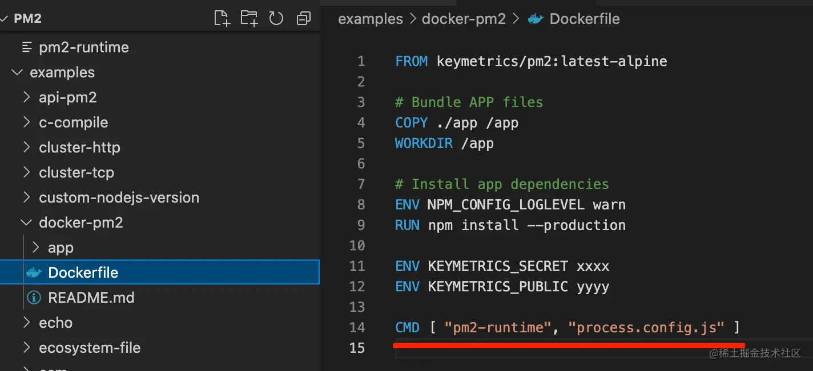

之前我们写的 Nest 的 dockerfile 是这样的：

```docker
# 44. 为什么 Node 应用要用 PM2 来跑？
FROM node:18 as build-stage

WORKDIR /app

COPY package.json .

RUN npm config set registry https://registry.npmmirror.com/

RUN npm install

COPY . .

RUN npm run build

# production stage
FROM node:18 as production-stage

COPY --from=build-stage /app/dist /app
COPY --from=build-stage /app/package.json /app/package.json

WORKDIR /app

RUN npm install --production

EXPOSE 3000

CMD ["node", "/app/main.js"]
```

现在要改成这样：

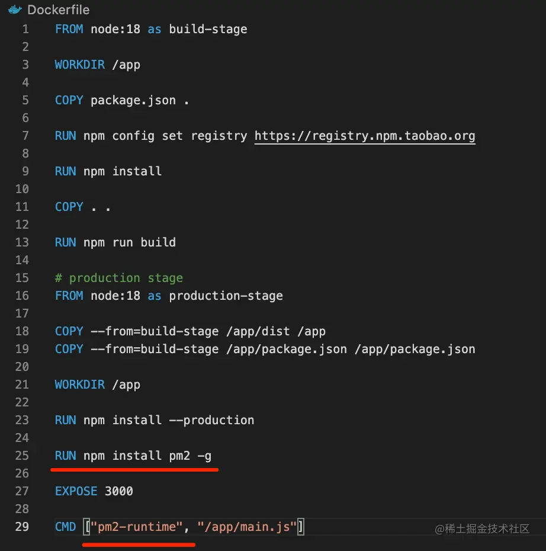

就是多装一个 pm2，然后用 pm2 代替 node 来跑。

我们 docker build 一下：

    docker build -t nest:ccc .

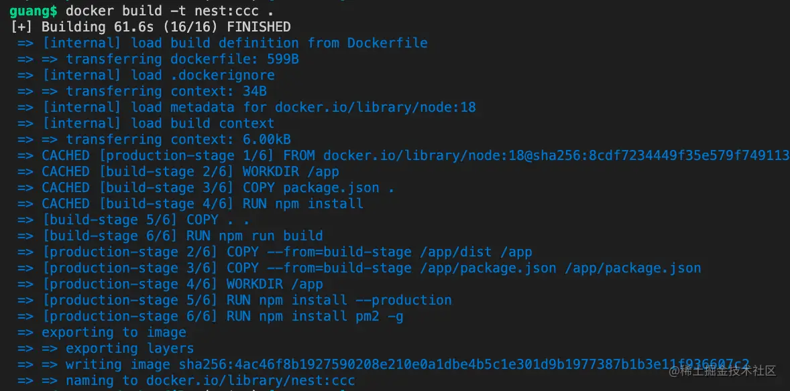

把它跑起来：

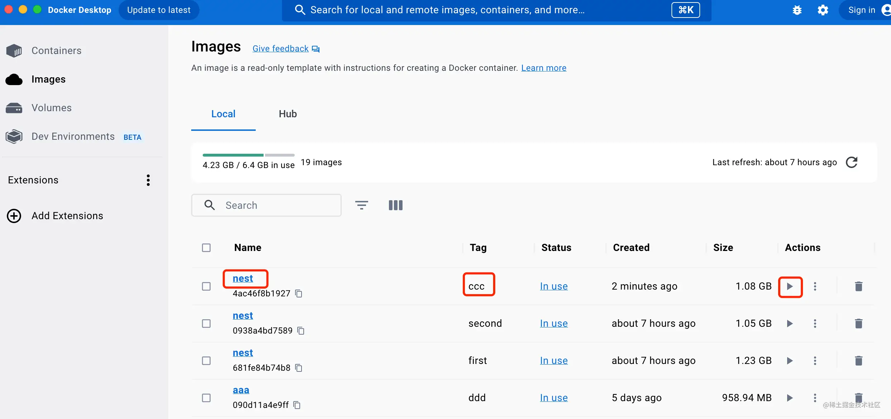

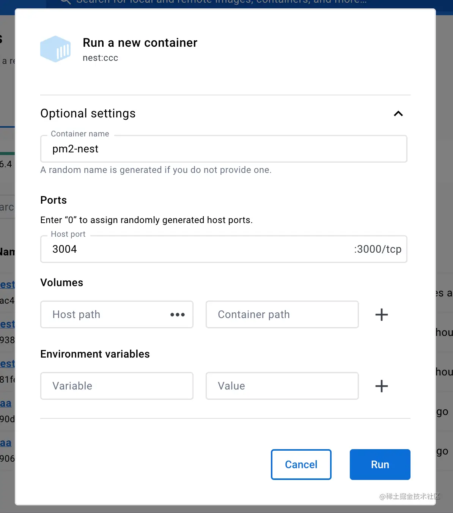


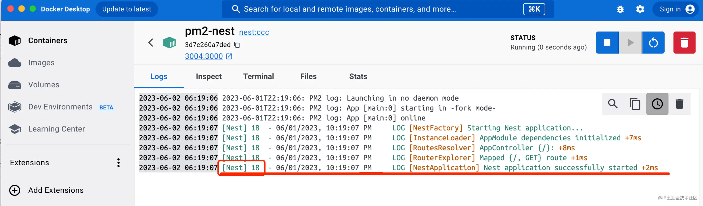

这个就是 pm2 打印的日志。

你可以在 terminal 使用 pm2 的命令：

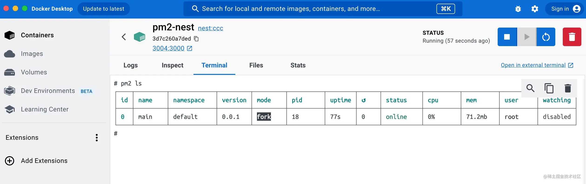

现在这个容器内的 node 进程在崩溃时就会自动重启。

## 总结

服务器上的 node 应用需要用 pm2 的日志管理、进程管理、负载均衡、性能监控等功能。

分别对应 pm2 logs、pm2 start/restart/stop/delete、pm2 start -i、pm2 monit 等命令。

多个应用或者想把启动选项保存下来的时候，可以通过 ecosystem 配置文件，批量启动一系列应用。

我们会把 docker 和 pm2 结合起来，在进程崩溃的时候让 pm2 来自动重启。

只要写 dockerfile 的时候多安装一个 pm2 的依赖，然后把 node 换成 pm2-runtime 就好了。

不管是出于稳定性、性能还是可观测性等目的，pm2 都是必不可少的。
