# 54. 快速掌握 TypeORM

上节我们简单用了下 TypeORM，这节我们把它全部的概念过一遍。

新建一个 TypeORM 项目：
```shell
npx typeorm@latest init --name typeorm-all-feature --database mysql
```
然后改下用户名密码数据库，把连接 msyql 的驱动包改为 mysql2，并修改加密密码的方式：

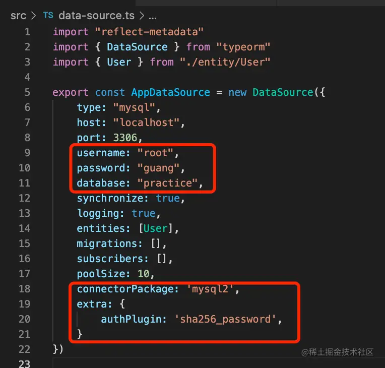

```typescript
import "reflect-metadata"
import { DataSource } from "typeorm"
import { User } from "./entity/User"

export const AppDataSource = new DataSource({
    type: "mysql",
    host: "localhost",
    port: 3306,
    username: "root",
    password: "guang",
    database: "practice",
    synchronize: true,
    logging: true,
    entities: [User],
    migrations: [],
    subscribers: [],
    poolSize: 10,
    connectorPackage: 'mysql2',
    extra: {
        authPlugin: 'sha256_password',
    }
})

```

然后安装 mysql2:
```shell
npm install --save mysql2
```
我们分别来过一遍这些配置：

type 是数据库的类型，因为 TypeORM 不只支持 MySQL 还支持 postgres、oracle、sqllite 等数据库。

host、port 是指定数据库服务器的主机和端口号。

user、password 是登录数据库的用户名和密码。

database 是要指定操作的 database，因为 mysql 是可以有多个 database 或者叫 schema 的。

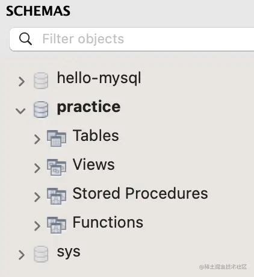

synchronize 是根据同步建表，也就是当 database 里没有和 Entity 对应的表的时候，会自动生成建表 sql 语句并执行。

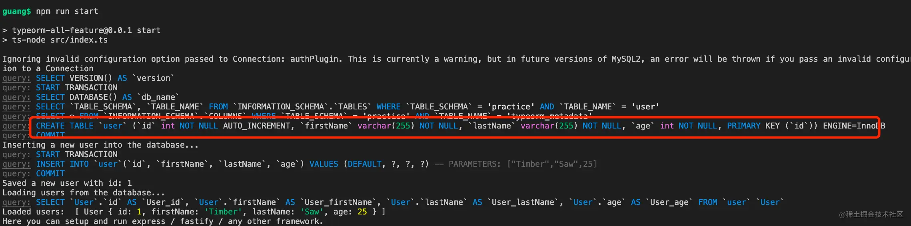

当然，如果有对应的表就不会创建了。

logging 是打印生成的 sql 语句。

entities 是指定有哪些和数据库的表对应的 Entity。

除了 class，还可以通过这种方式指定：

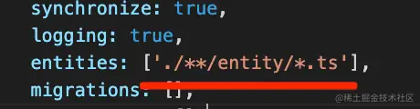

migrations 是修改表结构之类的 sql，暂时用不到，就不展开了。

subscribers 是一些 Entity 生命周期的订阅者，比如 insert、update、remove 前后，可以加入一些逻辑：

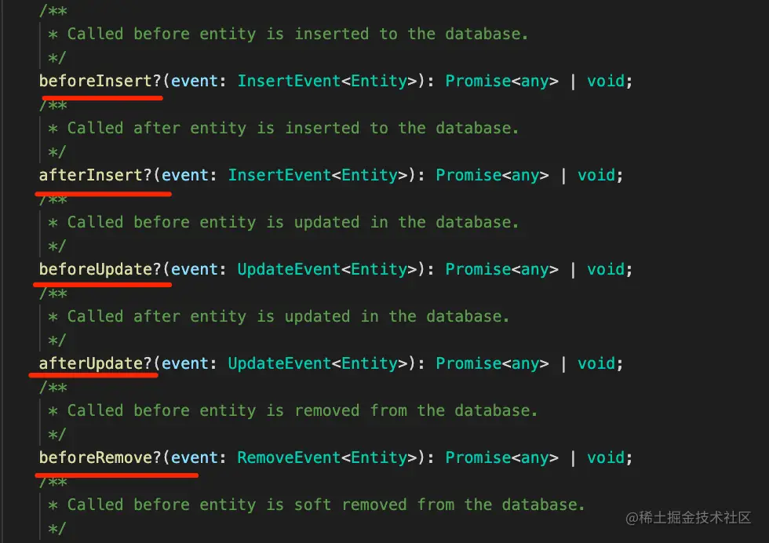

poolSize 是指定数据库连接池中连接的最大数量。

connectorPackage 是指定用什么驱动包。

extra 是额外发送给驱动包的一些选项。

这些配置都保存在 DataSource 里。

DataSource 会根据你传入的连接配置、驱动包，来创建数据库连接，并且如果指定了 synchronize 的话，会同步创建表。

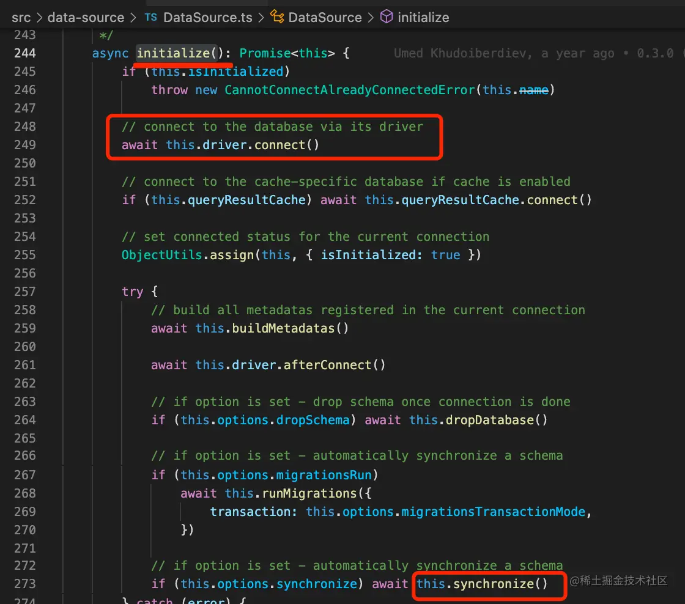

而创建表的依据就是 Entity：

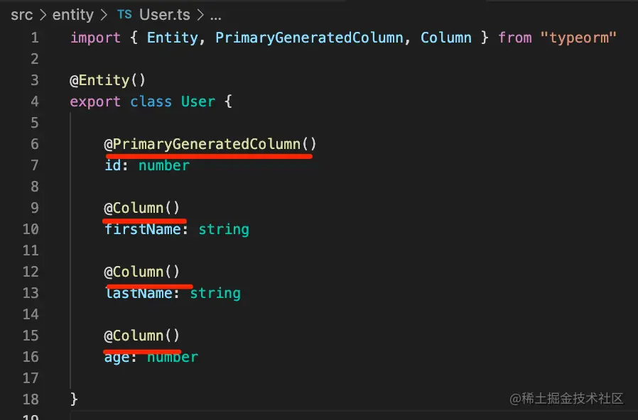

跑一下：
```
npm run start
```
比如这个 Entity 就会执行这样的 sql：

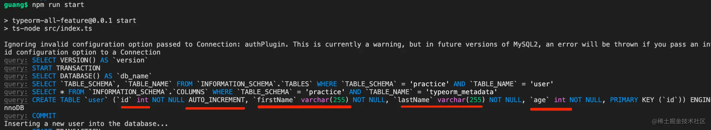

主键为 INT 自增、firstName 和 lastName 是 VARCHAR(255)，age 是 INT。

这是默认的映射关系。

那如果我 number 不是想映射到 INT 而是 DOUBLE 呢？

或者如果 string 不是想映射到 VARCHAR(255)，而是 TEXT （长文本）呢？

这样映射：

```javascript
import { Entity, PrimaryGeneratedColumn, Column } from "typeorm"

@Entity({
    name: 't_aaa'
})
export class Aaa {

    @PrimaryGeneratedColumn({
        comment: '这是 id'
    })
    id: number

    @Column({
        name: 'a_aa',
        type: 'text',
        comment: '这是 aaa'
    })
    aaa: string

    @Column({
        unique: true,
        nullable: false,
        length: 10,
        type: 'varchar',
        default: 'bbb'
    })
    bbb: string

    @Column({
        type: 'double',
    })
    ccc: number
}

```

我们新增了一个 Entity Aaa。

@Entity 指定它是一个 Entity，name 指定表名为 t\_aaa。

@PrimaryGeneratedColumn 指定它是一个自增的主键，通过 comment 指定注释。

@Column 映射属性和字段的对应关系。

通过 name 指定字段名，type 指定映射的类型，length 指定长度，default 指定默认值。

nullable 设置 NOT NULL 约束，unique 设置 UNIQUE 唯一索引。

type 这里指定的都是数据库里的数据类型。

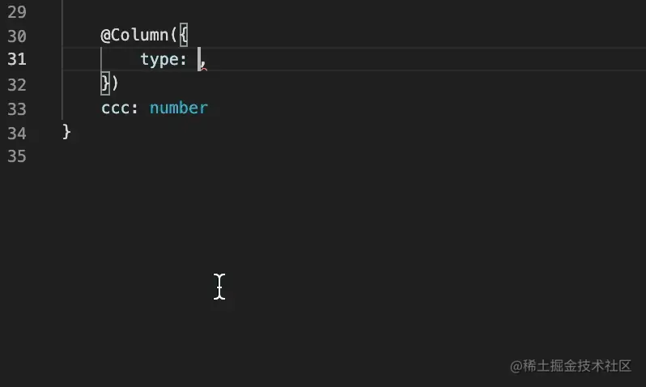

然后在 DataSource 的 entities 里引入下：

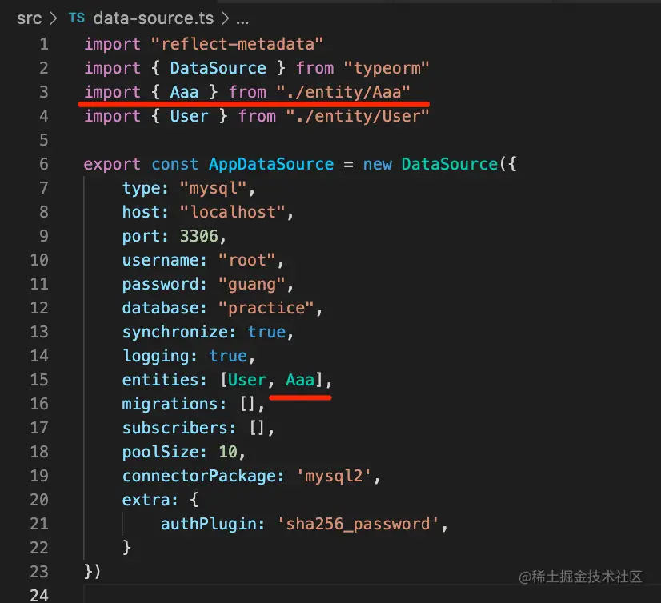

重新跑 npm run start。

生成建表 sql 是这样的：

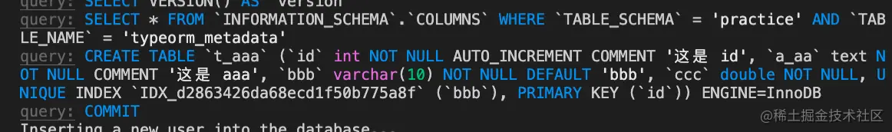

格式化一下：

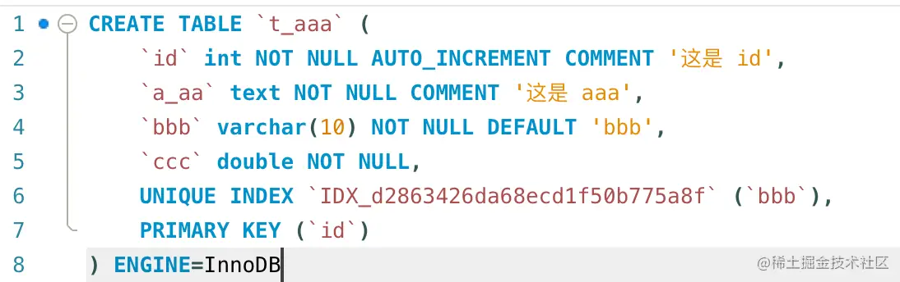

对比着 Entity 看下：

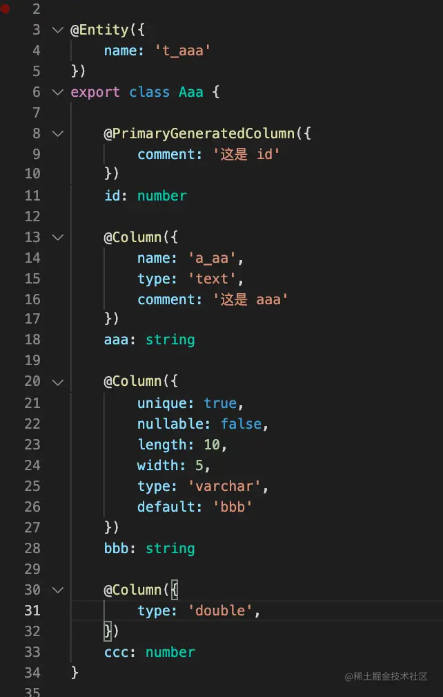

是不是就明白怎么映射了？

在 mysql workbench 里看下，确实生成了这个表：

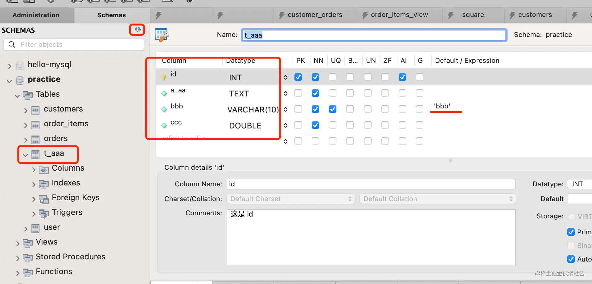

表创建好了，接下来就是增删改查了。

在 index.ts 里创建个 user 对象，然后调用 AppDataSource.manager.save 来保存：

```javascript
import { AppDataSource } from "./data-source"
import { User } from "./entity/User"

AppDataSource.initialize().then(async () => {

    const user = new User()
    user.firstName = "aaa"
    user.lastName = "bbb"
    user.age = 25

    await AppDataSource.manager.save(user)

}).catch(error => console.log(error))
```

删除 User 表重新跑 npm run start。

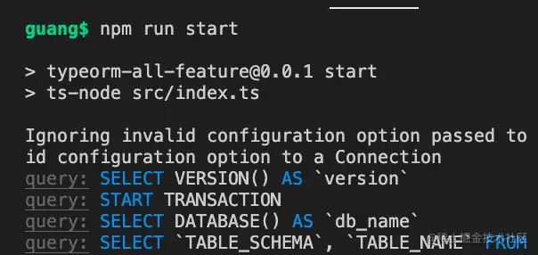

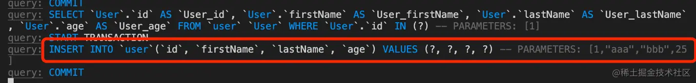

可以看到数据库插入了这条记录：

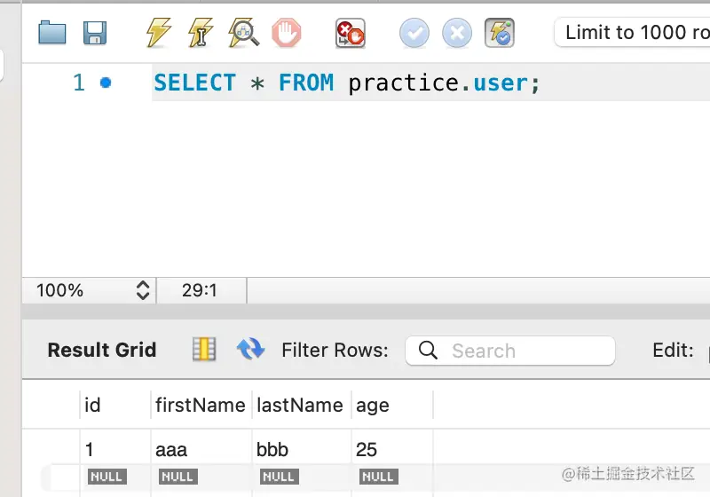

如果你指定了 id，那就变成修改了：

```javascript
import { AppDataSource } from "./data-source"
import { User } from "./entity/User"

AppDataSource.initialize().then(async () => {

    const user = new User()
    user.id = 1;
    user.firstName = "aaa111"
    user.lastName = "bbb"
    user.age = 25

    await AppDataSource.manager.save(user)

}).catch(error => console.log(error))
```

重新跑下 npm run start。

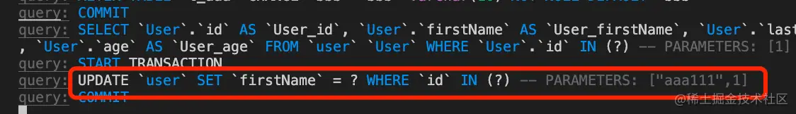

可以看到，生成的 sql 语句变成了 select 和 update：

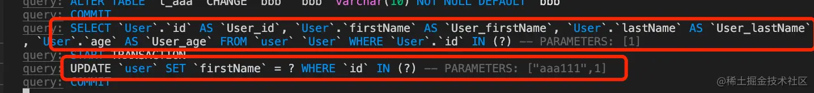

当你指定了 id 的时候，typeorm 会先查询这个 id 的记录，如果查到了，那就执行 update。

在 mysql workbench 里看下：

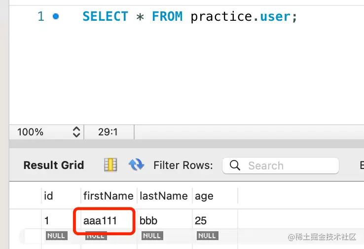

确实修改了。

那如果想批量插入和修改呢？

这样写：

```javascript
import { AppDataSource } from "./data-source"
import { User } from "./entity/User"

AppDataSource.initialize().then(async () => {

    await AppDataSource.manager.save(User, [
        { firstName: 'ccc', lastName: 'ccc', age: 21},
        { firstName: 'ddd', lastName: 'ddd', age: 22},
        { firstName: 'eee', lastName: 'eee', age: 23}
    ]);


}).catch(error => console.log(error))

```

我们 npm run start 跑一下：

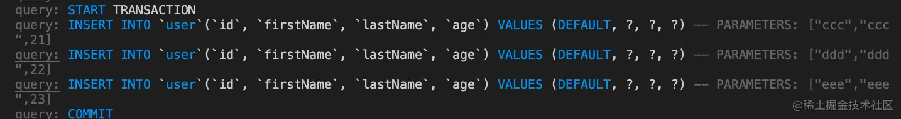

可以看到确实生成了 3 条 insert into 的 sql 语句。

数据库中也能看到：

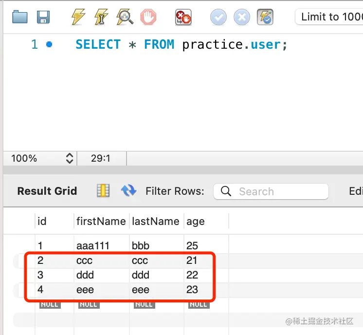

批量修改也很容易想到，是这样写：

```javascript
import { AppDataSource } from "./data-source"
import { User } from "./entity/User"

AppDataSource.initialize().then(async () => {

    await AppDataSource.manager.save(User, [
        { id: 2 ,firstName: 'ccc111', lastName: 'ccc', age: 21},
        { id: 3 ,firstName: 'ddd222', lastName: 'ddd', age: 22},
        { id: 4, firstName: 'eee333', lastName: 'eee', age: 23}
    ]);

}).catch(error => console.log(error))

```

执行 npm run start，会看到一条 select 语句， 3 条 update 语句：

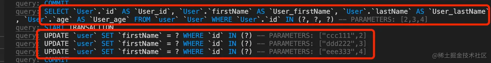

在 workbench 里也可以看到数据被修改了：

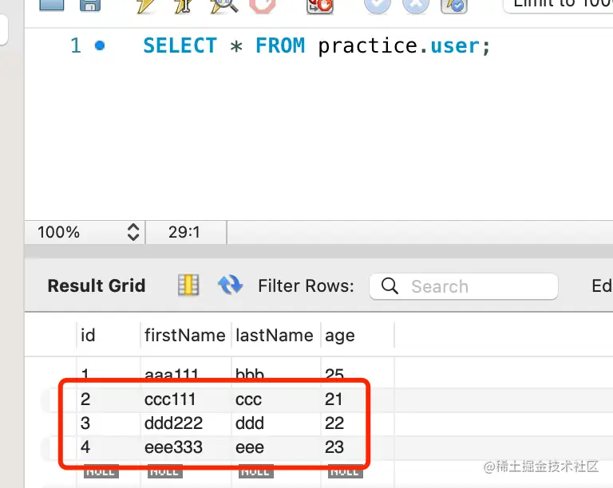

这就是 typeorm 里新增和修改的方式，使用 save 方法。

其实 EntityManager 还有 update 和 insert 方法，分别是修改和插入的，但是它们不会先 select 查询一次。而 save 方法会先查询一次数据库来确定是插入还是修改。

删除和批量删除用 delete 方法：

```javascript
import { AppDataSource } from "./data-source"
import { User } from "./entity/User"

AppDataSource.initialize().then(async () => {

    await AppDataSource.manager.delete(User, 1);
    await AppDataSource.manager.delete(User, [2,3]);

}).catch(error => console.log(error))

```

执行下：

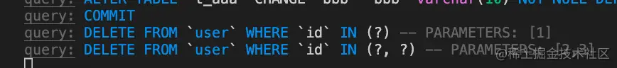

数据库了对应记录就被删除了：

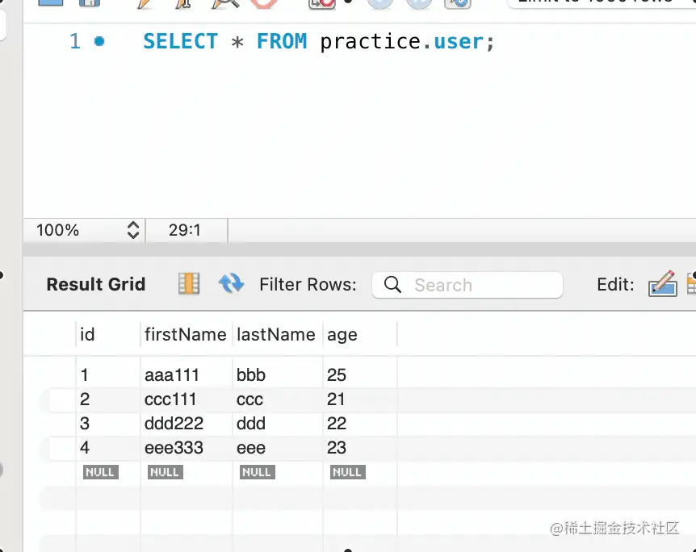

这里也可以用 remove 方法：

```javascript
import { AppDataSource } from "./data-source"
import { User } from "./entity/User"

AppDataSource.initialize().then(async () => {

    const user = new User();
    user.id = 1;

    await AppDataSource.manager.remove(User, user);

}).catch(error => console.log(error))
```
**delete 和 remove 的区别是，delete 直接传 id、而 remove 则是传入 entity 对象。**

而查询是使用 find 方法：

先插入几条数据：

```javascript
await AppDataSource.manager.save(User, [
    { firstName: 'ccc', lastName: 'ccc', age: 21},
    { firstName: 'ddd', lastName: 'ddd', age: 22},
    { firstName: 'eee', lastName: 'eee', age: 23}
]);
```

再查一下：

```javascript
import { AppDataSource } from "./data-source"
import { User } from "./entity/User"

AppDataSource.initialize().then(async () => {
    const users = await AppDataSource.manager.find(User);
    console.log(users);
    
}).catch(error => console.log(error))

```

控制台打印了查询出的数据：

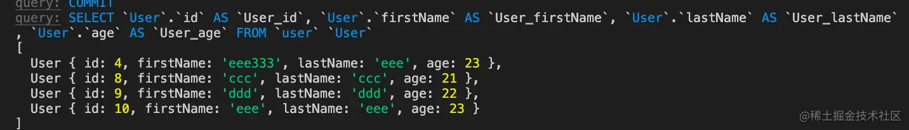

也可以通过 findBy 方法根据条件查询：

```javascript
import { In } from "typeorm";
import { AppDataSource } from "./data-source"
import { User } from "./entity/User"

AppDataSource.initialize().then(async () => {
    const users = await AppDataSource.manager.findBy(User, {
        age: 23
    });
    console.log(users);
   
}).catch(error => console.log(error))
```

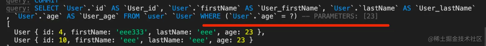

此外，你还可以用 findAndCount 来拿到有多少条记录：

```javascript
import { AppDataSource } from "./data-source"
import { User } from "./entity/User"

AppDataSource.initialize().then(async () => {
    const [users, count] = await AppDataSource.manager.findAndCount(User);
    console.log(users, count);

}).catch(error => console.log(error))

```

会额外执行一个统计的 sql：

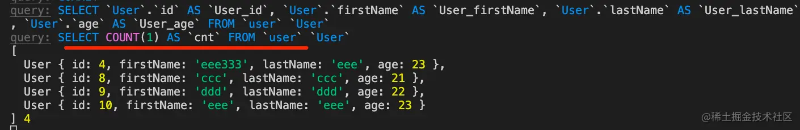

count 是可以指定条件的：

```javascript
import { AppDataSource } from "./data-source"
import { User } from "./entity/User"

AppDataSource.initialize().then(async () => {
    const [users, count] = await AppDataSource.manager.findAndCountBy(User, {
        age: 23
    })
    console.log(users, count);

}).catch(error => console.log(error))
```

可以看到，生成的 sql 里多了一个 where 条件：

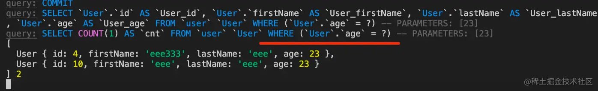

除了可以查询多条，还可以查询一条，使用 findOne：

```javascript
import { AppDataSource } from "./data-source"
import { User } from "./entity/User"

AppDataSource.initialize().then(async () => {
    const user = await AppDataSource.manager.findOne(User, {
        select: {
            firstName: true,
            age: true
        },
        where: {
            id: 4
        },
        order: {
            age: 'ASC'
        }
    });
    console.log(user);

}).catch(error => console.log(error))
```

指定查询的 where 条件是 id 为 4 ，指定 select 的列为 firstName 和 age，然后 order 指定根据 age 升序排列。

查询结果如下:

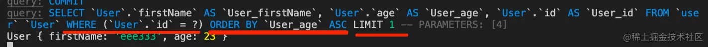

findOne 只是比 find 多加了个 LIMIT 1，其余的都一样。

```javascript
import { In } from "typeorm";
import { AppDataSource } from "./data-source"
import { User } from "./entity/User"

AppDataSource.initialize().then(async () => {

    const users = await AppDataSource.manager.find(User, {
        select: {
            firstName: true,
            age: true
        },
        where: {
            id: In([4, 8])
        },
        order: {
            age: 'ASC'
        }
    });
    console.log(users);

}).catch(error => console.log(error))
```

把它改为 find，id 改为 In(\[4, 8]) 之后，结果如下：

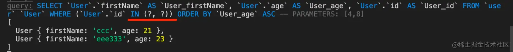

通过 findOneBy 也可以：

```javascript
import { AppDataSource } from "./data-source"
import { User } from "./entity/User"

AppDataSource.initialize().then(async () => {
    const user = await AppDataSource.manager.findOneBy(User, {
        age: 23
    });
    console.log(user);

}).catch(error => console.log(error))

```

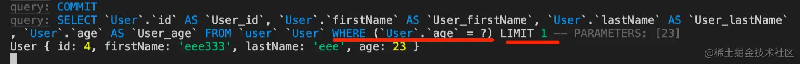

此外，findOne 还有两个特殊的方法：

```javascript
import { AppDataSource } from "./data-source"
import { User } from "./entity/User"

AppDataSource.initialize().then(async () => {
    try {
        const user = await AppDataSource.manager.findOneOrFail(User, {
            where: {
                id: 666
            }
        });
        console.log(user);
    }catch(e) {
        console.log(e);
        console.log('没找到该用户');
    }

}).catch(error => console.log(error))
```

findOneOrFail 或者 findOneByOrFail，如果没找到，会抛一个 EntityNotFoundError 的异常：

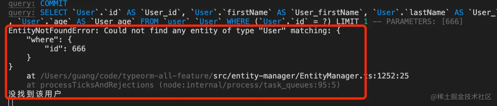

此外，你还可以用 query 方法直接执行 sql 语句：

```javascript
import { AppDataSource } from "./data-source"

AppDataSource.initialize().then(async () => {

    const users = await AppDataSource.manager.query('select * from user where age in(?, ?)', [21, 22]);
    console.log(users);

}).catch(error => console.log(error))
```

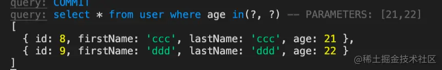

但复杂 sql 语句不会直接写，而是会用 query builder：

```javascript
const queryBuilder = await AppDataSource.manager.createQueryBuilder();

const user = await queryBuilder.select("user")
    .from(User, "user")
    .where("user.age = :age", { age: 21 })
    .getOne();

console.log(user);
```

生成的 sql 语句如下：

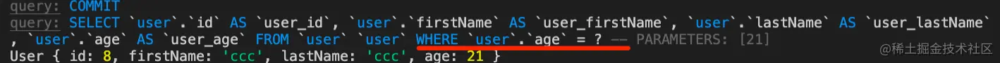

有同学说，用 query builder 和我用 find 指定 where 有什么区别么？

比如这种复杂的关联查询：

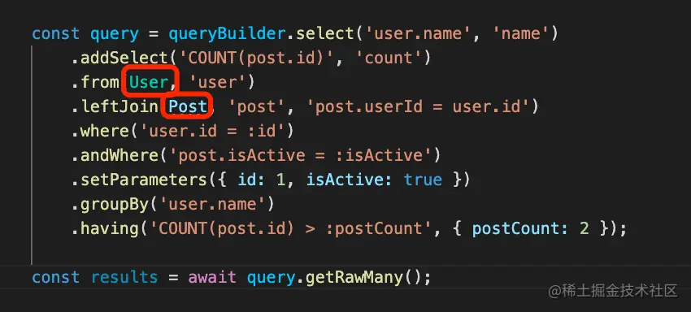

涉及到多个表，也就是多个 Entity 的关联查询，就得用 query builder 了。

简单点查询直接 find 指定 where 条件就行。

此外，多条有关联的数据的增删改都离不开事务，怎么开启事务呢？

用 transaction 方法包裹下就好了。

```javascript
await AppDataSource.manager.transaction(async manager => {
    await manager.save(User, {
        id: 4,
        firstName: 'eee',
        lastName: 'eee',
        age: 20
    });
});
```

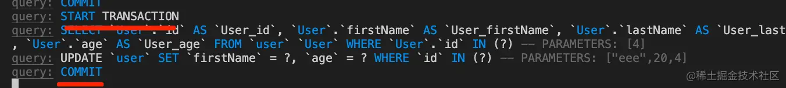

还有，调用每个方法的时候都要先传入实体类，这也太麻烦了：

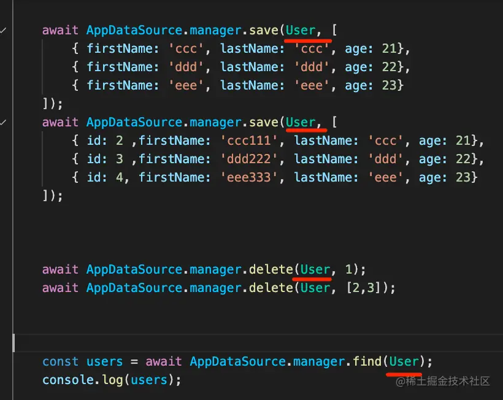

有没有什么简便方法呢？

有，可以先调用 getRepository 传入 Entity，拿到专门处理这个 Entity 的增删改查的类，再调用这些方法：

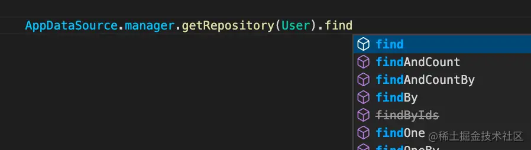

具体的方法和 EntityManager 是一样的。

案例代码在[小册仓库](https://github.com/QuarkGluonPlasma/nestjs-course-code/tree/main/typeorm-all-feature)。

## 总结

我们过了一遍 TypeORM 的各种概念，画个图总结下：

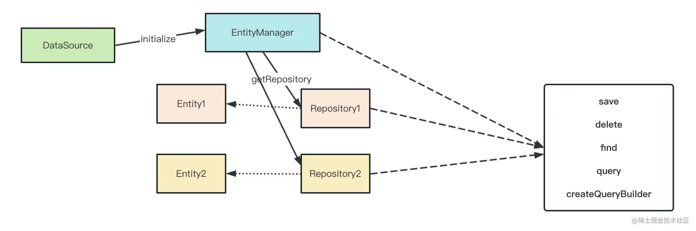

DataSource 里管理着数据库连接配置，数据库驱动包，调用它的 intialize 方法会创建和 mysql 的连接。

连接创建的时候，如果指定了 synchronize，会根据 Entitiy 生成建表 sql。

Entity 里通过 @Entity 指定和数据库表的映射，通过 @PrimaryGeneratedColumn 和 @Column 指定和表的字段的映射。

对 Entity 做增删改查通过 EntityManager 的 save、delete、find、createQueryBuilder 等方法。

如果只是对单个 Entity 做 CRUD，那可以先 getRepository 拿到对具体 Entity 操作的工具类，再调用 save、delete、find 等方法。

具体的 EntityManager 和 Repository 的方法有这些：

*   save：新增或者修改 Entity，如果传入了 id 会先 select 再决定修改还新增
*   update：直接修改 Entity，不会先 select
*   insert：直接插入 Entity
*   delete：删除 Entity，通过 id
*   remove：删除 Entity，通过对象
*   find：查找多条记录，可以指定 where、order by 等条件
*   findBy：查找多条记录，第二个参数直接指定 where 条件，更简便一点
*   findAndCount：查找多条记录，并返回总数量
*   findByAndCount：根据条件查找多条记录，并返回总数量
*   findOne：查找单条记录，可以指定 where、order by 等条件
*   findOneBy：查找单条记录，第二个参数直接指定 where 条件，更简便一点
*   findOneOrFail：查找失败会抛 EntityNotFoundError 的异常
*   query：直接执行 sql 语句
*   createQueryBuilder：创建复杂 sql 语句，比如 join 多个 Entity 的查询
*   transaction：包裹一层事务的 sql
*   getRepository：拿到对单个 Entity 操作的类，方法同 EntityManager

这些概念和 api 在后面会经常用到，需要理解它们各自都是干啥的。
