# 57. TypeORM 多对多的映射和关联 CRUD

一对一我们是通过 @OneToOne 和 @JoinColumn 来把 Entity 映射成数据库表：

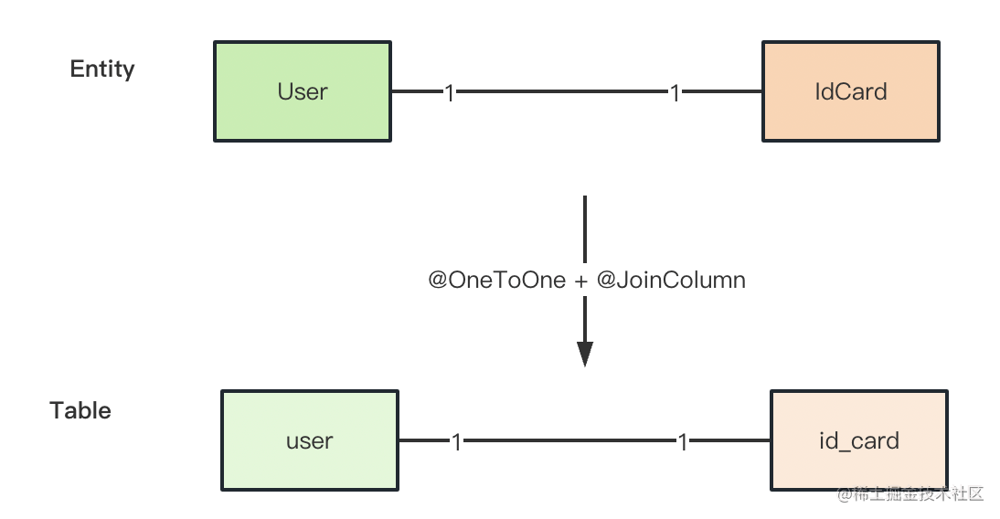

Entity 之间的引用关系，转换为数据库表之间的外键关联的关系。

一对多我们是通过 @OneToMany 和 @ManyToOne 来把 Entity 映射成数据库表：

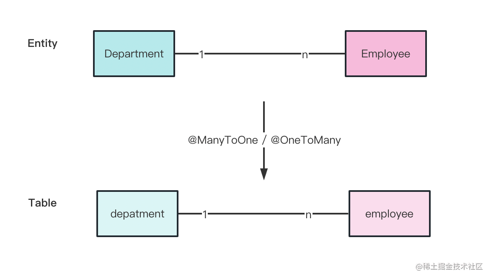

它并不需要 @JoinColumn 来指定外键列，因为外键一定在多的那一边。

那多对多呢？

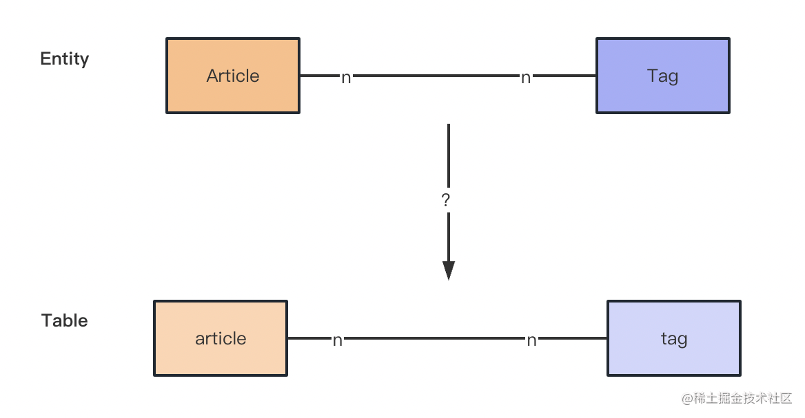

前面讲过，在数据库里，我们是通过中间表来保存这种多对多的关系的：

把多对多拆成了两个一对多：

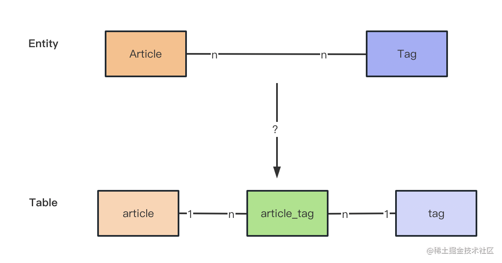

那在 TypeORM 里如何映射这种关系呢？

我们新建个项目试一下：

    npx typeorm@latest init --name typeorm-relation-mapping3 --database mysql

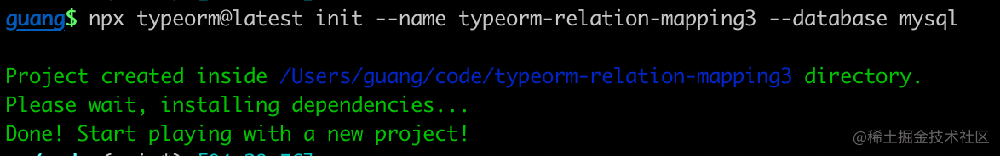

进入项目目录，安装驱动包 mysql2：

    npm install mysql2

然后修改 data-source.ts 的配置：

```javascript
import "reflect-metadata"
import { DataSource } from "typeorm"
import { User } from "./entity/User"

export const AppDataSource = new DataSource({
    type: "mysql",
    host: "localhost",
    port: 3306,
    username: "root",
    password: "guang",
    database: "typeorm_test",
    synchronize: true,
    logging: true,
    entities: [User],
    migrations: [],
    subscribers: [],
    poolSize: 10,
    connectorPackage: 'mysql2',
    extra: {
        authPlugin: 'sha256_password',
    }
})
```

这次我们创建 Article 和 Tag 两个实体：

    npx typeorm entity:create src/entity/Article
    npx typeorm entity:create src/entity/Tag

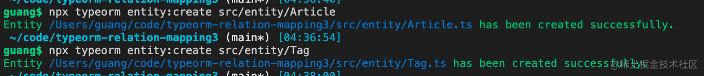

添加一些属性：

```javascript
import { Column, Entity, PrimaryGeneratedColumn } from "typeorm"

@Entity()
export class Article {

    @PrimaryGeneratedColumn()
    id: number;

    @Column({
        length: 100,
        comment: '文章标题'
    })
    title: string;

    @Column({
        type: 'text',
        comment: '文章内容'
    })
    content: string;
}
```

```javascript
import { Column, Entity, PrimaryGeneratedColumn } from "typeorm"

@Entity()
export class Tag {

    @PrimaryGeneratedColumn()
    id: number;

    @Column({
        length: 100
    })
    name: string;
}
```

然后在 data-source.ts 里引入这俩 Entity：


把 index.ts 的代码去掉：


然后 npm run start

可以看到它生成了两个 Entity 的建表 sql：

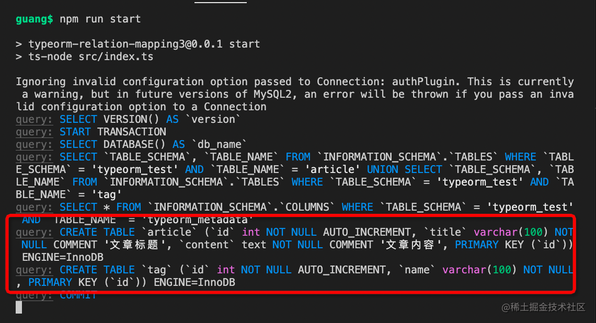

然后把这两个表删掉，我们来添加多对多的关联关系：

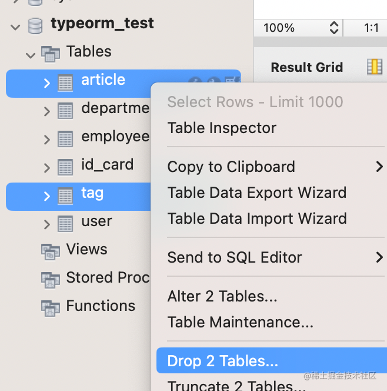

在 Entity 里通过 @ManyToMany 关联。

比如一篇文章可以有多个标签：

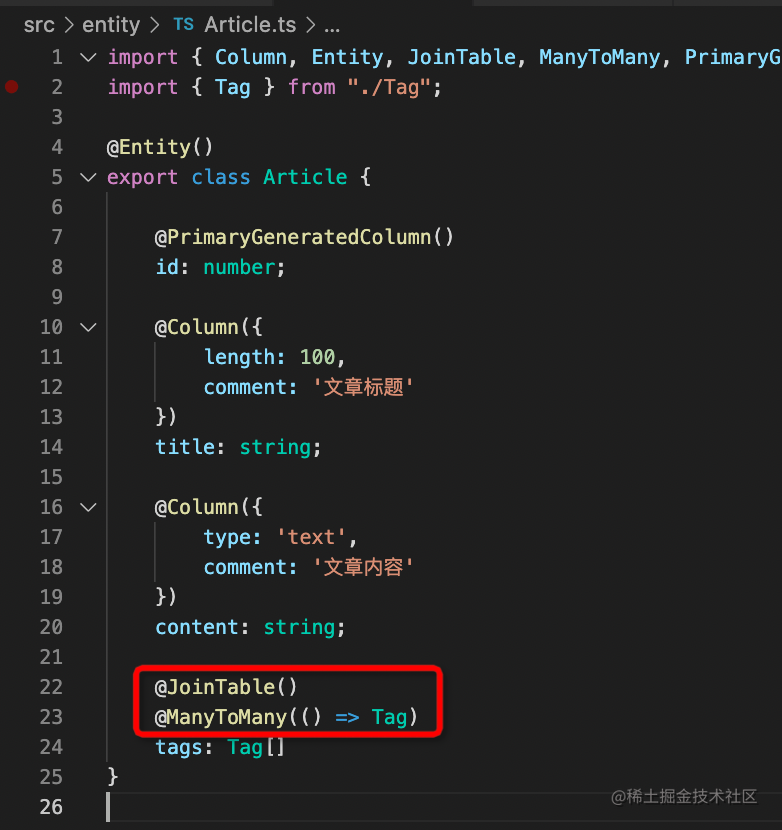

然后再 npm run start

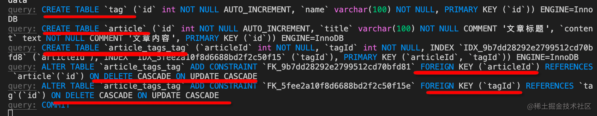

你会看到 3 条建表 sql，分别是 article、tag 和中间表 article\_tags\_tag

并且 article\_tags\_tag 还有 2 个外键分别引用着两个表。

级联删除和级联更新都是 CASCADE，也就是说这两个表的记录删了，那它在中间表中的记录也会跟着被删。

就这样就映射成功了。

你也可以自己指定中间表的名字：

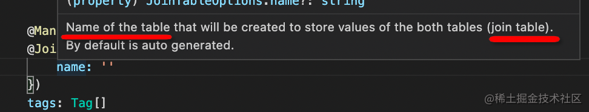

我们插入点数据试试：

```javascript
import { AppDataSource } from "./data-source"
import { Article } from "./entity/Article"
import { Tag } from "./entity/Tag";

AppDataSource.initialize().then(async () => {

    const a1 = new Article();
    a1.title = 'aaaa';
    a1.content = 'aaaaaaaaaa';

    const a2 = new Article();
    a2.title = 'bbbbbb';
    a2.content = 'bbbbbbbbbb';

    const t1 = new Tag();
    t1.name = 'ttt1111';

    const t2 = new Tag();
    t2.name = 'ttt2222';

    const t3 = new Tag();
    t3.name = 'ttt33333';

    a1.tags = [t1,t2];
    a2.tags = [t1,t2,t3];

    const entityManager = AppDataSource.manager;

    await entityManager.save(t1);
    await entityManager.save(t2);
    await entityManager.save(t3);

    await entityManager.save(a1);
    await entityManager.save(a2);

}).catch(error => console.log(error))
```

创建了两篇文章，3 个标签，建立它们的关系之后，先保存所有的 tag，再保存 article。

跑一下：

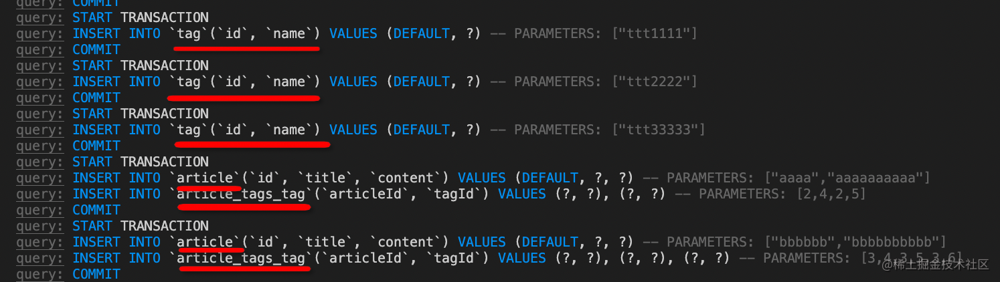

可以看到，3 个标签、2 篇文章，还有两者的关系，都插入成功了。

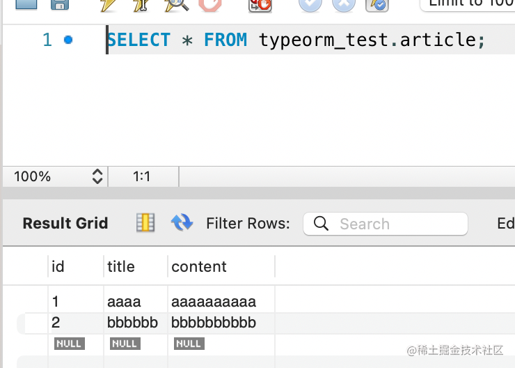

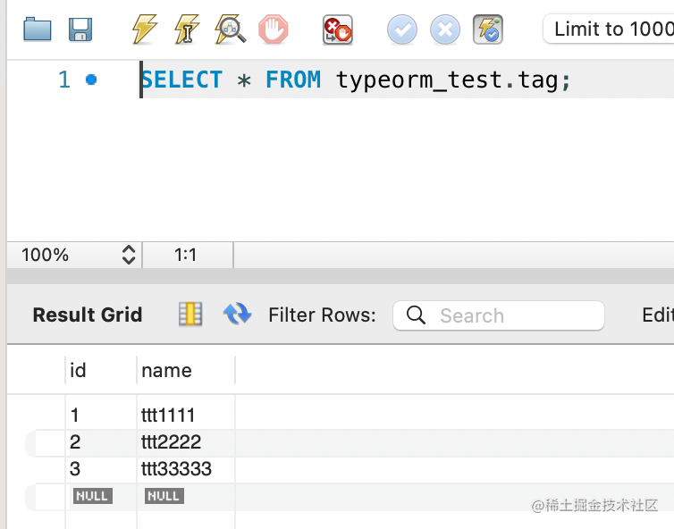

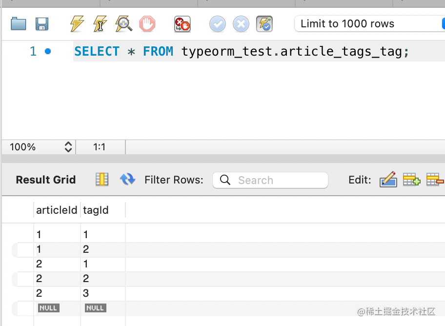

再来查询：

```javascript
const article = await entityManager.find(Article, {
    relations: {
        tags: true
    }
});

console.log(article);
console.log(article.map(item=> item.tags))
```

同样是通过 relations 指定关联查询：

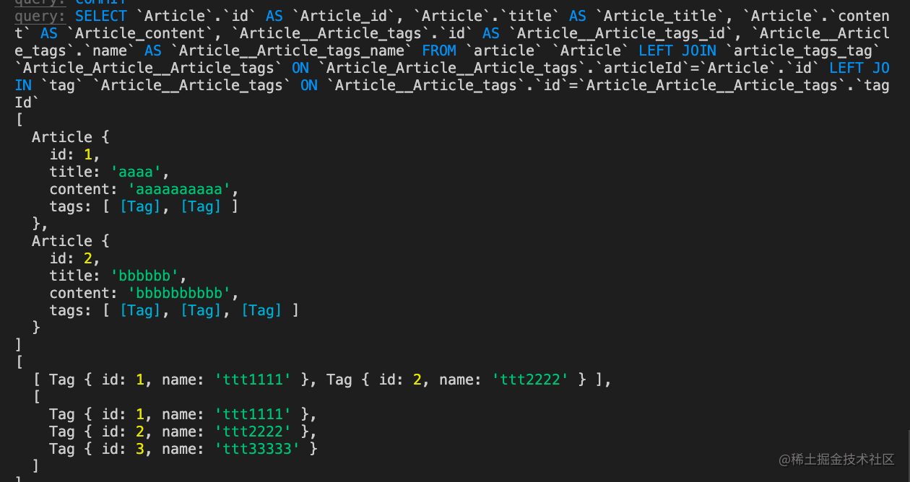

也可以手动用 query builder 来 join 查询：

```javascript
const article = await entityManager
    .createQueryBuilder(Article, "a")
    .leftJoinAndSelect("a.tags", "t")
    .getMany()
    
console.log(article);
console.log(article.map(item=> item.tags))
```

结果一样：

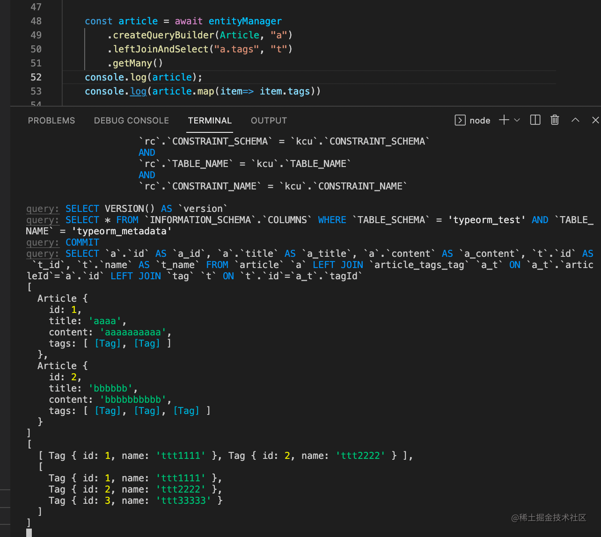

或者先拿到 Article 的 Repository 再创建 query builder 来查询也行：

```javascript
const article = await entityManager
    .getRepository(Article)
    .createQueryBuilder( "a")
    .leftJoinAndSelect("a.tags", "t")
    .getMany()

console.log(article);
console.log(article.map(item=> item.tags))
```

那如果文章多加了一些标签或者删除了一些标签，怎么修改呢？

比如我把 id 为 2 的文章的标签只保留包含 111 的，并且还改了标题：

```javascript
const article = await entityManager.findOne(Article, {
    where: {
        id: 2
    },
    relations: {
        tags: true
    }
});

article.title = "ccccc";

article.tags = article.tags.filter(item => item.name.includes('ttt111'));

await entityManager.save(article);
```

之前它是有 3 个标签的：

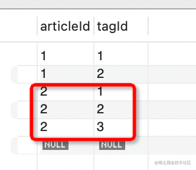

npm run start 跑一下：

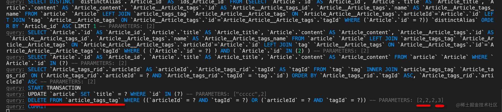

它会先查出 id 为 2 的 article 有哪些标签，查出了 1、2、3。

然后会把他和 id 为 2 的 article 的关系，(2, 2) (2, 3) 从中间表中删除。

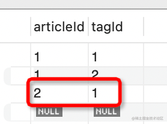

这样就这个 article 就只有 id 为 1 的 tag 了。

此外，更新 article.title 的是另一个 update 语句：

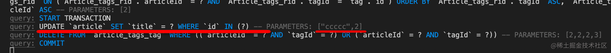

至于删除就简单了，因为中间表的外键设置了 CASCADE 的级联删除，这样只要你删除了 article 或者 tag，它都会跟着删除关联记录。

```javascript
await entityManager.delete(Article, 1);
await entityManager.delete(Tag, 1);
```

如果 tag 里也想有文章的引用呢？

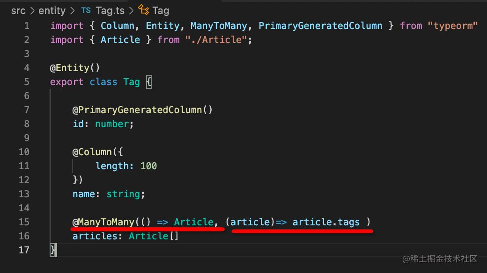

那就加一个 @ManyToMany 的映射属性。

只不过它还需要第二个参数指定外键列在哪里。

而且不止这里要加，article 里也要加：

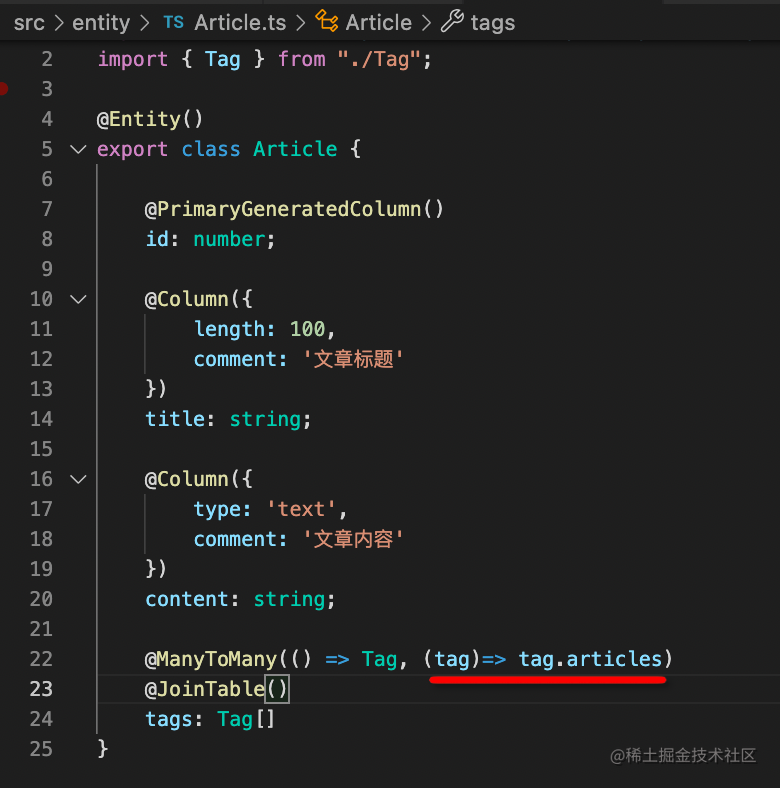

为什么呢？

因为如果当前 Entity 对应的表是包含外键的，那它自然就知道怎么找到关联的 Entity。

但如果当前 Entity 是不包含外键的那一方，怎么找到对方呢？

这时候就需要手动指定通过哪个外键列来找当前 Entity 了。

之前 OneToOne、OnToMany 都是这样：

比如一对一的 user 那方，不维护外键，所以需要第二个参数来指定通过哪个外键找到 user。

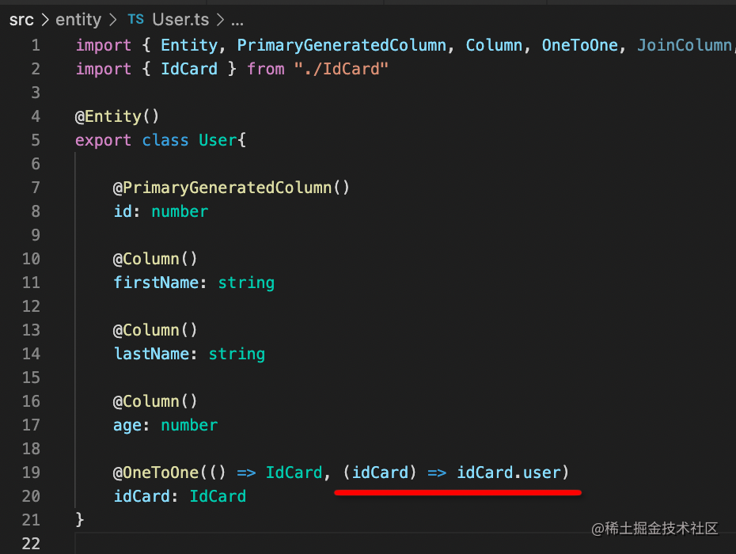

一对多的 department 那方，不维护外键，所以需要第二个参数来指定通过哪个外键找到 department：

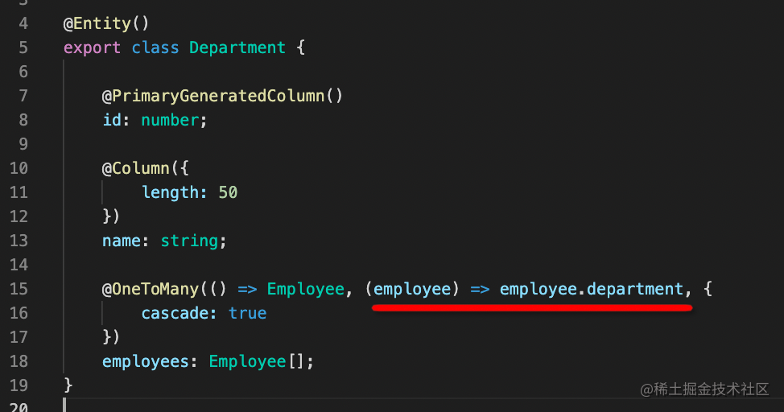

而多对多的时候，双方都不维护外键，所以都需要第二个参数来指定外键列在哪里，怎么找到当前 Entity。

然后我们通过 tag 来关联查询下：

```javascript
const tags = await entityManager.find(Tag, {
    relations: {
        articles: true
    }
});

console.log(tags);
```

也是能成功关联查出来的：

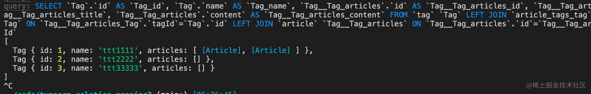

案例代码在[小册仓库](https://github.com/QuarkGluonPlasma/nestjs-course-code/tree/main/typeorm-relation-mapping3)。

## 总结

这节我们学了多对多关系在 Entity 里怎么映射，是通过 @ManyToMany 和 @JoinTable 来声明的。

但如果双方都保留了对方的引用，需要第二个参数来指定关联的外键列在哪，也就是如何查找当前 entity。

多对多关系的修改只要查出来之后修改下属性，然后 save，TypeORM 会自动去更新中间表。

至此，一对一、一对多、多对多关系的 Entity 如何映射到数据库的 table，如何增删改查，我们就都学会了。
