# 62. 如何动态读取不同环境的配置？

连接数据库的时候，我们指定了用户名、密码：

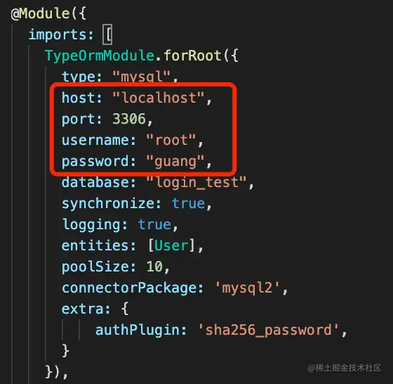

应用启动的时候，我们指定了端口：

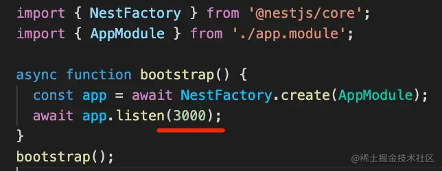

而这些其实都是可以变的，在代码里写死显然不太好。

能不能抽取出来放到配置文件里呢？

自然是可以的。

node 里最常用的是 .env 格式的配置文件，它有一个专门的 npm 包 dotenv。

我们创建个项目来试一下：

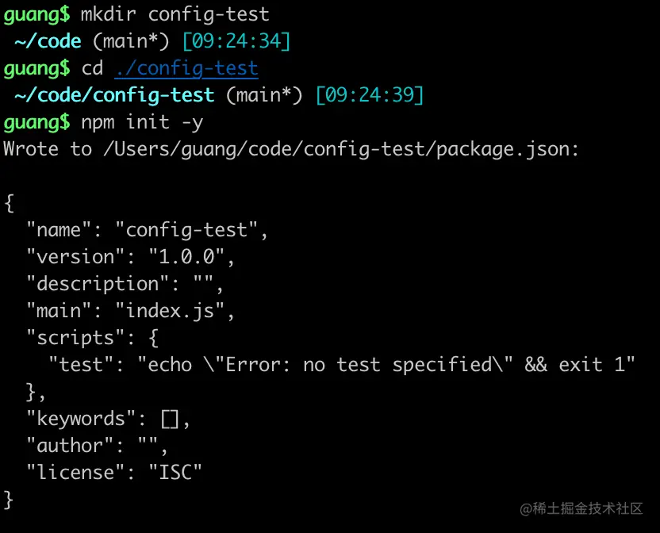
进入这个目录，安装 dotenv：

```
npm install dotenv
```

然后添加一个 .env 配置文件：
```
aaa=1
bbb=2
```

在 index.js 里通过 dotenv 来加载：

```javascript
require('dotenv').config({
    path: './.env',
})

console.log(process.env) 
```
node 执行下：

```
node index.js
```
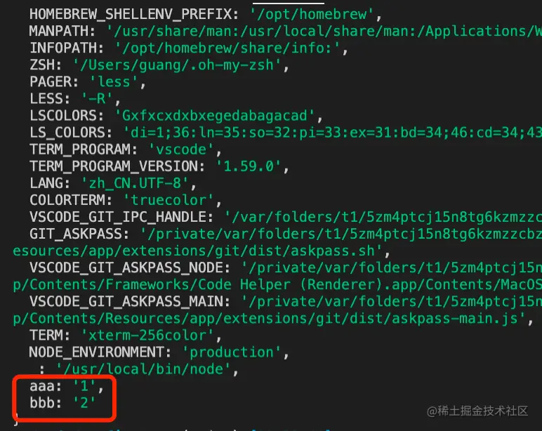

他打印的环境变量里就包含了配置文件里的。

那如果我还有个生产环境的配置文件呢？

比如 .production.env

```
aaa=111
bbb=222
```
我们可以通过 NODE_ENVIRONMENT 环境变量来切换：

```javascript
require('dotenv').config({
    path: process.env.NODE_ENVIRONMENT === 'production' ? '.production.env' : '.env',
})

console.log('aaa', process.env.aaa);
console.log('bbb', process.env.bbb)
```
生产环境设置 NODE_ENVIRONMENT 为 production，就可以切换到对应的配置了：

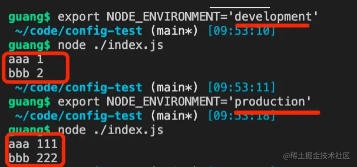

如果你手动置顶了环境变量，那以手动指定的优先：

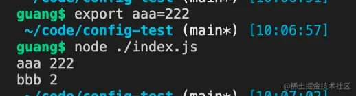

此外，如果你想用 yaml 格式的配置文件也可以。

安装 js-yaml 包：

```
npm install js-yaml
```

然后添加一个 hello.yaml 配置文件：

```yaml
application:
  host: 'localhost'
  port: 8080

db:
   mysql:
    url: 'localhost'
    port: 3306
    database: 'aaa'
    password: 'guang'
```
然后在 index2.js 里用一下：

```javascript
const yaml = require('js-yaml');
const fs = require('fs');

const config = fs.readFileSync('./hello.yaml');

console.log(yaml.load(config));
```
跑一下：

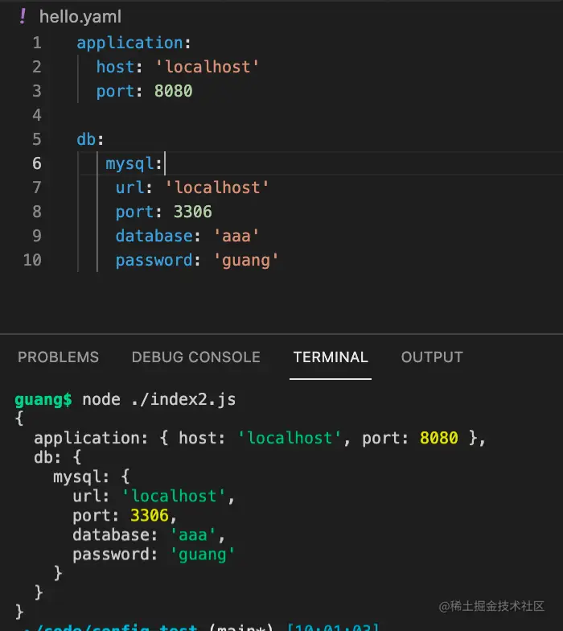

可以看到，用对象的方式把 yaml 的配置给返回了。

**yaml 的格式更适合有层次关系的配置，而 .env 更适合简单的配置。**

同样，也可以通过 NODE_ENVIRMENT 环境变量来切换生产、开发的配置文件。

node 里的配置一般就用这两种方式。

那在 Nest 里怎么用呢？

其实上面的这两种配置方式，自己封装也不麻烦，封装个动态模块就好。

不过 Nest 提供了现成的封装：@nestjs/config

我们创建个 nest 项目来试下：

```
nest new nest-config-test -p npm
```

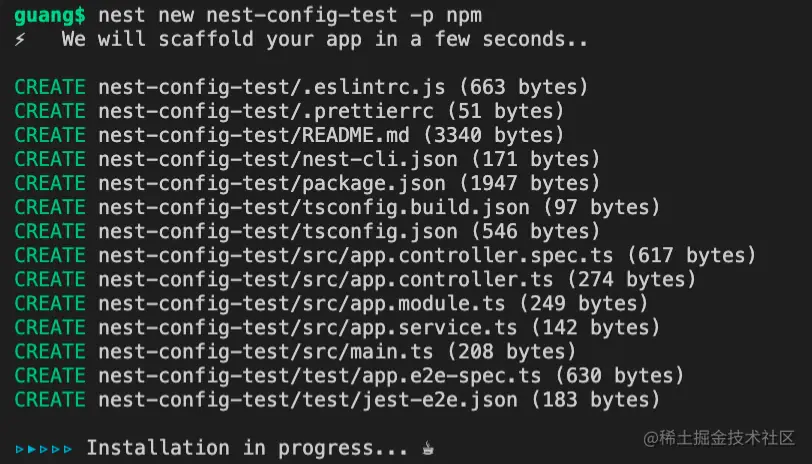

安装 @nestjs/config 包：

```
npm install --save @nestjs/config
```

这个包同样是动态模块的方式，他有 forRoot 和 forFeature 两个方法。

我们在根目录加一个配置文件 .env：

```
aaa=1
bbb=2
```
然后在 AppModule 里面引入：

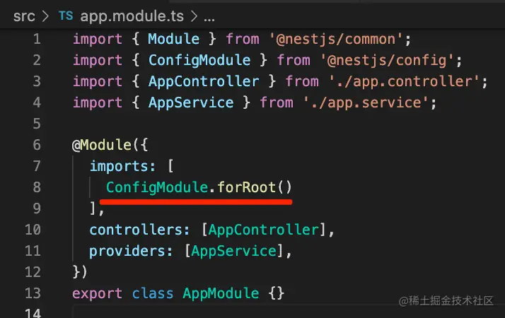

然后在 AppController 里注入 ConfigService 来读取配置：

```javascript
import { Controller, Get, Inject } from '@nestjs/common';
import { ConfigService } from '@nestjs/config';
import { AppService } from './app.service';

@Controller()
export class AppController {
  constructor(private readonly appService: AppService) {}

  @Inject(ConfigService)
  private configService: ConfigService;

  @Get()
  getHello() {
    return {
      aaa: this.configService.get('aaa'),
      bbb: this.configService.get('bbb')
    }
  }
}

```
把 Nest 服务跑起来：
```
npm run start:dev
```
浏览器访问下：

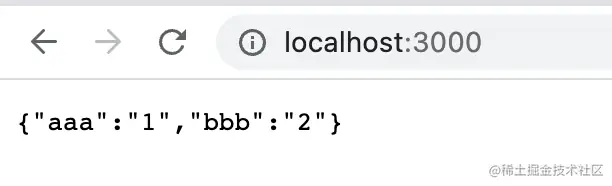

可以看到，nest 读取到了 .env 里的配置。

如果有多个配置文件，比如还有个 .aaa.env：

```
aaa=3
```
在 AppModule 里面这样指定：

```javascript
import { Module } from '@nestjs/common';
import { ConfigModule } from '@nestjs/config';
import { AppController } from './app.controller';
import { AppService } from './app.service';
import * as path from 'path';

@Module({
  imports: [
    ConfigModule.forRoot({
      envFilePath: [path.join(process.cwd(), '.aaa.env'), path.join(process.cwd(), '.env')]
    })
  ],
  controllers: [AppController],
  providers: [AppService],
})
export class AppModule {}
```

前面的配置会覆盖后面的配置。

重新跑一下：

```
npm run start:dev
```
浏览器访问下：

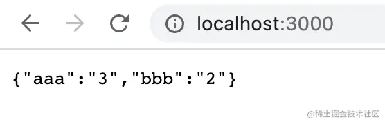

可以看到 aaa 是 .aaa.env 里的，bbb 是 .env 里的。

那如果我嫌 .env 里配置不够灵活，想在 ts 文件里配置呢？

@nestjs/config 也是支持的。

我们写一个 config.ts：

```javascript
export default async () => {
    const dbPort = await 3306;

    return {
        port: parseInt(process.env.PORT, 10) || 3000,
        db: {
          host: 'localhost',
          port: dbPort
        }
    }
}
```
这里可以写异步逻辑。

然后引入下：

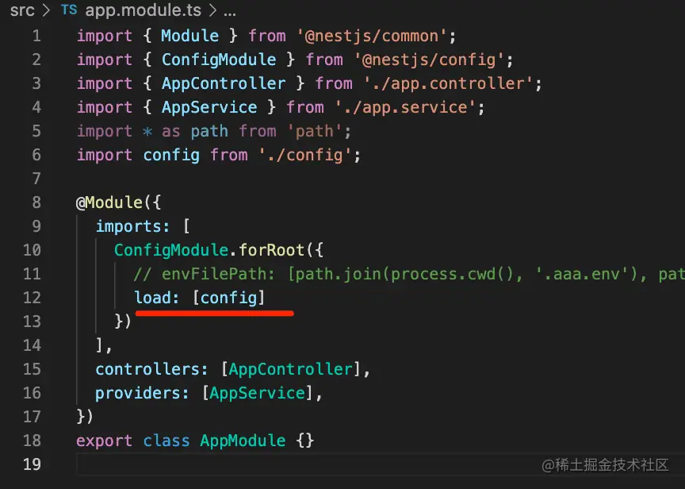

在 Controller 里取出来：

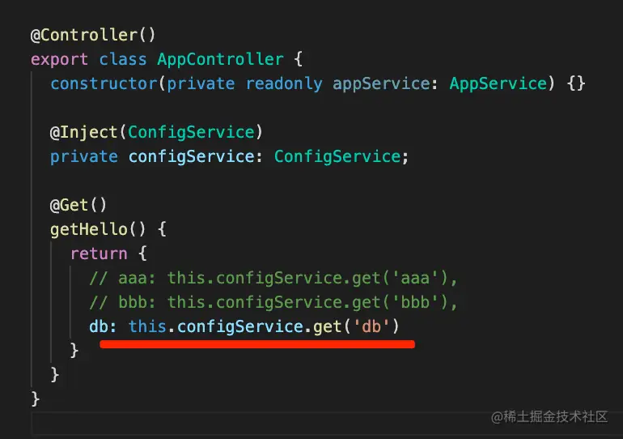

浏览器访问下：

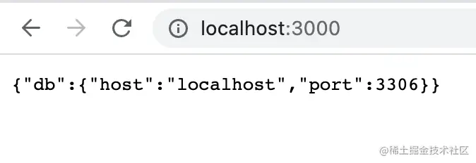

这样，你可以动态加载配置。

后面将讲微服务的时候，会讲到配置中心，比如 nacos、etcd 这种中间件，到时候配置就是动态获取的。

而且这个配置文件里，你完全可以自己实现 yaml 文件的加载。

```
npm install js-yaml
```
添加一个配置文件 aaa.yaml

```yaml
application:
  host: 'localhost'
  port: 8080

aaa:
   bbb:
    ccc: 'ccc'
    port: 3306
```
然后在 config2.ts 里加载下：

```javascript
import { readFile } from 'fs/promises';
import * as yaml from 'js-yaml';
import { join } from 'path';


export default async () => {
    const configFilePath = join(process.cwd(), 'aaa.yaml');

    const config = await readFile(configFilePath, {
        encoding: 'utf-8'
    });

    return yaml.load(config);
};
```
在 AppModule 引入：

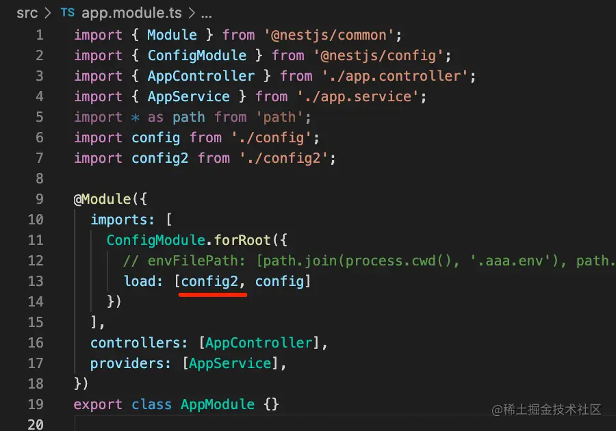

同样，前面覆盖后面的。

改下 Controller：

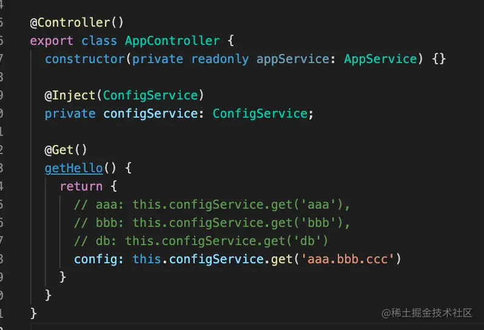

浏览器访问下：

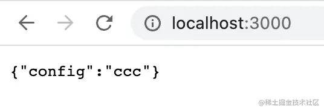

这样就正确读取了 yaml 配置。

同理，其他格式的配置也可以这样来自己解析。

此外，@nestjs/config 还提供了 forFeature 方法来返回动态模块。

如果别的模块也需要用到 config 咋办呢？

我们新建一个模块：

```
nest g resource bbb --no-spec
```

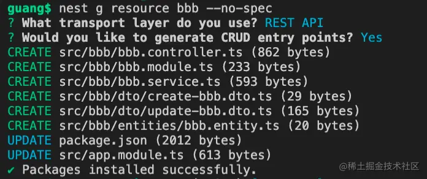

在 BbbModule 里注入下：

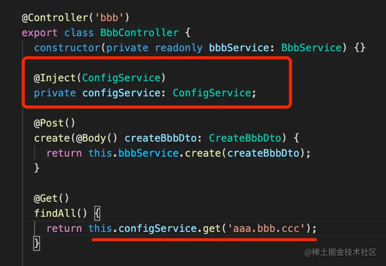

跑起来你会发现报错了：

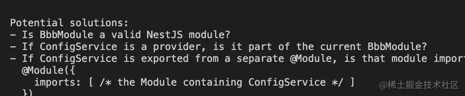

这个模块找不到 ConfigModule。

这时候把 ConfigModule.forRoot 注册为全局模块就好了：

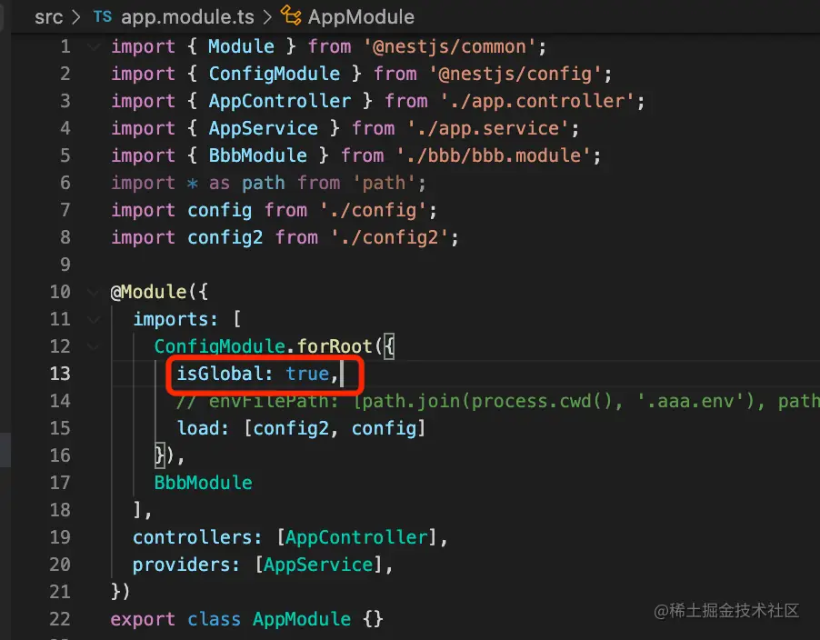

这样就可以在 BbbModule 读取到配置了：

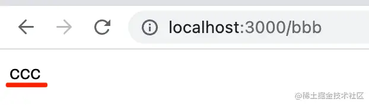

此外，你还可以通过 ConfigModule.forFeautrue 来注册局部配置：
```javascript
import { Module } from '@nestjs/common';
import { BbbService } from './bbb.service';
import { BbbController } from './bbb.controller';
import { ConfigModule } from '@nestjs/config';

@Module({
  imports: [
    ConfigModule.forFeature(() => {
      return {
        ddd: 222
      }
    })
  ],
  controllers: [BbbController],
  providers: [BbbService]
})
export class BbbModule {}
```

BbbController 里读取下：
```javascript
@Get()
findAll() {
    return {
      ccc: this.configService.get('aaa.bbb.ccc'),
      ddd: this.configService.get('ddd')
    }
}
```
可以看到，Nest 读取到了这个局部注册的配置。

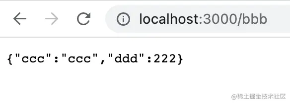

这里是再次验证了**动态模块的 forRoot 用于在 AppModule 里注册，一般指定为全局模块，forFeature 用于局部配置，在不同模块里 imports，而 register 用于一次性的配置。**

比如 JwtModule.register、TypeOrmModule.ForRoot、TypeOrmModule.forFeature。

对动态模块不太理解的同学建议回过头去看看第 15 节。

最后我们简单看一下 @nestjs/config 的源码：

先是 forFeature：

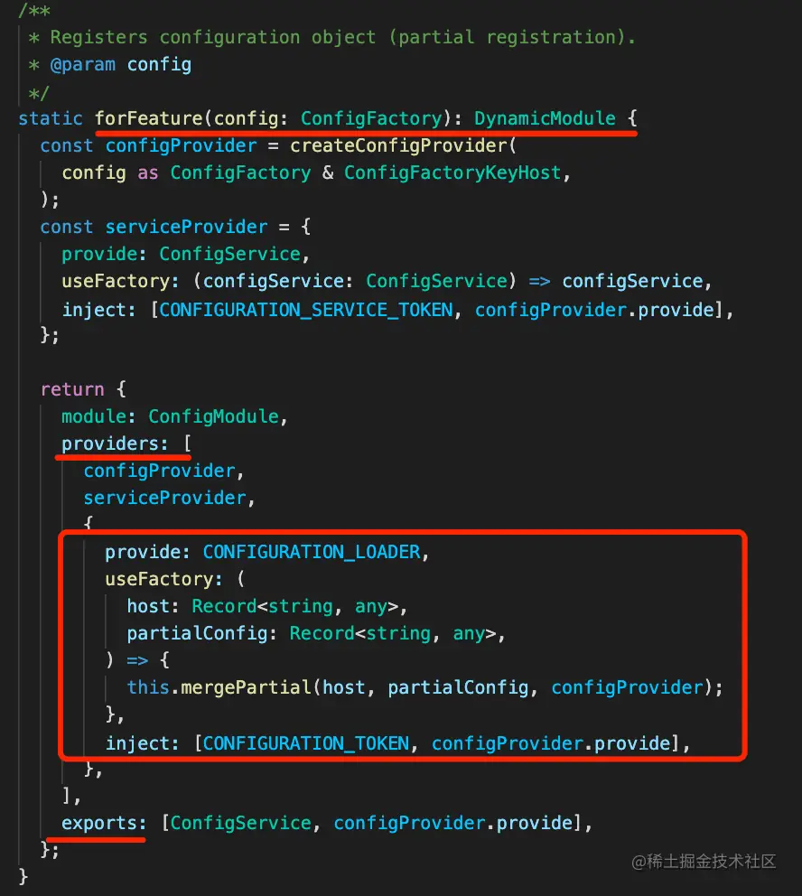

动态返回模块定义，也就是 providers、exports 这些。

用 useFactory 动态创建了 provider，merge 了局部配置和全局配置。

然后是 forRoot：

它就是根据 options 读取 env 配置，然后用 useFactory 创建 ConfigService 的 provider：

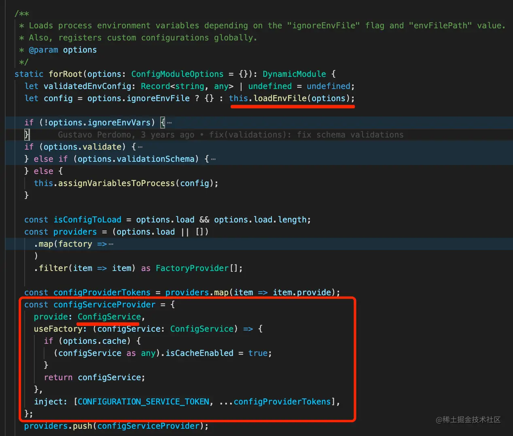

之后动态返回模块定义：

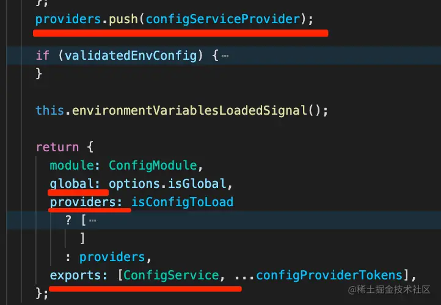

还是动态模块那些知识。

案例代码：

[Node 读取 env、yaml 配置文件](https://github.com/QuarkGluonPlasma/nestjs-course-code/tree/main/config-test)

[Nest 通过 Config 模块读取配置文件](https://github.com/QuarkGluonPlasma/nestjs-course-code/tree/main/nest-config-test)

## 总结

这节我们学习了配置文件的使用方式，基于 dotenv、js-yaml 可以读取 .env 和 yaml 的配置文件。

我们可以通过 NODE_ENVIRONMENT 来切换不同路径的配置文件，实现开发、生产环境的配置切换。

Nest 提供了 @nestjs/config 包来封装，使用 ConfigModule.forRoot 可以读取 .env 配置文件，然后注入 ConfigService 来取配置。

还可以通过 ConfigModule.forFeature 来注册局部配置。

它的原理也很简单，就是通过 useFactory 动态产生 provider，然后在 forRoot、forFeature 里动态返回模块定义。

学习了 ConfigModule 之后，我们就可以把数据库连接信息、应用启动端口等抽离到配置文件了。
