# 74. passport 实现 GitHub 三方账号登录

我们每天都会登录各种网站，这些网站除了用户名、密码登录外，一般也都支持三方登录。

比如 google 登录、github 登录：


这样免去了输入用户名密码的麻烦，直接用别的账号来登录当前网站。

那这种三方登录是怎么实现的呢？

今天我们做一下基于 github 的登录来体验下。

我们还是用 passport 这个包。

它提供了非常多的[策略](https://www.passportjs.org/packages/)。

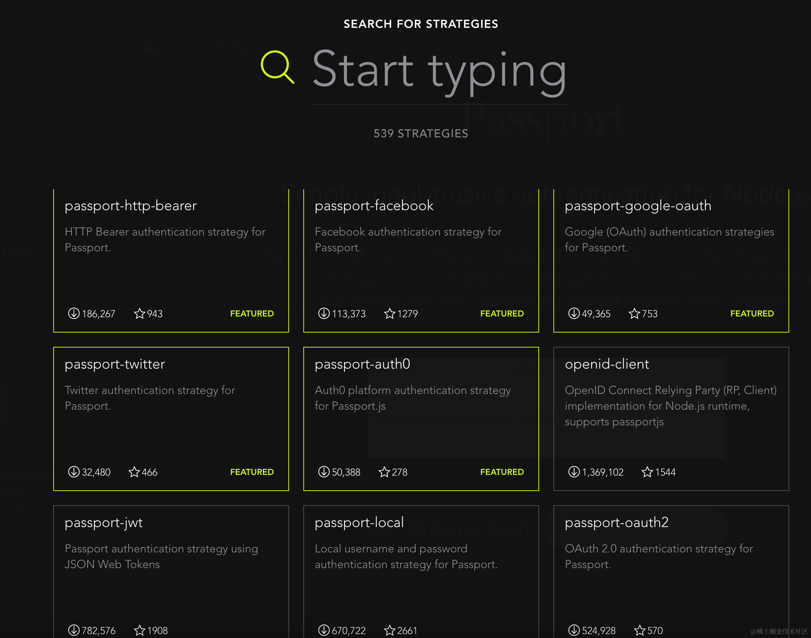

上节我们用的 passport-local（用户名密码认证）、passport-jwt（jwt 认证）只是最基础的。

这节用 [passport-github2](https://www.passportjs.org/packages/passport-github2/) 来实现基于 github 的三方登录。

这个的关键是要拿到 client id 和 secret。

我们来生成一下：

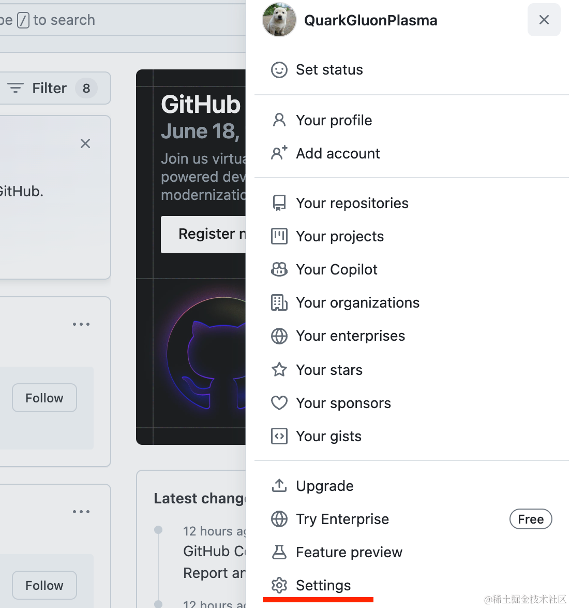

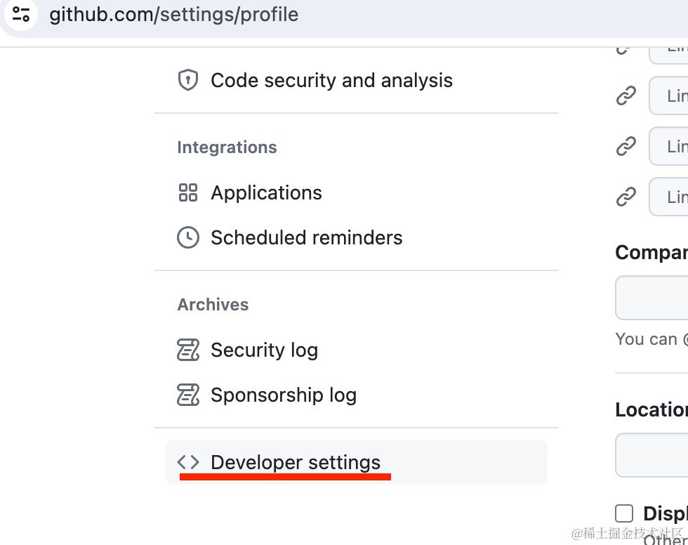

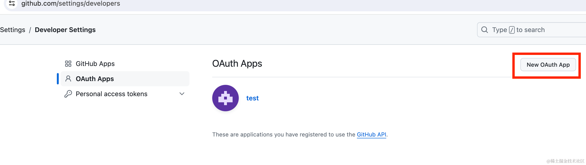

点击 settings > developer settings > new OAuth App

填入信息后，点击 register application：

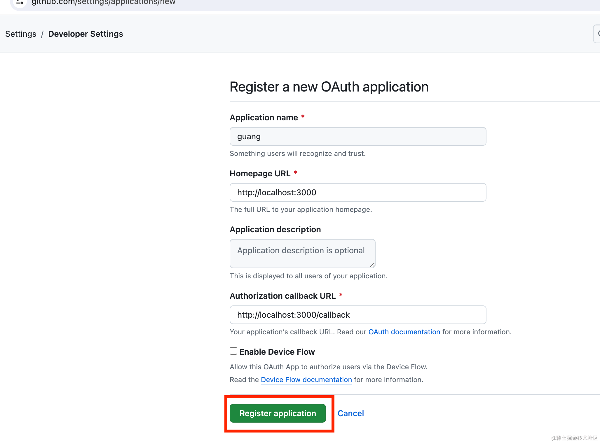

现在 client id 有了，点击生成 secret

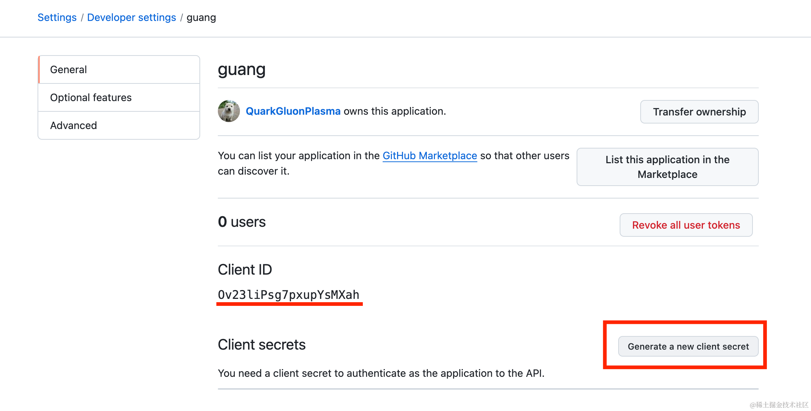

提示你了，这里的 secret 只能看见这一次，复制保存下来（当然，丢了也没啥，可以再次生成）：

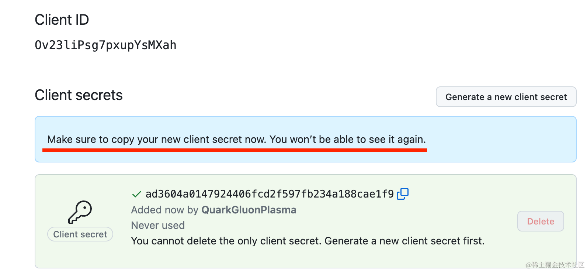

有了 client id 和 secret 之后，就能实现 github 登录了。

我们新建个 nest 项目：

```
nest new github-login
```

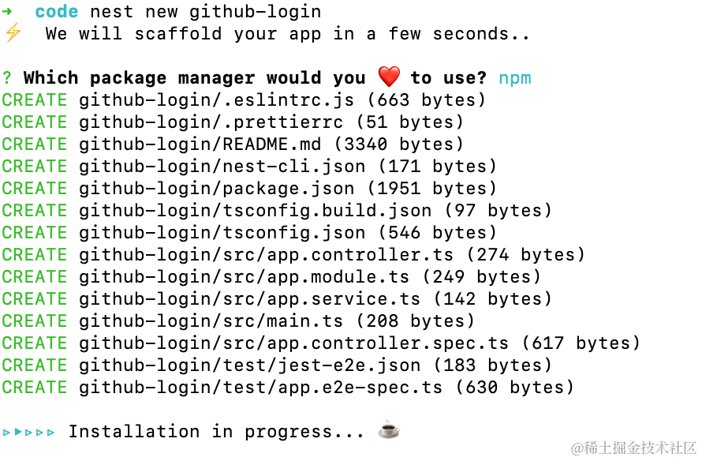

进入项目，安装 passport 的包：

```
npm install --save passport @nestjs/passport
```
然后安装 passport-github2 的策略：

```
npm install --save passport-github2
npm install --save-dev @types/passport-github2
```

生成一个 auth 模块：

```
nest g module auth
```
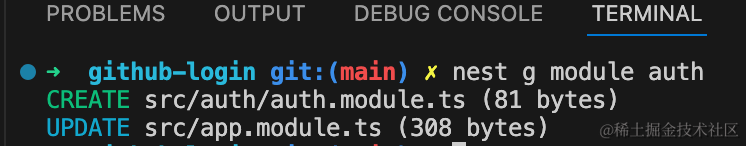

然后添加 auth/auth.strategy.ts

```javascript
import { Injectable } from '@nestjs/common';
import { PassportStrategy } from '@nestjs/passport';
import { Profile, Strategy } from 'passport-github2';

@Injectable()
export class GithubStrategy extends PassportStrategy(Strategy, 'github') {
  constructor() {
    super({
      clientID: 'Ov23liPsg7pxupYsMXah',
      clientSecret: 'ad3604a0147924406fcd2f597fb234a188cae1f9',
      callbackURL: 'http://localhost:3000/callback',
      scope: ['public_profile'],
    });
  }

  async validate(accessToken: string, refreshToken: string, profile: Profile) {
    return profile;
  }
}
```
这里的 clientID 和 clientSecret 要换成你自己的。

callbackURL 是登录成功后回调的 url。

scope 是请求的数据的范围。

在 AuthModule 引入下这个 GithubStategy：

```javascript
import { Module } from '@nestjs/common';
import { GithubStrategy } from './auth.strategy';

@Module({
    providers: [GithubStrategy]
})
export class AuthModule {}
```

然后在 AppController 添加两个路由：

```javascript

import { Controller, Get, Req, UseGuards } from '@nestjs/common';
import { AuthGuard } from '@nestjs/passport';

@Controller('')
export class AppController {
  constructor(private appService: AppService) {}

  @Get('login')
  @UseGuards(AuthGuard('github'))
  async login() {
  }

  @Get('callback')
  @UseGuards(AuthGuard('github'))
  async authCallback(@Req() req) {
    return req.user;
  }
}
```

login 是触发 github 登录的，然后 callback 是回调的 url。

前面讲过 passport 的策略会在验证过后把 validate 的返回值放在 request.user 上。

所以这里可以从 req.user 取到返回的用户信息。

跑一下：

当你访问 http://localhost:3000/login ，会跳转 github 登录授权页面：

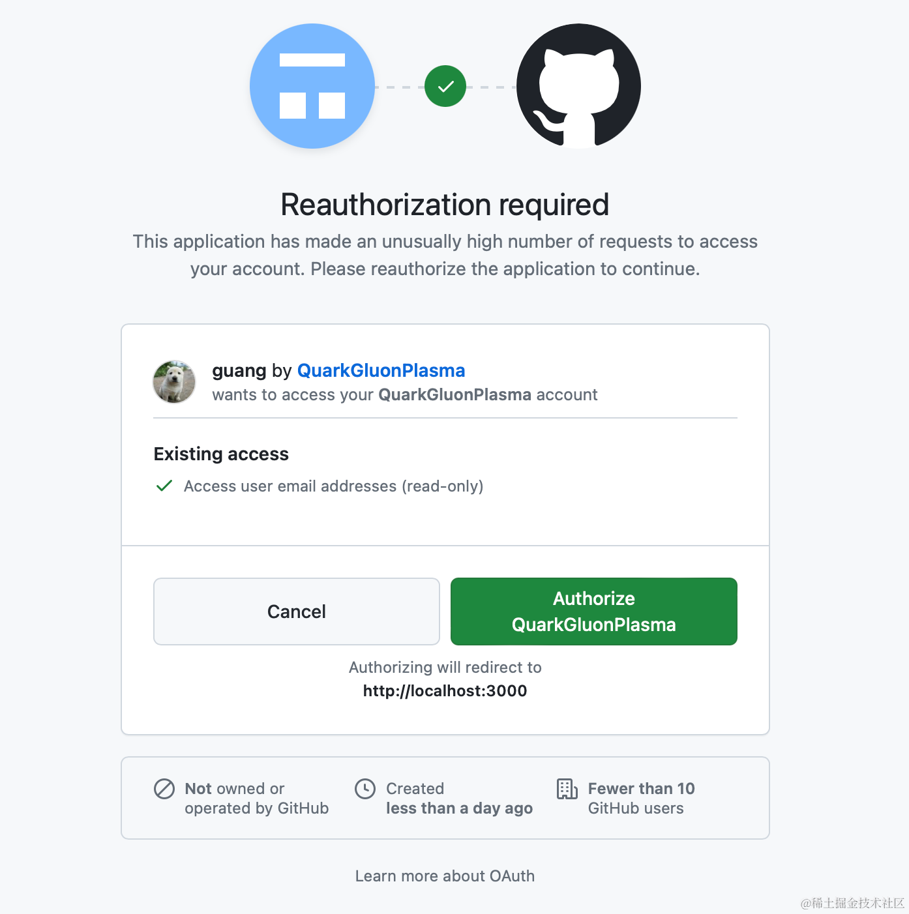

然后点击 authorize，会回调 callback 接口：

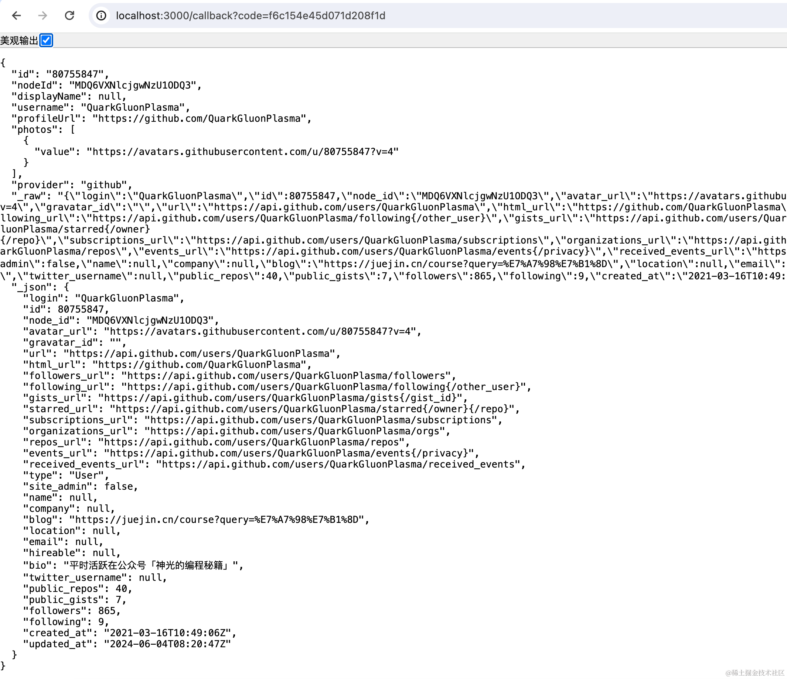

这样我们拿到 id 就可以唯一标识这个用户。

可以在用户表里添加一个 githubId 的字段，第一次用 github 登录的时候，记录返回的 id、username、avater 等信息，然后打开一个页面让用户完善其他信息，比如 email、password 等，。

然后后续用 github 登录的时候，直接根据 githubId 来查询用户即可。

我们改下 AppService：

```javascript
import { Injectable } from '@nestjs/common';

const users = [
  {
    username: 'guangguang',
    githubId: '80755847',
    email: 'yyy@163.com',
    hobbies: ['sleep', 'writting']
  }, 
  {
    username: 'dongdong',
    email: 'xxx@xx.com',
    hobbies: ['swimming']
  }
]

@Injectable()
export class AppService {

  findUserByGithubId(githubId: string){
    return users.find(item => item.githubId === githubId);
  }

  getHello(): string {
    return 'Hello World!';
  }
}
```
guanggaung 用户用 github 登录过，记录了他的 githubId。

然后在 AppController 里取出 github 返回的 id 来，查询用户信息，即可登录。

```javascript
@Get('callback')
@UseGuards(AuthGuard('github'))
async authCallback(@Req() req) {
    return this.appService.findUserByGithubId(req.user.id);
}
```

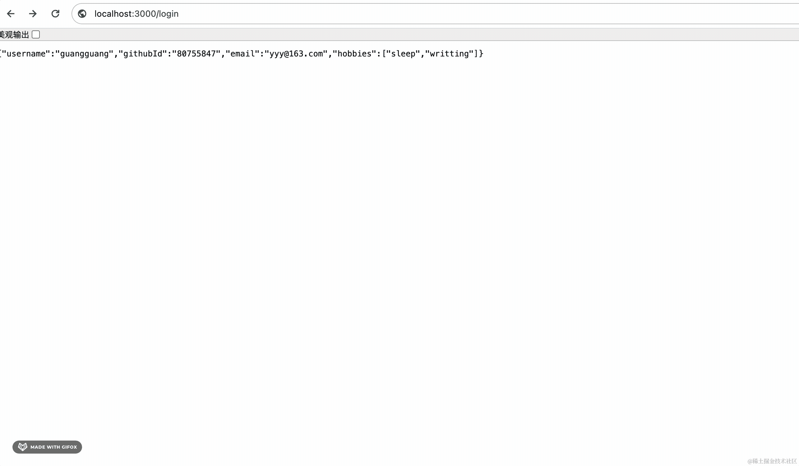

可以看到，现在访问 http://localhost:3000/login 会跳转 github 登录，然后授权后访问 callback，我们根据 id 查询出了用户信息返回。

这样就实现了 github 的登录。

当然，这里应该是返回 jwt，然后后续直接用 jwt 来认证就好了。

案例代码上传了[小册仓库](https://github.com/QuarkGluonPlasma/nestjs-course-code/tree/main/github-login)

## 总结

很多网站都支持三方登录，这样，不用每次都输入用户名密码，可以用别的账号来登录。

我们基于 passport 的 GitHub 策略实现了三方登录。

它核心就是要获取 clientID、clientSecret。

然后在 GithubStrategy 的构造函数传入这些信息，在 validate 方法里就可以拿到返回的 profile。

我们只要在用户表存一个 githubId 的字段，用 github 登录之后根据 id 查询用户信息，实现登录就好了。

这样就免去了每次登录都输入用户名密码的麻烦。

你平时用的三方登录就是这么实现的。
