# 90. 实现基于邮箱验证码的登录

上节我们学习了用 Node 来收发邮件，其实 Node 发邮件最常见的场景还是邮箱验证码。

比如登录的时候除了可以通过用户名、密码来验证身份，还可以通过邮箱验证码来验证。

这节我们就实现下这个功能。

首先，我们写个简单的登录页面:

通过 create-react-app 创建个项目：

```
npx create-react-app email-login-frontend
```
然后进入项目把开发服务跑起来：

```
npm run start
```

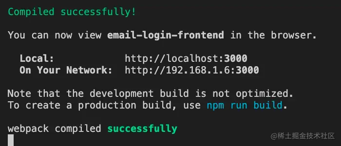

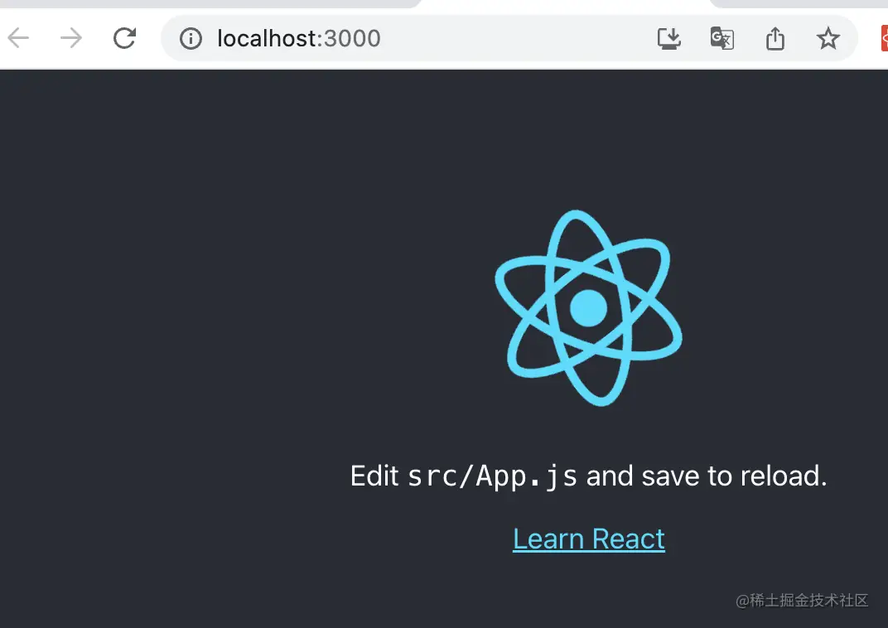

安装 antd：

```
npm install antd --save
```

然后来写下登录 UI：

```javascript
import React from 'react';
import { Button, Form, Input } from 'antd';

const login = (values) => {
  console.log('Success:', values);
};

const sendEmailCode = () => {
  console.log('send email code')
}

const App = () => (
  <div style={{width: '500px', margin: '100px auto'}}>
    <Form onFinish={login}>

      <Form.Item
        label="邮箱"
        name="email"
        rules={[
          {
            required: true,
            message: '请输入邮箱地址',
          },
        ]}
      >
        <Input />
      </Form.Item>

      <Form.Item
        label="验证码"
        name="code"
        rules={[
          {
            required: true,
            message: '请输入验证码',
          },
        ]}
      >
        <Input/>
      </Form.Item>

      <Form.Item>
        <Button onClick={sendEmailCode}>发送验证码</Button>
      </Form.Item>

      <Form.Item>
        <Button type="primary" htmlType="submit">登录</Button>
      </Form.Item>

    </Form>
  </div>
);
export default App;
```
在 App.js 输入上面的代码，就可以看到登录页面：

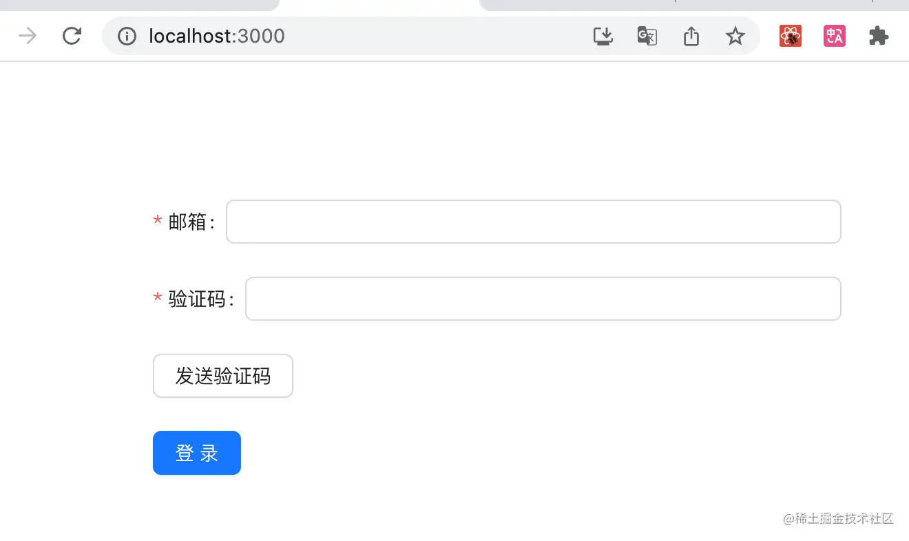

比较丑，但功能是没问题的：

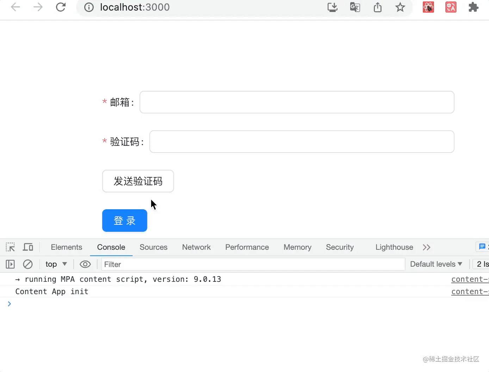

然后我们再来写下后端代码。

创建个 nest 项目：

```
nest new email-login-backend -p npm
```
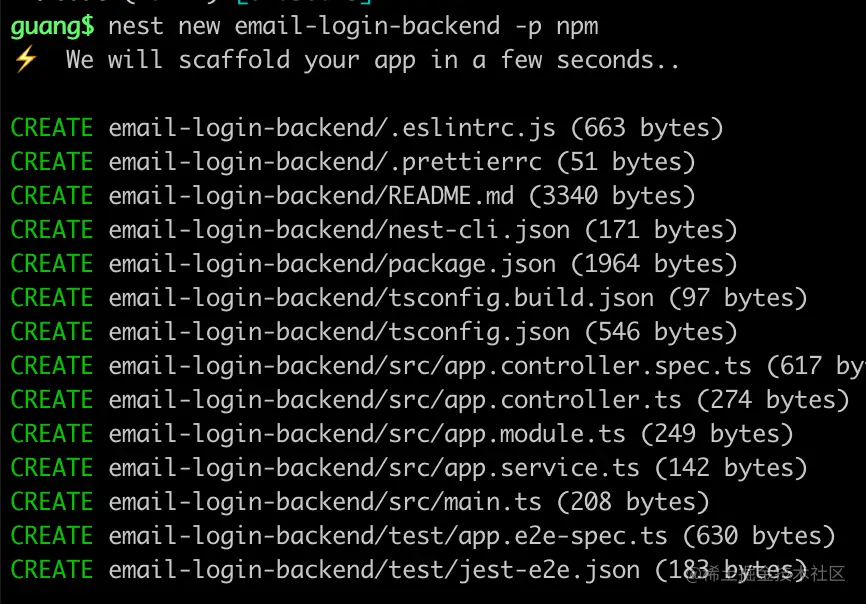

在 main.ts 启用跨域，并且修改下端口号（因为前端项目开发服务也用这个端口号）：

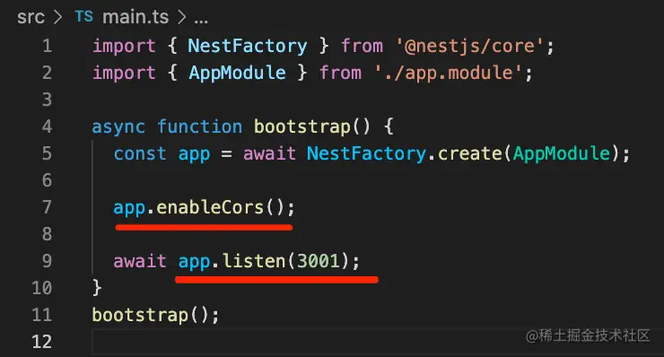

然后跑起来：

```
npm run start:dev
```
浏览器访问可以看到 hello world 代表 nest 服务跑成功了：

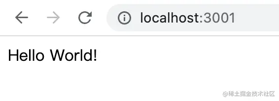

然后在前端项目里访问下。

在前端项目安装 axios：

```
npm install --save axios
```

然后调用下接口：

```javascript
import axios from 'axios';

const login = (values) => {
  console.log('Success:', values);
};

const sendEmailCode = async () => {
  const res = await axios.get('http://localhost:3001');

  console.log(res);
  console.log('send email code')
}
```
试一下：

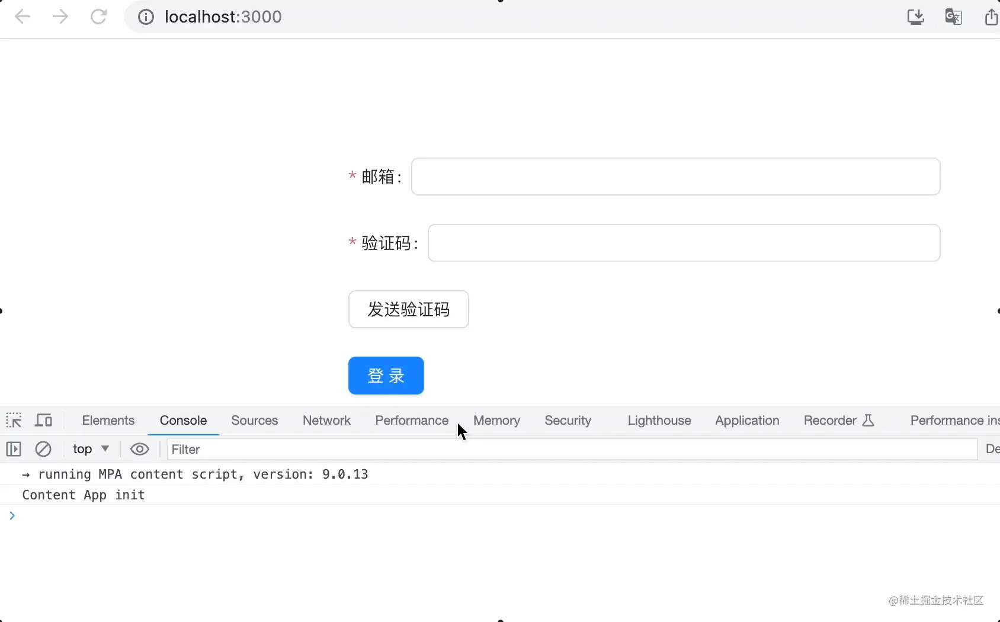

接口调通了。

然后回到后端项目，我们继续写后端接口：

创建 user 模块：

```
nest g resource user
```
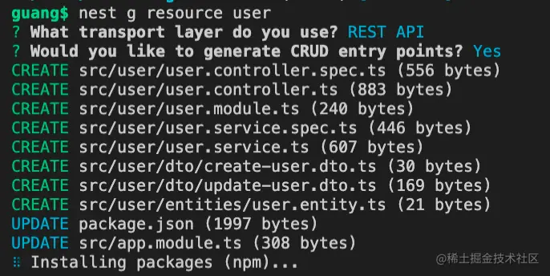

安装 typeorm 的依赖：
```
npm install --save @nestjs/typeorm typeorm mysql2
```

在 AppModule 引入 TypeOrmModule：

```javascript
import { Module } from '@nestjs/common';
import { TypeOrmModule } from '@nestjs/typeorm';
import { AppController } from './app.controller';
import { AppService } from './app.service';
import { UserModule } from './user/user.module';

@Module({
  imports: [
    UserModule,
    TypeOrmModule.forRoot({
      type: "mysql",
      host: "localhost",
      port: 3306,
      username: "root",
      password: "guang",
      database: "email_login_test",
      synchronize: true,
      logging: true,
      entities: [],
      poolSize: 10,
      connectorPackage: 'mysql2',
      extra: {
          authPlugin: 'sha256_password',
      }
    }),
  ],
  controllers: [AppController],
  providers: [AppService],
})
export class AppModule {}
```

然后我们在 mysql workbench 创建个新的 database：

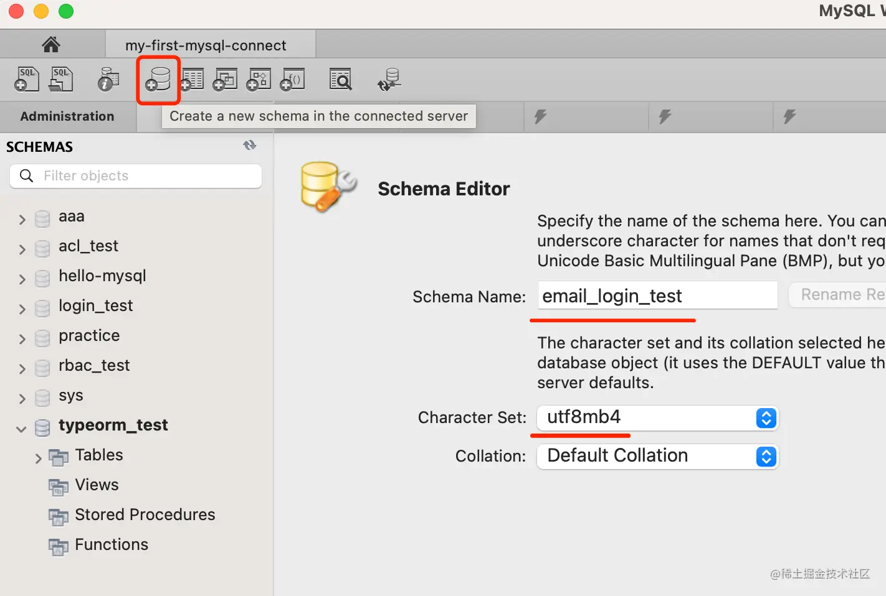

输入 database 或者叫 schema 的名字，指定字符集为 utf8mb4。

点击 apply 可以看到生成的 sql：

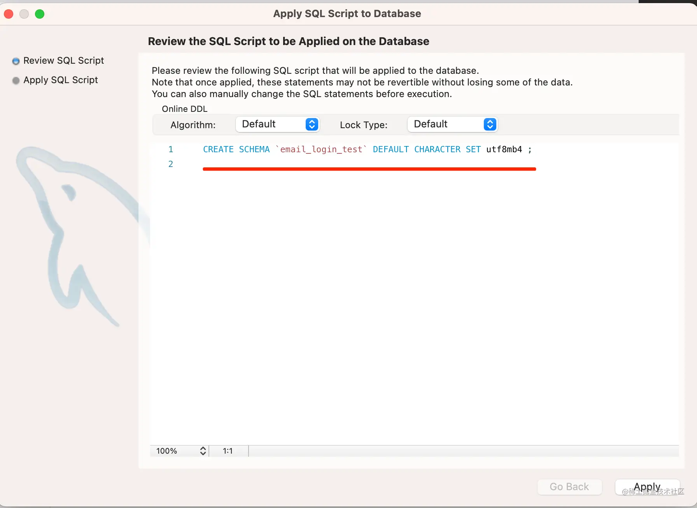

改下 User 的 entity：

```javascript
import { Column, Entity, PrimaryGeneratedColumn } from "typeorm";

@Entity()
export class User {

    @PrimaryGeneratedColumn()
    id: number;

    @Column({
        length: 50,
        comment: '用户名'
    })
    username: string;

    @Column({
        length: 50,
        comment: '密码'
    })
    password: string;

    @Column({
        length: 50,
        comment: '邮箱地址'
    }) 
    email: string;
}
```
user 表有 id、username、password、email 这 4 个字段。

在 TypeOrm 的 entities 注册下：

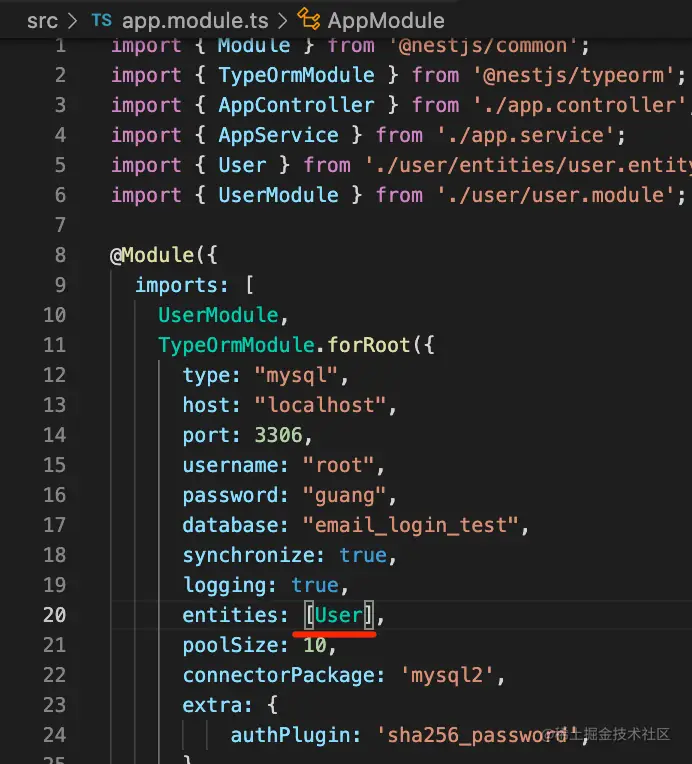

保存，nest 服务会自动重新跑：

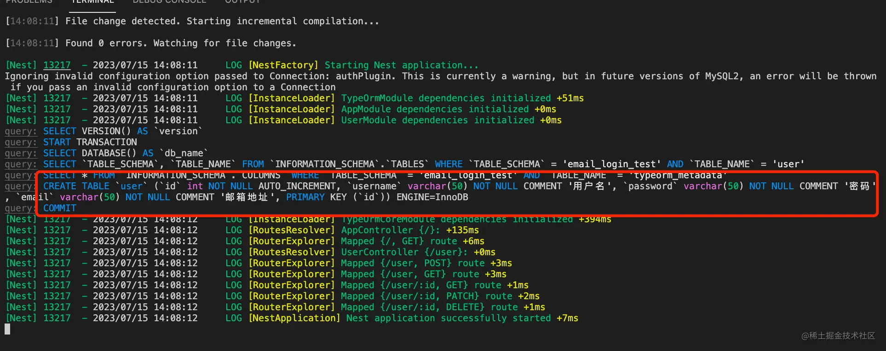

可以看到 user 表被创建了。

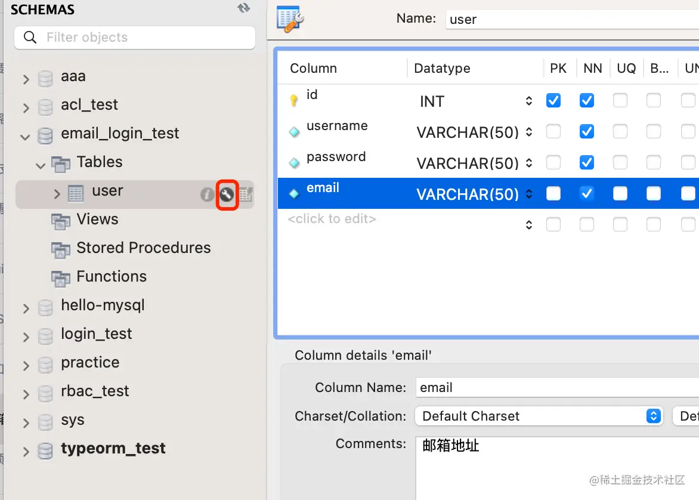

这次我们手动插入下数据：

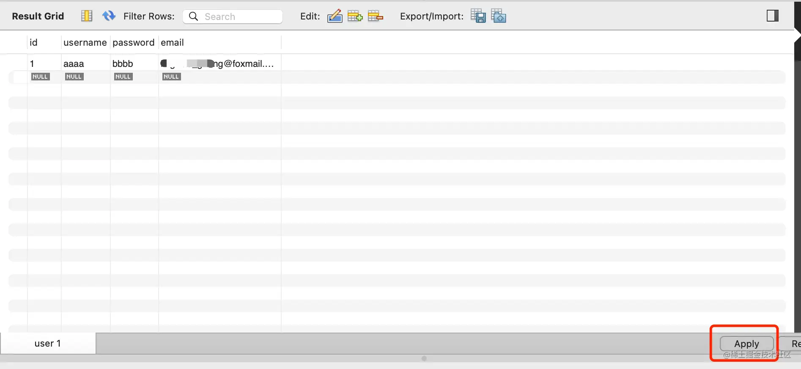

输入内容后，点击 apply，可以看到生成的 sql：

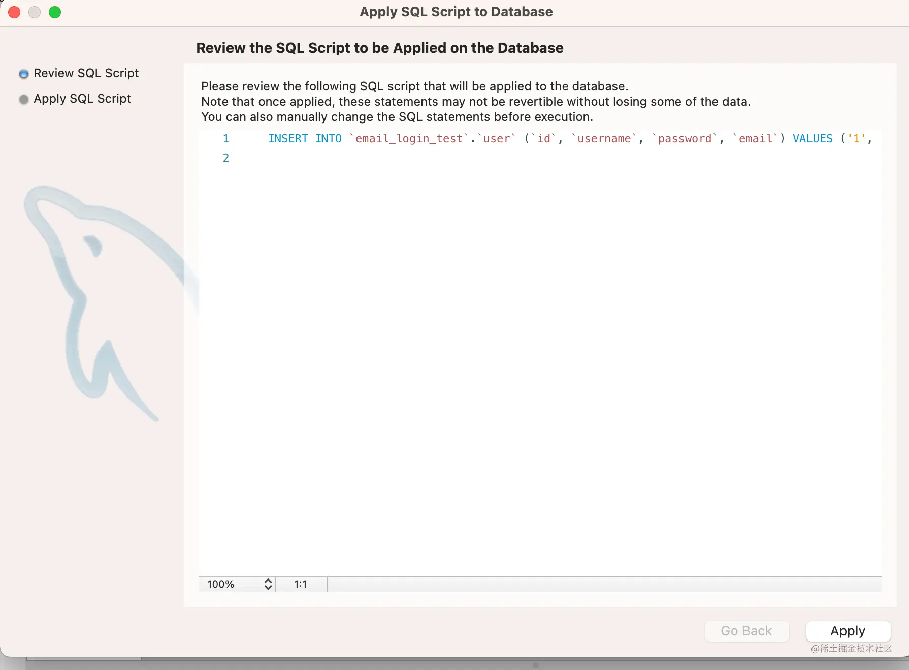

你直接执行这个 sql 来插入数据也行：

```sql
INSERT INTO `email_login_test`.`user` 
  (`id`, `username`, `password`, `email`) 
  VALUES ('1', 'aaaa', 'bbbb', 'xxx@xx.com');
```

这里邮箱要改成你自己的，因为待会要发邮件用。

之后来添加下发邮件的接口。

添加个 email 模块，这次不用生成 crud 代码了：

```
nest g resource email
```
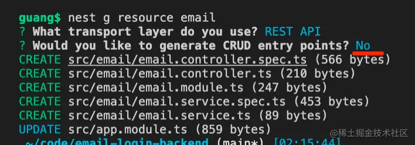

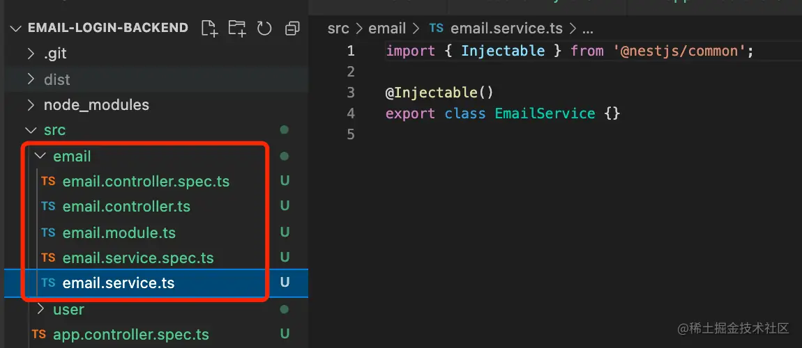

然后我们安装 nodemailer 包来发邮件：

```
npm install --save nodemailer

npm install --save-dev @types/nodemailer
```

在 MailService 里来发邮件：

```javascript
import { Injectable } from '@nestjs/common';
import { createTransport, Transporter} from 'nodemailer';

@Injectable()
export class EmailService {

    transporter: Transporter
    
    constructor() {
        this.transporter = createTransport({
            host: "smtp.qq.com",
            port: 587,
            secure: false,
            auth: {
                user: 'xx@xx.com',
                pass: '你的授权码'
            },
        });
    }

    async sendMail({ to, subject, html }) {
      await this.transporter.sendMail({
        from: {
          name: '系统邮件',
          address: 'xx@xx.com'
        },
        to,
        subject,
        html
      });
    }
}
```

把邮箱和授权码改成你自己的。

然后添加一个 controller 方法：

```javascript
import { Controller, Get, Query } from '@nestjs/common';
import { EmailService } from './email.service';

@Controller('email')
export class EmailController {
  constructor(private readonly emailService: EmailService) {}

  @Get('code')
  async sendEmailCode(@Query("address") address) {
    await this.emailService.sendMail({
      to: address,
      subject: '登录验证码',
      html: '<p>你的登录验证码是 123456</p>'
    });
    return '发送成功';
  }
}

```
我们调用下试试：

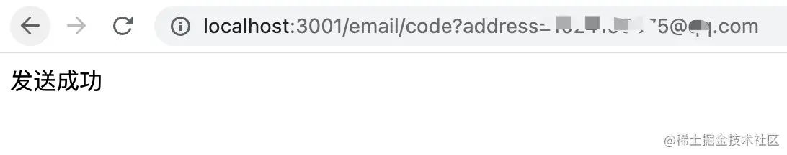

发送成功，邮箱里确实也收到了这封邮件：

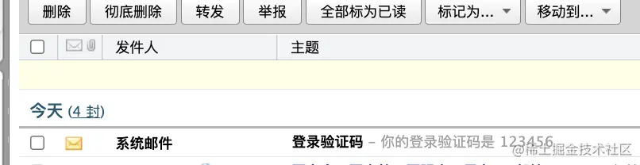

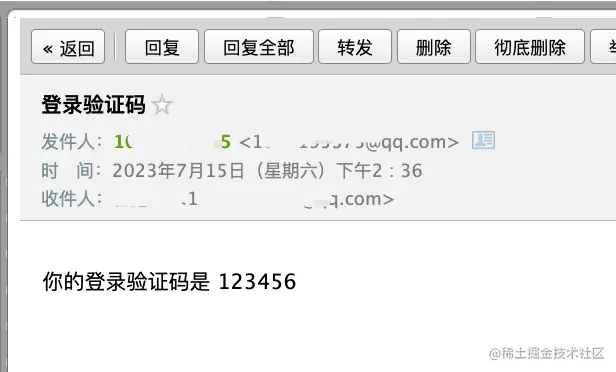

回过头来看一下，我们现在是把邮箱相关信息直接写在代码里了。

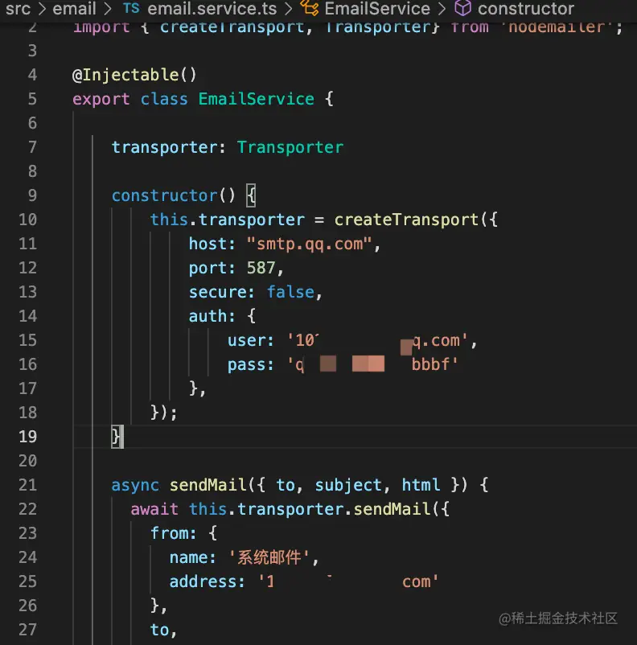

实际上这些应该从配置读取。

我们安装下配置模块：

```
npm install --save @nestjs/config
```
在 AppModule 里引入，并且把它声明为全局的：

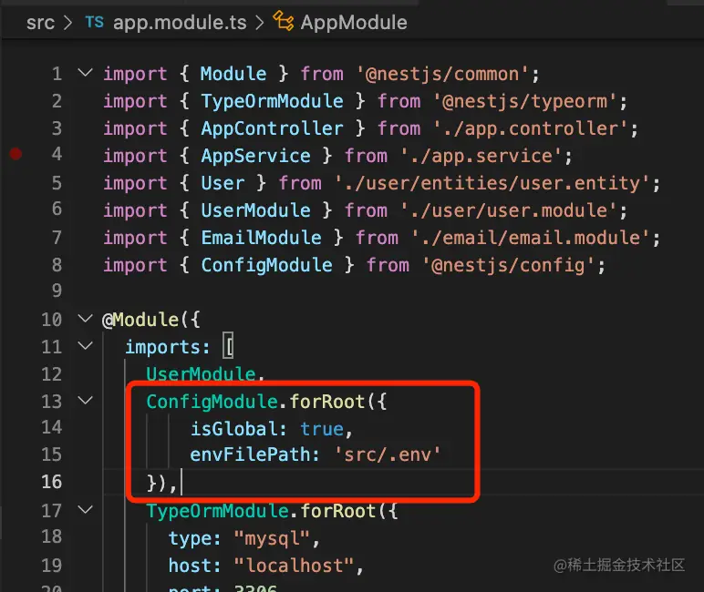

```javascript
ConfigModule.forRoot({
    isGlobal: true,
    envFilePath: 'src/.env'
})
```
在 src 下添加这个 .env 文件：

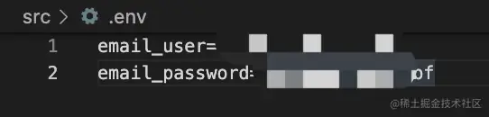

然后在 EmailService 里注入 ConfigService，从中读取配置：

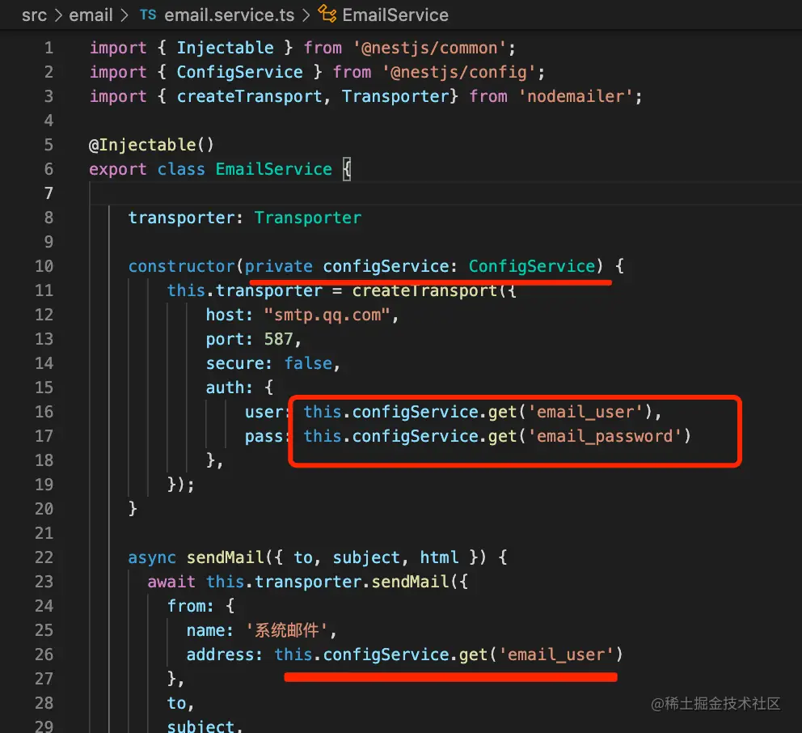

```javascript
import { Injectable } from '@nestjs/common';
import { ConfigService } from '@nestjs/config';
import { createTransport, Transporter} from 'nodemailer';

@Injectable()
export class EmailService {

    transporter: Transporter
    
    constructor(private configService: ConfigService) {
      this.transporter = createTransport({
          host: "smtp.qq.com",
          port: 587,
          secure: false,
          auth: {
              user: this.configService.get('email_user'),
              pass: this.configService.get('email_password')
          },
      });
    }

    async sendMail({ to, subject, html }) {
      await this.transporter.sendMail({
        from: {
          name: '系统邮件',
          address: this.configService.get('email_user')
        },
        to,
        subject,
        html
      });
    }

}

```
再调用下接口，这时依然是正常的：

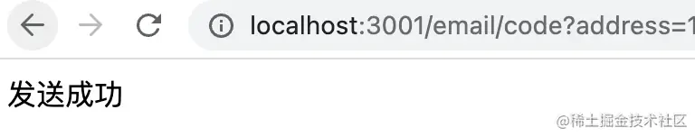

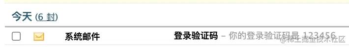

说明配置正确读取出来了。

不过用了 .env 配置文件之后有个问题：

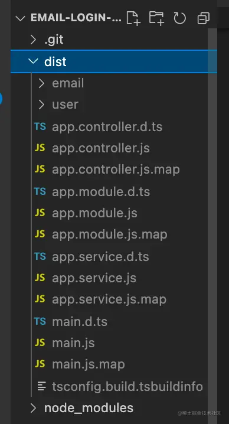

dist 目录下没有这个文件。

.env 需要配置下 assets 才会复制过去。

改下 nest-cli.json

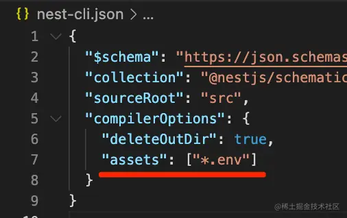

添加 assets 为 \*.env 这样就会在编译的时候把 src 下的 .env 文件复制到 dist 下。

注意，**assets 只支持 src 下的文件复制**。如果你是放在根目录，那就要自己复制了。

改了编译配置需要重新跑服务：

```
npm run start:dev
```
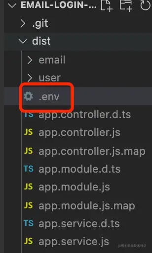

这时就可以在 dist 下看到这个文件了。

但现在你改了 src 下的 .env 之后，dist 下的 .env 不会跟着改，需要重新跑服务才可以。

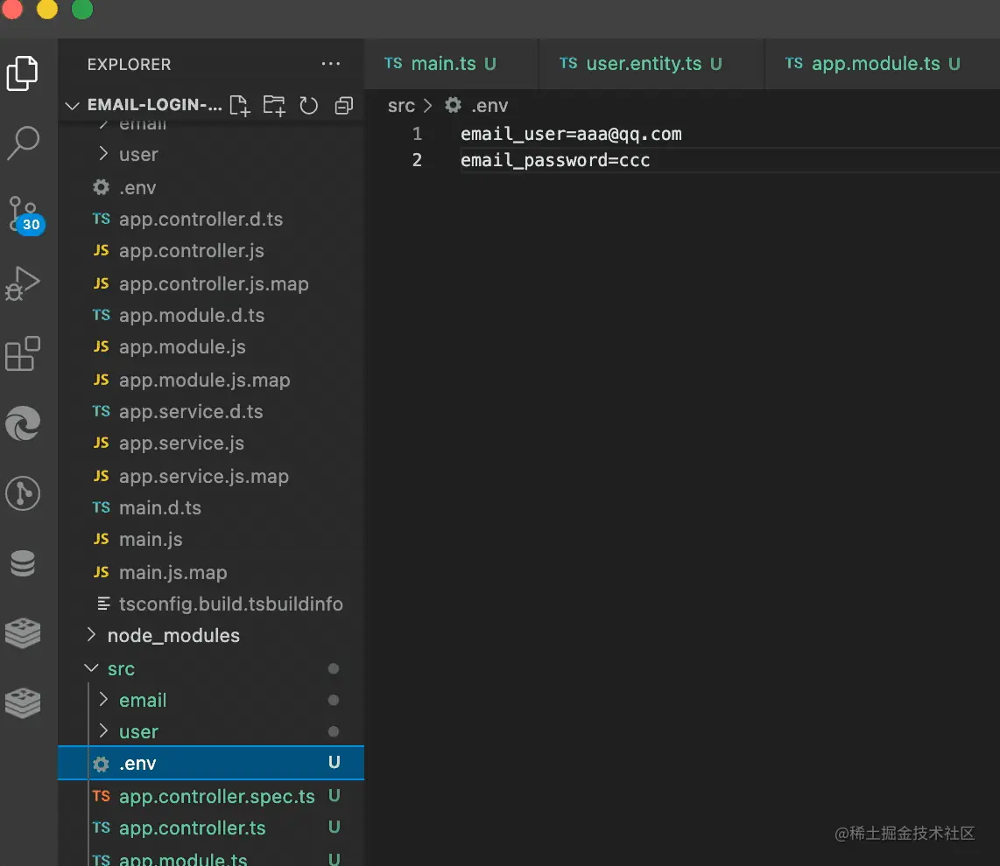

这时候可以加一个 watchAssets：

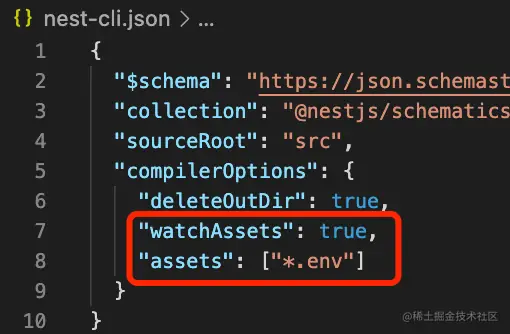

然后再重新跑下服务。

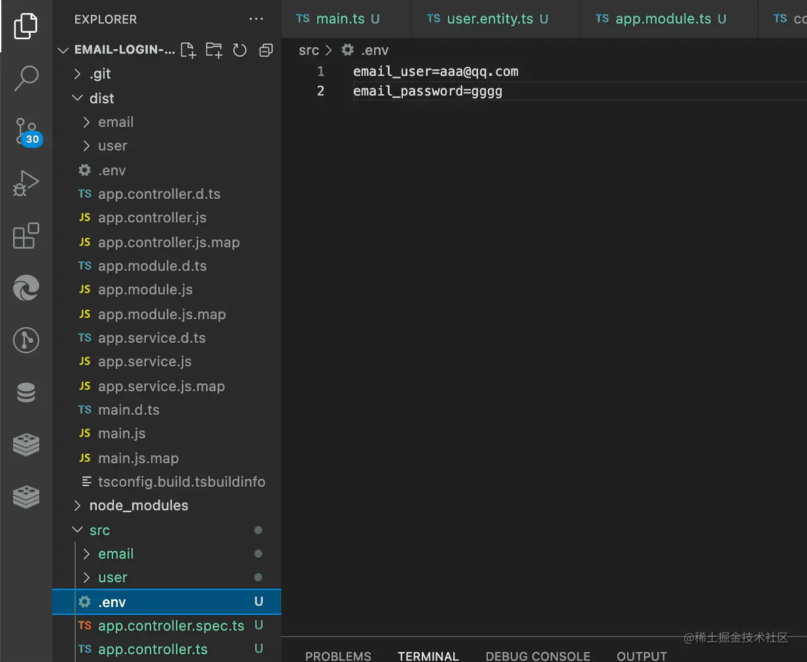

这时候改了 src 下的 .env 就会立刻复制了。

也就是说，**如果你用到了 .env 文件或者 yaml 等文件来配置，需要在 nest-cli.json 里配置下 assets 和 watchAssets。**

回过头来继续搞验证码的事情。

首先，验证码要随机，我们通过 Math.random 来生成：

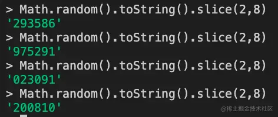

```javascript
const code = Math.random().toString().slice(2,8);
````
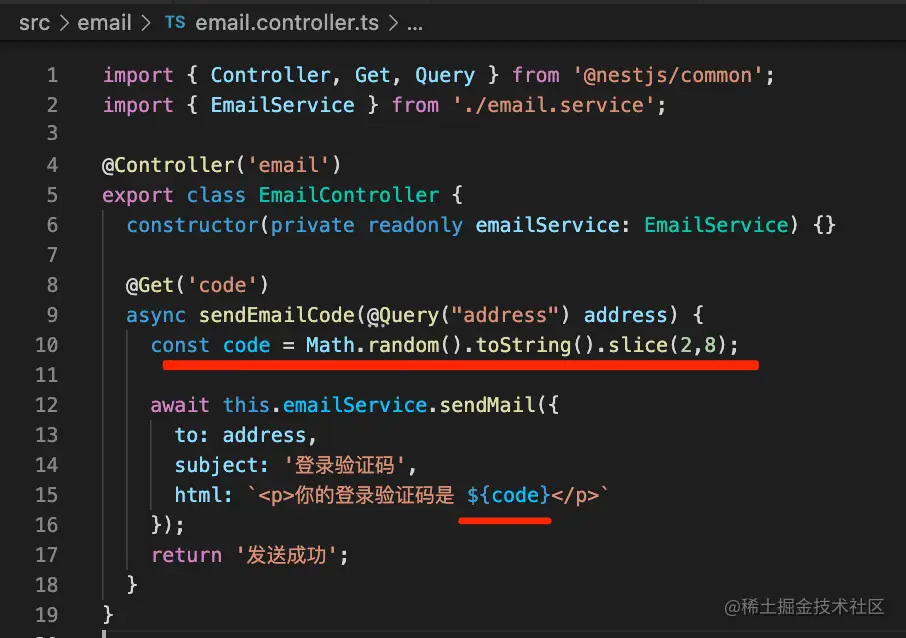

然后在前端项目里调用下看看：

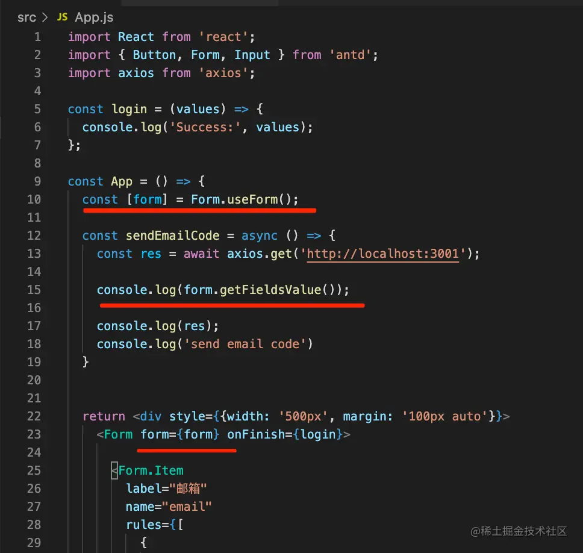

通过 useForm 创建 form 实例，然后就可以通过 form.getFieldsValue 拿到表单值了：

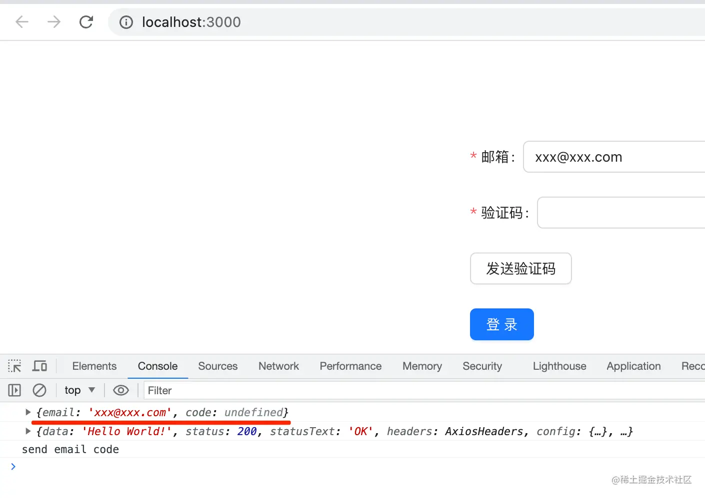

```javascript
import React from 'react';
import { Button, Form, Input } from 'antd';
import axios from 'axios';

const login = (values) => {
  console.log('Success:', values);
};

const App = () => {
  const [form] = Form.useForm();

  const sendEmailCode = async () => {
    const res = await axios.get('http://localhost:3001');
  
    console.log(form.getFieldsValue());

    console.log(res);
    console.log('send email code')
  }
  

  return <div style={{width: '500px', margin: '100px auto'}}>
    <Form form={form} onFinish={login}>

      <Form.Item
        label="邮箱"
        name="email"
        rules={[
          {
            required: true,
            message: '请输入邮箱地址',
          },
        ]}
      >
        <Input />
      </Form.Item>

      <Form.Item
        label="验证码"
        name="code"
        rules={[
          {
            required: true,
            message: '请输入验证码',
          },
        ]}
      >
        <Input/>
      </Form.Item>

      <Form.Item>
        <Button onClick={sendEmailCode}>发送验证码</Button>
      </Form.Item>

      <Form.Item>
        <Button type="primary" htmlType="submit">登录</Button>
      </Form.Item>

    </Form>
  </div>
};
export default App;
```

在点击发送验证码的时候，验证下邮箱是否为空，不为空就调用后端接口来发送验证码：

```javascript
import { message } from 'antd';

const App = () => {
  const [form] = Form.useForm();

  const sendEmailCode = async () => {
    const email = form.getFieldValue('email');
    
    console.log(email)
    if(!email) {
      message.error('邮箱不能为空');
      return;
    }

    const res = await axios.get('http://localhost:3001/email/code', {
      params: {
        address: email
      }
    });
  
    message.info(res.data);
  }
  
```

我们来试试看：

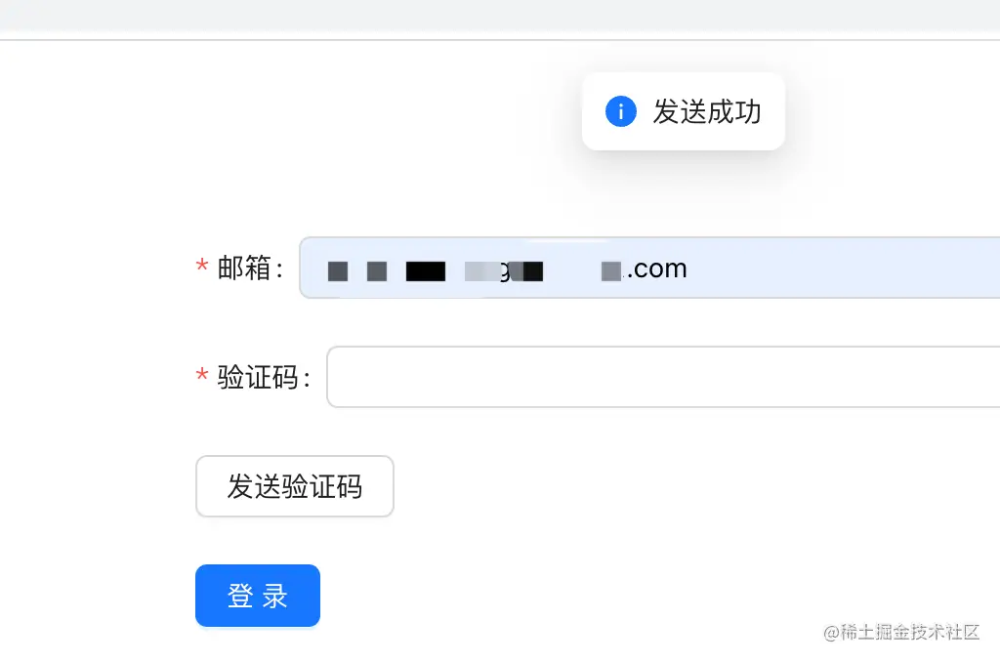

点击发送验证码，这个邮箱收到了一封验证码的邮件：

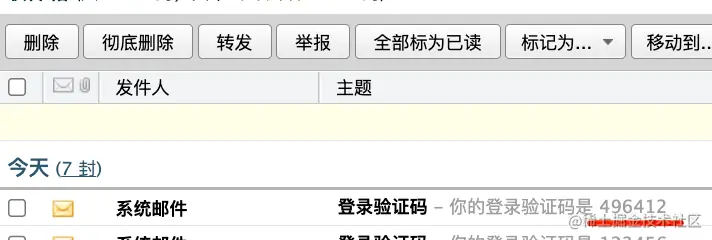

然后我们来实现下登录。

登录就是根据用户填的信息去数据库匹配，如果匹配到了就查询出该用户的信息，放入 session 或者 jwt 里。

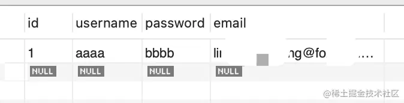

验证用户身份的信息，可以是用户名 + 密码，也可以是邮箱 + 验证码。
    
用邮箱验证码验证用户身份的流程是这样的：

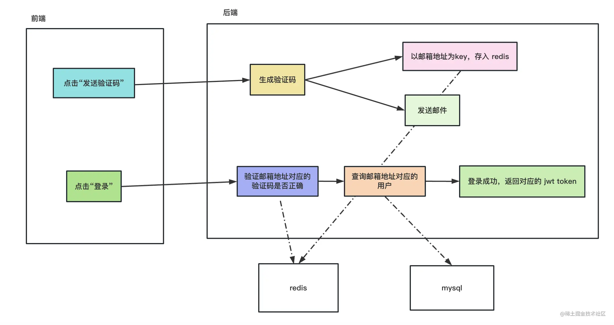

用户填入邮箱地址，点击发送验证码，后端会生成验证码，发送邮件。并且还要把这个验证码存入 redis，以用户邮箱地址为 key。

之后用户输入验证码，点击登录。

后端根据邮箱地址去 redis 中查询下验证码，和用户传过来的验证码比对下，如果一致，就从 mysql 数据库中查询该用户的信息，放入 jwt 中返回。

思路理清了，我们来实现下：

创建个 redis 模块：

```
nest g resource redis  --no-spec
```

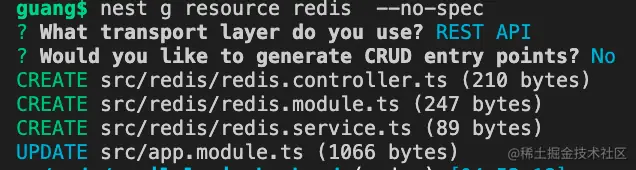

安装 redis 的包：
```
npm install redis --save
```

把 RedisModule 声明为全局模块，并导出 RedisService。

然后添加一个 provider：

```javascript
import { Global, Module } from '@nestjs/common';
import { RedisService } from './redis.service';
import { RedisController } from './redis.controller';
import { createClient } from 'redis';

@Global()
@Module({
  controllers: [RedisController],
  providers: [RedisService, {
    provide: 'REDIS_CLIENT',
    async useFactory() {
      const client = createClient({
          socket: {
              host: 'localhost',
              port: 6379
          }
      });
      await client.connect();
      return client;
    }
  }],
  exports: [RedisService]
})
export class RedisModule {}

```

在 RedisService 里封装 redis 的 get、set 方法：

```javascript
import { Inject, Injectable } from '@nestjs/common';
import { RedisClientType } from 'redis';

@Injectable()
export class RedisService {

    @Inject('REDIS_CLIENT') 
    private redisClient: RedisClientType;

    async get(key: string) {
        return await this.redisClient.get(key);
    }

    async set(key: string, value: string | number, ttl?: number) {
        await this.redisClient.set(key, value);

        if(ttl) {
            await this.redisClient.expire(key, ttl);
        }
    }
}
```

然后修改下发送邮箱验证码的逻辑：

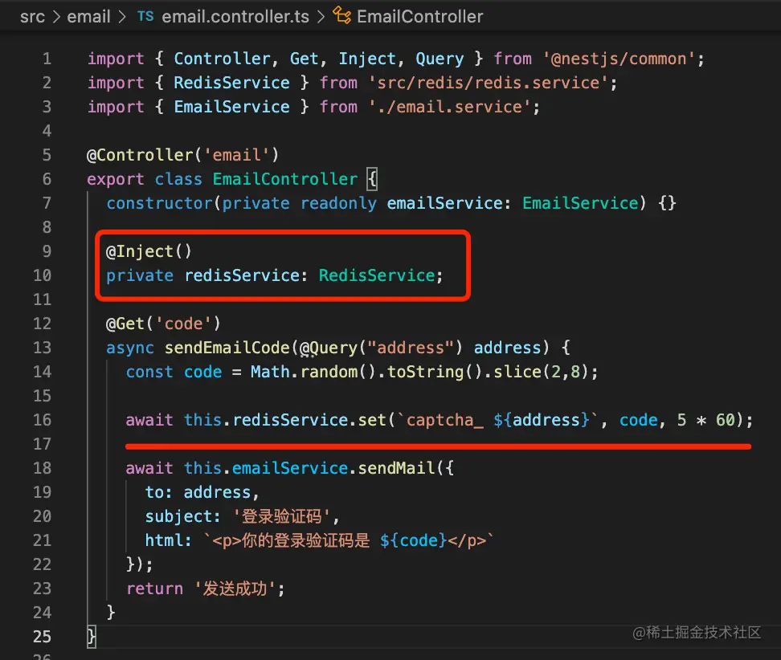

注入 RedisService，并且发送验证码之前把它存入 redis，key 为 captcha_邮箱地址。

这里的 captcha 就是验证码的意思。

过期时间为 5 分钟。

```javascript
import { Controller, Get, Inject, Query } from '@nestjs/common';
import { RedisService } from 'src/redis/redis.service';
import { EmailService } from './email.service';

@Controller('email')
export class EmailController {
  constructor(private readonly emailService: EmailService) {}

  @Inject()
  private redisService: RedisService;

  @Get('code')
  async sendEmailCode(@Query("address") address) {
    const code = Math.random().toString().slice(2,8);

    await this.redisService.set(`captcha_${address}`, code, 5 * 60);

    await this.emailService.sendMail({
      to: address,
      subject: '登录验证码',
      html: `<p>你的登录验证码是 ${code}</p>`
    });
    return '发送成功';
  }
}
```

我们试试看：

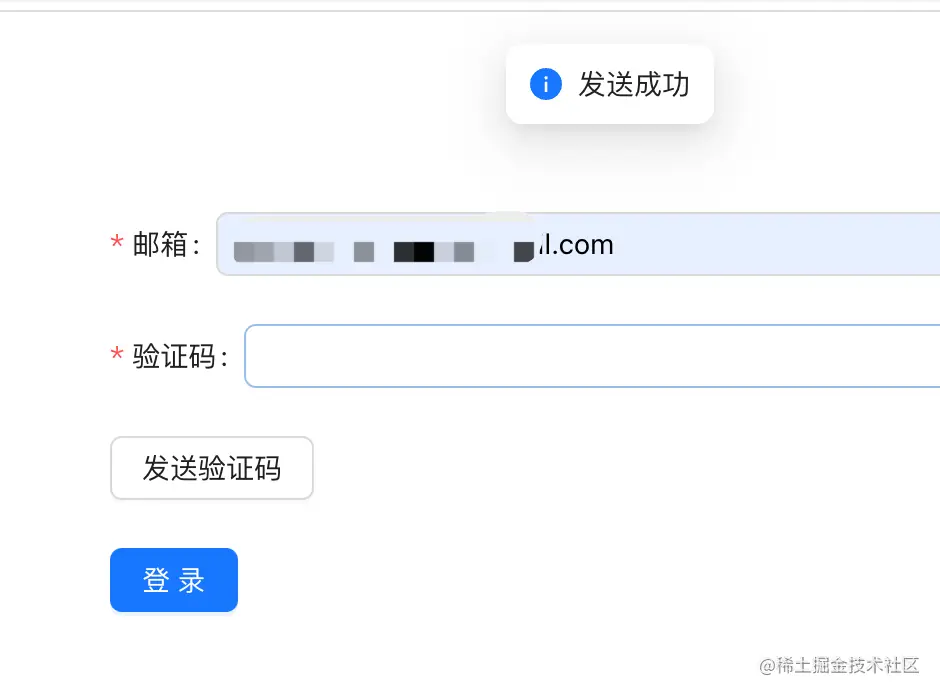

输入邮箱地址，点击发送验证码。

邮箱收到了这个验证码：

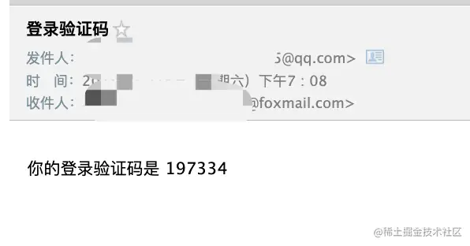

redis 里也保存了一份：

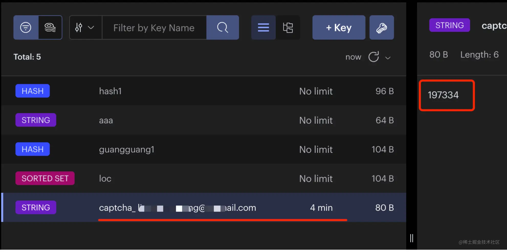

接下来只要填入这个验证码，点击登录就可以了：

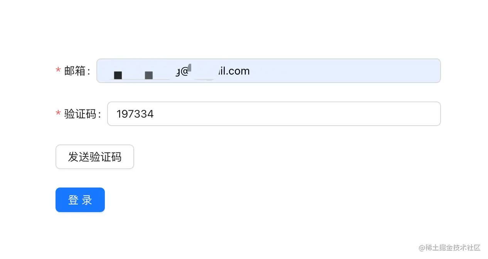

我们再来实现下登录接口：

在 UserController 里添加一个路由：

```javascript
@Post('login')
login(@Body() loginUserDto: LoginUserDto) {
    console.log(loginUserDto);
    return 'success';
}
```
定义这个 LoginUserDto：

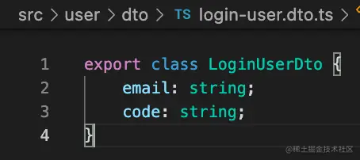

然后需要对它做校验，我们引入 class-validator 和 class-transformer：

```
npm install --save class-validator class-transformer
```
在 main.ts 里全局启用 ValidationPipe：

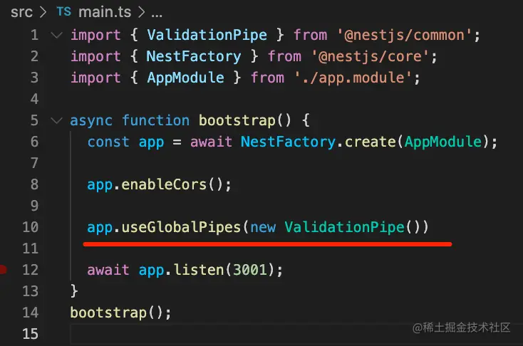

然后给 LoginUserDto 添加一些约束：

```javascript
import { IsEmail, IsNotEmpty, Length } from "class-validator";

export class LoginUserDto {
    @IsNotEmpty()
    @IsEmail()
    email: string;

    @IsNotEmpty()
    @Length(6)
    code: string;
}
```
在 postman 里测试下：

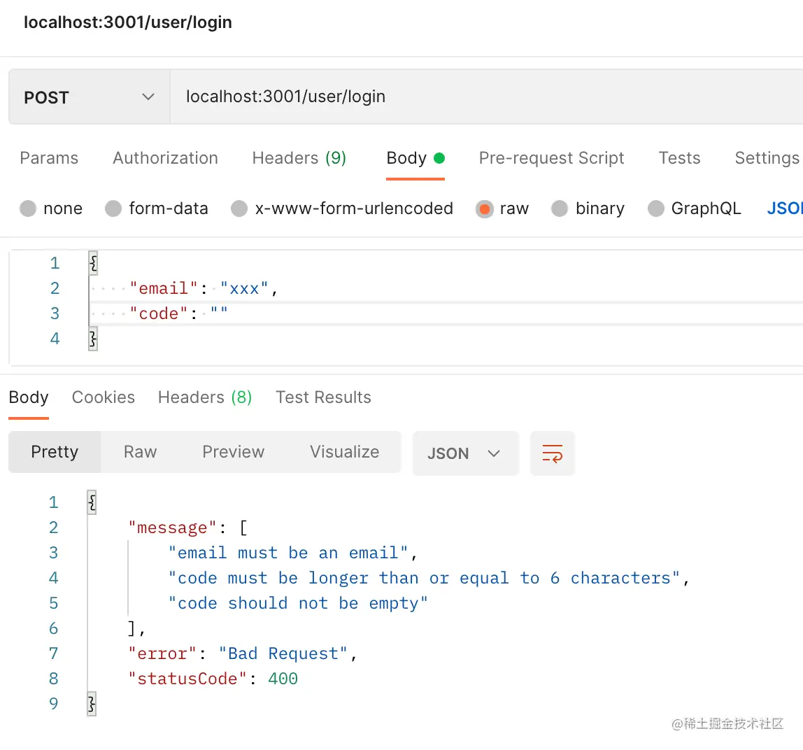

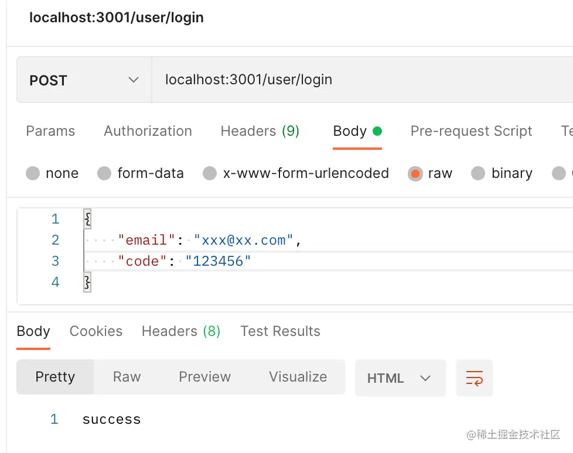

没啥问题。

我们来实现下具体的验证逻辑:

```javascript
@Inject(RedisService)
private redisService: RedisService;

@Post('login')
async login(@Body() loginUserDto: LoginUserDto) {

    const { email, code } = loginUserDto;

    const codeInRedis = await this.redisService.get(`captcha_${email}`);

    if(!codeInRedis) {
      throw new UnauthorizedException('验证码已失效');
    }
    if(code !== codeInRedis) {
      throw new UnauthorizedException('验证码不正确');
    }

    const user = await this.userService.findUserByEmail(email);

    console.log(user);

    return 'success';
}
```
从 redis 中查找这个邮箱对应的验证码。

如果没查找，就返回验证码已失效。

查到的话和用户传过来的验证码对比，如果不一致，就返回验证码不正确。

验证码通过之后，从数据库中查询这个用户的信息。

我们在 UserService 里实现下这个方法：

```javascript
@InjectEntityManager()
private entityManager: EntityManager;

async findUserByEmail(email: string) {
    return await this.entityManager.findOneBy(User, {
      email
    });
}
```
然后在前端代码里调用下：

```javascript
const login = async (values) => {
  const res = await axios.post('http://localhost:3001/user/login', {
    email: values.email,
    code: values.code
  });
  if(res.data === 'success') {
    message.success('登录成功');
  } else {
    message.error(res.data.message);
  }
};
```
我们整体试一下：


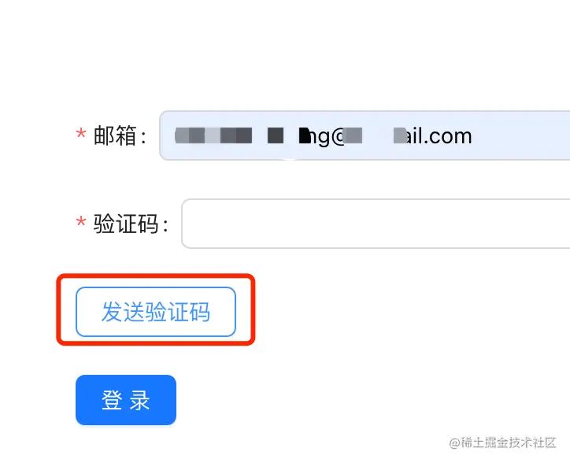

输入邮箱，点击发送验证码。

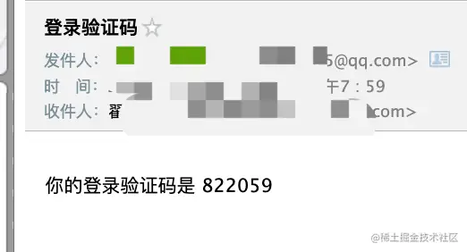

收到了验证码邮件，并且 redis 里也存了这个 key：

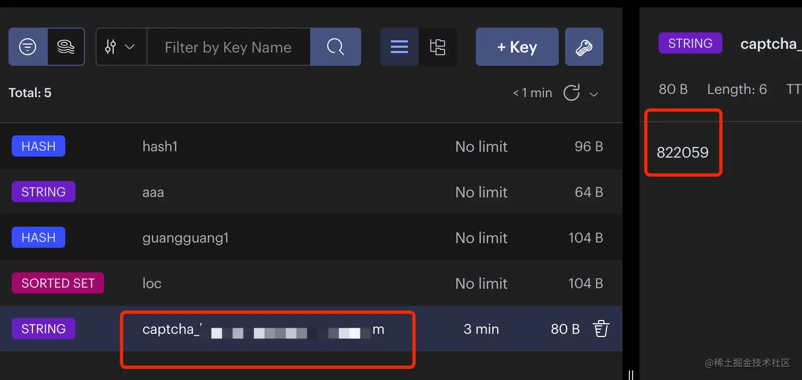

带上这个验证码请求：

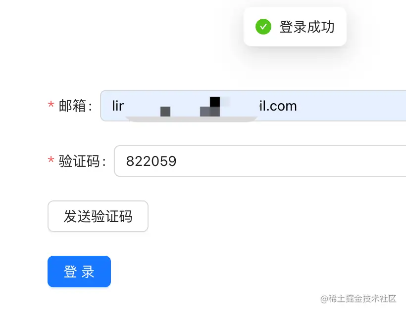

可以看到服务端通过了校验，并且从数据库中查询出了用户信息：

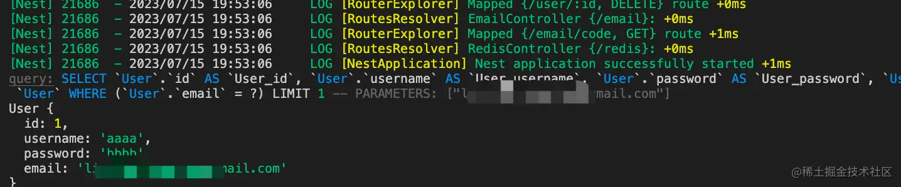

接下来只要返回对应的 jwt token 就好了。

这部分可以参考前面 jwt 登录章节的内容，就不展开了。

案例代码上传了小册仓库：

[前端代码](https://github.com/QuarkGluonPlasma/nestjs-course-code/tree/main/email-login-frontend)

[后端代码](https://github.com/QuarkGluonPlasma/nestjs-course-code/tree/main/email-login-backend)

## 总结

这节我们实现了基于邮箱验证码的登录。

流程可以看这张图：

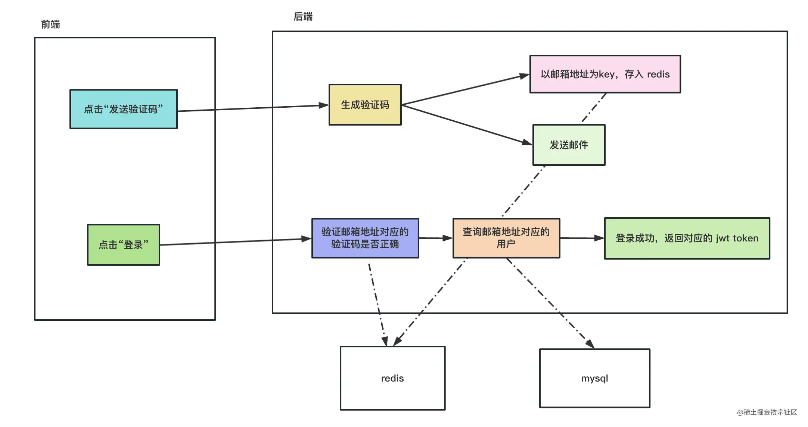

综合用到了 mysql、redis、typeorm、nodemailer 等技术。

并且使用 @nestjs/config 包的 ConfigModule 来封装配置。

要注意的是，如果用了 .env 文件，需要保证它在 src 下，并且要在 nest-cli.json 里配置 assets 和 watchAssets，不然 build 的时候不会复制到 dist 下。

这节实现的功能，前后端代码都有，算是一个不错的综合练习。
