# 91. 定时任务 + Redis 实现阅读量计数

文章都会有个阅读量，那这个阅读量是怎么计数的呢？

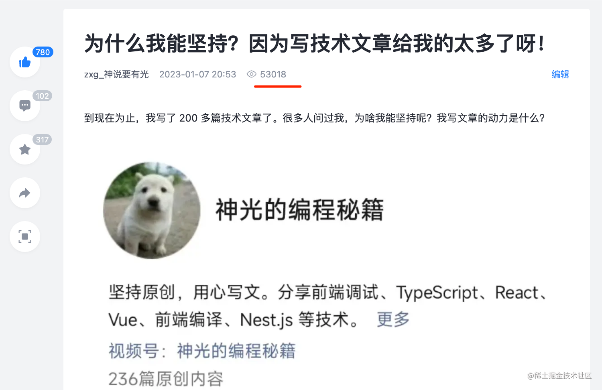

有同学说，很简单啊，这不就是文章表里加个 views 的字段，然后每次刷新页面都加一么？

这样是可以，但有两个问题：

- 每次刷新阅读量都加一，其实还是同一个人看的这篇文章，这样统计出来的阅读量是不准的，我们想要的阅读量是有多少人看过这篇文章

- 阅读是个很高频的操作，直接存到数据库，数据库压力会太大

这两个问题分别都怎么解决呢？

其实我们学完 Redis 就应该能想到解决方案了：

- 在 redis 中存储 user 和 article 的关系，比如 user_111_article_222 为 key，10 分钟后删除，如果存在这个 key，就说明该用户看过这篇文章，就不更新阅读量，否则才更新

    10 分钟后，这个人再看这篇文章，就可以算是新的一次阅读量了。

- 访问文章时把阅读量加载到 redis，之后的阅读量计数只更新 redis，不更新数据库，等业务低峰期再把最新的阅读量写入数据库

    这里在业务低峰期，比如凌晨 4 点的时候写入数据库，可以用定时任务来做。


思路理清了，我们来实现一下：

```
nest new article-views -p npm
```

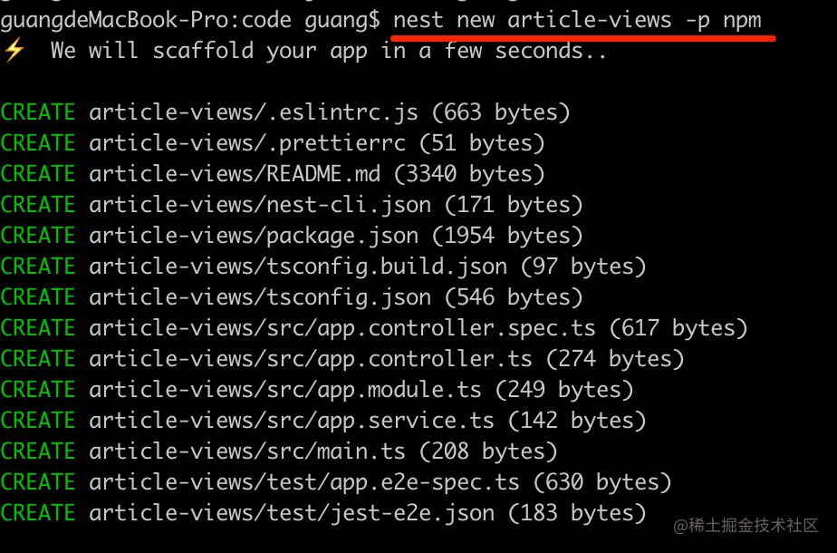

创建个 nest 项目。

安装 typeorm 相关的包：

```
npm install --save @nestjs/typeorm typeorm mysql2
```

在 AppModule 引入 TypeOrmModule：

```javascript
import { Module } from '@nestjs/common';
import { TypeOrmModule } from '@nestjs/typeorm';
import { AppController } from './app.controller';
import { AppService } from './app.service';

@Module({
  imports: [ 
    TypeOrmModule.forRoot({
      type: "mysql",
      host: "localhost",
      port: 3306,
      username: "root",
      password: "guang",
      database: "article_views",
      synchronize: true,
      logging: true,
      entities: [],
      poolSize: 10,
      connectorPackage: 'mysql2',
      extra: {
          authPlugin: 'sha256_password',
      }
    }),
  ],
  controllers: [AppController],
  providers: [AppService],
})
export class AppModule {}
```
在 mysql workbench 里创建这个 database

```
CREATE DATABASE article_views DEFAULT CHARACTER SET utf8mb4;
```

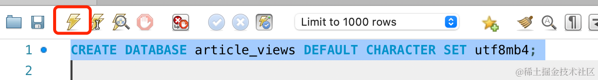

刷新可以看到这个 database

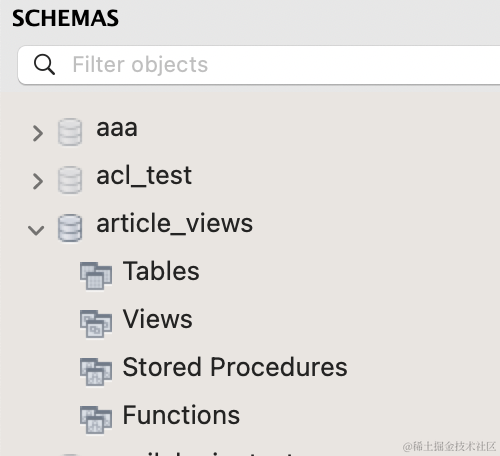

然后建个文章和用户的模块：

```javascript
nest g resource user --no-spec
nest g resource article --no-spec
```

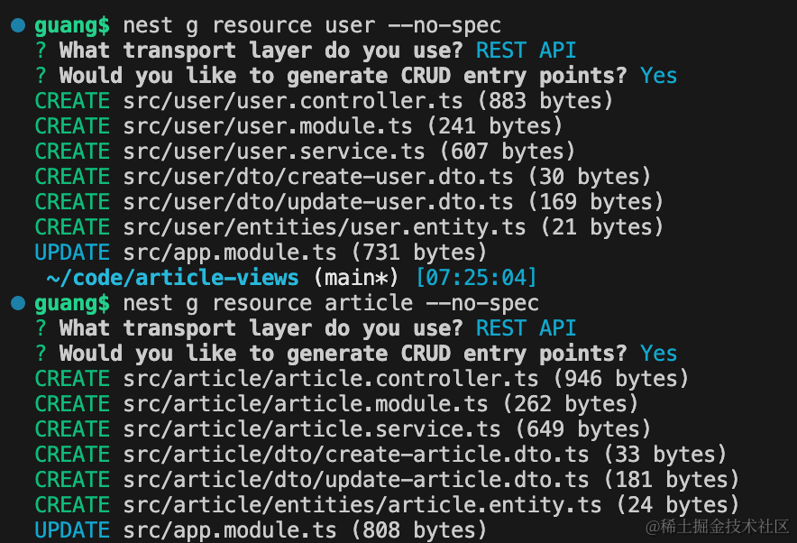

添加 user 和 article 的 entity

```javascript
import { Column, PrimaryGeneratedColumn, Entity } from "typeorm";

@Entity()
export class User {
    @PrimaryGeneratedColumn()
    id: number;

    @Column({
        comment: '用户名'
    })
    username: string;

    @Column({
        comment: '密码'
    })
    password: string;
}
```
```javascript
import { Column, Entity, PrimaryGeneratedColumn } from "typeorm";

@Entity()
export class Article {
    @PrimaryGeneratedColumn()
    id: number;

    @Column({
        comment: '文章名字',
        length: 50
    })
    title: string;

    @Column({
        comment: '内容',
        type: 'text'
    })
    content: string;

    @Column({
        comment: '阅读量',
        default: 0
    })
    viewCount: number;

    @Column({
        comment: '点赞量',
        default: 0
    })
    likeCount: number;

    @Column({
        comment: '收藏量',
        default: 0
    })
    collectCount: number;
}

```
在 entities 引入：

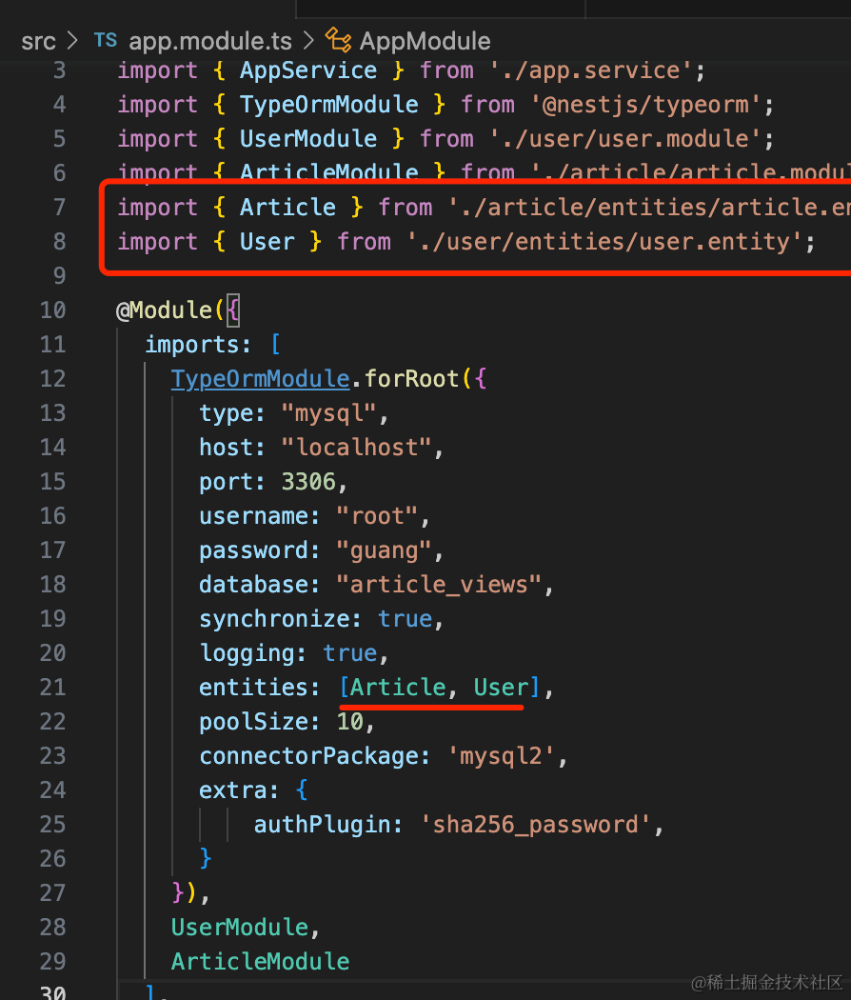

可以看到 typeorm 自动创建了这两个表：

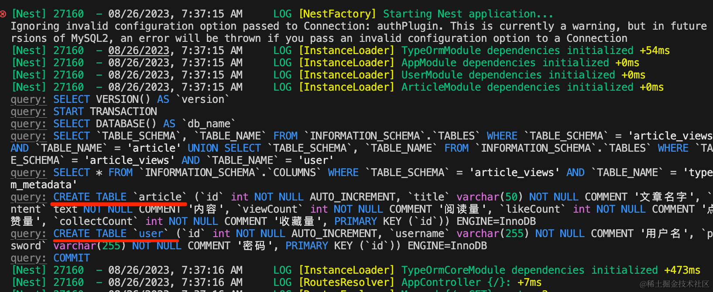

然后插入一些数据：

在 AppController 创建 init-data 的路由，然后注入 EntityManager：

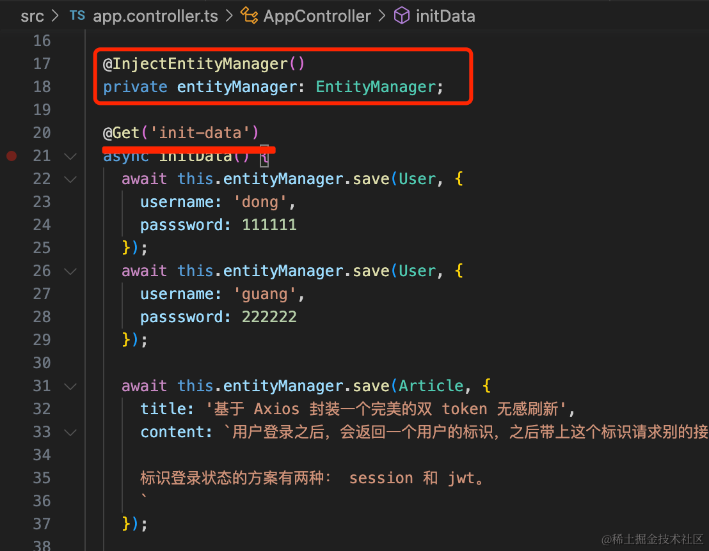

```javascript
@InjectEntityManager()
  private entityManager: EntityManager;

  @Get('init-data')
  async initData() {
    await this.entityManager.save(User, {
      username: 'dong',
      password: '111111'
    });
    await this.entityManager.save(User, {
      username: 'guang',
      password: '222222'
    });

    await this.entityManager.save(Article, {
      title: '基于 Axios 封装一个完美的双 token 无感刷新',
      content: `用户登录之后，会返回一个用户的标识，之后带上这个标识请求别的接口，就能识别出该用户。

      标识登录状态的方案有两种： session 和 jwt。
      `
    });

    await this.entityManager.save(Article, {
      title: 'Three.js 手写跳一跳小游戏',
      content: `前几年，跳一跳小游戏火过一段时间。

      玩家从一个方块跳到下一个方块，如果没跳过去就算失败，跳过去了就会再出现下一个方块。`
    });
    return 'done';
  }
```
两个 entity 分别插入 2 条数据。

浏览器访问下：

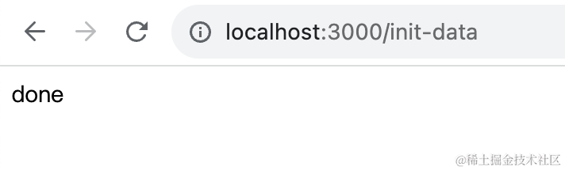


可以看到 4 条 insert 语句：

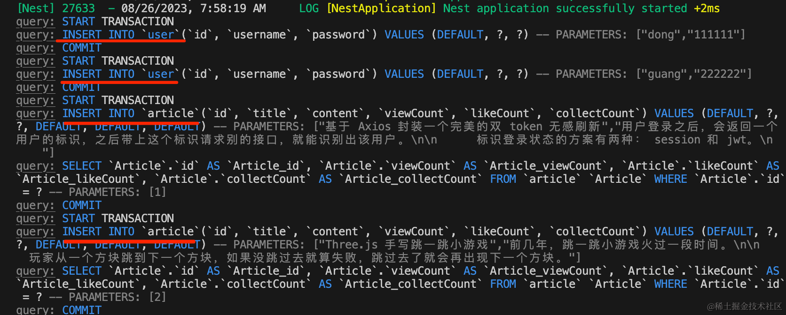

在 mysql workbench 里也可以看到两个表都插入了数据：

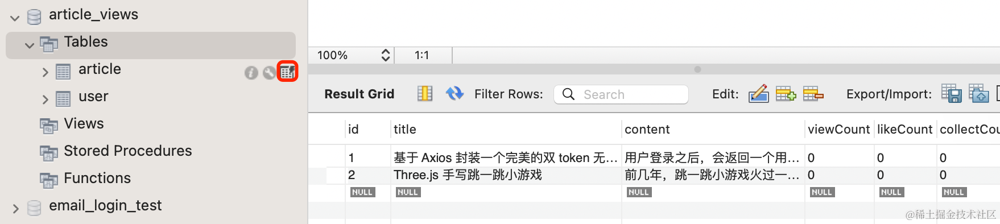

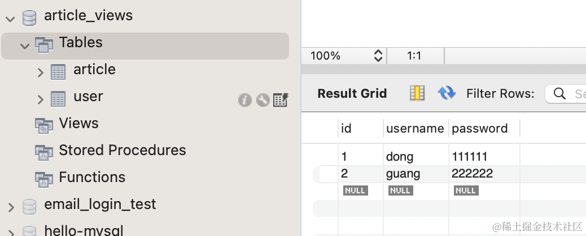

然后先实现登录：

这次用 session 的方案：

安装相关的包：
```
npm install express-session @types/express-session
```
在 main.ts 里启用：

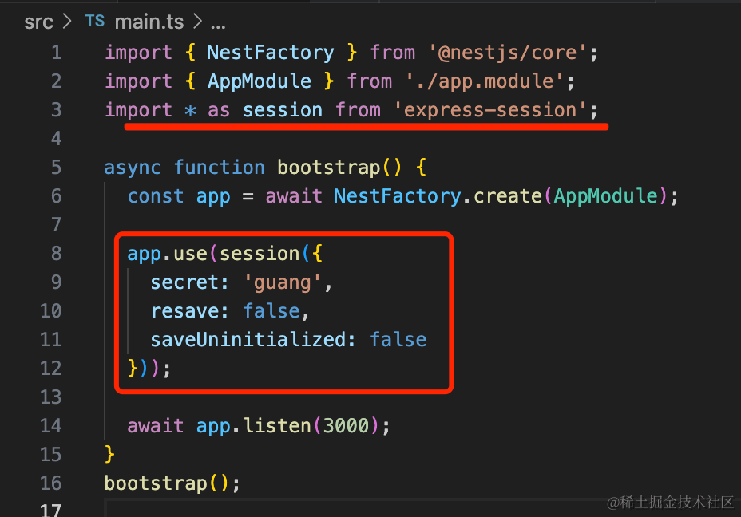

```javascript
import { NestFactory } from '@nestjs/core';
import { AppModule } from './app.module';
import * as session from 'express-session';

async function bootstrap() {
  const app = await NestFactory.create(AppModule);

  app.use(session({
    secret: 'guang',
    resave: false,
    saveUninitialized: false
  }));

  await app.listen(3000);
}
bootstrap();
```

然后实现下登录：

在 UserController 添加 login 的路由：

```javascript
@Post('login')
async login(@Body() loginUserDto: LoginUserDto) {
    console.log(loginUserDto);
    return 'success';
}
```
新建 src/user/dto/login-user.dto.ts

```javascript
export class LoginUserDto {
    username: string;

    password: string;
}
```
测试下：

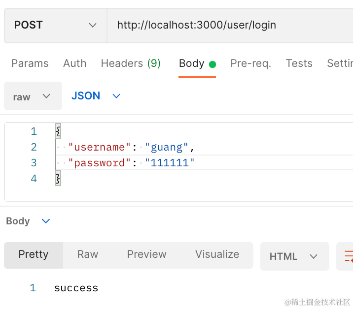

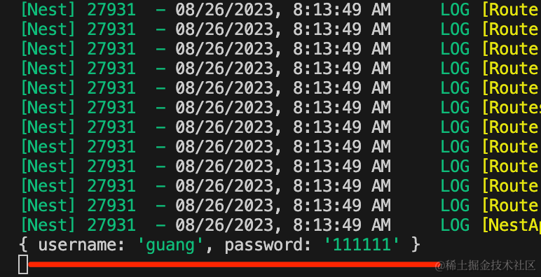

然后在 UserService 实现登录逻辑：

```javascript
@InjectEntityManager()
private entityManager: EntityManager;

async login(loginUser: LoginUserDto) {
    const user = await this.entityManager.findOne(User, {
      where: {
        username: loginUser.username
      }
    });

    if(!user) {
      throw new BadRequestException('用户不存在');
    }

    if(user.password !== loginUser.password) {
      throw new BadRequestException('密码错误');
    }

    return user;
}
```
在 UserController 调用下：

```javascript
@Post('login')
async login(@Body() loginUserDto: LoginUserDto, @Session() session) {
    const user = await this.userService.login(loginUserDto);

    session.user = {
        id: user.id,
        username: user.username
    }

    return 'success';
}
```
调用 userService 的 login 方法，实现登录验证，然后把用户信息存入 session。

当用户不存在时：

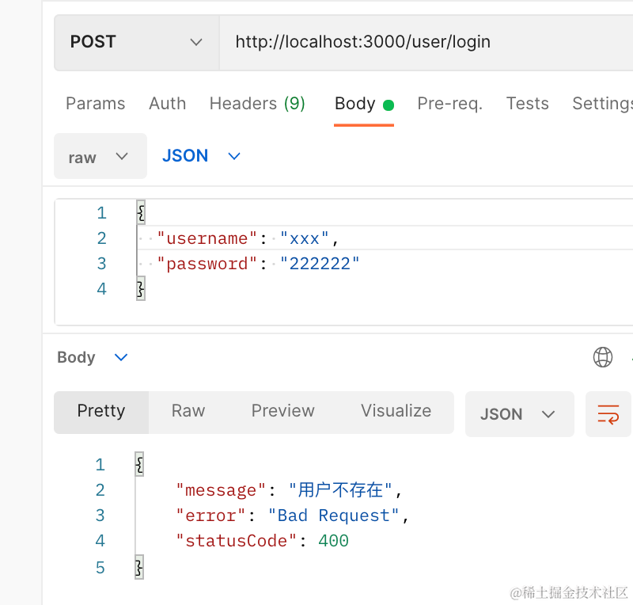

当密码错误时：

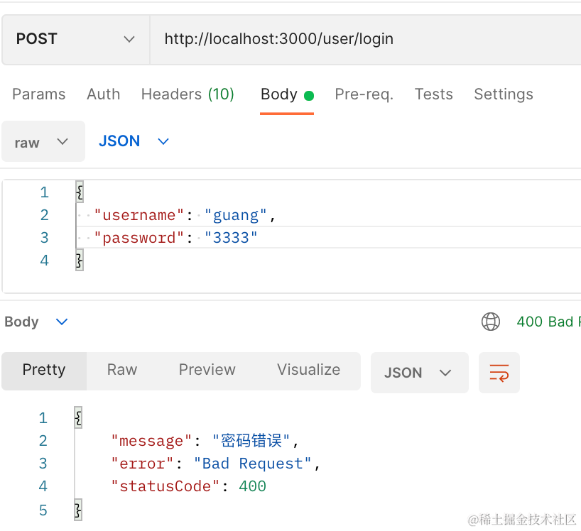

登录成功时：

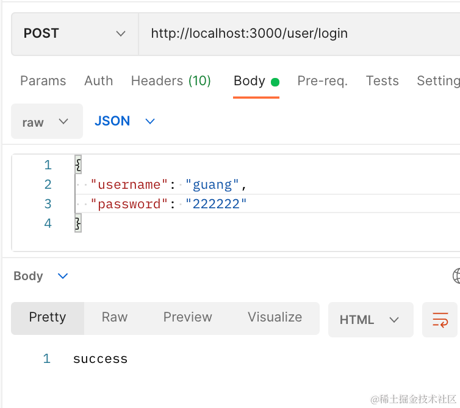

然后在 ArticleController 添加一个查询文章的接口：

```javascript
@Get(':id')
async findOne(@Param('id') id: string) {
    return await this.articleService.findOne(+id);
}
```
实现 articleService.findOne 方法：

```javascript
@InjectEntityManager()
private entityManager: EntityManager;

async findOne(id: number) {
    return await this.entityManager.findOneBy(Article, {
      id
    });
}
```
测试下：

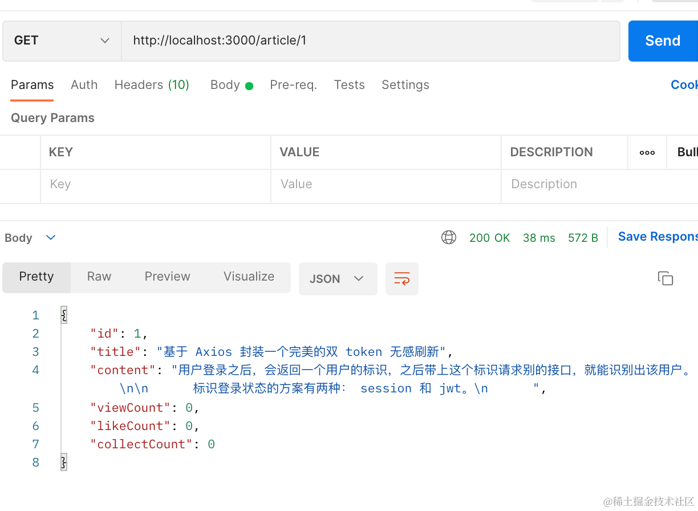

然后我们在 ArticleController 加一个阅读的接口：

```javascript
@Get(':id/view')
async view(@Param('id') id: string) {
    return await this.articleService.view(+id);
}
```
然后在 ArticleService 里实现具体的逻辑：

```javascript
async view(id: number) {
    const article = await this.findOne(id);

    article.viewCount ++;

    await this.entityManager.save(article);

    return article.viewCount;
}
```
测试下：

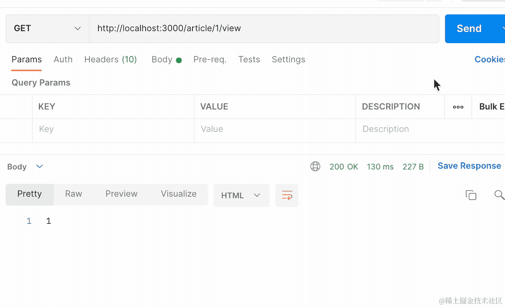

数据库里阅读量确实更新了：

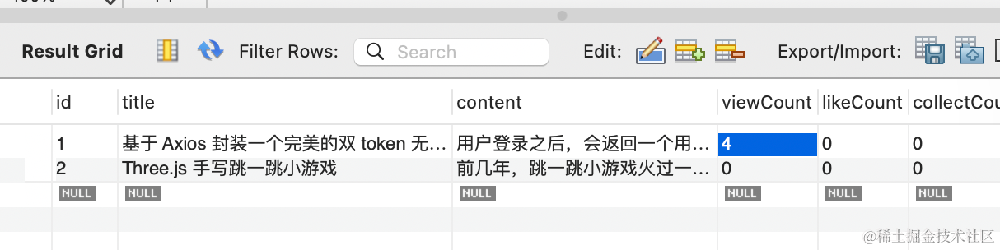

再次查询出来的就是新的阅读量：

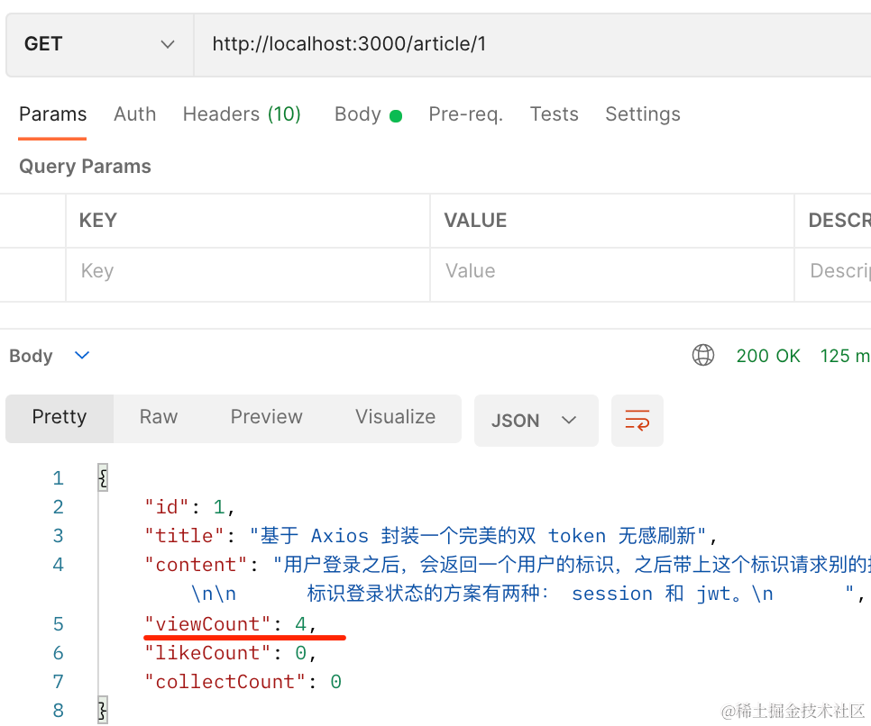

这样是能实现功能，但有前面我们讲到的两个问题：

- 每次刷新阅读量都加一，其实还是同一个人看的这篇文章，这样统计出来的阅读量是不准的，我们想要的阅读量是有多少人看过这篇文章

- 阅读是个很高频的操作，直接存到数据库，数据库压力会太大

所以，我们要引入 redis。

安装 redis 的包：

```
npm install --save redis
```

然后创建个 redis 模块：

```
nest g module redis
nest g service redis
```

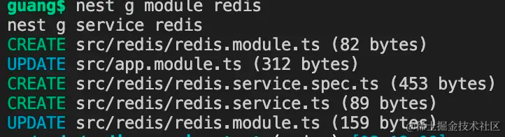

在 RedisModule 创建连接 redis 的 provider，导出 RedisService，并把这个模块标记为 @Global 模块

```javascript
import { Global, Module } from '@nestjs/common';
import { createClient } from 'redis';
import { RedisService } from './redis.service';

@Global()
@Module({
  providers: [
    RedisService,
    {
      provide: 'REDIS_CLIENT',
      async useFactory() {
        const client = createClient({
            socket: {
                host: 'localhost',
                port: 6379
            }
        });
        await client.connect();
        return client;
      }
    }
  ],
  exports: [RedisService]
})
export class RedisModule {}
```

然后在 RedisService 里注入 REDIS_CLIENT，并封装一些方法：

```javascript
import { Inject, Injectable } from '@nestjs/common';
import { RedisClientType } from 'redis';

@Injectable()
export class RedisService {

    @Inject('REDIS_CLIENT') 
    private redisClient: RedisClientType;

    async get(key: string) {
        return await this.redisClient.get(key);
    }

    async set(key: string, value: string | number, ttl?: number) {
        await this.redisClient.set(key, value);

        if(ttl) {
            await this.redisClient.expire(key, ttl);
        }
    }

    async hashGet(key: string) {
        return await this.redisClient.hGetAll(key);
    }

    async hashSet(key: string, obj: Record<string, any>, ttl?: number) {
        for(let name in obj) {
            await this.redisClient.hSet(key, name, obj[name]);
        }

        if(ttl) {
            await this.redisClient.expire(key, ttl);
        }
    }
}
```
我们封装了 get、set、hashGet、hashSet 方法，分别是对 redis 的 string、hash 数据结构的读取。

然后在 view 方法里引入 redis：

```javascript
@Inject(RedisService)
private redisService: RedisService;

async view(id: number) {
    const res = await this.redisService.hashGet(`article_${id}`);

    if(res.viewCount === undefined) {
      const article = await this.findOne(id);

      article.viewCount ++;

      await this.entityManager.save(article);

      await this.redisService.hashSet(`article_${id}`, {
        viewCount: article.viewCount,
        likeCount: article.likeCount,
        collectCount: article.collectCount
      });

      return article.viewCount;

    } else {
      await this.redisService.hashSet(`article_${id}`, {
        ...res,
        viewCount: +res.viewCount + 1
      });
      return +res.viewCount + 1;
    }
}
```
先查询 redis，如果没查到就从数据库里查出来返回，并存到 redis 里。

查到了就更新 redis 的 viewCount，直接返回 viewCount + 1

测试下：


服务端打印了 3 条 sql：

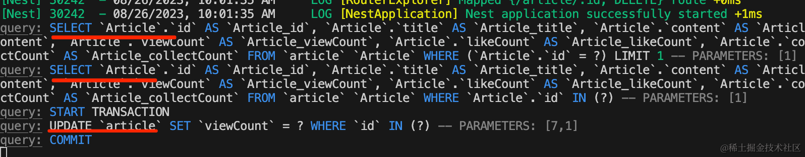

redis 里也有了这个 hash 的结构：

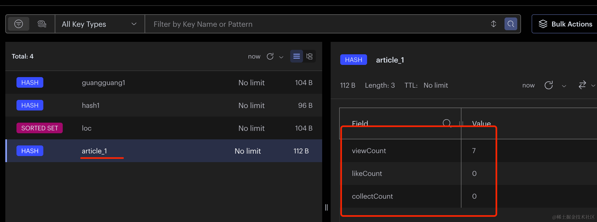

为什么是 3 条呢？

因为 findOne 发一条 select，save 会先发一条 select，再发一条 update。

我们可以优化一下，把 save 换成 update：

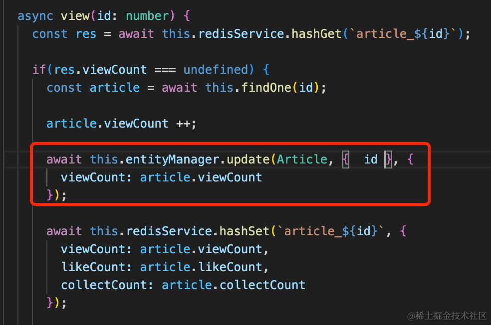

```javascript
await this.entityManager.update(Article, {  id }, {
    viewCount: article.viewCount
});
```
然后把 redis 那条数据删掉：

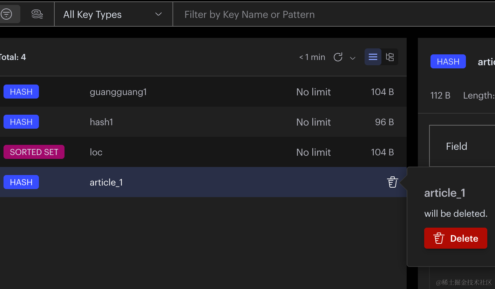

重新跑一下：

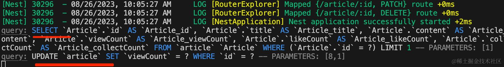

现在就只有一条 select、一条 update 了。

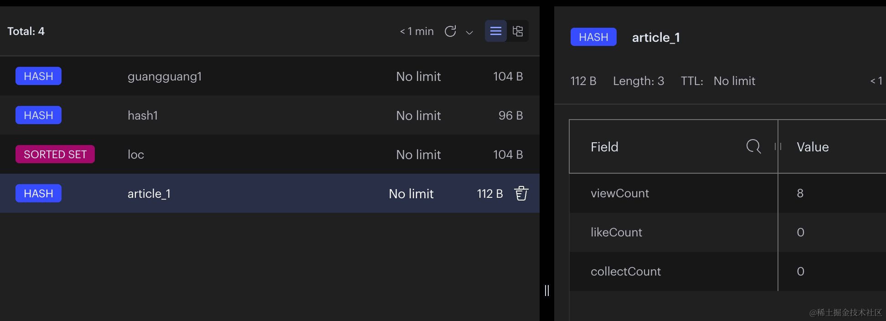

然后多刷新几次：

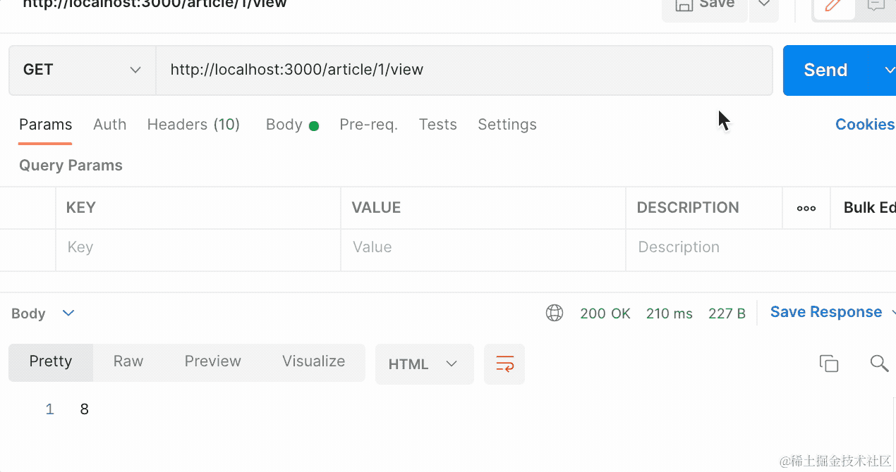

没发送 sql，还是之前那两条：

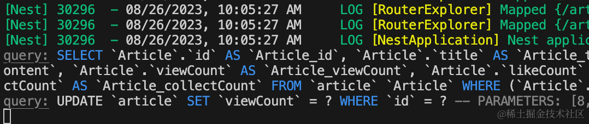

因为这时候查的是 redis。

redis 里数据更新了：

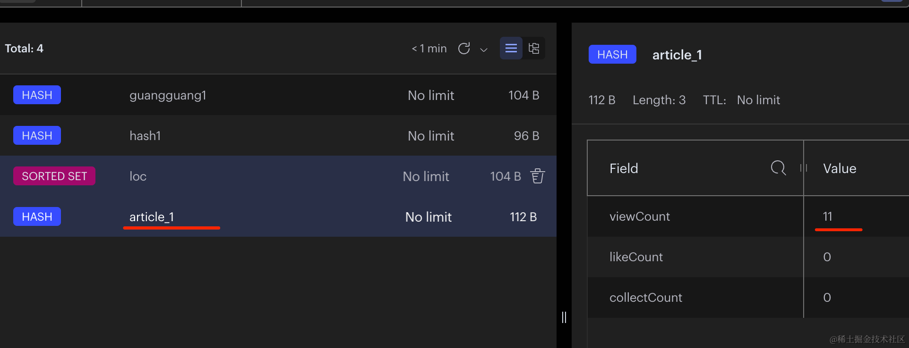

但是数据库里的 viewCount 还是 8

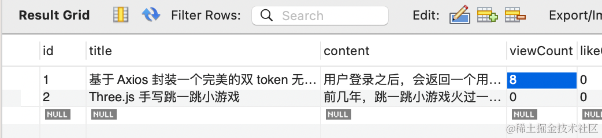

这样一重启 redis 数据就没了。

所以还要同步到数据库。

同步倒是不用很频繁，可以放在凌晨 4 点，访问量少的时候通过定时任务同步数据库。

我们需要引入定时任务包 @nestjs/schedule

```
npm install --save @nestjs/schedule
```

在 AppModule 引入下：

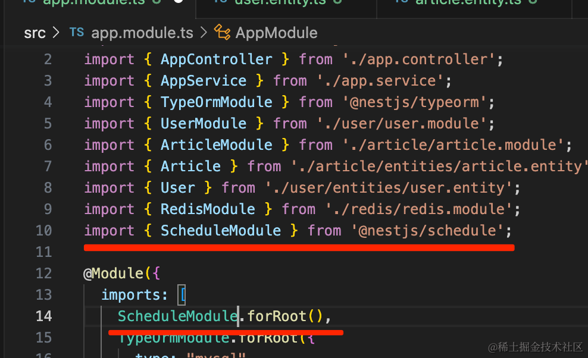

然后创建一个 service：
```
nest g module task
nest g service task
```


定义个方法，通过 @Cron 声明每 10s 执行一次：

```javascript
import { Injectable, Logger } from '@nestjs/common';
import { Cron, CronExpression } from '@nestjs/schedule';

@Injectable()
export class TasksService {

  @Cron(CronExpression.EVERY_10_SECONDS)
  handleCron() {
    console.log('task execute')
  }
}
```
然后就可以看到控制台会每 10s 打印一次

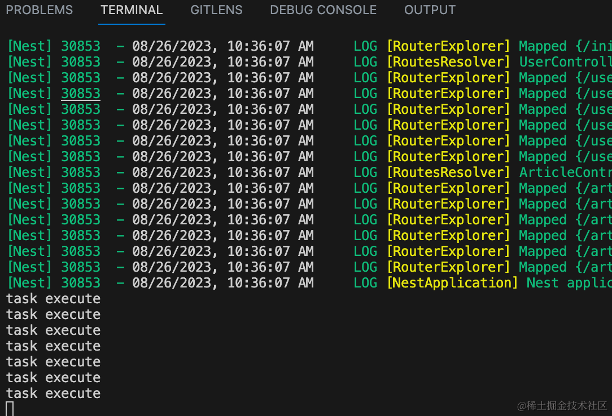

我们在 TaskModule 引入 ArticleModule：

```javascript
import { Module } from '@nestjs/common';
import { TaskService } from './task.service';
import { ArticleModule } from 'src/article/article.module';

@Module({
  imports: [
    ArticleModule
  ],
  providers: [TaskService]
})
export class TaskModule {}
```
并且在 ArticleModule 导出 ArticleService

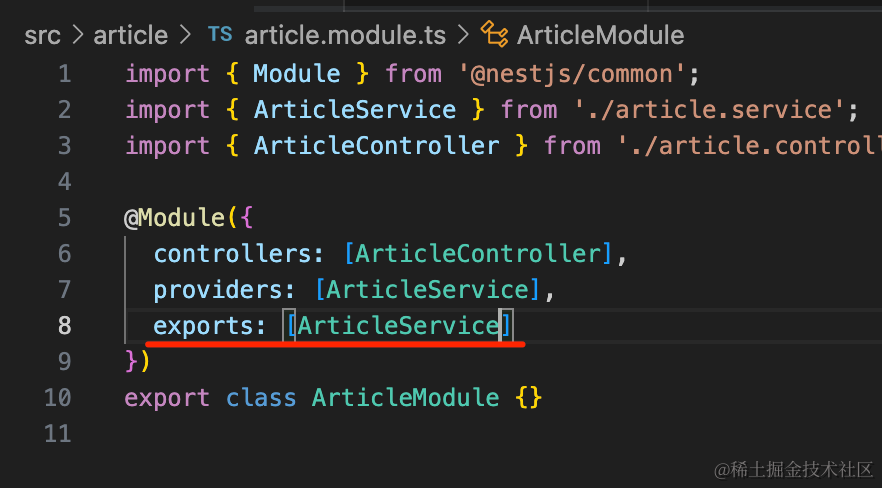

然后在 TaskService 里注入 articleService 
```javascript
import { Inject, Injectable, Logger } from '@nestjs/common';
import { Cron, CronExpression } from '@nestjs/schedule';
import { ArticleService } from 'src/article/article.service';

@Injectable()
export class TaskService {

  @Inject(ArticleService)
  private articleService: ArticleService;

  @Cron(CronExpression.EVERY_MINUTE)
  async handleCron() {
    await this.articleService.flushRedisToDB();
  }
}
```

每分钟执行一次，调用 articleService 的 flushRedisToDB 方法。

然后我们实现这个方法：

先在 RedisService 添加一个 keys 方法，用来查询 key：

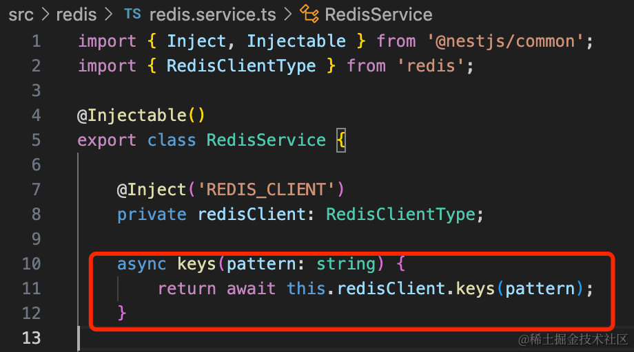

```javascript
async keys(pattern: string) {
    return await this.redisClient.keys(pattern);
}
```
然后在 ArticleService 里实现同步数据库的逻辑：

```javascript
async flushRedisToDB() {
    const keys = await this.redisService.keys(`article_*`);
    console.log(keys);
}
```

我们先打印下 keys。

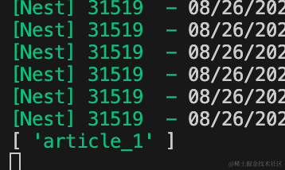

现在只有一个 key，我们再访问下另一篇文章


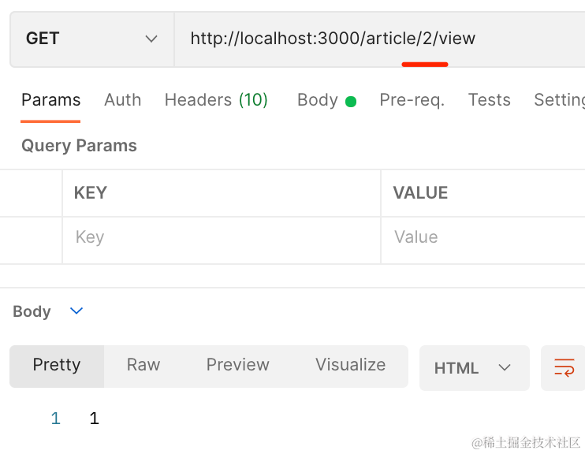

现在就有 2 个 key 了：

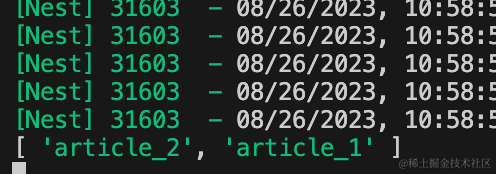

我们把所有的 key 对应的值存入数据库：

```javascript
async flushRedisToDB() {
    const keys = await this.redisService.keys(`article_*`);

    for (let i = 0; i < keys.length; i++) {
      const key = keys[i];

      const res = await this.redisService.hashGet(key);

      const [, id] = key.split('_');

      await this.entityManager.update(Article, {
        id: +id
      }, {
        viewCount: +res.viewCount,        
      });
    }
}
```

查询出 key 对应的值，更新到数据库。

测试下：
  
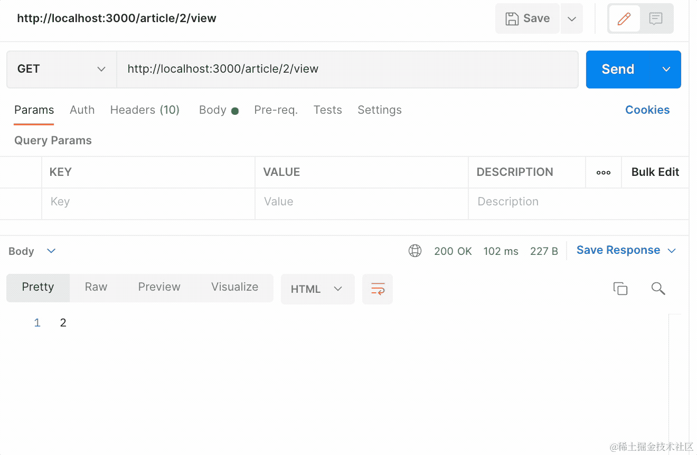

刷新几次 view 接口，redis 里阅读量增加了：

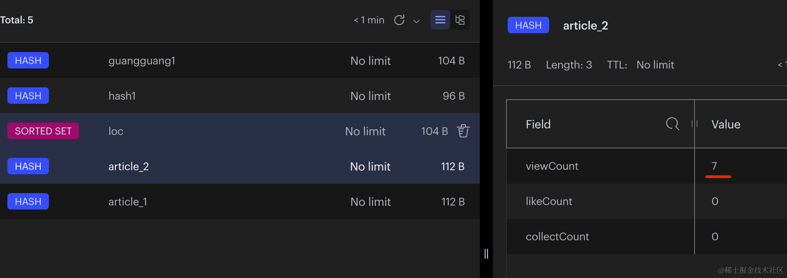

但是数据库里没变：

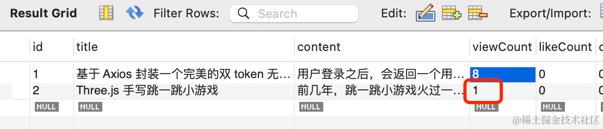

过了一会，控制台打印了 2 条 update 语句：

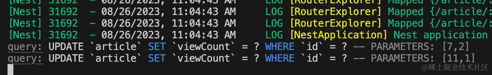

数据库里的数据就更新了：

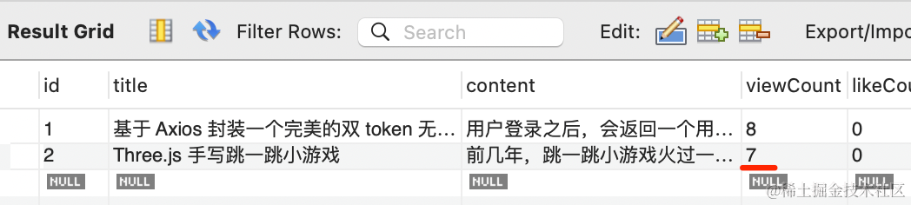

接下来只要把定时任务的执行时间改为 4 点就好了：

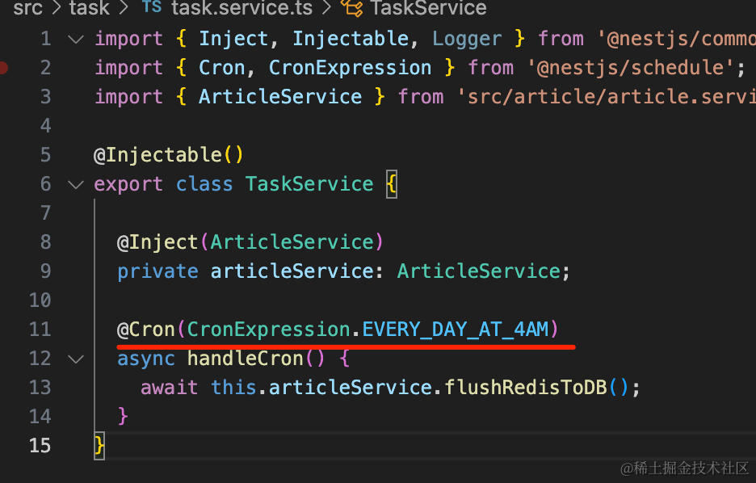

```javascript
@Cron(CronExpression.EVERY_DAY_AT_4AM)
```
这样，基于 redis 的阅读量缓存，以及定时任务更新数据库就完成了。

还有剩下的一个问题：

- 每次刷新阅读量都加一，其实还是同一个人看的这篇文章，这样统计出来的阅读量是不准的，我们想要的阅读量是有多少人看过这篇文章

我们可以在用户访问文章的时候在 redis 存一个 10 分钟过期的标记，有这个标记的时候阅读量不增加。

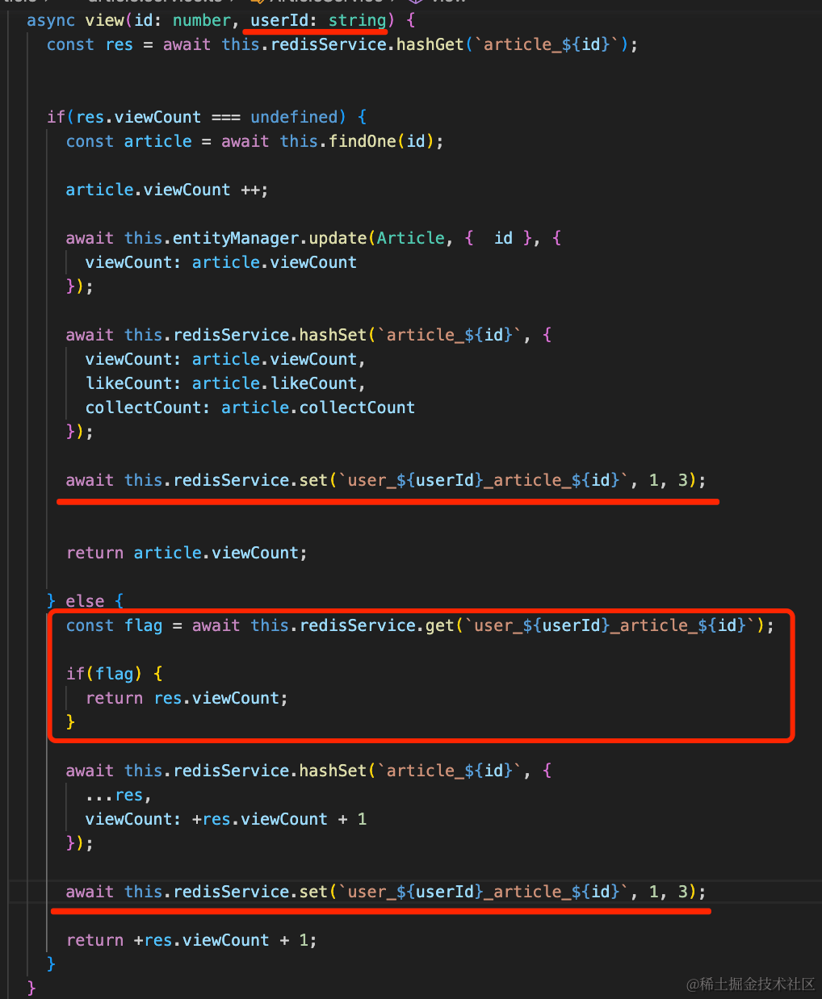

```javascript
await this.redisService.set(`user_${userId}_article_${id}`, 1, 3);
```
为了测试方便，我们先设置 3s 过期。

```javascript
const flag = this.redisService.get(`user_${userId}_article_${id}`);

if(flag) {
    return res.viewCount;
}
```
这里需要传入 userId。

我们在 ArticleController 的 view 方法里传入下：

```javascript
@Get(':id/view')
async view(@Param('id') id: string, @Session() session, @Req() req) {
    return await this.articleService.view(+id, session?.user?.id || req.ip);
}
```

试试看：

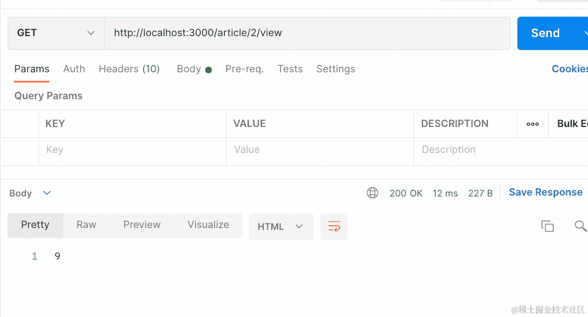

可以看到，现在就不是每次刷新都增加阅读量了，而是 3s 之后再刷新才增加。

在 redis 里可以看到这个 key：

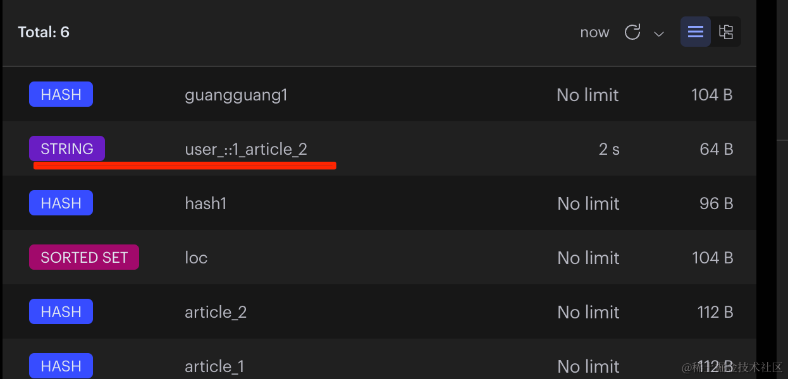

只不过现在没登录，用的是 ip，而本地访问的时候获取的 ip 就是 ::1 这样的，线上就能拿到具体的 ip 了。

然后我们登录下再访问：

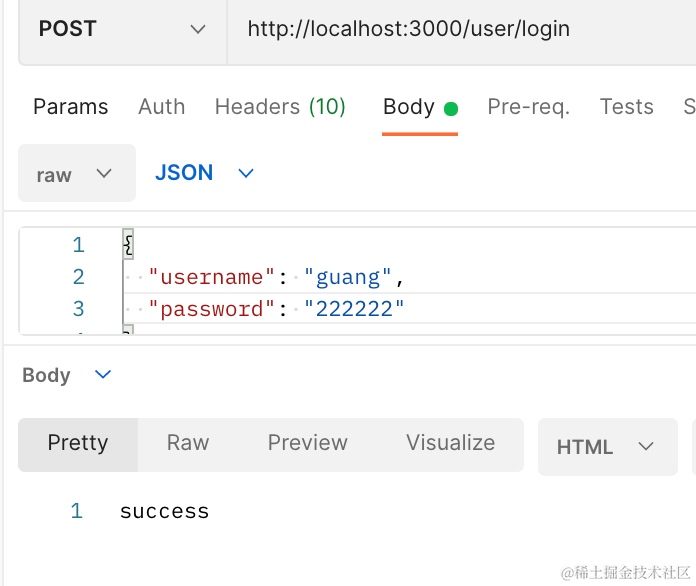

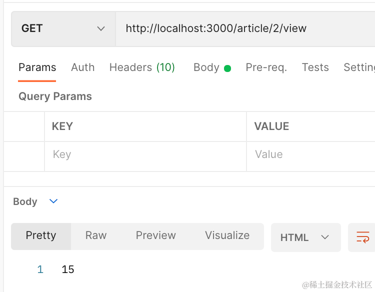

这时用的就是用户 id 了：

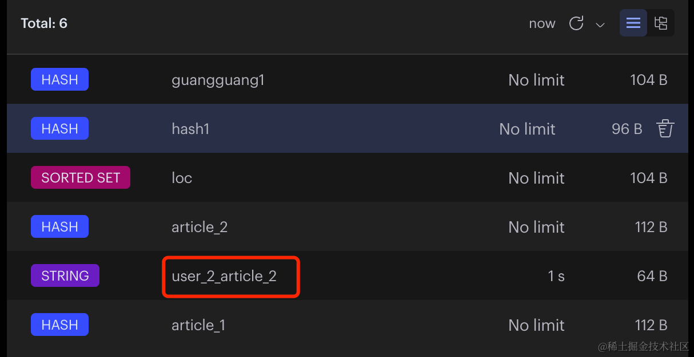

这样就实现了真实的阅读量计数。

案例代码上传了[小册仓库](https://github.com/QuarkGluonPlasma/nestjs-course-code/tree/main/article-views)。

## 总结

我们通过 redis + 定时任务实现了阅读量计数的功能。

因为阅读是个高频操作，所以我们查出数据后存在 redis里，之后一直访问 redis 的数据，然后通过定时任务在凌晨 4 点把最新数据写入数据库。

并且为了统计真实的用户阅读量，我们在 redis 存储了用户看了哪篇文章的标识，10 分钟后过期。

这就是我们常见的阅读量功能的实现原理。
