# 94. HttpModule + pinyin 实现天气预报查询服务

今天我们来实现一个查询城市天气预报的服务。

使用的是和风天气的免费 api。

免费的接口一天可以请求 1000 次，自己的项目足够用了：

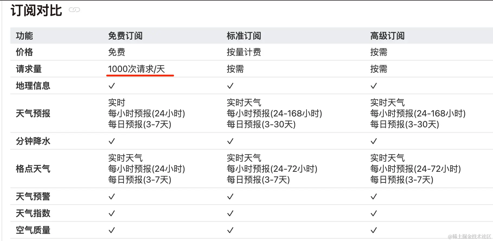

最多可以查询未来 7 天的天气预报。

首先，登录[和风天气](https://id.qweather.com/#/login)，

然后在用户中心绑定邮箱和手机号：

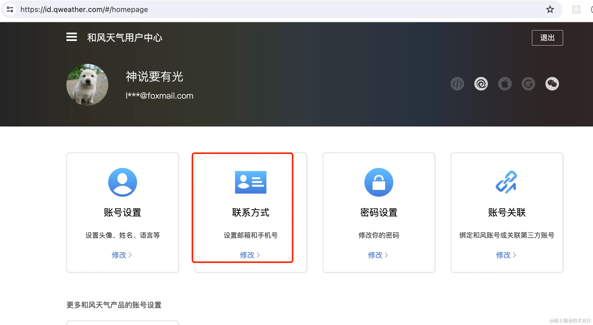

之后进入[控制台](https://console.qweather.com/#/console)，点击创建项目：

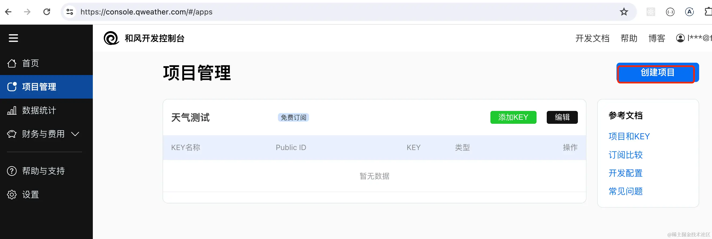

这里大家选择免费订阅（我别的项目用了，就没免费名额了），指定 key 的名字：

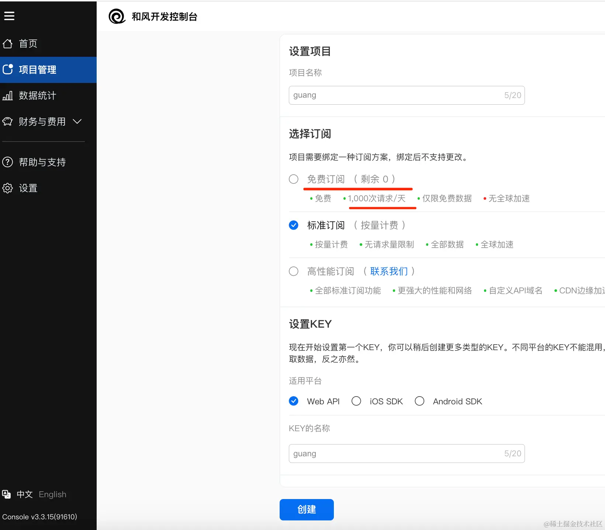

然后就可以看到你的 key 了：

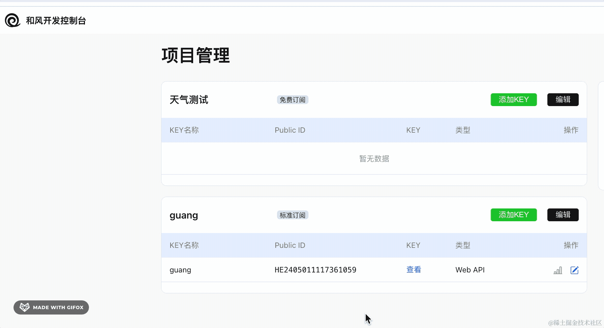

如果我们要查询青岛未来 7 天的天气。

需要先查询青岛的 id：

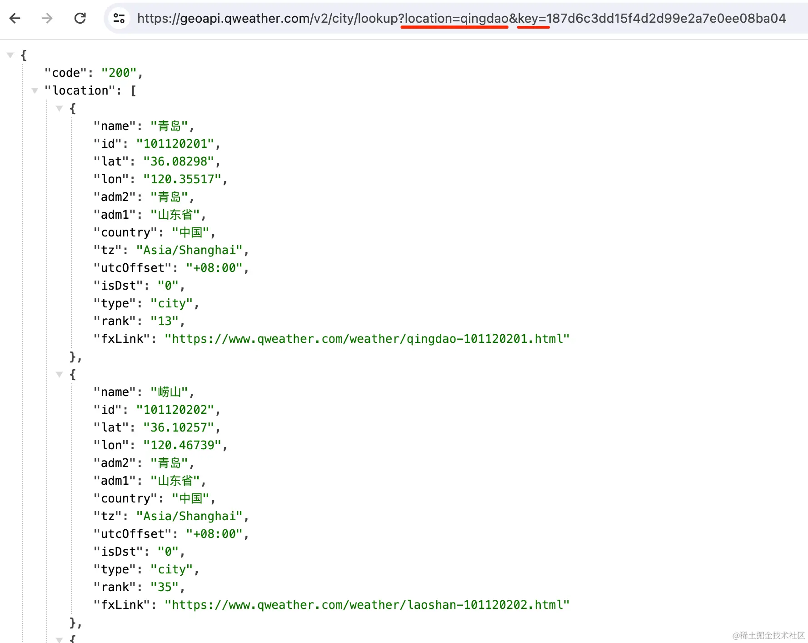

location 是城市名字的拼音，然后带上刚刚的 key：

```
https://devapi.qweather.com/v7/weather/7d?location=101120606&key=aff40f07926348b9b06f3229d2b52e6a
```
返回了青岛市和各个区的信息。

有了城市 id 之后就可以查询天气了：

```
https://api.qweather.com/v7/weather/7d?location=101120201&key=187d6c3dd15f4d2d99e2a7e0ee08ba04
```

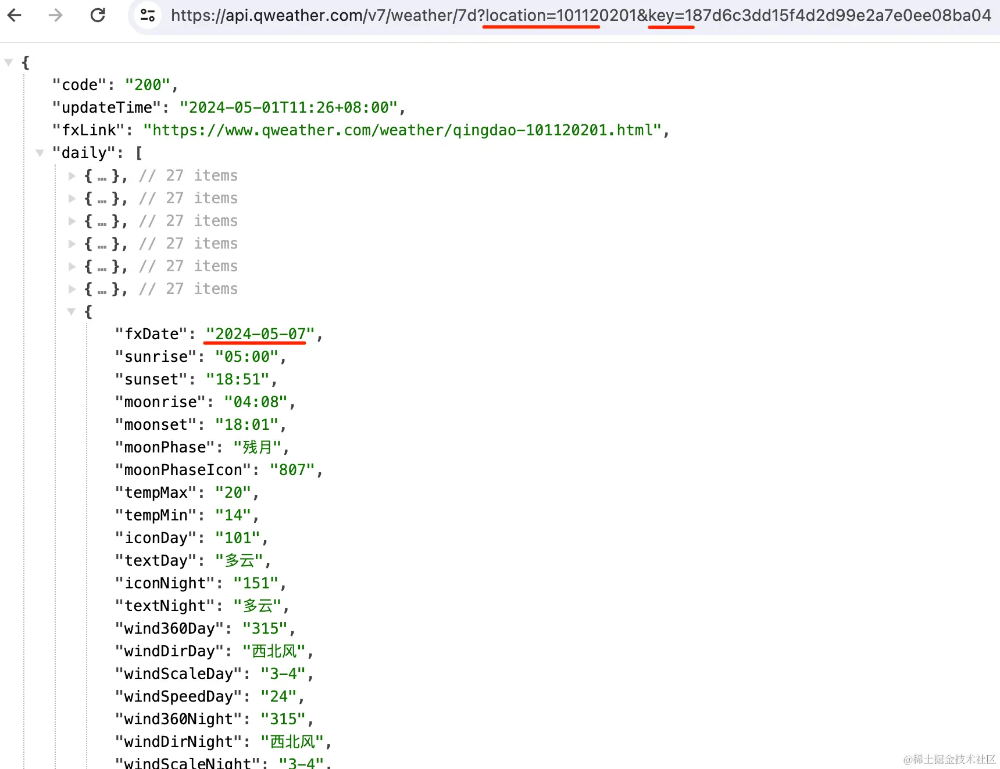

这里返回了从 2024-5-1 到 2024-5-7 的天气。

具体字段的解释可以看[文档](https://dev.qweather.com/docs/api/weather/weather-daily-forecast/#%E8%BF%94%E5%9B%9E%E6%95%B0%E6%8D%AE)：

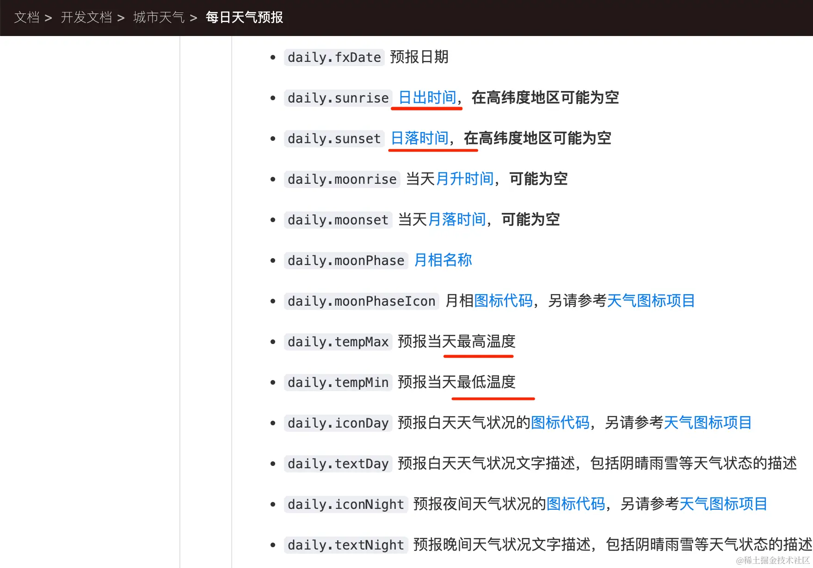

这样我们就实现了查询某个城市为了 7 天的天气的功能。

还有个问题，现在是先用城市的拼音查的 id，再用 id 查的天气。

那直接让用户输入城市拼音么？

这样也不好，我们可以用 pinyin 这个包：

它可以拿到中文的拼音：

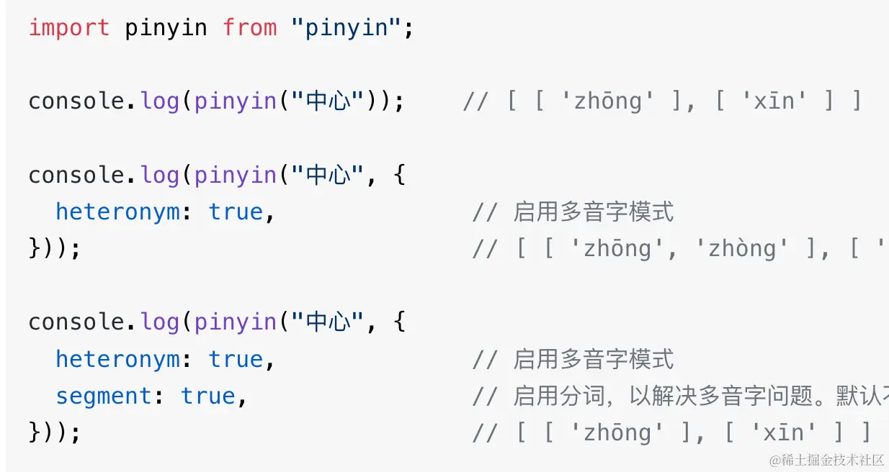

这样，整个流程就串起来了。

当然，如果你想让用户直接选择城市，然后查询城市的天气，这种就要拿到所有城市的信息了。

网上有挺多这种 [JSON 数据](https://blog.csdn.net/qq_32353771/article/details/82221604)的：

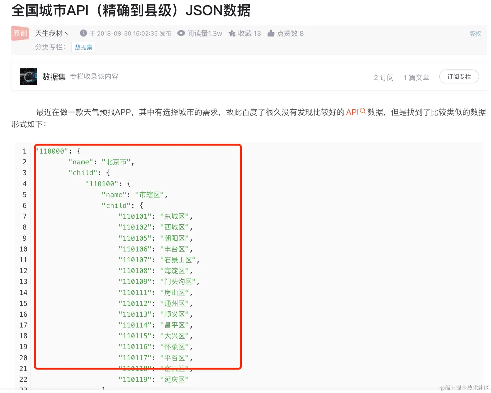

有所有城市名和它的 id。

思路理清了，我们来写下代码：

```
npm install -g @nestjs/cli

nest new city-weather
```
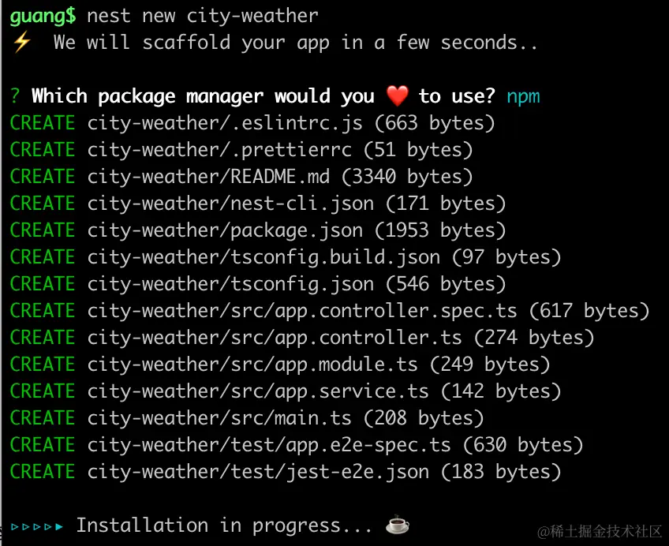

安装 pinyin 包和它的类型：

```
npm install --save pinyin@alpha
npm install --save-dev @types/pinyin
```
然后我们加个接口测试下：

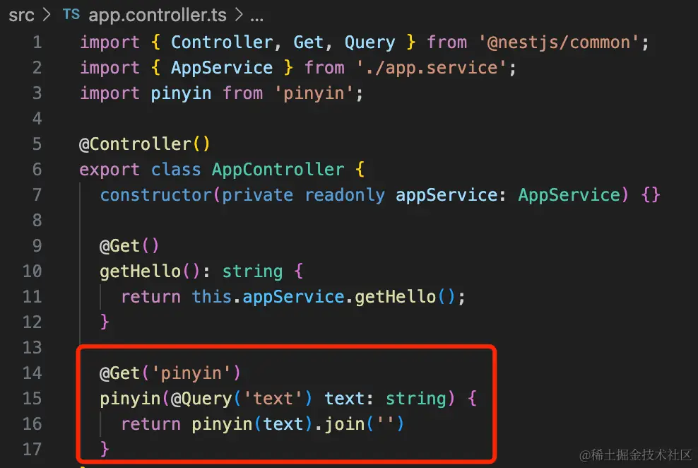

```javascript
@Get('pinyin')
pinyin(@Query('text') text: string) {
    return pinyin(text).join('')
}
```

把服务跑起来：

```
npm run start:dev
```


访问下试试：


可以看到，确实返回了拼音。

但是我们不需要知道是几声。

改下参数：

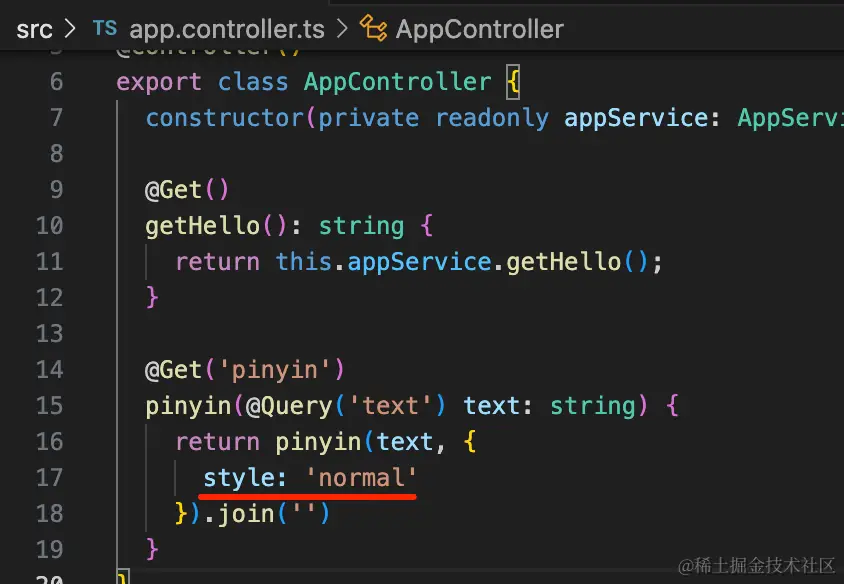

这样就好了：


然后 nest 服务里怎么访问三方接口呢？

直接用 axios 么？

可以，但是我们希望统一配置 axios，然后各个模块都用同一个 axios 实例。

所以用 @nestjs/axios 这个包：

```
npm install --save @nestjs/axios axios
```
在 AppModule 引入下 HttpModule：

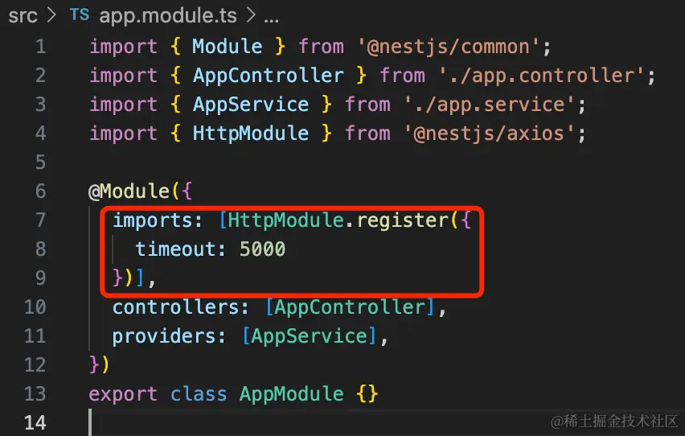

这里可以填入各种请求配置，比如 baseURL 等，其实就是 new 了一个 Axios 实例：

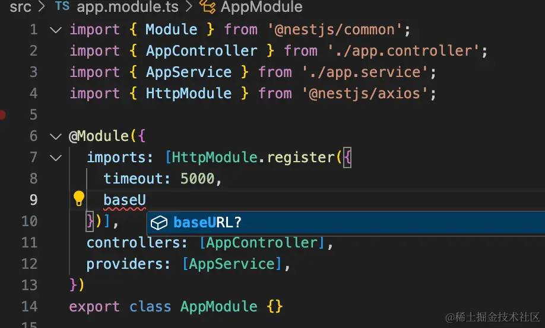

然后在用到的地方注入 httpService：

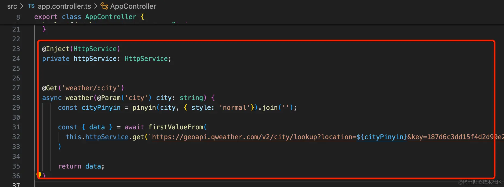

```javascript
@Inject(HttpService)
private httpService: HttpService;

@Get('weather/:city')
async weather(@Param('city') city: string) {
  const cityPinyin = pinyin(city, { style: 'normal'}).join('');

  const { data } = await firstValueFrom(
    this.httpService.get(`https://geoapi.qweather.com/v2/city/lookup?location=${cityPinyin}&key=187d6c3dd15f4d2d99e2a7e0ee08ba04`)
  )

  return data;
}
```

用 @Param 取路径中的参数。

然后用 pinyin 拿到 city 的拼音，然后调用和风天气的接口。

这里为啥用 firstValueFrom 的 rxjs 操作符呢？

因为 HttpModule 把 axios 的方法返回值封装成了 rxjs 的 Observerable。

好处是你可以用 rxjs 的操作符了。

坏处是转成 promise 还得加一层 firstValueFrom。

它就是用来把 rxjs Observable 转成 promise 的：


测试下：

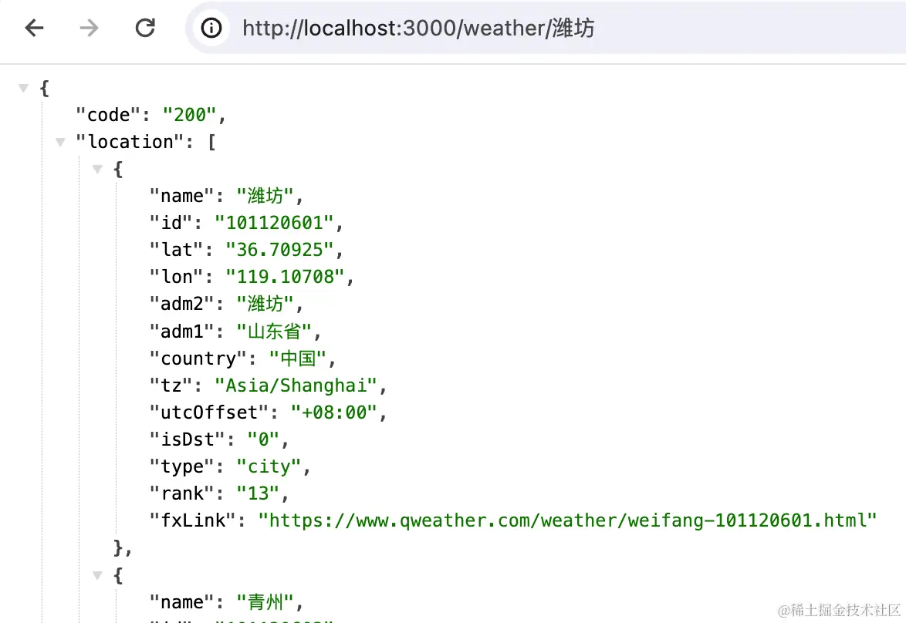

没啥问题。

然后继续调用天气预报接口：

```javascript
@Get('weather/:city')
async weather(@Param('city') city: string) {
    const cityPinyin = pinyin(city, { style: 'normal'}).join('');

    const { data } = await firstValueFrom(
      this.httpService.get(`https://geoapi.qweather.com/v2/city/lookup?location=${cityPinyin}&key=187d6c3dd15f4d2d99e2a7e0ee08ba04`)
    )

    const location = data?.['location']?.[0];

    if(!location) {
      throw new BadRequestException('没有对应的城市信息');
    }

    const { data: weatherData } = await firstValueFrom(
      this.httpService.get(`https://api.qweather.com/v7/weather/7d?location=${location.id}&key=187d6c3dd15f4d2d99e2a7e0ee08ba04`)
    )

    return weatherData;
}
```

如果没查到 location，返回 400 错误。

否则用 location.id 查询该城市天气预报。

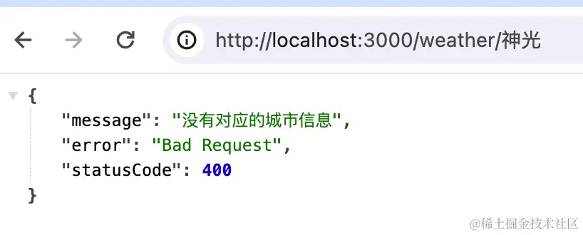

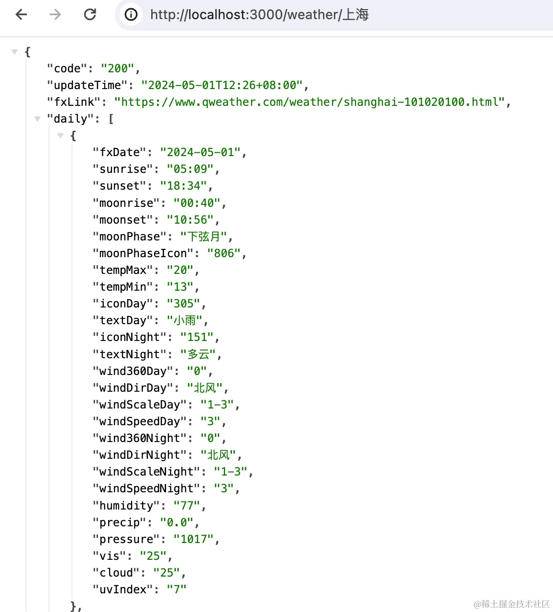

这样，我们的城市天气预报服务就完成了。

当然，这里最好用 redis 做一层缓存，同一个城市的一天内只查一次，避免接口反复调用。这个大家可以自己去优化。

案例代码上传了[小册仓库](https://github.com/QuarkGluonPlasma/nestjs-course-code/tree/main/city-weather)

## 总结

我们基于和风天气的 api 实现了天气预报查询服务。

主要用到了 pinyin 这个包来完成中文转拼音，然后用 pinyin 去请求和风天气的 api 查询城市 id。

接下来用城市 id 请求天气数据。

和风天气的 api 免费版一天可以调用 1000 次，足够用了。

Nest 里发送 http 请求，我们用的是 @nestjs/axios 包的 HttpModule 来做的。

它可以统一配置，然后注入 HttpService 到用到的地方，并且 httpService 方法的返回值封装成了 rxjs 的 Observerable，可以直接用 rxjs 的操作符。

比如用 fistValueFrom 来把 rxjs 的 Observable 转为 Promise。

这样，你就可以在你的应用中集成天气预报功能了。
