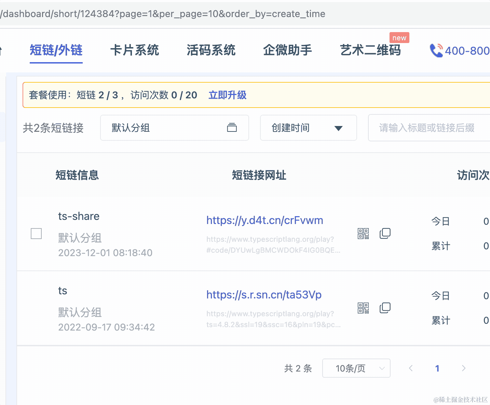
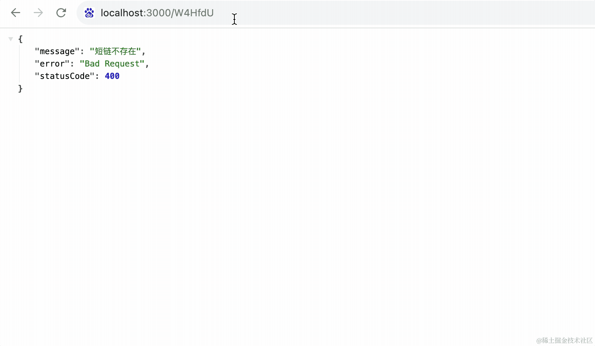

# 96. 短链服务？自己写一个

生活中我们经常遇到需要短链的场景。

比如一段很长的 url：


分享出去很不方便。

这时候就可以通过短链服务把它缩短：


点击短链会跳转到原链接：



这种在短信里很常见：


因为短信是按照字数收费的，太长不但阅读体验不好，费用也高。

所以都会生成短链之后再加到短信里。

那短链是怎么实现的呢？

很容易想到的思路是这样的：

用 0、1、2、3、4、5 的递增 id 标识每个 url，把映射关系存到数据库里。

这样访问短链的时候从数据库中查出对应的长链接，返回 302 重定向即可。

比如刚才的短链服务就是通过 302 把短链重定向到长链：


这里也可以用 301。

301 是永久重定向，就是重定向一次之后，下次浏览器就不会再访问短链，会直接访问长链接。

302 是临时重定向，下次访问短链依然会先访问短链服务，返回 302 后再重定向到长链。

这两种都可以，301 的话，短链服务压力小，不过 302 每次都会先访问短链服务，这样可以记录链接的访问次数等数据。

比如刚才我们用的短链服务，就会记录这个链接的访问记录：


还可以做一些分析：


所以访问记录也挺有价值的。

一般短链服务都是用 302 来重定向。

每个 url 的 id 我们会用 Base64 或者 Base62 编码：

```javascript
const data = '123456';
const buff = Buffer.from(data);
const base64data = buff.toString('base64');

console.log(base64data);
```


base64 就是 26 个大写字母、26 个小写字母、10 个数字、2 个特殊字符，一共 64 个字符。

而 base62 则是去掉了两个特殊字符，一共 62 个字符。

做短链的话，我们用 base62 比较多。

安装用到的包：

    npm install base62

测试下：

```javascript
const base62 = require("base62/lib/ascii");
 
const res = base62.encode(123456);

console.log(res);
```


按照这个思路，我们就能实现一个短链服务。

在 mysql 里创建压缩码和长链接的对应关系的表，用 mysql 的自增 id 然后进行 base62 之后作为压缩码。

访问短链的时候，根据压缩码查询这个表，找到长链接，通过 302 重定向到这个链接，并且记录短链访问记录。

这样是可以的，但有个问题：

用自增 id 作为压缩码，那别人很容易拿到上一个、下一个压缩码，从而拿到别的短链，万一这个短链是用来兑奖之类的呢？

这样就会有安全问题。

所以自增 id 的方案不太好。

那如果我们对 url 做 hash 呢？

也就是这样：

```javascript
const crypto = require('crypto');

function md5(str) {
  const hash = crypto.createHash('md5');
  hash.update(str);
  return hash.digest('hex');
}

console.log(md5('111222'))
```

这样太长了，有 32 位呢：


倒是可以每 4 位取一个数字，然后组成一个 8 位的压缩码。

但是，这样是有碰撞的可能的。

也就是两个不同的 url 生成的压缩码一样。

所以，hash 的方案也不行。

还有一种方案，就是通过随机数的方式生成压缩码。

比如这样：

```javascript
const base62 = require("base62/lib/ascii");

function generateRandomStr(len) {
    let str = '';
    for(let i = 0; i < len; i++) {
        const num = Math.floor(Math.random() * 62);
        str += base62.encode(num);
    }
    return str;
}

console.log(generateRandomStr(6));
```


随机生成 0-61 的数字，然后转成字符。

62 的 6 次方，范围有 580 亿，足够用了：


当然，随机数也是有碰撞的可能的，这个可以在生成之后查下表，看下是否有重复的，有的话就再重新生成。

不过每次生成都查表的话性能会不好，那有啥优化的方案呢？

我们可以提前生成一批压缩码，用的时候直接取！

可以用个定时任务来跑，每天凌晨 4 点生成一批。

这样，生成压缩码的方案就完美了。

小结下：

**用递增 id + base62 作为压缩码，可以保证唯一，但是容易被人拿到其它短码，不安全。**

**用 url 做 hash 之后取一部分然后 base62 做为压缩码，有碰撞的可能，不唯一。**

**随机生成字符串再查表检测是否重复，可以保证唯一且不连续，但是性能不好。用提前批量生成的方式可以解决。**

有的同学可能提到 uuid、雪花 id 之类的，那些都太长了，不适合用来做压缩码：


思路理清了，我们来写下代码。

创建个 nest 项目：

    npm install -g @nestjs/cli

    nest new short-url


先进入项目，把它跑起来：

    npm run start:dev


浏览器看到 hello world，代表 nest 服务跑成功了：


然后我们用 docker 把 mysql 跑起来：

从 docker 官网下载 docker desktop，这个是 docker 的桌面端：


跑起来后，搜索 mysql 镜像（这步需要科学上网），点击 run：


输入容器名、端口映射、以及挂载的数据卷，还要指定一个环境变量：


端口映射就是把宿主机的 3306 端口映射到容器里的 3306 端口，这样就可以在宿主机访问了。

数据卷挂载就是把宿主机的某个目录映射到容器里的 /var/lib/mysql 目录，这样数据是保存在本地的，不会丢失。

而 MYSQL\_ROOT\_PASSWORD 的密码则是 mysql 连接时候的密码。


跑起来后，我们用 GUI 客户端连上，这里我们用的是 mysql workbench，这是 mysql 官方提供的免费客户端：


连接上之后，点击创建 database：


指定名字、字符集为 utf8mb4，然后点击右下角的 apply。

创建成功之后在左侧就可以看到这个 database 了：


当然，现在还没有表。

我们在 Nest 里用 TypeORM 连接 mysql。

安装用到的包：

    npm install --save @nestjs/typeorm typeorm mysql2

mysql2 是数据库驱动，typeorm 是我们用的 orm 框架，而 @nestjs/tyeporm 是 nest 集成 typeorm 用的。

在 AppModule 里引入 TypeORM，指定数据库连接配置：


```javascript
TypeOrmModule.forRoot({
  type: "mysql",
  host: "localhost",
  port: 3306,
  username: "root",
  password: "guang",
  database: "short-url",
  synchronize: true,
  logging: true,
  entities: [],
  poolSize: 10,
  connectorPackage: 'mysql2',
  extra: {
      authPlugin: 'sha256_password',
  }
}),
```

然后创建个 entity：

src/entities/UniqueCode.ts

```javascript
import { Column, Entity, PrimaryGeneratedColumn } from "typeorm";

@Entity()
export class UniqueCode {
    
    @PrimaryGeneratedColumn()
    id: number;

    @Column({
        length: 10,
        comment: '压缩码'
    })
    code: string;

    @Column({
        comment: '状态, 0 未使用、1 已使用'
    })
    status: number;
}
```

在 AppModule 引入：


保存之后，TypeORM会自动建表:


表创建好了，接下来插入一些数据：

    nest g service unique-code --flat --no-spec

生成 service 类，--flat 是不生成目录 --no-spec 是不生成测试代码：


然后创建 src/utils.ts 来放生成随机压缩码的代码：

```javascript
import * as  base62 from "base62/lib/ascii";

export function generateRandomStr(len: number) {
    let str = '';
    for(let i = 0; i < len; i++) {
        const num = Math.floor(Math.random() * 62);
        str += base62.encode(num);
    }
    return str;
}
```

安装用到的包：

    npm install base62

然后在 UniqueCodeService 添加下插入压缩码的方法：

```javascript
import { Injectable } from '@nestjs/common';
import { InjectEntityManager } from '@nestjs/typeorm';
import { EntityManager } from 'typeorm';
import { generateRandomStr } from './utils';
import { UniqueCode } from './entities/UniqueCode';

@Injectable()
export class UniqueCodeService {

    @InjectEntityManager()
    private entityManager: EntityManager;
 
    async generateCode() {
        let str = generateRandomStr(6);

        const uniqueCode = await this.entityManager.findOneBy(UniqueCode, {
            code: str
        });

        if(!uniqueCode) {
            const code = new UniqueCode();
            code.code = str;
            code.status = 0;

            return await this.entityManager.insert(UniqueCode, code);
        } else {
            return this.generateCode();
        }
    }
}
```

就是生成随机的长度为 6 的字符串，查下数据库，如果没查到，就插入数据，否则重新生成。

我们用定时任务的方式来跑：

安装用到的包：

```javascript
npm install --save @nestjs/schedule
```

在 AppModule 注册下：


然后在 service 方法上声明，每 5s 执行一次：


```javascript
@Cron(CronExpression.EVERY_5_SECONDS)
```

然后就可以看到一直在打印 insert 语句：


数据库中也可以看到插入的未使用的压缩码：


当然，一个个这么插入可太费劲了。

我们一般是在凌晨 4 点左右批量插入一堆，比如一次性插入 10000 个。


```javascript
@Cron(CronExpression.EVERY_DAY_AT_4AM)
async batchGenerateCode() {
    for(let i = 0; i< 10000; i++) {
        this.generateCode();
    }
}
```

这里我们是每次 insert 一个，你也可以每次 insert 10 个 20 个这种。

批量插入性能会好，因为执行的 sql 语句少。这里我们就先不优化了。

压缩码有了，接下来生成 url 和压缩码的对应关系就好了。

同样需要创建 entity：

src/entities/ShortLongMap.ts

```javascript
import { Column, CreateDateColumn, Entity, PrimaryGeneratedColumn } from "typeorm";

@Entity()
export class ShortLongMap {
    
    @PrimaryGeneratedColumn()
    id: number;

    @Column({
        length: 10,
        comment: '压缩码'
    })
    shortUrl: string;

    @Column({
        length: 200,
        comment: '原始 url'
    })
    longUrl: string;

    @CreateDateColumn()
    createTime: Date;
}
```

在 entities 引入：


同样会自动建表：


生成短链就是往这个表里添加记录。

我们加一个生成短链的 service：

    nest g service short-long-map --flat --no-spec


实现生成短链的方法：

```javascript
import { UniqueCodeService } from './unique-code.service';
import { Inject, Injectable } from '@nestjs/common';
import { InjectEntityManager } from '@nestjs/typeorm';
import { EntityManager } from 'typeorm';
import { ShortLongMap } from './entities/ShortLongMap';
import { UniqueCode } from './entities/UniqueCode';

@Injectable()
export class ShortLongMapService {

    @InjectEntityManager()
    private entityManager: EntityManager;

    @Inject(UniqueCodeService)
    private uniqueCodeService: UniqueCodeService;

    async generate(longUrl: string) {
        let uniqueCode = await this.entityManager.findOneBy(UniqueCode, {
            status: 0
        })

        if(!uniqueCode) {
            uniqueCode = await this.uniqueCodeService.generateCode();
        }
        const map = new ShortLongMap();
        map.shortUrl = uniqueCode.code;
        map.longUrl = longUrl;
  
        await this.entityManager.insert(ShortLongMap, map);
        await this.entityManager.update(UniqueCode, {
            id: uniqueCode.id
        }, {
            status: 1
        });
        return uniqueCode.code;
    }

}
```

这里就是先从 unique-code 表里取一个压缩码来用，如果没有可用压缩码，那就生成一个。

然后在 short-long-map 表里插入这条新的短链映射，并且把用到的压缩码状态改为 1。

我们在 AppController 里添加一个接口：


```javascript
import { ShortLongMapService } from './short-long-map.service';
import { Controller, Get, Inject, Query } from '@nestjs/common';
import { AppService } from './app.service';

@Controller()
export class AppController {
  constructor(private readonly appService: AppService) {}

  @Inject(ShortLongMapService)
  private shortLongMapService: ShortLongMapService;

  @Get()
  getHello(): string {
    return this.appService.getHello();
  }

  @Get('short-url')
  async generateShortUrl(@Query('url') longUrl) {
    return this.shortLongMapService.generate(longUrl);
  }
}
```

在浏览器里测试下：


可以看到，打印了 4 条 sql：


首先 select 查出一个压缩码来，然后 insert 插入压缩码和 url 的映射，之后再把它 select 出来返回。

最后 update 更新压缩码状态。

看 sql 来说，是符合我们的预期的。

然后看下数据：


也是对的。

那剩下的事情就很简单了，只要加一个重定向就好：

首先在 service 里添加根据压缩码查询 longUrl 的方法：


```javascript
async getLongUrl(code: string) {
    const map = await this.entityManager.findOneBy(ShortLongMap, {
        shortUrl: code
    });
    if(!map) {
        return null;
    }
    return map.longUrl;
}
```

然后在 AppController 里添加一个重定向的接口：


```javascript
@Get(':code')
@Redirect()
async jump(@Param('code') code) {
    const longUrl = await this.shortLongMapService.getLongUrl(code);
    if(!longUrl) {
      throw new BadRequestException('短链不存在');
    }
    return {
      url: longUrl,
      statusCode: 302
    }  
}
```

测试下：




这样，我们的短链服务就完成了。

其他的非核心功能，比如记录每次访问记录，做一些分析：


这些比较简单，就不实现了。

案例代码上传了 github： <https://github.com/QuarkGluonPlasma/nestjs-course-code/tree/main/short-url>

## 总结

我们经常用短链服务把长的 url 缩短，在短信里的链接一般都是这种。

我们用 Nest 自己实现了一个。

核心是压缩码的生成，我们分析了自增 id + base62，这样容易被人拿到其它短链，不安全。hash + base62 会有冲突的可能，所以最终用的是自己生成随机数 + base62 的方案。

当然，这个随机字符串最好是提前生成，比如用定时任务在低峰期批量生成一堆，之后直接用就好了。

短链的重定向使用 302 临时重定向，这样可以记录短链访问记录，做一些分析。

市面上的短链服务，基本都是这样实现的。
