# 97. Nest 实现 Server Sent Event 数据推送

提到推送数据，大家可能会首先想到 WebSocket。

确实，WebSocket 能双向通信，自然也能做服务器到浏览器的消息推送。

但如果只是单向推送消息的话，HTTP 就有这种功能，它就是 Server Sent Event。

WebSocket 的通信过程是这样的：

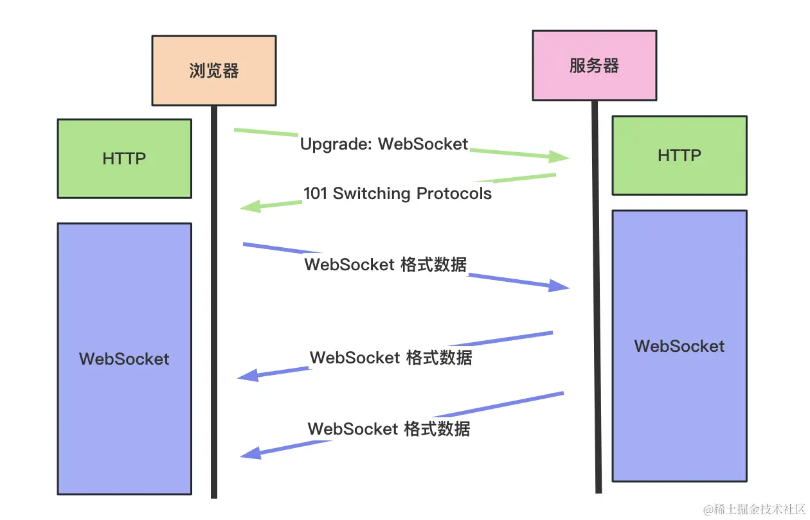

首先通过 http 切换协议，服务端返回 101 的状态码后，就代表协议切换成功。

之后就是 WebSocket 格式数据的通信了，一方可以随时向另一方推送消息。

而 HTTP 的 Server Sent Event 是这样的：

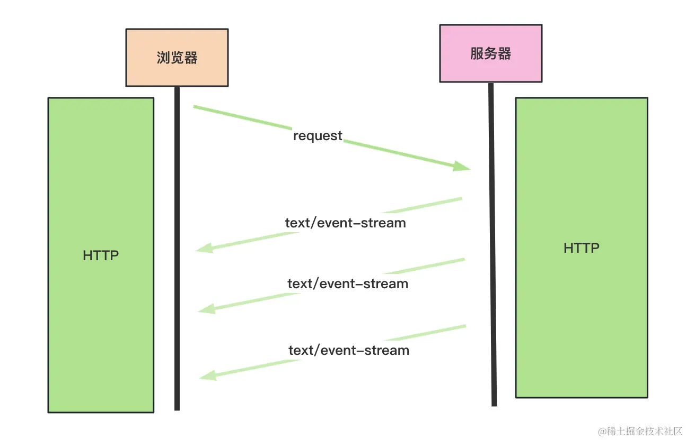

服务端返回的 Content-Type 是 text/event-stream，这是一个流，可以多次返回内容。

Sever Sent Event 就是通过这种消息来随时推送数据。

可能你是第一次听说 SSE，但你肯定用过基于它的应用。

比如你用的 CICD 平台，它的日志是实时打印的。

那它是如何实时传输构建日志的呢？

明显需要一段一段的传输，这种一般就是用 SSE 来推送数据。

再比如说 ChatGPT，它回答一个问题不是一次性给你全部的，而是一部分一部分的加载回答。

这也是基于 SSE。


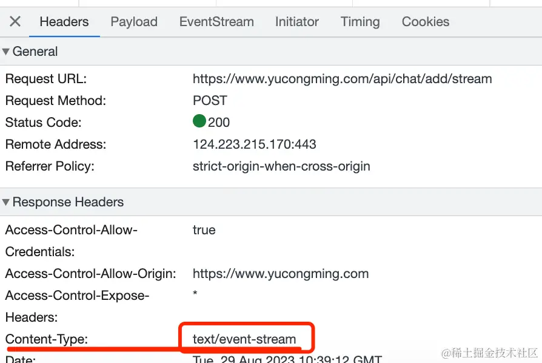

或者这个 ai 聊天产品：

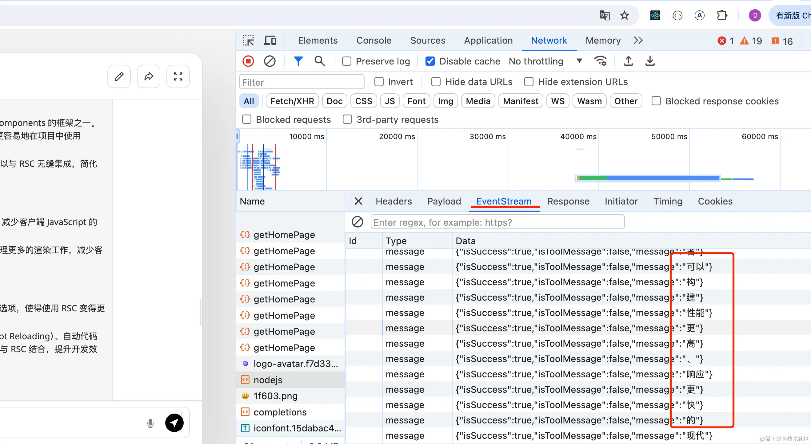

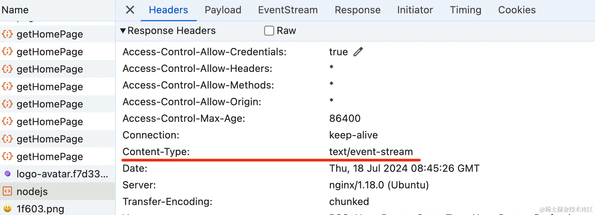

知道了什么是 SSE 以及它的应用，我们来自己实现一下吧：

创建 nest 项目：

```
nest new sse-test
```

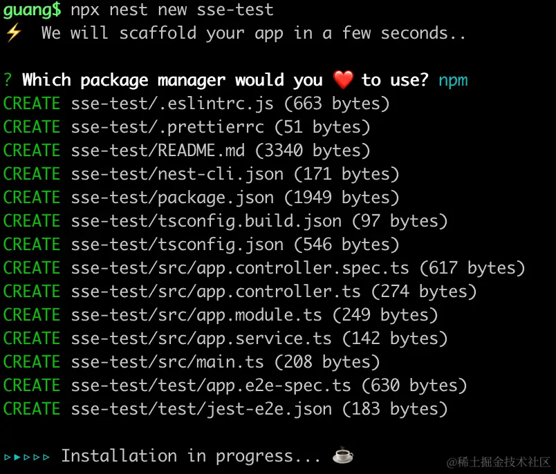

把它跑起来：

```
npm run start:dev
```
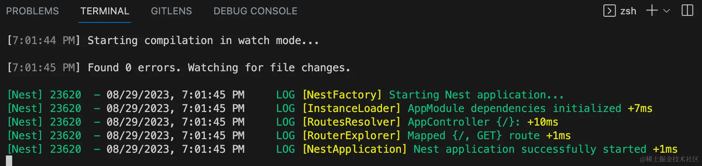

访问 http://localhost:3000 可以看到 hello world，代表服务器跑成功了：


然后在 AppController 添加一个 stream 接口：

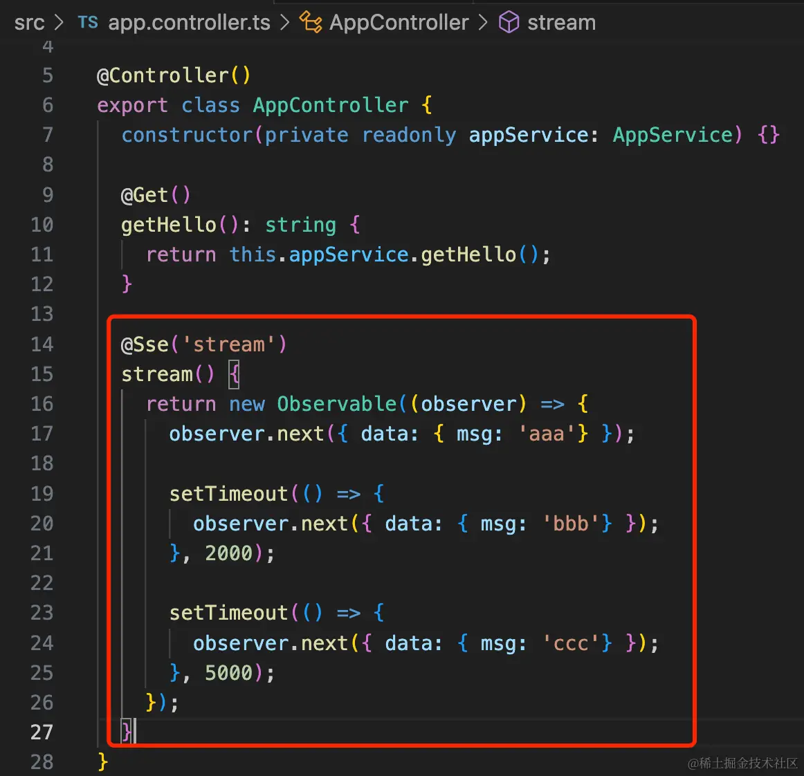

这里不是通过  @Get、@Post 等装饰器标识，而是通过 @Sse 标识这是一个 event stream 类型的接口。

```javascript
@Sse('stream')
stream() {
    return new Observable((observer) => {
      observer.next({ data: { msg: 'aaa'} });

      setTimeout(() => {
        observer.next({ data: { msg: 'bbb'} });
      }, 2000);

      setTimeout(() => {
        observer.next({ data: { msg: 'ccc'} });
      }, 5000);
    });
}
```
返回的是一个 Observable 对象，然后内部用 observer.next 返回消息。

可以返回任意的 json 数据。

我们先返回了一个 aaa、过了 2s 返回了 bbb，过了 5s 返回了 ccc。

然后写个前端页面：

创建一个 react 项目：

```
npx create-react-app --template=typescript sse-test-frontend
```
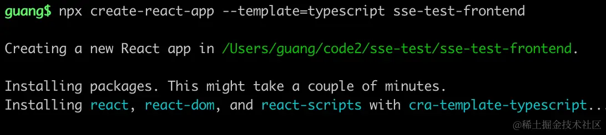

在 App.tsx 里写如下代码：

```javascript
import { useEffect } from 'react';

function App() {

  useEffect(() => {
    const eventSource = new EventSource('http://localhost:3000/stream');
    eventSource.onmessage = ({ data }) => {
      console.log('New message', JSON.parse(data));
    };
  }, []);

  return (
    <div>hello</div>
  );
}

export default App;
```

这个 EventSource 是浏览器原生 api，就是用来获取 sse 接口的响应的，它会把每次消息传入 onmessage 的回调函数。

我们在 nest 服务开启跨域支持：

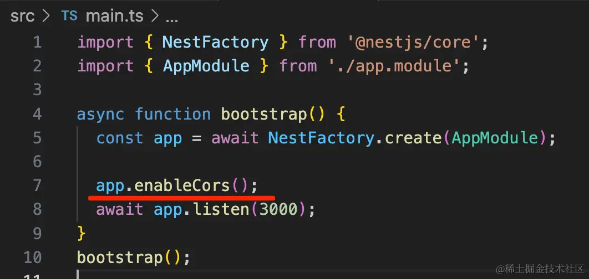

然后把 react 项目 index.tsx 里这几行代码删掉，它会导致额外的渲染：

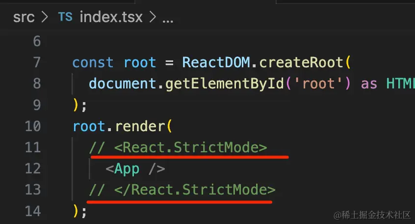

执行 npm run start

因为 3000 端口被占用了，它会跑在 3001：

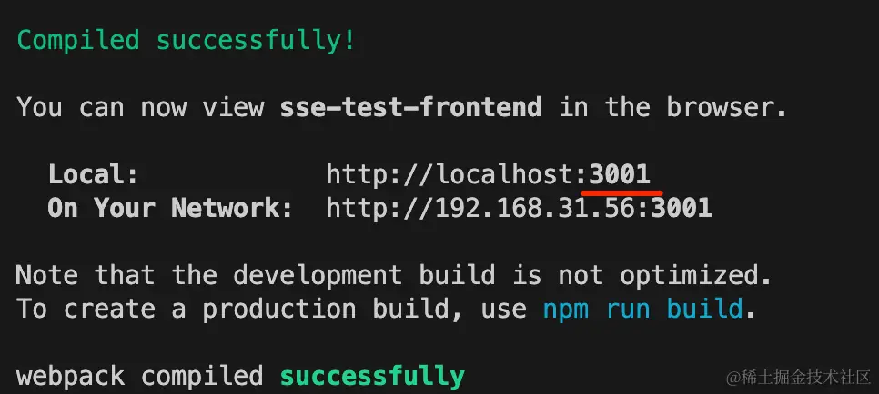

浏览器访问下：

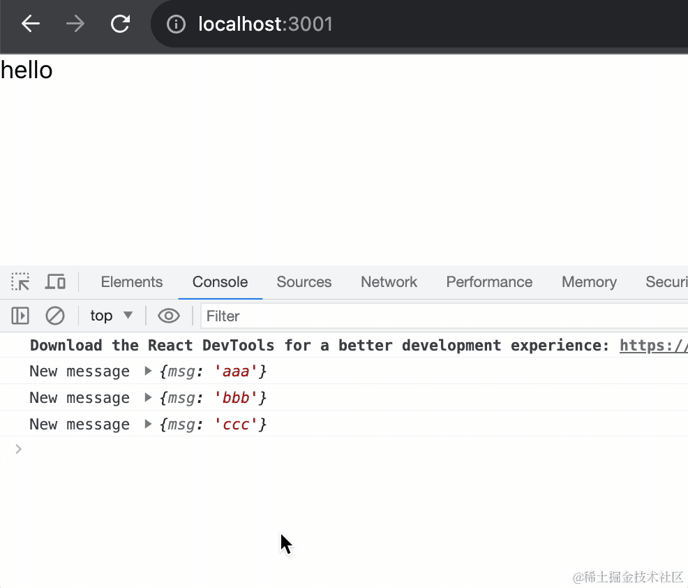

看到一段段的响应了没？

这就是 Server Sent Event。

在 devtools 里可以看到，响应的 Content-Type 是 text/event-stream：

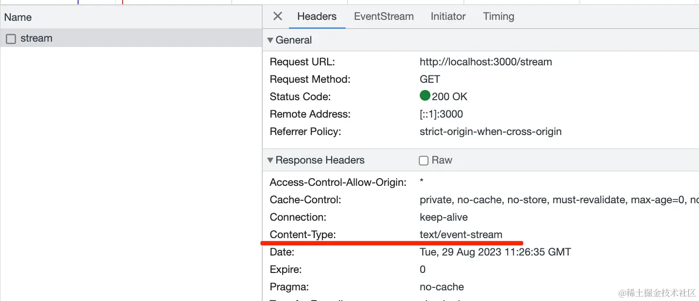

然后在 EventStream 里可以看到每一次收到的消息：

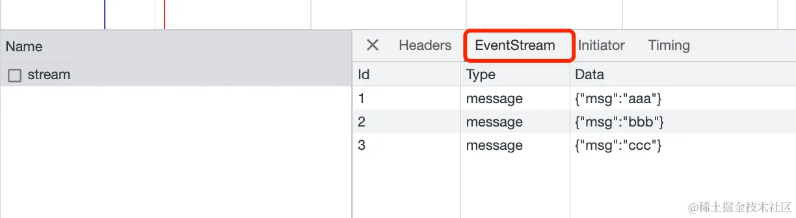

这样，服务端就可以随时向网页推送消息了。

那它兼容性怎么样呢？

可以在 [MDN](https://developer.mozilla.org/zh-CN/docs/Web/API/EventSource#%E6%B5%8F%E8%A7%88%E5%99%A8%E5%85%BC%E5%AE%B9%E6%80%A7) 看到：

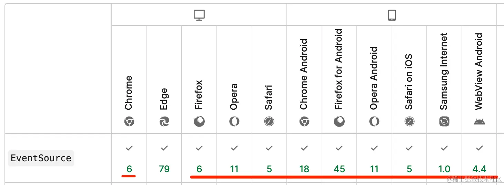

除了 ie、edge 外，其他浏览器都没任何兼容问题。

基本是可以放心用的。

那用在哪呢？

一些只需要服务端推送的场景就特别适合 Server Sent Event。

比如这个站内信：

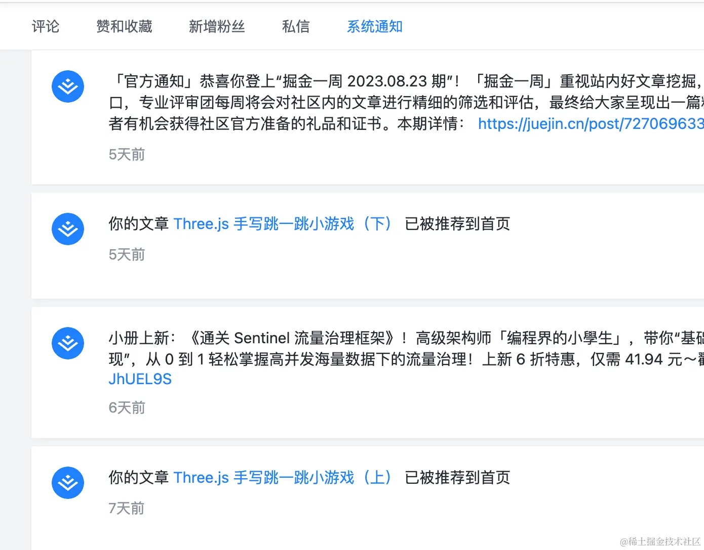

这种推送用 WebSocket 就没必要了，可以用 SSE 来做。

那连接断了怎么办呢？

不用担心，浏览器会自动重连。

这点和 WebSocket 不同，WebSocket 如果断开之后是需要手动重连的，而 SSE 不用。

再比如说日志的实时推送。

我们来测试下：

tail -f 命令可以实时看到文件的最新内容：

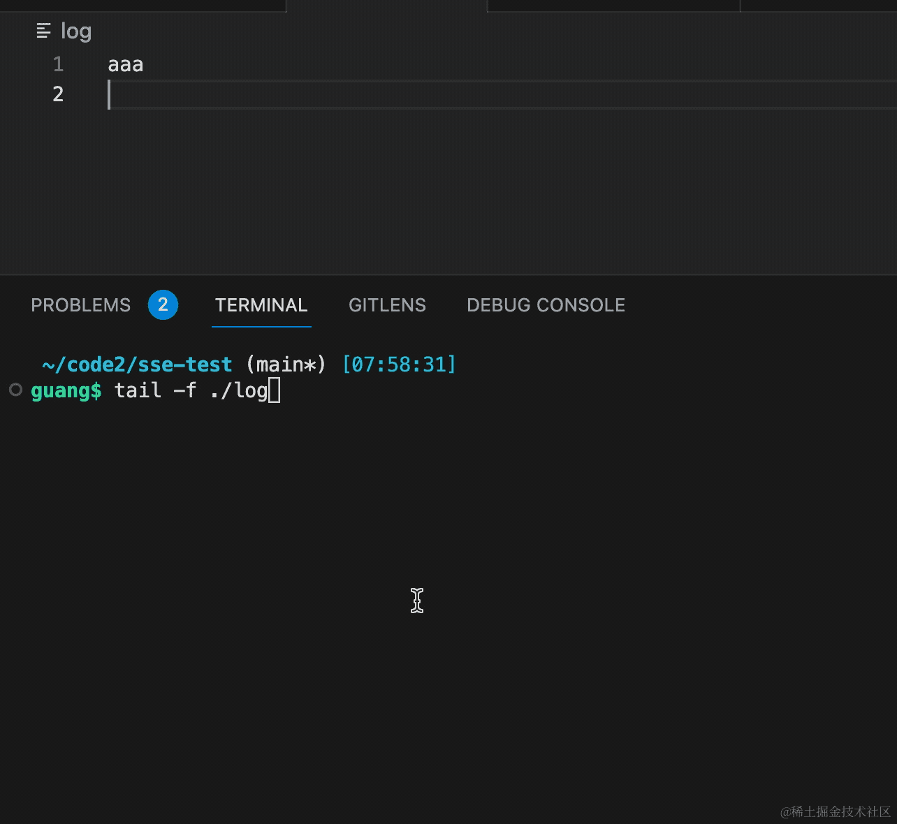

我们通过 child_process 模块的 exec 来执行这个命令，然后监听它的 stdout 输出：

```javascript
const { exec } = require("child_process");

const childProcess = exec('tail -f ./log');

childProcess.stdout.on('data', (msg) => {
    console.log(msg);
});
```
用 node 执行它：

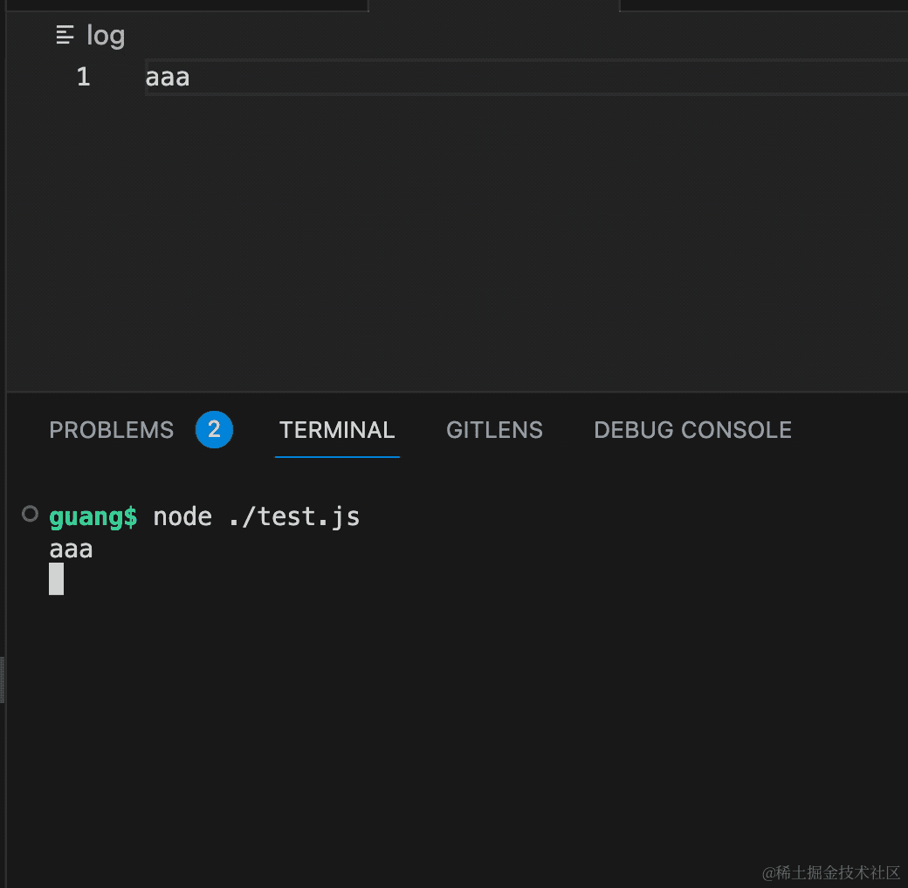

然后添加一个 sse 的接口：

```javascript
@Sse('stream2')
stream2() {
const childProcess = exec('tail -f ./log');

return new Observable((observer) => {
  childProcess.stdout.on('data', (msg) => {
    observer.next({ data: { msg: msg.toString() }});
  })
});
```
监听到新的数据之后，把它返回给浏览器。

浏览器连接这个新接口：

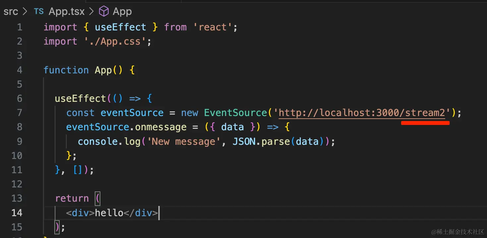

测试下：


可以看到，浏览器收到了实时的日志。

很多构建日志都是通过 SSE 的方式实时推送的。

日志之类的只是文本，那如果是二进制数据呢？

二进制数据在 node 里是通过 Buffer 存储的。

```javascript
const { readFileSync } = require("fs");

const buffer = readFileSync('./package.json');

console.log(buffer);
```
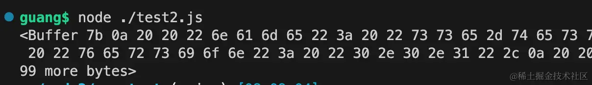

而 Buffer 有个 toJSON 方法：

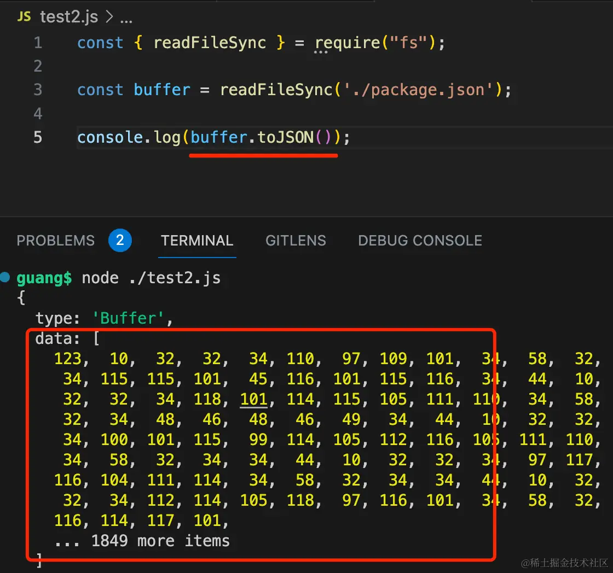

这样不就可以通过 sse 的接口返回了么？

试一下：

```javascript
@Sse('stream3')
stream3() {
    return new Observable((observer) => {
        const json = readFileSync('./package.json').toJSON();
        observer.next({ data: { msg: json }});
    });
}
```
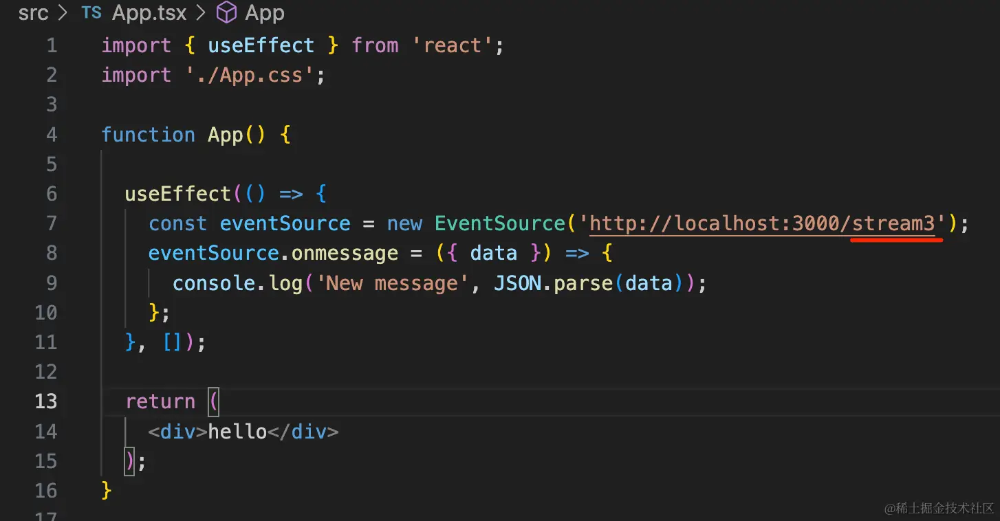

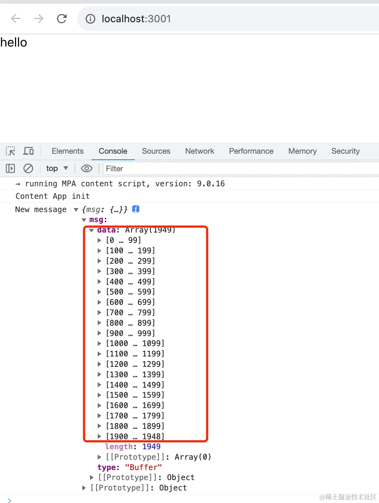

确实可以。

也就是说，基于 sse，除了可以推送文本外，还可以推送任意二进制数据。

案例代码上传了小册仓库：

[后端代码](https://github.com/QuarkGluonPlasma/nestjs-course-code/tree/main/sse-test)

[前端代码](https://github.com/QuarkGluonPlasma/nestjs-course-code/tree/main/sse-test-frontend)

## 总结

服务端实时推送数据，除了用 WebSocket 外，还可以用 HTTP 的 Server Sent Event。

只要 http 返回 Content-Type 为 text/event-stream 的 header，就可以通过 stream 的方式多次返回消息了。

它传输的是 json 格式的内容，可以用来传输文本或者二进制内容。

我们通过 Nest 实现了 sse 的接口，用 @Sse 装饰器标识方法，然后返回 Observe 对象就可以了。内部可以通过 observer.next 随时返回数据。

前端使用 EventSource 的 onmessage 来接收消息。

这个 api 的兼容性很好，除了 ie 外可以放心的用。

它的应用场景有很多，比如站内信、构建日志实时展示、chatgpt 的消息返回等。

再遇到需要消息推送的场景，不要直接 WebSocket 了，也许 Server Sent Event 更合适呢？
