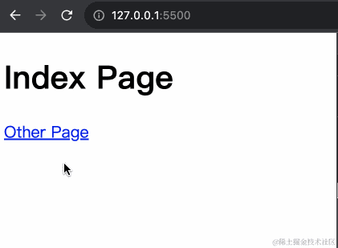
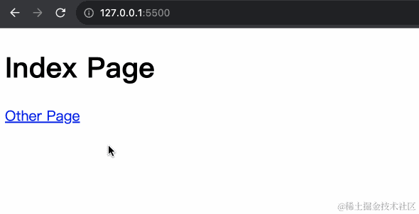

## 前言

我们正常部署 Next.js 应用都是需要在服务器上起一个 server 来实现，但其实也可以不这样做。Next.js 也支持类似于静态网站或者单页应用（SPA）的形式。这就是本章要讲解的静态导出（Static Exports）功能。

它的效果是这样的：当你执行构建（`npm run build`）后，Next.js 会为每一个路由生成一个单独的 HTML 文件，以及相关使用的 CSS、JavaScript、图片等资源，这些内容会放到你指定的文件夹下，你可以将这个文件夹下的内容直接部署使用。

但效果跟传统的静态网站不一样的是，Next.js 生成的网站效果类似于 SPA，即路由虽然发生变化，但页面不会加载刷新。

让我们看看怎么实现静态导出吧！

## 1. 配置

要启用静态导出，修改 `next.config.js` 的导出模式：

```javascript
// next.config.js
/**
 * @type {import('next').NextConfig}
 */
const nextConfig = {
  output: 'export',
  // 可选: 默认导出目录为 out，distDir 可以更改这个目录名 `out` -> `dist`
  // distDir: 'dist',
}
 
module.exports = nextConfig
```

运行 `next build` 后，Next.js 会创建一个名为 `out` 的文件夹包含该应用所需的 HTML、CSS、JS 等资源。


## 2. 行为

为了支持静态导出，Next.js 的核心部分都进行了改造，让我们了解一下这些核心部分在静态导出的时候的行为和特性吧：

### 2.1. 服务端组件

当配置静态导出运行 `next build` 的时候，`app` 目录下的服务端组件会在构建期间运行，这个过程类似于传统的静态站点生成。

这些组件会渲染成静态的 HTML 文件（用于初始化页面加载）和客户端路由导航之间的静态 payload。当使用静态导出时，服务端组件不需要进行任何更改，除非它们使用了动态服务端函数，下文会讲到在静态导出中不支持的功能。

```jsx
// app/page.jsx
export default async function Page() {
  // 在 `next build` 的时候 fetch 请求会执行
  const res = await fetch('https://jsonplaceholder.typicode.com/posts/1')
  const data = await res.json()
 
  return <main>{data.title}</main>
}
```

编译变成 HTML 文件后：

```html
<!DOCTYPE html>
<html>

<head>
  <meta charSet="utf-8" />
  <meta name="viewport" content="width=device-width, initial-scale=1" />
	///...
</head>

<body>
  <main>sunt aut facere repellat provident occaecati excepturi optio reprehenderit</main>
  //...
</body>

</html>
```

### 2.2. 客户端组件

页面不一定总是静态资源，有点时候，也需要在页面打开或者发生交互的时候获取数据，此时就需要使用客户端组件。如果要在客户端获取数据，可以使用带有 [SWR](https://github.com/vercel/swr) 的客户端组件记忆化请求：

```javascript
'use client'
// app/other/page.js
import useSWR from 'swr'
 
const fetcher = (url) => fetch(url).then((r) => r.json())
 
export default function Page() {
  const { data, error } = useSWR(
    `https://jsonplaceholder.typicode.com/posts/1`,
    fetcher
  )
  if (error) return 'Failed to load'
  if (!data) return 'Loading...'
 
  return data.title
}
```

因为路由导航发生在客户端，其行为类似于传统的 SPA。举个例子：

```javascript
// app/page.js
import Link from 'next/link'
 
export default function Page() {
  return (
    <>
      <h1>Index Page</h1>
      <p>
        <Link href="/other">Other Page</Link>
      </p>
    </>
  )
}
```

现在我们运行 `npm run build` 执行构建，然后对导出的 `out` 文件夹起一个服务（VSCode 可以用 Live Server 这个插件），你会发现它的表现类似于 SPA：



这是为了避免在客户端加载不必要的 JavaScript 代码，从而减小 bundle 的大小，实现更快的页面加载。

但它跟传统的 SPA 还不一样。因为传统 SPA 的 HTML 是一个“空的”，只有一个可以挂载的根节点比如这样：

```html
<div id='root'></div>
<script src="app.js" />
```

但 Next.js 构建出来的无论是服务端组件还是客户端组件，都是有 HTML 内容的。

### 2.3. 图片优化

在使用静态导出的时候，并不能使用带有默认 loader 的 `next/image` 组件，举个例子：

```javascript
// app/page.js
import Image from 'next/image'
import profilePic from './me.png'
 
export default function Page() {
  return (
    <Image
      src={profilePic}
      alt="Picture of the author"
    />
  )
}
```

开发模式下会出现错误提示：


你可以自定义配置一个 loader，比如使用 Cloudinary（提供基于云的图像和视频管理服务。用户能够上载，存储，管理，操纵和交付用于网站和应用程序的图像和视频）。

首先配置 `next.config.js`：

```javascript
// next.config.js
/** @type {import('next').NextConfig} */
const nextConfig = {
  output: 'export',
  images: {
    loader: 'custom',
    loaderFile: './my-loader.js',
  },
}
 
module.exports = nextConfig
```

其次，添加自定义 loader 的代码：

```javascript
// my-loader.js
export default function cloudinaryLoader({ src, width, quality }) {
  const params = ['f_auto', 'c_limit', `w_${width}`, `q_${quality || 'auto'}`]
  return `https://res.cloudinary.com/demo/image/upload/${params.join(
    ','
  )}${src}`
}
```

现在，你就可以使用 `next/image` 组件：

```javascript
// app/page.js
import Image from 'next/image'
 
export default function Page() {
  return <Image alt="turtles" src="/turtles.jpg" width={300} height={300} />
}
```


此时图片能够正确展示：


你可能会想：“好麻烦！我就想简单展示个图片，还要去找个图片服务吗？”，其实你也可以直接使用 `` 标签，但对应会失去 `next/image` 组件带来的优化。比如把图片放在 `/public` 下后使用 img 标签读取也可以正常展示：

```javascript
// app/page.js
export default function Page() {
  return 
}
```


### 2.4. 路由处理程序

路由处理程序在运行 `next build` 的时候会渲染一个静态的响应。只有在 `GET` 请求被支持。这可以用于生成静态的 HTML、JSON、TXT 或者其他文件。举个例子：

```javascript
// app/data.json/route.js
export async function GET() {
  return Response.json({ name: 'Lee' })
}
```

`app/data.json/rout.js` 会在 `next build` 的时候渲染成一个静态的名为 `data.json`的文件：


如果你需要从传入的请求中读取动态值，那就不能使用静态导出了。

### 2.5. 浏览器 API

在运行 `next build` 的时候，客户端组件会被预渲染成  HTML。因为 Web APIs 像 `window`、`localStorage` 和 `navigator` 在服务端是不可用的，所以你需要保证仅在浏览器中运行的时候才访问这些 API，举个例子：

```javascript
'use client';
 
import { useEffect } from 'react';
 
export default function ClientComponent() {
  useEffect(() => {
    // 现在可以访问 `window`
    console.log(window.innerHeight);
  }, [])
 
  return ...;
}
```

## 3. 不支持的功能

需要 Nodejs server 的功能或者在构建过程中需要计算的动态逻辑都是不支持的，具体有：

*   [Dynamic Routes](https://nextjs.org/docs/app/building-your-application/routing/dynamic-routes) 中 `dynamicParams: true`
*   [Dynamic Routes](https://nextjs.org/docs/app/building-your-application/routing/dynamic-routes) 没有使用`generateStaticParams()`
*   [Route Handlers](https://nextjs.org/docs/app/building-your-application/routing/route-handlers) 依赖传入的请求
*   [Cookies](https://nextjs.org/docs/app/api-reference/functions/cookies)
*   [Rewrites](https://nextjs.org/docs/app/api-reference/next-config-js/rewrites)
*   [Redirects](https://nextjs.org/docs/app/api-reference/next-config-js/redirects)
*   [Headers](https://nextjs.org/docs/app/api-reference/next-config-js/headers)
*   [Middleware](https://nextjs.org/docs/app/building-your-application/routing/middleware)
*   [Incremental Static Regeneration](https://nextjs.org/docs/app/building-your-application/data-fetching/fetching-caching-and-revalidating)
*   [Image Optimization](https://nextjs.org/docs/app/building-your-application/optimizing/images) 使用默认 loader
*   [Draft Mode](https://nextjs.org/docs/app/building-your-application/configuring/draft-mode)

在 `next dev` 的时候尝试使用这些功能都会导致错误。

## 4. 部署

使用静态导出，Next.js 可以部署和托管在任何能处理 HTML、CSS 、JS 静态资源的 Web 服务器上。

运行 `next build` 的时候，Next.js 会生成静态文件到 `out` 文件夹下，举个例子，假如你有这些路由：

*   `/`
*   `/blog/[id]`

运行 `next build`后，Next.js 会生成以下文件：

*   `/out/index.html`
*   `/out/404.html`
*   `/out/blog/post-1.html`
*   `/out/blog/post-2.html`

有 `post-1.html、post-2.html` 这些文件是因为定义了 `generateStaticParams`，不使用该函数也无法静态导出。

但此时路由跳转的时候会有一个问题，就比如从 `/`跳转到 `/other`，第一次没有问题，因为页面类似于 SPA，但是刷新 `/other`就会导致错误，原本的 `/other` 被编译成了 `other.html`，访问 `/other.html` 才会正常访问。让我们看下演示：



为了解决这个问题，如果你使用了比如 Nginx，那你可以配置一个从传入请求到正确文件的重写：

```javascript
# 32.部署篇 | 静态导出
server {
  listen 80;
  server_name acme.com;
 
  root /var/www/out;
 
  location / {
      try_files $uri $uri.html $uri/ =404;
  }
 
  # 当配置 `trailingSlash: false`，这是必要的
  # 当配置 `trailingSlash: true`，可以省略
  location /blog/ {
      rewrite ^/blog/(.*)$ /blog/$1.html break;
  }
 
  error_page 404 /404.html;
  location = /404.html {
      internal;
  }
}
```

## 参考链接

1. [https://nextjs.org/docs/app/building-your-application/deploying/static-exports](https://nextjs.org/docs/app/building-your-application/deploying/static-exports)
