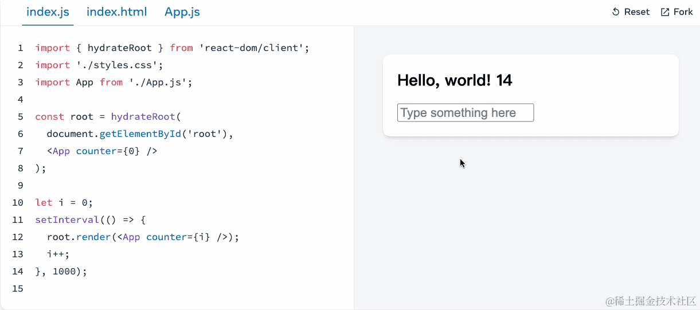
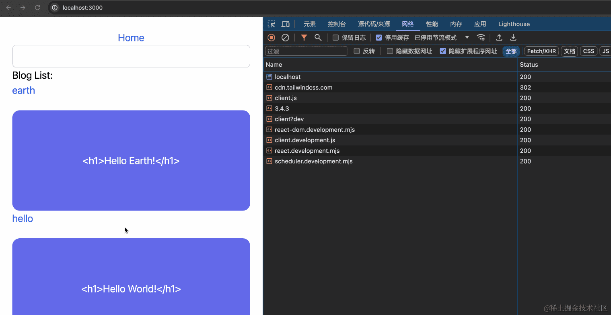

# 66.源码篇 | 手写 RSC（下）

## 前言

在[《源码篇 | 手写 RSC（上）》](https://juejin.cn/book/7307859898316881957/section/7309116337833148454)中，我们实现了 React SSR 并添加了路由跳转，最终的效果如下：


当我们点击 `hello`链接的时候，页面从 `/`跳转到 `/hello`，两个页面都是 SSR 加载。

但理想情况下，我们想要的效果是，仅更改需要更改的地方，而其他的地方继续保持原本的状态。不过当前的例子中并无所谓“状态”，为了演示状态的保持，我们在 `<Layout>` 组件中添加一个 `<input />` 标签，修改 `components.ts`下的 `<Layout>` 组件代码：

```jsx
export function Layout({ children }) {
  const author = "YaYu";
  return (
    <html>
      <head>
        <title>My blog</title>
        <script src="https://cdn.tailwindcss.com"></script>
      </head>
      <body className="p-5">
        <nav className="flex items-center justify-center gap-10 text-blue-600">
          <a href="/">Home</a>
        </nav>
        <input required className="block w-full rounded-md border-0 px-1.5 py-1.5 text-gray-900 shadow-sm ring-1 ring-inset ring-gray-300 placeholder:text-gray-400 focus:ring-2 focus:ring-inset focus:ring-indigo-600 sm:text-sm sm:leading-6" />
        <main>{children}</main>
        <Footer author={author} />
      </body>
    </html>
  );
}
```

我们先在输入框输入一些数据再点击链接跳转，交互效果如下：


结果很容易想到，页面跳转后，输入框被重置。对于两次 SSR 来说，因为每次都是重新渲染，所以状态无法保持。

但为了更好的用户体验，我们想要的效果是，在发生页面跳转的时候，仅更改需要更改的地方，其他的地方继续保持原本的状态。也就是说，在这个例子中，输入框的内容应该继续保持不变。

那你可能会问，这不就是 CSR？如果还要控制页面跳转，这不一个就是基于 CSR 的 SPA 应用吗？

单论这个效果而言，传统 SPA 确实也能实现，RSC 也能实现，而 CSR 和 RSC 的区别就在于 CSR 组件的渲染在客户端，RSC 组件的渲染在服务端。

那用 RSC 该怎么实现呢？

## 实现思路

我们在[《源码篇 | 手写 React SSR》](https://juejin.cn/book/7307859898316881957/section/7309116396511133705)介绍过 React 的 [hydrateRoot](https://react.dev/reference/react-dom/client/hydrateRoot) 函数：

> hydrateRoot 允许您在浏览器 DOM 节点内显示 React 组件，该节点的 HTML 内容先前由 react-dom/server 生成。

简单的来就是，先通过 react-dom/server 将 JSX 渲染成 HTML，再调用 hydrateRoot 将其水合，添加事件。基本用法如下：

```javascript
import { hydrateRoot } from 'react-dom/client';

const domNode = document.getElementById('root');
const root = hydrateRoot(domNode, reactNode);
```

当调用 hydrateRoot 后就会由 React 接管 DOM，而 React 又提供了 root.render 方法来更新 DOM：



在上图中，我们每秒都调用了一次 root.render，但输入框中的状态并未遭到破坏，这就是我们实现 React Server Component 的关键。

那我们具体该怎么实现呢？简单的来说，可以分为 3 个步骤：

1.  拦截客户端跳转，实现客户端 JS 导航
2.  导航的时候，获取目标路由的 JSX 对象
3.  客户端获取返回的 JSX 对象调用 root.render 进行重新渲染

如果这样说还是有点抽象，那就让我们直接上代码吧！

## 步骤 1：实现客户端导航

我们先拦截传统的页面跳转，将其转为客户端导航。

新建 `client.js`，代码如下：

```javascript
let currentPathname = window.location.pathname;

async function navigate(pathname) {
  currentPathname = pathname;
  // 获取导航页面的 HTML
  const response = await fetch(pathname);
  const html = await response.text();

  if (pathname === currentPathname) {
    //  获取其中的 body 标签内容
    const res = /<body(.*?)>/.exec(html);
    const bodyStartIndex = res.index + res[0].length
    const bodyEndIndex = html.lastIndexOf("</body>");
    const bodyHTML = html.slice(bodyStartIndex, bodyEndIndex);
    // 简单粗暴的直接替换 HTML
    document.body.innerHTML = bodyHTML;
  }
}

window.addEventListener("click", (e) => {
  // 忽略非 <a> 标签点击事件
  if (e.target.tagName !== "A") {
    return;
  }
  // 忽略 "open in a new tab".
  if (e.metaKey || e.ctrlKey || e.shiftKey || e.altKey) {
    return;
  }
  // 忽略外部链接
  const href = e.target.getAttribute("href");
  if (!href.startsWith("/")) {
    return;
  }
  // 组件浏览器重新加载页面
  e.preventDefault();
  // 但是 URL 还是要更新
  window.history.pushState(null, null, href);
  // 调用我们自己的导航逻辑
  navigate(href);
}, true);

window.addEventListener("popstate", () => {
  // 处理浏览器前进后退事件
  navigate(window.location.pathname);
});
```

在这段代码中，我们监听了 `<a>` 标签的点击事件，当发生点击的时候，调用我们自己的 navigate 函数，在 navigate 中，我们 fetch 了目标路由的 HTML，提取 `<body>`标签中内容，替换当前页面。

可是页面怎么引入这个 `client.js`呢？简单的来说，就是直接拼进去，修改 `generator.tsx`的 htmlGenerator 函数：

```javascript
export async function htmlGenerator(url) {
  let html = await renderJSXToHTML(<Router url={url} />);
  // 直接拼虽然有些错误，但浏览器会纠正，并正确解析
  html += `<script type="module" src="/client.js"></script>`;
  return html;
}
```

修改 `index.ts`，保证服务器正确返回 client.js 的内容，代码如下：

```javascript
app.get("/:route(*)", async (req, res) => {
  const url = new URL(req.url, `http://${req.headers.host}`);

  // 匹配 client.js
  if (url.pathname === "/client.js") {
    const content = await readFile("./client.js", "utf8");
    res.setHeader("Content-Type", "text/javascript");
    res.end(content);
  } 
  else {
    const html = await htmlGenerator(url);
    res.setHeader("Content-Type", "text/html");
    res.end(html);
  }
});
```

此时交互效果如下：


因为我们是直接替换的 HTML，所以状态的保持依然没有实现，但是页面已经转为了客户端导航，当我们点击链接跳转的时候，页面并没有刷新。

> 1. 功能实现：React RSC 实现
> 2. 源码地址：<https://github.com/mqyqingfeng/next-app-demo/tree/react-rsc-6>
> 3. 下载代码：`git clone -b react-rsc-6 git@github.com:mqyqingfeng/next-app-demo.git`

## 步骤 2：获取客户端 JSX

按照我们的思路，当点击跳转的时候，应该获取目标路由的 JSX 对象，然后在客户端重新渲染。为了区分是获取目标路由的 HTML 还是 JSX 对象，我们可以在链接上添加一个 `jsx` 参数作为区分。

修改 `client.js`，更改 navigate 函数的代码：

```javascript
async function navigate(pathname) {
  currentPathname = pathname;
  // 添加 jsx 参数表示获取目标路由的 jsx 对象
  const response = await fetch(pathname + "?jsx");
  const jsonString = await response.text();
  if (pathname === currentPathname) {
    console.log(jsonString);
  }
}
```

修改 `index.ts`，代码如下：

```javascript
import { htmlGenerator, jsxGenerator } from "./generator";

app.get("/:route(*)", async (req, res) => {
  const url = new URL(req.url, `http://${req.headers.host}`);

  if (url.pathname === "/client.js") {
    const content = await readFile("./client.js", "utf8");
    res.setHeader("Content-Type", "text/javascript");
    res.end(content);
  }
  // 如果网址有 jsx 参数，那就说明要获取 JSX 对象，我们改为调用 jsxGenerator 函数
  else if (url.searchParams.has("jsx")) {
    url.searchParams.delete("jsx");
    const clientJSXString = await jsxGenerator(url);
    res.setHeader("Content-Type", "application/json");
    res.end(clientJSXString);
  } 
  else {
    const html = await htmlGenerator(url);
    res.setHeader("Content-Type", "text/html");
    res.end(html);
  }
});
```

在 `generator.tsx` 添加 jsxGenerator 函数，代码如下：

```javascript
export async function jsxGenerator(url) {
  let jsx = <Router url={url} />;
  // 查看服务段的打印结果
  console.dir(jsx)
  return JSON.stringify(jsx)
}
```

然而此时，当点击跳转的时候，获取目标路径的  JSX 对象，但返回的数据却不如人意：


我们再查看下命令行中的打印结果：


这里存在两个问题：

1.  我们渲染的是 `<Router url={url} />`，这个 JSX 节点是一个函数类型，只有运行这个函数才会返回最终的 JSX 对象
2.  使用 JSON.stringify 会丢失部分属性，就比如 `$$typeof: Symbol.for("react.element")`，而客户端 React 正是根据这个属性判断是否是有效的 JSX 节点

为了解决第一个问题，我们需要再写一个 renderJSXToClientJSX 函数，将 JSX 对象转为最终的 JSX 对象。修改 `utils.ts`，添加 renderJSXToClientJSX 函数，其代码如下：

```javascript
export async function renderJSXToClientJSX(jsx) {
  if (
    typeof jsx === "string" ||
    typeof jsx === "number" ||
    typeof jsx === "boolean" ||
    jsx == null
  ) {
    return jsx;
  } else if (Array.isArray(jsx)) {
    return Promise.all(jsx.map((child) => renderJSXToClientJSX(child)));
  } else if (jsx != null && typeof jsx === "object") {
    if (jsx.$$typeof === Symbol.for("react.element")) {
      if (typeof jsx.type === "string") {
        return {
          ...jsx,
          props: await renderJSXToClientJSX(jsx.props),
        };
      } else if (typeof jsx.type === "function") {
        const Component = jsx.type;
        const props = jsx.props;
        const returnedJsx = await Component(props);
        return renderJSXToClientJSX(returnedJsx);
      } else throw new Error("Not implemented.");
    } else {
      return Object.fromEntries(
        await Promise.all(
          Object.entries(jsx).map(async ([propName, value]) => [
            propName,
            await renderJSXToClientJSX(value),
          ])
        )
      );
    }
  } else throw new Error("Not implemented");
}

```

修改 `generate.ts`，引入 renderJSXToClientJSX，代码如下：

```javascript
import { renderJSXToHTML, renderJSXToClientJSX } from './utils'

export async function jsxGenerator(url) {
  let clientJSX = await renderJSXToClientJSX(<Router url={url} />);
  const clientJSXString = JSON.stringify(clientJSX);
  return clientJSXString
}
```

此时返回的结果看起来正确多了：


现在我们来解决第二个问题，解决的方式也很简单，那就是我们在 JSON.stringify 的时候将特殊的对象使用特殊的字符串进行替换，客户端 JSON.parse 的时候再转过来。正好 JSON.stringify 接收一个替换器函数，该函数允许我们自定义 JSON 的生成方式。在服务端，我们将 Symbol.for('react.element') 用一个特殊的字符串来替换，例如"\$RE"。

修改 `utils.ts`，添加 stringifyJSX 函数：

```javascript
export function stringifyJSX(key, value) {
  if (value === Symbol.for("react.element")) {
    // We can't pass a symbol, so pass our magic string instead.
    return "$RE"; // Could be arbitrary. I picked RE for React Element.
  } else if (typeof value === "string" && value.startsWith("$")) {
    // To avoid clashes, prepend an extra $ to any string already starting with $.
    return "$" + value;
  } else {
    return value;
  }
}
```

修改 `generator.tsx`，引入 stringifyJSX，代码如下：

```javascript

import { renderJSXToHTML, renderJSXToClientJSX, stringifyJSX } from './utils'

export async function jsxGenerator(url) {
  let clientJSX = await renderJSXToClientJSX(<Router url={url} />);
  const clientJSXString = JSON.stringify(clientJSX, stringifyJSX);
  return clientJSXString
}
```

此时我们点击链接，已经能够正常的获取客户端 JSX 对象：


> 1. 功能实现：React RSC 实现
> 2. 源码地址：<https://github.com/mqyqingfeng/next-app-demo/tree/react-rsc-7>
> 3. 下载代码：`git clone -b react-rsc-7 git@github.com:mqyqingfeng/next-app-demo.git`

## 步骤 3：客户端更新

现在我们就需要在导航的时候，调用 root.render 来更新应用。

修改 `client.js`，添加代码如下：

```javascript
import { hydrateRoot } from 'react-dom/client';

let currentPathname = window.location.pathname;
const root = hydrateRoot(document, getInitialClientJSX());

function getInitialClientJSX() {
  // 暂时先返回 null
  return null
}

async function navigate(pathname) {
  currentPathname = pathname;
  const clientJSX = await fetchClientJSX(pathname);
  if (pathname === currentPathname) {
    root.render(clientJSX);
  }
}

async function fetchClientJSX(pathname) {
  const response = await fetch(pathname + "?jsx");
  const clientJSXString = await response.text();
  const clientJSX = JSON.parse(clientJSXString, parseJSX);
  return clientJSX;
}

function parseJSX(key, value) {
  if (value === "$RE") {
    return Symbol.for("react.element");
  } else if (typeof value === "string" && value.startsWith("$$")) {
    return value.slice(1);
  } else {
    return value;
  }
}
```

我们在客户端代码中引用了 react-dom/client，为了能够正常运行，我们修改 `generator.tsx` 的 htmlGenerator 函数，代码如下：

```jsx
export async function htmlGenerator(url) {
  let html = await renderJSXToHTML(<Router url={url} />);
  html += `
  <script type="importmap">
    {
      "imports": {
        "react": "https://esm.sh/react@18.2.0",
        "react-dom/client": "https://esm.sh/react-dom@18.2.0/client?dev"
      }
    }
  </script>
  <script type="module" src="/client.js"></script>
`;
  return html;
}
```

注：关于 `<script type="importmap">`，可以参考 [MDN](https://developer.mozilla.org/zh-CN/docs/Web/HTML/Element/script/type/importmap)。

此时交互效果如下：


交互效果可以说是十分奇怪，但主要是 2 个问题：

1.  首次导航的时候，状态无法保持，后续可以正常保持
2.  导航的时候，样式丢失了

我们先解决第一个问题。这是因为我们首次水合页面的时候，并未传入当前页面的客户端 JSX 对象，导致首次水合的时候，React 的组件树其实是空的，点击跳转的时候，获取了新的组件树，因为完全不同，所以页面重新渲染，状态也没有保持。调用 root.render，React 会保留该状态，也要建立在组件树结构与之前渲染的结构匹配的基础上。所以后续导航的时候，都保持了状态。

那么如何获取当前页面的客户端 JSX 对象呢？最简单的方法就是写入到脚本代码中，然后渲染的时候直接读取。

修改 `generator.tsx`的 htmlGenerator 函数：

```javascript
export async function htmlGenerator(url) {
  let jsx = <Router url={url} />
  let html = await renderJSXToHTML(jsx);
  // 获取当前页面的客户端 JSX 对象
  const clientJSX = await renderJSXToClientJSX(jsx);
  // 拼接到脚本代码中
  const clientJSXString = JSON.stringify(clientJSX, stringifyJSX);
  html += `<script>window.__INITIAL_CLIENT_JSX_STRING__ = `;
  html += JSON.stringify(clientJSXString).replace(/</g, "\\u003c");
  html += `</script>`;
  html += `
  <script type="importmap">
    {
      "imports": {
        "react": "https://esm.sh/react@18.2.0",
        "react-dom/client": "https://esm.sh/react-dom@18.2.0/client?dev"
      }
    }
  </script>
  <script type="module" src="/client.js"></script>
`;
  return html;
}
```

修改 `client.js`，在水合的时候获取页面的客户端 JSX 对象：

```javascript
const root = hydrateRoot(document, getInitialClientJSX());

function getInitialClientJSX() {
  const clientJSX = JSON.parse(window.__INITIAL_CLIENT_JSX_STRING__, parseJSX);
  return clientJSX;
}
```

修改 `utils.ts`中的 renderJSXToHTML 函数，做了一点字符节点的处理，为了保持客户端和服务端渲染一致，以便进行水合：

```javascript
export async function renderJSXToHTML(jsx) {
  if (typeof jsx === "string" || typeof jsx === "number") {
    return escapeHtml(jsx);
  } else if (jsx == null || typeof jsx === "boolean") {
    return "";
  } else if (Array.isArray(jsx)) {
    const childHtmls = await Promise.all(
      jsx.map((child) => renderJSXToHTML(child))
    );
    // 字符之间拼接 "<!-- -->"
    let html = "";
    let wasTextNode = false;
    let isTextNode = false;
    for (let i = 0; i < jsx.length; i++) {
      isTextNode = typeof jsx[i] === "string" || typeof jsx[i] === "number";
      if (wasTextNode && isTextNode) {
        html += "<!-- -->";
      }
      html += childHtmls[i];
      wasTextNode = isTextNode;
    }
    return html;
    // return childHtmls.join("");
  } else if (typeof jsx === "object") {
    if (jsx.$$typeof === Symbol.for("react.element")) {
      // 普通 HTML 标签
      if (typeof jsx.type === "string") {
        let html = "<" + jsx.type;
        for (const propName in jsx.props) {
          if (jsx.props.hasOwnProperty(propName) && propName !== "children") {
            html += " ";
            html += propName;
            html += "=";
            html += `"${escapeHtml(jsx.props[propName])}"`;
          }
        }
        html += ">";
        html += await renderJSXToHTML(jsx.props.children);
        html += "</" + jsx.type + ">";
        html = html.replace(/className/g, "class")
        return html;
      }
      // 组件类型如 <BlogPostPage> 
      else if (typeof jsx.type === "function") {
        const Component = jsx.type;
        const props = jsx.props;
        const returnedJsx = await Component(props);
        return renderJSXToHTML(returnedJsx); 
      } else throw new Error("Not implemented.");
    } else throw new Error("Cannot render an object.");
  } else throw new Error("Not implemented.");
}
```

此时状态已经能够正常保持，不仅如此，页面样式也正常了：



> 1. 功能实现：React RSC 实现
> 2. 源码地址：<https://github.com/mqyqingfeng/next-app-demo/tree/react-rsc-8>
> 3. 下载代码：`git clone -b react-rsc-8 git@github.com:mqyqingfeng/next-app-demo.git`

现在我们已经实现了 RSC 和状态保持，其实现的主要思路是监听客户端跳转，改为获取目标路由的客户端 JSX 对象，然后调用 root.render 进行更新，在前后组件树匹配的基础上，状态会继续保持。

不过为什么之前样式会丢失呢？这是因为我们的 tailwind.css 用的是 `<script src="https://cdn.tailwindcss.com"></script>`的方式直接引入的，它会在 `<head>` 中生成 `<style>` 标签：


之前首次导航的时候，前后组件树不匹配，React 使用新的组件树重新渲染了 DOM，导致 style 标签中的内容消失，这才丢失了样式。

## 总结

至此，我们已经实现了 RSC，想想我们的 Next.js 应用，是不是也是客户端导航，虽然 Next.js 内置 `<Link>`的标签被渲染为 `<a>`标签，但并不会触发页面重新加载，而是会获取对应页面的 RSC Payload，只不过我们的实现，获取的是目标路由的客户端 JSX 对象，而 Next.js 获取的是基于 JSX 对象生成的、对流做过特殊适配的二进制格式，但基本原理是类似的。

感谢 Dan 的这篇文章 [《RSC From Scratch. Part 1: Server Components》 ](https://github.com/reactwg/server-components/discussions/5)，其实这 2 篇实现就是参考了 Dan 的实现,用 express 和 tsx 来实现了一遍。希望对大家理解 React 和 Next.js 的 RSC 有所帮助。
