# 4.后端预备：可视化数据库工具 DBeaver 的安装和使用

## 前言

说到可视化工具，大家可能会提到 `Navicat`，很遗憾它是付费的，作为教程不能为大家分析它的破解方法，这样会涉及到侵权。但是 `DBevaer` 所展现出的能力，有过之而无不及，并且它还是免费开源的。

大家可以先去 `DBevaer` [官方网站](https://dbeaver.io/download/)下载相应系统环境的安装包，它提供了 `Windows`、`Mac` 和 `Linux` 三个版本，大家可以自行安装。

## 连接本地数据库

我们在上一章节开启了 `MySQL` 的本地服务，但是我们希望用肉眼可见的方式去操作数据库。当然，有的同学喜欢用命令行操作数据库，这也是可行的。只不过考虑到大多数同学还是初学阶段，故采用可视化的形式，比较容易理解。

#### 打开 DBevaer 连接本地数据库

我们打开软件，界面如下：

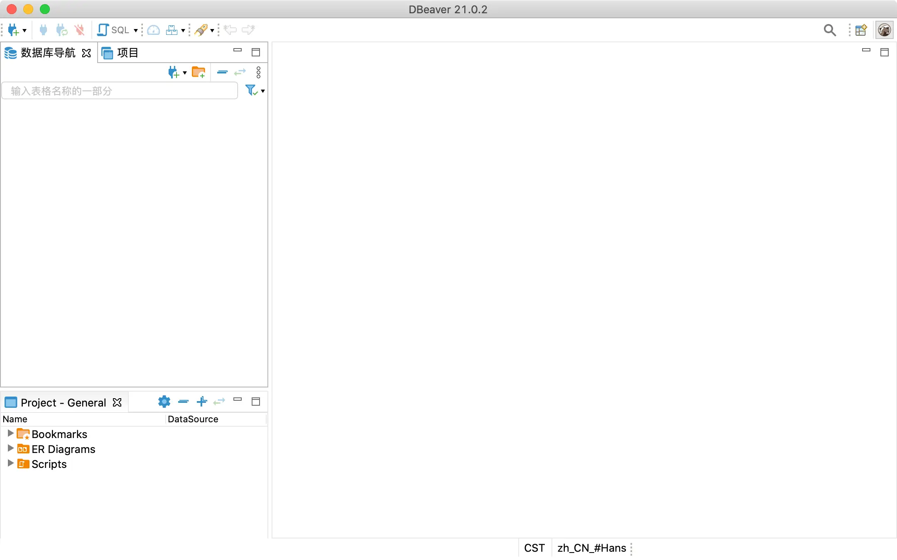

点击左上角的小插头 🔌  新建连接，我们选择 `MySQL` 数据库：

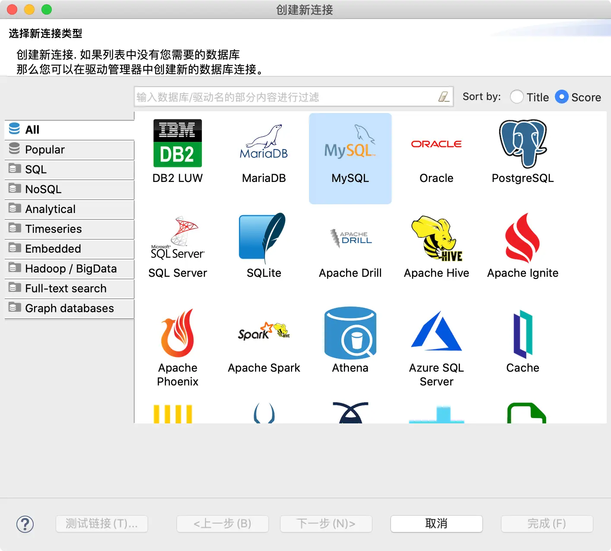

点击「下一步」后，出现如下界面：

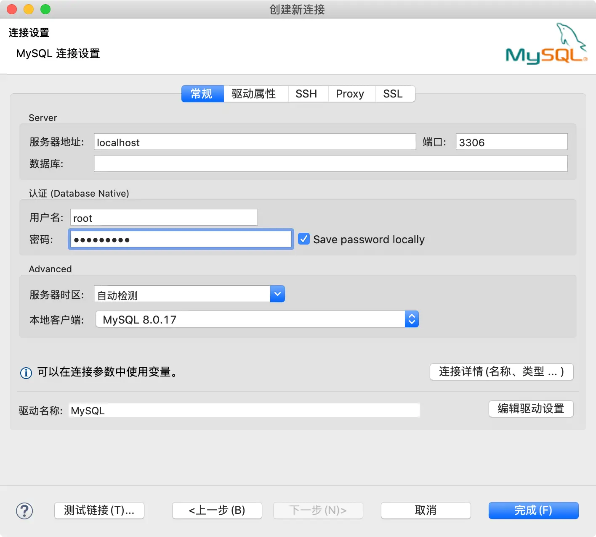

上图中，我没有填写数据库名称，是因为初始化情况下，没有建任何数据库。所以，如果你要是想要连接具体哪一个数据库，这里就可以写上相应的名称。

数据库密码必须是你之前设置好的初始化密码，所以这个密码一定要记住，最好是记在你的记事本上。设置好之后，点击完成。

如果是 `Windows` 系统的同学，通过管理员打开 `cmd`，通过下图指令启动 `MySQL` 之后，无需输入密码，也可以连接到本地的数据库：

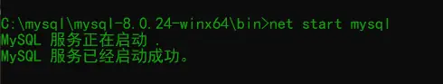

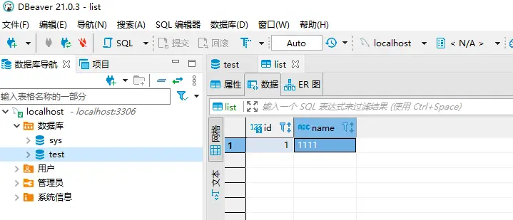

> 注意，本地服务一定要开启，否则无法连接成功，在第 3 章有详细的讲解。

成功之后如下，我的本地已经新建了一些数据库，如下所示：

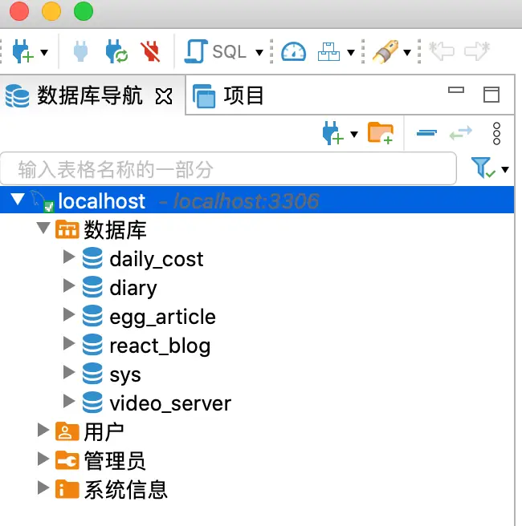

正常情况下，你只会有一个默认的 `sys`。

此时我们已经通过 `DBevaer` 成功连通了数据库，我们接下来新建一个测试数据库，让 `Egg` 能成功的连接上，并且做一些简单的 `CRUD`。

## Egg 连接 MySQL

首先我们新建一个数据库，用于后续的测试操作，如下所示：

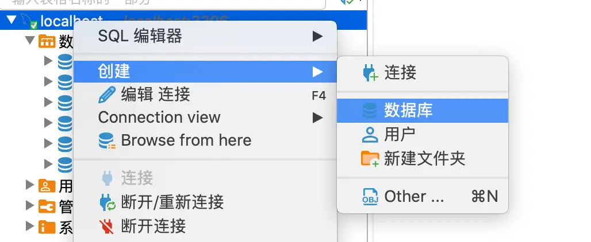

新建一个名为 `test` 的数据库：

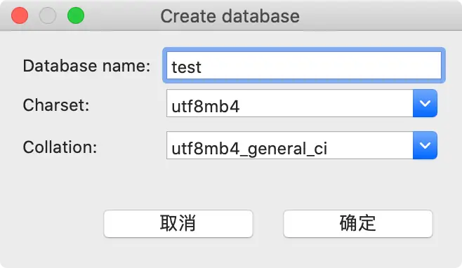

其次，在 `test` 数据库下新建一张数据表，如下所示：

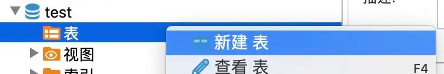

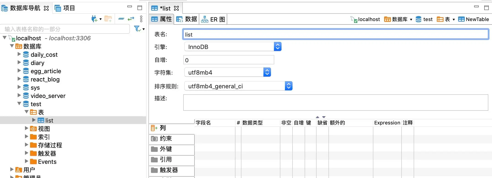

再在 `list` 表下新建列：

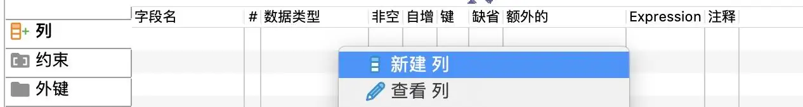

数据类型选择 `INT`，非空和自增都勾选上，如下所示：

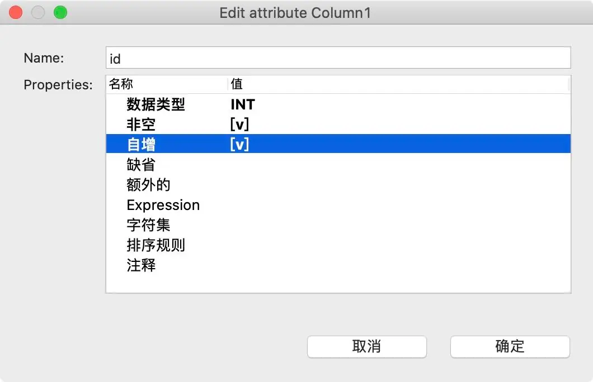

每一张表都需要有一个主键，上述 `list` 表，我们就以 `id` 为主键，点击下图「约束」-> 「新建约束」：

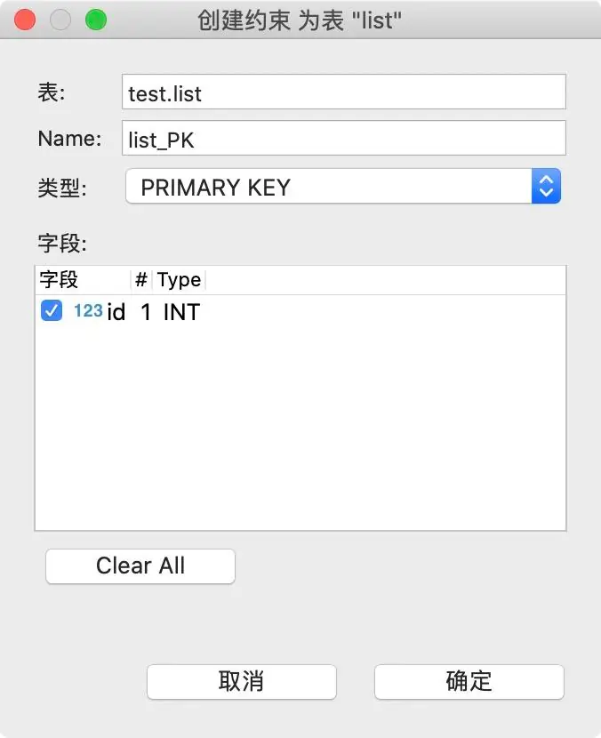

我们保存 `list` 表，选择执行：

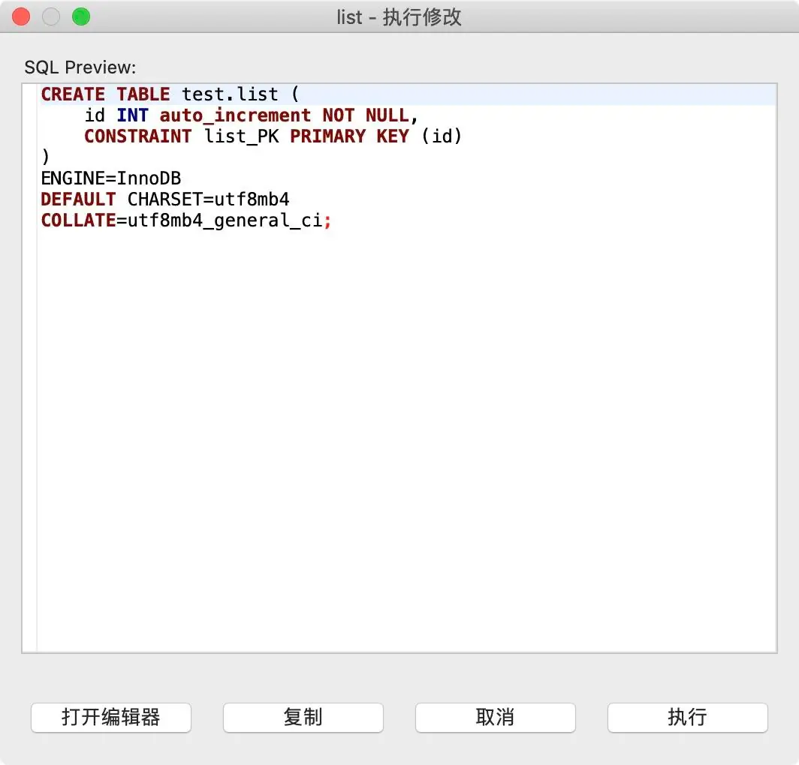

完成之后，我们给 `id` 默认一条数据，切换到「数据」。

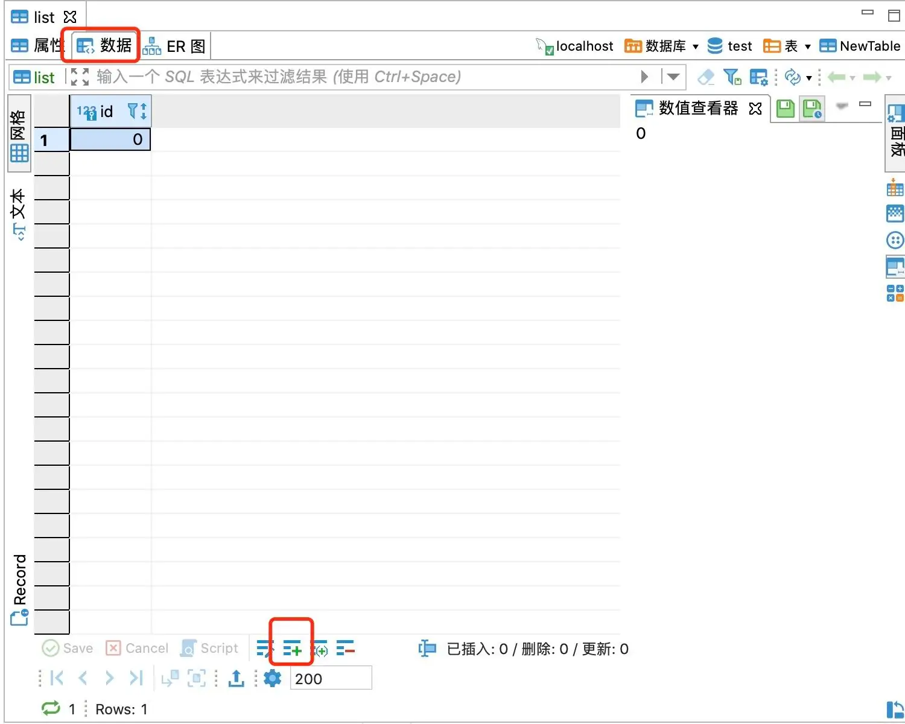

同样的步骤，我们给 `list` 表再新增 `name` 属性，如下所示：

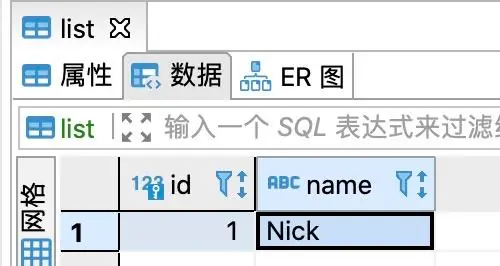

#### 查询接口

保存数据之后，我们打开第 1 章新建好的项目 `egg-example`，安装插件 `egg-mysql` 如下所示：

```bash
npm install egg-mysql
```

打开 `config/plugin.js` 添加插件配置：

```js
'use strict';

/** @type Egg.EggPlugin */
module.exports = {
  ejs: {
    enable: true,
    package: 'egg-view-ejs'
  },
  mysql: {
    enable: true,
    package: 'egg-mysql'
  }
};
```

打开配置文件 `config/config.default.js`，添加 `mysql` 连接配置项：

```js
exports.mysql = {
  // 单数据库信息配置
  client: {
    // host
    host: 'localhost',
    // 端口号
    port: '3306',
    // 用户名
    user: 'root',
    // 密码
    password: '数据库密码', // 初始化密码，没设置的可以不写
    // 数据库名
    database: 'test', // 我们新建的数据库名称
  },
  // 是否加载到 app 上，默认开启
  app: true,
  // 是否加载到 agent 上，默认关闭
  agent: false,
};
```

修改 `service/home.js` 如下所示：

```js
'use strict';

const Service = require('egg').Service;

class HomeService extends Service {
  async user() {
    const { ctx, app } = this;
    const QUERY_STR = 'id, name';
    let sql = `select ${QUERY_STR} from list`; // 获取 id 的 sql 语句
    try {
      const result = await app.mysql.query(sql); // mysql 实例已经挂载到 app 对象下，可以通过 app.mysql 获取到。
      return result;
    } catch (error) {
      console.log(error);
      return null;
    }
  }
}
module.exports = HomeService;
```

修改 `controller/home.js` 的 `user` 方法如下：

```js
async user() {
  const { ctx } = this;
  const result = await ctx.service.home.user();
  ctx.body = result
}
```

修改路由配置 `router.js`：

```js
router.get('/user', controller.home.user);
```

通过 `npm run dev` 启动项目，我们在浏览器直接调用接口，如下所示代表成功。

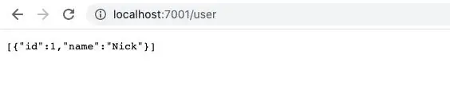

我们通过 `/user` 接口地址，获取到了 `list` 表的 `id` 和 `name` 属性，以数组的形式返回。

> 如果通过 npm run dev 启动不成功，请前往第 3 章，Windiws 安装部分，第 5 步关键步骤，有提示如何修改 mysq 8.0 + 的加密规则。

#### 新增接口

查询接口成功之后，我们来编写新增接口。在 `service/home.js` 下新建一个函数 `addUser`，如下所示：

```js
// 新增
async addUser(name) {
  const { ctx, app } = this;
  try {
    const result = await app.mysql.insert('list', { name }); // 给 list 表，新增一条数据
    return result;
  } catch (error) {
    console.log(error);
    return null;
  }
}
```

再为 `controller/home.js` 添加一个 `addUser` 方法，如下所示：

```js
async addUser() {
  const { ctx } = this;
  const { name } = ctx.request.body;
  try {
    const result = await ctx.service.home.addUser(name);
    ctx.body = {
      code: 200,
      msg: '添加成功',
      data: null
    }
  } catch (error) {
    ctx.body = {
      code: 500,
      msg: '添加失败',
      data: null
    }
  }
}
```

完成之后，添加路由，抛出供前端调用，打开 `router.js` 添加如下代码：

```js
router.post('/add_user', controller.home.addUser);
```

打开 `Postman` 发起一个 `post` 请求，如下所示：

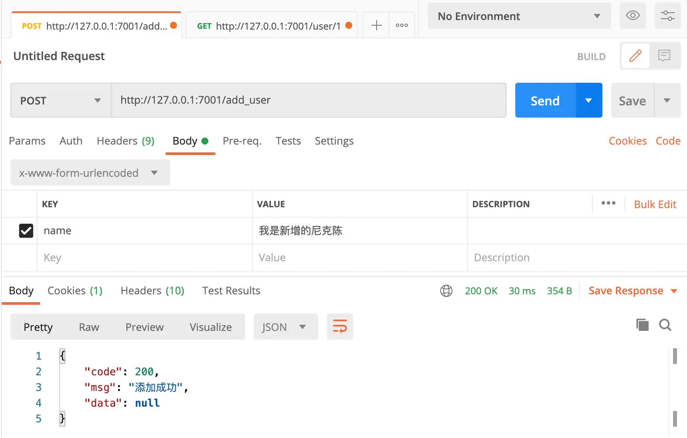

此时我们已经成功往数据库里添加了一条新的内容，我们不妨打开 `DBevaer` 查看数据情况：

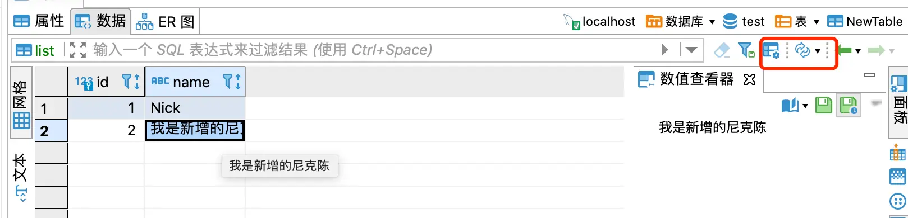

刷新数据库后，我们可以看到 「我是新增的尼克陈」已经被添加到数据库 `list` 表中，并且 `id` 是自动增加的。

此时你再次请求 `/user` 接口，你会拿到两条数据：

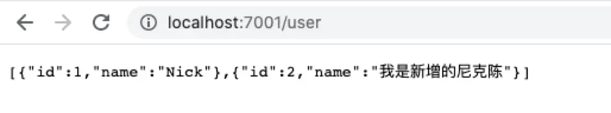

#### 编辑接口

编辑接口，就拿我们上述的内容来说，我们通过 `/user` 拿到了列表数据，我们可以通过 `id` 定位某条数据，去修改它的 `name` 属性。

接下来我们来实现编辑接口，同理，我们打开 `/service/home.js`，添加编辑操作：

```js
// 编辑
async editUser(id, name) {
  const { ctx, app } = this;
  try {
    let result = await app.mysql.update('list', { name }, {
      where: {
        id
      }
    });
    return result;
  } catch (error) {
    console.log(error);
    return null;
  }
}
```

再前往 `/controller/home.js` 添加如下代码：

```js
// 编辑
async editUser() {
  const { ctx } = this;
  const { id, name } = ctx.request.body;
  try {
    const result = await ctx.service.home.editUser(id, name);
    ctx.body = {
      code: 200,
      msg: '添加成功',
      data: null
    }
  } catch (error) {
    ctx.body = {
      code: 500,
      msg: '添加失败',
      data: null
    }
  }
}
```

别忘了添加路由配置，打开 `router.js` 如下所示：

```js
router.post('/edit_user', controller.home.editUser);
```

我们打开 `Postman` 对编辑接口进行调试，如下所示：

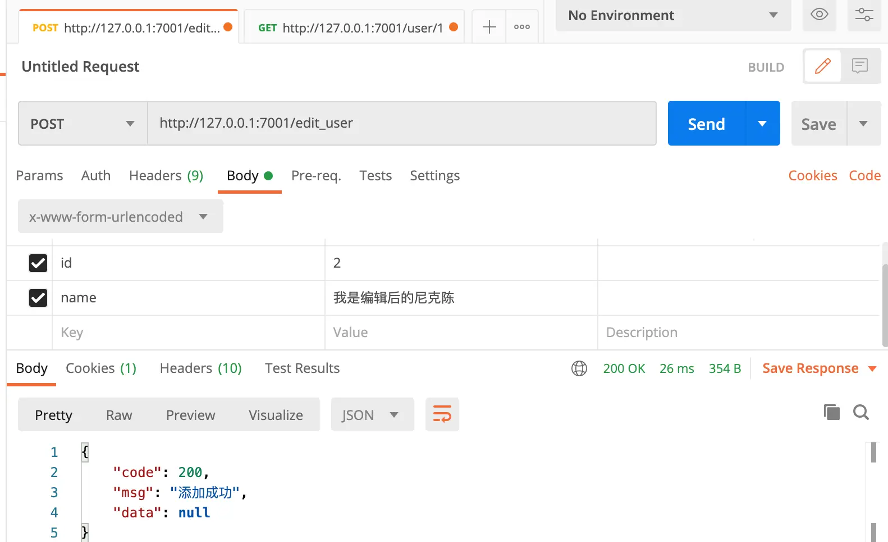

观察数据库 `list` 表是否生效：

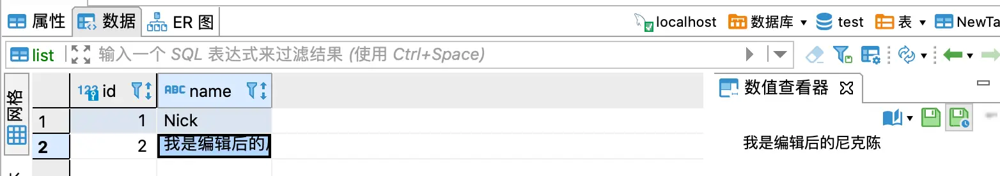

#### 删除接口

删除内容，一向都是比较容易的，我们继续在 `/service/home.js` 添加删除接口，如下所示：

```js
// 删除
async deleteUser(id) {
  const { ctx, app } = this;
  try {
    let result = await app.mysql.delete('list', { id });
    return result;
  } catch (error) {
    console.log(error);
    return null;
  }
}
```

再次前往 `/controller/home.js` 添加相应的控制器方法，如下所示：

```js
// 删除
async deleteUser() {
  const { ctx } = this;
  const { id } = ctx.request.body;
  try {
    const result = await ctx.service.home.deleteUser(id);
    ctx.body = {
      code: 200,
      msg: '删除成功',
      data: null
    }
  } catch (error) {
    ctx.body = {
      code: 500,
      msg: '删除失败',
      data: null
    }
  }
}
```

添加相应路由：

```js
// router.js
router.post('/delete_user', controller.home.deleteUser);
```

打开 `Postman` 调试接口，如下所示：

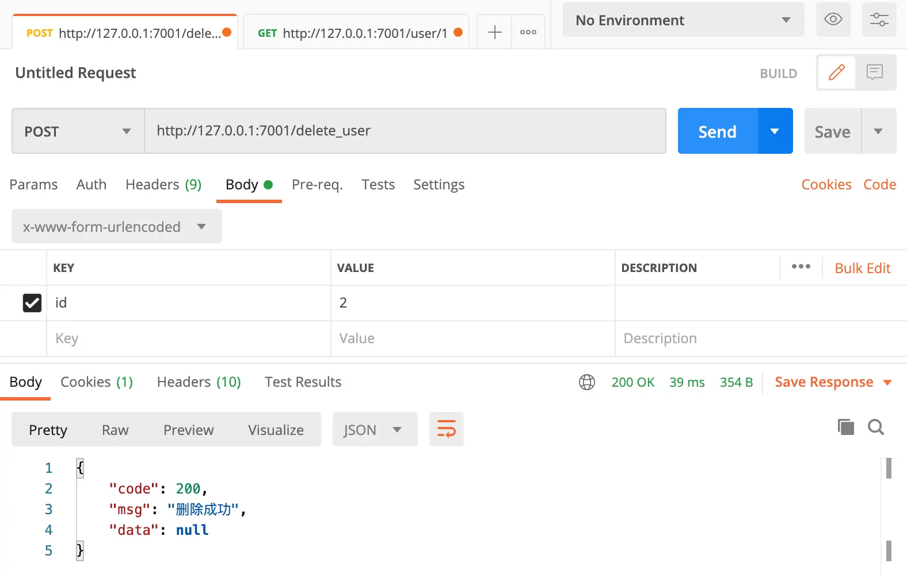

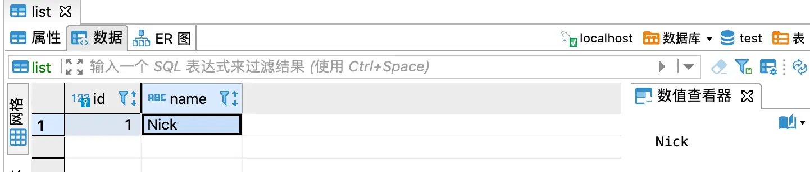

查看数据库，`id` 为 2 的数据已经被清楚了。

## 总结

本章节带大家学习了可视化数据库 `DBevaer` 的安装和使用，并且通过 `Egg` 结合 `Postman` 演示了一边数据库的「增删改查」操作。一个模块数据的「增删改查」，最基础的模式便是如此，而一个项目的落地，需要在此基础上增加各种复杂多变的逻辑与联系。后续我将带大家从 0 到 1，设计「记账本」项目的数据库表结构。

#### 本章节源代码

[点击下载](https://s.yezgea02.com/1620724318684/egg-example.zip)

> 注意，数据库密码我已经清除，大家下载代码后，在 /config/config.default.js 配置项中填写自己的数据库密码。