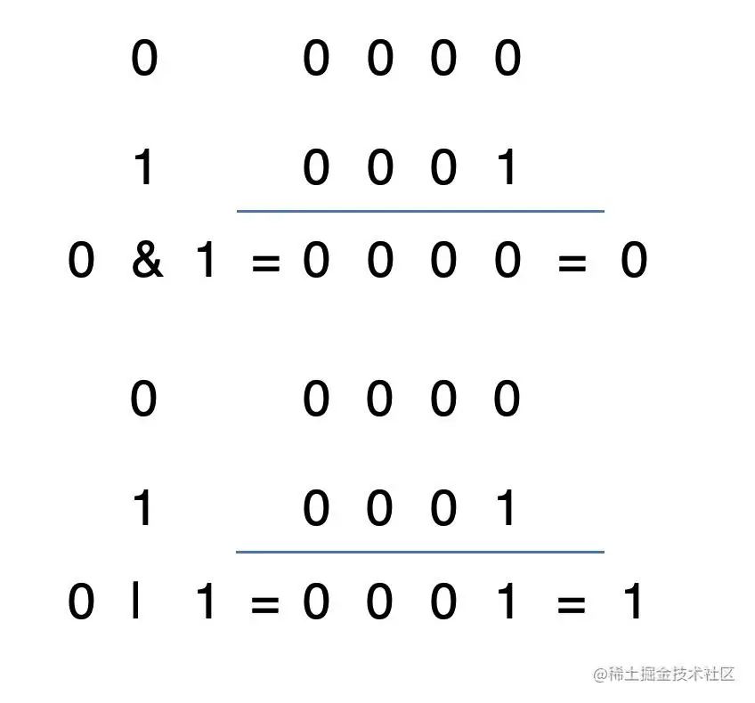
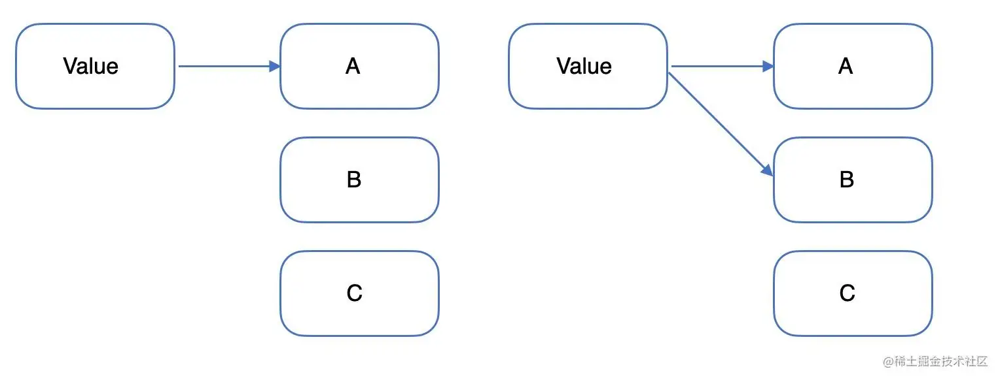

# 19.🔥架构篇-React 中的位运算及其应用

React 中运用了很多位运算的场景，比如在更新优先级模型中采用新的 lane 架构模型，还有判断更新类型中 context 模型，以及更新标志 flags 模型，所以如果想要弄清楚 React 的设计方式和内部运转机制，就需要弄明白 React 架构设计为什么要使用位运算和 React 底层源码中如何使用的位运算。


### 为什么要用位运算？

**什么是位运算？**
计算机专业的同学都知道，程序中的所有数在计算机内存中都是以二进制的形式储存的。位运算就是直接对整数在内存中的二进制位进行操作。

比如 
* 0 在二进制中用 0 表示，我们用 0000 代表；
* 1 在二进制中用 1 表示，我们用 0001 代表；

那么先看两个位元算符号 & 和 ｜：
* & 对于每一个比特位,两个操作数都为 1 时, 结果为 1, 否则为 0
* | 对于每一个比特位,两个操作数都为 0 时, 结果为 0, 否则为 1

我们看一下两个 1 & 0 和  1 ｜ 0


如上 1 & 0 = 0 ，1 ｜ 0 = 1




**常用的位运算：**

先来看一下基本的位运算：

|  运算符  | 用法 |  描述    | 
|  ----  | ----  |   ----   | 
| 与 &   | a & b |  如果两位都是 1 则设置每位为 1  | 
| 或 |   | a ｜ b |  如果两位之一为 1 则设置每位为 1 | 
| 异或 ^   | a ^ b |  如果两位只有一位为 1 则设置每位为 1| 
| 非 ~  | ~a |  反转操作数的比特位, 即 0 变成 1, 1 变成 0| 
| 左移(<<) | a << b | 将 a 的二进制形式向左移 b (< 32) 比特位, 右边用 0 填充 | 
| 有符号右移(>>) | a >> b | 将 a 的二进制形式向右移 b (< 32) 比特位, 丢弃被移除的位, 左侧以最高位来填充 | 
| 无符号右移(>>>) | a >>> b	 | 将 a 的二进制形式向右移 b (< 32) 比特位, 丢弃被移除的位, 并用 0 在左侧填充| 

**位运算的一个使用场景：**

比如有一个场景下，会有很多状态常量 A，B，C...，这些状态在整个应用中在一些关键节点中做流程控制，比如：

````js
if(value === A){
   // TODO...
}
````
如上判断 value 等于常量A ，那么进入到 if 的条件语句中。
此时是 value 属性是简单的一对一关系，但是实际场景下 value 可能是好几个枚举常量的集合，也就是一对多的关系，那么此时 value 可能同时代表 A 和 B 两个属性。如下图所示：




此时的问题就是如何用一个 value 表示 A 和 B 两个属性的集合。
这个时候位运算就派上用场了，因为可以把一些状态常量用 32 位的二进制来表示（这里也可以用其他进制），比如：

````js
const A = 0b0000000000000000000000000000001
const B = 0b0000000000000000000000000000010
const C = 0b0000000000000000000000000000100
````

通过移位的方式让每一个常量都单独占一位，这样在判断一个属性是否包含常量的时候，可以根据当前位数的 1 和 0 来判断。

这样如果一个值即代表 A 又代表 B 那么就可以通过位运算的 | 来处理。就有

AB = A | B = 0b0000000000000000000000000000011

那么如果把 AB 的值赋予给 value ，那么此时的 value 就可以用来代表 A 和 B 。

此时当然不能直接通过等于或者恒等来判断 value 是否为 A 或者 B ，此时就可以通过 & 来判断。具体实现如下：

````js
const A = 0b0000000000000000000000000000001
const B = 0b0000000000000000000000000000010
const C = 0b0000000000000000000000000000100
const N = 0b0000000000000000000000000000000
const value = A | B
console.log((value & A ) !== N ) // true
console.log((value & B ) !== N ) // true
console.log((value & C ) !== N ) // false
````

如上引入一个新的常量 N，它所有的位数都是 0，它本身的数值也就是 0。

可以通过 (value & A ) !== 0 为 true 来判断 value 中是否含有 A ；
同样也可以通过 (value & B ) !== 0 为 true 来判断 value 中是否含有 B；
当然 value 中没有属性 C，所以 (value & C ) !== 0 为false。

**位掩码：**
对于常量的声明（如上的 A B C ）必须满足只有一个 1 位，而且每一个常量二进制 1 的所在位数都不同，如下所示：

0b0000000000000000000000000000001 = 1 </br>
0b0000000000000000000000000000010 = 2 </br>
0b0000000000000000000000000000100 = 4 </br>
0b0000000000000000000000000001000 = 8 </br>
0b0000000000000000000000000010000 = 16 </br>
0b0000000000000000000000000100000 = 32 </br>
0b0000000000000000000000001000000 = 64 </br>
...

可以看到二进制满足的情况都是 2 的幂数。如果我们声明的常量满足如上这个情况，就可以用不同的变量来删除， 比较，合并这些常量。

实际像这种通过二进制储存，通过位运算计算的方式，在计算机中叫做**掩位码**。

React 应用中有很多位运算的场景，接下来枚举几个重要的场景。

### React 位掩码场景（1）—更新优先级

**更新优先级**

React 中是存在不同优先级的任务的，比如用户文本框输入内容，需要 input 表单控件，如果控件是受控的（受数据驱动更新视图的模式），也就是当我们输入内容的时候，需要改变 state 触发更新，在把内容实时呈现到用户的界面上，这个更新任务就比较高优先级的任务。

相比表单输入的场景，比如一个页面从一个状态过渡到另外一个状态，或者一个列表内容的呈现，这些视觉的展现，并不要求太强时效性，期间还可能涉及到与服务端的数据交互，所以这个更新，相比于表单输入，就是一个低优先级的更新。

如果一个用户交互中，仅仅出现一个更新任务，那么 React 只需要公平对待这些更新就可以了。 但是问题是可能存在多个更新任务，举一个例子：远程搜索功能，当用户输入内容，触发列表内容的变化，这个时候如果把输入表单和列表更新放在同一个优先级，无论在 js 执行还是浏览器绘制，列表更新需要的时间远大于一个输入框更新的时间，所以输入框频繁改变内容，会造成列表频繁更新，列表的更新会阻塞到表单内容的呈现，这样就造成了用户不能及时看到输入的内容，造成了一个很差的用户体验。

所以 React 解决方案就是多个更新优先级的任务存在的时候，**高优先级的任务会优先执行，等到执行完高优先级的任务，在回过头来执行低优先级的任务**，这样保证了良好的用户体验。这样就解释了为什么会存在不同优先级的任务，那么 React 用什么标记更新的优先级呢？


**lane**
在 React v17 及以上的版本中，引入了一个新的属性，用来代表更新任务的优先级，它就是 lane ，用这个代替了老版本的 expirationTime，对于为什么用 lane 架构代替 expirationTime 架构，在下一章中会详细讲到。


在新版本 React 中，每一个更新中会把待更新的 fiber 增加了一个更新优先级，我们这里称之为 lane ，而且存在不同的更新优先级，这里枚举了一些优先级，如下所示：

> react-reconciler/src/ReactFiberLane.js
````js
export const NoLanes = /*                        */ 0b0000000000000000000000000000000;
const SyncLane = /*                        */ 0b0000000000000000000000000000001;

const InputContinuousHydrationLane = /*    */ 0b0000000000000000000000000000010;
const InputContinuousLane = /*             */ 0b0000000000000000000000000000100;

const DefaultHydrationLane = /*            */ 0b0000000000000000000000000001000;
const DefaultLane = /*                     */ 0b0000000000000000000000000010000;

const TransitionHydrationLane = /*                */ 0b0000000000000000000000000100000;
const TransitionLane = /*                        */ 0b0000000000000000000000001000000;
````
如上 SyncLane 代表的数值是 1，它却是最高的优先级，也即是说 lane 的代表的数值越小，此次更新的优先级就越大 ，在新版本的 React 中，还有一个新特性，就是 render 阶段可能被中断，在这个期间会产生一个更高优先级的任务，那么会再次更新 lane 属性，这样多个更新就会合并，这样一个 **lane 可能需要表现出多个更新优先级。**

所以通过位运算，让多个优先级的任务合并，这样可以通过位运算分离出高优先级和低优先级的任务。

**分离高优先级任务**

我们来看一下 React 是如何通过位运算分离出优先级的。

当存在多个更新优先级的时候，React 肯定需要优先执行高优先级的任务，那么首先就是需要从合并的优先级 lane 中分离出高优先级的任务，来看一下实现细节。

> react-reconciler/src/ReactFiberLane.js -> getHighestPriorityLanes

````js
function getHighestPriorityLanes(lanes) {
   /* 通过 getHighestPriorityLane 分离出优先级高的任务 */ 
  switch (getHighestPriorityLane(lanes)) {
       case SyncLane:
         return SyncLane;
       case InputContinuousHydrationLane:
         return InputContinuousHydrationLane;
       ...  
  }
````
在 React 底层就是通过 getHighestPriorityLane 分离出高优先级的任务，这个函数主要做了什么呢？

> react-reconciler/src/ReactFiberLane.js -> getHighestPriorityLane
````js
function getHighestPriorityLane(lanes) {
  return lanes & -lanes;
}
````
如上就是通过 lanes & -lanes 分离出最高优先级的任务的，我们来看一下具体的流程。

比如 SyncLane 和 InputContinuousLane 合并之后的任务优先级 lane 为

SyncLane = 0b0000000000000000000000000000001 </br>
InputContinuousLane = 0b0000000000000000000000000000100 </br>

lane = SyncLane ｜ InputContinuousLane </br>
lane = 0b0000000000000000000000000000101 </br>

那么通过 lanes & -lanes 分离出 SyncLane。

首先我们看一下 -lanes，在二进制中需要用补码表示为：

-lane = 0b1111111111111111111111111111011 </br>

那么接下来执行 lanes & -lanes 看一下，& 的逻辑是如果两位都是 1 则设置改位为 1，否则为 0。

那么 lane & -lane ，只有一位（最后一位）全是 1，所有合并后的内容为：

lane & -lane = 0b0000000000000000000000000000001 </br>

可以看得出来 lane & -lane 的结果是 SyncLane，所以通过 lane & -lane 就能分离出最高优先级的任务。

````js
const SyncLane = 0b0000000000000000000000000000001
const InputContinuousLane = 0b0000000000000000000000000000100
const lane = SyncLane | InputContinuousLane
console.log( (lane & -lane) === SyncLane  ) // true
````


### React 位掩码场景（2）——更新上下文

lane 是标记了更新任务的优先级的属性，那么 lane 决定了更新与否，那么进入了更新阶段，也有一个属性用于判断现在更新上下文的状态，这个属性就是 ExecutionContext。

**更新上下文状态—ExecutionContext**

为什么用一个状态证明当前更新上下文呢？列举一个场景，我们从 React 批量更新说起，比如在一次点击事件更新中，多次更新 state，那么在 React 中会被合成一次更新，那么就有一个问题，React 如何知道当前的上下文中需要合并更新的呢？这个时候更新上下文状态 ExecutionContext 就派上用场了，通过给 ExecutionContext 赋值不同的状态，来证明当前上下文的状态，点击事件里面的上下文会被赋值独立的上下文状态。具体实现细节如下所示：

````js
function batchedEventUpdates(){
    var prevExecutionContext = executionContext;
    executionContext |= EventContext;  // 赋值事件上下文 EventContext 
    try {
        return fn(a);  // 执行函数
    }finally {
        executionContext = prevExecutionContext; // 重置之前的状态
    }
}
````
在 React 事件系统中给 executionContext 赋值 EventContext，在执行完事件后，再重置到之前的状态。就这样在事件系统中的更新能感知到目前的更新上下文是 EventContext，那么在这里的更新就是可控的，就可以实现批量更新的逻辑了。

我们看一下 React 中常用的更新上下文，这个和最新的 React 源码有一些出入

````js
export const NoContext = /*             */ 0b0000000;
const BatchedContext = /*               */ 0b0000001;
const EventContext = /*                 */ 0b0000010;
const DiscreteEventContext = /*         */ 0b0000100;
const LegacyUnbatchedContext = /*       */ 0b0001000;
const RenderContext = /*                */ 0b0010000;
const CommitContext = /*                */ 0b0100000;
export const RetryAfterError = /*       */ 0b1000000;
````

和 lanes 的定义不同, ExecutionContext 类型的变量, 在定义的时候采取的是 8 位二进制表示，在最新的源码中 ExecutionContext 类型变量采用 4 位的二进制表示。

````js
export const NoContext = /*             */ 0b000;
const BatchedContext = /*               */ 0b001;
const RenderContext = /*                */ 0b010;
const CommitContext = /*                */ 0b100;
let executionContext = NoContext;
````

对于 React 内部变量的设计，我们无需关注，这里重点关注的是如果运用这里状态来管理 React 上下文中一些关键节点的流程控制。

在 React 整体设计中，executionContext 作为一个全局状态，指引 React 更新的方向，在 React 运行时上下文中，无论是初始化还是更新，都会走一个入口函数，它就是 scheduleUpdateOnFiber ，这个函数会使用更新上下文来判别更新的下一步走向。

这个流程在第十章 React 运行时中，会详细讲到，我们先来看一下 scheduleUpdateOnFiber 中 executionContext 和位运算的使用：

````js
if (lane === SyncLane) {
        if (
            (executionContext & LegacyUnbatchedContext) !== NoContext && // unbatch 情况，比如初始化
            (executionContext & (RenderContext | CommitContext)) === NoContext) {
            //直接更新
         }else{
               if (executionContext === NoContext) {
                   //放入调度更新
               }
         }
    }
````

如上就是通过 executionContext 以及位运算来判断是否**直接更新**还是**放入到调度中去更新**。


### React 位掩码场景 (3) —更新标识 flag

经历了更新优先级 lane 判断是否更新，又通过更新上下文 executionContext 来判断更新的方向，那么到底更新什么? 又有哪些种类的更新呢？这里就涉及到了 React 中 fiber 的另一个状态—flags，这个状态证明了当前 fiber 存在什么种类的更新。


先来看一下 React 应用中存在什么种类的 flags：

````js
export const NoFlags = /*                      */ 0b00000000000000000000000000;
export const PerformedWork = /*                */ 0b00000000000000000000000001;
export const Placement = /*                    */ 0b00000000000000000000000010;
export const Update = /*                       */ 0b00000000000000000000000100;
export const Deletion = /*                     */ 0b00000000000000000000001000;
export const ChildDeletion = /*                */ 0b00000000000000000000010000;
export const ContentReset = /*                 */ 0b00000000000000000000100000;
export const Callback = /*                     */ 0b00000000000000000001000000;
export const DidCapture = /*                   */ 0b00000000000000000010000000;
export const ForceClientRender = /*            */ 0b00000000000000000100000000;
export const Ref = /*                          */ 0b00000000000000001000000000;
export const Snapshot = /*                     */ 0b00000000000000010000000000;
export const Passive = /*                      */ 0b00000000000000100000000000;
export const Hydrating = /*                    */ 0b00000000000001000000000000;
export const Visibility = /*                   */ 0b00000000000010000000000000;
export const StoreConsistency = /*             */ 0b00000000000100000000000000;
````

这些 flags 代表了当前 fiber 处于什么种类的更新状态。React 对于这些状态也是有专门的阶段去处理。具体的流程我们在接下来的章节中会讲到，我们先形象地描述一下过程：

比如一些小朋友在做一个寻宝的游戏，在沙滩中埋了很多宝藏，有专门搜索这些宝藏的仪器，也有挖这些宝藏的工具，那么小朋友中会分成两组，一组负责拿仪器寻宝，另外一组负责挖宝，寻宝的小朋友在前面，找到宝藏之后不去直接挖，而是插上小旗子 （flags） 证明这个地方有宝藏，接下来挖宝的小朋友统一拿工具挖宝。这个流程非常高效，把不同的任务分配给不同的小朋友，各尽其职。

React 的更新流程和如上这个游戏如出一撤，也是分了两个阶段，第一个阶段就像寻宝的小朋友一样，找到待更新的地方，设置更新标志 flags，接下来在另一个阶段，通过 flags 来证明当前 fiber 发生了什么类型的更新，然后执行这些更新。

````js
const NoFlags = 0b00000000000000000000000000;
const PerformedWork =0b00000000000000000000000001;
const Placement =  0b00000000000000000000000010;
const Update = 0b00000000000000000000000100;
//初始化
let flag = NoFlags

//发现更新，打更新标志
flag = flag | PerformedWork | Update

//判断是否有  PerformedWork 种类的更新
if(flag & PerformedWork){
    //执行
    console.log('执行 PerformedWork')
}

//判断是否有 Update 种类的更新
if(flag & Update){
    //执行
    console.log('执行 Update')
}


if(flag & Placement){
    //不执行
    console.log('执行 Placement')
}
````

如上会打印 `执行 PerformedWork `，上面的流程清晰的描述了在 React 打更新标志，又如何判断更新类型的。

希望读者记住在 React 中位运算的三种情况，以及解决了什么问题，应用在哪些场景中，这对接下来 React 原理深入会很有帮助。

### 参考文档

[JavaScript 位运算符](https://www.w3school.com.cn/js/js_bitwise.asp)