# 第02章—一网打尽组件常用Hook

React 组件支持 class、function 两种形式，但现在绝大多数情况下我们都是写 function 组件了。

[官方文档](https://react.dev/reference/react/Component)也已经把 class 组件的语法划到了 legacy（遗产）的目录下：

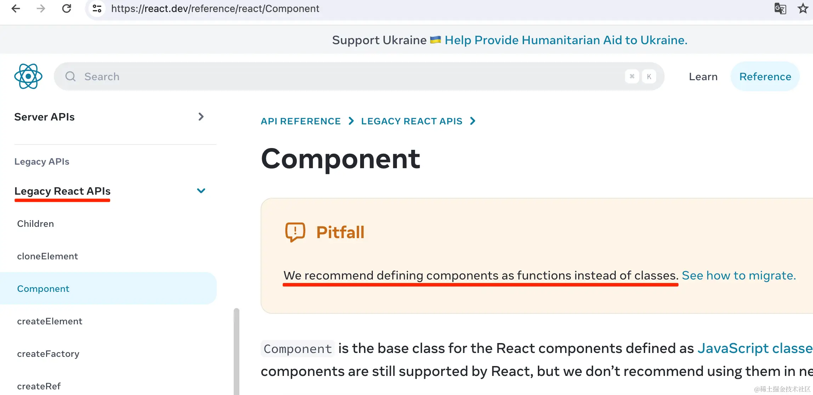

所以说，除非你维护的代码里有历史代码用了 class 组件，否则就没必要看那些用法了。

而 function 组件主要是学习各种 hook 的使用。

这节我们就来过一遍常用 hook。

首先用 create-react-app 创建个项目：

```
npx create-react-app --template typescript hook-test
```

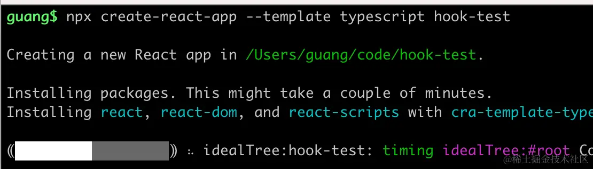

在 index.tsx 里把这三行代码注释掉：

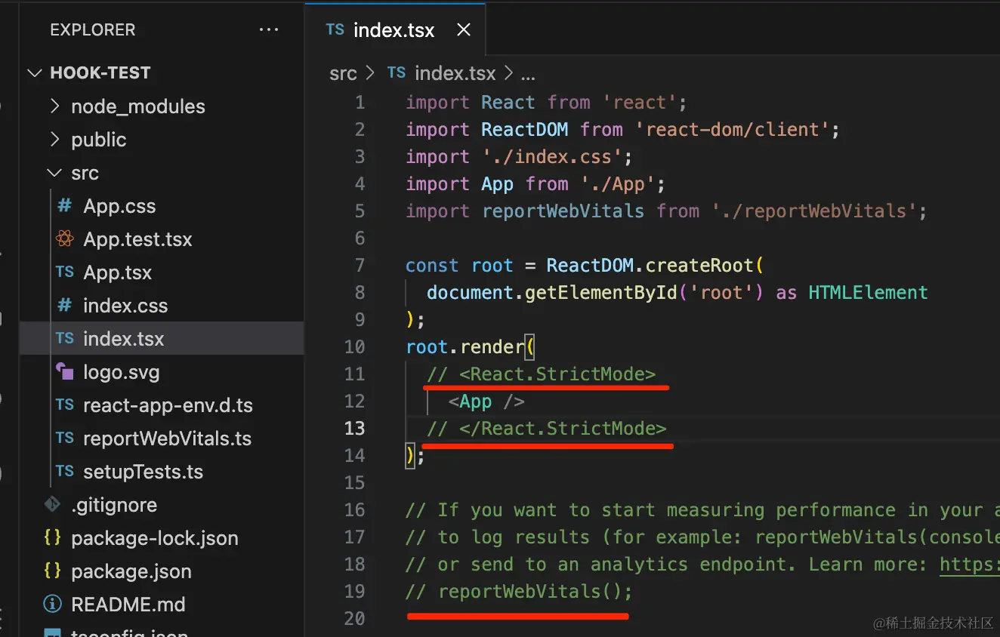

React.StrictMode 会导致额外的渲染，下面那个上报性能数据的，cra 自带的，我们也用不到。

然后改下 App.tsx

```javascript
import { useState } from "react";

function App() {
  const [num, setNum] = useState(1);

  return (
    <div onClick={() => setNum(num + 1)}>{num}</div>
  );
}

export default App;
```
这里用到了第一个 hook：useState。

## useState

什么是 state 呢？

像 111、'xxx'、{ a: 1 } 这种叫做数据，它们可以是各种数据类型，但都是固定不变的。

从一种数据变成另一种数据，这种就是状态（state）了。

也就是说，**状态是变化的数据。**

其实细想一下，组件的核心就是状态。

点击、拖拽等交互事件会改变状态，而状态改变会触发重新渲染。

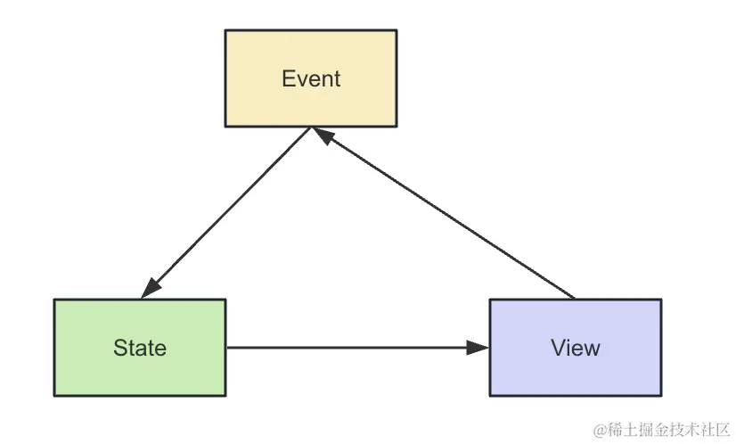

组件内的状态是 useState 创建的，整个应用还可以加一个全局状态管理的库来管理 state。

所以说，state 虽然是基础，但它却是前端应用的核心。

回过头来跑一下上面的代码：


state 初始值是 1，点击改变状态，这个很简单。

如果初始状态需要经过复杂计算得到，可以传个函数来计算初始值：

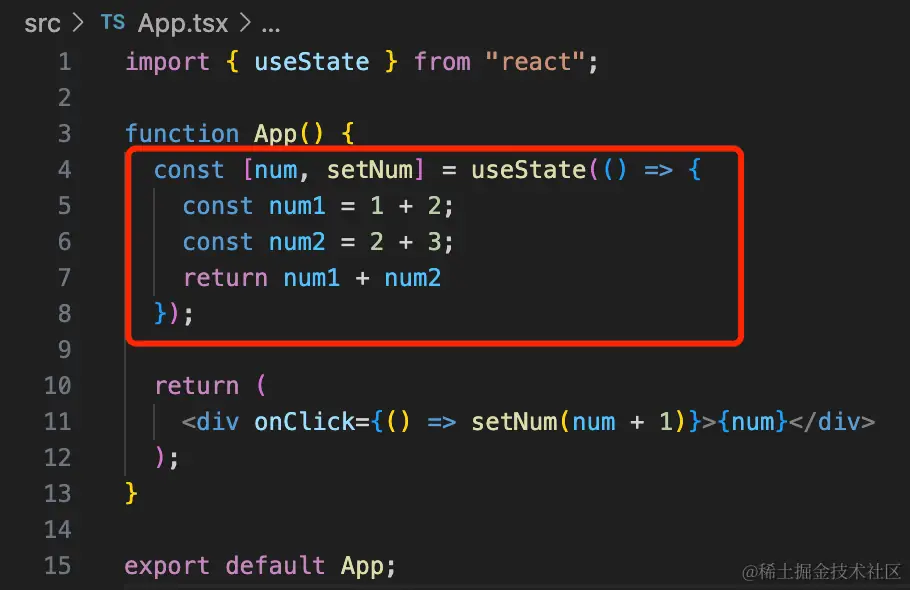

```javascript
const [num, setNum] = useState(() => {
    const num1 = 1 + 2;
    const num2 = 2 + 3;
    return num1 + num2
});
```
这个函数只能写一些同步的计算逻辑，不支持异步。

useState 返回一个数组，包含 state 和 setXxx 的 api，一般我们都是用解构语法取。

这个 setXxx 的 api 也有两种参数：

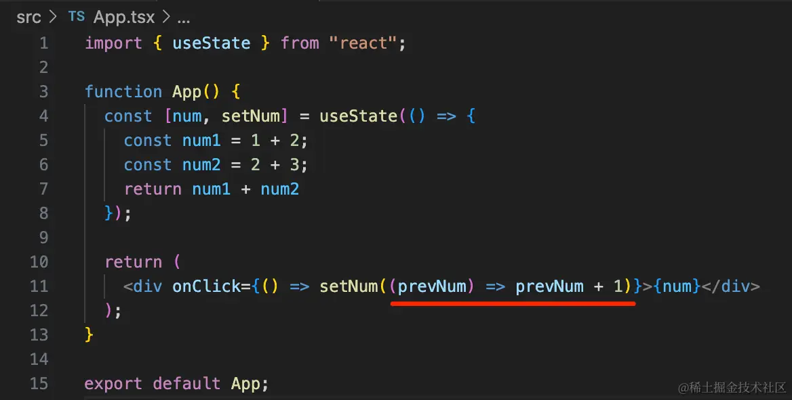

可以直接传新的值，或者传一个函数，返回新的值，这个函数的参数是上一次的 state。

跑一下，功能正常：


除了在 click 事件处理函数里 setState，如果想在初次渲染的时候请求数据然后 setState 呢？

这时候就要用到 useEffect 了。

## useEffect

effect 被翻译为副作用。

为啥叫副作用呢？

之前的函数组件是纯函数，传入 props，返回对应的结果，再次调用，传入 props，依然返回同样的结果。

但现在有了 effect 之后，每次执行函数，额外执行了一些逻辑，这些逻辑不就是副作用么？

我们写个 App2.tsx：

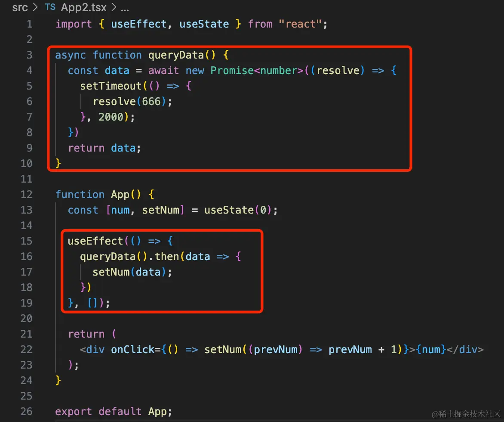

```javascript
import { useEffect, useState } from "react";

async function queryData() {
  const data = await new Promise<number>((resolve) => {
    setTimeout(() => {
      resolve(666);
    }, 2000);
  })
  return data;
}

function App() {
  const [num, setNum] = useState(0);

  useEffect(() => {
    queryData().then(data => {
      setNum(data);
    })
  }, []);

  return (
    <div onClick={() => setNum((prevNum) => prevNum + 1)}>{num}</div>
  );
}

export default App;

```
注意，想用 async await 语法需要单独写一个函数，因为 useEffect 参数的那个函数不支持 async。

把 index.tsx 渲染的组件改为 App2

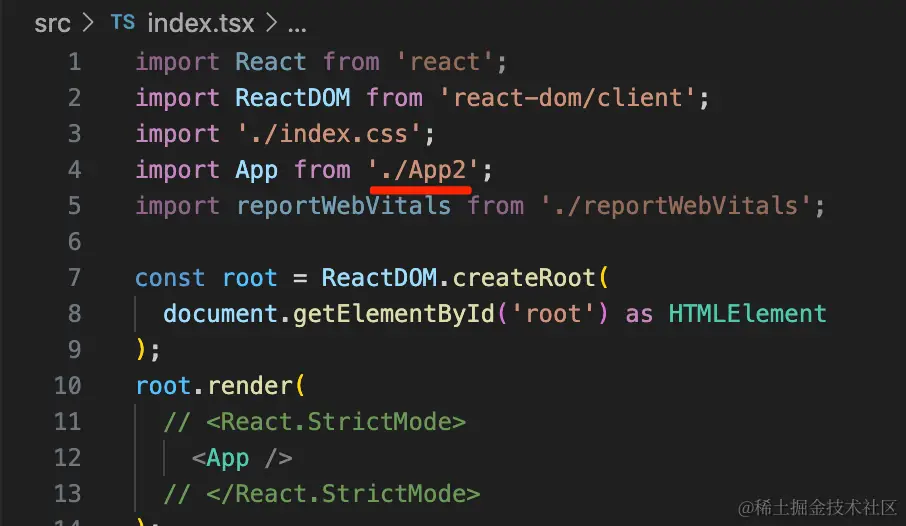

浏览器访问下，可以看到 2s 后，state 变为了 666:

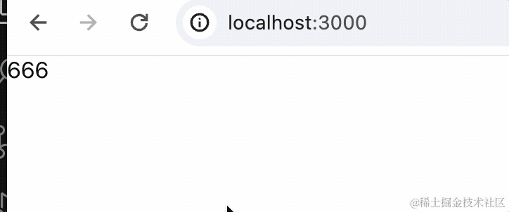

请求数据、定时器等这些异步逻辑，我们都会放在 useEffect 里。

回过头来看下 useEffect：

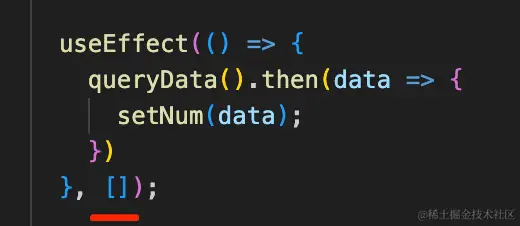

第二个参数为什么传空数组呢？

这个数组叫做依赖数组，react 是根据它有没有变来决定是否执行 effect 函数的，如果没传则每次都执行。

我们加个打印：

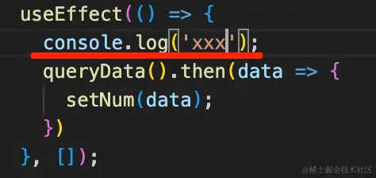

现在这个组件会渲染两次，初始渲染和 2s 后 setNum 触发的渲染，也就是 function 会执行 2 次。

打开 devtools 看一下：

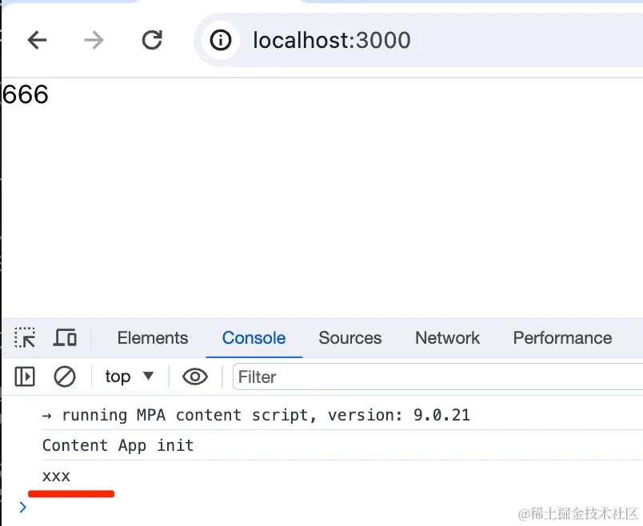

xxx 只执行了一次，因为 [] 每次都不变。

我也可以写任意的常量，因为它们都不变，所以不会触发 effect 的重新执行：

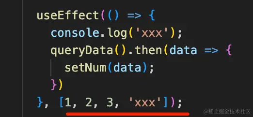


但如果其中有个变化的值，那就会触发重新执行了：

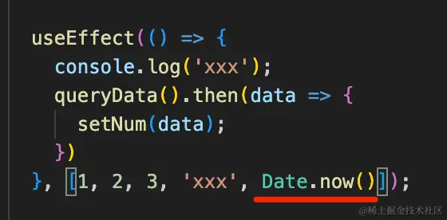

可以看到，现在每次渲染，effect 都会执行：

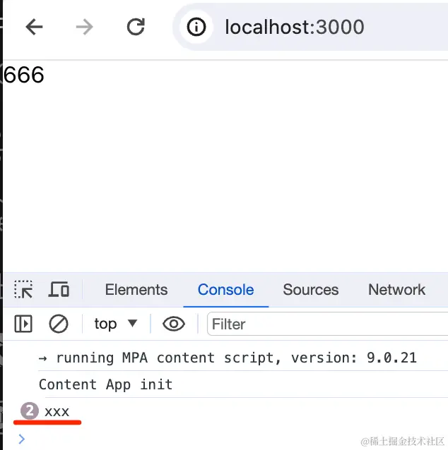

这个数组我们一般写依赖的 state，这样在 state 变了之后就会触发重新执行了。

不传 deps 数组的时候也是每次都会重新执行 effect 函数：

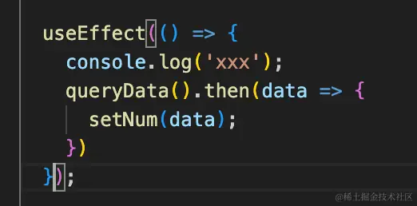

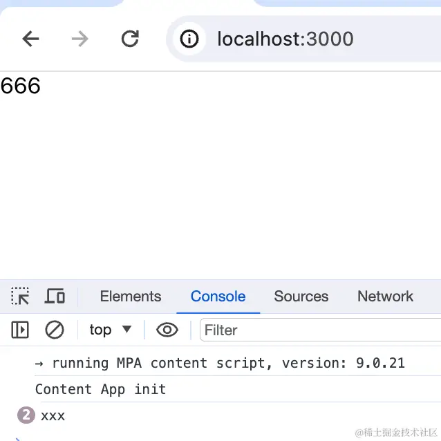

那 useEffect 里如果跑了一个定时器，依赖变了之后，再次执行 useEffect，又跑了一个，怎么清理上一个定时器呢？

这样写：

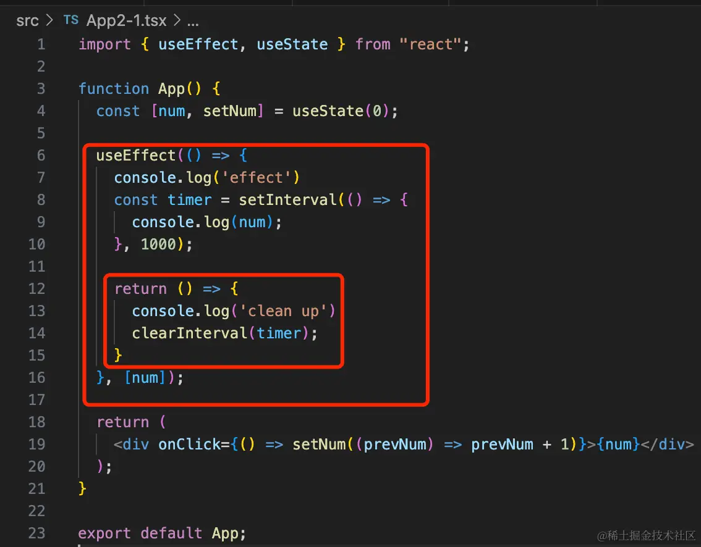

```javascript
import { useEffect, useState } from "react";

function App() {
  const [num, setNum] = useState(0);

  useEffect(() => {
    console.log('effect')
    const timer = setInterval(() => {
      console.log(num);
    }, 1000);

    return () => {
      console.log('clean up')
      clearInterval(timer);
    }
  }, [num]);

  return (
    <div onClick={() => setNum((prevNum) => prevNum + 1)}>{num}</div>
  );
}

export default App;
```
跑一下：

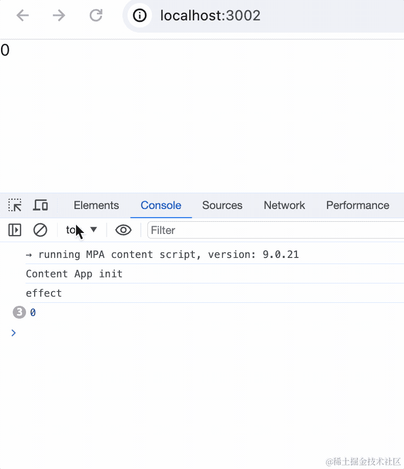

可以看到，当 deps 数组变了，重新执行 effect 之前，会先执行清理函数，打印了 clean up。

此外，组件销毁时也会调用 cleanup 函数来进行清理。

## useLayoutEffect

和 useEffect 类似的还有一个 useLayoutEffect。

绝大多数情况下，你把 useEffect 换成 useLayoutEffect 也一样：

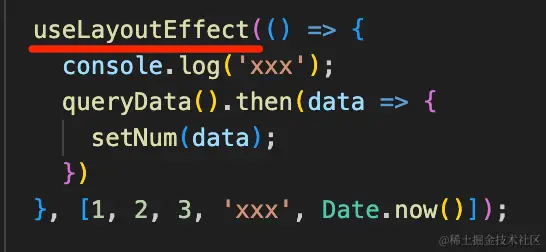


那为啥还要有这两个 hook 呢？

我们知道，js 执行和渲染是阻塞的：


useEffect 的 effect 函数会在操作 dom 之后异步执行：

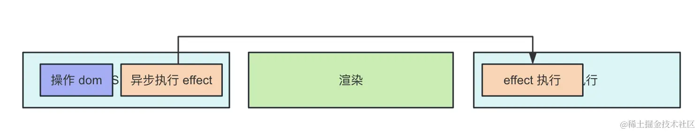

异步执行就是用 setTimeout、Promise.then 等 api 包裹执行的逻辑。

这些逻辑会以单独的宏任务或者微任务的形式存在，然后进入 Event Loop 调度执行。

打开 Permormance 工具，可以看到 Event Loop 的详情：

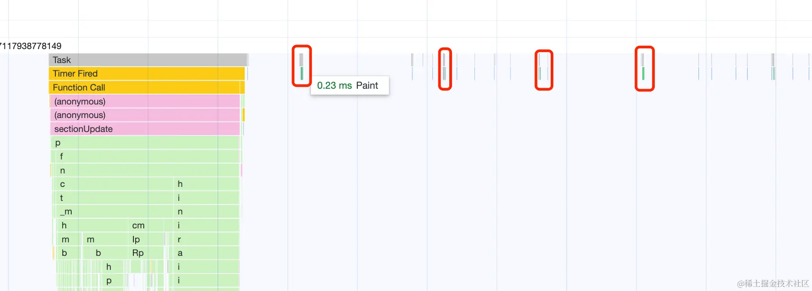

可以看到，渲染的间隔是固定的，而 js 的任务在这些渲染的间隔中执行。

所以异步执行的 effect 逻辑就有两种可能：

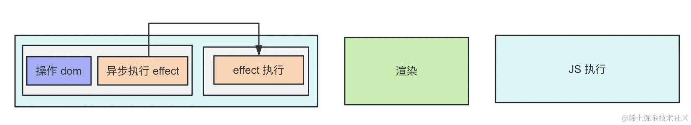

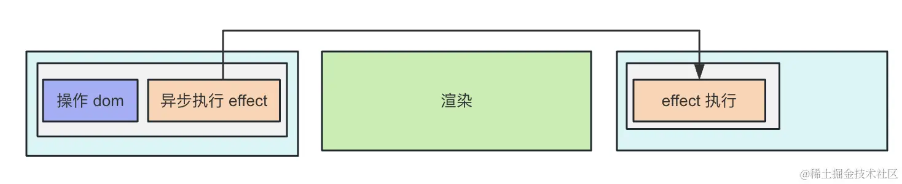

灰色的部分是单独的任务。

有可能在下次渲染之前，就能执行完这个 effect。

也有可能下次渲染前，没时间执行这个 effect，所以就在渲染之后执行了。

这样就导致有的时候页面会出现闪动，因为第一次渲染的时候的 state 是之前的值，渲染完之后执行 effect 改了 state，再次渲染就是新的值了。

一般这样也没啥问题，但如果你遇到这种情况，不想闪动那一下，就用 useLayoutEffect。

它和 useEffect 的区别是它的 effect 执行是同步的，也就是在同一个任务里：

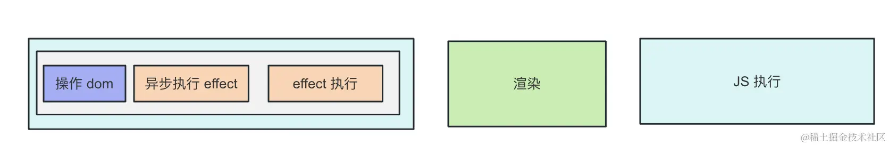

这样浏览器会等 effect 逻辑执行完再渲染。

好处自然就是不会闪动了。

但坏处也很明显，如果你的 effect 逻辑要执行很久呢？

不就阻塞渲染了？

超过 50ms 的任务就被称作长任务，会阻塞渲染，导致掉帧：

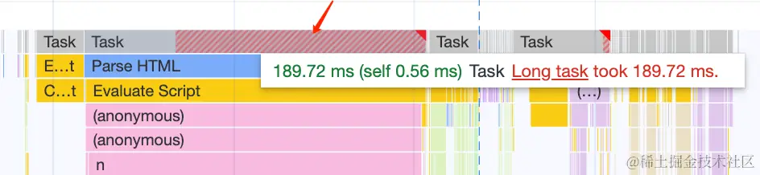

所以说，一般情况下，还是让 effect 逻辑异步执行的好。

也就是说，绝大多数情况下，用 useEffect，它能避免因为 effect 逻辑执行时间长导致页面卡顿（掉帧）。
但如果你遇到闪动的问题比较严重，那可以用 useLayoutEffect，但要注意 effect 逻辑不要执行时间太长。

同步、异步执行 effect 都各有各的问题和好处，所以 React 暴露了 useEffect 和 useLayoutEffect 这两个 hook 出来，让开发者自己决定。

## useReducer

前面用的 setState 都是直接修改值，那如果在修改值之前需要执行一些固定的逻辑呢？

这时候就要用 useReducer 了：

添加一个 App3.tsx：

```javascript
import { Reducer, useReducer } from "react";

interface Data {
    result: number;
}

interface Action {
    type: 'add' | 'minus',
    num: number
}
function reducer(state: Data, action: Action) {

    switch(action.type) {
        case 'add':
            return {
                result: state.result + action.num
            }
        case 'minus': 
            return {
                result: state.result - action.num
            }
    }
    return state;
}

function App() {
  const [res, dispatch] = useReducer<Reducer<Data, Action>>(reducer, { result: 0});

  return (
    <div>
        <div onClick={() => dispatch({ type: 'add', num: 2 })}>加</div>
        <div onClick={() => dispatch({ type: 'minus', num: 1 })}>减</div>
        <div>{res.result}</div>
    </div>
  );
}

export default App;

```
useReducer 的类型参数传入 Reducer\<数据的类型，action 的类型>

然后第一个参数是 reducer，第二个参数是初始数据。

点击加的时候，触发 add 的 action，点击减的时候，触发 minus 的 action。

在 index.tsx 里引入：

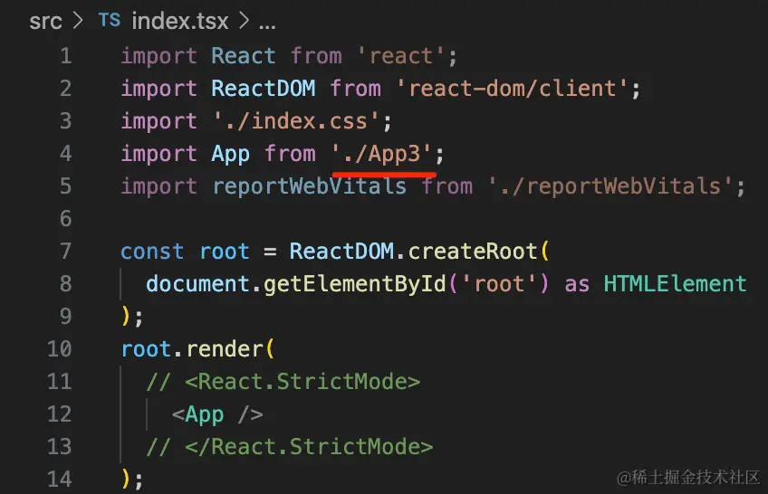

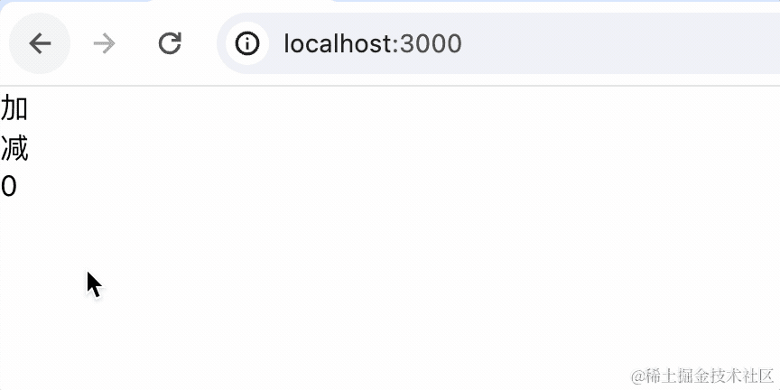

当然，你直接 setState 也可以：

```javascript
import { useState } from "react";

function App() {
  const [res, setRes] = useState({ result: 0});

  return (
    <div>
        <div onClick={() => setRes({ result: res.result + 2 })}>加</div>
        <div onClick={() => setRes({ result: res.result - 1 })}>减</div>
        <div>{res.result}</div>
    </div>
  );
}

export default App;
```
有同学可能会说，用 useState 比 useReducer 简洁多了。

确实，这个例子不复杂，没必要用 useReducer。

但如果要执行比较复杂的逻辑呢？

用 useState 需要在每个地方都写一遍这个逻辑，而用 useReducer 则是把它封装到 reducer 里，通过 action 触发就好了。

**当修改 state 的逻辑比较复杂，用 useReducer。**

回过头来继续看 useReducer：

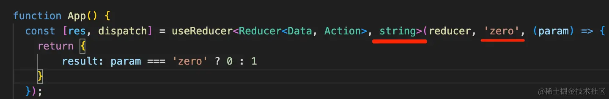

```javascript
const [res, dispatch] = useReducer<Reducer<Data, Action>, string>(reducer, 'zero', (param) => {
    return {
        result: param === 'zero' ? 0 : 1
    }
});
```
它还有另一种重载，通过函数来创建初始数据，这时候 useReducer 第二个参数就是传给这个函数的参数。

并且在类型参数里也需要传入它的类型。


## useReducer + immer

此外，使用 reducer 有一个特别要注意的地方：

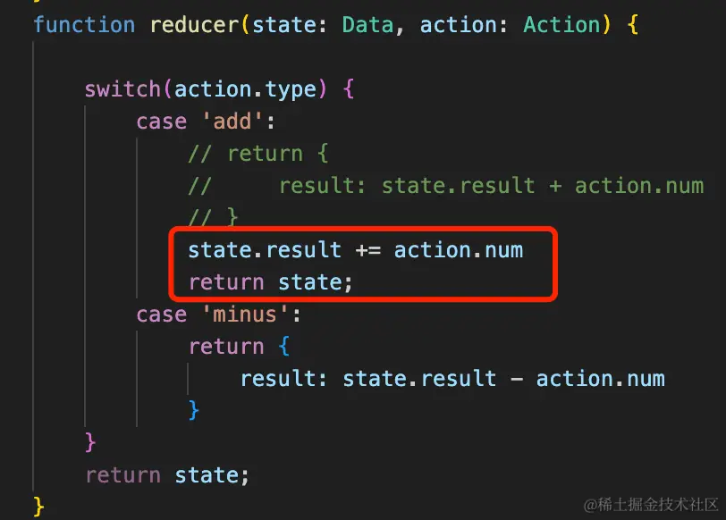

如果你直接修改原始的 state 返回，是触发不了重新渲染的：

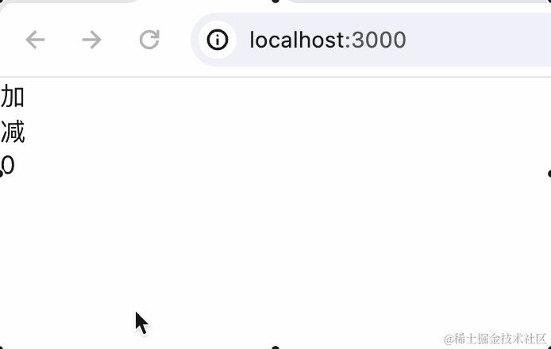

必须返回一个新的对象才行。

但这也有个问题，如果对象结构很复杂，每次都创建一个新的对象会比较繁琐，而且性能也不好。

比如这样：

```javascript
import { Reducer, useReducer } from "react";

interface Data {
    a: {
        c: {
            e: number,
            f: number
        },
        d: number
    },
    b: number
}

interface Action {
    type: 'add',
    num: number
}

function reducer(state: Data, action: Action) {

    switch(action.type) {
        case 'add':
            return {
                ...state,
                a: {
                    ...state.a,
                    c: {
                        ...state.a.c,
                        e: state.a.c.e + action.num,
                    },
                },
            }
    }
    return state;
}

function App() {
  const [res, dispatch] = useReducer<Reducer<Data, Action>, string>(reducer, 'zero', (param) => {
    return {
        a: {
            c: {
                e: 0,
                f: 0
            },
            d: 0
        },
        b: 0
    }
  });

  return (
    <div>
        <div onClick={() => dispatch({ type: 'add', num: 2 })}>加</div>
        <div>{JSON.stringify(res)}</div>
    </div>
  );
}

export default App;
```
这里的 data 是一个复杂的对象结构，我们需要改的是其中的一个属性，但是为了创建新对象，要把其余属性依次复制一遍。

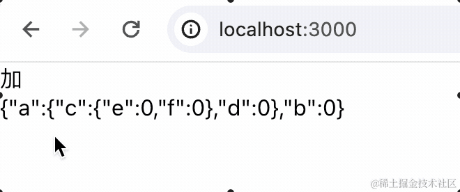

这样能完成功能，但是写起来很麻烦，也不好维护。

有没有什么更好的方式呢？

有，复杂对象的修改就要用 immutable 相关的库了。

最常用的是 immer：

```
npm install --save immer
```
用法相当简单，只有一个 produce 的 api：

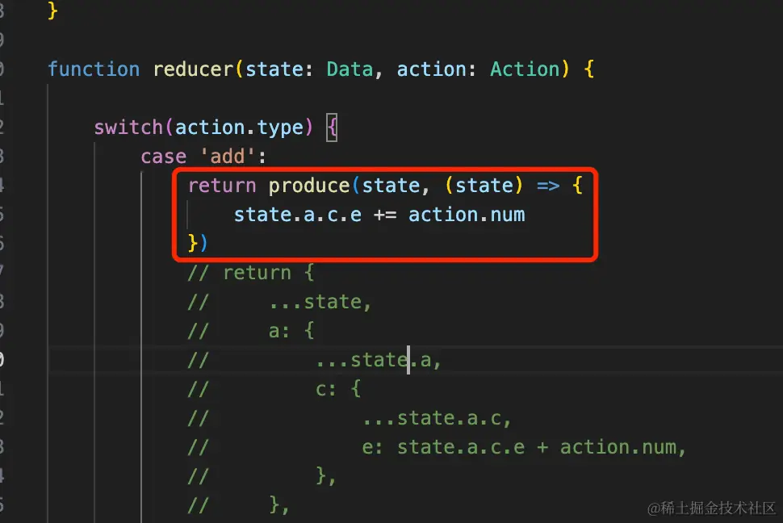

```javascript
return produce(state, (state) => {
    state.a.c.e += action.num
})
```
第一个参数是要修改的对象，第二个参数的函数里直接修改这个对象的属性，返回的结果就是一个新的对象。

测试下：

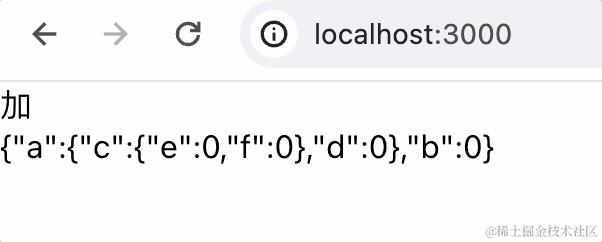

功能正常。

用起来超级简单。

immer 是依赖 Proxy 实现的，它会监听你在函数里对属性的修改，然后帮你创建一个新对象。

刚才只说了 reducer 需要返回一个新的对象，才会触发渲染，其实 useState 也是。

比如这样：

```javascript
import { useState } from "react";

function App() {
    const [obj, setObj] = useState({
        a: {
            c: {
                e: 0,
                f: 0
            },
            d: 0
        },
        b: 0
    });

    return (
        <div>
            <div onClick={() => {
                obj.a.c.e ++;
                setObj(obj);
            }}>加</div>
            <div>{JSON.stringify(obj)}</div>
        </div>
    );
}

export default App;
```
因为对象引用没变，同样不会重新渲染：

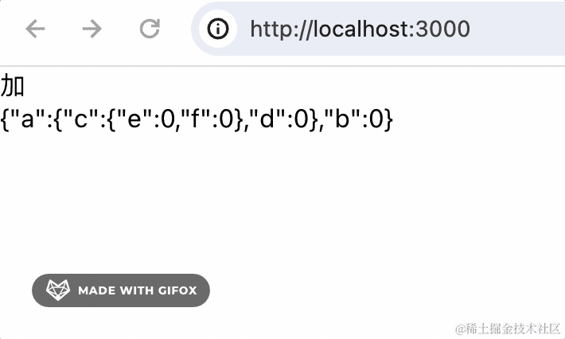

也可以用 immer：

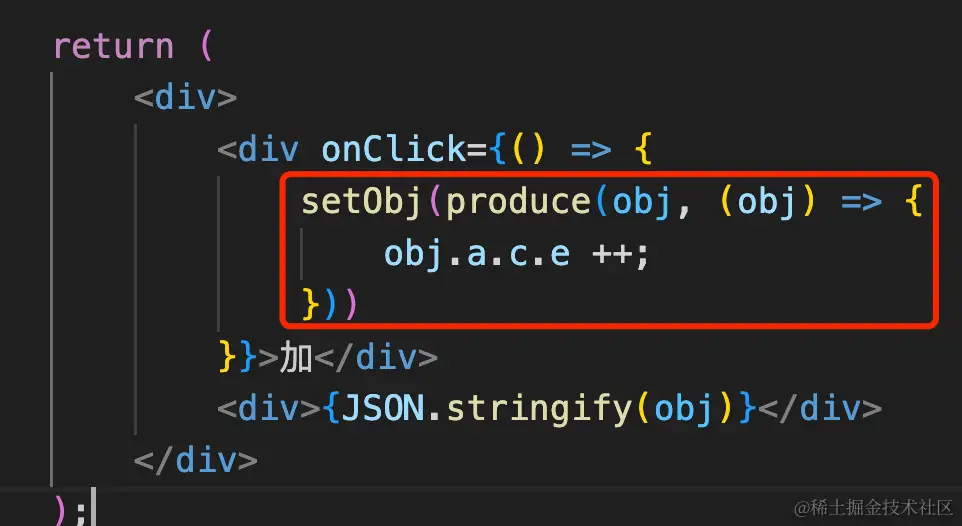

```javascript
setObj(produce(obj, (obj) => {
    obj.a.c.e ++;
}))
```
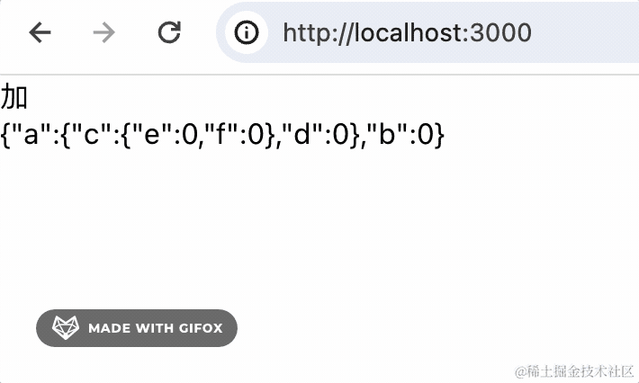

综上，**在 react 里，只要涉及到 state 的修改，就必须返回新的对象，不管是 useState 还是 useReducer。**

如果是复杂的深层对象的修改，可以用 immer 来优化。

为什么大家会说 React 推崇的是数据不可变？

就是因为这个。

## useRef

state 的保存和修改我们会了，那如何保存 dom 引用呢？

这时候就需要用 useRef 了。

创建 App4.tsx：

```javascript
import { useEffect, useRef } from "react";

function App() {
    const inputRef = useRef<HTMLInputElement>(null);

    useEffect(() => {
        inputRef.current?.focus();
    });

    return (
        <div>
            <input ref={inputRef}></input>
        </div>
    );
}

export default App;
```
useRef 的类型参数是保存的内容的类型。

这里通过 ref 保存 input 元素的引用，然后在 useEffect 里调用它的 focus 方法。

ref 的内容是保存在 current 属性上的。

在 index.tsx 引入：

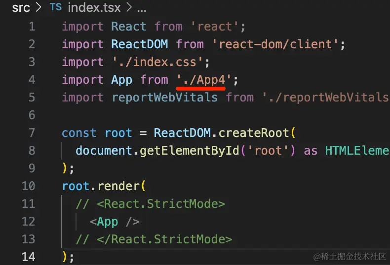

可以看到，focus 生效了：

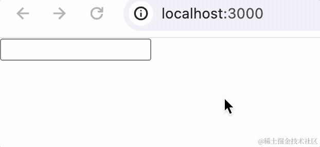

ref 其实就是一个有 current 属性的对象，除了可以保存 dom 引用，也可以放别的内容：

```javascript
import { useRef } from "react";

function App() {
    const numRef = useRef<number>(0);

    return (
        <div>
            <div onClick={() => {
                numRef.current += 1
            }}>{numRef.current}</div>
        </div>
    );
}

export default App;
```
但它不会触发重新渲染：


想触发渲染，还是得配合 state：

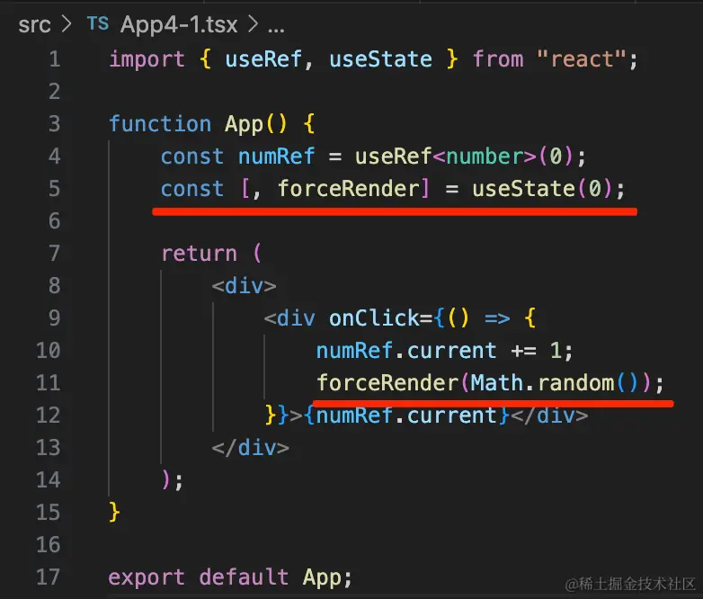

```javascript
import { useRef, useState } from "react";

function App() {
    const numRef = useRef<number>(0);
    const [, forceRender] = useState(0);

    return (
        <div>
            <div onClick={() => {
                numRef.current += 1;
                forceRender(Math.random());
            }}>{numRef.current}</div>
        </div>
    );
}

export default App;
```


不过一般不这么用，如果想改变内容会触发重新渲染，直接用 useState 或者 useReducer 就可以了。

useRef 一般是用来存一些不是用于渲染的内容的。

单个组件内如何拿到 ref 我们知道了，那如果是想把 ref 从子组件传递到父组件呢？

这种有专门的 api： forwardRef。

## forwardRef + useImperativeHandle

之前拿到标签的 dom 元素是这样写的：

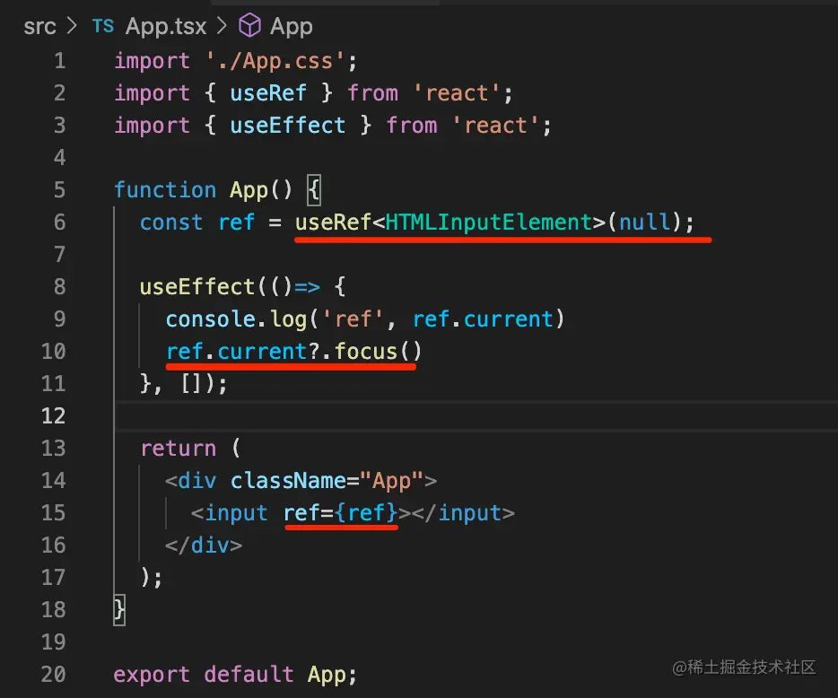

通过 useRef 创建个 ref 对象，然后把 input 标签设置到 ref。

如果是想从子组件传递 ref 到父组件，就需要 forwardRef 了，也就是把组件内的 ref 转发一下。

比如这样：

```typescript
import { useRef } from 'react';
import { useEffect } from 'react';
import React from 'react';

const Guang: React.ForwardRefRenderFunction<HTMLInputElement> = (props, ref) => {
  return <div>
    <input ref={ref}></input>
  </div>
}

const WrapedGuang = React.forwardRef(Guang);

function App() {
  const ref = useRef<HTMLInputElement>(null);
 
  useEffect(()=> {
    console.log('ref', ref.current)
    ref.current?.focus()
  }, []);

  return (
    <div className="App">
      <WrapedGuang ref={ref}/>
    </div>
  );
}

export default App;
```

其实 forwardRef 这个 api 做的事情也很容易懂。

就是把 ref 转发到组件内部来设置：

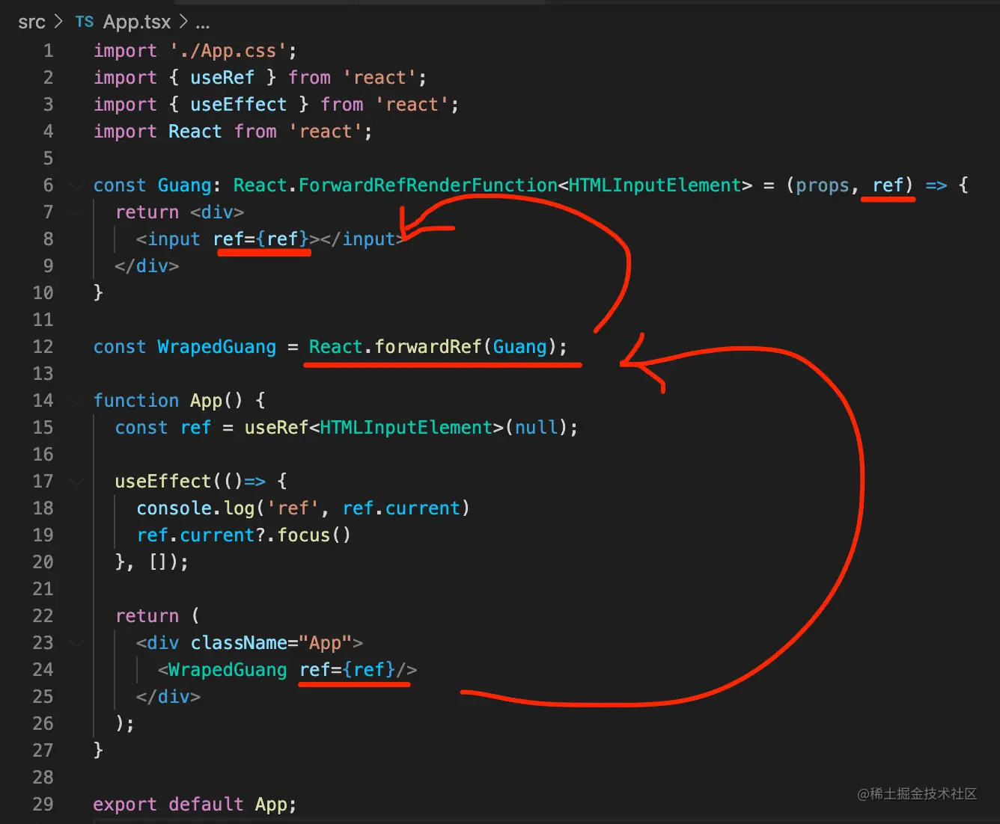

这样就把子组件的 input 的 ref 传递到了父组件。

效果如下：

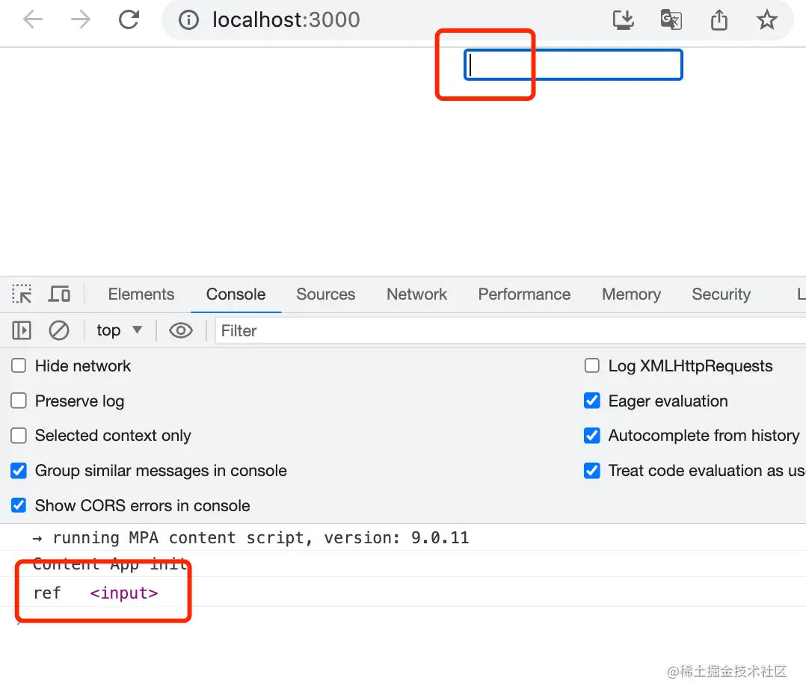

不过被 forwardRef 包裹的组件的类型就要用 React.forwardRefRenderFunction 了：

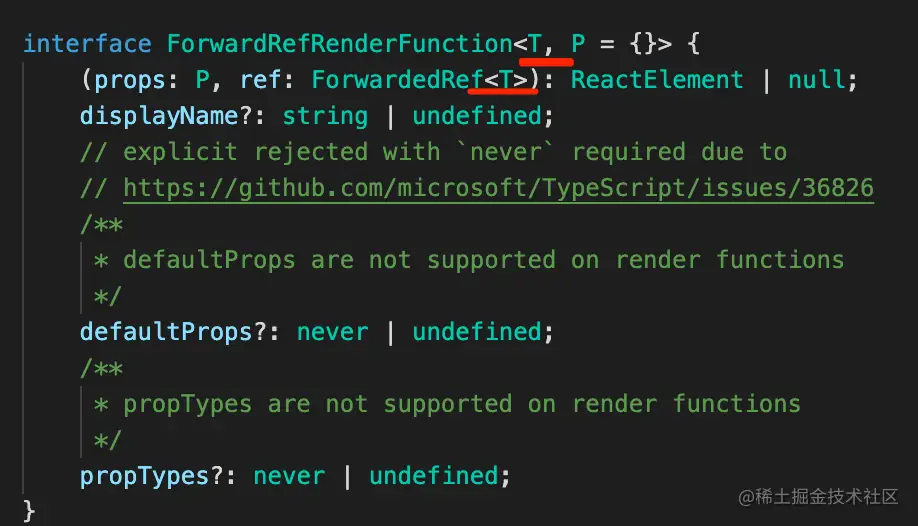

第一个类型参数是 ref 的 content 的类型，第二个类型参数是 props 的类型。

但有的时候，我不是想把原生标签暴露出去，而是暴露一些自定义内容。

这时候就需要 useImperativeHandle 的 hook 了。

它有 3 个参数，第一个是传入的 ref，第二个是是返回新的 ref 值的函数，第三个是依赖数组。

这样写：

```typescript
import { useRef } from 'react';
import { useEffect } from 'react';
import React from 'react';
import { useImperativeHandle } from 'react';

interface RefProps {
  aaa: () => void;
}

const Guang: React.ForwardRefRenderFunction<RefProps> = (props, ref) => {
  const inputRef = useRef<HTMLInputElement>(null);

  useImperativeHandle(ref, () => {
    return {
      aaa() {
        inputRef.current?.focus();
      }
    }
  }, [inputRef]);

  return <div>
    <input ref={inputRef}></input>
  </div>
}

const WrapedGuang = React.forwardRef(Guang);

function App() {
  const ref = useRef<RefProps>(null);
 
  useEffect(()=> {
    console.log('ref', ref.current)
    ref.current?.aaa();
  }, []);

  return (
    <div className="App">
      <WrapedGuang ref={ref}/>
    </div>
  );
}

export default App;
```

也就是用 useImperativeHanlde 自定义了 ref 对象：

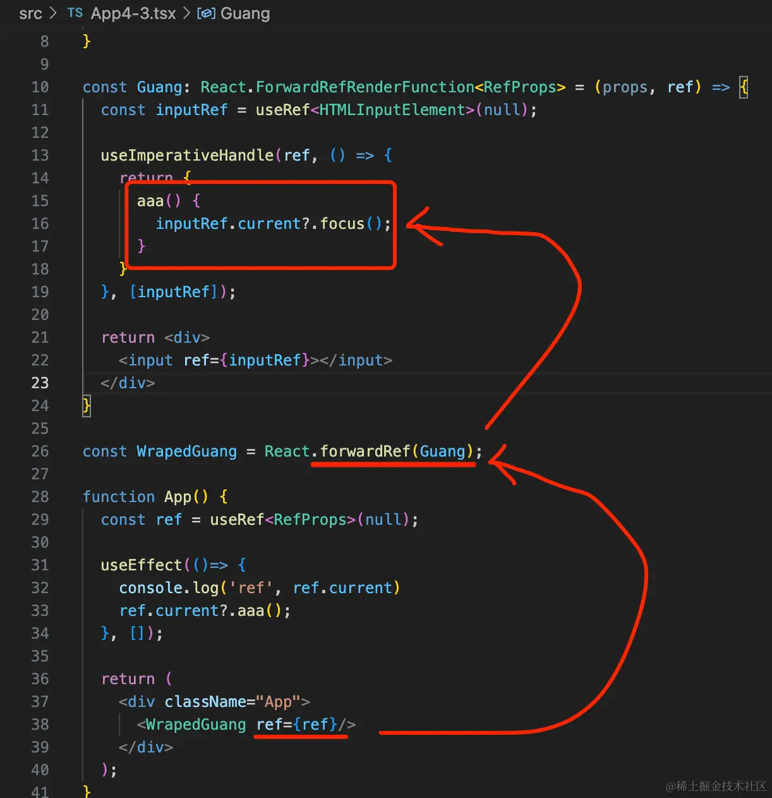

这样，父组件里拿到的 ref 就是 useImperativeHandle 第二个参数的返回值了。

效果是一样的：

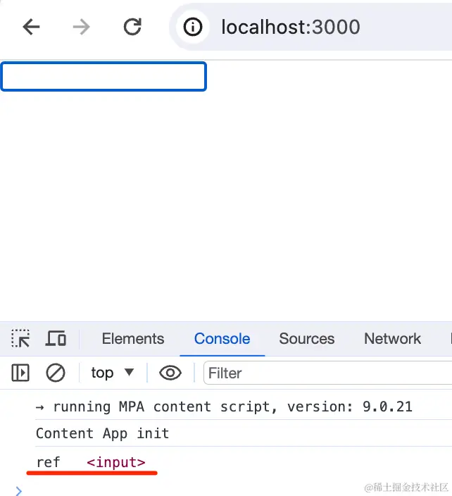

## useContext

跨任意层组件传递数据，我们一般用 Context。

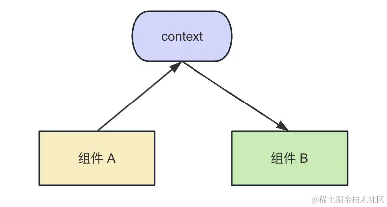

创建 App5.tsx

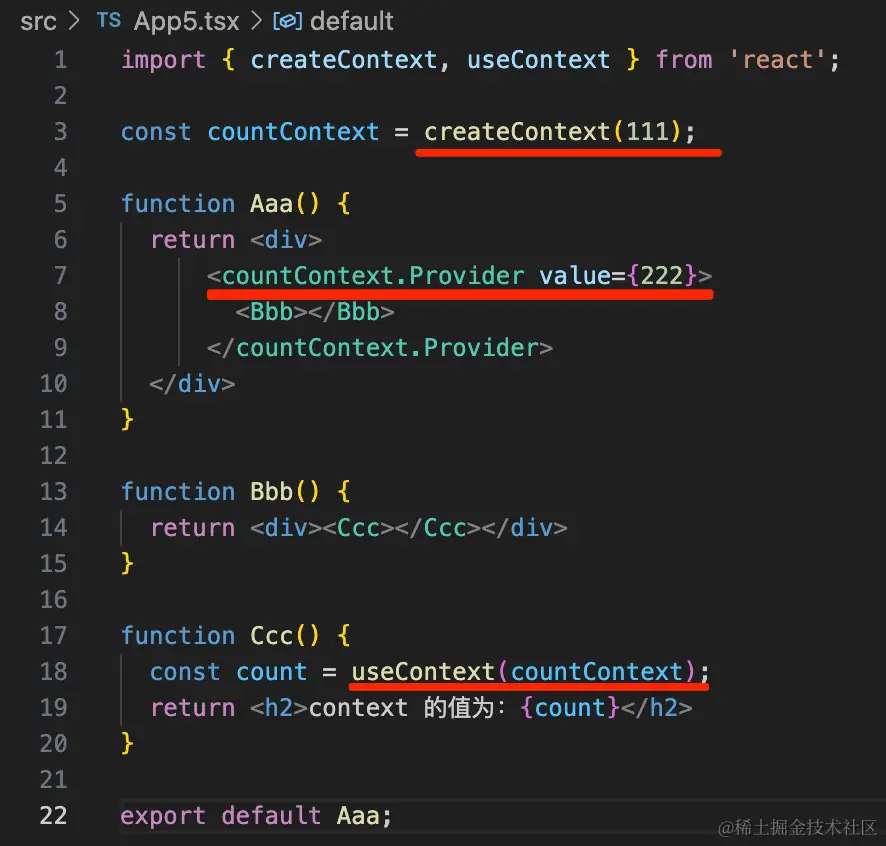


```javascript
import { createContext, useContext } from 'react';

const countContext = createContext(111);

function Aaa() {
  return <div>
      <countContext.Provider value={222}>
        <Bbb></Bbb>
      </countContext.Provider>
  </div>
} 

function Bbb() {
  return <div><Ccc></Ccc></div>
}

function Ccc() {
  const count = useContext(countContext);
  return <h2>context 的值为：{count}</h2>
}

export default Aaa;
```

用 createContext 创建 context，在 Aaa 里面使用 xxxContext.Provider 修改它的值，然后在 Ccc 里面用 useContext 取出来。

在 index.tsx 里引入：

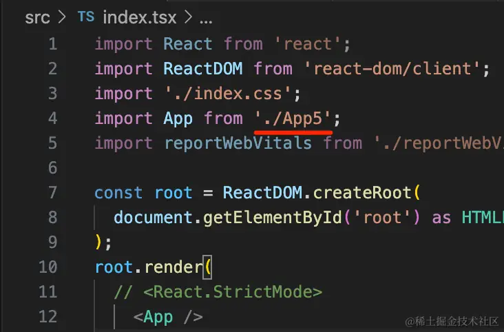

访问下：

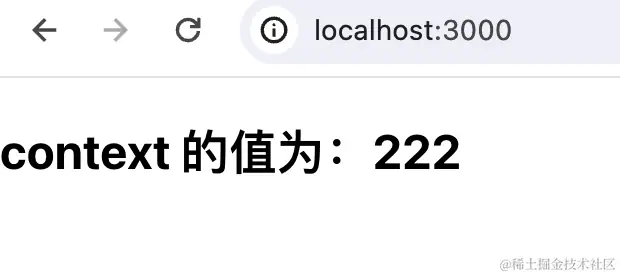

可以看到，拿到的值是被 Provider 修改过的 222。

有的同学可能会问，有 Provider，那有 Consumer 么？

有，class 组件是通过 Consumer 来取 context 的值：

```javascript
import { createContext, Component } from 'react';

const countContext = createContext(111);

class Ccc extends Component {
  render() {
    return <h2>context 的 值为：{this.props.count}</h2>
  }
}

function Bbb() {
  return <div>
    <countContext.Consumer>{
        (count) => <Ccc count={count}></Ccc>
      }
    </countContext.Consumer>
  </div>
}
```

不过现在很少写 class 组件了。

总结一下就是，**用 createContext 创建 context 对象，用 Provider 修改其中的值， function 组件使用 useContext 的 hook 来取值，class 组件使用 Consumer 来取值。**

组件库里用 Context 很多，比如 antd 里就有大量 Context 的使用：

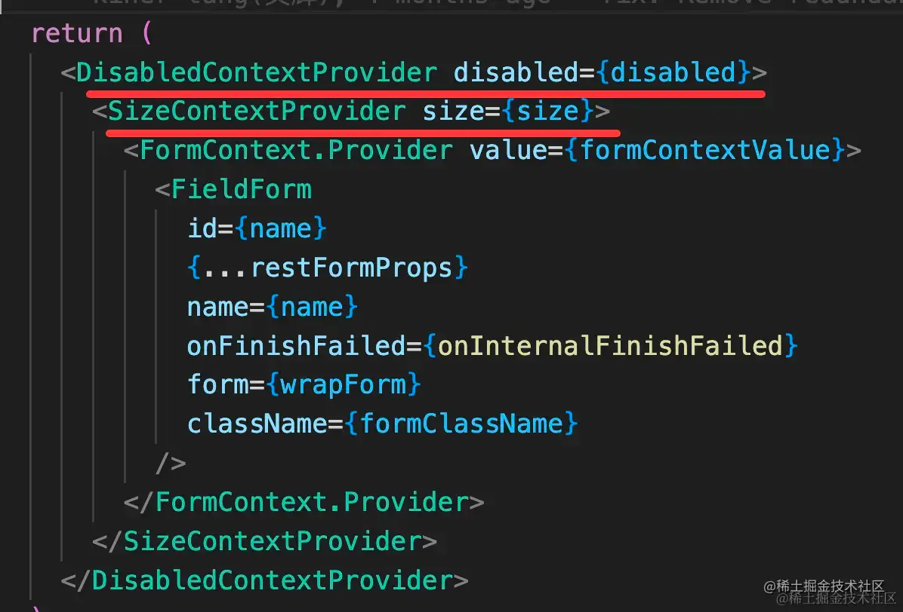

配置数据基本都是用 Context 传递。

## memo + useMemo + useCallback

有两个组件 Aaa、Bbb，Aaa 是 Bbb 的父组件：

```javascript
import { memo, useEffect, useState } from "react";

function Aaa() {
    const [,setNum] = useState(1);

    useEffect(() => {
        setInterval(()=> {
            setNum(Math.random());
        }, 2000)
    },[]);

    return <div>
        <Bbb count={2}></Bbb>
    </div>
} 

interface BbbProps {
    count: number;
}

function Bbb(props: BbbProps) {
    console.log('bbb render');

    return <h2>{props.count}</h2>
}

export default Aaa;
```

在 Aaa 里面不断 setState 触发重新渲染，问：

bbb render 打印几次？

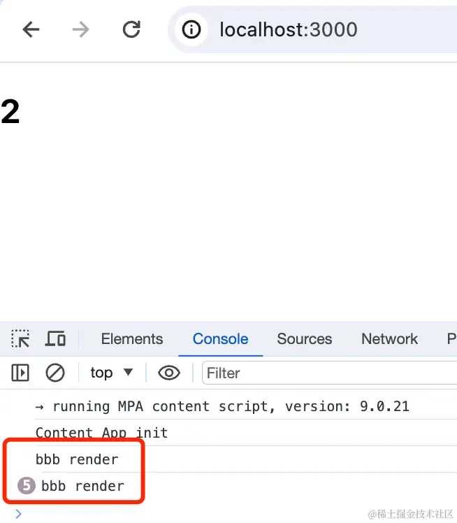

答案是每 2s 都会打印。

也就是说，每次都会触发 Bbb 组件的重新渲染。

但很明显，这里 Bbb 并不需要再次渲染。

这时可以加上 memo：

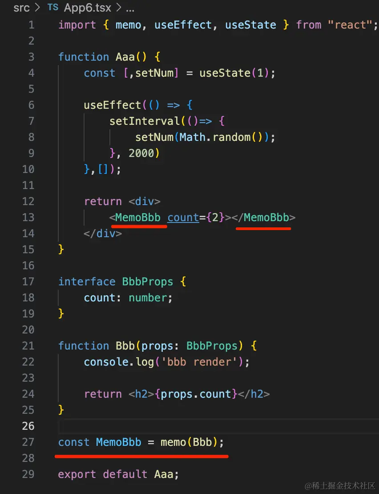

```javascript
import { memo, useEffect, useState } from "react";

function Aaa() {
    const [,setNum] = useState(1);

    useEffect(() => {
        setInterval(()=> {
            setNum(Math.random());
        }, 2000)
    },[]);

    return <div>
        <MemoBbb count={2}></MemoBbb>
    </div>
} 

interface BbbProps {
    count: number;
}

function Bbb(props: BbbProps) {
    console.log('bbb render');

    return <h2>{props.count}</h2>
}

const MemoBbb = memo(Bbb);

export default Aaa;
```

memo 的作用是只有 props 变的时候，才会重新渲染被包裹的组件。

这样就只会打印一次了：

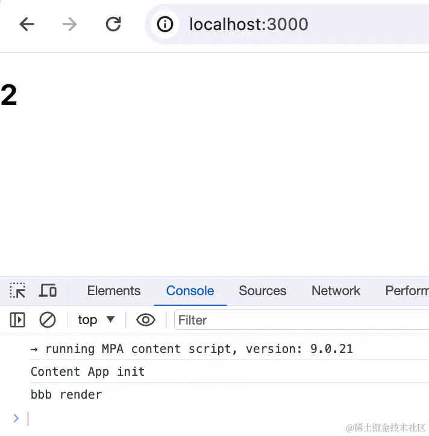

我们让 2s 后 props 变了呢？

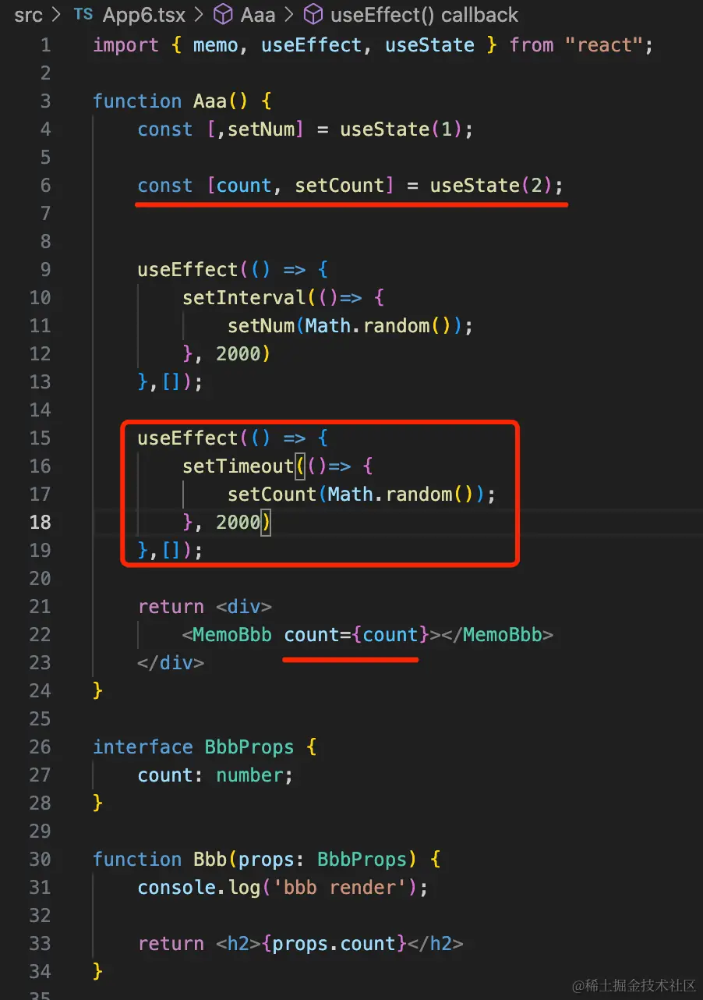

```javascript
import { memo, useEffect, useState } from "react";

function Aaa() {
    const [,setNum] = useState(1);

    const [count, setCount] = useState(2);


    useEffect(() => {
        setInterval(()=> {
            setNum(Math.random());
        }, 2000)
    },[]);

    useEffect(() => {
        setTimeout(()=> {
            setCount(Math.random());
        }, 2000)
    },[]);

    return <div>
        <MemoBbb count={count}></MemoBbb>
    </div>
} 

interface BbbProps {
    count: number;
}

function Bbb(props: BbbProps) {
    console.log('bbb render');

    return <h2>{props.count}</h2>
}

const MemoBbb = memo(Bbb);

export default Aaa;
```
props 变了会触发 memo 的重新渲染：

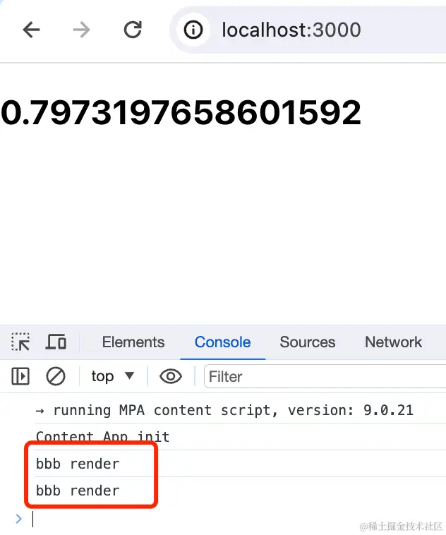

用 memo 的话，一般还会结合两个 hook：useMemo 和 useCallback。

**memo 是防止 props 没变时的重新渲染，useMemo 和 useCallback 是防止 props 的不必要变化。**

给 Bbb 加一个 callback 的参数：

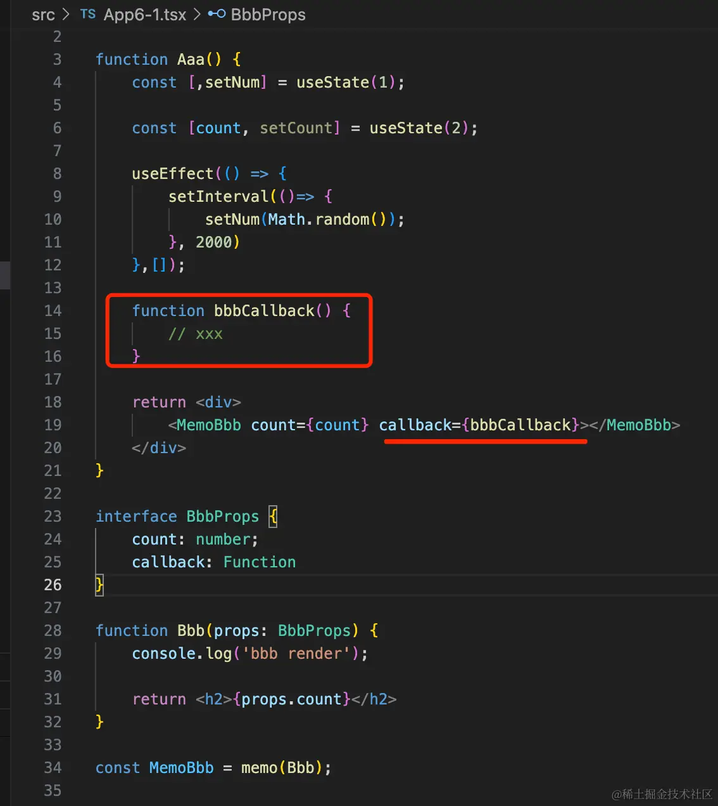

参数传了一个 function，你会发现 memo 失效了：

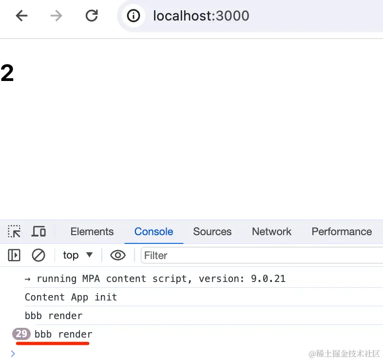

因为每次 function 都是新创建的，也就是每次 props 都会变，这样 memo 就没用了。

这时候就需要 useCallback：

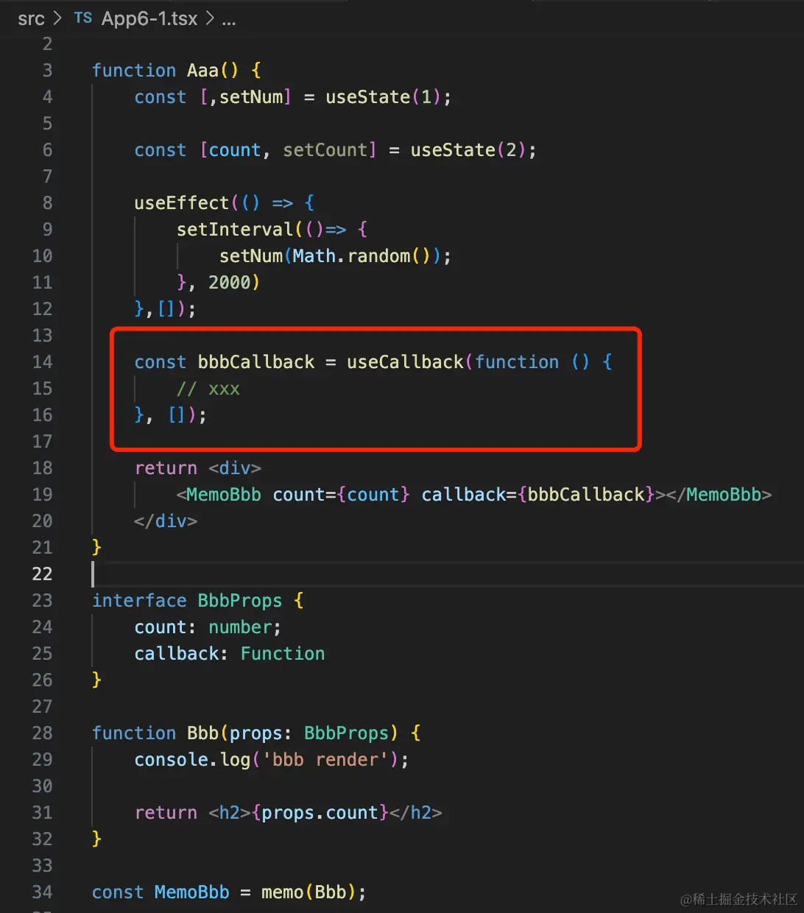

```javascript
const bbbCallback = useCallback(function () {
    // xxx
}, []);
```

它的作用就是当 deps 数组不变的时候，始终返回同一个 function，当 deps 变的时候，才把 function 改为新传入的。

这时候你会发现，memo 又生效了：

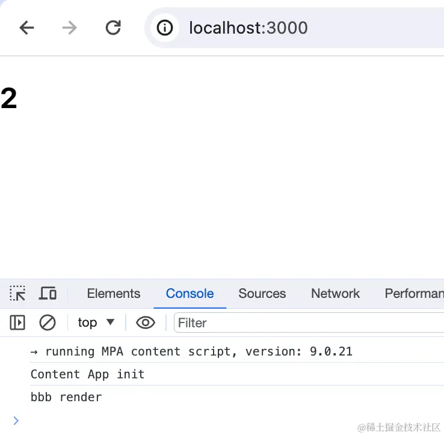

同理，useMemo 也是和 memo 打配合的，只不过它保存的不是函数，而是值：

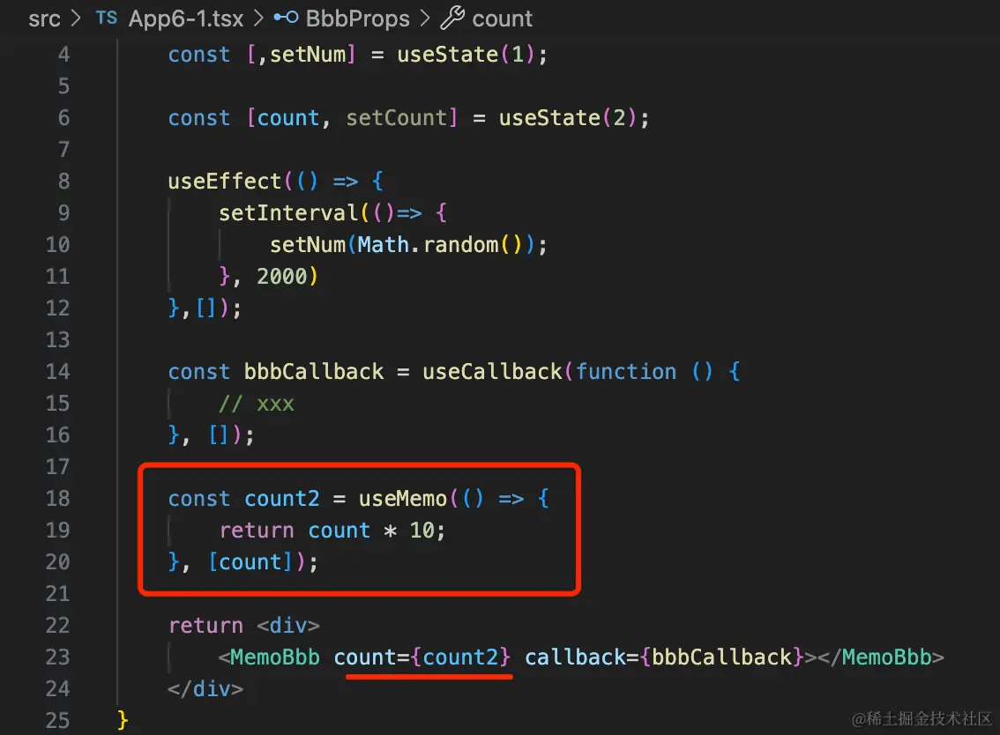

```javascript
const count2 = useMemo(() => {
    return count * 10;
}, [count]);
```
它是在 deps 数组变化的时候，计算新的值返回。

所以说，**如果子组件用了 memo，那给它传递的对象、函数类的 props 就需要用 useMemo、useCallback 包裹，否则，每次 props 都会变，memo 就没用了。**

**反之，如果 props 使用 useMemo、useCallback，但是子组件没有被 memo 包裹，那也没意义，因为不管 props 变没变都会重新渲染，只是做了无用功。**

memo + useCallback、useMemo 是搭配着来的，少了任何一方，都会使优化失效。

**但 useMemo 和 useCallback 也不只是配合 memo 用的：**

比如有个值的计算，需要很大的计算量，你不想每次都算，这时候也可以用 useMemo 来缓存。

案例代码上传了[小册仓库](https://github.com/QuarkGluonPlasma/react-course-code/tree/main/hook-test)。

## 总结

这节我们过了一遍 React 常用的 hook：

- **useState**：状态是变化的数据，是组件甚至前端应用的核心。useState 有传入值和函数两种参数，返回的 setState 也有传入值和传入函数两种参数。

- **useEffect**：副作用 effect 函数是在渲染之外额外执行的一些逻辑。它是根据第二个参数的依赖数组是否变化来决定是否执行 effect，可以返回一个清理函数，会在下次 effect 执行前执行。

- **useLayoutEffect**：和 useEffect 差不多，但是 useEffect 的 effect 函数是异步执行的，所以可能中间有次渲染，会闪屏，而 useLayoutEffect 则是同步执行的，所以不会闪屏，但如果计算量大可能会导致掉帧。

- **useReducer**：封装一些修改状态的逻辑到 reducer，通过 action 触发，当修改深层对象的时候，创建新对象比较麻烦，可以结合 immer

- **useRef**：可以保存 dom 引用或者其他内容，通过 xxRef.current 来取，改变它的内容不会触发重新渲染

- **forwardRef + useImperativeHandle**：通过 forwardRef 可以从子组件转发 ref 到父组件，如果想自定义 ref 内容可以使用 useImperativeHandle

- **useContext**：跨层组件之间传递数据可以用 Context。用 createContext 创建 context 对象，用 Provider 修改其中的值， function 组件使用 useContext 的 hook 来取值，class 组件使用 Consumer 来取值

- **memo + useMemo + useCallback**：memo 包裹的组件只有在 props 变的时候才会重新渲染，useMemo、useCallback 可以防止 props 不必要的变化，两者一般是结合用。不过当用来缓存计算结果等场景的时候，也可以单独用 useMemo、useCallback

当然，react 的 hook 还有一些，那些不大常用的，等用到的时候再说。

class 组件被标记为 lagency 了，现在写 React 组件主要是 function 组件。

函数组件主要是学习 hook，所以把这节的内容掌握了，react 基础就算差不多了。
