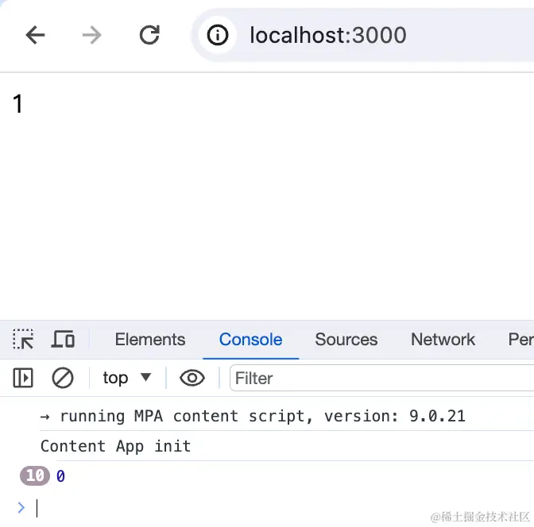
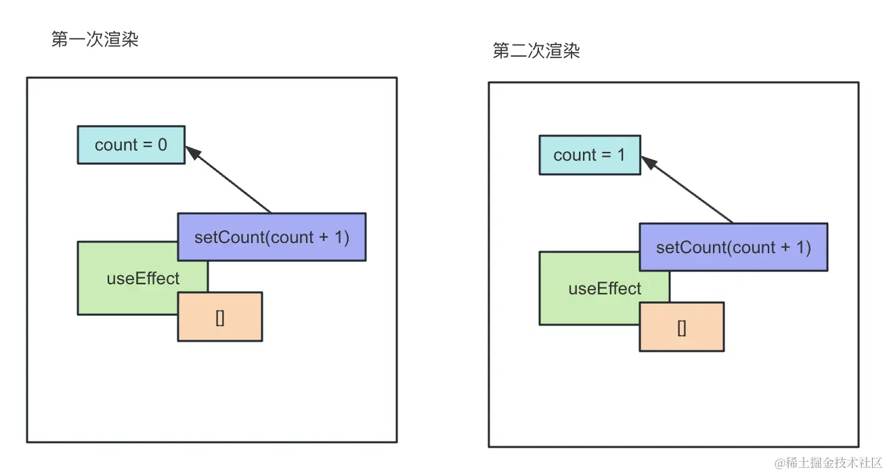
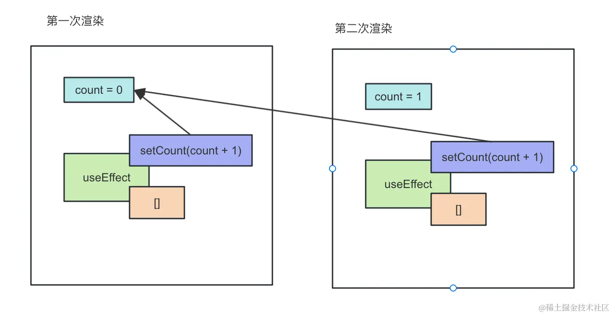
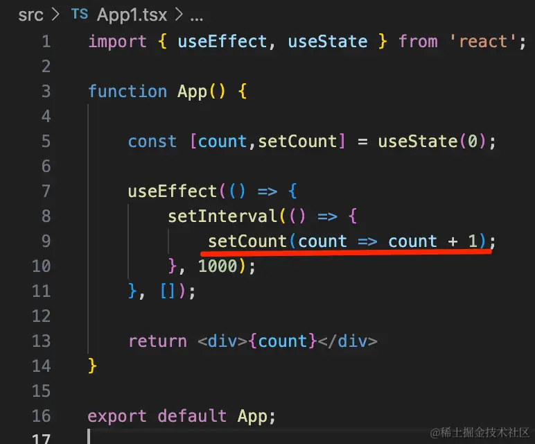
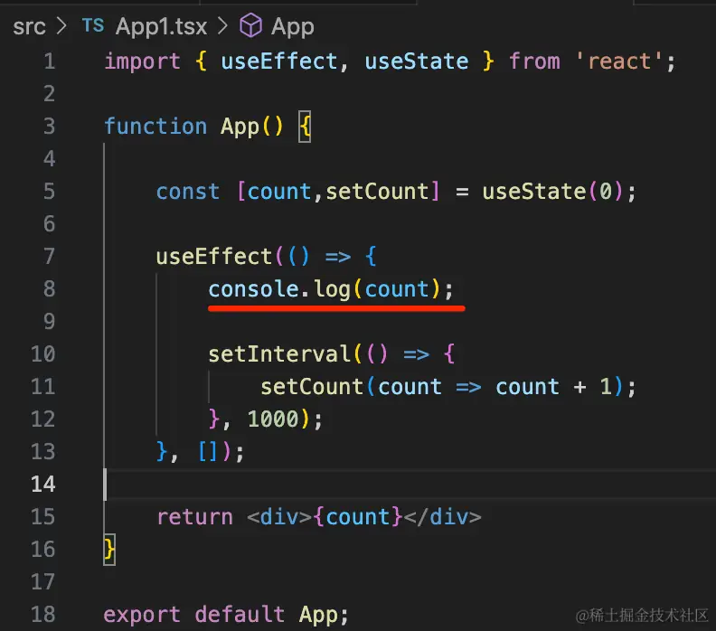
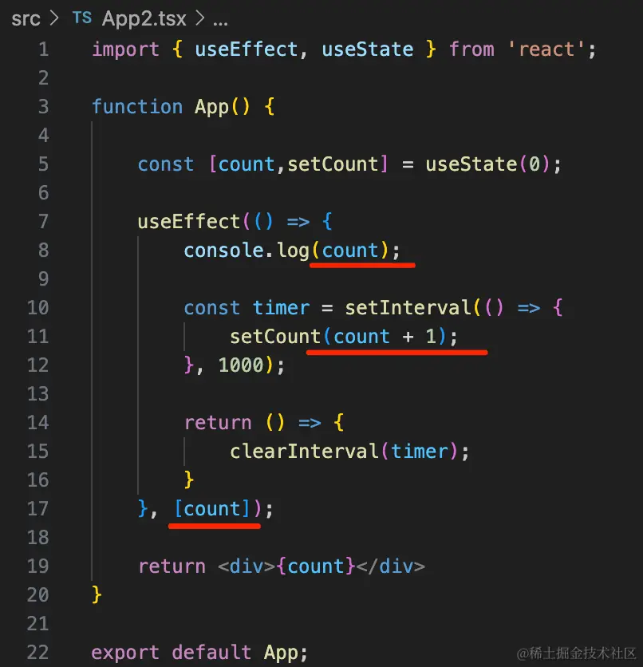
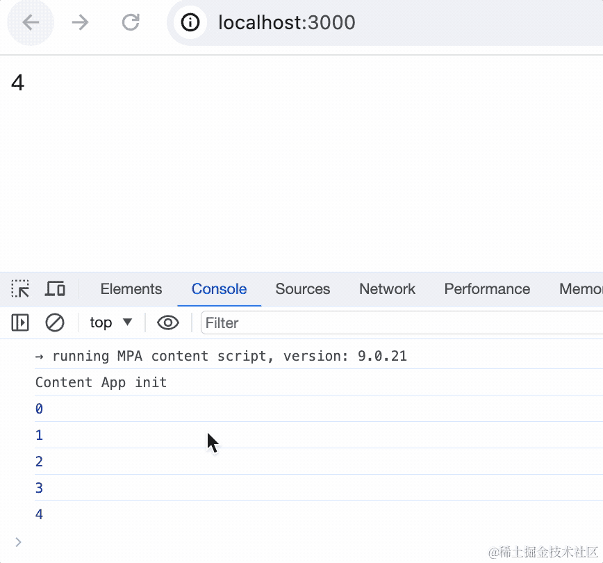
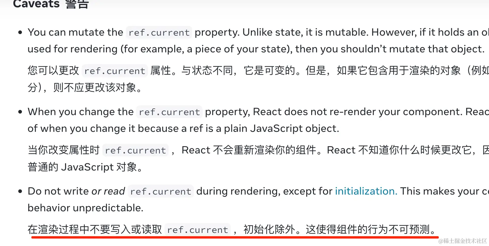
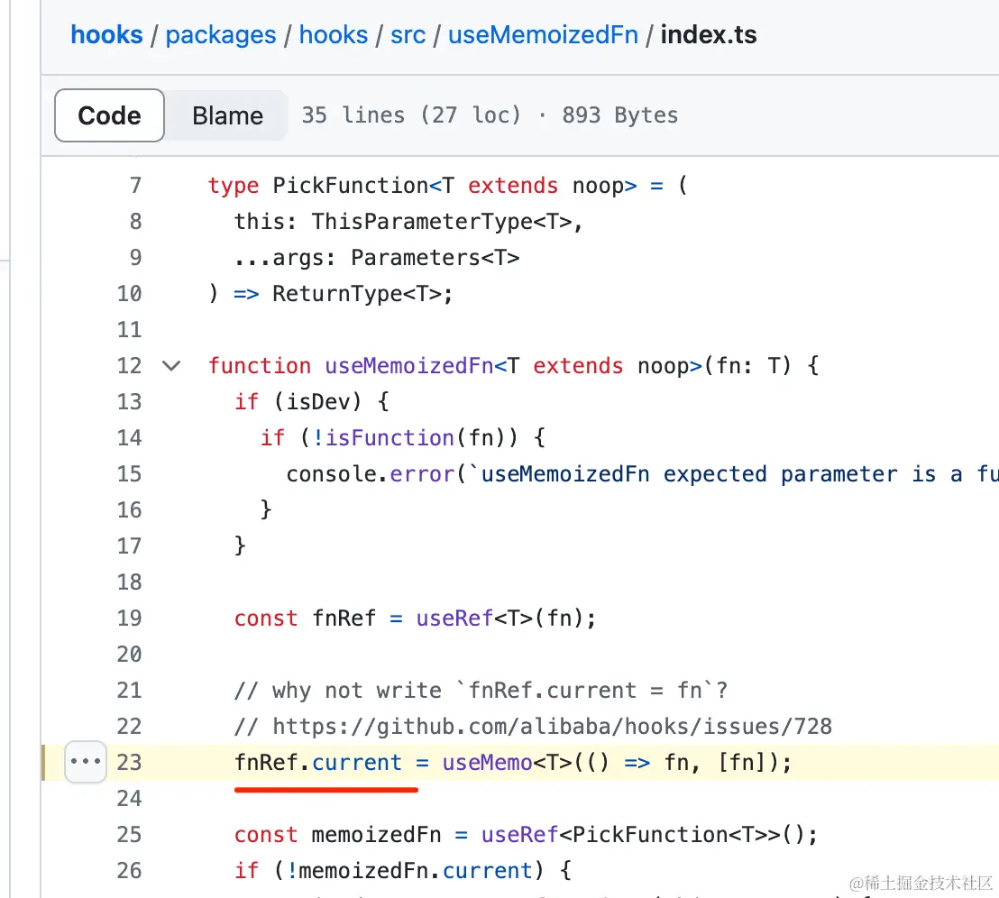
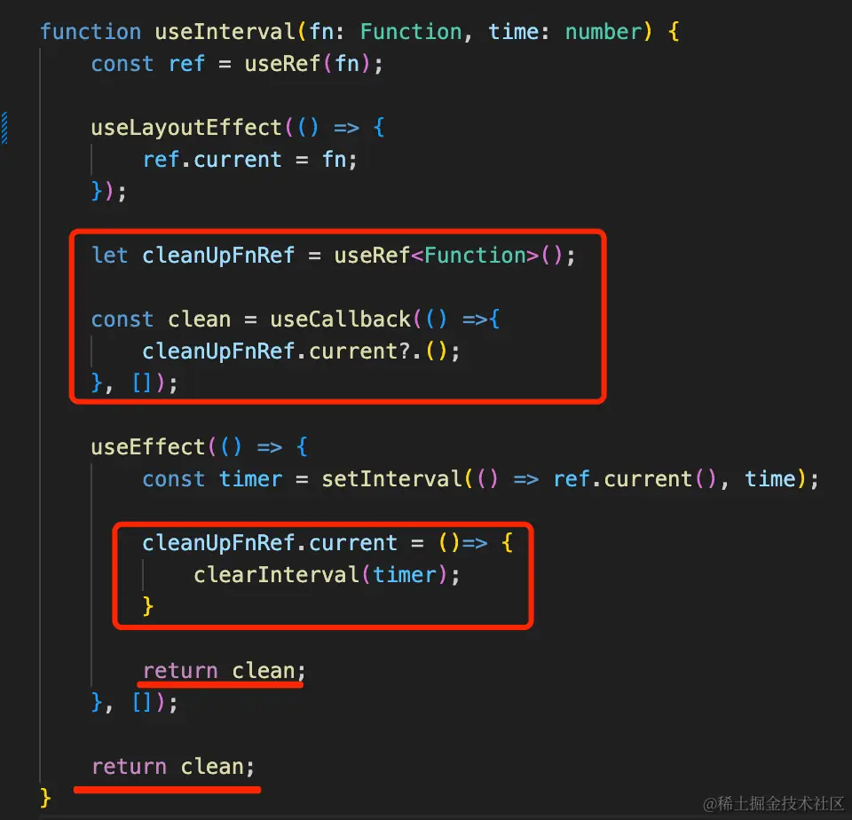

# 第03章—Hook的闭包陷阱的成因和解决方案

上节我们学习了各种 hook，用这些 hook 写组件的时候经常遇到一个问题，就是闭包陷阱。

这节我们了解下什么是闭包陷阱，如何解决闭包陷阱。

用 cra 创建个项目：

```
npx create-react-app --template typescript closure-trap
```


改一下 index.tsx：

```javascript
import ReactDOM from 'react-dom/client';
import App from './App';

const root = ReactDOM.createRoot(
  document.getElementById('root') as HTMLElement
);
root.render(<App />);
```
然后看这样一个组件，通过定时器不断的累加 count：

```javascript
import { useEffect, useState } from 'react';

function App() {

    const [count,setCount] = useState(0);

    useEffect(() => {
        setInterval(() => {
            console.log(count);
            setCount(count + 1);
        }, 1000);
    }, []);

    return <div>{count}</div>
}

export default App;
```
大家觉得这个 count 会每秒加 1 么？

不会。

可以看到，setCount 时拿到的 count 一直是 0:



为什么呢？

大家可能觉得，每次渲染都引用最新的 count，然后加 1，所以觉得没问题：



但是，现在 useEffect 的依赖数组是 []，也就是只会执行并保留第一次的 function。

而第一次的 function 引用了当时的 count，形成了闭包。

也就是实际上的执行是这样的：



这就导致了每次执行定时器的时候，都是在 count = 0 的基础上加一。

这就叫做 hook 的闭包陷阱。

## 第一种解法

那怎么解决这个问题呢？

不让它形成闭包不就行了？

这时候可以用 setState 的另一种参数：



这次并没有形成闭包，每次的 count 都是参数传入的上一次的 state。


这样功能就正常了。

和用 setState 传入函数的方案类似，还可以用 useReducer 来解决。

因为它是 dispatch 一个 action，不直接引用 state，所以也不会形成闭包：


```javascript
import { Reducer, useEffect, useReducer } from "react";

interface Action {
    type: 'add' | 'minus',
    num: number
}

function reducer(state: number, action: Action) {

    switch(action.type) {
        case 'add':
            return state + action.num
        case 'minus': 
            return state - action.num
    }
    return state;
}

function App() {
    const [count, dispatch] = useReducer<Reducer<number, Action>>(reducer, 0);

    useEffect(() => {
        console.log(count);

        setInterval(() => {
            dispatch({ type: 'add', num: 1 })
        }, 1000);
    }, []);

    return <div>{count}</div>;
}

export default App;
```


思路和 setState 传入函数一样，所以算是一种解法。

## 第二种解法

但有的时候，是必须要用到 state 的，也就是肯定会形成闭包，

比如这里，console.log 的 count 就用到了外面的 count，形成了闭包，但又不能把它挪到 setState 里去写：



这种情况怎么办呢？

还记得 useEffect 的依赖数组是干啥的么？

当依赖变动的时候，会重新执行 effect。

所以可以这样：



```javascript
import { useEffect, useState } from 'react';

function App() {

    const [count,setCount] = useState(0);

    useEffect(() => {
        console.log(count);

        const timer = setInterval(() => {
            setCount(count + 1);
        }, 1000);

        return () => {
            clearInterval(timer);
        }
    }, [count]);

    return <div>{count}</div>
}

export default App;
```
依赖数组加上了 count，这样 count 变化的时候重新执行 effect，那执行的函数引用的就是最新的 count 值。



这种解法是能解决闭包陷阱的，但在这里并不合适，因为 effect 里跑的是定时器，每次都重新跑定时器，那定时器就不是每 1s 执行一次了。

## 第三种解法

有定时器不能重新跑 effect 函数，那怎么做呢？

可以用 useRef。

```javascript
import { useEffect, useState, useRef, useLayoutEffect } from 'react';

function App() {
    const [count, setCount] = useState(0);

    const updateCount = () => {
        setCount(count + 1);
    };
    const ref = useRef(updateCount);

    ref.current = updateCount;

    useEffect(() => {
        const timer = setInterval(() => ref.current(), 1000);

        return () => {
            clearInterval(timer);
        }
    }, []);

    return <div>{count}</div>;
}

export default App;
```
通过 useRef 创建 ref 对象，保存执行的函数，每次渲染更新 ref.current 的值为最新函数。

这样，定时器执行的函数里就始终引用的是最新的 count。

useEffect 只跑一次，保证 setIntervel 不会重置，是每秒执行一次。

执行的函数是从 ref.current 取的，这个函数每次渲染都会更新，引用着最新的 count。

跑一下：


功能正常。

讲 useRef 的时候说过，ref.current 的值改了不会触发重新渲染，

它就很适合这种保存渲染过程中的一些数据的场景。

其实定时器的这种处理是常见场景，我们可以把它封装一下：

```javascript
import { useEffect, useState, useRef } from 'react';

function useInterval(fn: Function, delay?: number | null) {
    const callbackFn = useRef(fn);

    useLayoutEffect(() => {
        callbackFn.current = fn;
    });
    
    useEffect(() => {
        const timer = setInterval(() => callbackFn.current(), delay || 0);

        return () => clearInterval(timer);
    }, []);
}

function App() {
    const [count, setCount] = useState(0);

    const updateCount = () => {
        setCount(count + 1);
    };

    useInterval(updateCount, 1000);

    return <div>{count}</div>;
}

export default App;
```

这里我们封装了个 useInterval 的函数，传入 fn 和 delay，里面会用 useRef 保存并更新每次的函数。

我们在 useLayoutEffect 里更新 ref.current 的值，它是在 dom 操作完之后同步执行的，比 useEffect 更早。

通过 useEffect 来跑定时器，依赖数组为 [delay]，确保定时器只跑一次，但是 delay 变化的话会重新跑。

在 useEffect 里返回 clean 函数在组件销毁的时候自动调用来清理定时器。

这种就叫做自定义 hook，它就是普通的函数封装，没啥区别。

这样，组件里就可以直接用 useInterval 这个自定义 hook，不用每次都 useRef + useEffect 了。

有的同学可能会说，直接在渲染过程中该 ref.current 不也一样么，为啥包一层 useLayoutEffect？

确实，从结果来看是一样的。

但是[文档](https://react.dev/reference/react/useRef#caveats)里不建议：



不过这也没啥，ahooks 里就是直接在渲染过程中[改了 ref.current](https://github.com/alibaba/hooks/blob/master/packages/hooks/src/useMemoizedFn/index.ts#L23)：




上面的 useInterval 没有返回 clean 函数，调用者不能停止定时器，所以我们再加一个 ref 来保存 clean 函数，然后返回：



```javascript
function useInterval(fn: Function, time: number) {
    const ref = useRef(fn);

    ref.current = fn;

    let cleanUpFnRef = useRef<Function>();
    
    const clean = useCallback(() =>{
        cleanUpFnRef.current?.();
    }, []);

    useEffect(() => {
        const timer = setInterval(() => ref.current(), time);

        cleanUpFnRef.current = ()=> {
            clearInterval(timer);
        }

        return clean;
    }, []);

    return clean;
}
```

为什么要用 useCallback 包裹返回的函数呢？

因为这个返回的函数可能作为参数传入别的组件，这样用 useCallback 包裹就可以避免该参数的变化，配合 memo 可以起到减少没必要的渲染的效果。

案例代码上传了[小册仓库](https://github.com/QuarkGluonPlasma/react-course-code/tree/main/closure-trap)。

## 总结

这节我们学习了闭包陷阱和它的三种解决方案。

闭包陷阱就是 effect 函数等引用了 state，形成了闭包，但是并没有把 state 加到依赖数组里，导致执行 effect 时用的 state 还是之前的。

这个问题有三种解决方案：

- 使用 setState 的函数的形式，从参数拿到上次的 state，这样就不会形成闭包了，或者用 useReducer，直接 dispatch action，而不是直接操作 state，这样也不会形成闭包

- 把用到的 state 加到依赖数组里，这样 state 变了就会重新跑 effect 函数，引用新的 state

- 使用 useRef 保存每次渲染的值，用到的时候从 ref.current 取

定时器的场景需要保证定时器只跑一次，不然重新跑会导致定时不准，所以需要用 useEffect + useRef 的方式来解决闭包陷阱问题。

我们还封装了 useInterval 的自定义 hook，这样可以不用在每个组件里都写一样的 useRef + useEffect 了，直接用这个自定义 hook 就行。

此外，关于要不要在渲染函数里直接修改 ref.current，其实都可以，直接改也行，包一层 useLayoutEffect 或者 useEffect 也行。

闭包陷阱是经常会遇到的问题，要对它的成因和解决方案有清晰的认识。
