# 第07章—组件实战：迷你Calendar

日历组件想必大家都用过，在各个组件库里都有。

比如 antd 的 Calendar 组件（或者 DatePicker 组件）：

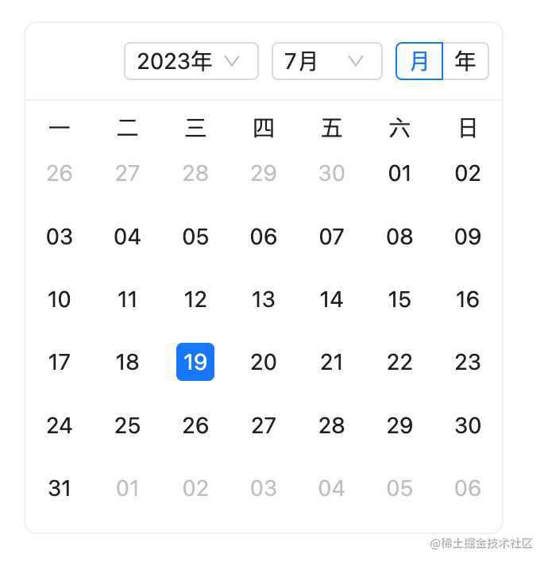

那这种日历组件是怎么实现的呢？

其实原理很简单，今天我们就来自己实现一个。

首先，要过一下 Date 的 api：

创建 Date 对象时可以传入年月日时分秒。

比如 2023 年 7 月 30，就是这么创建：

```javascript
new Date(2023, 6, 30);
```

可以调用 toLocaleString 来转成当地日期格式的字符串显示：

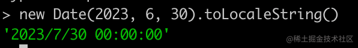

有人说 7 月为啥第二个参数传 6 呢？

因为 Date 的 month 是从 0 开始计数的，取值是 0 到 11：

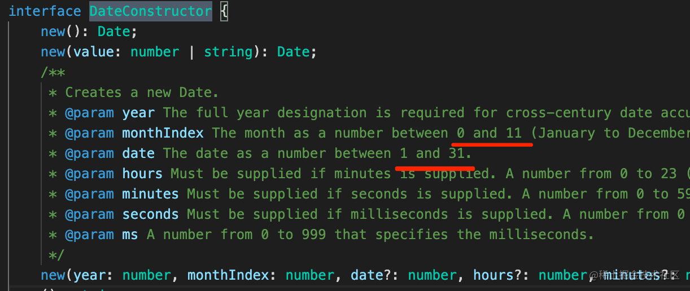

而日期 date 是从 1 到 31。

而且有个小技巧，当你 date 传 0 的时候，取到的是上个月的最后一天：

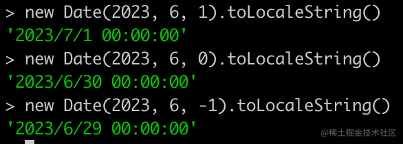

-1 就是上个月的倒数第二天，-2 就是倒数第三天这样。

这个小技巧有很大的用处，可以用这个来拿到每个月有多少天：

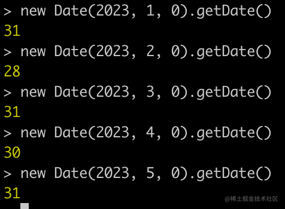

今年一月 31 天、二月 28 天、三月 31 天。。。

除了日期外，也能通过 getFullYear、getMonth 拿到年份和月份：

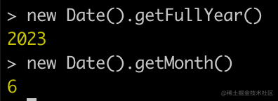

还可以通过 getDay 拿到星期几。

比如今天（2023-7-19）是星期三：


就这么几个 api 就已经可以实现日历组件了。

不信？我们来试试看：

用 cra 创建 typescript 的 react 项目：

```
npx create-react-app --template=typescript calendar-test
```
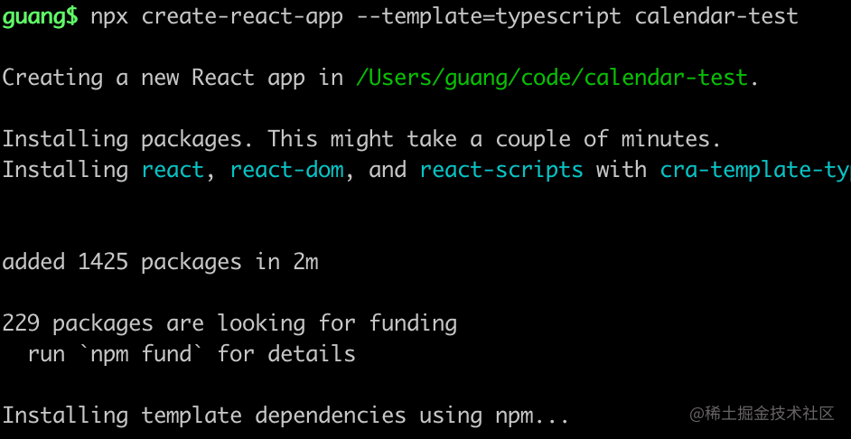

我们先来写下静态的布局：

大概一个 header，下面是从星期日到星期六，再下面是从 1 到 31：

改下 App.tsx:

```javascript
import React from 'react';
import './index.css';

function Calendar() {
  return (
    <div className="calendar">
      <div className="header">
        <button>&lt;</button>
        <div>2023 年 7 月</div>
        <button>&gt;</button>
      </div>
      <div className="days">
        <div className="day">日</div>
        <div className="day">一</div>
        <div className="day">二</div>
        <div className="day">三</div>
        <div className="day">四</div>
        <div className="day">五</div>
        <div className="day">六</div>
        <div className="empty"></div>
        <div className="empty"></div>
        <div className="day">1</div>
        <div className="day">2</div>
        <div className="day">3</div>
        <div className="day">4</div>
        <div className="day">5</div>
        <div className="day">6</div>
        <div className="day">7</div>
        <div className="day">8</div>
        <div className="day">9</div>
        <div className="day">10</div>
        <div className="day">11</div>
        <div className="day">12</div>
        <div className="day">13</div>
        <div className="day">14</div>
        <div className="day">15</div>
        <div className="day">16</div>
        <div className="day">17</div>
        <div className="day">18</div>
        <div className="day">19</div>
        <div className="day">20</div>
        <div className="day">21</div>
        <div className="day">22</div>
        <div className="day">23</div>
        <div className="day">24</div>
        <div className="day">25</div>
        <div className="day">26</div>
        <div className="day">27</div>
        <div className="day">28</div>
        <div className="day">29</div>
        <div className="day">30</div>
        <div className="day">31</div>
      </div>
    </div>
  );
}

export default Calendar;
```

直接跑起来看下渲染结果再讲布局：

```
npm run start
```

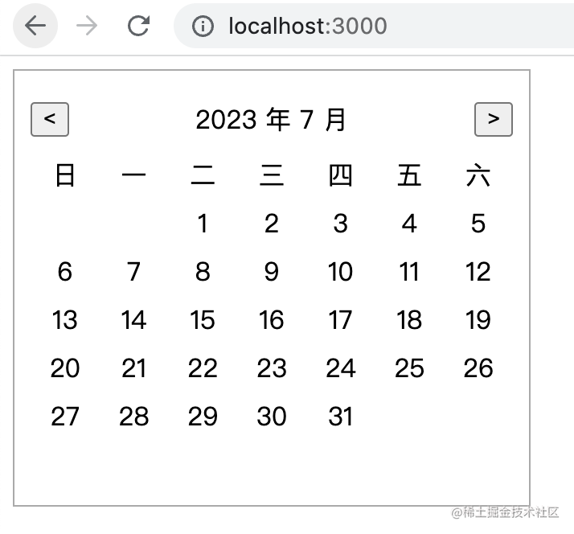

这种布局还是挺简单的：

header 就是一个 space-between 的 flex 容器：

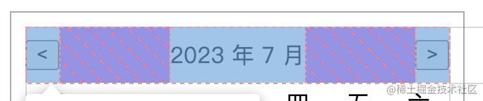

下面是一个 flex-wrap 为 wrap，每个格子宽度为 100% / 7 的容器：

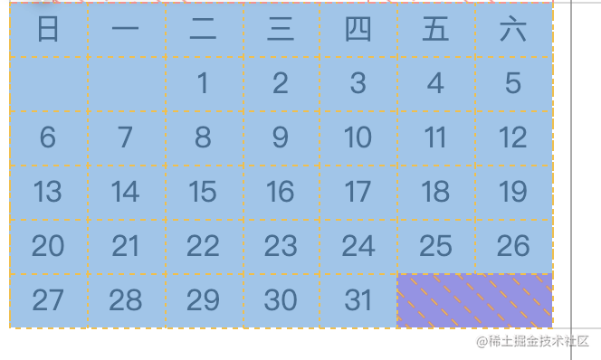

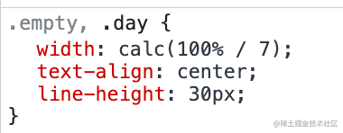

全部样式如下：

```css
.calendar {
  border: 1px solid #aaa;
  padding: 10px;
  width: 300px;
  height: 250px;
}

.header {
  display: flex;
  justify-content: space-between;
  align-items: center;
  height: 40px;
}

.days {
  display: flex;
  flex-wrap: wrap;
}

.empty, .day {
  width: calc(100% / 7);
  text-align: center;
  line-height: 30px;
}

.day:hover {
  background-color: #ccc;
  cursor: pointer;
}
```
然后我们再来写逻辑：

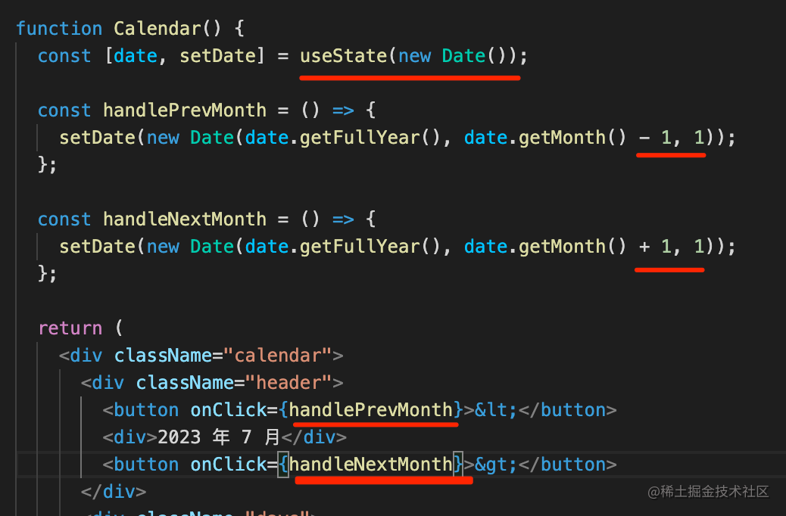

首先，我们肯定要有一个 state 来保存当前的日期，默认值是今天。

然后点击左右按钮，会切换到上个月、下个月的第一天。

```javascript
const [date, setDate] = useState(new Date());

const handlePrevMonth = () => {
    setDate(new Date(date.getFullYear(), date.getMonth() - 1, 1));
};

const handleNextMonth = () => {
    setDate(new Date(date.getFullYear(), date.getMonth() + 1, 1));
};
```

然后渲染的年月要改为当前 date 对应的年月：

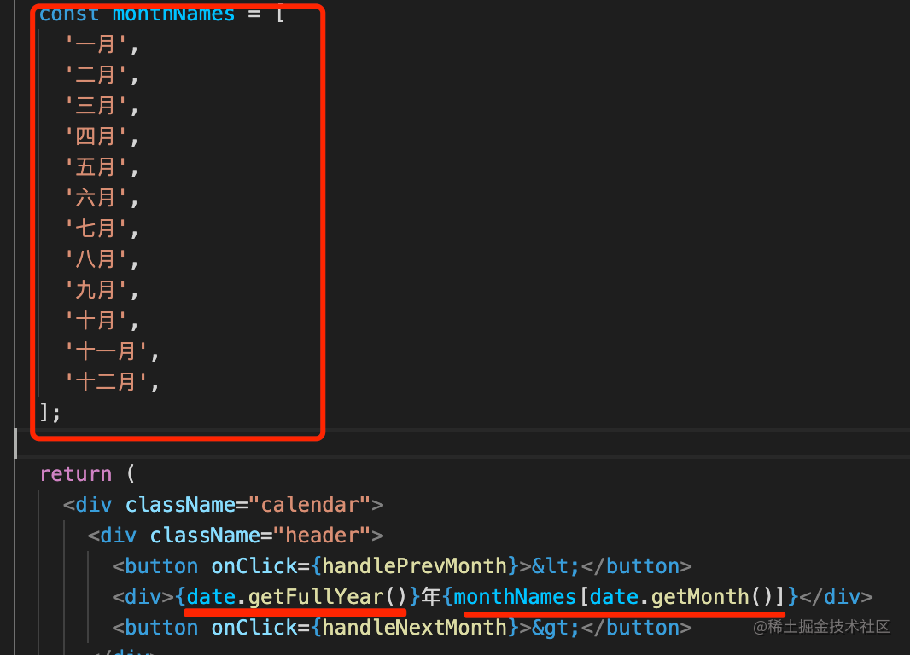

我们试试看：


年月部分没问题了。

再来改下日期部分：

我们定义一个 renderDates 方法：

```javascript
const daysOfMonth = (year: number, month: number) => {
    return new Date(year, month + 1, 0).getDate();
};

const firstDayOfMonth = (year: number, month: number) => {
    return new Date(year, month, 1).getDay();
};

const renderDates = () => {
    const days = [];

    const daysCount = daysOfMonth(date.getFullYear(), date.getMonth());
    const firstDay = firstDayOfMonth(date.getFullYear(), date.getMonth());

    for (let i = 0; i < firstDay; i++) {
      days.push(<div key={`empty-${i}`} className="empty"></div>);
    }

    for (let i = 1; i <= daysCount; i++) {
      days.push(<div key={i} className="day">{i}</div>);
    }

    return days;
};
```
首先定义个数组，来存储渲染的内容。

然后计算当前月有多少天，这里用到了前面那个 new Date 时传入 date 为 0 的技巧。

再计算当前月的第一天是星期几，也就是 new Date(year, month, 1).getDay()

这样就知道从哪里开始渲染，渲染多少天了。

然后先一个循环，渲染 day - 1 个 empty 的块。

再渲染 daysCount 个 day 的块。

这样就完成了日期渲染：

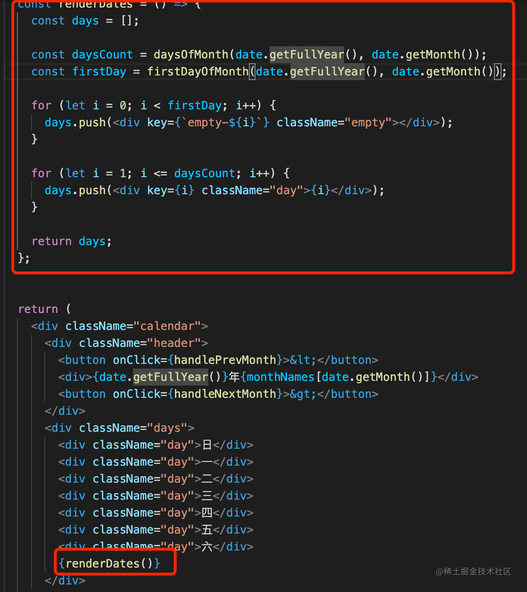

我们来试试看：

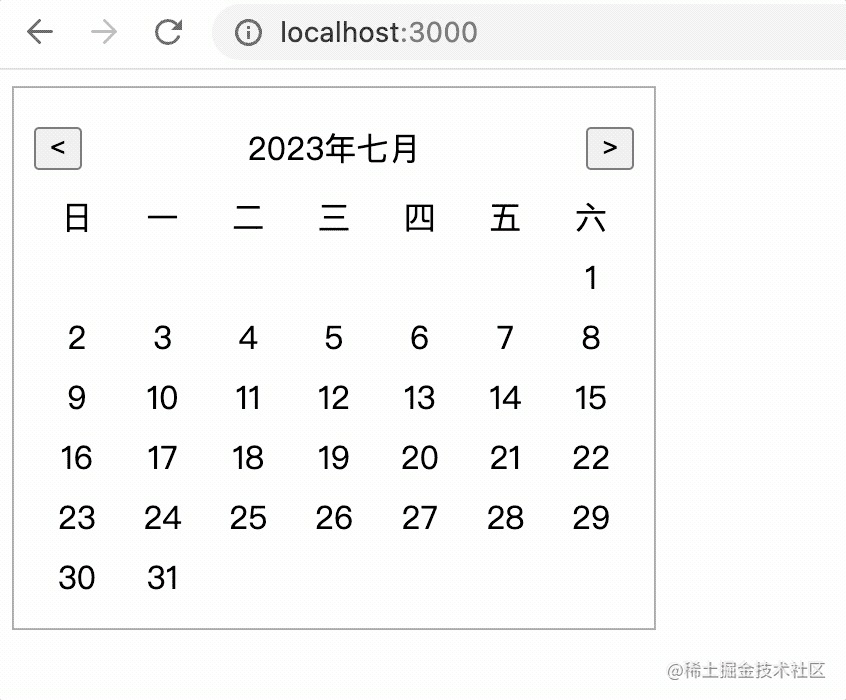

没啥问题。

这样，我们就完成了一个 Calendar 组件！

是不是还挺简单的？

确实，Calendar 组件的原理比较简单。

接下来，我们增加两个参数，defaultValue 和 onChange。

这俩参数和 antd 的 Calendar 组件一样。

我们用非受控模式的写法。

defaultValue 参数设置为 date 的初始值：

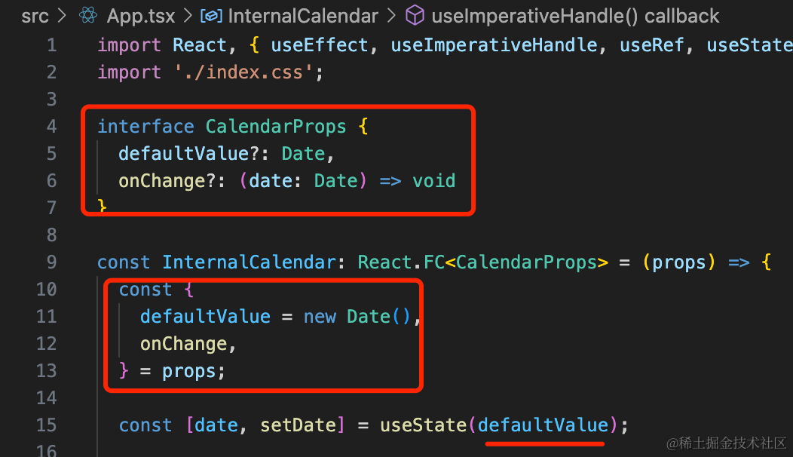

试试看：

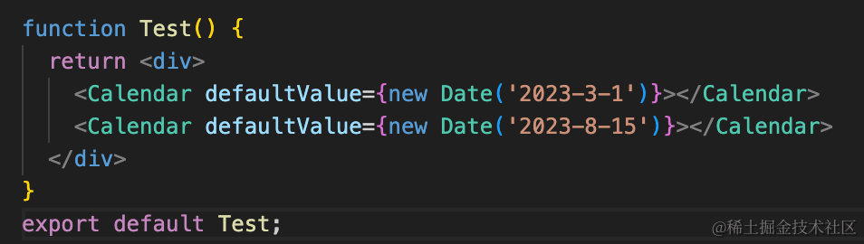

```javascript
function Test() {
  return <div>
    <Calendar defaultValue={new Date('2023-3-1')}></Calendar>
    <Calendar defaultValue={new Date('2023-8-15')}></Calendar>
  </div>
}
```

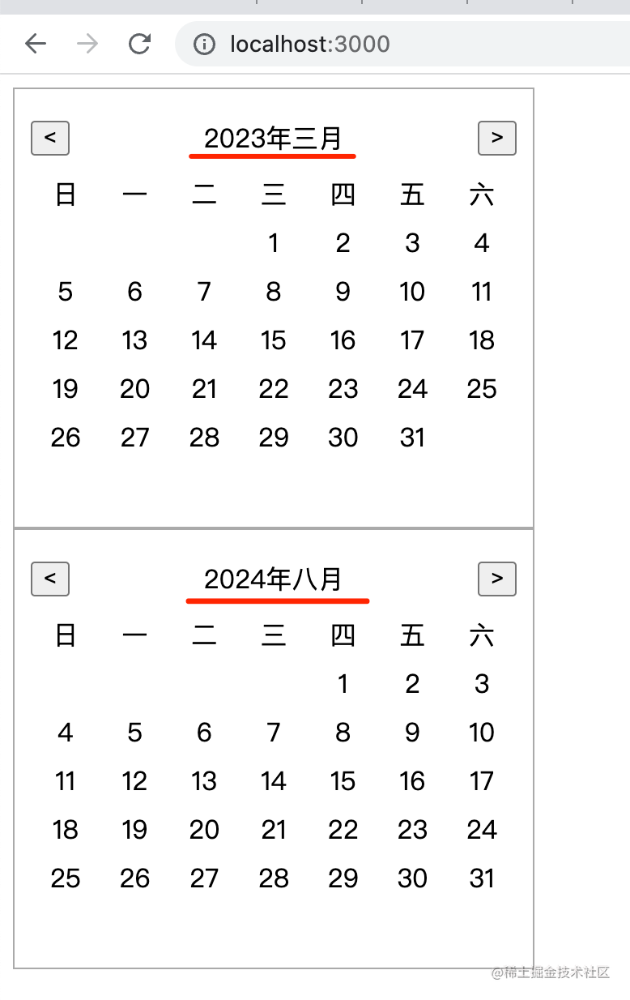

年月是对了，但是日期对不对我们也看不出来，所以还得加点选中样式：

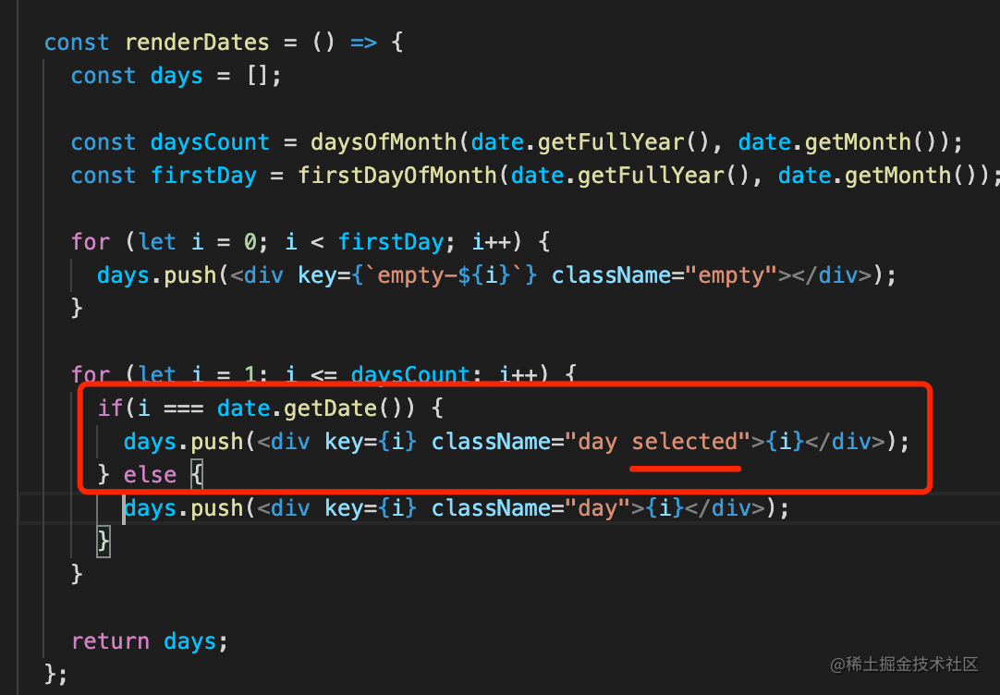

```css
.day:hover, .selected {
  background-color: #ccc;
  cursor: pointer;
}
```
现在就可以看到选中的日期了：

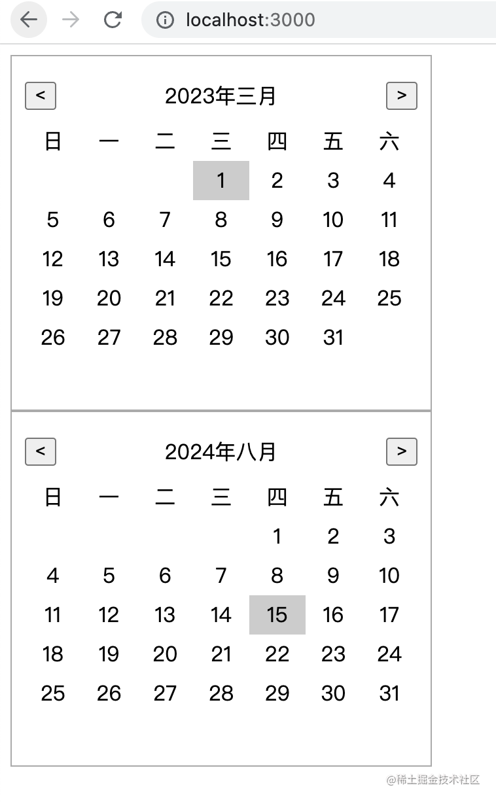

没啥问题。

然后我们再加上 onChange 的回调函数：

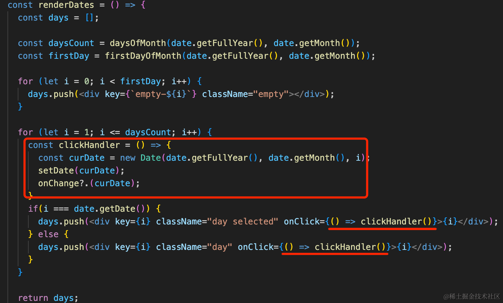

就是在点击 day 的时候，setDate 修改内部状态，然后回调 onChange 方法。

这里是非受控模式的写法，不知道为什么这么写可以看下上节内容。

```javascript
const renderDates = () => {
    const days = [];

    const daysCount = daysOfMonth(date.getFullYear(), date.getMonth());
    const firstDay = firstDayOfMonth(date.getFullYear(), date.getMonth());

    for (let i = 0; i < firstDay; i++) {
      days.push(<div key={`empty-${i}`} className="empty"></div>);
    }

    for (let i = 1; i <= daysCount; i++) {
      const clickHandler = () => {
        const curDate = new Date(date.getFullYear(), date.getMonth(), i);
        setDate(curDate);
        onChange?.(curDate);
      }
      if(i === date.getDate()) {
        days.push(<div key={i} className="day selected" onClick={() => clickHandler()}>{i}</div>);  
      } else {
        days.push(<div key={i} className="day" onClick={() => clickHandler()}>{i}</div>);
      }
    }

    return days;
}
```

我们试试看：

```javascript
function Test() {
    return <div>
        <Calendar defaultValue={new Date('2023-3-1')} onChange={(date)=> {
          alert(date.toLocaleDateString())
        }}></Calendar>
        <Calendar defaultValue={new Date('2023-8-15')}></Calendar>
    </div>
}
```

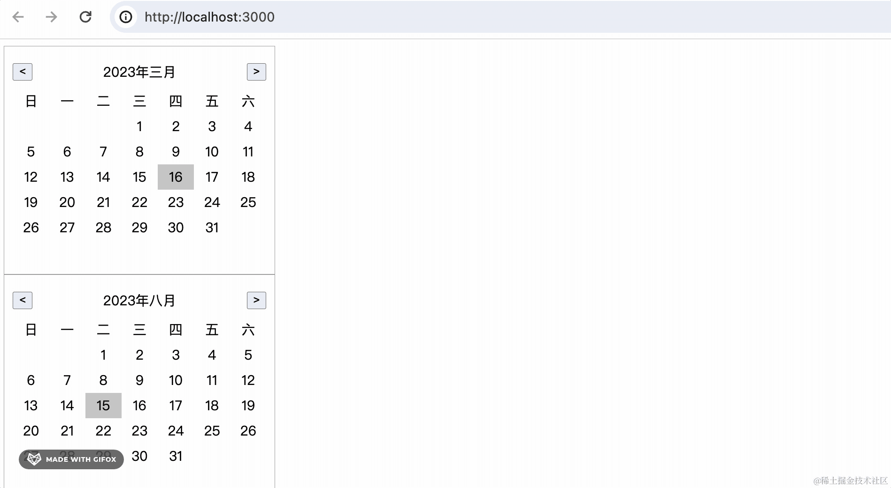
也没啥问题。

现在这个 Calendar 组件就是可用的了，可以通过 defaultValue 来传入初始的 date 值，修改 date 之后可以在 onChange 里拿到最新的值。

大多数人到了这一步就完成 Calendar 组件的封装了。

这当然没啥问题。

但其实你还可以再做一步，提供 ref 来暴露一些 Canlendar 组件的 api。

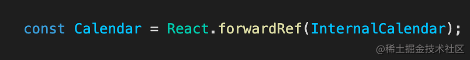


用的时候这样用：

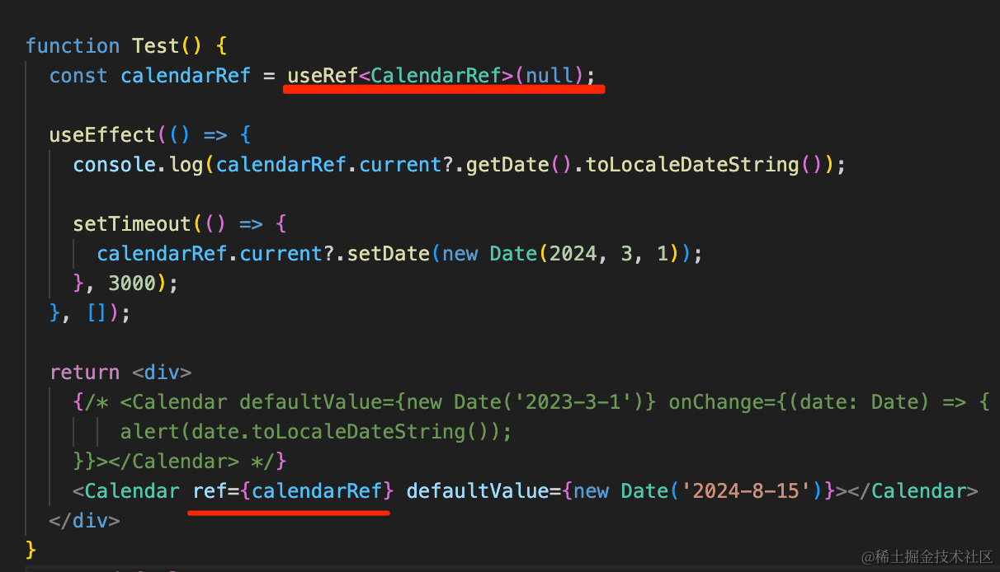

```javascript
import React, { useEffect, useImperativeHandle, useRef, useState } from 'react';
import './index.css';

interface CalendarProps {
  defaultValue?: Date,
  onChange?: (date: Date) => void
}

interface CalendarRef {
  getDate: () => Date,
  setDate: (date: Date) => void,
}

const InternalCalendar: React.ForwardRefRenderFunction<CalendarRef, CalendarProps> = (props, ref) => {
  const {
    defaultValue = new Date(),
    onChange,
  } = props;

  const [date, setDate] = useState(defaultValue);

  useImperativeHandle(ref, () => {
    return {
      getDate() {
        return date;
      },
      setDate(date: Date) {
        setDate(date)
      }
    }
  });

  const handlePrevMonth = () => {
    setDate(new Date(date.getFullYear(), date.getMonth() - 1, 1));
  };

  const handleNextMonth = () => {
    setDate(new Date(date.getFullYear(), date.getMonth() + 1, 1));
  };

  const monthNames = [
    '一月',
    '二月',
    '三月',
    '四月',
    '五月',
    '六月',
    '七月',
    '八月',
    '九月',
    '十月',
    '十一月',
    '十二月',
  ];

  const daysOfMonth = (year: number, month: number) => {
    return new Date(year, month + 1, 0).getDate();
  };

  const firstDayOfMonth = (year: number, month: number) => {
    return new Date(year, month, 1).getDay();
  };

  const renderDates = () => {
    const days = [];

    const daysCount = daysOfMonth(date.getFullYear(), date.getMonth());
    const firstDay = firstDayOfMonth(date.getFullYear(), date.getMonth());

    for (let i = 0; i < firstDay; i++) {
      days.push(<div key={`empty-${i}`} className="empty"></div>);
    }

    for (let i = 1; i <= daysCount; i++) {
      const clickHandler = () => {
        const curDate = new Date(date.getFullYear(), date.getMonth(), i);
        setDate(curDate);
        onChange?.(curDate);
      }
      if(i === date.getDate()) {
        days.push(<div key={i} className="day selected" onClick={() => clickHandler()}>{i}</div>);  
      } else {
        days.push(<div key={i} className="day" onClick={() => clickHandler()}>{i}</div>);
      }
    }

    return days;
  };

  return (
    <div className="calendar">
      <div className="header">
        <button onClick={handlePrevMonth}>&lt;</button>
        <div>{date.getFullYear()}年{monthNames[date.getMonth()]}</div>
        <button onClick={handleNextMonth}>&gt;</button>
      </div>
      <div className="days">
        <div className="day">日</div>
        <div className="day">一</div>
        <div className="day">二</div>
        <div className="day">三</div>
        <div className="day">四</div>
        <div className="day">五</div>
        <div className="day">六</div>
        {renderDates()}
      </div>
    </div>
  );
}

const Calendar = React.forwardRef(InternalCalendar);

function Test() {
  const calendarRef = useRef<CalendarRef>(null);

  useEffect(() => {
    console.log(calendarRef.current?.getDate().toLocaleDateString());

    setTimeout(() => {
      calendarRef.current?.setDate(new Date(2024, 3, 1));
    }, 3000);
  }, []);

  return <div>
    {/* <Calendar defaultValue={new Date('2023-3-1')} onChange={(date: Date) => {
        alert(date.toLocaleDateString());
    }}></Calendar> */}
    <Calendar ref={calendarRef} defaultValue={new Date('2024-8-15')}></Calendar>
  </div>
}
export default Test;
```

试试看：

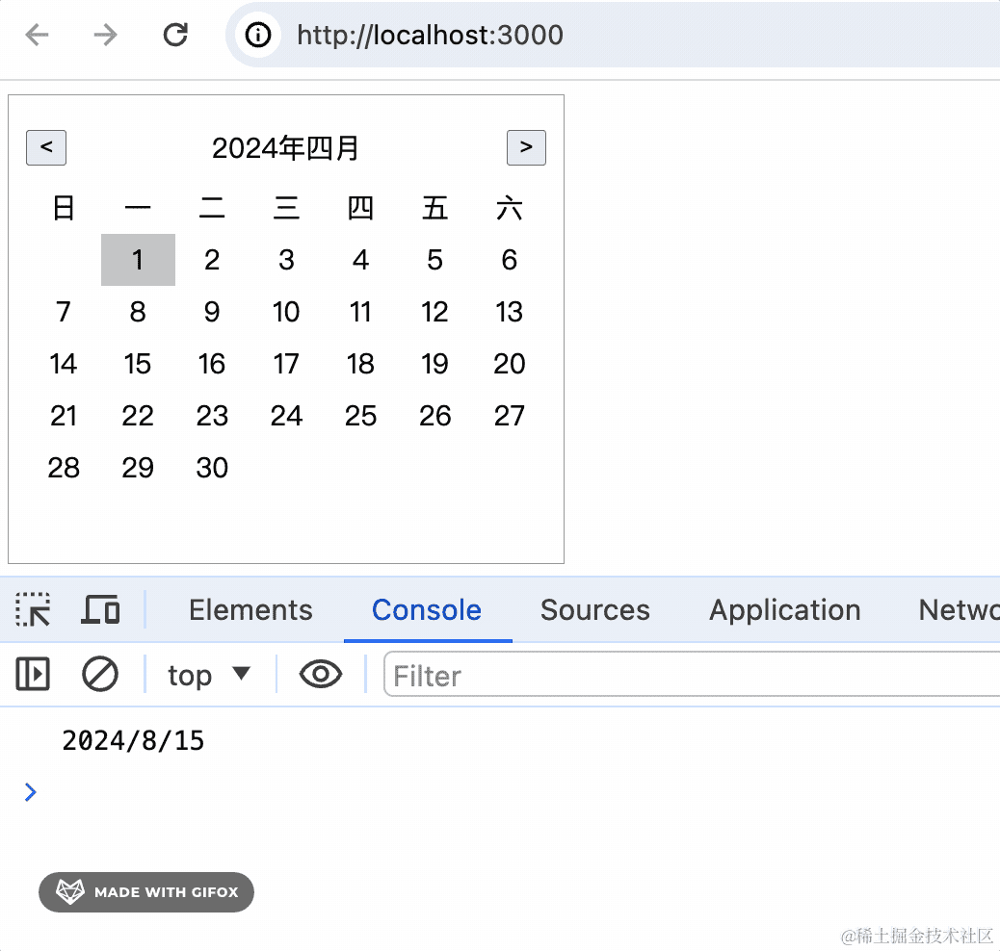

ref 的 api 也都生效了。

这就是除了 props 之外，另一种暴露组件 api 的方式。

你经常用的 Canlendar 或者 DatePicker 组件就是这么实现的，

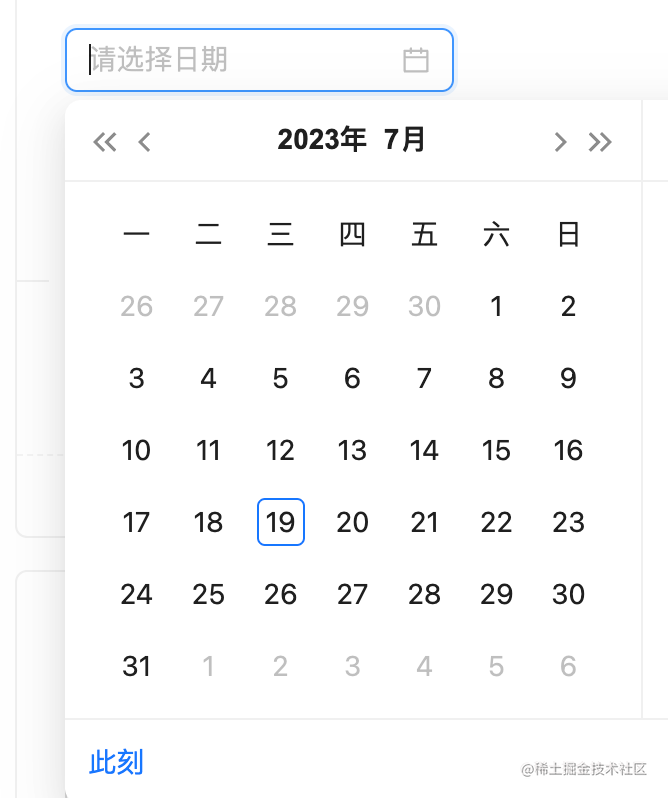

当然，这些组件除了本月的日期外，其余的地方不是用空白填充的，而是上个月、下个月的日期。

这个也很简单，拿到上个月、下个月的天数就知道填什么日期了。

此外，我们的组件只支持非受控模式怎么行呢？

受控模式也得支持。

上节讲过如何同时兼容两种，这里我们就直接用 ahooks 的 useControllableValue 来做了。

安装 ahooks：

```
npm install --save ahooks
```

把 useState 换成 ahooks 的 useControllableValue：

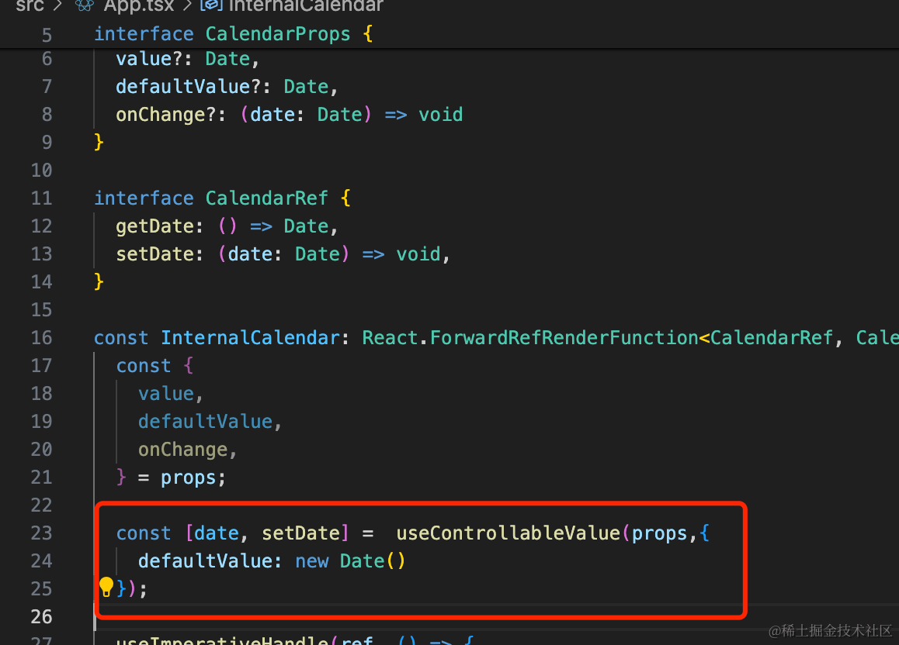

```javascript
const [date, setDate] =  useControllableValue(props,{
    defaultValue: new Date()
});
```
这里的 defaultValue 是当 props.value 和 props.defaultValue 都没传入时的默认值。

clickHanlder 这里就只需要调用 setDate 不用调用 onChange 了：

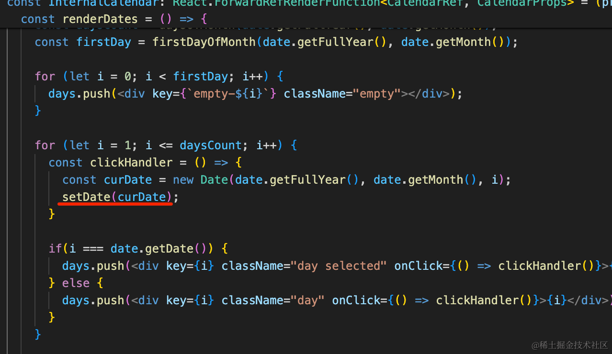

如果对 useControllable 这个 hook 有疑问，可以看下上节我们自己实现的那个 hook。

测试下：

受控模式：

```javascript
function Test() {
  const [date, setDate] = useState(new Date());

  return <Calendar value={date} onChange={(newDate) => {
      setDate(newDate);
      alert(newDate.toLocaleDateString());
  }}></Calendar>
}
```
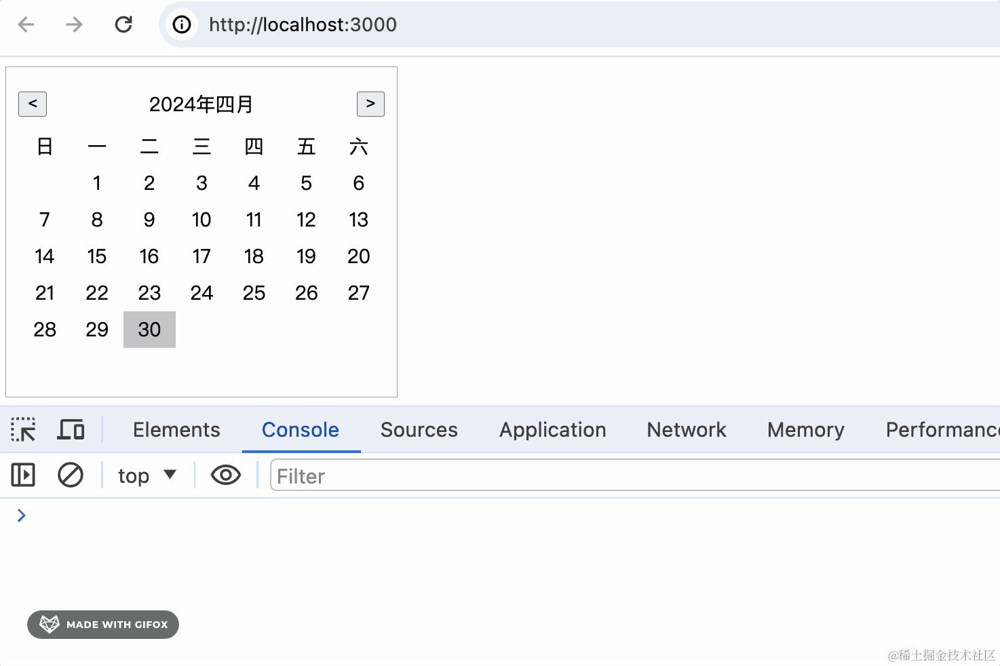

非受控模式：

```javascript
function Test() {
  return <Calendar defaultValue={new Date()} onChange={(newDate) => {
      alert(newDate.toLocaleDateString());
  }}></Calendar>
}
```
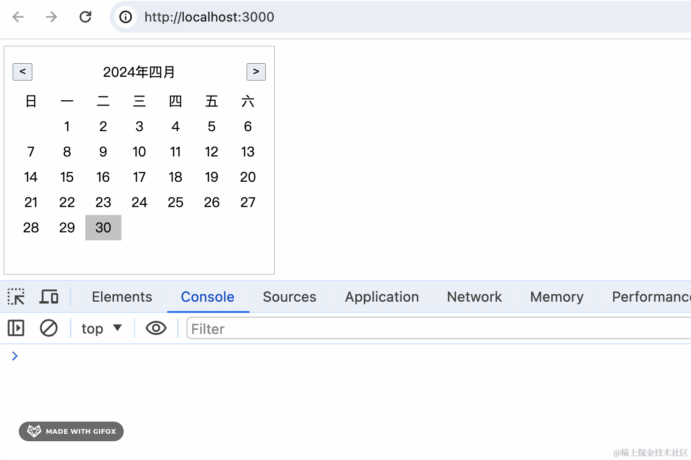

没啥问题。

案例代码上传了[小册仓库](https://github.com/QuarkGluonPlasma/react-course-code/tree/main/mini-calendar-test)。
## 总结

Calendar 或者 DatePicker 组件我们经常会用到，今天自己实现了一下。

其实原理也很简单，就是 Date 的 api。

new Date 的时候 date 传 0 就能拿到上个月最后一天的日期，然后 getDate 就可以知道那个月有多少天。

然后再通过 getDay 取到这个月第一天是星期几，就知道怎么渲染这个月的日期了。

我们用 react 实现了这个 Calendar 组件，支持传入 defaultValue 指定初始日期，传入 onChange 作为日期改变的回调。

除了 props 之外，还额外提供 ref 的 api，通过 forwarRef + useImperativeHandle 的方式。

最开始只是非受控组件，后来我们又基于 ahooks 的 useControllableValue 同时支持了受控和非受控的用法。

整天用 Calendar 组件，不如自己手写一个吧！
