# 第12章—深入理解Suspense和ErrorBoundary

React 里有两种组件，看似没啥关系，但在实现原理上却是很接近。

它们就是 Suspense 和 ErrorBoundary。

新建个项目：

```
npx create-react-app --template=typescript suspense-error-boundary
```
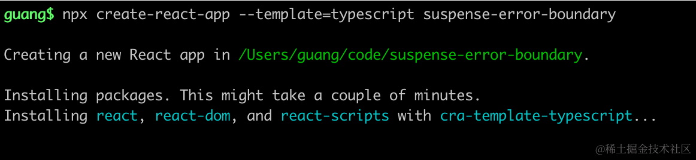

先来看下 Suspense 组件：

Suspense 组件是和 React.lazy 结合用，用来加载一些异步组件。

新建一个组件 Aaa.tsx：

```javascript
// src/Aaa.jsx
export default function Aaa() {
    return <div>aaa</div>
}
```
在 App.tsx 里加载用 lazy + Suspense 异步加载它：

```javascript
import React, { Suspense } from 'react';

const LazyAaa = React.lazy(() => import('./Aaa'));

export default function App() {
  return <div>
    <Suspense fallback={'loading...'}>
      <LazyAaa></LazyAaa>
    </Suspense>
  </div>
}
```

fallback 参数指定在过程中显示的内容，加载完成后，显示懒加载的组件内容。

把开发服务跑起来：

```
npm run start
```
然后就可以在浏览器里看到异步加载组件的过程：

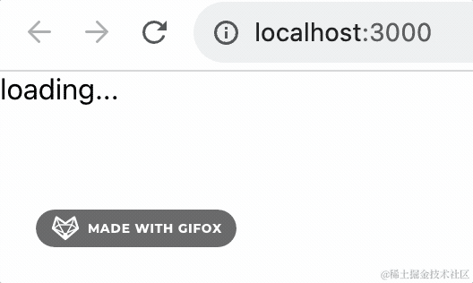

当然，因为本地加载比较快，你可以用 chrome devtools 改成慢速网络再刷新看看：

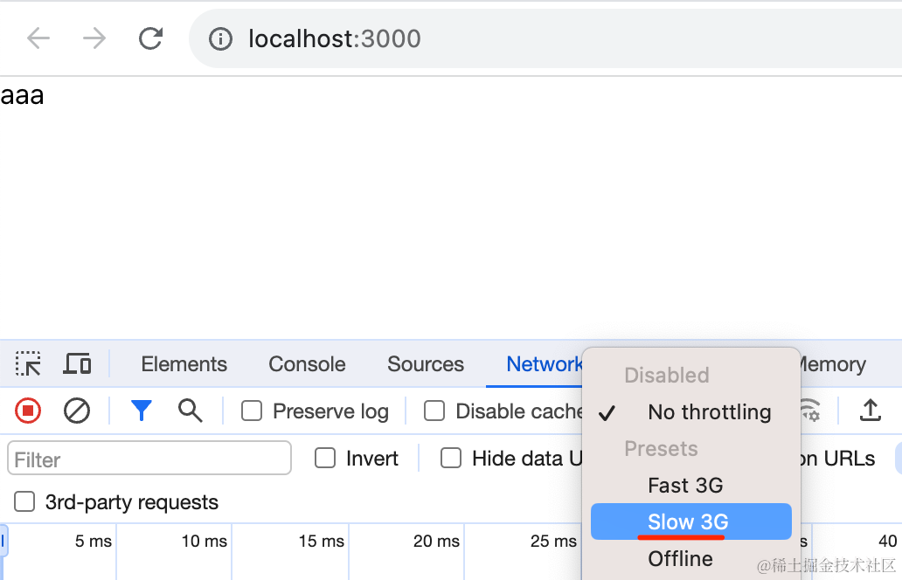

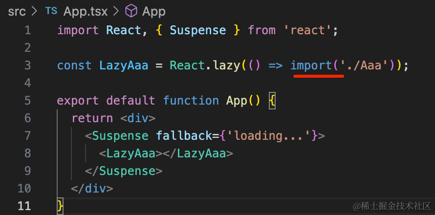

这里的 import 是 webpack 提供的用来异步加载模块的 api，它会动态下载模块所在的 chunk，然后从中解析出该模块，拿到 export 的值：

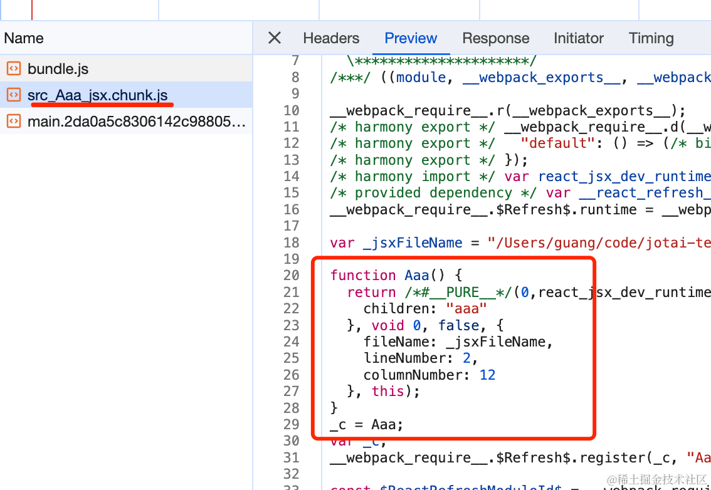

后台管理系统用这个挺多的，因为不可能一下子把所有路由的组件都下载下来，所以会用 lazy + Suspense 的方式异步加载暂时用不到的路由对应的组件。

大多数场景下，Suspense 就专门和 lazy 搭配使用的。

但有的时候，你会发现 Suspense 不搭配 lazy 也可以。

比如 jotai 这个状态管理库，它就号称支持了 Suspense。

我们安装下 jotai：

```
npm install jotai
```

然后写下 App2.tsx

```javascript
import { Suspense } from 'react'
import { atom, useAtom } from 'jotai'

const userAtom = atom(async (get) => {
  const userId = 1;
  const response = await fetch(
    `https://jsonplaceholder.typicode.com/users/${userId}?_delay=2000`
  )
  return response.json()
})

const UserName = () => {
  const [user] = useAtom(userAtom)
  return <div>User name: {user.name}</div>
}

export default function App() {
  return <Suspense fallback="Loading...">
    <UserName />
  </Suspense>
}
```
渲染下这个组件：

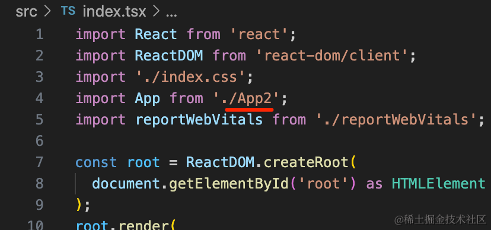

浏览器访问下：

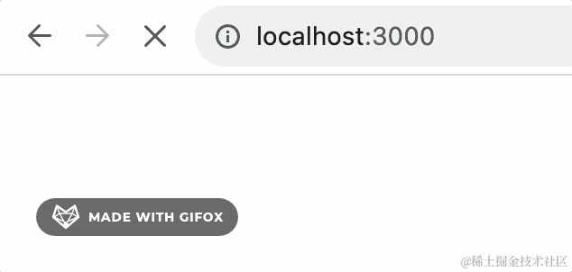

可以看到，Suspense 依然是生效的。

现在并不是用 lazy 异步加载组件呀，怎么触发的 Suspense 呢？

这个问题稍后回答，我们先转过头来看下 ErrorBoundary。

前面讲过，现在 react 官网都推荐用 function 组件而不是 class 组件了：

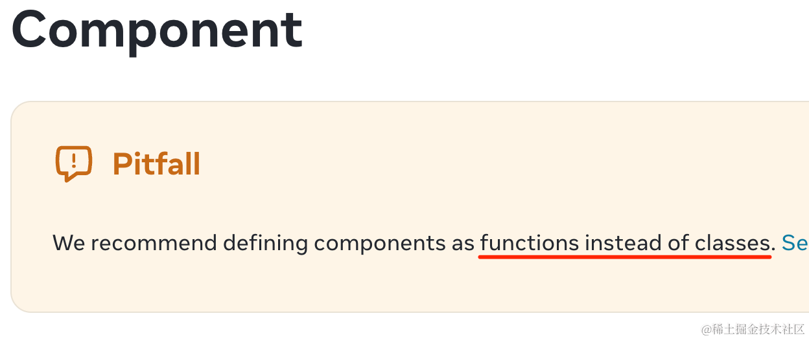

绝大多数情况我们用 function 组件就好了，没必要用 class 组件。

但是有一个特性是只有 class 组件才有的，就是 ErrorBoundary。

这样写：

```javascript
import { Component } from "react";

class ErrorBoundary extends Component {
  constructor(props) {
    super(props);
    this.state = {
      hasError: false
    };
  }

  static getDerivedStateFromError(error) {
    return { hasError: true, message: error.message };
  }

  componentDidCatch(error, errorInfo) {
    console.log(error, errorInfo);
  }

  render() {
    if (this.state.hasError) {
      return <div>出错了： {this.state.message}</div>;
    }
    return this.props.children;
  }
}
```

当子组件报错的时候，会把错误传递给它的 getDerivedStateFromError 和 componentDidCatch 方法。

getDerivedStateFromError 接收 error，返回一个新的 state，会触发重新渲染来显示错误对应的 UI。

componentDidCatch 接收 error 和堆栈 info，可以用来打印错误日志。

我们写个 App3.jsx 试一下：

```javascript
import { Component } from "react";

class ErrorBoundary extends Component {
  constructor(props) {
    super(props);
    this.state = {
      hasError: false
    };
  }

  static getDerivedStateFromError(error) {
    return { hasError: true, message: error.message };
  }

  componentDidCatch(error, errorInfo) {
    console.log(error, errorInfo);
  }

  render() {
    if (this.state.hasError) {
      return <div>出错了： {this.state.message}</div>;
    }
    return this.props.children;
  }
}

function Bbb() {
    const b = window.a.b;

    return <div>{b}</div>
}

export default function App() {
    return <ErrorBoundary>
        <Bbb></Bbb>
    </ErrorBoundary>
}
```

注意，这里是 jsx，因为不想处理 class 组件的类型。

用 ErrorBoundary 组件包裹 Bbb 组件，Bbb 组件里会报错，因为 window.a.b 不存在。

正常情况下报错后会页面白屏。

我们渲染下这个组件：

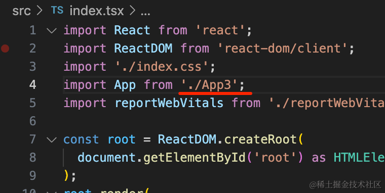

现在有 ErrorBoundary 是这样的：

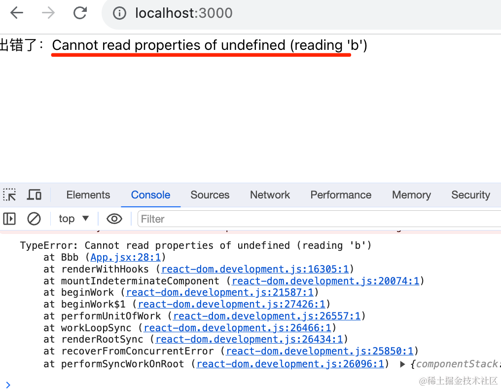

把 ErrorBoundary 去掉后，可以看到，页面直接白屏了：

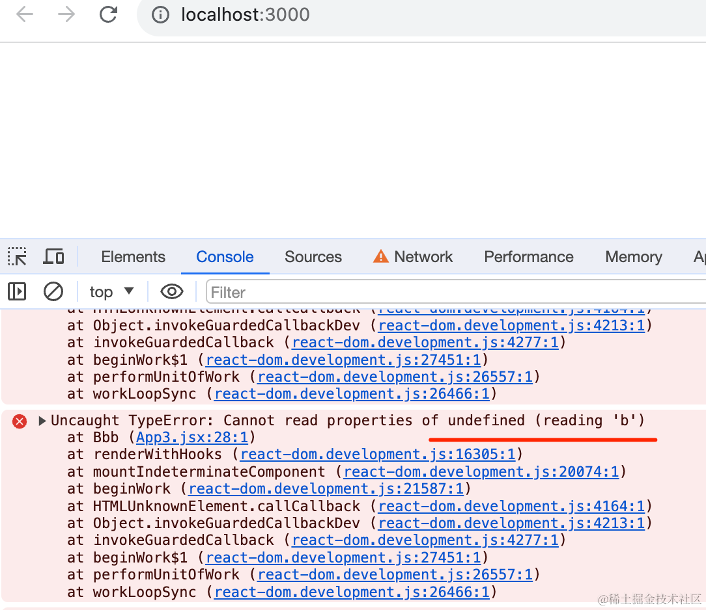

这就是 ErrorBoundary 的作用，捕获子组件抛出的错误，显示对应的 UI。

回过头来看下这两个方法：

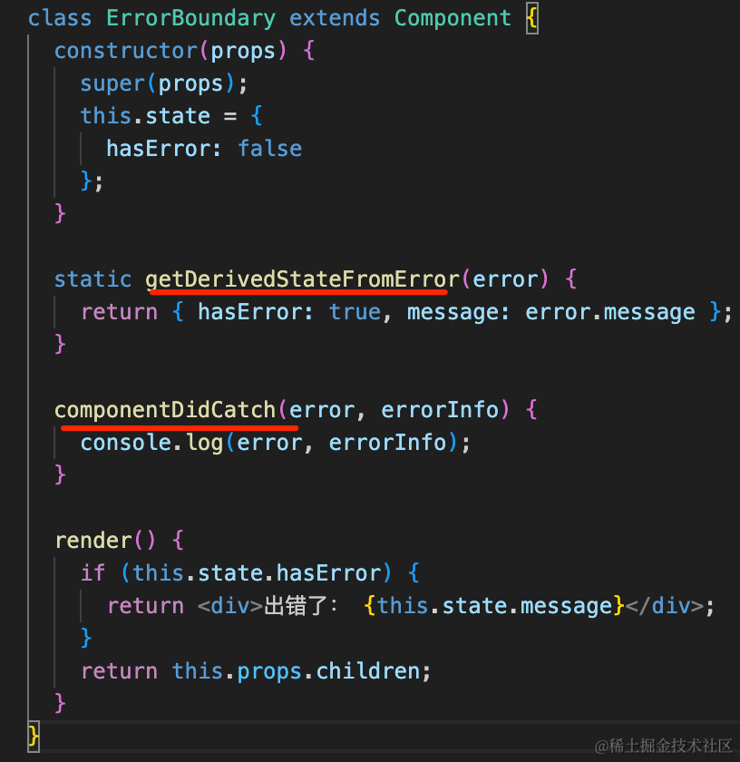

getDerivedStateFromError 修改 state 触发重新渲染，渲染出错误对应的 UI。

componentDidCatch 拿到错误信息，打印日志。

这样，就对组件抛错的情况做了兜底。

这个特性只有 class 组件有，function 组件没有：

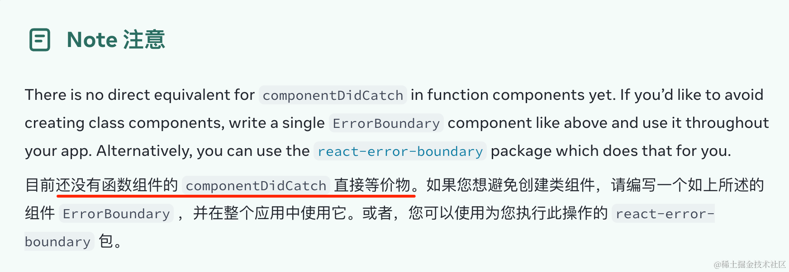

不过一般也不用自己写这种 ErrorBoundary 组件，直接用 react-error-boundary 这个包就行：

```
npm install --save react-error-boundary
```
创建 App4.tsx

```javascript
import { ErrorBoundary } from "react-error-boundary";

function Bbb() {
    useEffect(() => {
        throw new Error('xxx');
    }, [])
    return <div>bbb</div>
}

export default function App() {
  return <ErrorBoundary fallbackRender={({ error }) => {
        return <div>
        <p>出错了：</p>
        <div>{error.message}</div>
    </div>
  }}>
    <Bbb></Bbb>
  </ErrorBoundary>
}
```
渲染下：

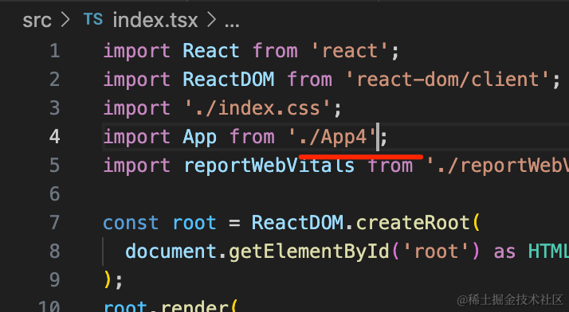

可以看到，ErrorBoundary 生效了：

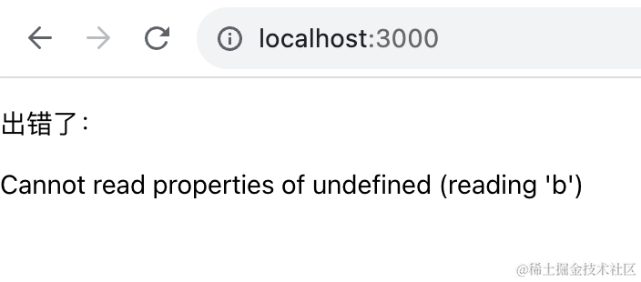

而且并不一定是 ErrorBoundary 的 children，任意层级的子组件都可以：

```javascript
import { useEffect } from "react";
import { ErrorBoundary } from "react-error-boundary";

function Bbb() {
    useEffect(() => {
        throw new Error('xxx');
    }, [])
    return <div>bbb</div>
}

function Aaa() {
    return <Bbb></Bbb>
}

export default function App() {
    return <ErrorBoundary fallbackRender={({ error }) => {
            return <div>
                <p>出错了：</p>
                <div>{error.message}</div>
            </div>
    }}>
        <Aaa></Aaa>
    </ErrorBoundary>
}

```

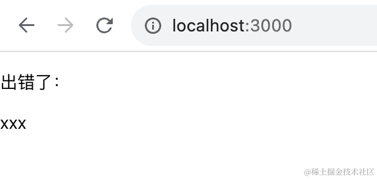

也就是说组件抛错的时候，会向上寻找最近的 ErrorBoundary 组件。

这也是 boundary 的含义。

话说回来，为什么讲 Suspense 要扯到 ErrorBoundary 呢？

这俩有啥关系？

其实 Suspense 也是用 throw error 的方式实现的。

创建 App5.jsx：

```javascript
import { Suspense } from "react";

let data, promise;
function fetchData() {
  if (data) return data;
  promise = new Promise(resolve => {
    setTimeout(() => {
      data = '取到的数据'
      resolve()
    }, 2000)
  })
  throw promise;
}

function Content() {
  const data = fetchData();
  return <p>{data}</p>
}

export default function App() {
  return (
    <Suspense fallback={'loading data'}>
      <Content />
    </Suspense>
  )
}
```

渲染下：

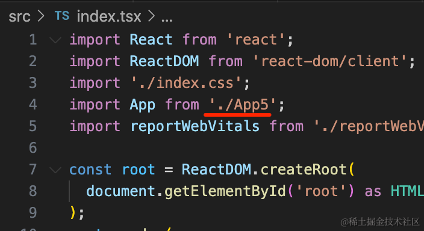

可以看到，触发了 Suspense：

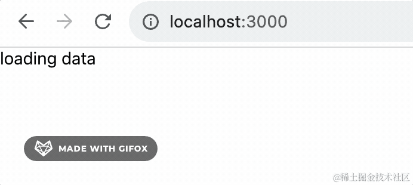

也就是说，只要 throw 一个 promise，就会被最近的 Suspense 捕获。

promise 初始状态展示 fallback，promise 改变状态后展示子组件。


那 React.lazy 是不是也是基于这个实现的呢？

看下源码，发现确实是这样：

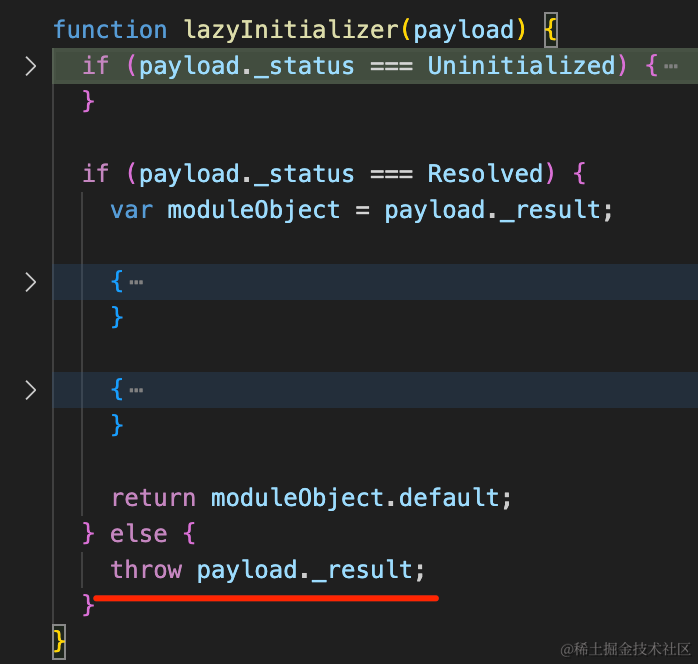

React.lazy 包裹之后，也会 throw 一个 promise 来触发 Suspense。

当 promise 改变状态后，再返回拿到的值。

这样为什么 jotai 可以支持 Suspense 我们也就知道了：

也是这样实现的：

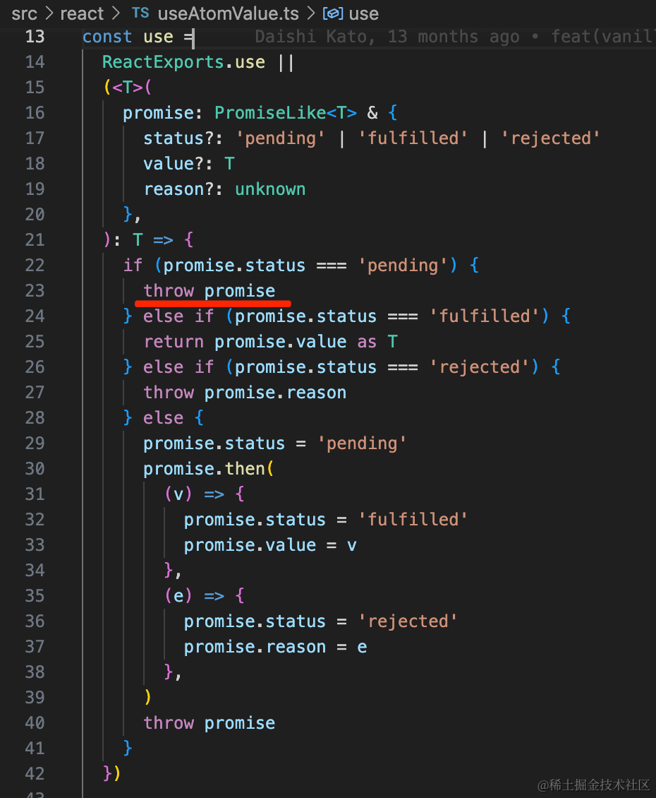

有的同学可能会问了：ErrorBoundary 是捕获组件 throw 的错误，而 Suspense 是捕获组件 throw 的 promise，这俩会冲突么？

试一下就知道了：

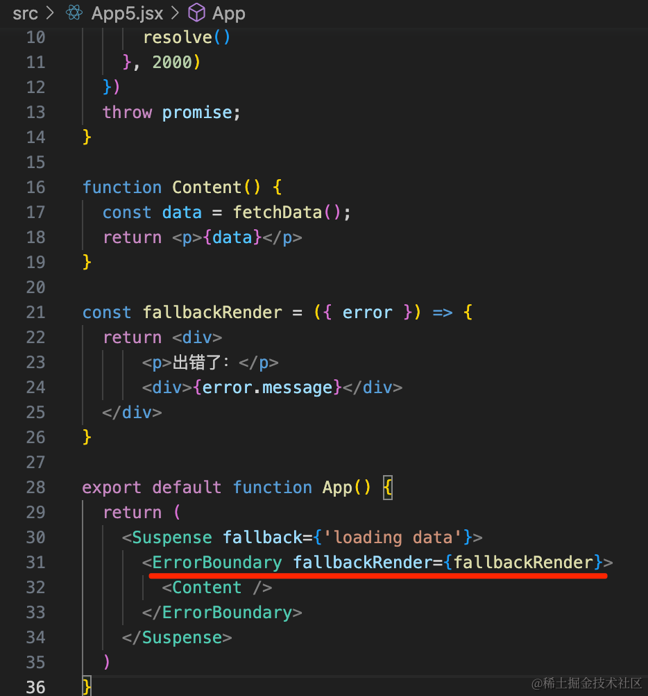

```javascript
const fallbackRender = ({ error }) => {
  return <div>
      <p>出错了：</p>
      <div>{error.message}</div>
  </div>
}

export default function App() {
  return (
    <Suspense fallback={'loading data'}>
      <ErrorBoundary fallbackRender={fallbackRender}>
        <Content />
      </ErrorBoundary>
    </Suspense>
  )
}
```

包裹一层 ErrorBoundary，你会发现 throw promise 没有触发它：


而 throw 一个 error 的时候：

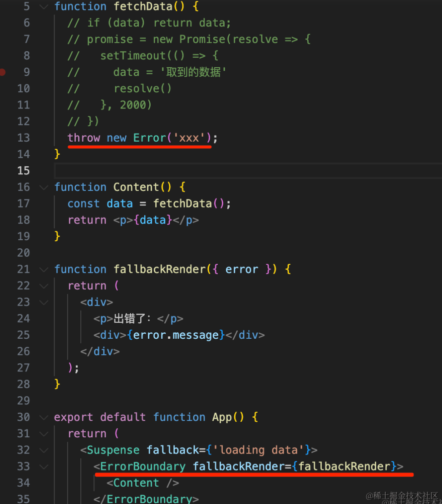

ErrorBoundary 就触发了：

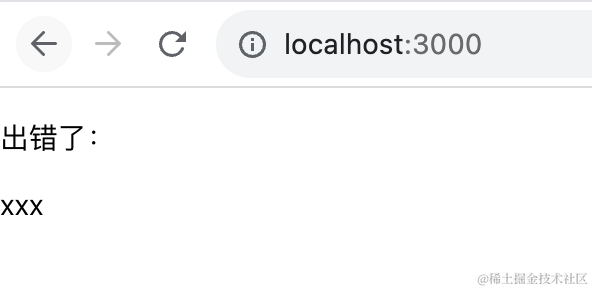

也就是说，ErrorBoundary 和 Suspense 虽然都是捕获组件 throw 出的东西，但这俩互不相干，一个捕获 error，一个捕获 promise。

大概看下源码的处理：

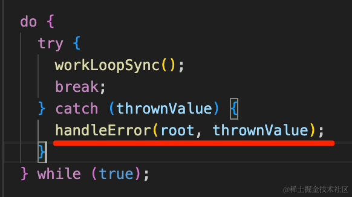

首先会全部 catch，然后内部再区分两种情况：

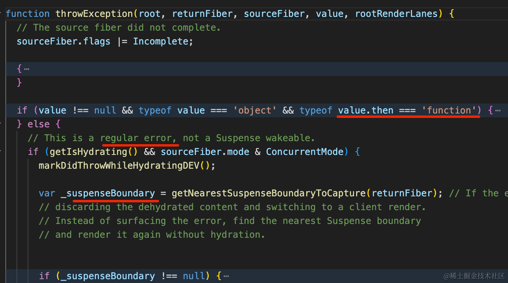

如果 throw 的是 error，就是 error boundary 的处理逻辑，找最近的一个 ErrorBoundary 组件来处理。

如果 throw 的是 promise，则是 suspense boundary 的处理逻辑，找最近的 Suspense 组件来处理。

两者互不相干。

但业务代码我们不用 Suspense 来写这种 loading。

大家都这么写：

```javascript
import { useEffect, useState } from "react";

function fetchData(): Promise<{name: string}> {
  return new Promise(resolve => {
    setTimeout(() => {
      resolve({
        name: 'guang'
      });
    }, 2000)
  })
}

export default function App() {
  const [loading, setLoading] = useState(false);
  const [data, setData] = useState<{name?: string}>({});


  async function load() {
    setLoading(true);
    const data = await fetchData();
    setData(data);
    setLoading(false);
  }

  useEffect(() => {
    load();
  }, []);

  return <div>
    { loading ? 'loding...' : data.name }
  </div>
}
```
渲染下：

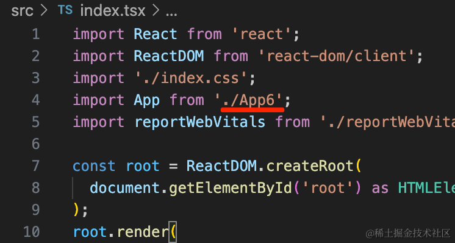


就是加一个 state 来记录 loading 状态就行了。

要是用 Suspense，需要 throw 一个 promise 才行，那可太费劲了，而且代码也不好维护。

不过如果你用了一些支持 Suspense 的框架，比如 jotai、next.js 等，那也可以用 Suspense。

框架内部给你做了 throw promise 的事情。

比如我们前面用的 jotai 就做了支持：

```javascript
import { Suspense } from 'react'
import { atom, useAtom } from 'jotai'

const userAtom = atom(async (get) => {
  const userId = 1;
  const response = await fetch(
    `https://jsonplaceholder.typicode.com/users/${userId}?_delay=2000`
  )
  return response.json()
})

const UserName = () => {
  const [user] = useAtom(userAtom)
  return <div>User name: {user.name}</div>
}

export default function App() {
  return <Suspense fallback="Loading...">
    <UserName />
  </Suspense>
}
```

本来 Suspense 就是用来做这个的，结果现在只有 lazy 加载异步组件的时候才能用。

react 团队也在想办法解决这个问题，所以出了一个  use 的 hook：

这样用：

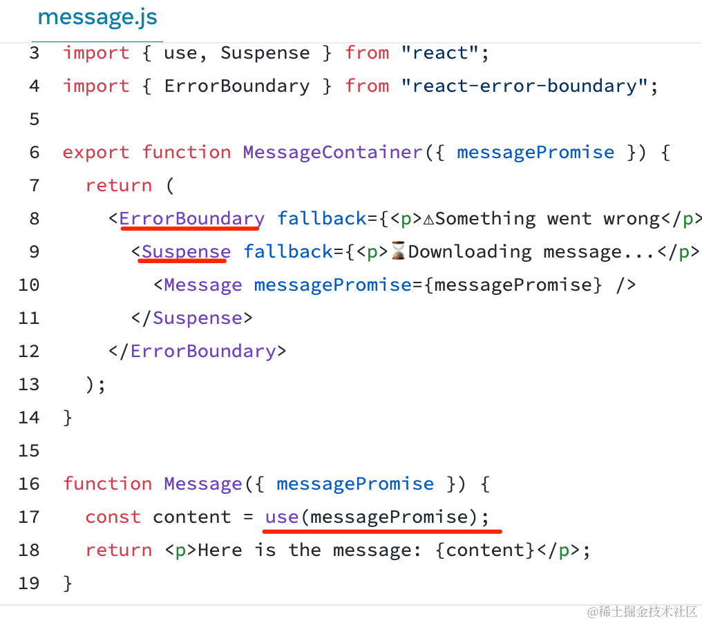

它的参数是 promise。

当 promise 在 pending 的时候，展示 suspense 的 fallback。

当 promise 是 resolve 的时候，展示 Suspense 的子组件。

当 promise 是 reject 的时候，展示 ErrorBoundary 的 fallback。

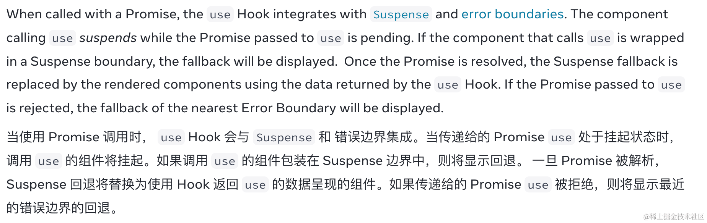

这样就不用自己 throw promise 了，业务代码就可以用 Suspense 来 loading 了。

不过别高兴太早，这个 use 的 hook 还在实验阶段，还没正式发布。

[文档的传送门](https://react.dev/reference/react/use)

我们刚才用的 jotai 就自己实现了一下 use：

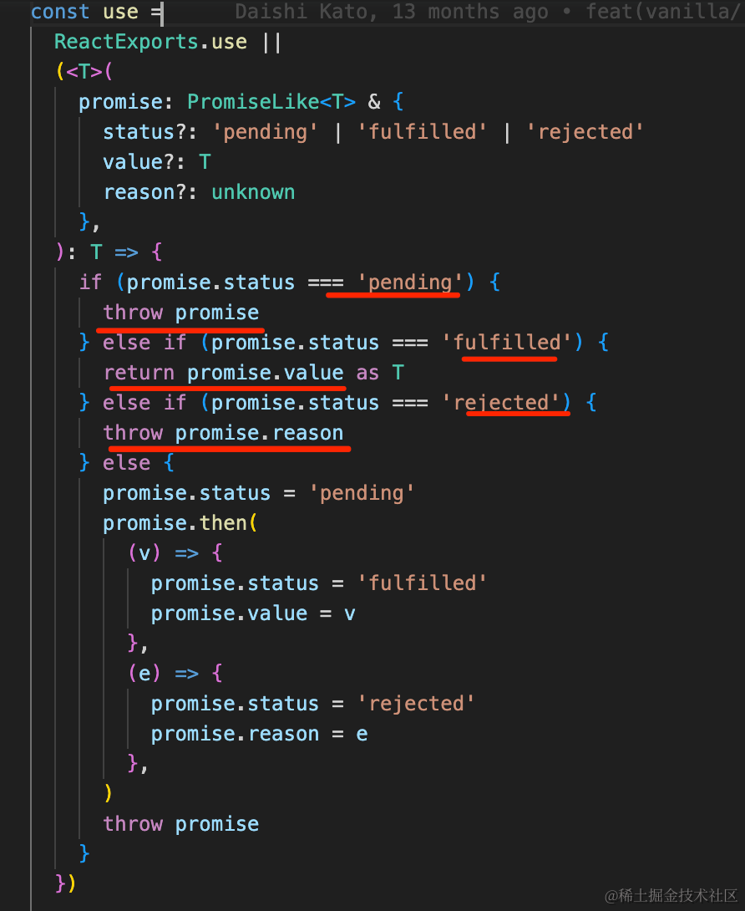

就是 pending 的时候 throw promise，reject 的时候 throw error，否则 return 数据。

等 use 这个 hook 正式发布了，大家就可以告别自己写个 state 标识 loading 状态这种方式了，直接用 Suspense。

这就是文档里写的触发 Suspense 的 3 种方式：

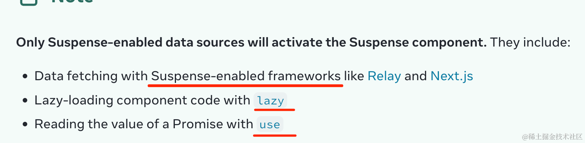

一种是用支持 Suspense 的框架，比如 next.js 或者 jotai。

一种是 lazy 异步加载组件。

再一种就是还在实验阶段的 use 了。

这些不同的方式底层都是 throw promise。

案例代码上传了[小册仓库](https://github.com/QuarkGluonPlasma/react-course-code/tree/main/suspense-error-boundary)。

## 总结

大多数人用 Suspense 都是结合 React.lazy 异步加载组件的时候用，其实它也可以独立用。

它的底层原理就是 throw 一个 promise，然后 React 会捕获这个 promise，交给最近的 Suspense 组件来处理。

类似的，ErrorBoundary 也是这种处理方式，只不过捕获的是 throw 的 error。

ErrorBoundary 只能是 class 组件的形式，通过 getDerivedStateFromError 方法来接收错误修改 state，以及 componentDidCatch 来打印错误日志。

自己写 throw promise 来触发 Suspense 还是很麻烦的，一般我们都不用这个，而是自己写个 loading 的 state 来标识。

不过当你用 next.js、jotai 等框架的时候，因为内部做了 throw promise 的封装，就可以直接用 Suspense 了。

此外，react 有一个 use 的 hook，可以接收 promise，在 pending 的时候触发 Suspense，在 reject 的时候触发 ErrorBoundary，底层原理就是 throw error 和 promise。

这个 hook 还在实验阶段，等正式发布之后，估计代码里就会有大量 Suspense 了。

Suspense 和 ErrorBoundary 看似是两种不同的东西，但其实不管是用法还是实现原理，都是很类似的。
