# 第14章—组件实战：Space间距组件

我们用 flex、margin、padding 等来布局，写每个组件都要用。

但其实很多布局是通用的。

我们能不能把布局抽离出来，作为一个组件来复用呢？

可以的，这类组件叫做布局组件。

**布局就是确定元素的位置**，比如间距、对齐、换行等都是确定元素位置的。

在 antd 文档里有专门一个分类：

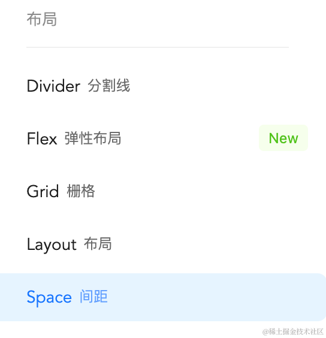

今天我们来写下其中的 Space 组件。

首先用一下：

```
npx create-react-app --template=typescript space-component
```

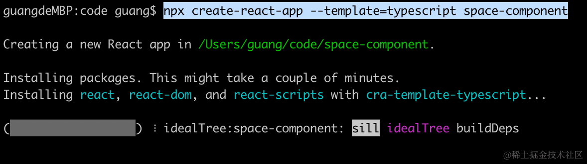

安装 antd：

```
npm install --save antd
```

改下 App.tsx：

```javascript
import './App.css';

export default function App() {
  return <div>
    <div className="box"></div>
    <div className="box"></div>
    <div className="box"></div>
  </div>
}
```
App.css 里写下样式：

```css
.box {
  width: 100px;
  height: 100px;
  background: pink;
  border: 1px solid #000;
}
```

把开发服务跑起来：

```
npm run start
```

渲染出来是这样的：

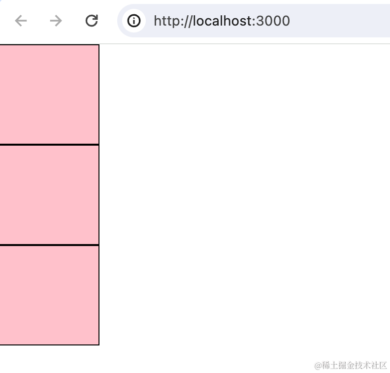

然后我们用 antd 的 Space 组件包一下：

```javascript
import { Space } from 'antd';
import './App.css';

export default function App() {
  return <div>
    <Space direction="horizontal">
      <div className="box"></div>
      <div className="box"></div>
      <div className="box"></div>
    </Space>
  </div>
}
```


方向变为水平了，并且有个默认间距。

改为竖直试一下：

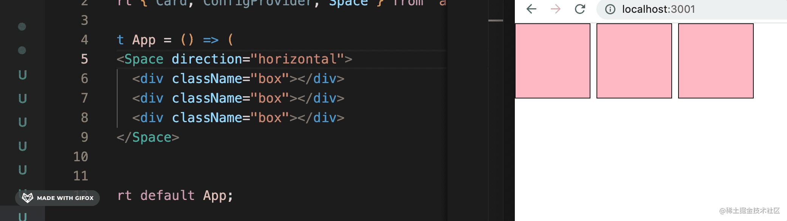

水平和竖直的间距都可以通过 size 来设置：

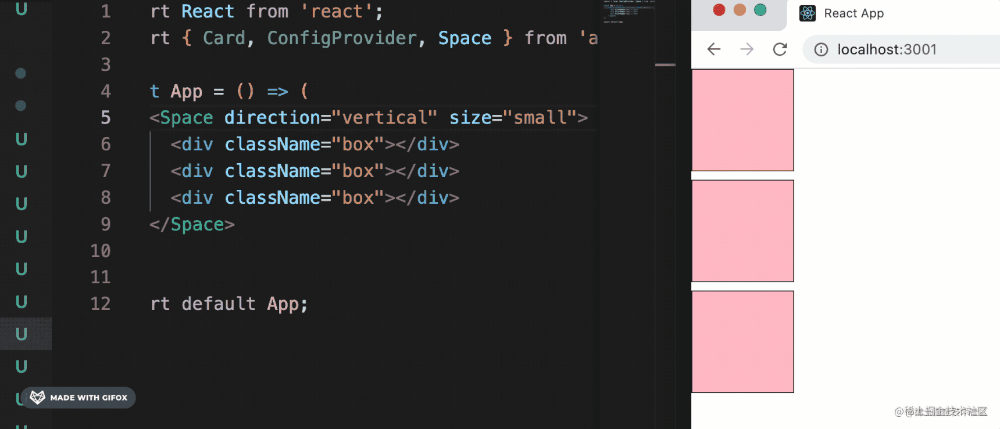

可以设置 large、middle、small 或者任意数值。

多个子节点可以设置对齐方式，比如 start、end、center 或者 baseline：

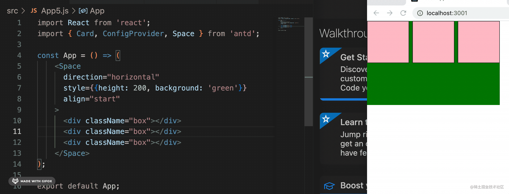

```javascript
import { Space } from 'antd';
import './App.css';

export default function App() {
  return <div>
    <Space 
      direction="horizontal" 
      style={{height: 200, background: 'green'}}
      align='center'
    >
      <div className="box"></div>
      <div className="box"></div>
      <div className="box"></div>
    </Space>
  </div>
}
```

此外子节点过多可以设置换行：

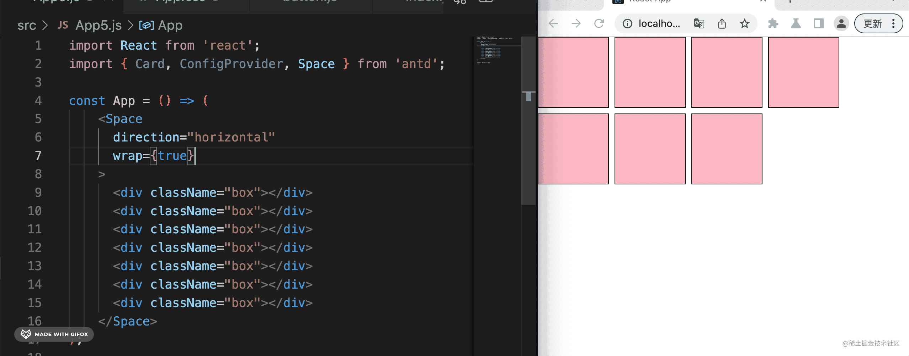

也可以用数组分别设置行、列的间距：

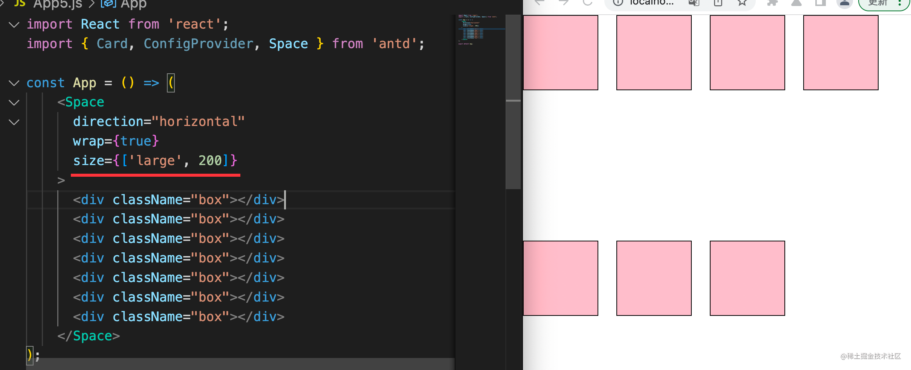

最后，它还可以设置 split 分割线部分：

```javascript
import { Space } from 'antd';
import './App.css';

export default function App() {
  return <div>
    <Space 
      direction="horizontal" 
      split={
        <div className='box' style={{background: 'yellow'}}></div>
      }
    >
      <div className="box"></div>
      <div className="box"></div>
      <div className="box"></div>
    </Space>
  </div>
}
```

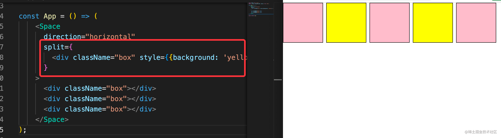

此外，你也可以不直接设置 size，而是通过 ConfigProvider 修改 context 中的默认值：

```javascript
import { ConfigProvider, Space } from 'antd';
import './App.css';

export default function App() {
  return <div>
    <ConfigProvider space={{ size: 100 }}>
      <Space direction="horizontal">
        <div className="box"></div>
        <div className="box"></div>
        <div className="box"></div>
      </Space>
    </ConfigProvider>
  </div>
}
```

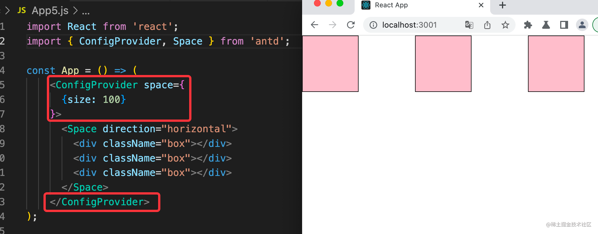

很明显，Space 内部会读取 context 中的 size 值。

这样如果有多个 Space 组件就不用每个都设置了，统一加个 ConfigProvider 就行了：

```javascript
import { ConfigProvider, Space } from 'antd';
import './App.css';

export default function App() {
  return <div>
    <ConfigProvider space={{ size: 100 }}>
      <Space direction="horizontal">
        <div className="box"></div>
        <div className="box"></div>
        <div className="box"></div>
      </Space>
      <Space direction="vertical">
        <div className="box"></div>
        <div className="box"></div>
        <div className="box"></div>
      </Space>
    </ConfigProvider>
  </div>
}
```

可以看到，两个 Space 的间距设置都生效了。

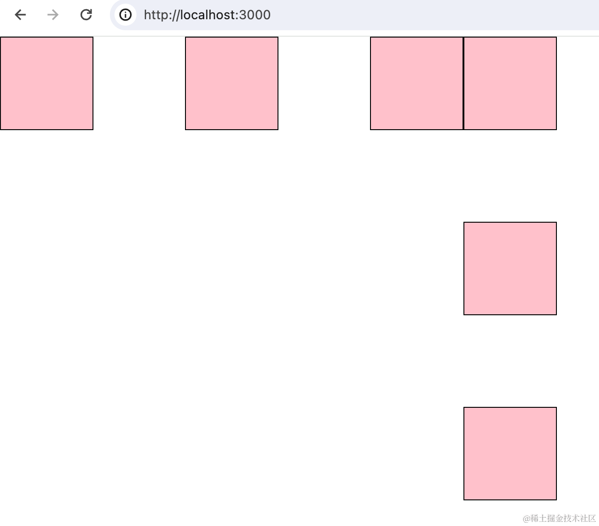

这就是 antd 的 Space 组件的全部用法，回顾下这几个参数和用法：

- direction: 设置子组件方向，水平还是竖直排列
- size：设置水平、竖直的间距
- align：子组件的对齐方式
- wrap：超过一屏是否换行，只在水平时有用
- split：分割线
- 多个 Space 组件的 size 可以通过 ConfigProvider 统一设置默认值。

我们自己一般不会封装这种组件，这些布局直接用 flex 写在组件里不就好了，封装啥布局组件？

但其实这样把布局抽出来，就不用在组件里写布局代码了，直接用 Space 组件调整下参数就好。

当布局比较固定的时候，把这种布局抽出来封装的意义就很大，可以各处复用。

那这样的布局组件是怎么实现的呢？

打开 devtools 看下它的 dom：

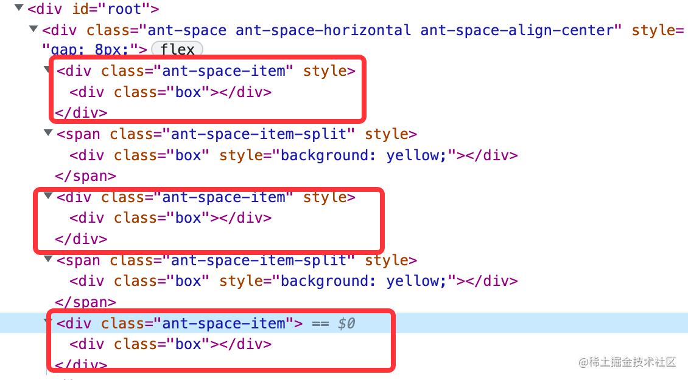

就是对每个 child 包一层 div，然后加上不同的 className 就好了。

下面我们来写一下：

创建 Space/index.tsx：

```javascript
export interface SpaceProps extends React.HTMLAttributes<HTMLDivElement> {
  className?: string;
  style?: React.CSSProperties;
}

const Space: React.FC<SpaceProps> = props => {

  const {
    className,
    style,
    ...otherProps
  } = props;

  return <div
    className={className}
    style={style}
    {...otherProps}
  ></div>
};

export default Space;
```
className 和 style 的参数就不用解释了。

这里继承了 HTMLAttributes\<HTMLDivElement> 类型，那就可以传入各种 div 的属性。

在 App.tsx 里用用看：

```javascript
import Space from './Space';
import './App.css';

export default function App() {
  return <div>
      <Space></Space>
  </div>
}
```


这样，组件用起来就和 div 一模一样。

我们只要把其他参数透传给 Space 组件里的 div 即可：

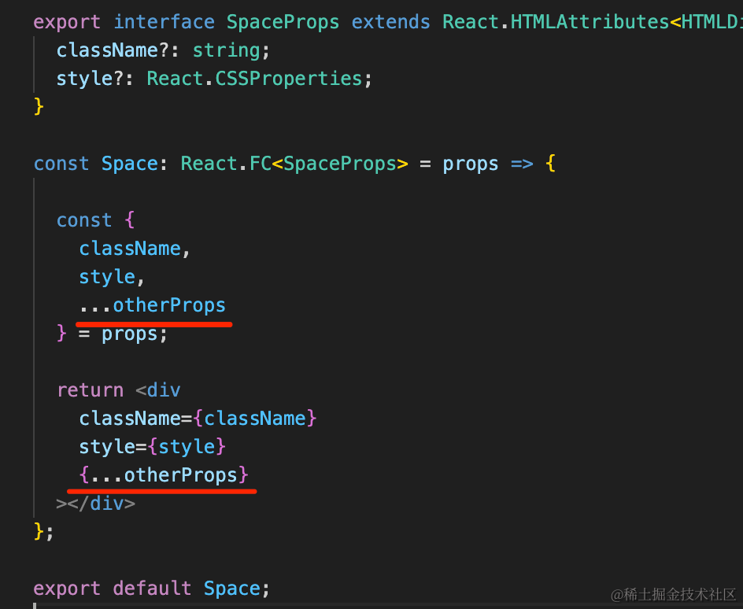

然后把其他 props 也声明了：

```javascript
export type SizeType = 'small' | 'middle' | 'large' | number | undefined;

export interface SpaceProps extends React.HTMLAttributes<HTMLDivElement> {
  className?: string;
  style?: React.CSSProperties;
  size?: SizeType | [SizeType, SizeType];
  direction?: 'horizontal' | 'vertical';
  align?: 'start' | 'end' | 'center' | 'baseline';
  split?: React.ReactNode;
  wrap?: boolean;
}
```
style 是 CSSProperties 类型，可以传入各种 css。

split 是 ReactNode 类型，也就是可以传入 jsx。

size 可以传单个值代表横竖间距，或者传一个数组，分别设置横竖间距。

这些我们都测试过。

然后是内容部分：

我们传入的是这样的 children：

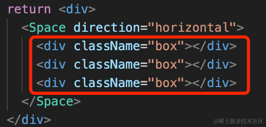

但是渲染出来的包了一层 div：

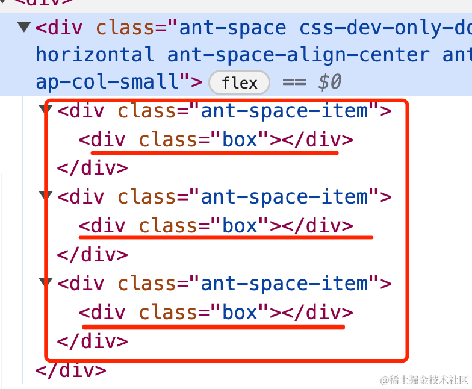

这是怎么做到的呢？

用 React.Children 的 api。

[文档里](https://react.dev/reference/react/Children)可以看到这些 api：

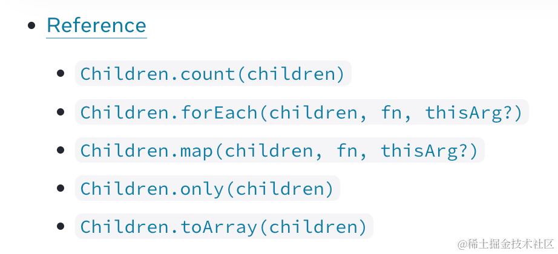

很明显，就是用于 children 的遍历、修改、计数等操作的。

有的同学可能对 React.Children.toArray 有疑问：

children 不是已经是数组了么？为什么还要用 React.Children.toArray 转一下？

试下这段代码就知道了：

```javascript
import React from 'react';

interface TestProps {
  children: React.ReactNode[]
}

function Test(props: TestProps) {
  const children2 = React.Children.toArray(props.children);

  console.log(props.children);
  console.log(children2);
  return <div></div>
}

export default function App() {
  return  <Test>
    {
      [
        [<div>111</div>, <div>222</div>], 
        [<div>333</div>]
      ]
    }
    <span>hello world</span>
  </Test>
}
```
分别打印 props.children 和  Children.toArray 处理之后的 children：

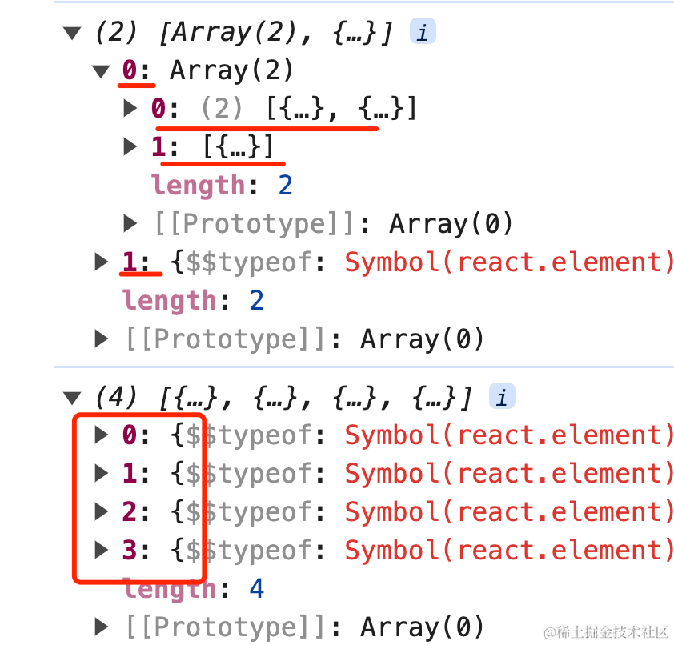

可以看到，React.Children.toArray 对 children 做扁平化。

而且 props.children 调用 sort 方法会报错：

```javascript
import React from 'react';

interface TestProps {
  children: React.ReactNode[]
}

function Test(props: TestProps) {
  console.log(props.children.sort());
  return <div></div>
}

export default function App() {
  return  <Test>
    {33}
    <span>hello world</span>
    {22}
    {11}
  </Test>
}
```

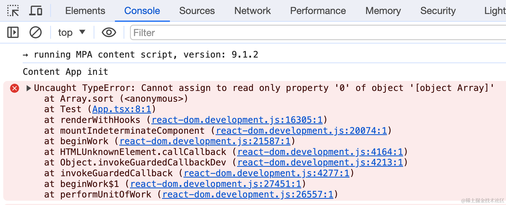

toArray 之后就不会了：
```javascript
import React from 'react';

interface TestProps {
  children: React.ReactNode[]
}

function Test(props: TestProps) {
  const children2 = React.Children.toArray(props.children);

  console.log(children2.sort());
  return <div></div>
}

export default function App() {
  return  <Test>
    {33}
    <span>hello world</span>
    {22}
    {11}
  </Test>
}
```
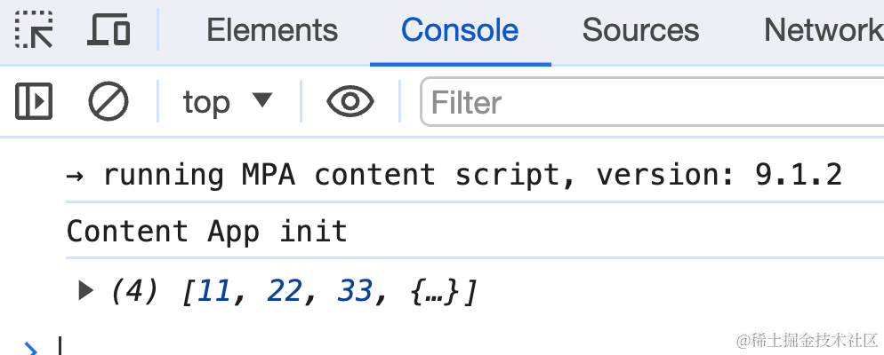

可以看到，可以排序了。

这里的打印如果执行两遍，是 React.StrictMode 那个组件导致的，可以改下 index.tsx：

```javascript
import ReactDOM from 'react-dom/client';
import App from './App';

const root = ReactDOM.createRoot(
  document.getElementById('root') as HTMLElement
);
root.render(<App />);
```

我们遍历下 Children：

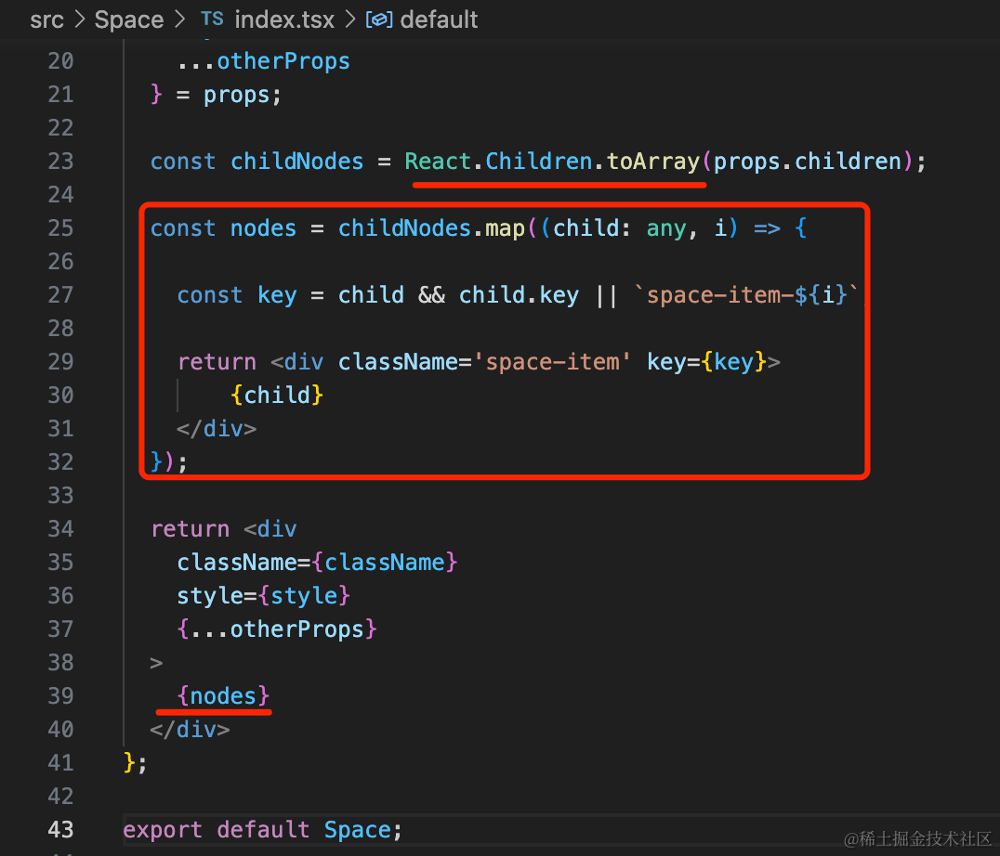

```javascript
import React from 'react';

export type SizeType = 'small' | 'middle' | 'large' | number | undefined;

export interface SpaceProps extends React.HTMLAttributes<HTMLDivElement> {
  className?: string;
  style?: React.CSSProperties;
  size?: SizeType | [SizeType, SizeType];
  direction?: 'horizontal' | 'vertical';
  align?: 'start' | 'end' | 'center' | 'baseline';
  split?: React.ReactNode;
  wrap?: boolean;
}

const Space: React.FC<SpaceProps> = props => {

  const {
    className,
    style,
    ...otherProps
  } = props;

  const childNodes = React.Children.toArray(props.children);

  const nodes = childNodes.map((child: any, i) => {

    const key = child && child.key || `space-item-${i}`;

    return <div className='space-item' key={key}>
        {child}
    </div>
  });

  return <div
    className={className}
    style={style}
    {...otherProps}
  >
    {nodes}
  </div>
};

export default Space;
```
在 App.tsx 里测试下：

```javascript
import './App.css';
import Space from './Space';

export default function App() {
  return <Space>
    <div>111</div>
    <div>222</div>
    <div>333</div>
  </Space>
}
```
可以看到，children 修改成功了：

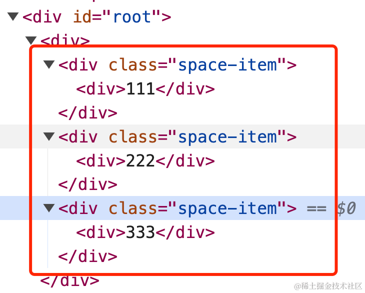

然后我们引入 classnames 包处理下其它 className：

```
npm install --save classnames
```

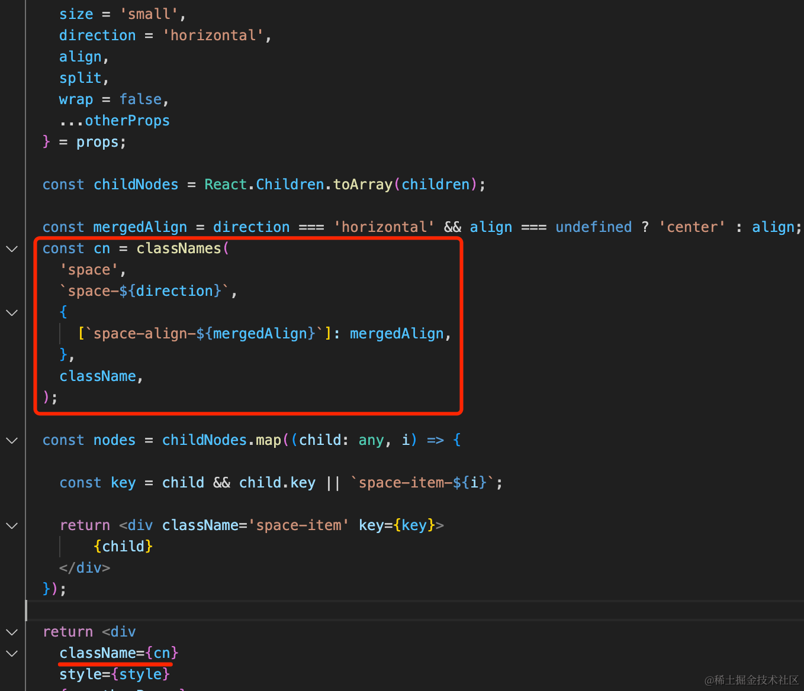

根据 direction、align 的 props 来生成 className：

```javascript
import React from 'react';
import classNames from 'classnames';

export type SizeType = 'small' | 'middle' | 'large' | number | undefined;

export interface SpaceProps extends React.HTMLAttributes<HTMLDivElement> {
  className?: string;
  style?: React.CSSProperties;
  size?: SizeType | [SizeType, SizeType];
  direction?: 'horizontal' | 'vertical';
  align?: 'start' | 'end' | 'center' | 'baseline';
  split?: React.ReactNode;
  wrap?: boolean;
}

const Space: React.FC<SpaceProps> = props => {

  const {
    className,
    style,
    children,
    size = 'small',
    direction = 'horizontal',
    align,
    split,
    wrap = false,
    ...otherProps
  } = props;

  const childNodes = React.Children.toArray(children);

  const mergedAlign = direction === 'horizontal' && align === undefined ? 'center' : align;
  const cn = classNames(
    'space',
    `space-${direction}`,
    {
      [`space-align-${mergedAlign}`]: mergedAlign,
    },
    className,
  );

  const nodes = childNodes.map((child: any, i) => {

    const key = child && child.key || `space-item-${i}`;

    return <div className='space-item' key={key}>
        {child}
    </div>
  });

  return <div
    className={cn}
    style={style}
    {...otherProps}
  >
    {nodes}
  </div>
};

export default Space;
```

测试下：

```javascript
import './App.css';
import Space from './Space';

export default function App() {
  return <Space direction='horizontal' align='end'>
    <div>111</div>
    <div>222</div>
    <div>333</div>
  </Space>
}
```
也生效了：

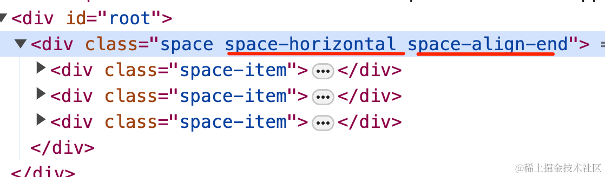

那接下来的事情不就很简单了么，只要实现这些 className 的样式就好了。

我们安装 sass：

```
npm install --save-dev sass
```
然后写下样式：

Space/index.scss：

```scss
.space {
  display: inline-flex;

  &-vertical {
    flex-direction: column;
  }

  &-align {
    &-center {
      align-items: center;
    }

    &-start {
      align-items: flex-start;
    }

    &-end {
      align-items: flex-end;
    }

    &-baseline {
      align-items: baseline;
    }
  }
}
```
整个容器 inline-flex，然后根据不同的参数设置 align-items 和 flex-direction 的值。

在 Space 组件引入：

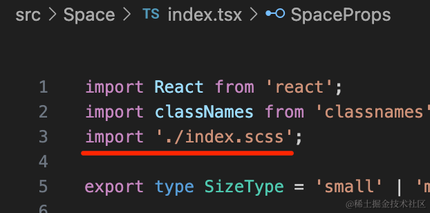

测试下：

```javascript
import './App.css';
import Space from './Space';

export default function App() {
  return <Space direction='vertical' align='end'>
    <div>111</div>
    <div>222</div>
    <div>333</div>
  </Space>
}
```

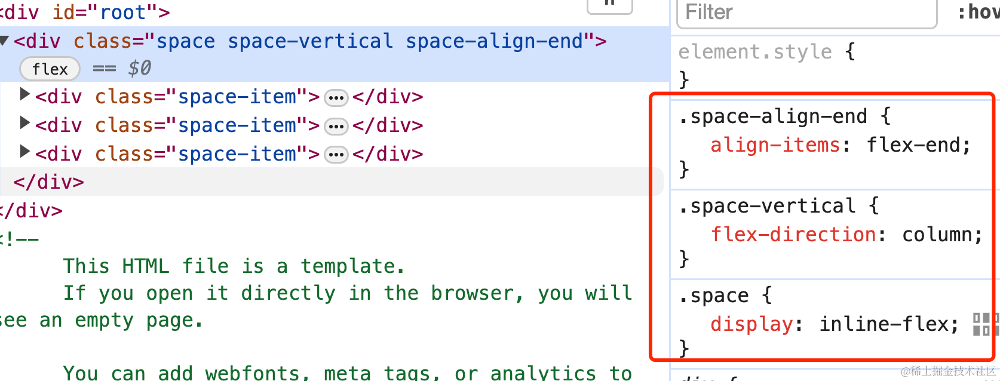

没啥问题。

接下来是根据传入的 size 来计算间距。


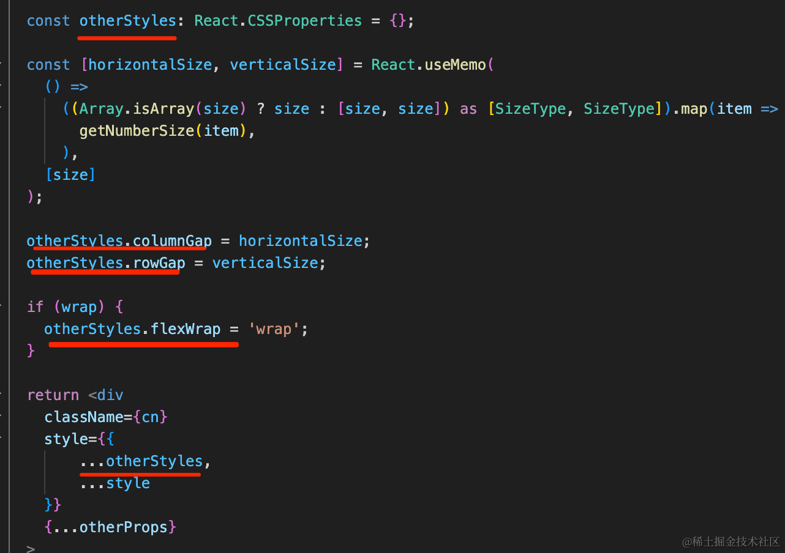

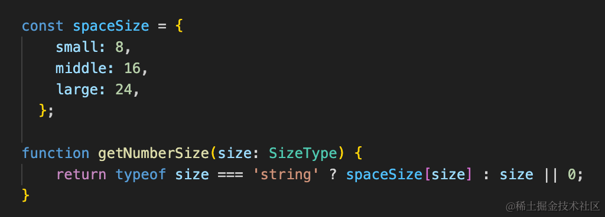

如果 size 不是数组，就要扩展成数组，然后再判断是不是 small、middle、large 这些，是的话就变成具体的值。

最终根据 size 设置 column-gap 和 row-gap 的样式，如果有 wrap 参数，还要设置 flex-wrap。

```javascript
import React from 'react';
import classNames from 'classnames';
import './index.scss';

export type SizeType = 'small' | 'middle' | 'large' | number | undefined;

export interface SpaceProps extends React.HTMLAttributes<HTMLDivElement> {
  className?: string;
  style?: React.CSSProperties;
  size?: SizeType | [SizeType, SizeType];
  direction?: 'horizontal' | 'vertical';
  align?: 'start' | 'end' | 'center' | 'baseline';
  split?: React.ReactNode;
  wrap?: boolean;
}

const spaceSize = {
    small: 8,
    middle: 16,
    large: 24,
  };
  
function getNumberSize(size: SizeType) {
    return typeof size === 'string' ? spaceSize[size] : size || 0;
}

const Space: React.FC<SpaceProps> = props => {

  const {
    className,
    style,
    children,
    size = 'small',
    direction = 'horizontal',
    align,
    split,
    wrap = false,
    ...otherProps
  } = props;

  const childNodes = React.Children.toArray(children);

  const mergedAlign = direction === 'horizontal' && align === undefined ? 'center' : align;
  const cn = classNames(
    'space',
    `space-${direction}`,
    {
      [`space-align-${mergedAlign}`]: mergedAlign,
    },
    className,
  );

  const nodes = childNodes.map((child: any, i) => {

    const key = child && child.key || `space-item-${i}`;

    return <div className='space-item' key={key}>
        {child}
    </div>
  });

  const otherStyles: React.CSSProperties = {};

  const [horizontalSize, verticalSize] = React.useMemo(
    () =>
      ((Array.isArray(size) ? size : [size, size]) as [SizeType, SizeType]).map(item =>
        getNumberSize(item),
      ),
    [size]
  );

  otherStyles.columnGap = horizontalSize;
  otherStyles.rowGap = verticalSize;

  if (wrap) {
    otherStyles.flexWrap = 'wrap';
  }

  return <div
    className={cn}
    style={{
        ...otherStyles,
        ...style
    }}
    {...otherProps}
  >
    {nodes}
  </div>
};

export default Space;
```
测试下：

```javascript
import './App.css';
import Space from './Space';

export default function App() {
  return <Space
    className='container' 
    direction="horizontal"
    align="end" 
    wrap={true}
    size={['large', 'small']}
  >
    <div className="box"></div>
    <div className="box"></div>
    <div className="box"></div>
  </Space>
}
```
```css
.box {
  width: 100px;
  height: 100px;
  background: pink;
  border: 1px solid #000;
}

.container {
  width: 300px;
  height: 300px;
  background: green;
}
```
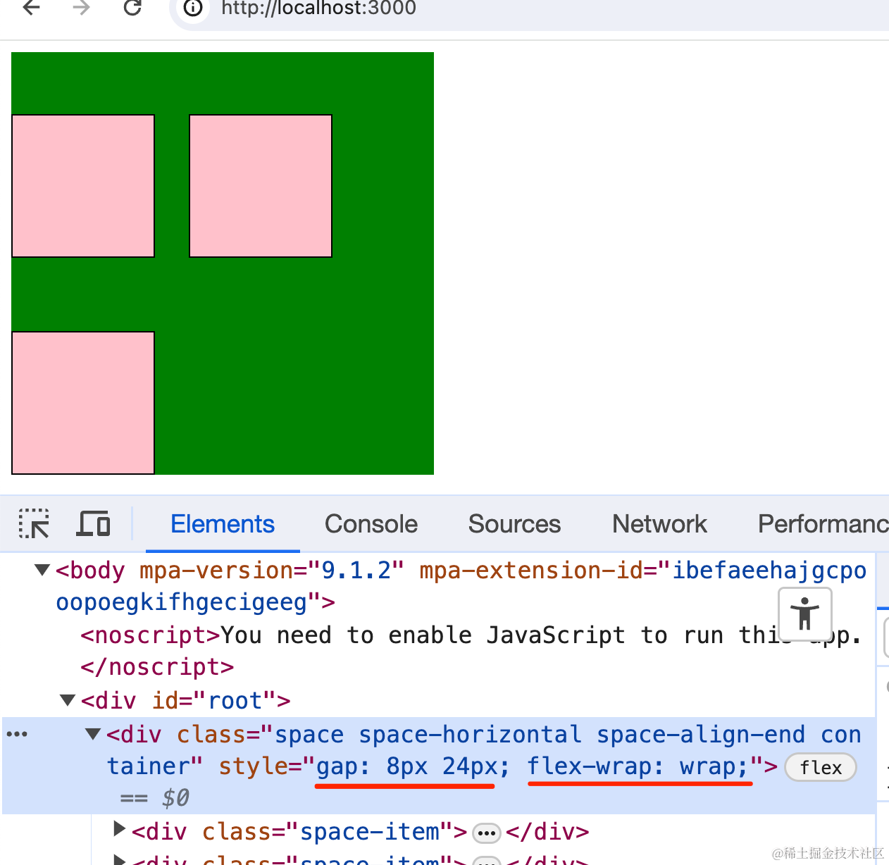

可以看到，gap、flex-wrap 的设置都是对的。

接下来，处理下 split 参数：

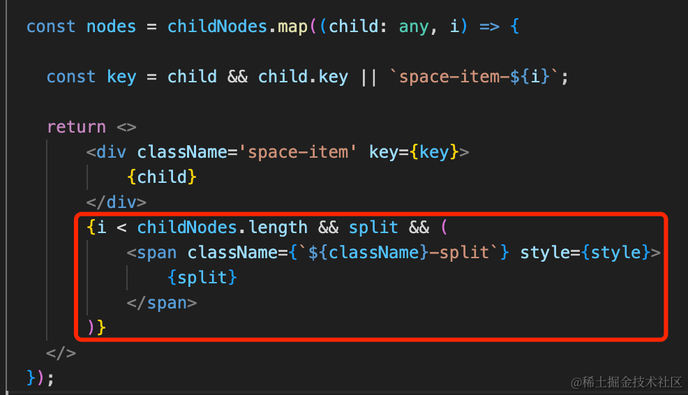

```javascript
const nodes = childNodes.map((child: any, i) => {

    const key = child && child.key || `space-item-${i}`;

    return <>
        <div className='space-item' key={key}>
            {child}
        </div>
        {i < childNodes.length && split && (
            <span className={`${className}-split`} style={style}>
                {split}
            </span>
        )}
    </>
});
```

此外，这个组件还会从 ConfigProvider 中取值：

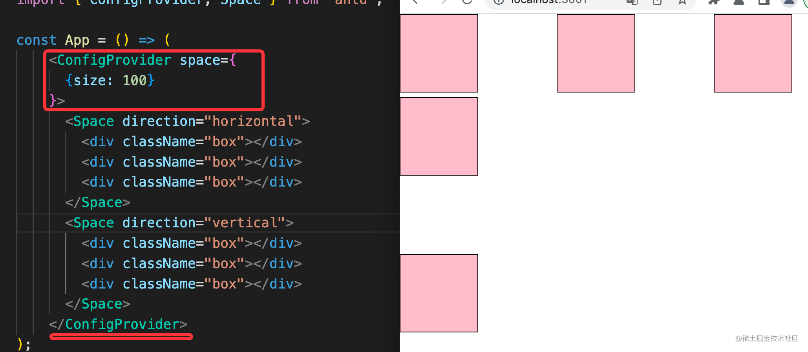

前面测试过，当有 ConfigProvider 包裹的时候，就不用单独设置 size 了，会直接用那里的配置。

这个很明显是用 context 实现的。

创建 Space/ConfigProvider.tsx

```javascript
import React, { PropsWithChildren } from "react";
import { SizeType } from ".";

export interface ConfigContextType {
  space?: {
    size?: SizeType
  }
}
export const ConfigContext = React.createContext<ConfigContextType>({});
```

在 Space 组件里用 useContext 读取它：


这样，size 默认值会优先用 context 里的值。

```javascript
const { space } = React.useContext(ConfigContext);

const {
    className,
    style,
    children,
    size = space?.size || 'small',
    direction = 'horizontal',
    align,
    split,
    wrap = false,
    ...otherProps
} = props;
```

至此，这个组件我们就完成了。

测试下：

```javascript
import './App.css';
import Space from './Space';
import { ConfigContext } from './Space/ConfigProvider';

export default function App() {
  return <div>
    <ConfigContext.Provider value={{ space: { size: 20 }}}>
      <Space direction="horizontal">
        <div className="box"></div>
        <div className="box"></div>
        <div className="box"></div>
      </Space>
      <Space direction="vertical">
        <div className="box"></div>
        <div className="box"></div>
        <div className="box"></div>
      </Space>
    </ConfigContext.Provider>
  </div>
}
```

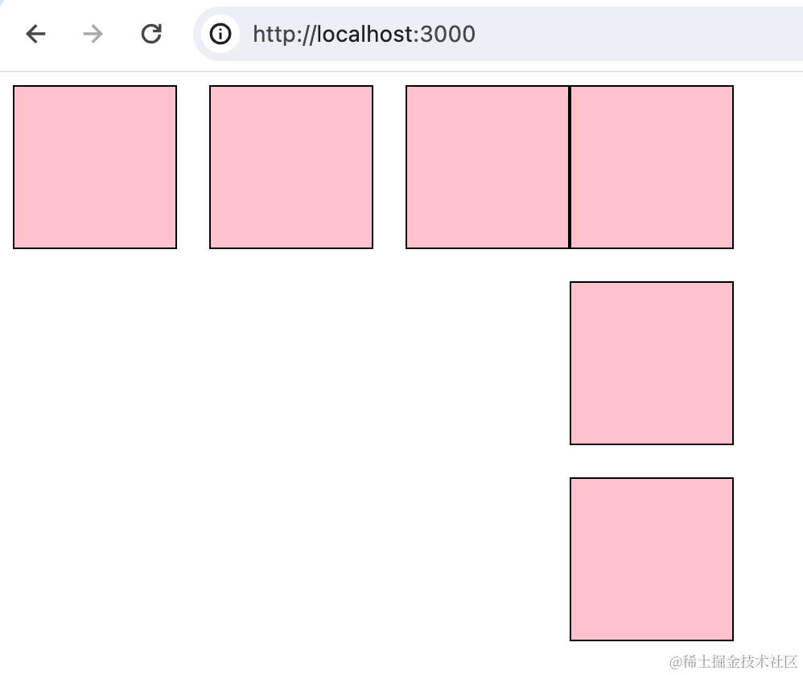

没啥问题。

不过这个 ConfigProvider 和 antd 的还是不大一样。

antd 的是这样的：

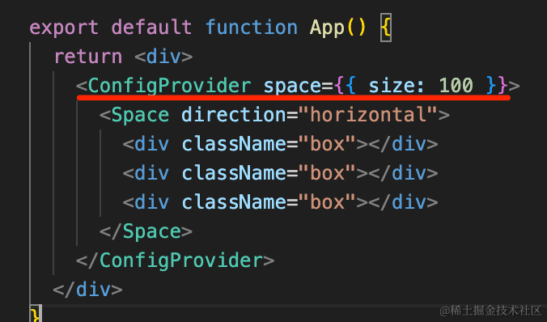

我们的是这样的：

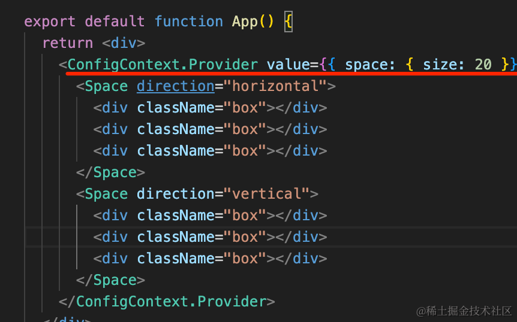

很明显需要再包一层：

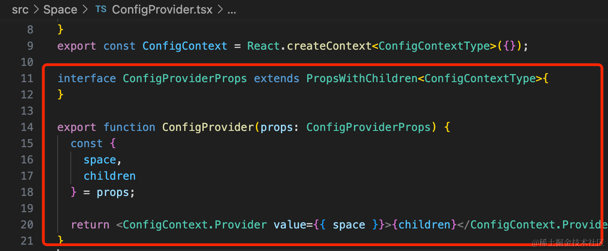

```javascript
interface ConfigProviderProps extends PropsWithChildren<ConfigContextType>{
}

export function ConfigProvider(props: ConfigProviderProps) {
  const {
    space,
    children
  } = props;

  return <ConfigContext.Provider value={{ space }}>{children}</ConfigContext.Provider>
}
```

这样就一样了：

```javascript
import './App.css';
import Space from './Space';
import { ConfigProvider } from './Space/ConfigProvider';

export default function App() {
  return <div>
    <ConfigProvider space={{ size: 20 }}>
      <Space direction="horizontal">
        <div className="box"></div>
        <div className="box"></div>
        <div className="box"></div>
      </Space>
      <Space direction="vertical">
        <div className="box"></div>
        <div className="box"></div>
        <div className="box"></div>
      </Space>
    </ConfigProvider>
  </div>
}
```
案例代码上传了[小册仓库](https://github.com/QuarkGluonPlasma/react-course-code/tree/main/space-component)。

## 总结

我们自己实现了 antd 的 Space 组件。

这是一个布局组件，可以通过参数设置水平和竖直间距、对齐方式、换行等。

我们用到了 React.children 的 api 来修改 children，然后根据 props 来确定 className，然后还有 context 的读取。

这个组件并不复杂，但这种把布局抽离成组件来复用的方式还是很值得学习的。
