# 第15章—React.Children和它的两种替代方案

JSX 的标签体部分会通过 children 的 props 传给组件：

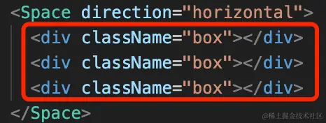

在组件里取出 props.children 渲染：

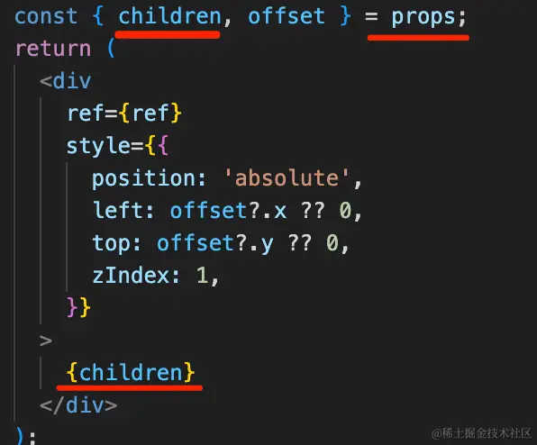

但有的时候，我们要对 children 做一些修改。

比如 Space 组件，传入的是 3 个 .box 的 div：


但渲染出来的 .box 外面包了一层：

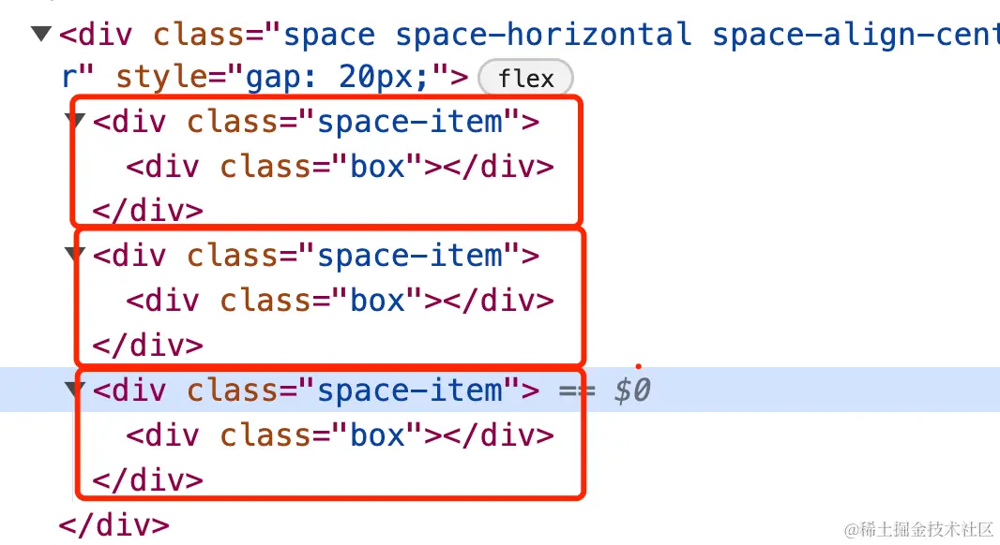

这种就需要用 React.Children 的 api 实现。

有这些 api：

- Children.count(children)
- Children.forEach(children, fn, thisArg?)
- Children.map(children, fn, thisArg?)
- Children.only(children)
- Children.toArray(children)

我们来试一下。

用 cra 创建个 react 项目：

```shell
npx create-react-app --template=typescript children-test
```
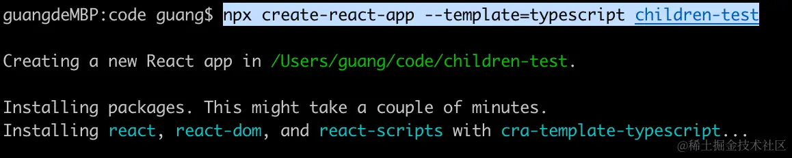

进入项目，改下 index.tsx

```javascript
import ReactDOM from 'react-dom/client';
import App from './App';

const root = ReactDOM.createRoot(
  document.getElementById('root') as HTMLElement
);
root.render(<App />);
```
然后在 App.tsx 里测试下 Children 的 api：

```javascript
import React, { FC } from 'react';

interface AaaProps {
  children: React.ReactNode
}

const Aaa: FC<AaaProps> = (props) => {
  const { children } = props;

  return <div className='container'>
    {
      React.Children.map(children, (item) => {
        return <div className='item'>{item}</div>
      })
    }
  </div>
}

function App() {
  return <Aaa>
    <a href="#">111</a>
    <a href="#">222</a>
    <a href="#">333</a>
  </Aaa>
}

export default App;
```
在传入的 children 外包了一层 .item 的 div。

跑一下：

```shell
npm run start
```
可以看到，渲染出的 children 是修改后的：

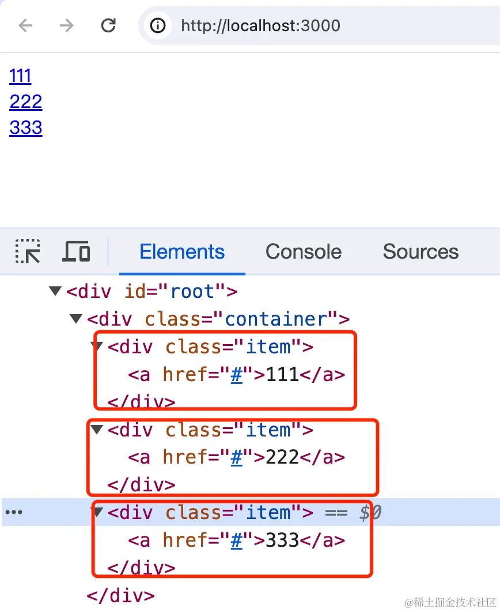

有的同学说，直接用数组的 api 可以么？

我们试试：

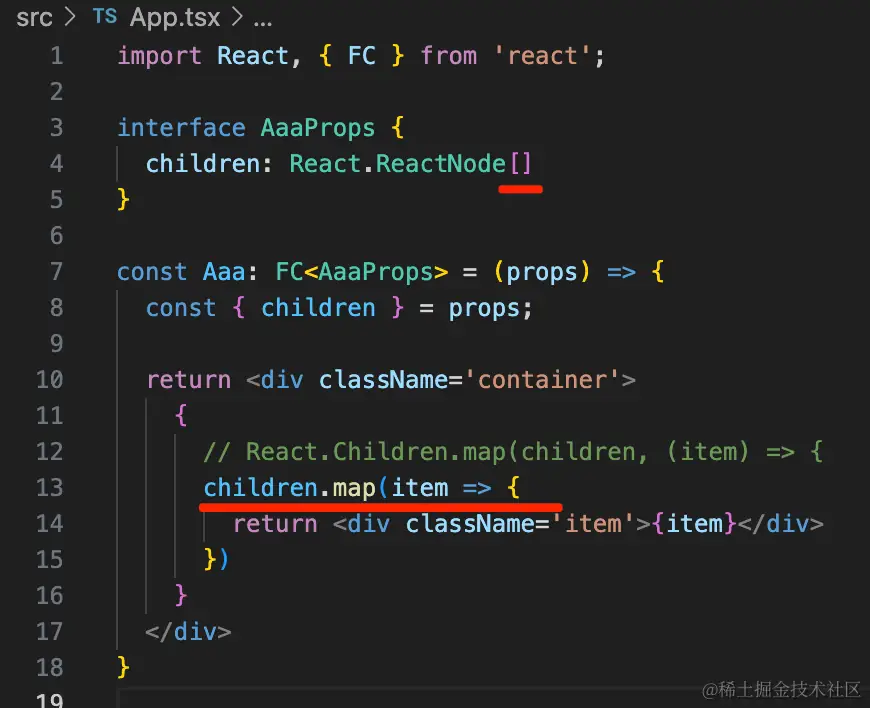

```javascript
interface AaaProps {
  children: React.ReactNode[]
}

const Aaa: FC<AaaProps> = (props) => {
  const { children } = props;

  return <div className='container'>
    {
      // React.Children.map(children, (item) => {
      children.map(item => {
        return <div className='item'>{item}</div>
      })
    }
  </div>
}
```
要用数组的 api 需要把 children 类型声明为 ReactNode[]，然后再用数组的 map 方法：


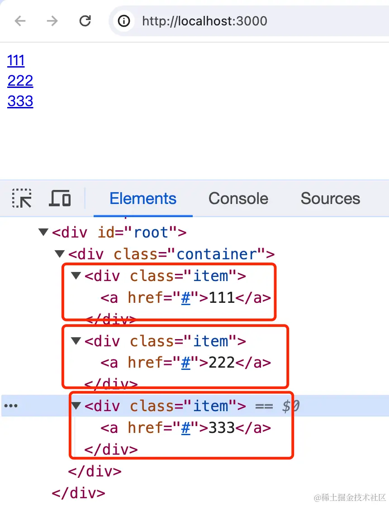

看起来结果貌似一样？

其实并不是。

首先，因为要用数组方法，所以声明了 children 为 ReactNode[]，这就导致了如果 children 只有一个元素会报错：

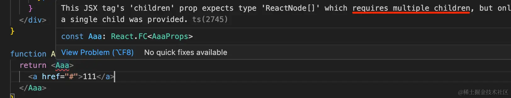

更重要的是当 children 传数组的时候：

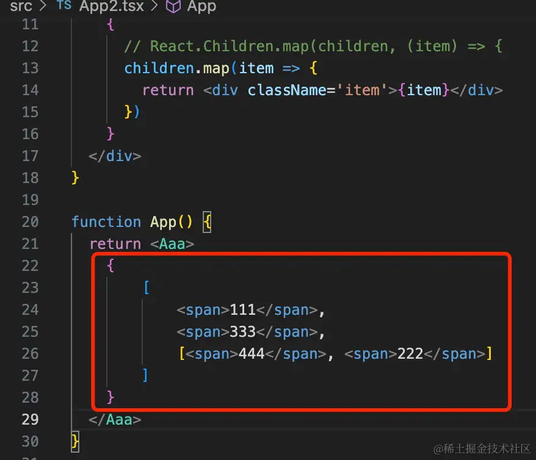

```javascript
function App() {
  return <Aaa>
    {
        [
            <span>111</span>,
            <span>333</span>,
            [<span>444</span>, <span>222</span>]
        ]
    }
  </Aaa>
}
```
数组的 map 处理后是这样的：

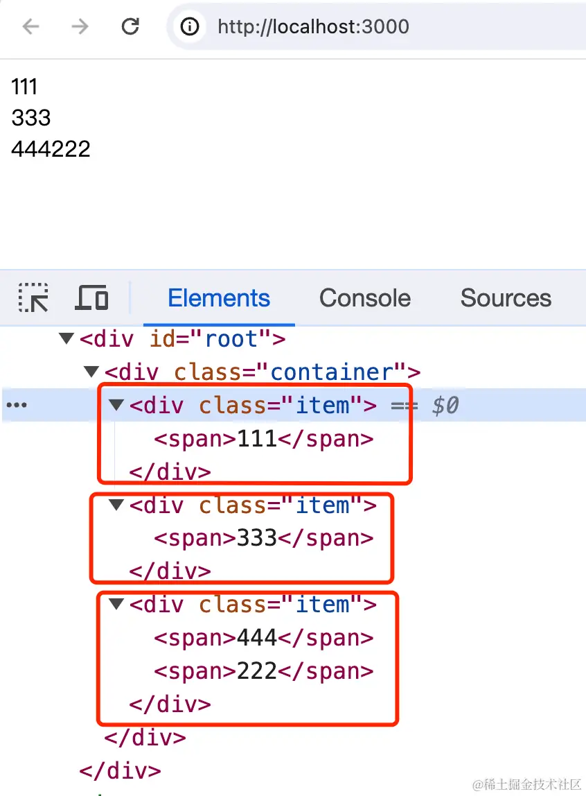

换成 React.Children.map 是这样的：

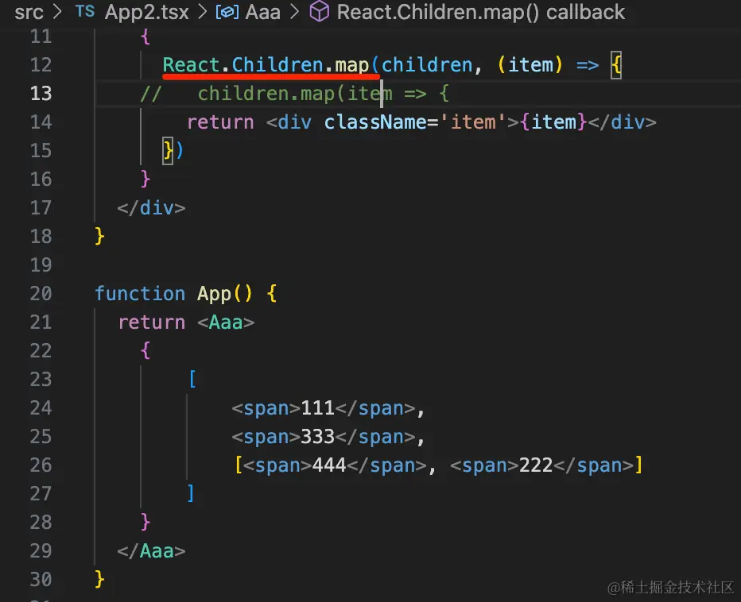

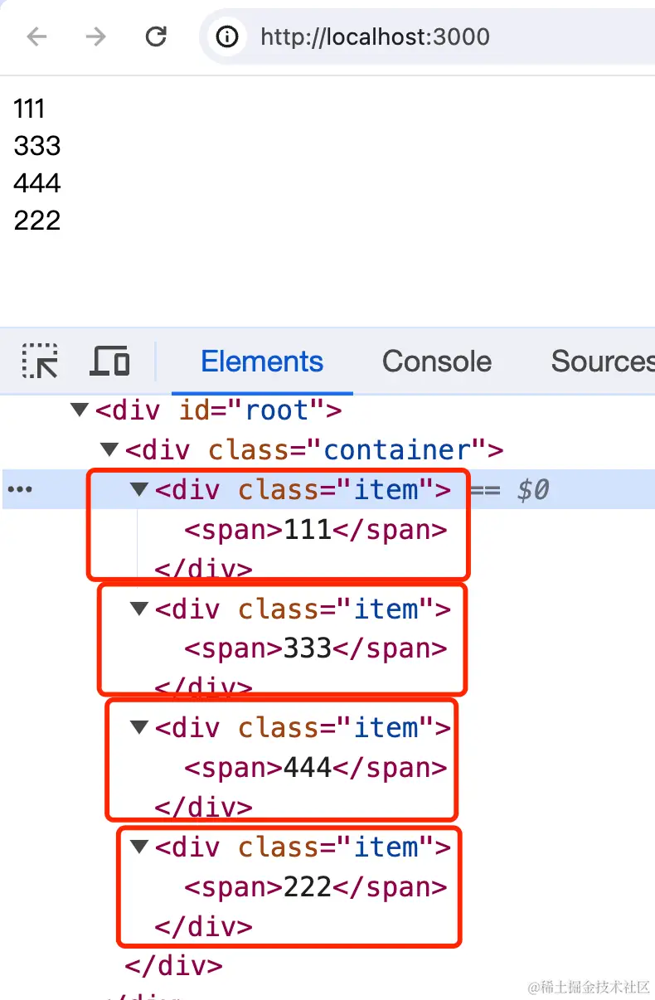

React.Children.map 会把 children 拍平，而数组的方法不会。

还有一点，有时候直接调用数组的 sort 方法会报错：

```javascript
import React, { FC } from 'react';

interface AaaProps {
  children: React.ReactNode[]
}

const Aaa: FC<AaaProps> = (props) => {
  const { children } = props;

  console.log(children.sort());

  return <div className='container'>
  </div>
}

function App() {
  return <Aaa>
    {33}
    <span>hello world</span>
    {22}
    {11}
  </Aaa>
}

export default App;

```

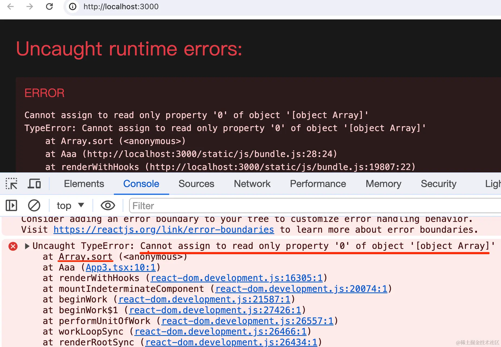

因为 props.children 的元素是只读的，不能重新赋值，所以也就不能排序。

这时候只要用 React.Children.toArray 转成数组就好了：

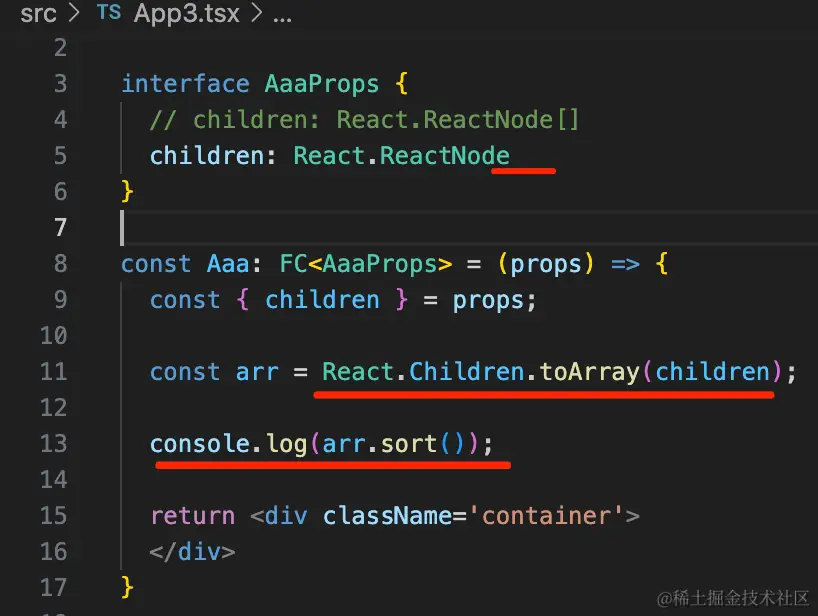

（这里不用 children 数组方法了，就直接声明为 ReactNode 类型了）

```javascript
interface AaaProps {
  children: React.ReactNode
}

const Aaa: FC<AaaProps> = (props) => {
  const { children } = props;

  const arr = React.Children.toArray(children);
  
  console.log(arr.sort());

  return <div className='container'>
  </div>
}
```

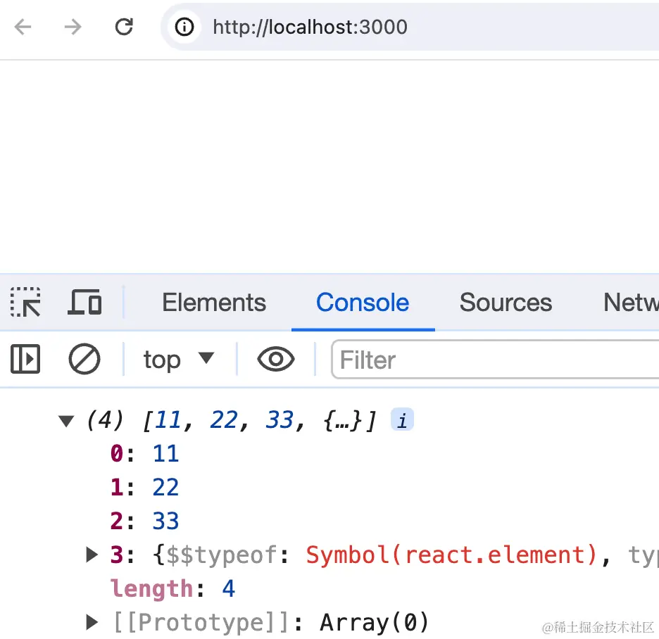

综上，直接用数组方法操作 children 有 3 个问题：

- 用数组的方法需要声明 children 为 ReactNode[] 类型，这样就必须传入多个元素才行，而 React.Children 不用
- 用数组的方法不会对 children 做拍平，而 React.Children 会
- 用数组的方法不能做排序，因为 children 的元素是只读的，而用 React.Children.toArray 转成数组就可以了

当然，不用记这些区别，只要操作 children，就用 React.Children 的 api 就行了。

然后再试下其它 React.Children 的 api：

```javascript
import React, { FC, useEffect } from 'react';

interface AaaProps {
  children: React.ReactNode
}

const Aaa: FC<AaaProps> = (props) => {
  const { children } = props;

  useEffect(() => {
    const count = React.Children.count(children);
  
    console.log('count', count);
    
    React.Children.forEach(children, (item, index) => {
      console.log('item' + index, item);
    });
  
    const first = React.Children.only(children);
    console.log('first', first);
  }, []);

  return <div className='container'>
  </div>
}

function App() {
  return <Aaa>
    {33}
    <span>hello world</span>
    {22}
    {11}
  </Aaa>
}

export default App;
```

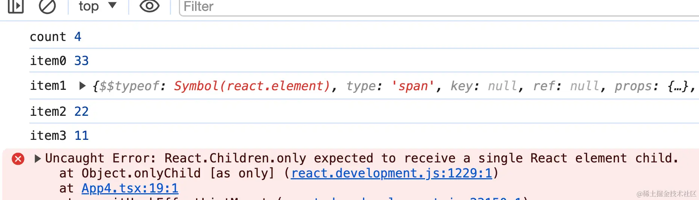

React.Children.count 是计数，forEach 是遍历、only 是如果 children 不是一个元素就报错。

这些 api 都挺简单的。

有的同学可能会注意到，Children 的 api 也被放到了 Legacy 目录下，并提示用 Children 的 api 会导致代码脆弱，建议用别的方式替代：

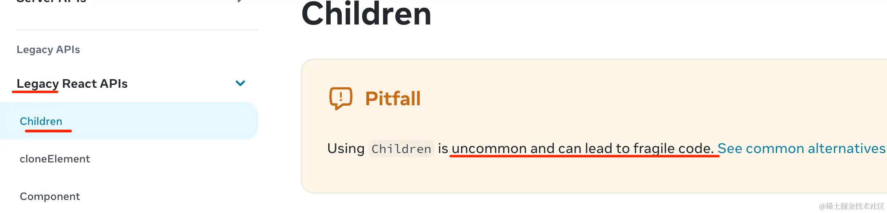

我们先看看这些替代方式：

首先，我们用 React.Children 来实现这样的功能：

```javascript
import React, { FC } from 'react';

interface RowListProps {
  children?: React.ReactNode
}

const RowList: FC<RowListProps> = (props) => {
  const { children } = props;

  return <div className='row-list'>
    {
      React.Children.map(children, item => {
        return <div className='row'>
          {item}
        </div>
      })
    }
  </div>
}

function App() {
  return <RowList>
    <div>111</div>
    <div>222</div>
    <div>333</div>
  </RowList>
}

export default App;
```
对传入的 children 做了一些修改之后渲染。

结果如下：

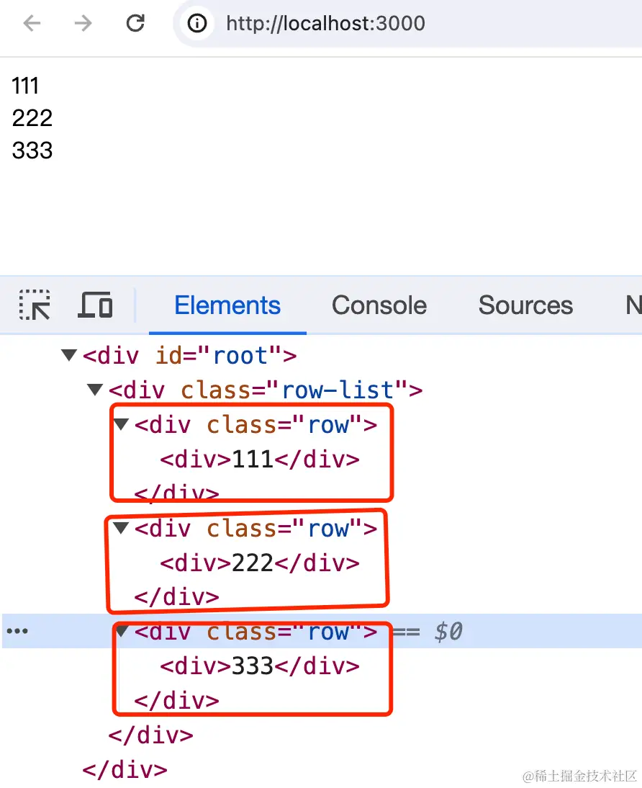

第一种替代方案是这样的：

```javascript
import React, { FC } from 'react';

interface RowProps{
  children?: React.ReactNode
}

const Row: FC<RowProps> = (props) => {
  const { children } = props;
  return <div className='row'>
    {children}
  </div>
}

interface RowListProps{
  children?: React.ReactNode
}

const RowList: FC<RowListProps> = (props) => {
  const { children } = props;

  return <div className='row-list'>
    {children}
  </div>
}

function App() {
  return <RowList>
    <Row>
      <div>111</div>
    </Row>
    <Row>
      <div>222</div>
    </Row>
    <Row>
      <div>333</div>
    </Row>
  </RowList>
}

export default App;
```
就是把对 children 包装的那一层封装个组件，然后外面自己来包装。

跑一下：

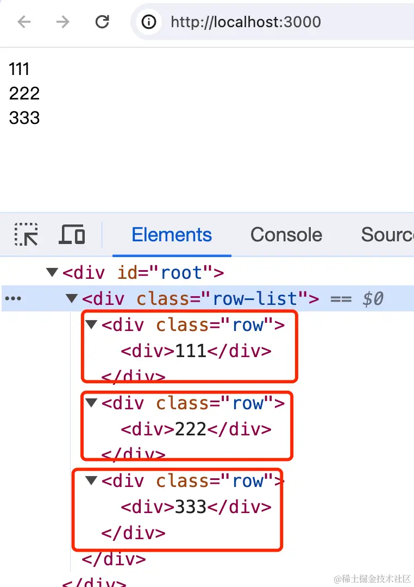

这样是可以的。

当然，这里的 RowListProps 和 RowProps 都是只有 children，我们直接用内置类型 PropsWithChildren 来简化下：

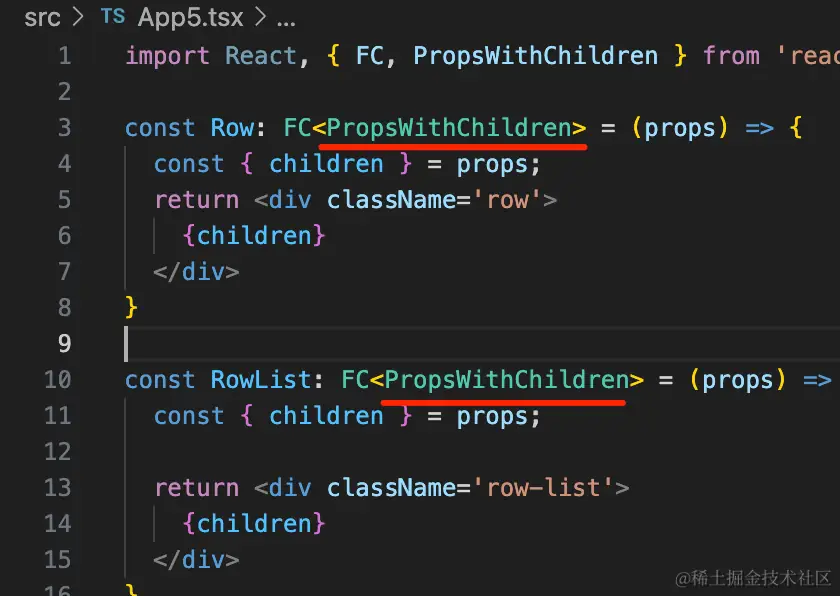

```javascript
import React, { FC, PropsWithChildren } from 'react';

const Row: FC<PropsWithChildren> = (props) => {
  const { children } = props;
  return <div className='row'>
    {children}
  </div>
}

const RowList: FC<PropsWithChildren> = (props) => {
  const { children } = props;

  return <div className='row-list'>
    {children}
  </div>
}

function App() {
  return <RowList>
    <Row>
      <div>111</div>
    </Row>
    <Row>
      <div>222</div>
    </Row>
    <Row>
      <div>333</div>
    </Row>
  </RowList>
}

export default App;
```

第二种方案不使用 chilren 传入具体内容，而是自己定义一个 prop：

```javascript
import { FC, PropsWithChildren, ReactNode } from 'react';

interface RowListProps extends PropsWithChildren {
  items: Array<{
    id: number,
    content: ReactNode
  }>
}

const RowList: FC<RowListProps> = (props) => {
  const { items } = props;

  return <div className='row-list'>
      {
        items.map(item => {
          return  <div className='row' key={item.id}>{item.content}</div>
        })
      }
  </div>
}

function App() {
  return <RowList items={[
    {
      id: 1,
      content: <div>111</div>
    },
    {
      id: 2,
      content: <div>222</div>
    },
    {
      id: 3,
      content: <div>333</div>
    }
  ]}>
  </RowList>
}

export default App;

```
我们声明了 items 的 props，通过其中的 content 来传入内容。

效果是一样的：

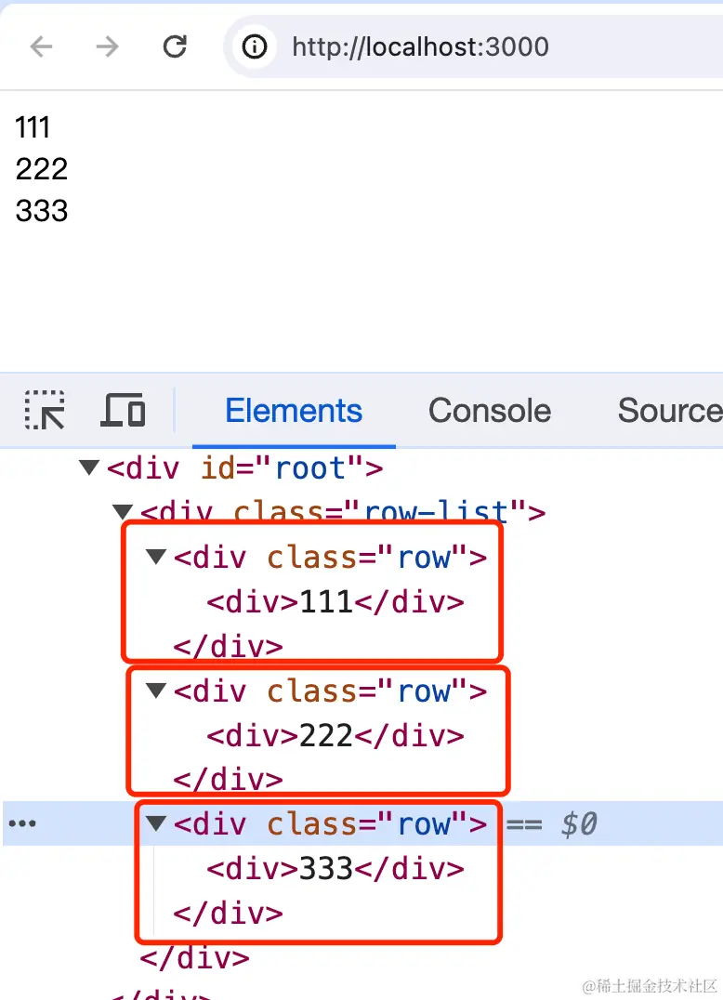

而且还可以通过 render props 来定制渲染逻辑：

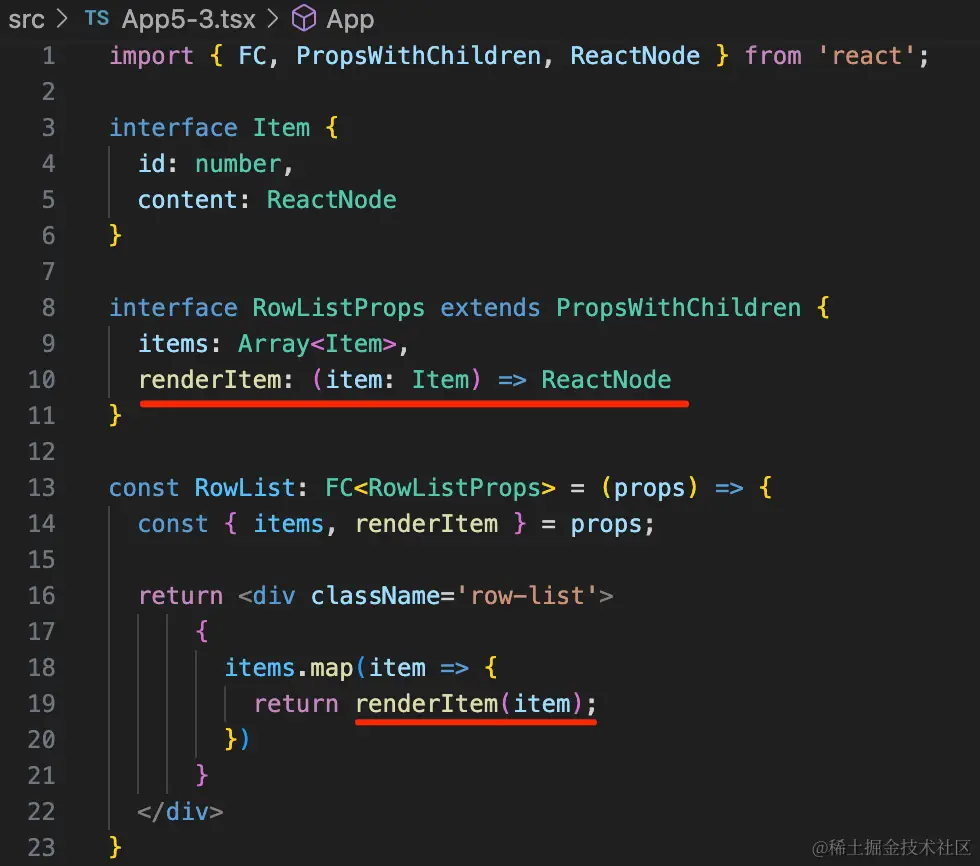

```javascript
import { FC, PropsWithChildren, ReactNode } from 'react';

interface Item {
  id: number,
  content: ReactNode
}

interface RowListProps extends PropsWithChildren {
  items: Array<Item>,
  renderItem: (item: Item) => ReactNode
}

const RowList: FC<RowListProps> = (props) => {
  const { items, renderItem } = props;

  return <div className='row-list'>
      {
        items.map(item => {
          return renderItem(item);
        })
      }
  </div>
}

function App() {
  return <RowList items={[
    {
      id: 1,
      content: <div>111</div>
    },
    {
      id: 2,
      content: <div>222</div>
    },
    {
      id: 3,
      content: <div>333</div>
    }
  ]}
  renderItem={(item) => {
    return <div className='row' key={item.id}>
      <div className='box'>
          {item.content}
      </div>
    </div>
  }}
  >
  </RowList>
}

export default App;
```
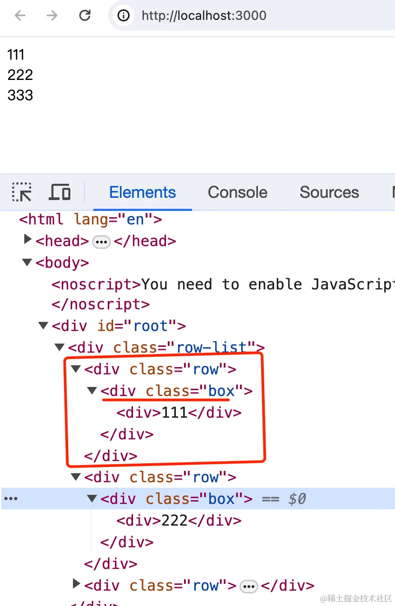

综上，替代 props.children 有两种方案：

- 把对 children 的修改封装成一个组件，使用者用它来手动包装 
- 声明一个 props 来接受数据，内部基于它来渲染，而且还可以传入 render props 让使用者定制渲染逻辑

但是这些替代方案使用起来和 React.Children 还是不同的。

React.Children 使用起来是无感的：

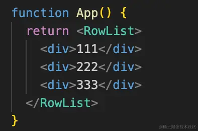

而这两种替代方案使用起来是这样的：

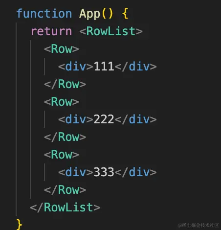

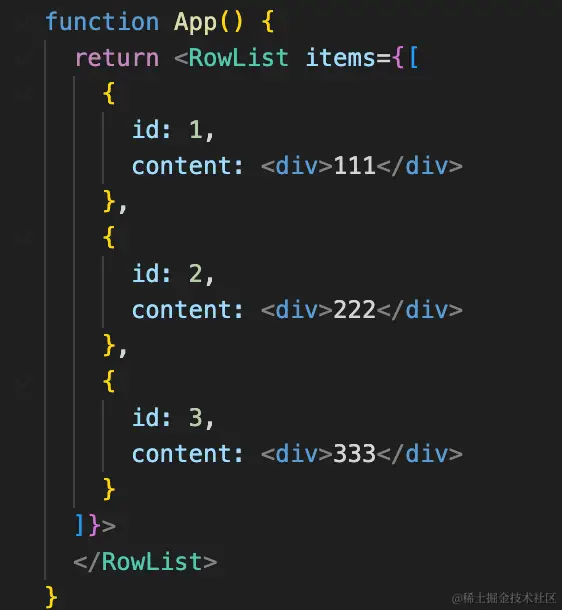


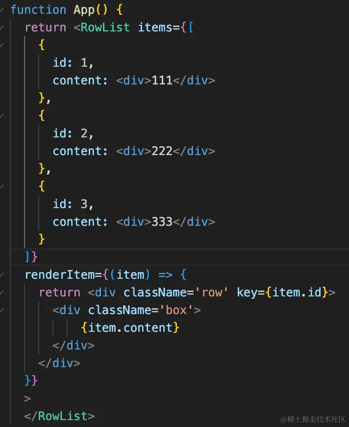

虽然能达到同样的效果，但是还是用 React.Children 内部修改 children 的方式更易用一些。

而且现在各大组件库依然都在大量用 React.Children

比如 semi design 的代码：

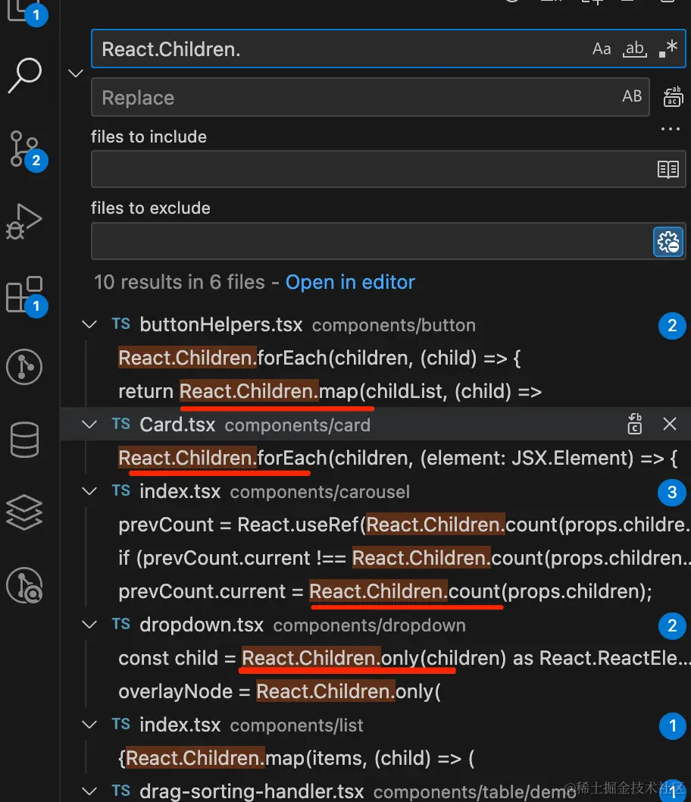

arco design 的代码：

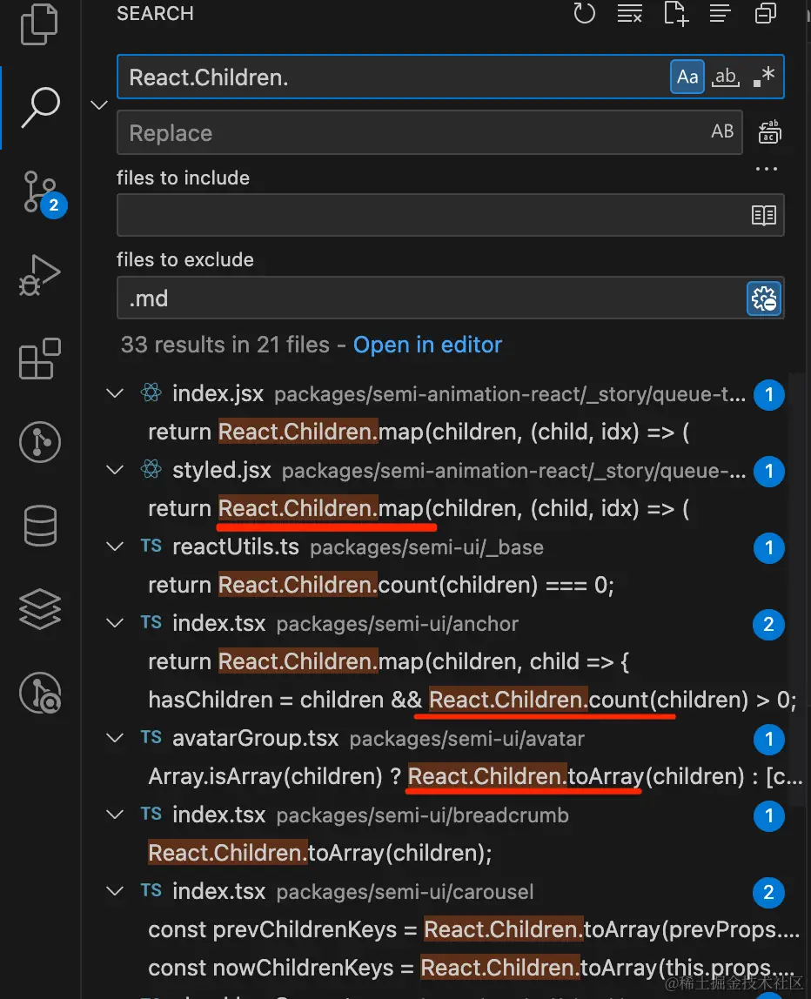

ant design 的代码：

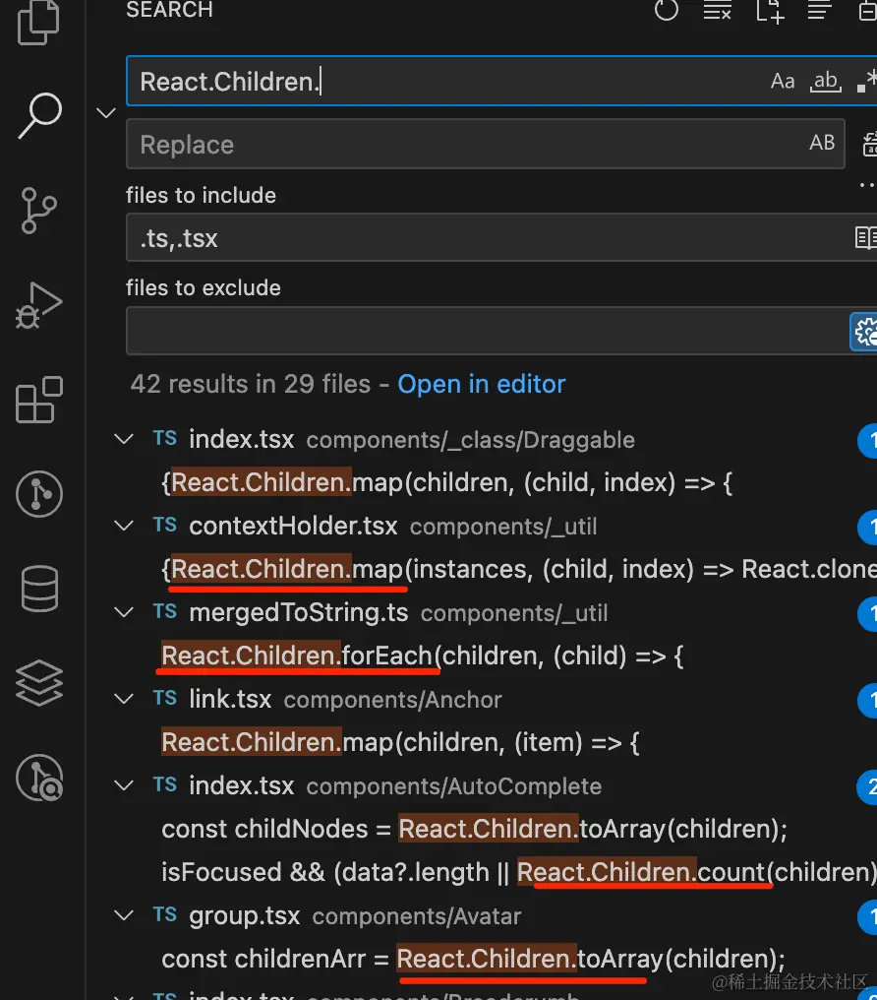

比如我们上节写过的 Space 组件：

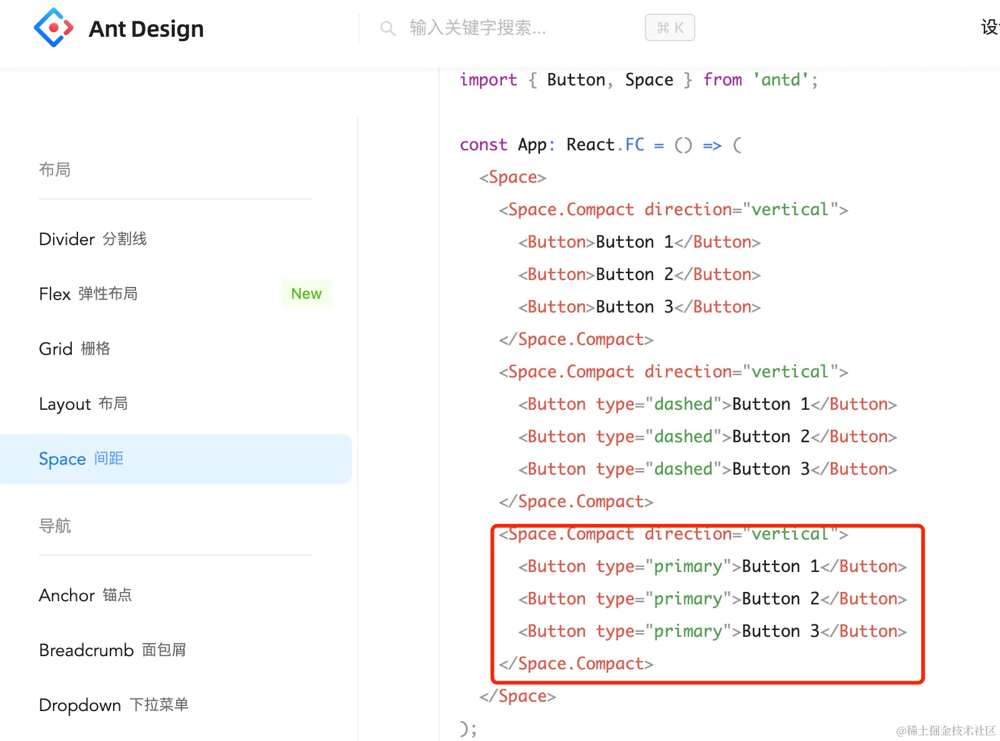

所以 React.Children 还是可以继续用的，因为这些替代方案和 React.Children 还是有差距。

案例代码上传了[小册仓库](https://github.com/QuarkGluonPlasma/react-course-code/tree/main/children-test)。
## 总结

我们学了用 React.Children 来修改 children，它有 map、forEach、toArray、only、count 等方法。

不建议直接用数组方法来操作，而是用 React.Children 的 api。

原因有三个：

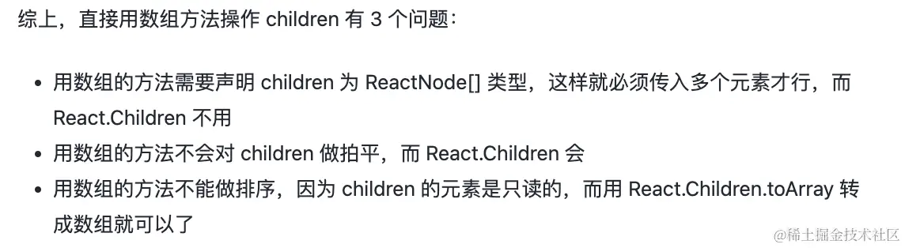

当然，Children 的 api 被放到了 legacy 目录，可以用这两种方案来替代：


不过，这两种替代方案易用性都不如 React.Children，各大组件库也依然大量使用 React.Children 的 api。

所以，遇到需要修改渲染的 children 的情况，用 React.Children  的 api，或是两种替代方案（抽离渲染逻辑为单独组件、传入数据 + render props）都可以。
