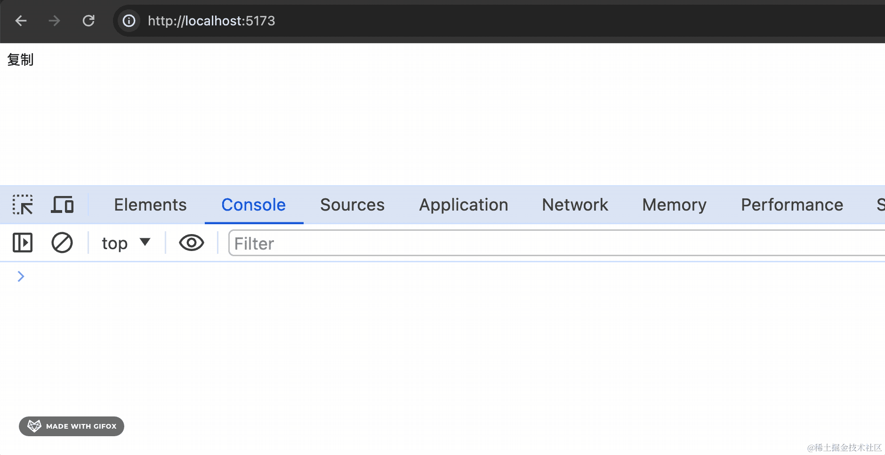

# 第16章—三个简单组件的封装

最近遇到一些组件，它们只是对 api 的一层简易封装，用起来也和直接用 api 差不多。

但是这种组件的下载量还是挺多的。


今天我们一起来写三个这样的组件，大家来感受下和直接用 api 的区别。

## Portal

react 提供了 createPortal 的 api，可以把组件渲染到某个 dom 下。

用起来也很简单：

```javascript
import { createPortal } from 'react-dom'

function App() {
  const content = <div className="btn">
    <button>按钮</button>
  </div>;

  return createPortal(content, document.body);
}

export default App;
```


但我们也可以把它封装成 Portal 组件来用。

接收 attach、children 参数，attach 就是挂载到的 dom 节点，默认是 document.body


然后提供一个 getAttach 方法，如果传入的是 string，就作为选择器来找到对应的 dom，如果是 HTMLElement，则直接作为挂载节点，否则，返回 document.body：


然后在 attach 的元素下添加一个 dom 节点作为容器：


当组件销毁时，删除这个容器 dom。

最后，用 createPortal 把 children 渲染到 container 节点下。

此外，通过 forwardRef + useImperativeHandle 把容器 dom 返回：


```javascript
import { forwardRef, useEffect, useMemo, useImperativeHandle } from 'react';
import { createPortal } from 'react-dom';

export interface PortalProps {
    attach?: HTMLElement | string;
    children: React.ReactNode;
}

const Portal = forwardRef((props: PortalProps, ref) => {
  const { 
    attach = document.body, 
    children 
  } = props;

  const container = useMemo(() => {
    const el = document.createElement('div');
    el.className = `portal-wrapper`;
    return el;
  }, []);

  useEffect(() => {
    const parentElement = getAttach(attach);
    parentElement?.appendChild?.(container);

    return () => {
      parentElement?.removeChild?.(container);
    };
  }, [container, attach]);

  useImperativeHandle(ref, () => container);

  return createPortal(children, container);
});

export default Portal;

export function getAttach(attach: PortalProps['attach']) {
    if (typeof attach === 'string') {
        return document.querySelector(attach);
    }
    if (typeof attach === 'object' && attach instanceof window.HTMLElement) {
        return attach;
    }

    return document.body;
}
```

这个 Portal 组件用起来是这样的：

```javascript
import Portal from './portal';

function App() {
  const content = <div className="btn">
    <button>按钮</button>
  </div>;

  return <Portal attach={document.body}>
    {content}
  </Portal>
}

export default App;
```
还可以通过 ref 获取内部的容器 dom：

```javascript
import { useEffect, useRef } from 'react';
import Portal from './portal';

function App() {
  const containerRef = useRef<HTMLElement>(null);

  const content = <div className="btn">
    <button>按钮</button>
  </div>;

  useEffect(()=> {
    console.log(containerRef);
  }, []);

  return <Portal attach={document.body} ref={containerRef}>
    {content}
  </Portal>
}

export default App;
```
看下效果：


这个 Portal 组件是对 createPortal 的简单封装。

内部封装了选择 attach 节点的逻辑，还会创建容器 dom 并通过 ref 返回。

还是有一些封装的价值。

再来看一个：

## MutateObserver

浏览器提供了 MutationObserver 的 api，可以监听 dom 的变化，包括子节点的变化、属性的变化。


这样用：

```javascript
import { useEffect, useRef, useState } from 'react';

export default function App() {
  const [ className, setClassName] = useState('aaa');

  useEffect(() => {
    setTimeout(() => setClassName('bbb'), 2000);
  }, []);

  const containerRef = useRef(null);

  useEffect(() => {
    const targetNode = containerRef.current!;
  
    const callback = function (mutationsList: MutationRecord[]) {
      console.log(mutationsList);
    };
    
    const observer = new MutationObserver(callback);
    
    observer.observe(targetNode, { 
      attributes: true, 
      childList: true, 
      subtree: true 
    });

  }, []);

  return (
    <div>
        <div id="container" ref={containerRef}>
          <div className={className}>
            {
              className === 'aaa' ? <div>aaa</div> : <div>
                <p>bbb</p>
              </div>
            }
          </div>
        </div>
    </div>
  )
}
```
声明一个 className 的状态，从 aaa 切换到 bbb，渲染的内容也会改变。

用 useRef 获取到 container 的 dom 节点，然后用 MutationObserver 监听它的变化。


可以看到，2s 后 dom 发生改变，MutationObserver 监听到了它子节点的变化，属性的变化。


observe 的时候可以指定 options。

attributes 是监听属性变化，childList 是监听 children 变化，subtree 是连带子节点的属性、children 变化也监听。

attributeFilter 可以指定监听哪些属性的变化。


这个 api 用起来也不麻烦，但可以封装成自定义 hooks 或者组件。

ahooks 里就有这个 hook：


而 antd 里更是把它封装成了组件：


这样用：


我们也来写一下：

首先封装 useMutateObserver 的 hook：

```javascript
import { useEffect } from "react";

const defaultOptions: MutationObserverInit = {
  subtree: true,
  childList: true,
  attributeFilter: ['style', 'class'],
};

export default function useMutateObserver(
  nodeOrList: HTMLElement | HTMLElement[],
  callback: MutationCallback,
  options: MutationObserverInit = defaultOptions,
) {
  useEffect(() => {
    if (!nodeOrList) {
      return;
    }

    let instance: MutationObserver;

    const nodeList = Array.isArray(nodeOrList) ? nodeOrList : [nodeOrList];

    if ('MutationObserver' in window) {
      instance = new MutationObserver(callback);

      nodeList.forEach(element => {
        instance.observe(element, options);
      });
    }
    return () => {
      instance?.takeRecords();
      instance?.disconnect();
    };
  }, [options, nodeOrList]);
}
```
支持单个节点，多个节点的 observe。

设置了默认的 options。

在销毁的时候，调用 takeRecords 删掉所有剩余通知，调用 disconnect 停止接收新的通知：


然后封装 MutateObserver 组件：

```javascript
import React, { useLayoutEffect } from 'react';
import useMutateObserver from './useMutateObserver';

interface MutationObserverProps{
  options?: MutationObserverInit;
  onMutate?: (mutations: MutationRecord[], observer: MutationObserver) => void;
  children: React.ReactElement;
}

const MutateObserver: React.FC<MutationObserverProps> = props => {
  const { 
    options, 
    onMutate = () => {},
    children, 
  } = props;

  const elementRef = React.useRef<HTMLElement>(null);

  const [target, setTarget] = React.useState<HTMLElement>();

  useMutateObserver(target!, onMutate, options);

  useLayoutEffect(() => {
    setTarget(elementRef.current!);
  }, []);

  if (!children) {
    return null;
  }

  return React.cloneElement(children, { ref: elementRef });
}

export default MutateObserver;
```

useMutateObserver 的 hook 封装了 MutationObserver 的调用。

而 MutateObserver 组件封装了 ref 的获取。


通过 React.cloneElement 给 children 加上 ref 来获取 dom 节点。

然后在 useLayoutEffect 里拿到 ref 通过 setState 触发更新。

再次渲染的时候，调用 useMutateObserver 就有 dom 了，可以用 MutationObserver 来监听 dom 变化。

用一下：

```javascript
import { useEffect, useState } from 'react';
import MutateObserver from './MutateObserver';

export default function App() {
  const [ className, setClassName] = useState('aaa');

  useEffect(() => {
    setTimeout(() => setClassName('bbb'), 2000);
  }, []);

  const callback = function (mutationsList: MutationRecord[]) {
    console.log(mutationsList);
  };

  return (
    <div>
        <MutateObserver onMutate={callback}>
          <div id="container">
            <div className={className}>
              {
                className === 'aaa' ? <div>aaa</div> : <div>
                  <p>bbb</p>
                </div>
              }
            </div>
          </div>
        </MutateObserver>
    </div>
  )
}
```
效果一样：


但是现在不用再 useRef 获取 ref 了，MutateObserver 里会做 ref 的获取，然后用 useMutateObserver 来监听。

这个组件和 hook 的封装都算是有用的。

再来看一个

## CopyToClipboard

有这样一个周下载量百万级的组件：


它是做复制的。

基于 copy-to-clipboard 这个包。

我们也来写写看。

直接用 copy-to-clipboard 是这样的：

```javascript
import copy from 'copy-to-clipboard';

export default function App() {

  function onClick() {
    const res = copy('神说要有光666')
    console.log('done', res);
  }

  return <div onClick={onClick}>复制</div>
}
```


用 react-copy-to-clipboard 是这样的：

```javascript
import {CopyToClipboard} from 'react-copy-to-clipboard';

export default function App() {

  return <CopyToClipboard text={'神说要有光2'} onCopy={() => {
    console.log('done')
  }}>
    <div>复制</div>
  </CopyToClipboard>
}
```


如果元素本来有 onClick 的处理：

```javascript
import {CopyToClipboard} from 'react-copy-to-clipboard';

export default function App() {

  return <CopyToClipboard text={'神说要有光2'} onCopy={() => {
    console.log('done')
  }}>
    <div onClick={() => alert(1)}>复制</div>
  </CopyToClipboard>
}
```

只会在原来的基础上添加复制的功能：


我们也来实现下这个组件：

```javascript
import React, { EventHandler, FC, PropsWithChildren, ReactElement } from 'react';
import copy from 'copy-to-clipboard';

interface CopyToClipboardProps {
    text: string;
    onCopy?: (text: string, result: boolean) => void;
    children: ReactElement;
    options?: {
        debug?: boolean;
        message?: string;
        format?: string;
    }
}

const CopyToClipboard: FC<CopyToClipboardProps> = (props) => {
    const {
        text,
        onCopy,
        children,
        options
    } = props;

    const elem = React.Children.only(children);

    function onClick(event: MouseEvent) {    
        const elem = React.Children.only(children);
        
        const result = copy(text, options);
        
        if (onCopy) {
            onCopy(text, result);
        }
        
        if (typeof elem?.props?.onClick === 'function') {
            elem.props.onClick(event);
        }
    }

    return React.cloneElement(elem, { onClick });
}

export default CopyToClipboard;
```
React.Children.only 是用来断言 children 只有一个元素，如果不是就报错：


然后用 cloneElement 给元素加上 onClick 事件，执行复制，并且还会调用元素原来的 onClick 事件：


换成我们自己的组件：


效果一样：



这个组件也挺简单的，作用就是被包装的元素，在原来的 click  事件处理函数的基础上，多了复制文本的功能。

也算是有用的，不用把 copy 写的 onClick 函数里了。

## 总结

今天我们实现了三个 react 组件，它们是对 api 的简单封装。

直接用这些 api 也挺简单，但是封装一下会多一些额外的好处。

**Portal 组件**：对 createPortal 的封装，多了根据 string 选择 attach 节点，自动创建 container 的 dom 的功能

**MutateObserver 组件**：对 MutationObserver 的封装，通过 cloneElement 实现了内部自动获取 ref 然后监听的功能，省去了调用方获取 ref 的麻烦。

**CopyToClipboard 组件**：对 copy-to-clipboard 包的封装，不用侵入元素的 onClick 处理函数，只是额外多了复制的功能

这三个 api，直接用也是很简单的，可封装也可不封装。

你会选择直接用，还是封装成组件呢？
