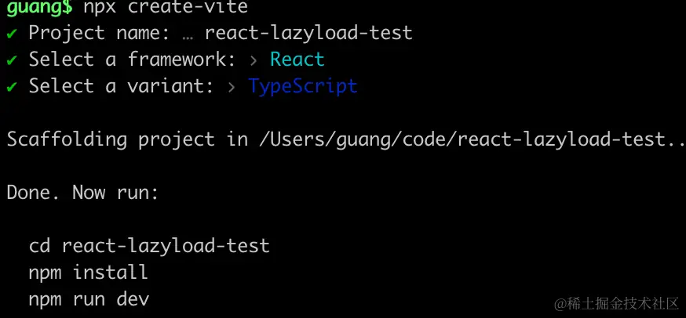
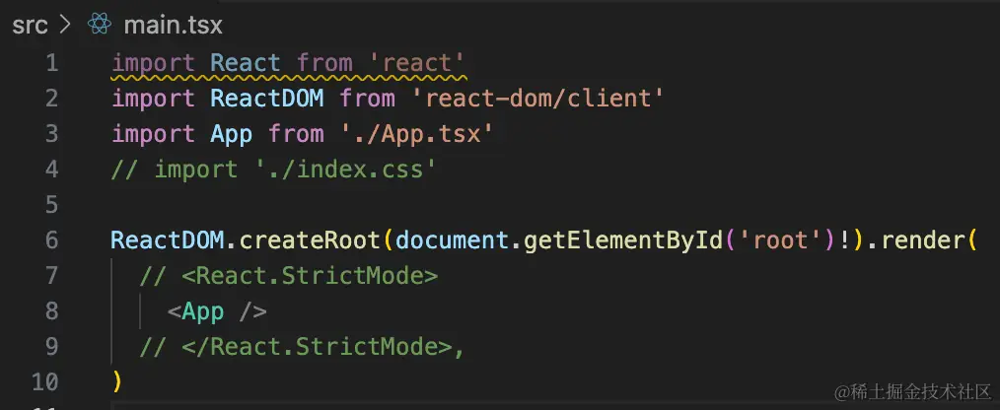
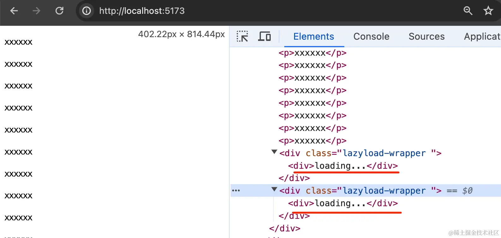
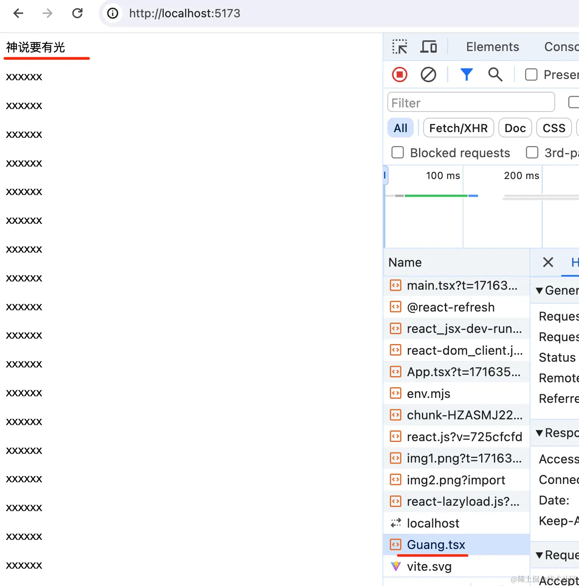
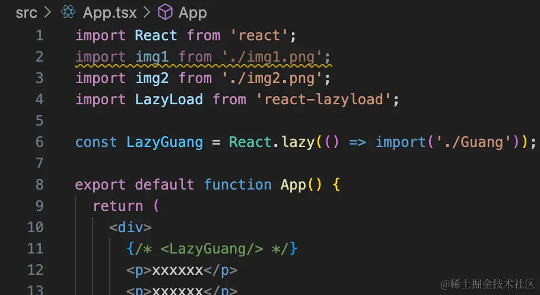
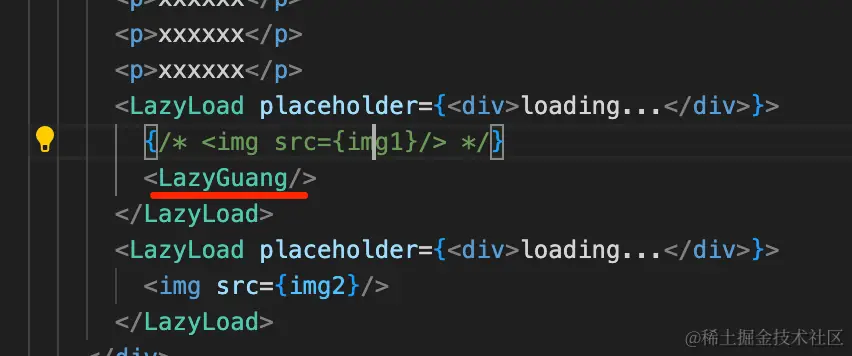
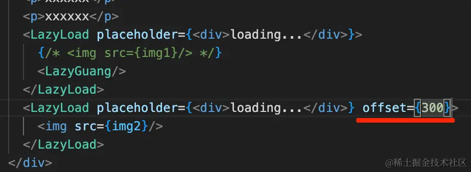
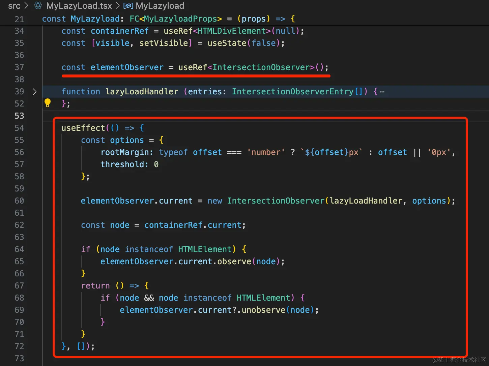
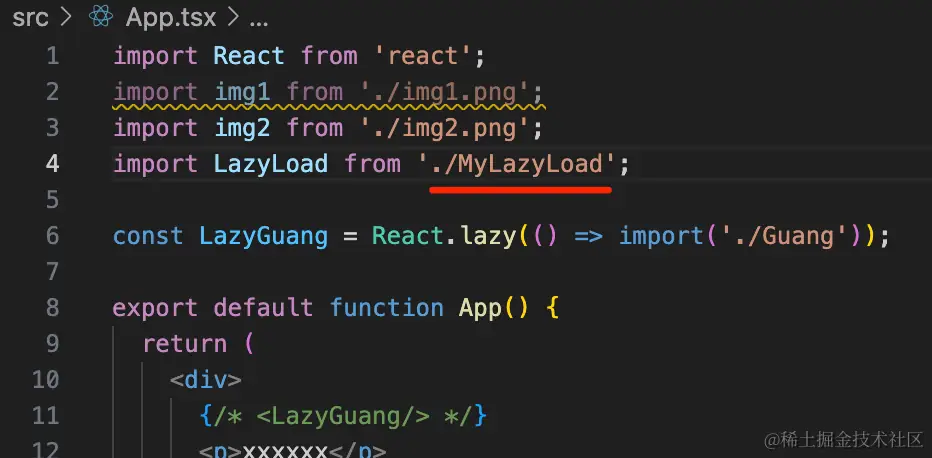
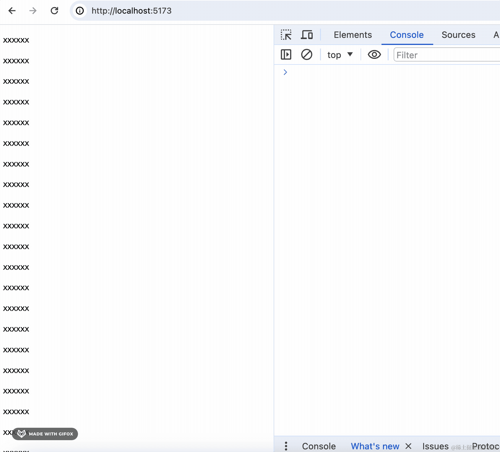

# 第19章—手写react-lazyload

网页里可能会有很多图片，图片加载有一个过程，我们会在图片加载过程中展示占位图片。

并且我们不需要一开始就加载所有图片，而是希望在图片滚动到可视区域再加载。

这种效果我们会用 react-lazyload 来实现。

创建个项目：

```
npx create-vite
```



进入项目，安装 react-lazyload

```
npm install

npm install --save react-lazyload

npm install --save-dev @types/react-lazyload

npm install --save prop-types
```
prop-types 是 react-lazyload 用到的包。

去掉 index.css 和 StrictMode：



然后改下 App.tsx

```javascript
import img1 from './img1.png';
import img2 from './img2.png';
import LazyLoad from 'react-lazyload';

export default function App() {
  return (
    <div>
      <p>xxxxxx</p>
      <p>xxxxxx</p>
      <p>xxxxxx</p>
      <p>xxxxxx</p>
      <p>xxxxxx</p>
      <p>xxxxxx</p>
      <p>xxxxxx</p>
      <p>xxxxxx</p>
      <p>xxxxxx</p>
      <p>xxxxxx</p>
      <p>xxxxxx</p>
      <p>xxxxxx</p>
      <p>xxxxxx</p>
      <p>xxxxxx</p>
      <p>xxxxxx</p>
      <p>xxxxxx</p>
      <p>xxxxxx</p>
      <p>xxxxxx</p>
      <p>xxxxxx</p>
      <p>xxxxxx</p>
      <p>xxxxxx</p>
      <p>xxxxxx</p>
      <p>xxxxxx</p>
      <p>xxxxxx</p>
      <p>xxxxxx</p>
      <p>xxxxxx</p>
      <p>xxxxxx</p>
      <p>xxxxxx</p>
      <p>xxxxxx</p>
      <LazyLoad placeholder={<div>loading...</div>}>
        
      </LazyLoad>
      <LazyLoad placeholder={<div>loading...</div>}>
        
      </LazyLoad>
    </div>
  );
};
```
在超出一屏的位置加载两张图片，用 LazyLoad 包裹。



可以看到，最开始展示 placeholder 的内容。

当图片划入可视区域后，会替换成图片：


在网络里也可以看到，当图片进入可视区域才会下载：


这就是 react-lazyload 的作用。

当然，它能做的可不只是懒加载图片，组件也可以。

我们知道，用 lazy 包裹的组件可以异步加载。

我们写一个 Guang.tsx

```javascript
export default function Guang() {
    return '神说要有光';
}
```
然后在 App.tsx 里异步引入：


```javascript
const LazyGuang = React.lazy(() => import('./Guang'));
```

import() 包裹的模块会单独打包，然后 React.lazy 是用到这个组件的时候才去加载。

试下效果：



可以看到，确实是异步下载了这个组件并渲染出来。

那如果我们想组件进入可视区域再加载呢？

这样：




react-lazyload 是进入可视区域才会把内容替换为 LazyGuang，而这时候才会去下载组件对应的代码。

效果就是这样的：


可以看到，Guang.tsx 的组件代码，img2.png 的图片，都是进入可视区域才加载的。

你还可以设置 offset，也就是不用到可视区域，如果 offset 设置 200，那就是距离 200px 到可视区域就触发加载：




可以看到，现在 img2 还没到可视区域就加载了。

知道了 react-lazyload 怎么用，那它是怎么实现的呢？

用前两节讲过的 IntersectionObserver 就可以实现。

我们来写一下：

src/MyLazyLoad.tsx

```javascript
import {
    CSSProperties,
    FC,
    ReactNode,
    useRef,
    useState
} from 'react';

interface MyLazyloadProps{
    className?: string,
    style?: CSSProperties,
    placeholder?: ReactNode,
    offset?: string | number,
    width?: number | string,
    height?: string | number,
    onContentVisible?: () => void,
    children: ReactNode,
}

const MyLazyload: FC<MyLazyloadProps> = (props) => {

    const {
        className = '',
        style,
        offset = 0,
        width,
        onContentVisible,
        placeholder,
        height,
        children
    } = props;

    const containerRef = useRef<HTMLDivElement>(null);
    const [visible, setVisible] = useState(false);

    const styles = { height, width, ...style };

    return <div ref={containerRef} className={className} style={styles}>
        {visible? children : placeholder}
    </div>
}

export default MyLazyload;
```
先看下 props：

className 和 style 是给外层 div 添加样式的。

placeholder 是占位的内容。

offset 是距离到可视区域多远就触发加载。

onContentVisible 是进入可视区域的回调。

然后用 useRef 保存外层 div 的引用。

用 useState 保存 visible 状态。

visible 的时候展示 children，否则展示 placeholder。

然后补充下 IntersectionObserver 监听 div 进入可视区域的情况：


```javascript
const elementObserver = useRef<IntersectionObserver>();

useEffect(() => {
    const options = {
        rootMargin: typeof offset === 'number' ? `${offset}px` : offset || '0px',
        threshold: 0
    };

    elementObserver.current = new IntersectionObserver(lazyLoadHandler, options);

    const node = containerRef.current;

    if (node instanceof HTMLElement) {
        elementObserver.current.observe(node);
    }
    return () => {
        if (node && node instanceof HTMLElement) {
            elementObserver.current?.unobserve(node);
        }
    }
}, []);
```
这里的 rootMargin 就是距离多少进入可视区域就触发，和参数的 offset 一个含义。

threshold 是元素进入可视区域多少比例的时候触发，0 就是刚进入可视区域就触发。

然后用 IntersectionObserver 监听 div。

之后定义下 lazyloadHandler：

```javascript
function lazyLoadHandler (entries: IntersectionObserverEntry[]) {
    const [entry] = entries;
    const { isIntersecting } = entry;

    if (isIntersecting) {
        setVisible(true);
        onContentVisible?.();

        const node = containerRef.current;
        if (node && node instanceof HTMLElement) {
            elementObserver.current?.unobserve(node);
        }
    }
};
```
当 isIntersecting 为 true 的时候，就是从不相交到相交，反之，是从相交到不相交。

这里设置 visible 为 true，回调 onContentVisible，然后去掉监听。

测试下：




可以看到，首先是图片加载，然后是组件加载，这说明 offset 生效了：





这样，我们就实现了 react-lazyload。

案例代码上传了[小册仓库](https://github.com/QuarkGluonPlasma/react-course-code/tree/main/react-lazyload-test)

## 总结

当图片进入可视区域才加载的时候，可以用 react-lazyload。

它支持设置 placeholder 占位内容，设置 offset 距离多少距离进入可视区域触发加载。

此外，它也可以用来实现组件进入可视区域时再加载，配合 React.lazy + import() 即可。

它的实现原理就是 IntersectionObserver，我们自己实现了一遍，设置 rootMargin 也就是 offset，设置 threshold 为 0 也就是一进入可视区域就触发。

图片、组件的懒加载（进入可视区域再触发加载）是非常常见的需求，不但要会用 react-lazyload 实现这种需求，也要能够自己实现。
