# 第20章—图解网页的各种距离

网页开发中，我们经常要计算各种距离。

比如 OnBoarding 组件，我们要拿到每一步的高亮元素的位置、宽高：


比如 Popover 组件，需要拿到每个元素的位置，然后确定浮层位置：

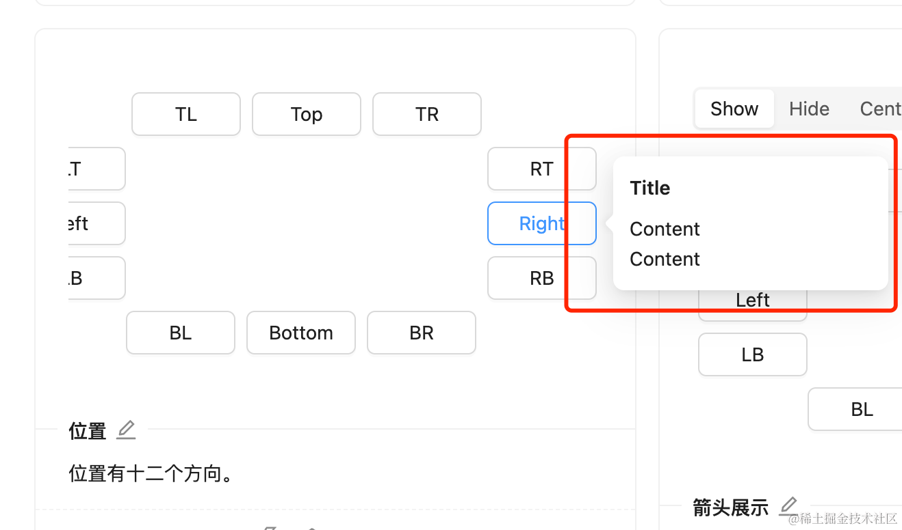

比如滚动到页面底部，触发列表的加载，这需要拿到滚动的距离和页面的高度。

类似这样，需要计算距离、宽高等的场景有很多。

而浏览器里与距离、宽高有关的属性也有不少。

今天我们来整体过一遍。

首先，页面一般都是超过一屏的，右边会出现滚动条，代表当前可视区域的位置：


这里窗口的部分是可视区域，也叫做视口 viewport。

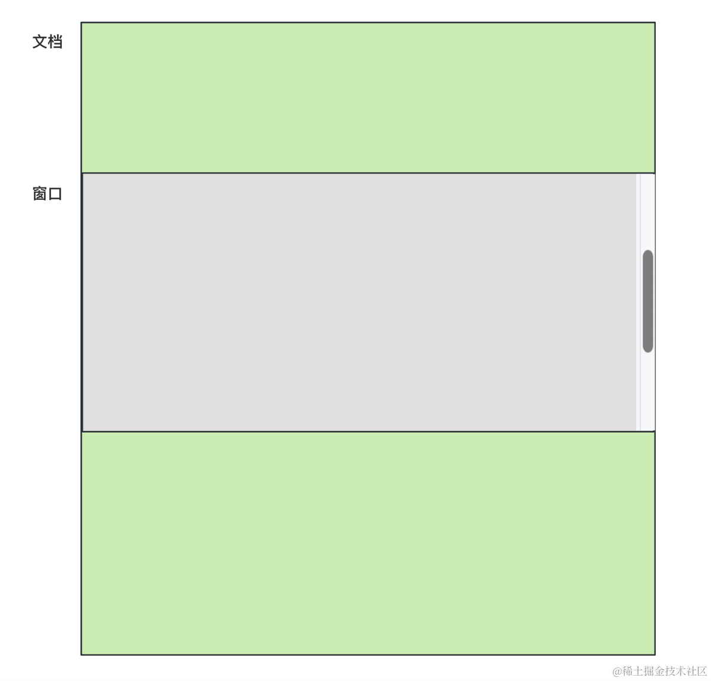

如果我们点击了可视区域内的一个元素，如何拿到位置信息呢？

我们只看 y 轴方向好了，x 轴也是一样的。

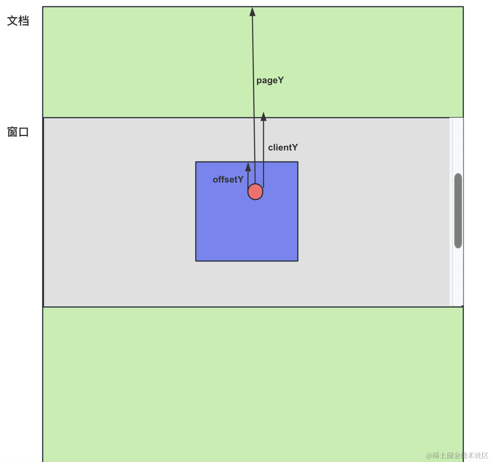

事件对象可以拿到 pageY、clientY、offsetY，分别代表到点击的位置到文档顶部，到可视区域顶部，到触发事件的元素顶部的距离。

还有个 screenY，是拿到到屏幕顶部的距离。

我们试一下：

```
npx create-vite
```

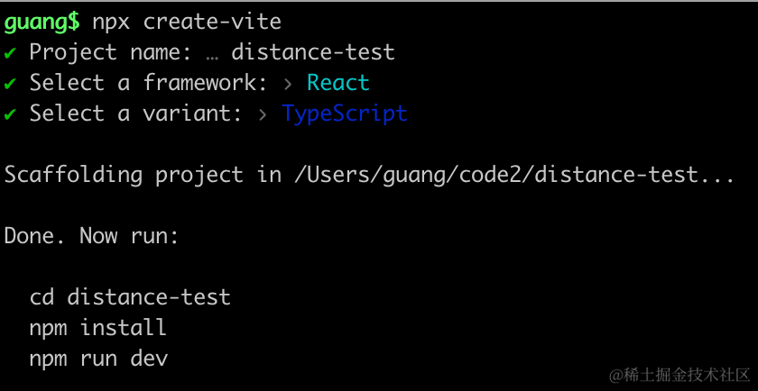

去掉 main.tsx 的里 index.css 和 StrictMode：

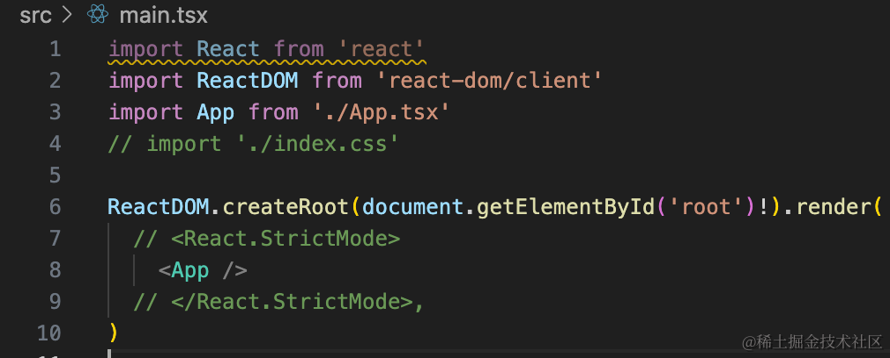

然后改下 App.tsx

```javascript
import { MouseEventHandler, useEffect, useRef } from 'react'

function App() {
  const ref = useRef<HTMLDivElement>(null);

  const clickHandler: MouseEventHandler<HTMLDivElement> = (e) => {
    console.log('box pageY', e.pageY);
    console.log('box clientY', e.clientY)
    console.log('box offsetY', e.offsetY);
    console.log('box screenY', e.screenY);
  }

  useEffect(() => {
    document.getElementById('box')!.addEventListener('click', (e) => {
      console.log('box2 pageY', e.pageY);
      console.log('box2 clientY', e.clientY)
      console.log('box2 offsetY', e.offsetY);
      console.log('box2 screenY', e.screenY);
    });
  }, []);

  return (
    <div>
      <div id="box" ref={ref} style={{
        marginTop: '800px',
        width: '100px',
        height: '100px',
        background: 'blue'
      }} onClick={clickHandler}></div>
    </div>
  )
}

export default App
```
为什么要用两种方式添加点击事件呢？

因为这里要介绍一个 react 事件的坑点：

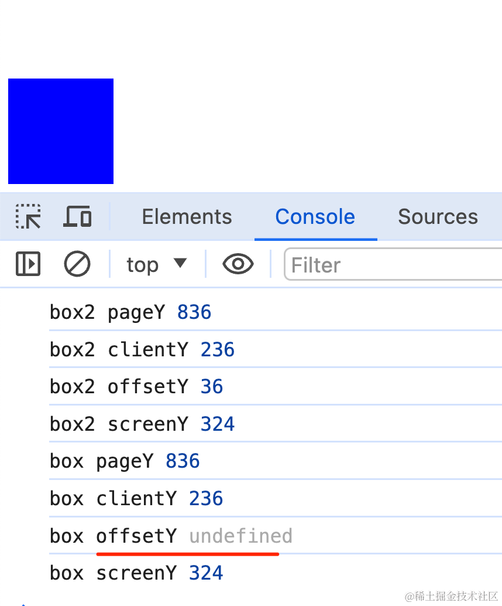

react 事件是合成事件，所以它少了一些原生事件的属性，比如这里的 offsetY，也就是点击的位置距离触发事件的元素顶部的距离。

你写代码的时候 ts 就报错了：

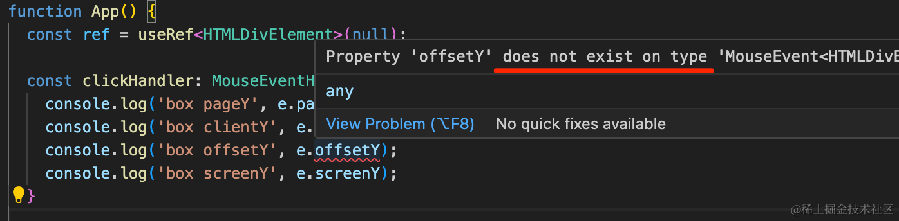

那咋办呢？

react-use 提供的 useMouse 的 hook 就解决了这个问题：

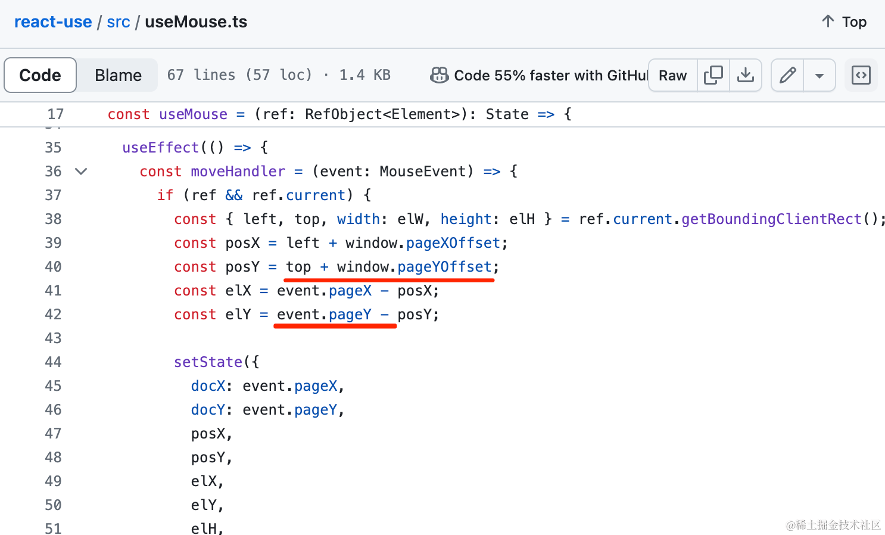

它是用 e.pageY 减去 getBoundingClientRect().top 减去 window.pageYOffset 算出来的。

这里的 getBoundingClientRect 是返回元素距离可以可视区域的距离和宽高的：

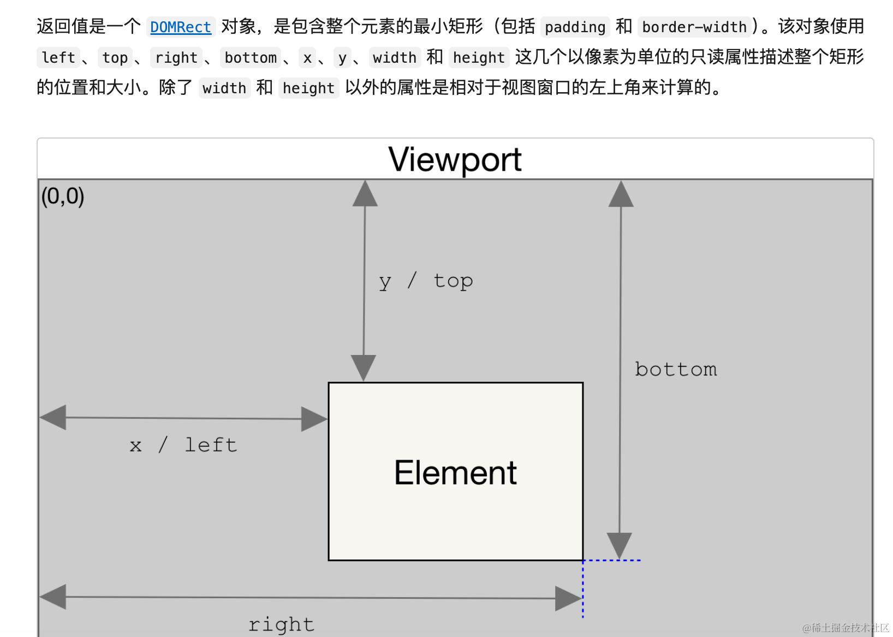

而 window.pageYOffset 也叫 window.scrollY，顾名思义就是窗口滚动的距离。

想一下，pageY 去了 window.scrollY，去了 getBoundingClientRect().top，剩下的可不就是 offsetY 么：

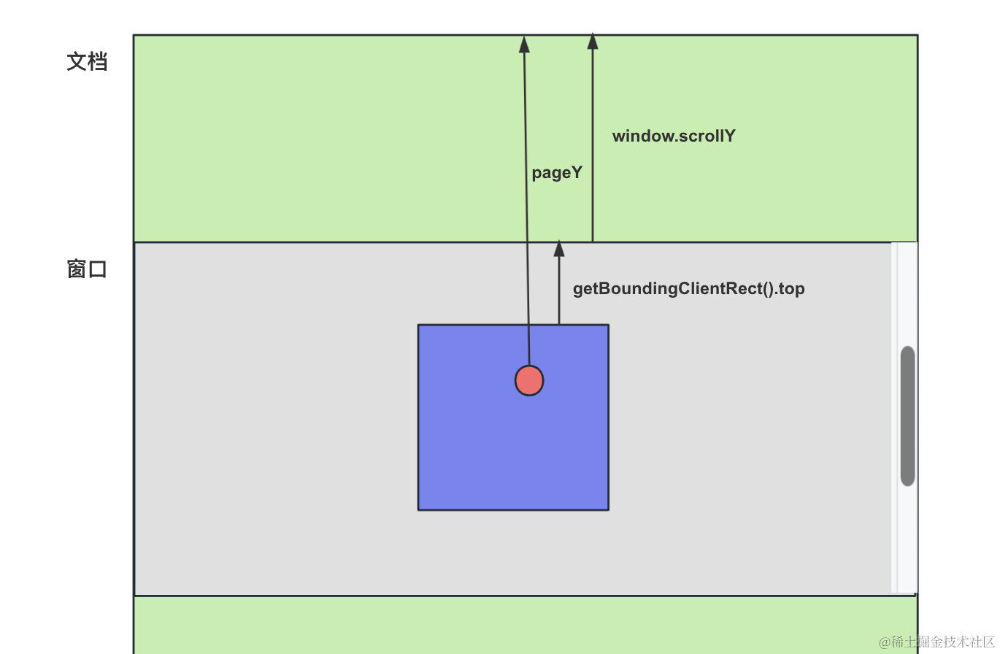

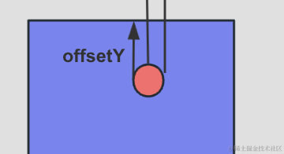

试一下：
```javascript
const clickHandler: MouseEventHandler<HTMLDivElement> = (e) => {
    const top = document.getElementById('box')!.getBoundingClientRect().top;

    console.log('box pageY', e.pageY);
    console.log('box clientY', e.clientY)
    console.log('box offsetY', e.pageY - top - window.pageYOffset);
    console.log('box screenY', e.screenY);
}
```


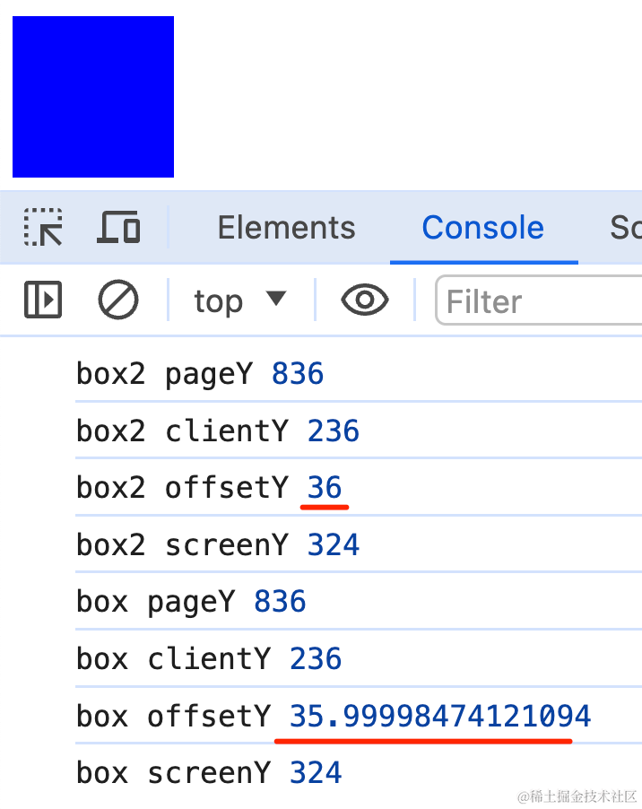

因为 getBoundingClientRect 返回的数值是更精确的小数，所以算出来的也是小数。

还有，这里的 window.pageYOffset 过时了，简易换成 window.scrollY，是一样的：

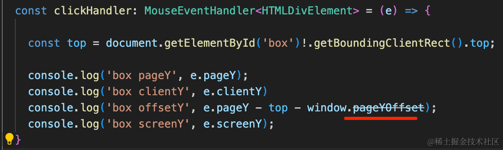

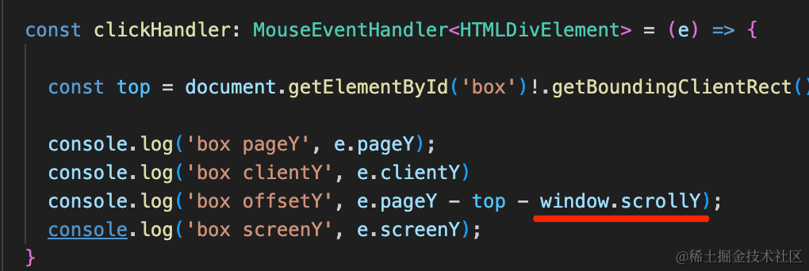

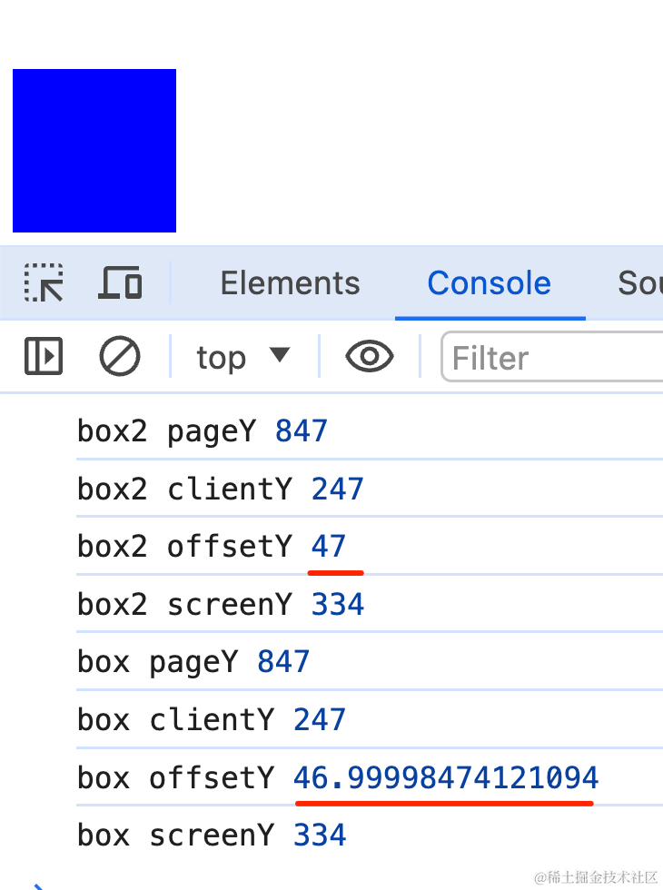

当然，你也可以访问原生事件对象，拿到 offsetY 属性：

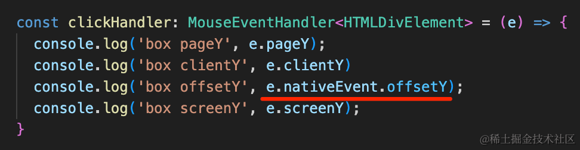

此外，窗口的滚动距离用 window.scrollY 获取，那元素也有滚动条呢？

元素内容的滚动距离用 element.scrollTop 获取。

```javascript
import { MouseEventHandler, useEffect, useRef } from 'react'

function App() {
  const ref = useRef<HTMLDivElement>(null);

  const clickHandler: MouseEventHandler<HTMLDivElement> = (e) => {
    console.log(ref.current?.scrollTop);
  }

  return (
    <div>
      <div id="box" ref={ref} style={{
        marginTop: '800px',
        width: '100px',
        height: '100px',
        background: 'ping',
        overflow: 'auto'
      }} onClick={clickHandler}>
        <p>xxxxx</p>
        <p>xxxxx</p>
        <p>xxxxx</p>
        <p>xxxxx</p>
        <p>xxxxx</p>
        <p>xxxxx</p>
        <p>xxxxx</p>
        <p>xxxxx</p>
        <p>xxxxx</p>
        <p>xxxxx</p>
        <p>xxxxx</p>
        <p>xxxxx</p>
        <p>xxxxx</p>
        <p>xxxxx</p>
        <p>xxxxx</p>
        <p>xxxxx</p>
      </div>
    </div>
  )
}

export default App
```

给 box 加一些内容，设置 overflow:auto。

试一下：

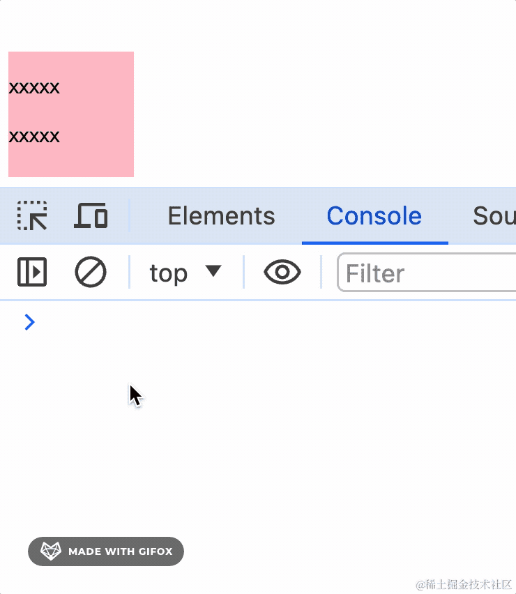

这就是元素的 scrollTop。

此外，元素还有 offsetTop 和 clientTop 属性：

```javascript
import { useEffect, useRef } from 'react'

function App() {
  const ref = useRef<HTMLDivElement>(null);

  useEffect(() => {
    console.log('offsetTop', ref.current?.offsetTop);
    console.log('clientTop', ref.current?.clientTop);
  }, []);

  return (
    <div>
      <div style={
        {
          position: 'relative',
          margin: '100px',
          padding: '200px',
          border: '1px solid blue'
        }
      }>
        <div id="box" ref={ref} style={{
          border: '20px solid #000',
          width: '100px',
          height: '100px',
          background: 'pink',
        }}>
        </div>
      </div>
    </div>
  )
}

export default App
```
box 外层添加一个 div，margin 为 100px，padding 为 200px。

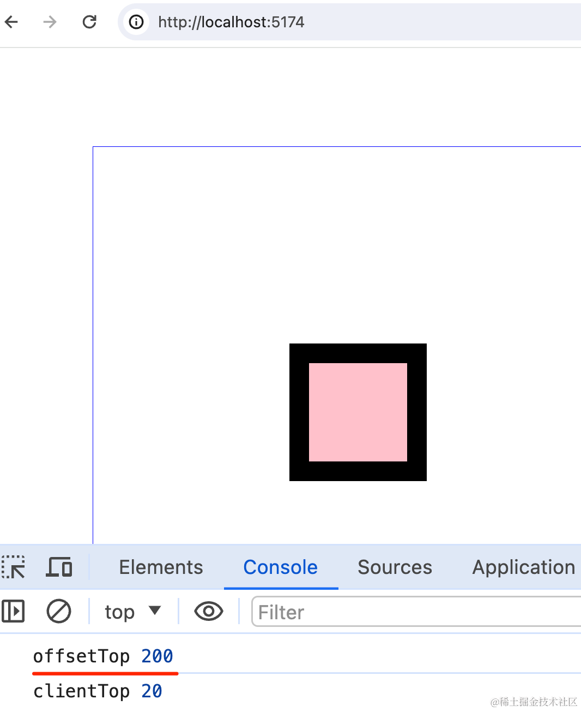

可以看到，clientTop 也就是上边框的高度 20px。

offsetTop 是距离最近的有 position 属性（relative 或 absolute 或 fixed）的元素的距离。

所以是 200px。

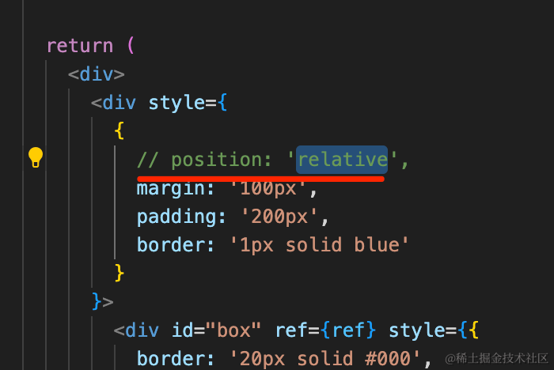

注释掉就是 301px 了，这时候就是相对于文档顶部，所以是 200px padding+ 1px border + 100px margin。

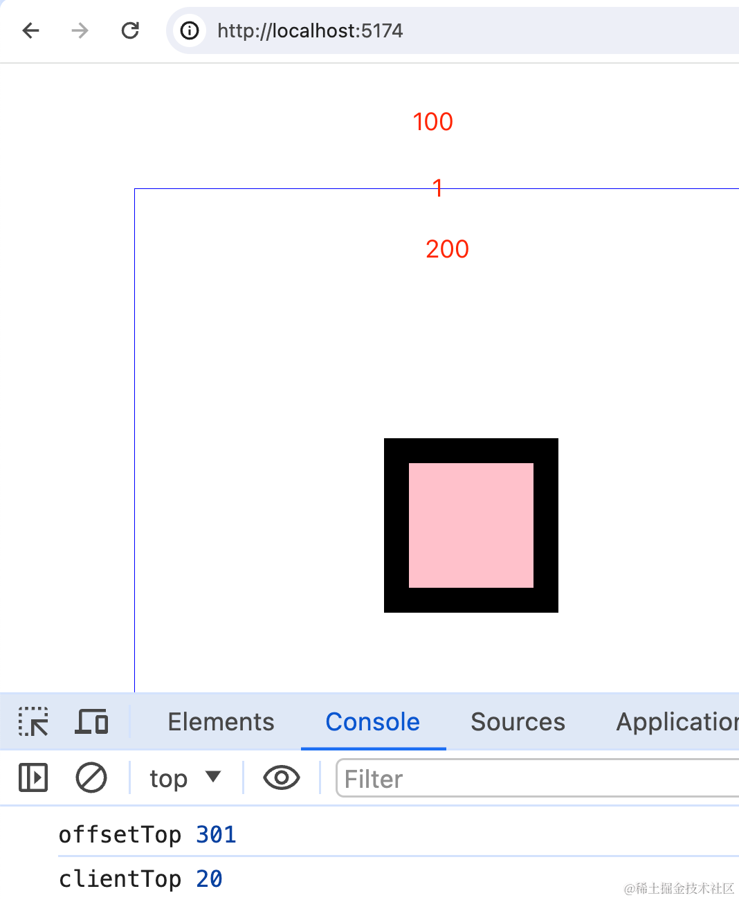

offsetTop 相对于哪个元素，那个元素就是 offsetParent。

还可以递归累加到 offsetParent 的 offsetTop，直到 offsetParent 为 null，也就是到了根元素，这时候算出来的就是元素到根元素的 offsetTop：

```javascript
import { useEffect, useRef } from 'react'

function App() {
  const ref = useRef<HTMLDivElement>(null);

  function getTotalOffsetTop(element: HTMLElement) {
    let totalOffsetTop =0;
    while (element) {
      totalOffsetTop += element.offsetTop;
      element = element.offsetParent as HTMLElement;
    }
    return totalOffsetTop;
  }

  useEffect(() => {
    console.log('offsetTop', ref.current?.offsetTop);
    console.log('clientTop', ref.current?.clientTop);

    console.log('totol offsetTop', getTotalOffsetTop(ref.current!))
      
  }, []);

  return (
    <div>
      <div style={
        {
          position: 'relative',
          margin: '100px',
          padding: '200px',
          border: '1px solid blue'
        }
      }>
        <div id="box" ref={ref} style={{
          border: '20px solid #000',
          width: '100px',
          height: '100px',
          background: 'pink',
        }}>
        </div>
      </div>
    </div>
  )
}

export default App
```

但是你会发现它少计算了 border 的宽度：

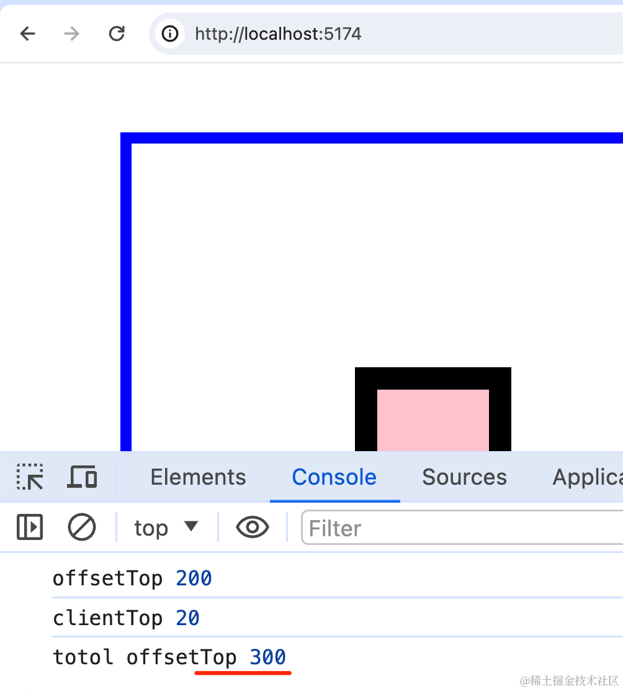

因为 offsetTop 元素顶部到 offsetParent 内容部分的距离，不包括 border。

这时候加上 clientTop 就可以了，它就是上边框的高度。

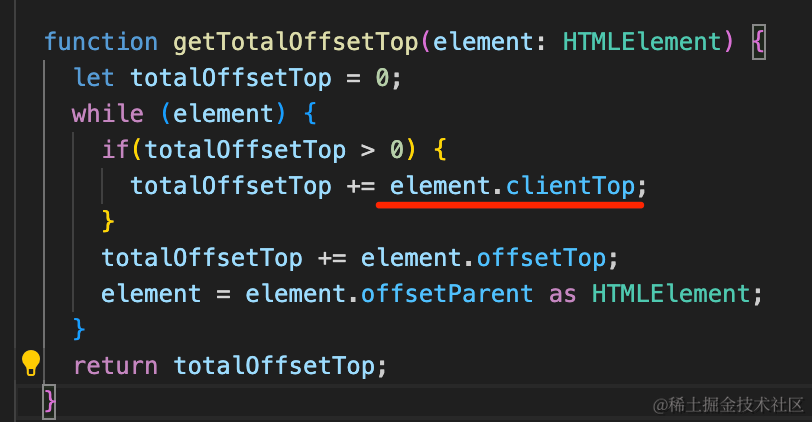

```javascript
function getTotalOffsetTop(element: HTMLElement) {
    let totalOffsetTop = 0;
    while (element) {
      if(totalOffsetTop > 0) {
        totalOffsetTop += element.clientTop;
      }
      totalOffsetTop += element.offsetTop;
      element = element.offsetParent as HTMLElement;
    }
    return totalOffsetTop;
}
```
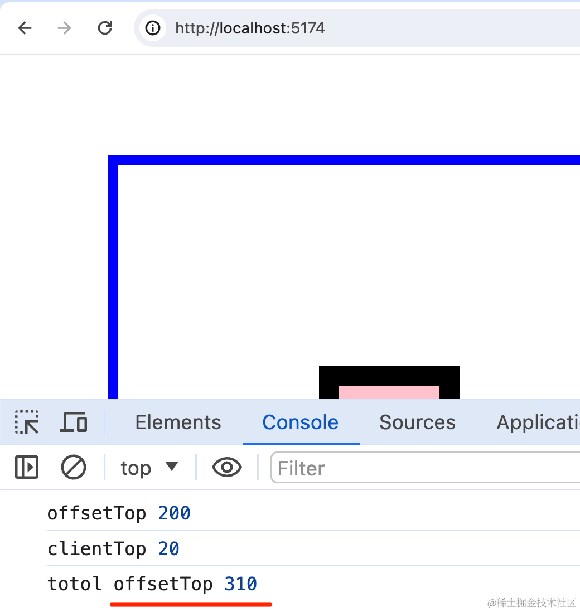

这里有两个 clientTop，当前元素的 clientTop 不用加：

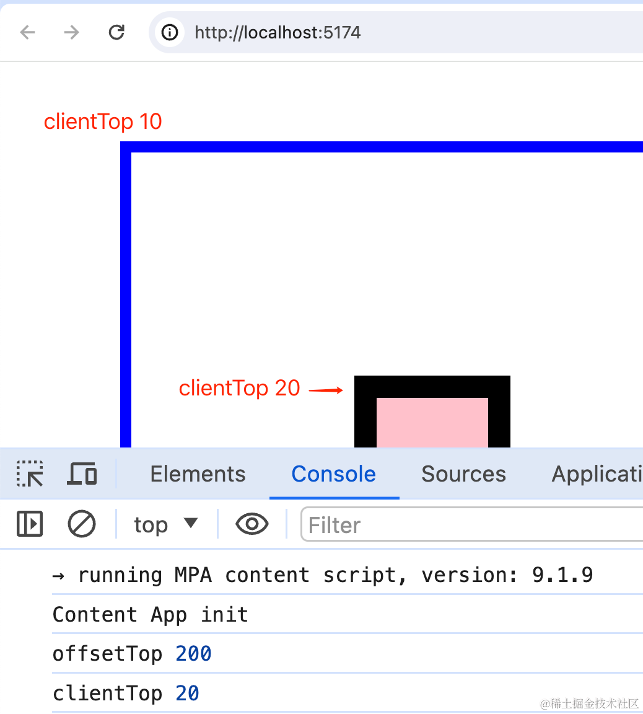

综上，当鼠标事件触发时，可以通过 pageY、clientY、screenY、offsetY 来计算位置，也可以通过元素的 getBoundingClientRect 和 scrollTop、offsetTop、clientTop 等来算，结合 window.scrollY。

这里 clientY 和 getBoundingClientRect().top 也要区分下：

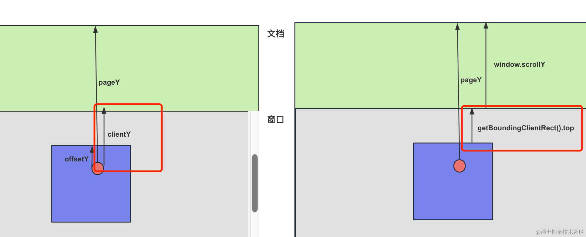

一个是元素距离可视区域顶部的距离，一个是鼠标事件触发位置到可视区域顶部的距离。

比如页面是否滚动到底部，就可以通过 document.documentElement.scrollTop + window.innerHeihgt 和 document.documentElement.scrollHeight 对比。

这里有涉及到了几个新的属性。

根元素 documentElement 的 scrollTop 就是 window.scrollY：

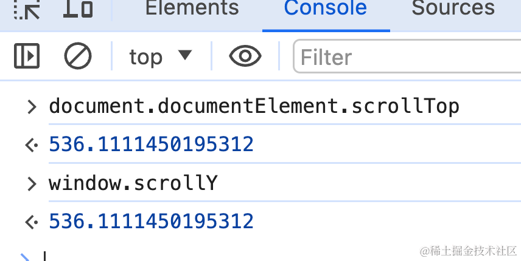

然后 window.innerHeight、window.innerWidth 是窗口的宽高，也就是可视区域的宽高。

至于 scrollHeight，这是元素的包含滚动区域的高度。

类似的有 clientHeight、offsetHeight、getBoundingClient().height 这几个高度要区分下：

```javascript
import { MouseEventHandler, useEffect, useRef } from 'react'

function App() {
  const ref = useRef<HTMLDivElement>(null);

  const clickHandler: MouseEventHandler<HTMLDivElement> = (e) => {
    console.log('clentHeight', ref.current?.clientHeight);
    console.log('scrollHeight', ref.current?.scrollHeight);
    console.log('offsetHeight', ref.current?.offsetHeight);
    console.log('clent rect height', ref.current?.getBoundingClientRect().height);
  }

  return (
    <div>
      <div id="box" ref={ref} style={{
        border: '10px solid #000',
        marginTop: '300px',
        width: '100px',
        height: '100px',
        background: 'pink',
        overflow: 'auto'
      }} onClick={clickHandler}>
        <p>xxxxx</p>
        <p>xxxxx</p>
        <p>xxxxx</p>
        <p>xxxxx</p>
        <p>xxxxx</p>
        <p>xxxxx</p>
        <p>xxxxx</p>
        <p>xxxxx</p>
        <p>xxxxx</p>
        <p>xxxxx</p>
        <p>xxxxx</p>
        <p>xxxxx</p>
        <p>xxxxx</p>
        <p>xxxxx</p>
        <p>xxxxx</p>
        <p>xxxxx</p>
      </div>
    </div>
  )
}

export default App
```
试一下：

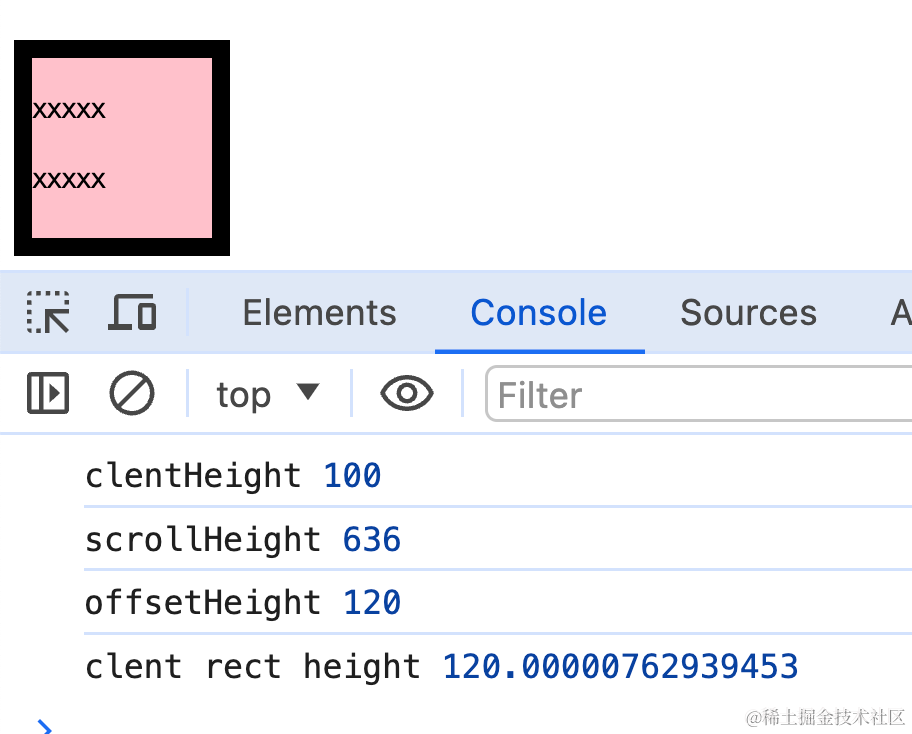

clientHeight 是内容区域的高度，不包括 border。

offsetHeight 包括 border。

scrollHeight 是滚动区域的总高度，不包括 border。

那看起来 getBoundingClientRect().height 和 offsetHeight 一模一样？

绝大多数情况下是的。

但你旋转一下：

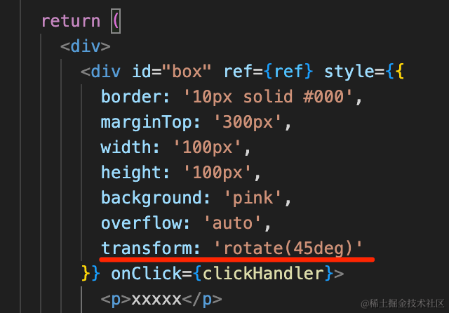

就不一样了：

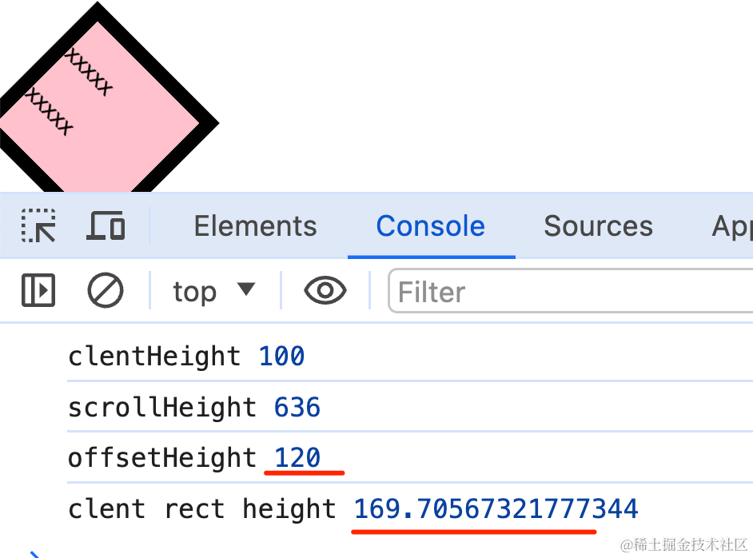

getBoundingClientRect 拿到的包围盒的高度，而 offsetHeight 是元素本来的高度。

所以，对于滚动到页面底部的判断，就可以用 window.scrollY + window.innerHeight 和 document.documentElement.scrollHeight 对比。

```javascript
import { useEffect, useRef } from 'react'

function App() {
  const ref = useRef<HTMLDivElement>(null);

  useEffect(() => {
    window.addEventListener('scroll', () => {
      console.log(window.scrollY + window.innerHeight, document.documentElement.scrollHeight);
    })
  }, []);

  return (
    <div>
      <div id="box" ref={ref} style={{
        border: '10px solid #000',
        marginTop: '800px',
        width: '100px',
        height: '100px',
        background: 'pink',
        overflow: 'auto',
        transform: 'rotate(45deg)'
      }}>
        <p>xxxxx</p>
        <p>xxxxx</p>
        <p>xxxxx</p>
        <p>xxxxx</p>
        <p>xxxxx</p>
        <p>xxxxx</p>
        <p>xxxxx</p>
        <p>xxxxx</p>
        <p>xxxxx</p>
        <p>xxxxx</p>
        <p>xxxxx</p>
        <p>xxxxx</p>
        <p>xxxxx</p>
        <p>xxxxx</p>
        <p>xxxxx</p>
        <p>xxxxx</p>
      </div>
    </div>
  )
}

export default App
```

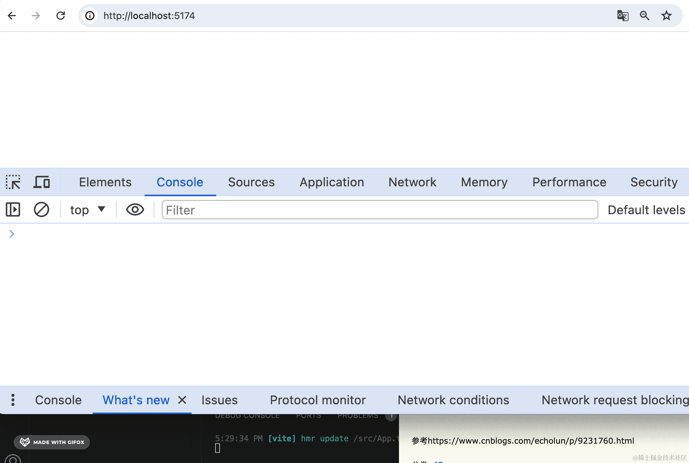

这样，浏览器里的各种距离和宽高我们就过了一遍。

## 总结

浏览器里计算位置、宽高、判断一些交互，都需要用到距离、宽高的属性。

这类属性比较多，我们整体过了一遍：

- e.pageY：鼠标距离文档顶部的距离
- e.clientY：鼠标距离可视区域顶部的距离
- e.offsetY：鼠标距离触发事件元素顶部的距离
- e.screenY：鼠标距离屏幕顶部的距离
- winwodw.scrollY：页面滚动的距离，也叫 window.pageYOffset，等同于 document.documentElement.scrollTop
- element.scrollTop：元素滚动的距离
- element.clientTop：上边框高度
- element.offsetTop：相对有 position 的父元素的内容顶部的距离，可以递归累加，加上 clientTop，算出到文档顶部的距离
- clientHeight：内容高度，不包括边框
- offsetHeight：包含边框的高度
- scrollHeight：滚动区域的高度，不包括边框
- window.innerHeight：窗口的高度
- element.getBoundingClientRect：拿到 width、height、top、left 属性，其中 top、left 是元素距离可视区域的距离，width、height 绝大多数情况下等同 offsetHeight、offsetWidth，但旋转之后就不一样了，拿到的是包围盒的宽高

其中，还要注意 react 的合成事件没有 offsetY 属性，可以自己算，react-use 的 useMouse 的 hook 就是自己算的，也可以用 e.nativeEvent.offsetY 来拿到。

掌握这些宽高、距离属性，就足够处理各种需要计算位置、宽高的需求了。
