# 第21章—自定义hook练习

组件里有很多逻辑是可以复用的。

对于常规的 JS 逻辑，我们会封装成函数，也会用一些通用函数的库，比如 lodash。

对于用到 hook 的逻辑，我们会封装成自定义 hook，当然，也会有通用 hook 库，比如 react-use 和 ahooks。

看周下载量，react-use 是 ahooks 的十倍：

ahooks：

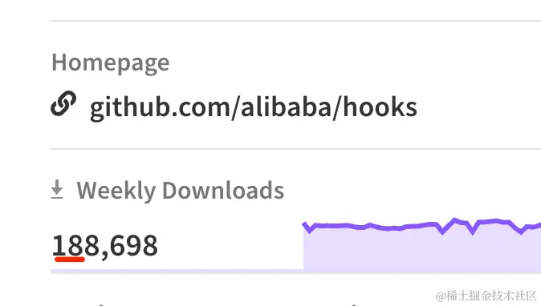

react-use：
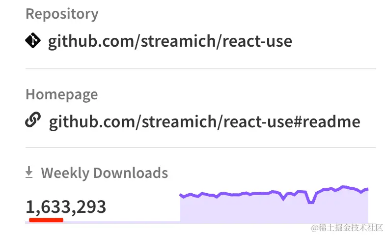

这节我们就挑 react-use 里的几个 hook 来实现下。

写完这几个 hook，你会对封装自定义 hook 更得心应手。

**自定义 hook 就是函数封装，和普通函数的区别只是在于名字规范是用 use 开头，并且要用到 rect 的内置 hook。**

新建个项目：

```
npx create-vite
```

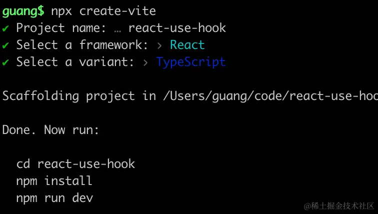

进入项目，安装依赖，然后把服务跑起来：

```
npm install
npm run dev
```

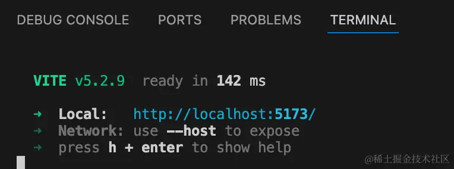

去掉 index.css 和 StrictMode：

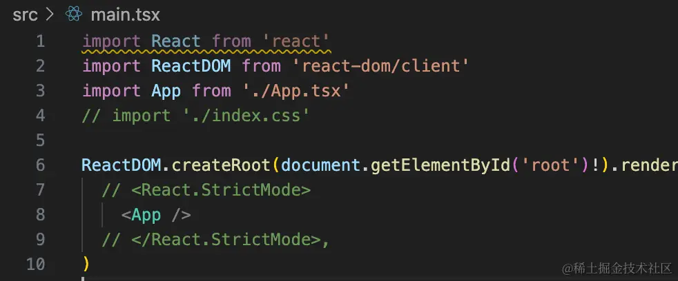

安装 react-use：

```
npm install --save react-use
```
接下来实现自定义 hook：

## useMountedState 和 useLifeCycles

useMountedState 可以用来获取组件是否 mount 到 dom：

```javascript
import { useEffect, useState } from 'react';
import {useMountedState} from 'react-use';

const App = () => {
    const isMounted = useMountedState();
    const [,setNum ] = useState(0);

    useEffect(() => {
        setTimeout(() => {
            setNum(1);
        }, 1000);
    }, []);

    return <div>{ isMounted() ? 'mounted' : 'pending' }</div>
};

export default App;
```
第一次渲染，组件渲染的时候，组件还没 mount 到 dom，1 秒后通过 setState 触发再次渲染的时候，这时候组件已经 mount 到 dom 了。

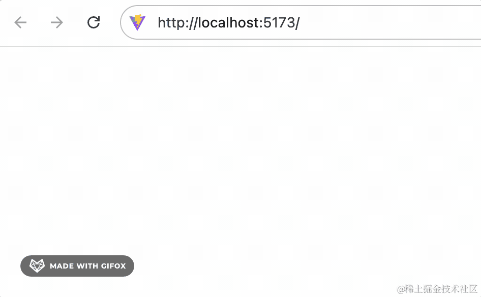

这个 hook 的实现也比较简单：

```javascript
import { useCallback, useEffect, useRef } from 'react';

export default function useMountedState(): () => boolean {
  const mountedRef = useRef<boolean>(false);
  const get = useCallback(() => mountedRef.current, []);

  useEffect(() => {
    mountedRef.current = true;

    return () => {
      mountedRef.current = false;
    };
  }, []);

  return get;
}
```
通过 useRef 保存 mount 状态，然后 useEffect 回调里修改它为 true。

因为 useEffect 是在 dom 操作之后异步执行的，所以这时候就已经 mount 了。

而使用 useRef 而不是 useState 保存 mount 的值是因为修改 ref.current 并不会引起组件重新渲染。

并且返回的 get 函数要用 useCallback 包裹，这样用它作为其它 memo 组件参数的时候，就不会导致额外的渲染。

类似的还有个 useLifeCycles 的 hook：

```javascript
import {useLifecycles} from 'react-use';

const App = () => {
  useLifecycles(() => console.log('MOUNTED'), () => console.log('UNMOUNTED'));

  return null;
};

export default App;
```
这个也是用 useEffect 的特性实现的：

```javascript
import { useEffect } from 'react';

const useLifecycles = (mount: Function, unmount?: Function) => {
  useEffect(() => {
    if (mount) {
      mount();
    }
    return () => {
      if (unmount) {
        unmount();
      }
    };
  }, []);
};

export default useLifecycles;
```
在 useEffect 里调用 mount，这时候 dom 操作完了，组件已经 mount。

然后返回的清理函数里调用 unmount，在组件从 dom 卸载时调用。

这两个 hook 都是依赖 useEffect 的特性来实现的。

## useCookie

useCookie 可以方便的增删改 cookie：

```javascript
import { useEffect } from "react";
import { useCookie } from "react-use";

const App = () => {
  const [value, updateCookie, deleteCookie] = useCookie("guang");

  useEffect(() => {
    deleteCookie();
  }, []);

  const updateCookieHandler = () => {
    updateCookie("666");
  };

  return (
    <div>
      <p>cookie 值: {value}</p>
      <button onClick={updateCookieHandler}>更新 Cookie</button>
      <br />
      <button onClick={deleteCookie}>删除 Cookie</button>
    </div>
  );
};
export default App;
```


它是对 js-cookie 这个包的封装：

安装下：
```
npm i --save js-cookie
```
然后实现 useCookie：

```javascript
import { useCallback, useState } from 'react';
import Cookies from 'js-cookie';

const useCookie = (
  cookieName: string
): [string | null, (newValue: string, options?: Cookies.CookieAttributes) => void, () => void] => {
  const [value, setValue] = useState<string | null>(() => Cookies.get(cookieName) || null);

  const updateCookie = useCallback(
    (newValue: string, options?: Cookies.CookieAttributes) => {
      Cookies.set(cookieName, newValue, options);
      setValue(newValue);
    },
    [cookieName]
  );

  const deleteCookie = useCallback(() => {
    Cookies.remove(cookieName);
    setValue(null);
  }, [cookieName]);

  return [value, updateCookie, deleteCookie];
};

export default useCookie;
```

就是基于 js-cookie 来 get、set、remove cookie：
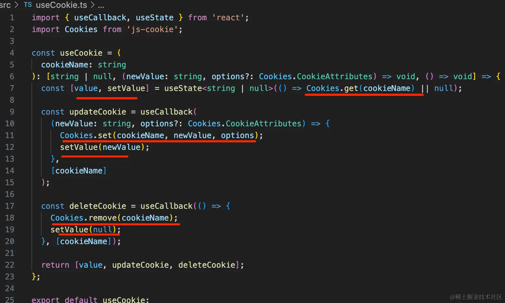

**一般自定义 hook 里返回的函数都要用 useCallback 包裹下，这样调用者就不用自己处理了。**

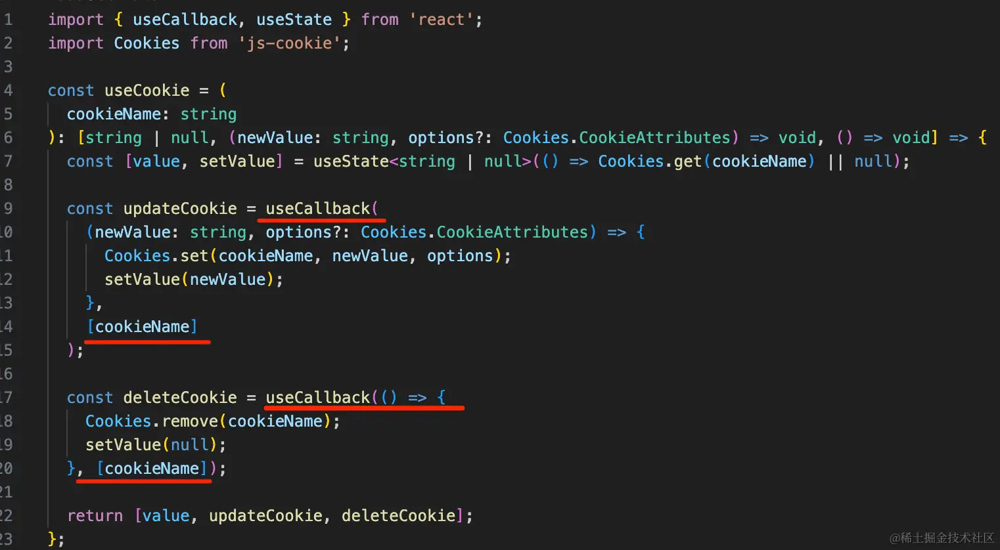

## useHover

css 里有 :hover 伪类，但是 js 里没有 hover 事件，只有 mouseenter、mouseleave 事件。

useHover 封装了 hover 事件：

```javascript
import {useHover} from 'react-use';

const App = () => {
  const element = (hovered: boolean) =>
    <div>
      Hover me! {hovered && 'Thanks'}
    </div>;

  const [hoverable, hovered] = useHover(element);

  return (
    <div>
      {hoverable}
      <div>{hovered ? 'HOVERED' : ''}</div>
    </div>
  );
};

export default App;
```

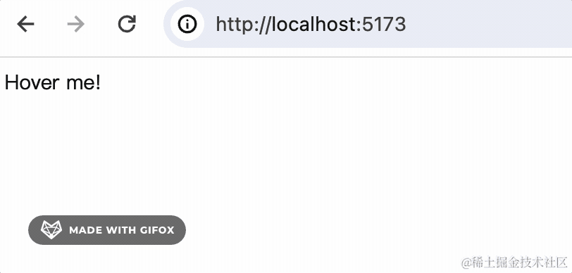

我们写一下：

```javascript
import { cloneElement, useState } from "react";

export type Element = ((state: boolean) => React.ReactElement) | React.ReactElement;

const useHover = (element: Element): [React.ReactElement, boolean] => {
  const [state, setState] = useState(false);

  const onMouseEnter = (originalOnMouseEnter?: any) => (event: any) => {
    originalOnMouseEnter?.(event);
    setState(true);
  };
  const onMouseLeave = (originalOnMouseLeave?: any) => (event: any) => {
    originalOnMouseLeave?.(event);
    setState(false);
  };

  if (typeof element === 'function') {
    element = element(state);
  }

  const el = cloneElement(element, {
    onMouseEnter: onMouseEnter(element.props.onMouseEnter),
    onMouseLeave: onMouseLeave(element.props.onMouseLeave),
  });

  return [el, state];
};

export default useHover;
```

传入的可以是 ReactElement 也可以是返回 ReactElement 的函数，内部对函数做下处理：

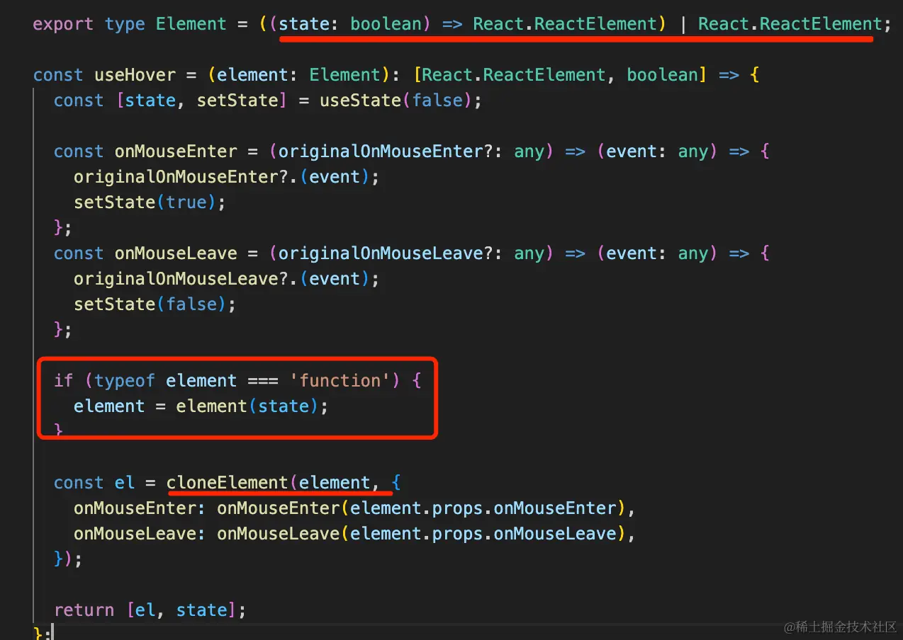

用 cloneElement 复制 ReactElement，给它添加 onMouseEnter、onMouseLeave 事件。

并用 useState 保存 hover 状态：

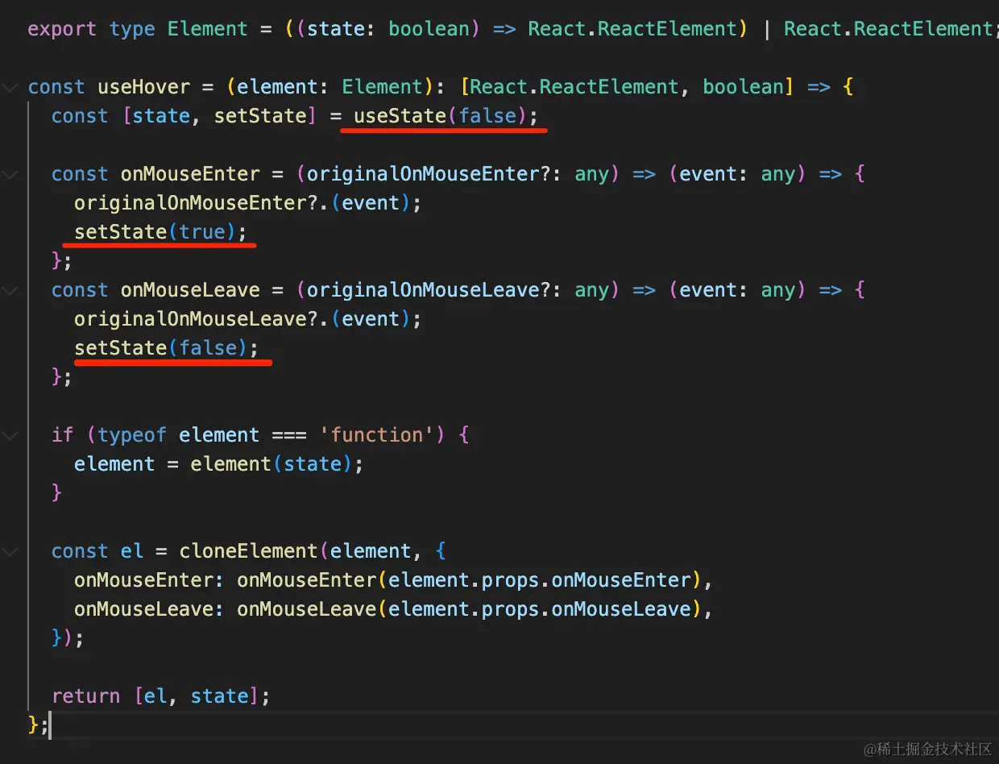

这里注意如果传入的 React Element 本身有 onMouseEnter、onMouseLeave 的事件处理函数，要先调用下：

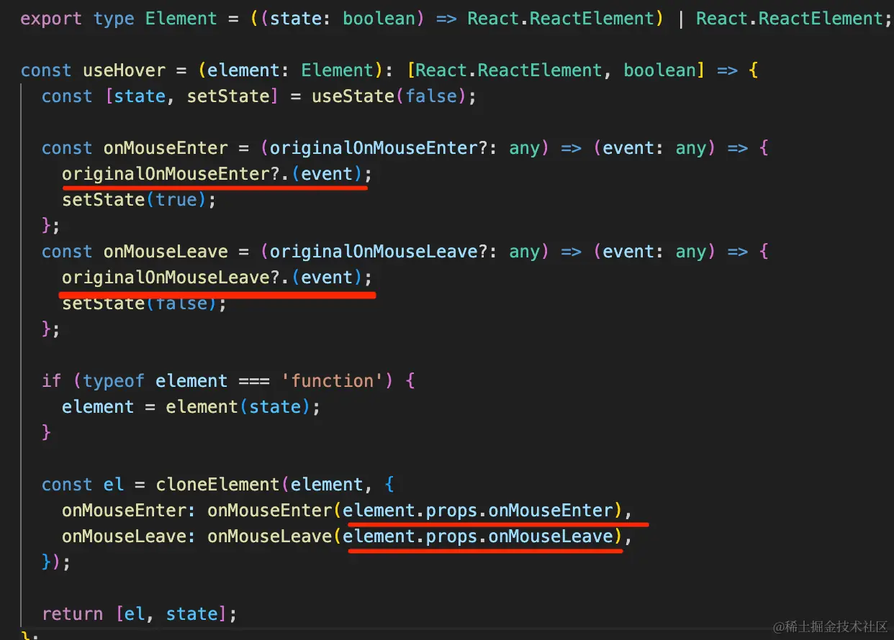
换成我们实现的试一下：

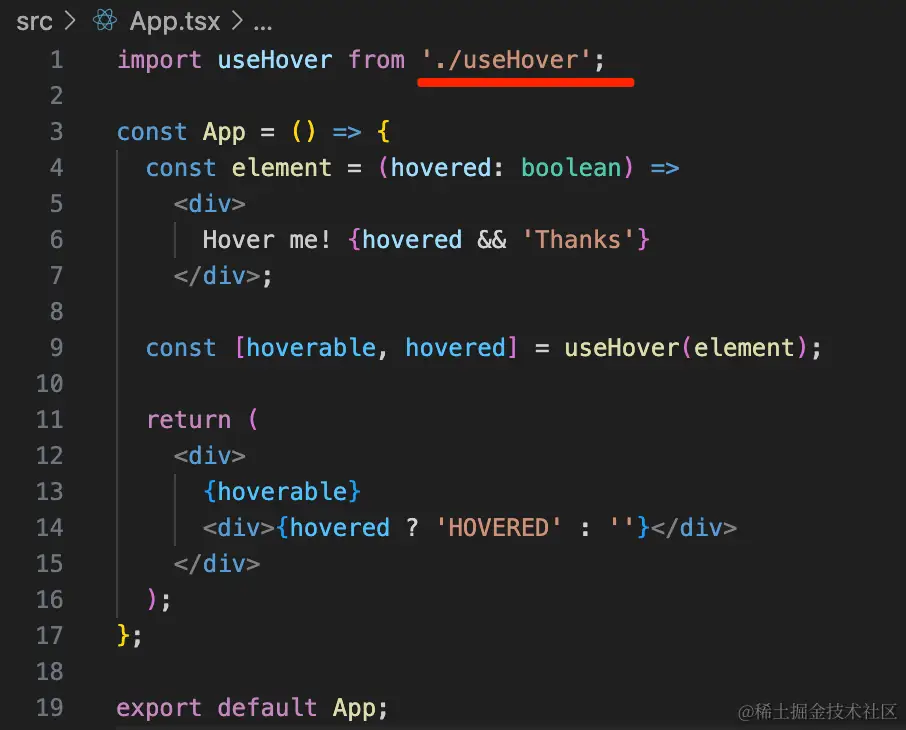

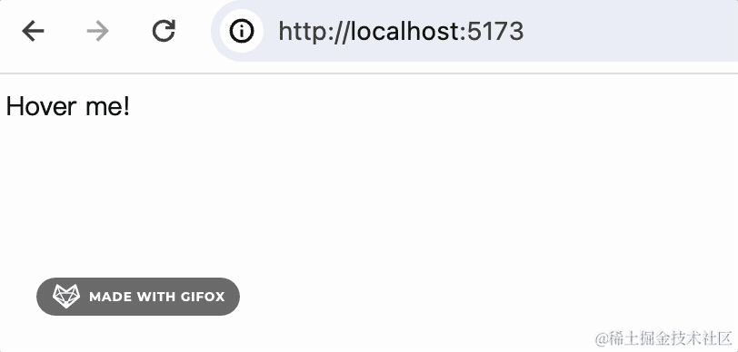

没啥问题。

## useScrolling

useScrolling 封装了滚动的状态：

```javascript
import { useRef } from "react";
import { useScrolling } from "react-use";

const App = () => {
  const scrollRef = useRef<HTMLDivElement>(null);
  const scrolling = useScrolling(scrollRef);

  return (
    <>
    {<div>{scrolling ? "滚动中.." : "没有滚动"}</div>}

    <div ref={scrollRef} style={{height: '200px', overflow: 'auto'}}>
      <div>guang</div>
      <div>guang</div>
      <div>guang</div>
      <div>guang</div>
      <div>guang</div>
      <div>guang</div>
      <div>guang</div>
      <div>guang</div>
      <div>guang</div>
      <div>guang</div>
      <div>guang</div>
      <div>guang</div>
      <div>guang</div>
      <div>guang</div>
      <div>guang</div>
      <div>guang</div>
      <div>guang</div>
      <div>guang</div>
      <div>guang</div>
      <div>guang</div>
      <div>guang</div>
      <div>guang</div>
    </div>
    </>
  );
};

export default App;
```

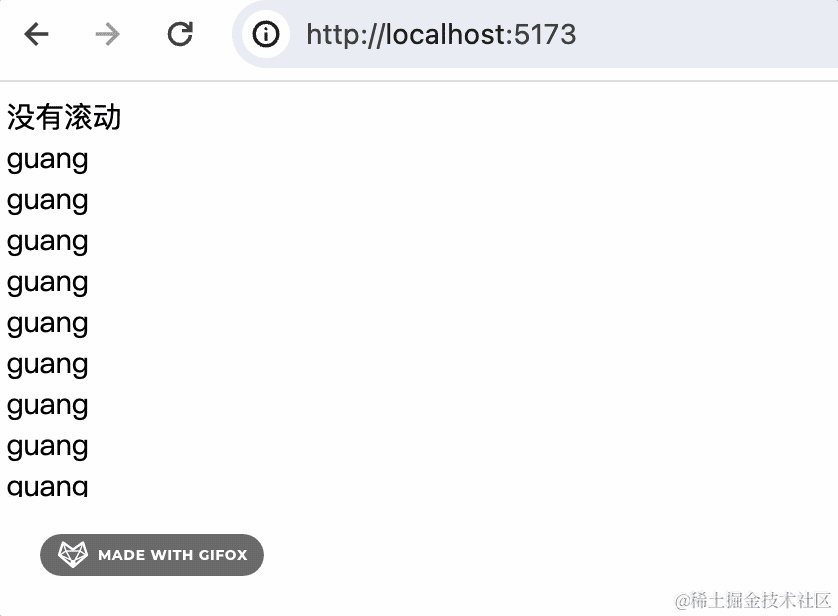

和刚才的 useHover 差不多，但是传入的是 ref。

我们实现下：

```javascript
import { RefObject, useEffect, useState } from 'react';

const useScrolling = (ref: RefObject<HTMLElement>): boolean => {
  const [scrolling, setScrolling] = useState<boolean>(false);

  useEffect(() => {
    if (ref.current) {
      let scollingTimer: number;

      const handleScrollEnd = () => {
        setScrolling(false);
      };

      const handleScroll = () => {
        setScrolling(true);
        clearTimeout(scollingTimer);
        scollingTimer = setTimeout(() => handleScrollEnd(), 150);
      };

      ref.current?.addEventListener('scroll', handleScroll);

      return () => {
        if (ref.current) {
          ref.current?.removeEventListener('scroll', handleScroll);
        }
      };
    }
    return () => {};
  }, [ref]);

  return scrolling;
};

export default useScrolling;
```
用 useState 创建个状态，给 ref 绑定 scroll 事件，scroll 的时候设置 scrolling 为 true：

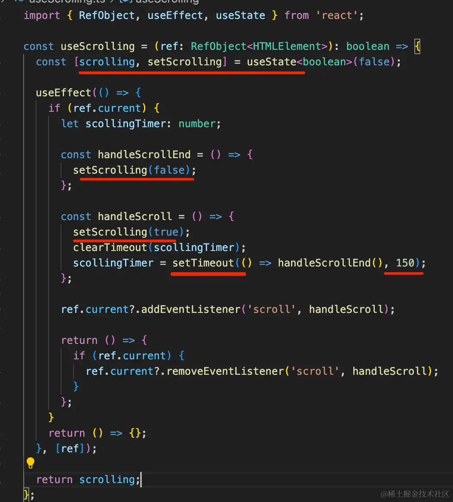

并且定时器 150ms 以后修改为 false。

这样只要不断滚动，就会一直重置定时器，结束滚动后才会设置为 false。

为啥 useHover 的时候是传入 element，通过 cloneElement 添加事件，而 useScroll 里是传入 ref，通过 addEventListener 添加事件呢？

确实，这两种实现方式都可以。

但是有区别，传入 element 通过 cloneElement 修改后返回的方式，因为会覆盖这个属性，所以要先调用下之前的事件处理函数。

而传入 ref 直接 addEventListener 的方式，则是直接把事件绑定在元素上了，可以绑定多个。

这两种选择用哪种方式实现都可以，差不多。

比如 useHover 在 react-use 里用的 React Element + cloneElement 的方式实现，而在 ahooks 就是用的 ref + addEventListener 实现的：

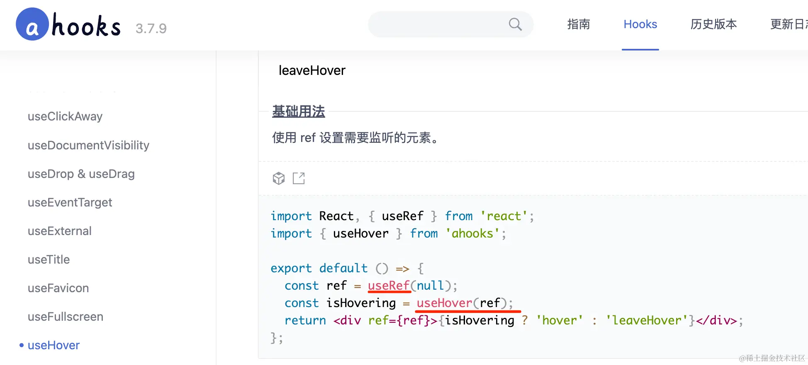

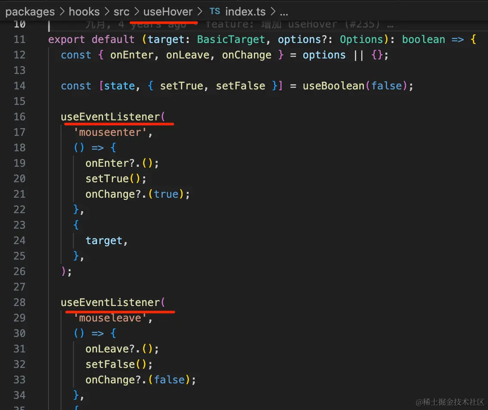

其实还有一种方式更常用，就是返回 hook 返回 onXxx 函数，调用者自己绑定。

比如 @floating-ui/react 包的 useInteractions，就是返回 props 对象，比如 {onClick: xxx} 让调用者自己绑定：

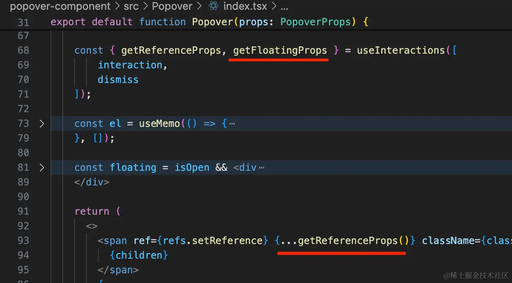

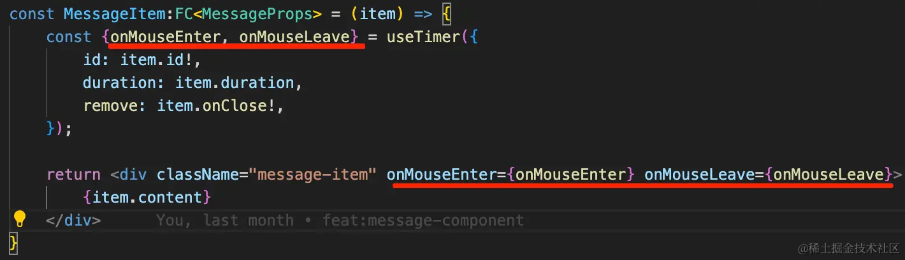

或者只返回事件处理函数：

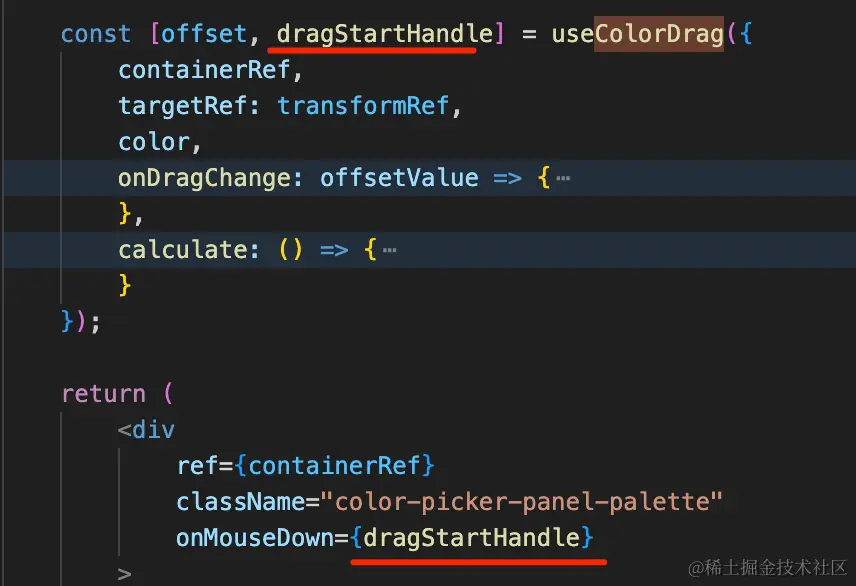

封装绑定事件的自定义 hook，总共就这三种封装方式。

案例代码上传了[小册仓库](https://github.com/QuarkGluonPlasma/react-course-code/tree/main/react-use-hook)
## 总结

组件里的逻辑可以抽成自定义 hook 来复用，在 react-use、ahooks 里也有很多通用 hook。

我们实现了 useMountedState、useLifecycles、useCookie、useHover、useScrolling 这些自定义 hook。

其中要注意的是返回的函数一般都用 useCallback 包裹，这样返回值作为 memo 组件的参数的时候，调用者不用再处理。

再就是绑定事件的 hook 有三种封装方式：

- 传入 React Element 然后 cloneElement
- 传入 ref 然后拿到 dom 执行 addEventListener
- 返回 props 对象或者事件处理函数，调用者自己绑定

自定义 hook 的封装方式都差不多，练习几个就会了。
