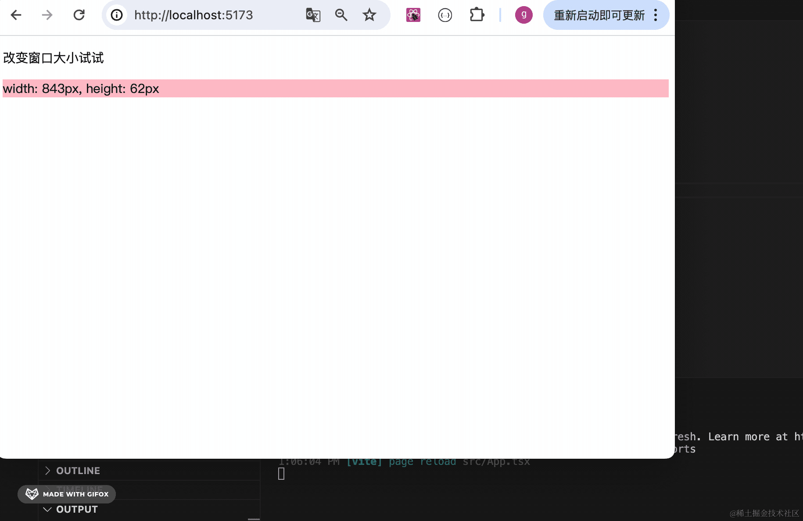
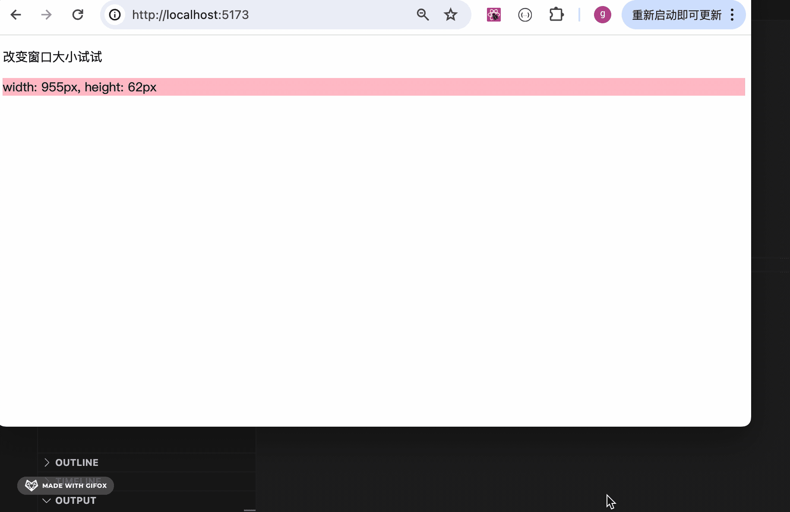
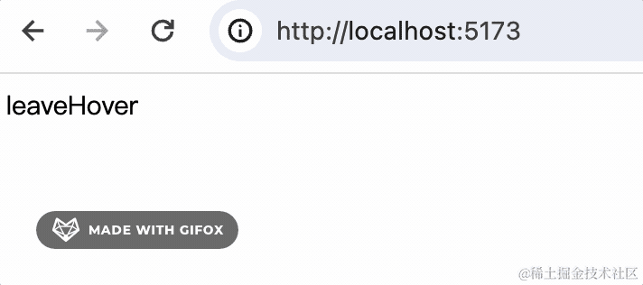
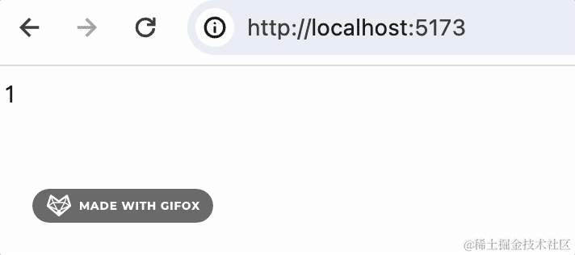
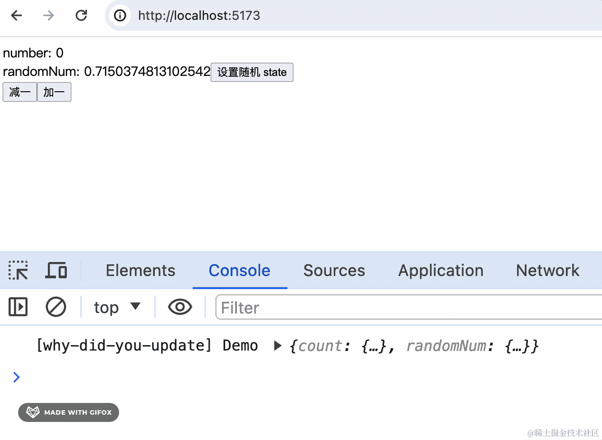
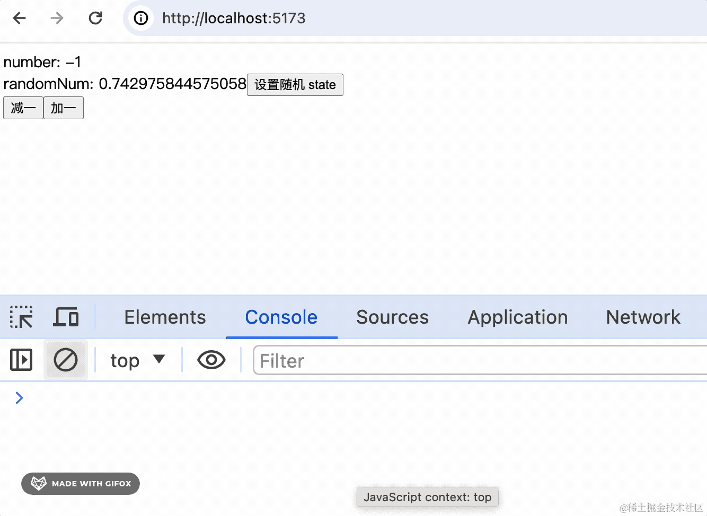
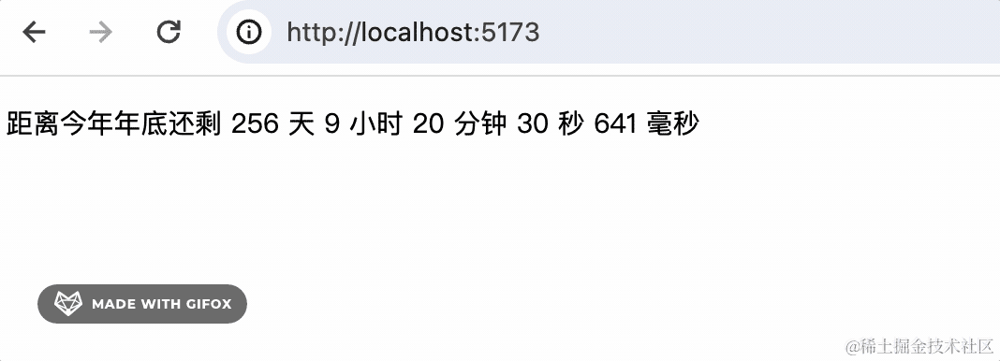

# 第22章—自定义hook练习（二）

上节写了几个 react-use 的 hook，这节来写几个 ahooks 里的。

新建个项目：

```
npx create-vite
```


进入项目，安装依赖，然后把服务跑起来：

```
npm install
npm run dev
```


去掉 index.css 和 StrictMode：


安装 ahooks：

```
npm install --save ahooks
```
## useSize

useSize 是用来获取 dom 尺寸的，并且在窗口大小改变的时候会实时返回新的尺寸

```javascript
import React, { useRef } from 'react';
import { useSize } from 'ahooks';

export default () => {
  const ref = useRef<HTMLDivElement>(null);
  const size = useSize(ref);
  return (
    <div ref={ref}>
      <p>改变窗口大小试试</p>
      <p>
        width: {size?.width}px, height: {size?.height}px
      </p>
    </div>
  );
};
```



我们来实现下：

```javascript
import ResizeObserver from 'resize-observer-polyfill';
import { RefObject, useEffect, useState } from 'react';

type Size = { width: number; height: number };

function useSize(targetRef: RefObject<HTMLElement>): Size | undefined {

    const [state, setState] = useState<Size | undefined>(
        () => {
            const el = targetRef.current;
            return el ? { width: el.clientWidth, height: el.clientHeight } : undefined
        },
    );

    useEffect(() => {
        const el = targetRef.current;

        if (!el) {
            return;
        }

        const resizeObserver = new ResizeObserver((entries) => {
            entries.forEach((entry) => {
                const { clientWidth, clientHeight } = entry.target;
                setState({ width: clientWidth, height: clientHeight });
            });
        });
        resizeObserver.observe(el);

        return () => {
            resizeObserver.disconnect();
        };
    }, []);

    return state;
}

export default useSize;
```
用 useState 创建 state，初始值是传入的 ref 元素的宽高。

这里取 clientHeight，也就是不包含边框的高度。

网页里的各种距离、尺寸可以看[图解网页的各种距离](https://juejin.cn/book/7294082310658326565/section/7357716194742583330)那节。

然后用 ResizeObserver 监听元素尺寸的变化，改变的时候 setState 触发重新渲染。


这里为了兼容，用了 resize-observer-polyfill

```
npm i --save resize-observer-polyfill
```

换成我们实现的试一下：


没啥问题：



## useHover

上节用用过 react-use 的 useHover，它是传入 React Element （或者返回 React Element 的函数）的方式：

```javascript
import {useHover} from 'react-use';

const App = () => {
  const element = (hovered: boolean) =>
    <div>
      Hover me! {hovered && 'Thanks'}
    </div>;

  const [hoverable, hovered] = useHover(element);

  return (
    <div>
      {hoverable}
      <div>{hovered ? 'HOVERED' : ''}</div>
    </div>
  );
};

export default App;
```


而 ahooks 里的 [useHover](https://ahooks.gitee.io/zh-CN/hooks/use-hover) 是这样用的：

```javascript
import React, { useRef } from 'react';
import { useHover } from 'ahooks';

export default () => {
  const ref = useRef<HTMLDivElement>(null);
  const isHovering = useHover(ref);
  return <div ref={ref}>{isHovering ? 'hover' : 'leaveHover'}</div>;
};
```
传入的是 ref。



实现下：

```javascript
import { RefObject, useEffect, useState } from 'react';

export interface Options {
  onEnter?: () => void;
  onLeave?: () => void;
  onChange?: (isHovering: boolean) => void;
}

export default (ref: RefObject<HTMLElement>, options?: Options): boolean => {
    const { onEnter, onLeave, onChange } = options || {};

    const [isEnter, setIsEnter] = useState<boolean>(false);

    useEffect(() => {
        ref.current?.addEventListener('mouseenter', () => {
            onEnter?.();
            setIsEnter(true);
            onChange?.(true);
        });
    
        ref.current?.addEventListener('mouseleave', () => {
            onLeave?.();
            setIsEnter(false);
            onChange?.(false);
        });
    }, [ref]);

    return isEnter;
};
```

上节讲过事件绑定类的 hook 有三种写法，之前用传入 React Element + cloneElement 的方式实现过，这次用 ref + addEventListener 实现的。


测试下：


没啥问题。

## useTimeout

讲闭包陷阱那节我们实现过定时器的 hook：

```javascript
import React, { useState } from 'react';
import { useTimeout } from 'ahooks';

export default () => {
  const [state, setState] = useState(1);
  useTimeout(() => {
    setState(state + 1);
  }, 3000);

  return <div>{state}</div>;
};
```
它要保证只能跑一次，不然计时会不准。



ahooks 的实现和我们之前实现一样：

```javascript
import { useCallback, useEffect, useRef } from 'react';

const useTimeout = (fn: () => void, delay?: number) => {

  const fnRef = useRef<Function>(fn);

  fnRef.current = fn;

  const timerRef = useRef<number>();

  const clear = useCallback(() => {
    if (timerRef.current) {
      clearTimeout(timerRef.current);
    }
  }, []);

  useEffect(() => {
    timerRef.current = setTimeout(fnRef.current, delay);

    return clear;
  }, [delay]);

  return clear;
};

export default useTimeout;
```
首先 useRef 保存回调函数，每次调用都会更新这个函数，避免闭包陷阱（函数里引用之前的 state）：


setTimeout 执行从 fnRef.current 取的最新的函数。

要不要在渲染函数里直接改 ref.current，其实都可以，[闭包陷阱那节](https://juejin.cn/book/7294082310658326565/section/7298292751051784230)也讲过。文档里不建议，但是很多库都是直接改的。


可以包一层 useLayoutEffect 或者 useEffect，这里我们就可以改了。

然后用 useRef 保存 timer 引用，方便 clear 函数里拿到它来 clearTimeout：


测试下：


没啥问题。

## useWhyDidYouUpdate

props 变了会导致组件重新渲染，而 [useWhyDidYouUpdate](https://ahooks.gitee.io/zh-CN/hooks/use-why-did-you-update) 就是用来打印是哪些 props 改变导致的重新渲染：

用下试试：

```javascript
import { useWhyDidYouUpdate } from 'ahooks';
import React, { useState } from 'react';

const Demo: React.FC<{ count: number }> = (props) => {
  const [randomNum, setRandomNum] = useState(Math.random());

  useWhyDidYouUpdate('Demo', { ...props, randomNum });

  return (
    <div>
      <div>
        <span>number: {props.count}</span>
      </div>
      <div>
        randomNum: {randomNum}
        <button onClick={() => setRandomNum(Math.random)}>
          设置随机 state
        </button>
      </div>
    </div>
  );
};

export default () => {
  const [count, setCount] = useState(0);

  return (
    <div>
      <Demo count={count} />
      <div>
        <button onClick={() => setCount((prevCount) => prevCount - 1)}>减一</button>
        <button onClick={() => setCount((prevCount) => prevCount + 1)}>加一</button>
      </div>
    </div>
  );
};
```
Demo 组件有 count 的 props，有 randomNum 的 state。

当 count 导致组件重新渲染时：



当 randomNum 导致组件重新渲染时：



都能打印出值从 from 改变到 to 导致的。

它的实现其实很简单，我们来写一下：

```javascript
import { useEffect, useRef } from 'react';

export type IProps = Record<string, any>;

export default function useWhyDidYouUpdate(componentName: string, props: IProps) {
  const prevProps = useRef<IProps>({});

  useEffect(() => {
    if (prevProps.current) {
      const allKeys = Object.keys({ ...prevProps.current, ...props });
      const changedProps: IProps = {};

      allKeys.forEach((key) => {
        if (!Object.is(prevProps.current[key], props[key])) {
          changedProps[key] = {
            from: prevProps.current[key],
            to: props[key],
          };
        }
      });

      if (Object.keys(changedProps).length) {
        console.log('[why-did-you-update]', componentName, changedProps);
      }
    }

    prevProps.current = props;
  });
}
```
Record<string, any> 是任意的对象的 ts 类型。

核心就是 useRef 保存 props 或者其他值，当下次渲染的时候，拿到新的值和上次的对比下，打印值的变化：


props 可以传入任意 props、state 或者其他值：


实现很简单，但是比较有用的一个 hook。

## useCountDown

这个是用来获取倒计时的：

```javascript
import { useCountDown } from 'ahooks';

export default () => {
  const [countdown, formattedRes] = useCountDown({
    targetDate: `${new Date().getFullYear()}-12-31 23:59:59`,
  });

  const { days, hours, minutes, seconds, milliseconds } = formattedRes;

  return (
    <p>
      距离今年年底还剩 {days} 天 {hours} 小时 {minutes} 分钟 {seconds} 秒 {milliseconds} 毫秒
    </p>
  );
};
```
比如获取到今年年底的倒计时。



我们来实现下：

```javascript
import dayjs from 'dayjs';
import { useEffect, useMemo, useRef, useState } from 'react';

export type TDate = dayjs.ConfigType;

export interface Options {
  leftTime?: number;
  targetDate?: TDate;
  interval?: number;
  onEnd?: () => void;
}

export interface FormattedRes {
  days: number;
  hours: number;
  minutes: number;
  seconds: number;
  milliseconds: number;
}

const calcLeft = (target?: TDate) => {
  if (!target) {
    return 0;
  }

  const left = dayjs(target).valueOf() - Date.now();
  return left < 0 ? 0 : left;
};

const parseMs = (milliseconds: number): FormattedRes => {
  return {
    days: Math.floor(milliseconds / 86400000),
    hours: Math.floor(milliseconds / 3600000) % 24,
    minutes: Math.floor(milliseconds / 60000) % 60,
    seconds: Math.floor(milliseconds / 1000) % 60,
    milliseconds: Math.floor(milliseconds) % 1000,
  };
};

const useCountdown = (options: Options = {}) => {
    const { leftTime, targetDate, interval = 1000, onEnd } = options || {};

    const memoLeftTime = useMemo<TDate>(() => {
        return leftTime && leftTime > 0 ? Date.now() + leftTime : undefined;
    }, [leftTime]);

    const target = 'leftTime' in options ? memoLeftTime : targetDate;

    const [timeLeft, setTimeLeft] = useState(() => calcLeft(target));

    const onEndRef = useRef(onEnd);
    onEndRef.current = onEnd;

    useEffect(() => {
        if (!target) {
            setTimeLeft(0);
            return;
        }

        setTimeLeft(calcLeft(target));

        const timer = setInterval(() => {
            const targetLeft = calcLeft(target);
            setTimeLeft(targetLeft);
            if (targetLeft === 0) {
                clearInterval(timer);
                onEndRef.current?.();
            }
        }, interval);

        return () => clearInterval(timer);
    }, [target, interval]);

    const formattedRes = useMemo(() => parseMs(timeLeft), [timeLeft]);

    return [timeLeft, formattedRes] as const;
};

export default useCountdown;
```
代码比较多，一部分一部分来看。


Options 是参数的类型，可以传入 leftTime 剩余时间，也可以传入目标日期值 targetDate。

interval 是倒计时变化的时间间隔，默认 1s。

onEnd 是倒计时结束的回调。

FormattedRes 是返回的格式化后的日期。

TDate 是 dayjs 允许的传入的日期类型。

然后 leftTime 和 targetDate 只需要取一个。

如果是 leftTime 那 Date.now() 加上 targetDate 就是目标日期。否则，就用传入的 targetDate。


onEnd 的函数也是要用 useRef 保存，然后每次更新 ref.current，取的时候取 ref.current。

这也是为了避免闭包陷阱的。


核心部分是 useState 创建一个 state，在初始和每次定时器都计算一次剩余时间：


这个就是当前日期到目标日期的差值：


然后把它格式化一下就好了：


倒计时的逻辑很简单，就是通过定时器，每次计算下当前日期和目标日期的差值，返回格式化以后的结果。

注意传入的回调函数都要用 useRef 包裹下，用的时候取 ref.current，避免闭包陷阱。

测试下：


没啥问题。

案例代码上传了[小册仓库](https://github.com/QuarkGluonPlasma/react-course-code/tree/main/ahooks-hook)
## 总结

这节我们写了几个 ahooks 里的自定义 hook。

useSize：拿到元素尺寸，通过 ResizeObserver 监听尺寸变动返回新的尺寸。

useHover：用 ref + addEventListener 实现的 hover 事件。

useTimeout：对 setTimeout 的封装，通过 useRef 保存 fn 避免了闭包陷阱。

useWhyDidYouUpdate：打印 props 或者 state 等的变化，排查引起组件重新渲染的原因，原理很简单，就是通过 useRef 保存之前的值，和当前渲染时的值对比

useCountDown：倒计时，通过当前时间和目标时间的差值实现，基于 dayjs。

写完这些 hook，相信你对自定义 hook 的封装更加得心应手了。
