# 第23章—用react-spring做弹簧动画

网页中经常会见到一些动画，动画可以让产品的交互体验更好。

一般的动画我们会用 css 的 animation 和 transition 来做，但当涉及到多个元素的时候，事情就会变得复杂。

比如下面这个动画：


横线和竖线依次做动画，最后是笑脸的动画。

这么多个元素的动画如何来安排顺序呢？

如果用 css 动画来做，那要依次设置不同的动画开始时间，就很麻烦。

这种就需要用到专门的动画库了，比如 react-spring。

我们创建个 react 项目：

```
npx create-react-app --template=typescript react-spring-test
```

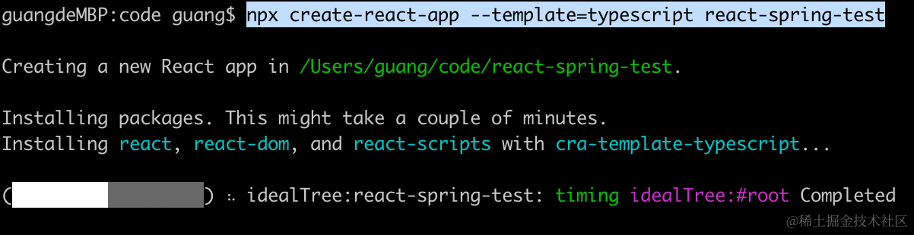

安装 react-spring 的包：

```
npm install --save @react-spring/web
```

然后改下 App.tsx

```javascript
import { useSpringValue, animated, useSpring } from '@react-spring/web'
import { useEffect } from 'react';
import './App.css';

export default function App() {
  const width = useSpringValue(0, {
    config: {
      duration: 2000
    }
  });

  useEffect(() => {
    width.start(300);
  }, []);

  return <animated.div className="box" style={{ width }}></animated.div>
}
```
还有 App.css

```css
.box {
  background: blue;
  height: 100px;
}
```
跑一下开发服务：

```
npm run start
```
可以看到，box 会在 2s 内完成 width 从 0 到 300 的动画：

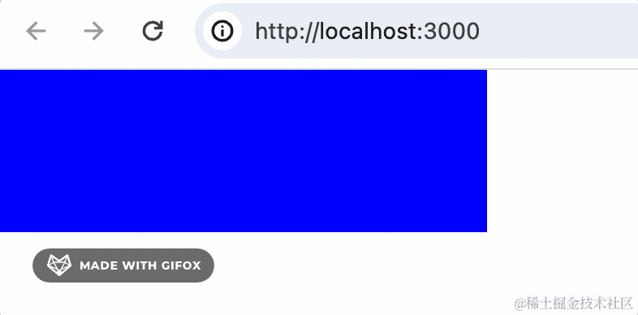

此外，你还可以不定义 duration，而是定义摩擦力等参数：

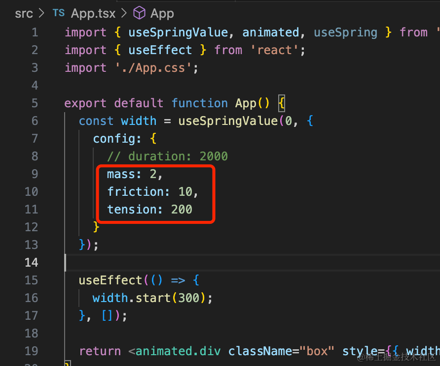

```javascript
const width = useSpringValue(0, {
    config: {
      // duration: 2000
      mass: 2,
      friction: 10,
      tension: 200
    }
});
```
先看效果：

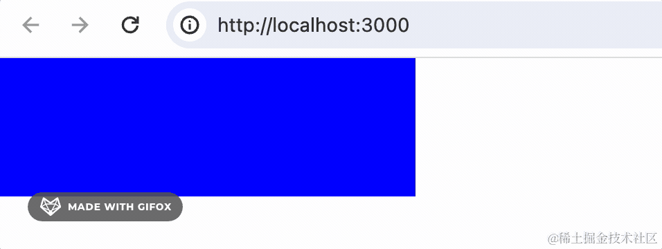

是不是像弹簧一样？

弹簧的英文是 spring，这也是为什么这个库叫做 react-spring

以及为什么 logo 是这样的：

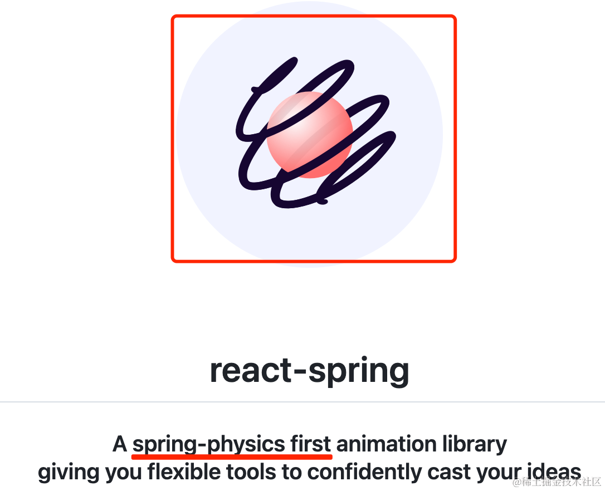

它主打的就是这种弹簧动画。

当然，你不想做这种动画，直接指定 duration 也行，那就是常规的动画了。

回过头来看下这三个参数：

- mass： 质量（也就是重量），质量越大，回弹惯性越大，回弹的距离和次数越多
- tension: 张力，弹簧松紧程度，弹簧越紧，回弹速度越快
- friction：摩擦力，增加点阻力可以抵消质量和张力的效果

这些参数设置不同的值，弹簧动画的效果就不一样：

tension: 400


tension: 100


可以看到，确实 tension（弹簧张力）越大，弹簧越紧，回弹速度越快。

mass: 2

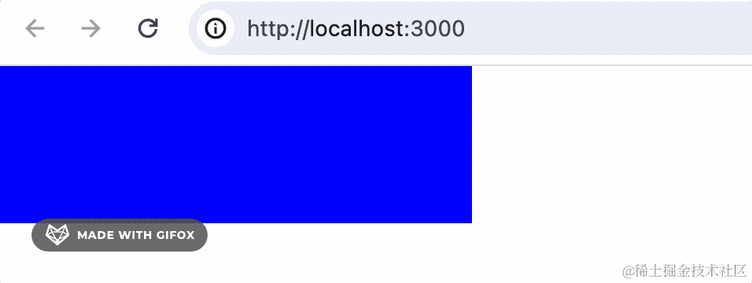

mass: 20

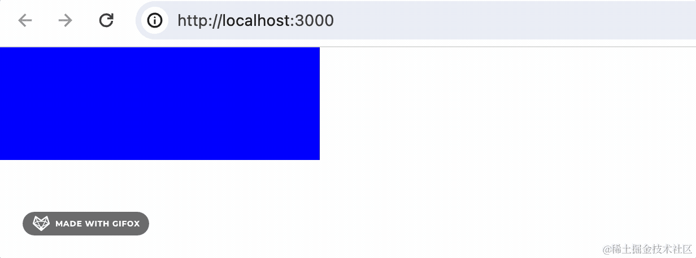

可以看到，mass（质量越大），惯性越大，回弹距离和次数越大。

friction: 10

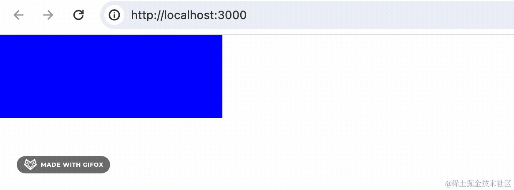

friction: 80

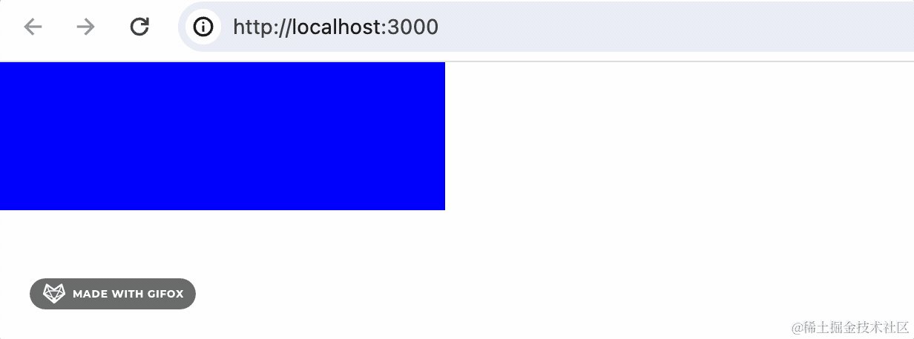

可以看到，firction（摩擦力）越大，tension 和 mass 的效果抵消的越多。

这就是弹簧动画的 3 个参数。

回过头来，我们继续看其它的 api。

如果有多个 style 都要变化呢？

这时候就不要用 useSpringValue 了，而是用 useSpring：

```javascript
import { useSpring, animated } from '@react-spring/web'
import './App.css';

export default function App() {
  const styles = useSpring({
    from: {
      width: 0,
      height: 0
    },
    to: {
      width: 200,
      height: 200
    },
    config: {
      duration: 2000
    }
  });

  return <animated.div className="box" style={{ ...styles }}></animated.div>
}
```
用 useSpring 指定 from 和 to，并指定 duration。

动画效果如下：


当然，也可以不用 duration 的方式：

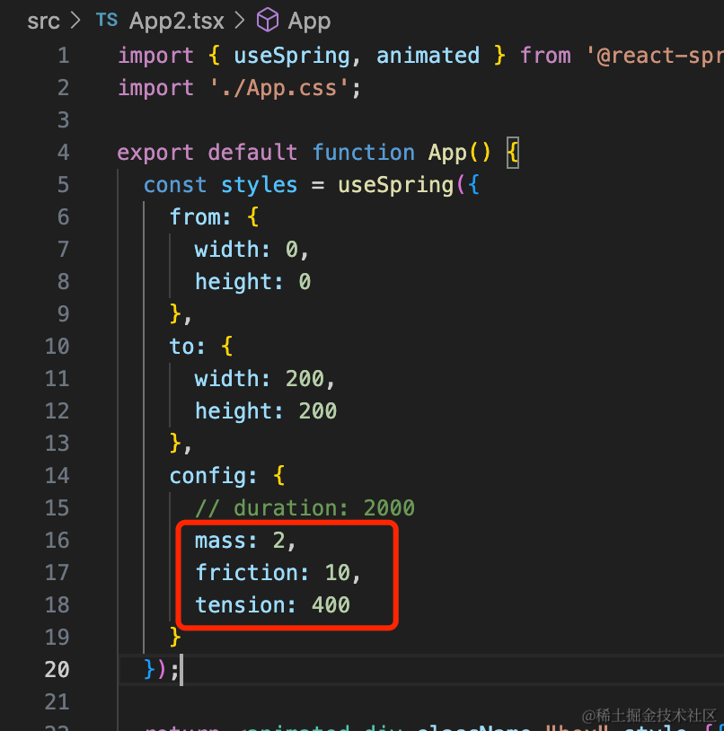

而是用弹簧动画的效果：

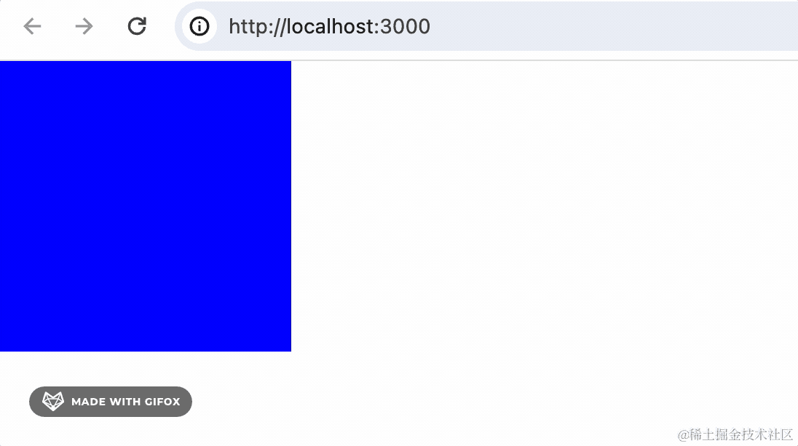

useSpring 还有另外一种传入函数的重载，这种重载会返回 [styles, api] 两个参数：

```javascript
import { useSpring, animated } from '@react-spring/web'
import './App.css';

export default function App() {
  const [styles, api] = useSpring(() => {
    return {
      from: {
        width: 100,
        height: 100
      },
      config: {
        // duration: 2000
        mass: 2,
        friction: 10,
        tension: 400
      }
    }
  });

  function clickHandler() {
    api.start({
      width: 200,
      height: 200
    });
  }

  return <animated.div className="box" style={{ ...styles }} onClick={clickHandler}></animated.div>
}
```
可以用返回的 api 来控制动画的开始。

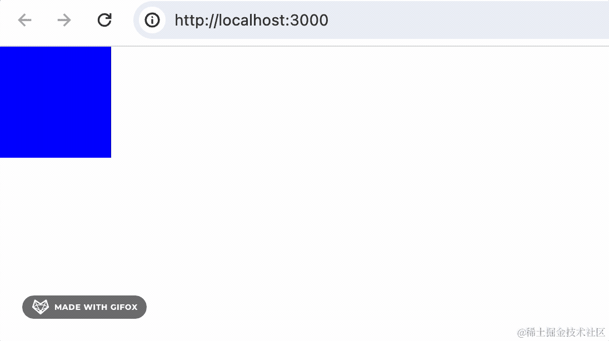

那如果有多个元素都要同时做动画呢？

这时候就用 useSprings：

```javascript
import { useSprings, animated } from '@react-spring/web'
import './App.css';

export default function App() {
  const [springs, api] = useSprings(
    3,
    () => ({
      from: { width: 0 },
      to: { width: 300 },
      config: {
        duration: 1000
      }
    })
  )

  return <div>
    {springs.map(styles => (
      <animated.div style={styles} className='box'></animated.div>
    ))}
  </div>
}
```
在 css 里加一下 margin：

```css
.box {
  background: blue;
  height: 100px;
  margin: 10px;
}
```
渲染出来是这样的：

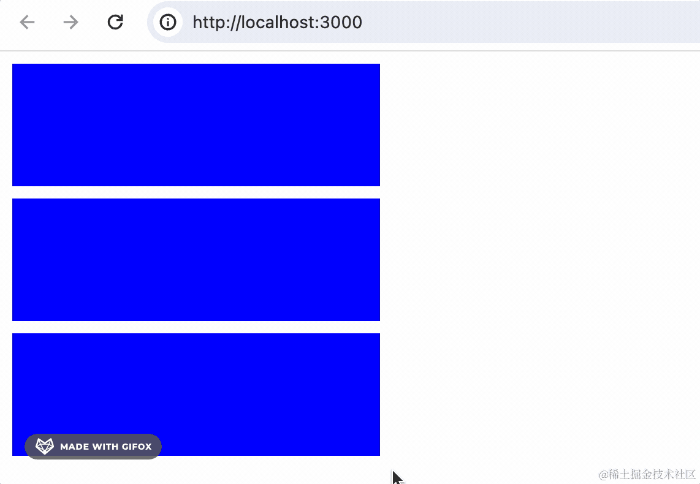

当你指定了 to，那会立刻执行动画，或者不指定 to，用 api.start 来开始动画：

```javascript
import { useSprings, animated } from '@react-spring/web'
import './App.css';
import { useEffect } from 'react';

export default function App() {
  const [springs, api] = useSprings(
    3,
    () => ({
      from: { width: 0 },
      config: {
        duration: 1000
      }
    })
  )

  useEffect(() => {
    api.start({ width: 300 });
  }, [])

  return <div>
    {springs.map(styles => (
      <animated.div style={styles} className='box'></animated.div>
    ))}
  </div>
}
```
那如果多个元素的动画是依次进行的呢？

这时候要用 useTrail

```javascript
import { animated, useTrail } from '@react-spring/web'
import './App.css';
import { useEffect } from 'react';

export default function App() {
  const [springs, api] = useTrail(
    3,
    () => ({
      from: { width: 0 },
      config: {
        duration: 1000
      }
    })
  )

  useEffect(() => {
    api.start({ width: 300 });
  }, [])

  return <div>
    {springs.map(styles => (
      <animated.div style={styles} className='box'></animated.div>
    ))}
  </div>
}
```

用起来很简单，直接把 useSprings 换成 useTrail 就行：


可以看到，动画会依次执行，而不是同时。

接下来我们实现下文章开头的这个动画效果：


横线和竖线的动画就是用 useTrail 实现的。

而中间的笑脸使用 useSprings 同时做动画。

那多个动画如何安排顺序的呢？

用 useChain：

```javascript
import { animated, useChain, useSpring, useSpringRef, useSprings, useTrail } from '@react-spring/web'
import './App.css';

export default function App() {

  const api1 = useSpringRef()
  
  const [springs] = useTrail(
    3,
    () => ({
      ref: api1,
      from: { width: 0 },
      to: { width: 300 },
      config: {
        duration: 1000
      }
    }),
    []
  )

  const api2 = useSpringRef()
  
  const [springs2] = useSprings(
    3,
    () => ({
      ref: api2,
      from: { height: 100 },
      to: { height: 50},
      config: {
        duration: 1000
      }
    }),
    []
  )

  useChain([api1, api2], [0, 1], 500)

  return <div>
    {springs.map((styles1, index) => (
      <animated.div style={{...styles1, ...springs2[index]}} className='box'></animated.div>
    ))}
  </div>
}
```

我们用 useSpringRef 拿到两个动画的 api，然后用 useChain 来安排两个动画的顺序。

useChain 的第二个参数指定了 0 和 1，第三个参数指定了 500，那就是第一个动画在 0s 开始，第二个动画在 500ms 开始。

如果第三个参数指定了 3000，那就是第一个动画在 0s 开始，第二个动画在 3s 开始。

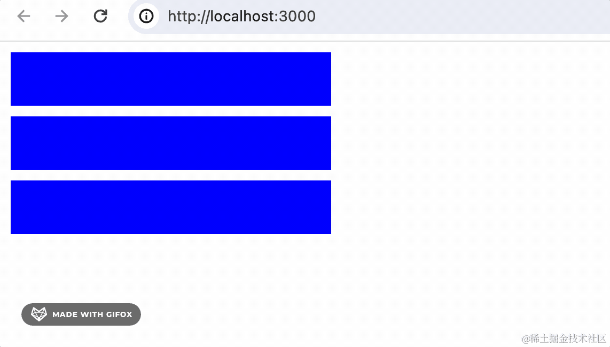

可以看到，确实第一个动画先执行，然后 0.5s 后第二个动画执行。

这样，就可以实现那个笑脸动画了。

我们来写一下：

```javascript
import { useTrail, useChain, useSprings, animated, useSpringRef } from '@react-spring/web'
import './styles.css'
import { useEffect } from 'react'

const STROKE_WIDTH = 0.5

const MAX_WIDTH = 150
const MAX_HEIGHT = 100

export default function App() {

  const gridApi = useSpringRef()

  const gridSprings = useTrail(16, {
    ref: gridApi,
    from: {
      x2: 0,
      y2: 0,
    },
    to: {
      x2: MAX_WIDTH,
      y2: MAX_HEIGHT,
    },
  })

  useEffect(() => {
    gridApi.start();
  });

  return (
      <div className='container'>
        <svg viewBox={`0 0 ${MAX_WIDTH} ${MAX_HEIGHT}`}>
          <g>
            {gridSprings.map(({ x2 }, index) => (
              <animated.line
                x1={0}
                y1={index * 10}
                x2={x2}
                y2={index * 10}
                key={index}
                strokeWidth={STROKE_WIDTH}
                stroke="currentColor"
              />
            ))}
            {gridSprings.map(({ y2 }, index) => (
              <animated.line
                x1={index * 10}
                y1={0}
                x2={index * 10}
                y2={y2}
                key={index}
                strokeWidth={STROKE_WIDTH}
                stroke="currentColor"
              />
            ))}
          </g>
        </svg>
      </div>
  )
}
```
当用 useSpringRef 拿到动画引用时，需要手动调用 start 来开始动画。

用 useTrail 来做从 0 到指定 width、height 的动画。

然后分别遍历它，拿到 x、y 的值，来绘制横线和竖线。

用 svg 的 line 来画线，设置 x1、y1、x2、y2 就是一条线。

效果是这样的：

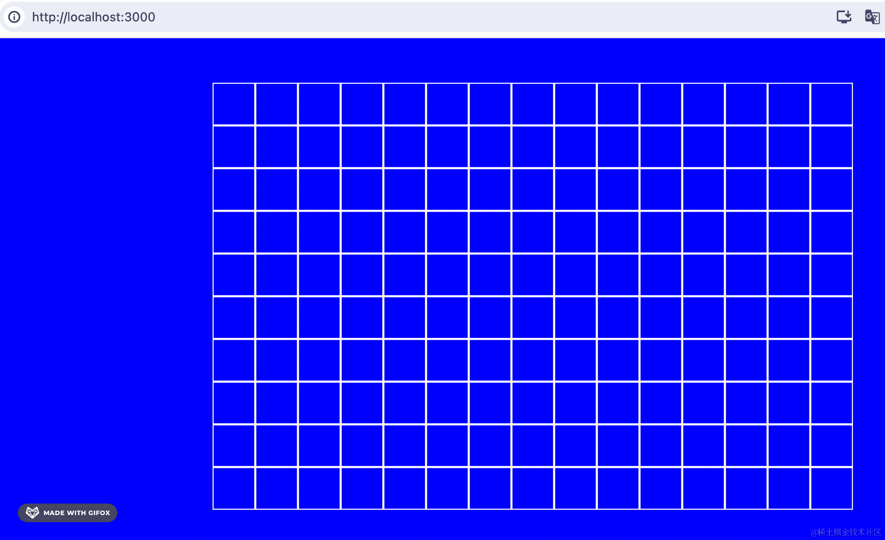

当你注释掉横线或者竖线，会更明显一点：

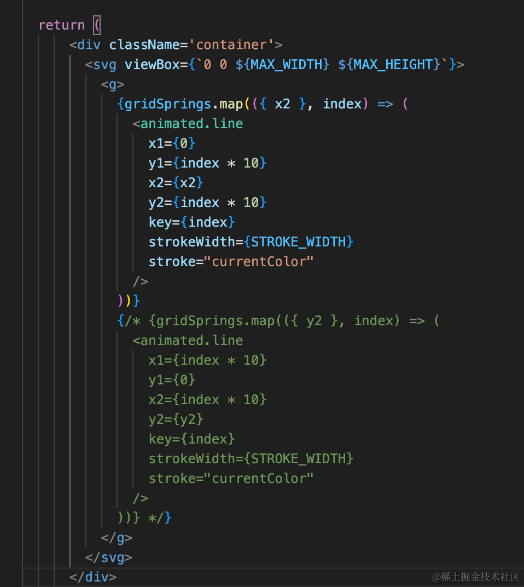

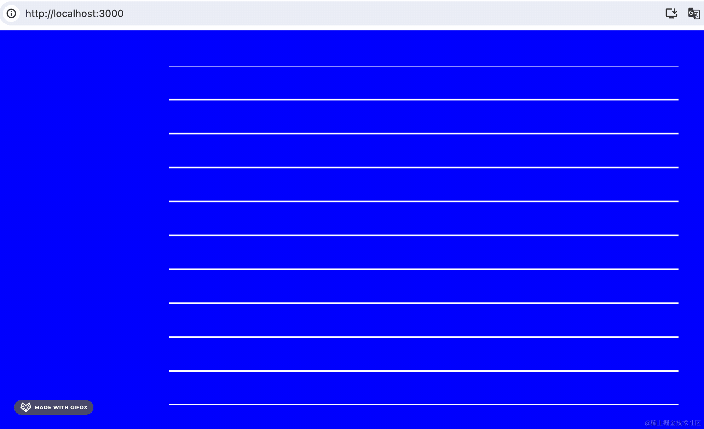

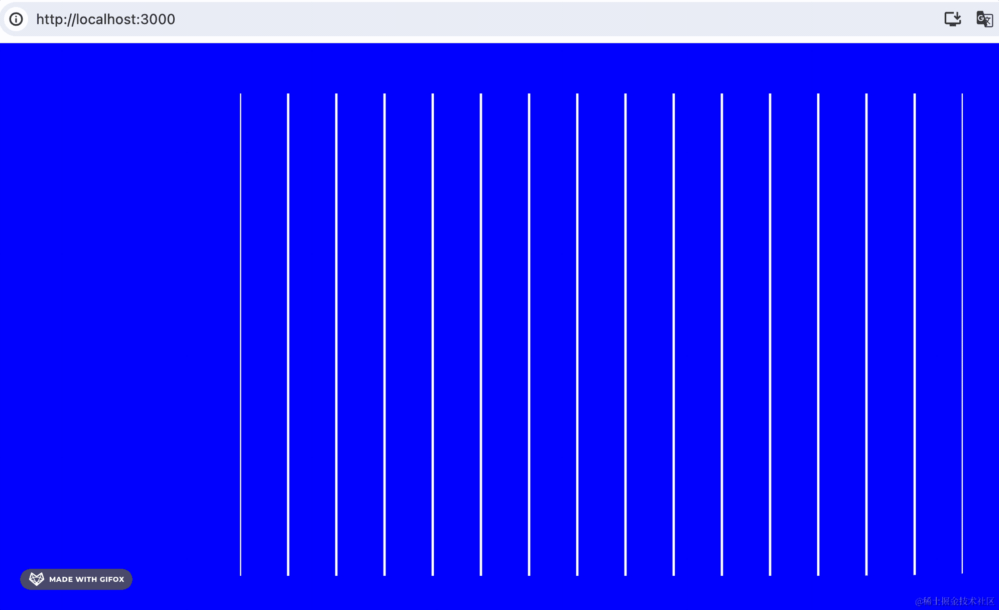

然后再做笑脸的动画，这个就是用 rect 在不同画几个方块，做一个 scale 从 0 到 1 的动画：

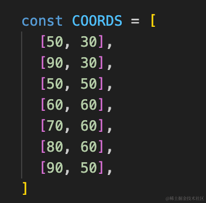

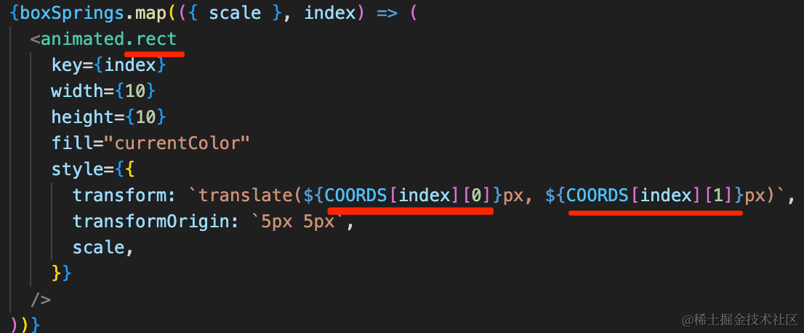

动画用弹簧动画的方式，指定 mass（质量） 和 tension（张力），并且每个 box 都有不同的 delay：

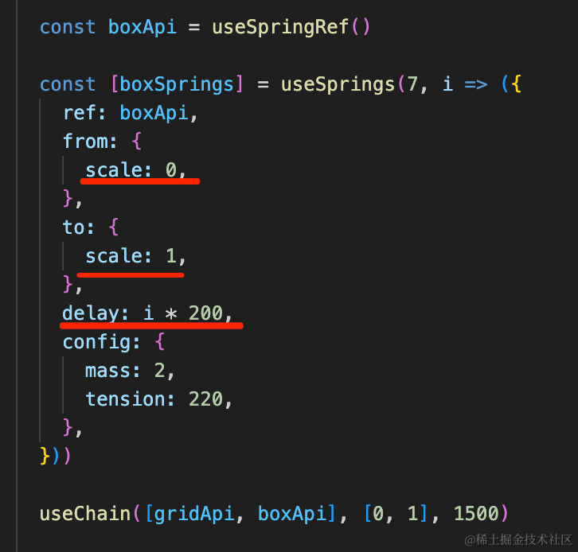

并用 useChain 来把两个动画串联执行。

```javascript
import { useTrail, useChain, useSprings, animated, useSpringRef } from '@react-spring/web'
import './styles.css'

const COORDS = [
  [50, 30],
  [90, 30],
  [50, 50],
  [60, 60],
  [70, 60],
  [80, 60],
  [90, 50],
]

const STROKE_WIDTH = 0.5

const MAX_WIDTH = 150
const MAX_HEIGHT = 100

export default function App() {

  const gridApi = useSpringRef()

  const gridSprings = useTrail(16, {
    ref: gridApi,
    from: {
      x2: 0,
      y2: 0,
    },
    to: {
      x2: MAX_WIDTH,
      y2: MAX_HEIGHT,
    },
  })

  const boxApi = useSpringRef()

  const [boxSprings] = useSprings(7, i => ({
    ref: boxApi,
    from: {
      scale: 0,
    },
    to: {
      scale: 1,
    },
    delay: i * 200,
    config: {
      mass: 2,
      tension: 220,
    },
  }))

  useChain([gridApi, boxApi], [0, 1], 1500)

  return (
      <div className='container'>
        <svg viewBox={`0 0 ${MAX_WIDTH} ${MAX_HEIGHT}`}>
          <g>
            {gridSprings.map(({ x2 }, index) => (
              <animated.line
                x1={0}
                y1={index * 10}
                x2={x2}
                y2={index * 10}
                key={index}
                strokeWidth={STROKE_WIDTH}
                stroke="currentColor"
              />
            ))}
            {gridSprings.map(({ y2 }, index) => (
              <animated.line
                x1={index * 10}
                y1={0}
                x2={index * 10}
                y2={y2}
                key={index}
                strokeWidth={STROKE_WIDTH}
                stroke="currentColor"
              />
            ))}
          </g>
          {boxSprings.map(({ scale }, index) => (
            <animated.rect
              key={index}
              width={10}
              height={10}
              fill="currentColor"
              style={{
                transform: `translate(${COORDS[index][0]}px, ${COORDS[index][1]}px)`,
                transformOrigin: `5px 5px`,
                scale,
              }}
            />
          ))}
        </svg>
      </div>
  )
}
```
这样，整个动画就完成了：


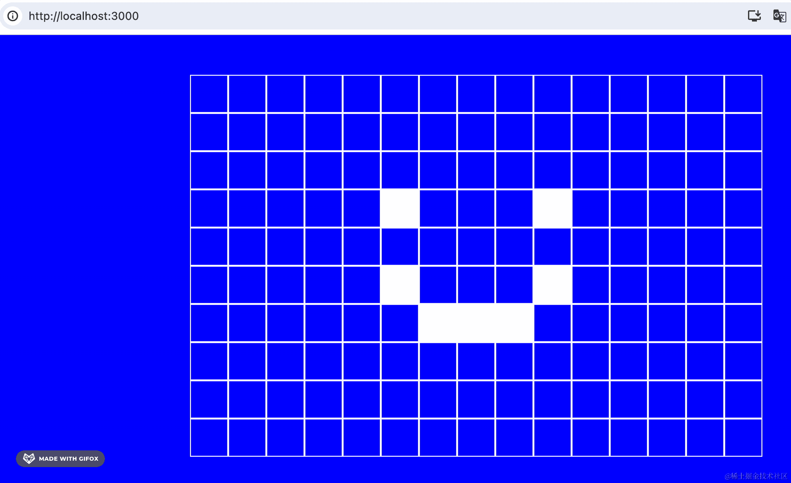

这个动画，我们综合运用了 useSprings、useTrail、useSpringRef、useChain 这些 api。

把这个动画写一遍，react-spring 就算是掌握的可以了。

案例代码上传了[小册仓库](https://github.com/QuarkGluonPlasma/react-course-code/tree/main/react-spring-test)

其实这是 react-spring 的 [官方案例](https://www.react-spring.dev/examples) 里的一个，基础 api 会了之后，大家可以把这些案例都过一遍。

## 总结

我们学了用 react-spring 来做动画。

react-spring 主打的是弹簧动画，就是类似弹簧那种回弹效果。

只要指定 mass（质量）、tension（张力）、friction（摩擦力）就可以了。

- mass 质量：决定回弹惯性，mass 越大，回弹的距离和次数越多。

- tension 张力：弹簧松紧程度，弹簧越紧，回弹速度越快。

- friction：摩擦力： 可以抵消质量和张力的效果

弹簧动画不需要指定时间。

当然，你也可以指定 duration 来做那种普通动画。

react-spring 有不少 api，分别用于单个、多个元素的动画：

- useSpringValue：指定单个属性的变化。
- useSpring：指定多个属性的变化
- useSprings：指定多个元素的多个属性的变化，动画并行执行
- useTrial：指定多个元素的多个属性的变化，动画依次执行
- useSpringRef：用来拿到每个动画的 ref，可以用来控制动画的开始、暂停等
- useChain：串行执行多个动画，每个动画可以指定不同的开始时间

掌握了这些，就足够基于 react-spring 做动画了。
