# 第27章—用CSSModules避免样式冲突

每个组件里有 js 逻辑和 css 样式。

js 逻辑是通过 es module 做了模块化的，但是 css 并没有。

所以不同组件样式都在全局，很容易冲突。

那 css 如何也实现像 js 类似的模块机制呢？

最容易想到的是通过命名空间来区分。

比如 aaa 下面的 bbb 下的 button，就可以加一个 aaa__bb__btn 的 class。

而 ccc 下的 button，就可以加一个 ccc__btn 的 class。

常用的 BEM 命名规范就是解决这个问题的。

BEM 是 block、element、modifier 这三部分：

- 块（Block）：块是一个独立的实体，代表一个可重用的组件或模块。

块的类名应该使用单词或短语，并使用连字符（-）作为分隔符。例如：.header、.left-menu。

- 元素（Element）：元素是块的组成部分，不能独立存在。

元素的类名应该使用双下划线（__）作为分隔符，连接到块的类名后面。例如：.left-menu__item、.header__logo。

- 修饰符（Modifier）：修饰符用于描述块或元素的不同状态或变体，用来更改外观或行为。

修饰符的类名应该使用双连字符（--）作为分隔符，连接到块或元素的类名后面。例如：.left-menu__item--active、.header__logo--small。

但是，BEM 规范毕竟要靠人为来约束，不能保证绝对不会冲突。

所以最好是通过工具来做模块化，比如 CSS Modules。

我们先用一下 css modules 再介绍。

```
npx create-vite
```
用 vite 创建个 react 项目。

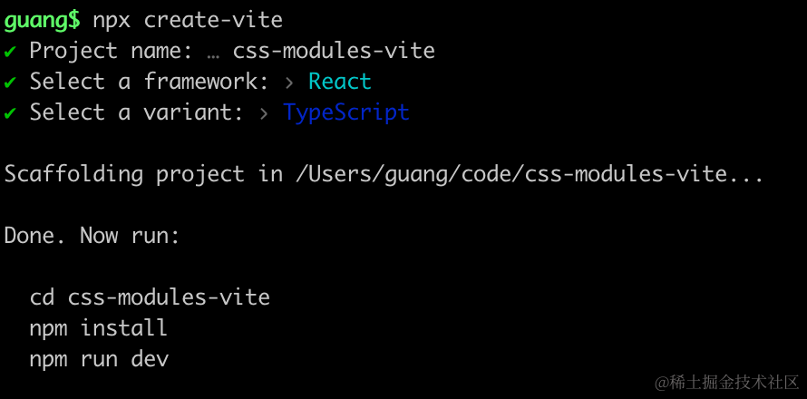

进入项目，安装依赖，把开发服务跑起来：

```
npm install
npm run dev
```

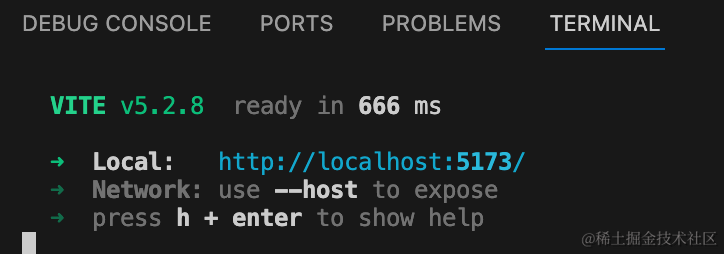

添加两个组件 Button1、Button2

Button1.tsx

```javascript
import './Button1.css';

export default function() {
    return <div className='btn-wrapper'>
        <button className="btn">button1</button>
    </div>
}
```
Button1.css
```css
.btn-wrapper {
    padding: 20px;
}

.btn {
    background: blue;
}
```
Button2.tsx
```javascript
import './Button2.css';

export default function() {
    return <div className='btn-wrapper'>
        <button className="btn">button2</button>
    </div>
}
```
Button2.css
```css
.btn-wrapper {
    padding: 10px;
}

.btn {
    background: green;
}
```
在 App.tsx 引入下：

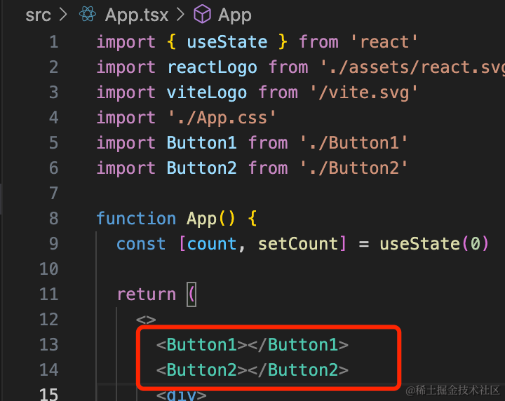

渲染出来是这样的：

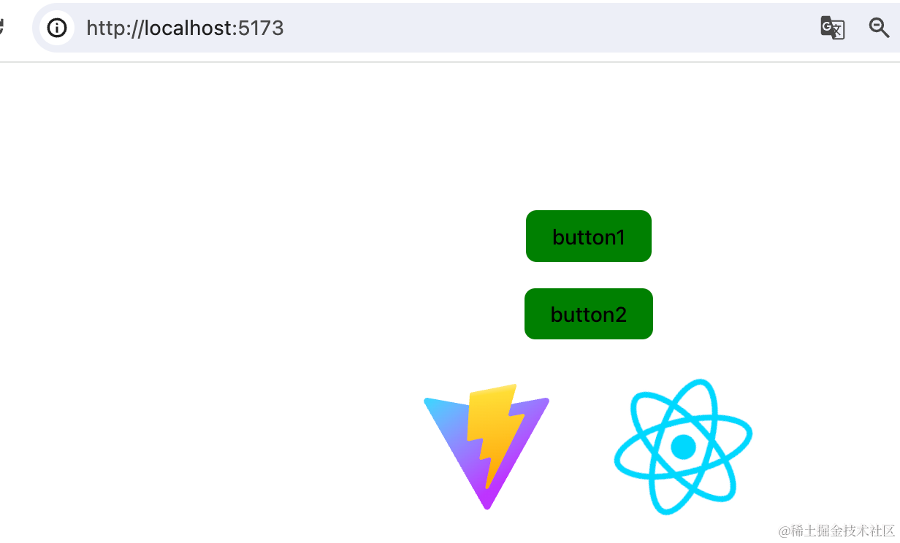

很明显，是样式冲突了：

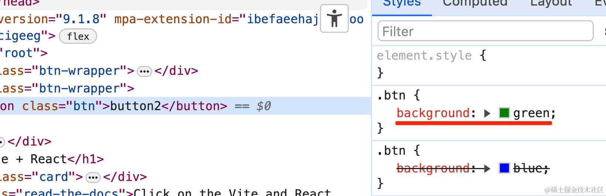

这时候可以改下名字，把 Button1.css 该为 Button1.module.css

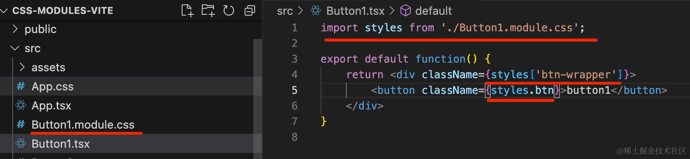

并且改下写 className 的方式。

```javascript
import styles from './Button1.module.css';

export default function() {
    return <div className={styles['btn-wrapper']}>
        <button className={styles.btn}>button1</button>
    </div>
}
```

在浏览器看下：

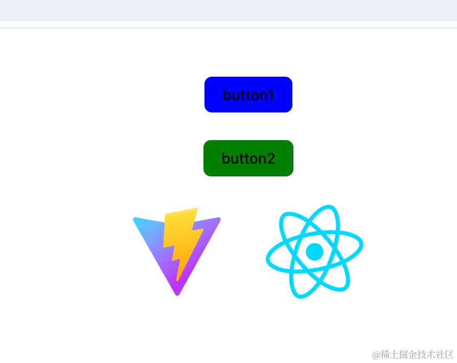

现在就不会样式冲突了。

为什么呢？

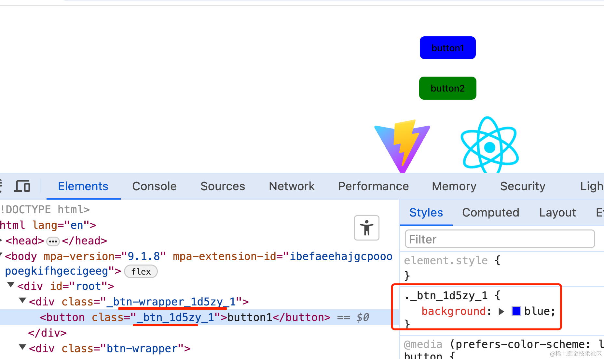

可以看到，button1 的 className 变成了带 hash 的形式，全局唯一的，自然就不会冲突了。

这就是 css modules。

那它是怎么实现的呢？

看下编译后的代码就明白了：


它通过编译给 className 加上了 hash，然后导出了这个唯一的 className。

所以在对象里用的，就是编译后的 className：

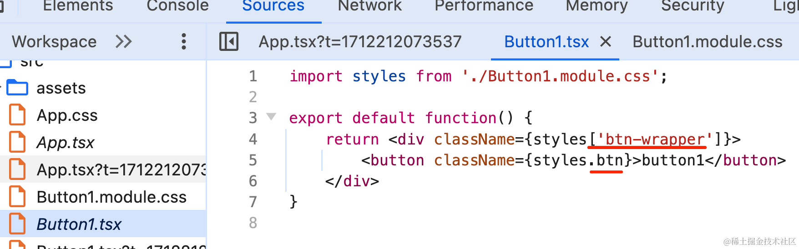

在 vscode 里安装 css modules 插件：

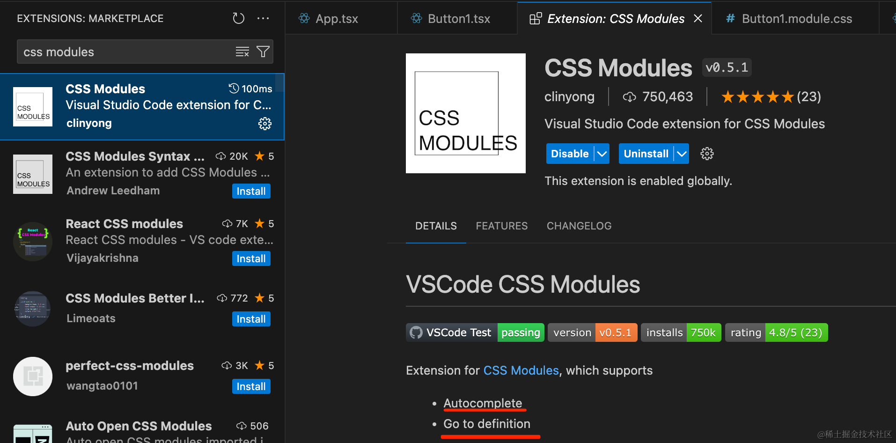

就可以提示出 css 模块下的 className 了：


其实 vue 里也有类似的机制，叫做 scoped css

比如：

```html
<style scoped> 
.guang { 
    color: red; 
} 
</style>  
<template>  
    <div class="guang">hi</div>  
</template>
```
会被编译成：

```html
<style> 
.guang[data-v-f3f3eg9] 
{ 
    color: red; 
} 
</style> 
<template> 
    <div class="guang" data-v-f3f3eg9>hi</div> 
</template>
```

通过给 css 添加一个全局唯一的属性选择器来限制 css 只能在这个范围生效，也就是 scoped 的意思。

它和 css modules 还不大一样，css modules 是整个 clasName 都变了，所以要把 className 改成从 css modules 导入的方式：

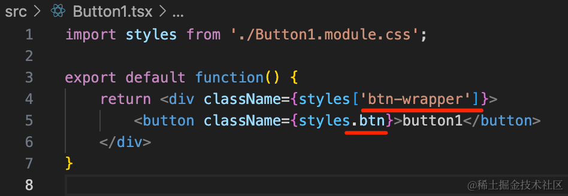

而 scoped css 这种并不需要修改 css 代码，只是编译后会加一个选择器


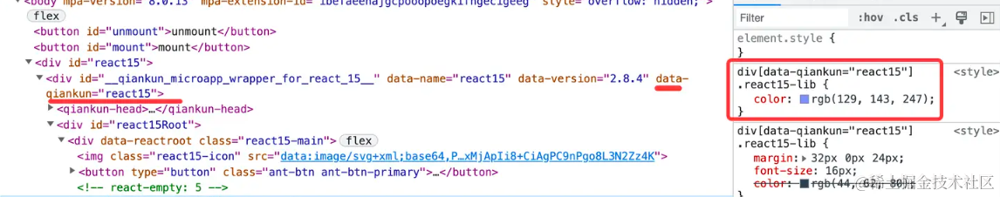

两者的使用体验有一些差别。

当然，在 vue 里可以选择 scoped css 或者 css modules，而在 react 里就只能用 css modules 了。

css modules 是通过 [postcss-modules](https://github.com/madyankin/postcss-modules) 这个包实现的，vite 也对它做了集成。

我们可以在 vite.config.ts 里修改下 css modules 的配置：

```javascript
import { defineConfig } from 'vite'
import react from '@vitejs/plugin-react'

// https://vitejs.dev/config/
export default defineConfig({
  plugins: [react()],
  css: {
    modules: {
      generateScopedName: "guang_[name]__[local]___[hash:base64:5]"
    }
  }
})

```
比如通过 generateScopedName 来修改生成的 className 的格式：

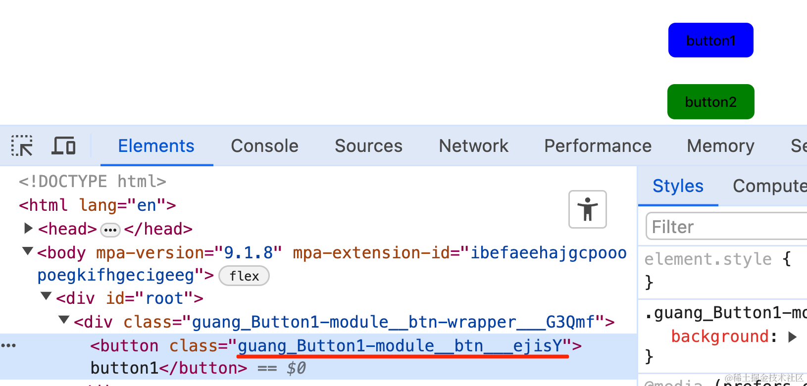

generateScopedName 也可以是个函数，自己处理：

```javascript
import { defineConfig } from 'vite'
import react from '@vitejs/plugin-react'

// https://vitejs.dev/config/
export default defineConfig({
  plugins: [react()],
  css: {
    modules: {
      // generateScopedName: "guang_[name]__[local]___[hash:base64:5]"
      generateScopedName: function (name, filename, css) {
        console.log(name, filename, css)
  
        return "xxx"
      },
    }
  }
})

```
传入了 className、filename 还有 css 文件的内容：

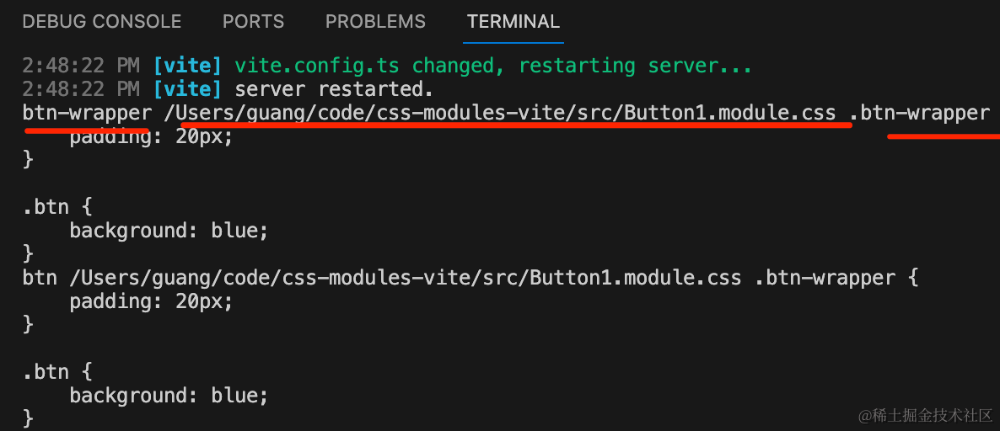

你可以通过 getJSON 来拿到编译后的 className：

```javascript
import { defineConfig } from 'vite'
import react from '@vitejs/plugin-react'

// https://vitejs.dev/config/
export default defineConfig({
  plugins: [react()],
  css: {
    modules: {
      getJSON: function (cssFileName, json, outputFileName) {
        console.log(cssFileName, json, outputFileName)
      },
    }
  }
})
```
第二个参数就是 css 模块导出的对象：

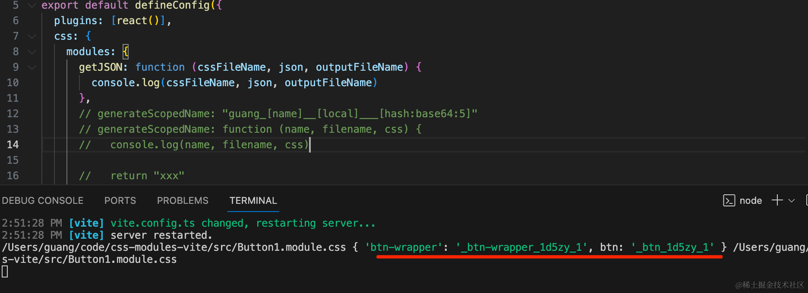

那如果在 Button1.module.css 里想把 .btn-wrapper 作为全局样式呢？

这样写：

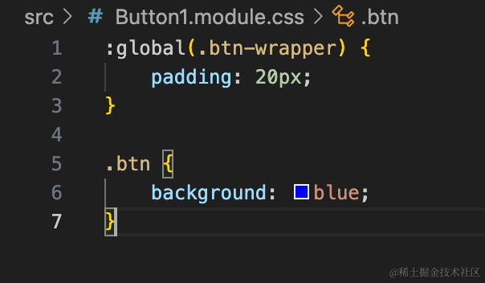

可以看到，现在编译后的 css 里就没有对 .btn-wrapper 做处理了：

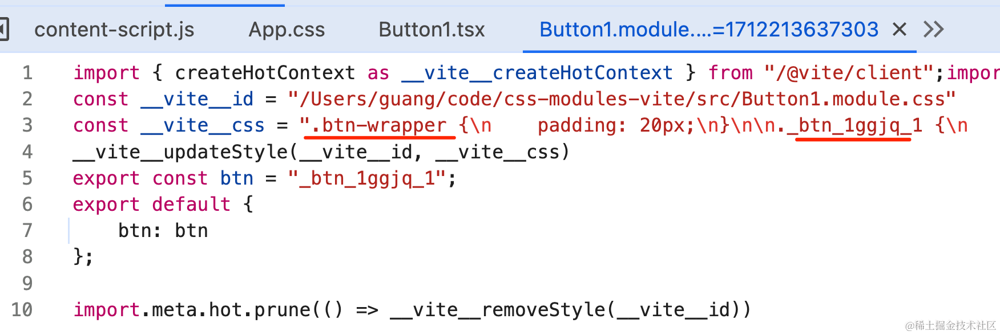

只不过，因为 global 的 className 默认不导出，而我们用 styles.xxx 引入的：

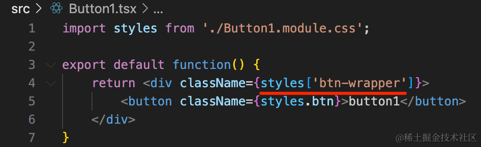

所以 className 为空：

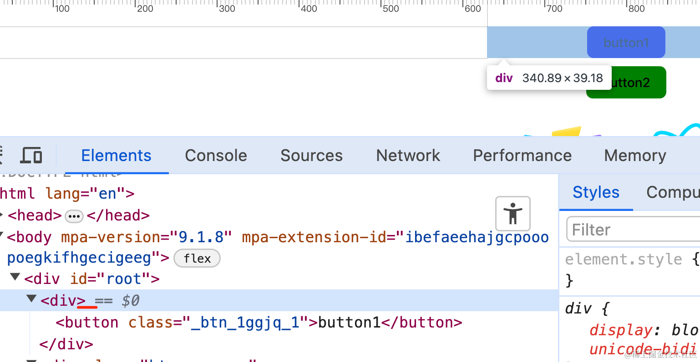

这时候，或者把 className 改为这样：

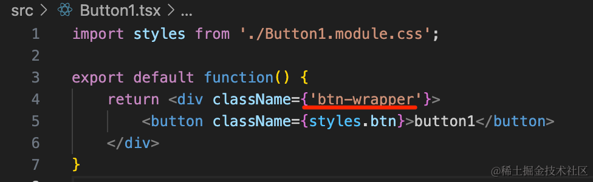

或者在配置里加一个 exportsGlobals:true

```javascript
import { defineConfig } from 'vite'
import react from '@vitejs/plugin-react'

// https://vitejs.dev/config/
export default defineConfig({
  plugins: [react()],
  css: {
    modules: {
      getJSON: function (cssFileName, json, outputFileName) {
        console.log(cssFileName, json, outputFileName)
      },
      exportGlobals: true
    }
  }
})

```

可以看到，现在 global 样式也导出了：

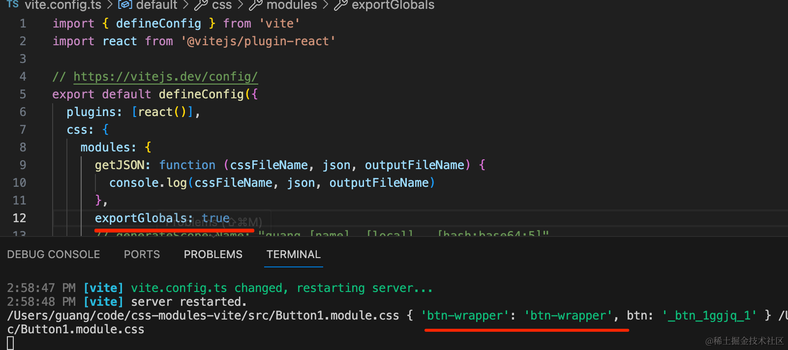

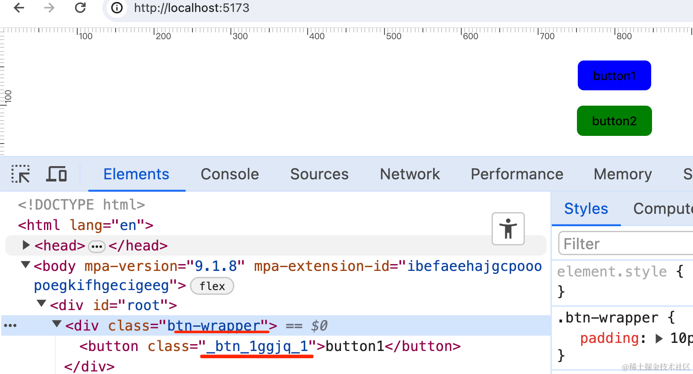

相对的，模块化的 className 就用 :local() 来声明：

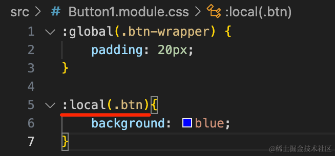

默认是 local。

如果你想默认 global，那也可以配置：

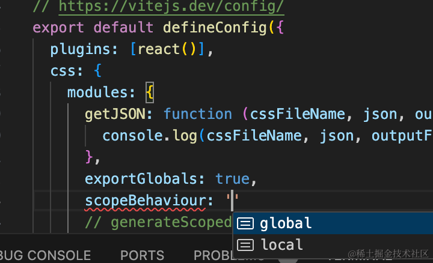

```javascript
import { defineConfig } from 'vite'
import react from '@vitejs/plugin-react'

// https://vitejs.dev/config/
export default defineConfig({
  plugins: [react()],
  css: {
    modules: {
      getJSON: function (cssFileName, json, outputFileName) {
        console.log(cssFileName, json, outputFileName)
      },
      exportGlobals: true,
      scopeBehaviour: 'global'
    }
  }
})

```

可以看到，现在就正好反过来了：


默认是 global，如果是 local 的要单独用 :local() 声明。

你还可以通过正则表达式来匹配哪些 css 文件是默认全局：

```javascript
import { defineConfig } from 'vite'
import react from '@vitejs/plugin-react'

// https://vitejs.dev/config/
export default defineConfig({
  plugins: [react()],
  css: {
    modules: {
      getJSON: function (cssFileName, json, outputFileName) {
        console.log(cssFileName, json, outputFileName)
      },
      exportGlobals: true,
      globalModulePaths: [/Button1/]
    }
  }
})
```

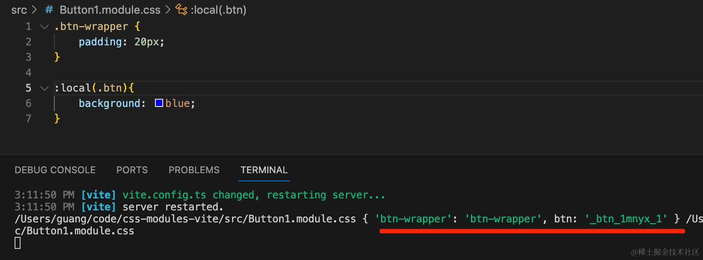

还有一个配置比较常用，就是 localsConvention：

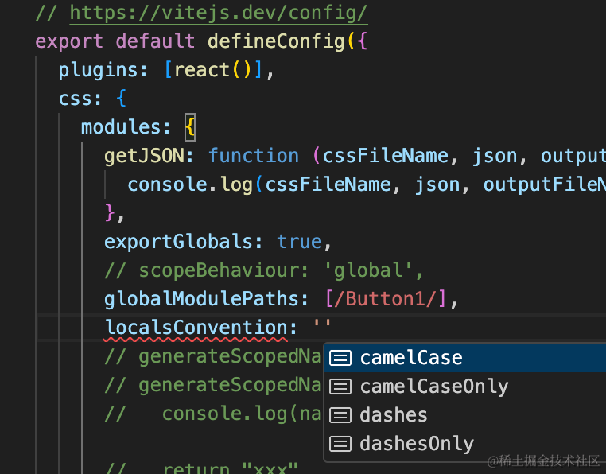

当 localsConvention 改为 camelCase 的时候，导出对象的 key 会变成驼峰的：

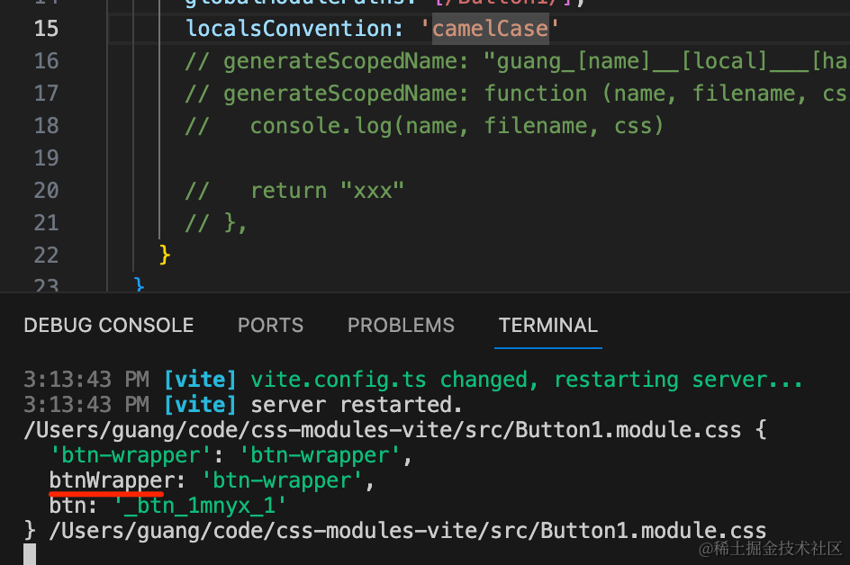

那在组件里就可以这样写：

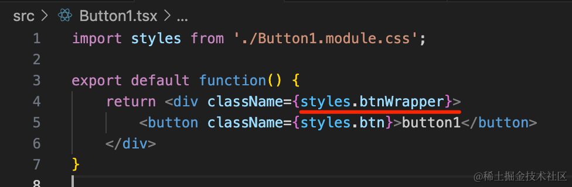

这些就是 css modules 相关的配置了。

此外，还有一个地方需要注意，就是多层的 className 的时候：

```javascript
.btn-wrapper {
    padding: 20px;
}

.btn .xxx{
    background: blue;
}
```

每一层的 className 都会编译：

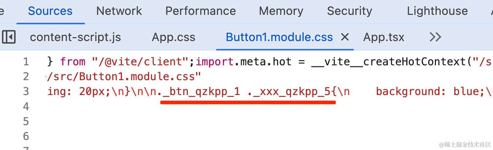

有时候只要最外层 className 变了就好了，内层不用变，就可以用 :global() 声明下：

```css
.btn-wrapper {
    padding: 20px;
}

.btn :global(.xxx){
    background: blue;
}
```

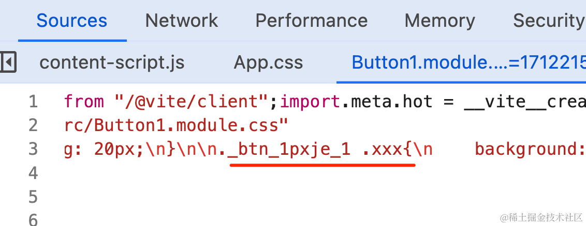

用 scss 之类的预处理时也是一样。

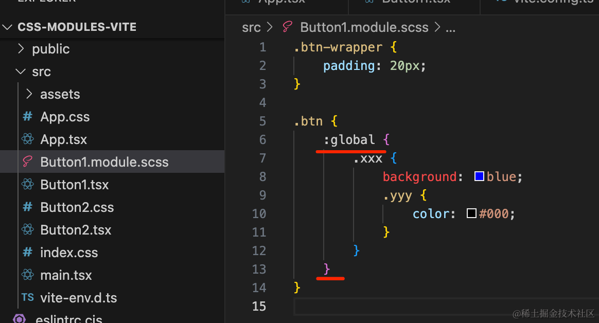

用 :global 包裹一层，内层的 className 不会被编译：

```css
.btn {
    :global {
        .xxx {
            background: blue;
            .yyy {
                color: #000;
            }
        }
    }
}

```
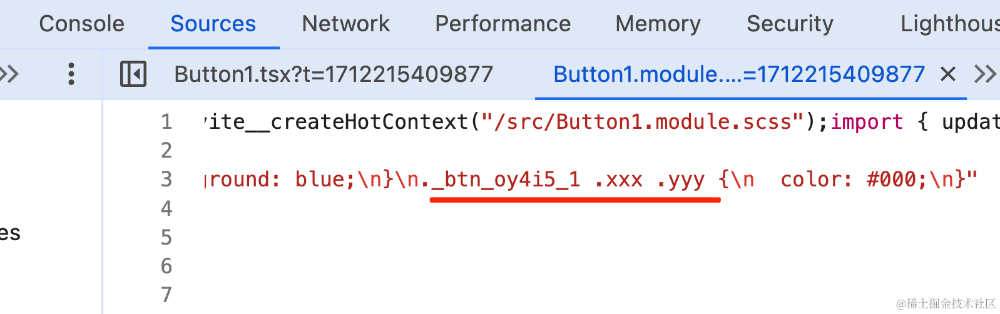

在 vite 里用 css modules 是这么用，在 cra 里也是一样。

创建个 cra 的项目：

```
npx create-react-app --template=typescript css-modules-cra
```

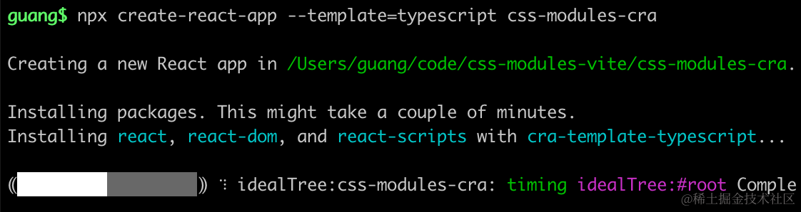

把服务跑起来：

```
npm run start
```
把 App.css 改为 App.module.css

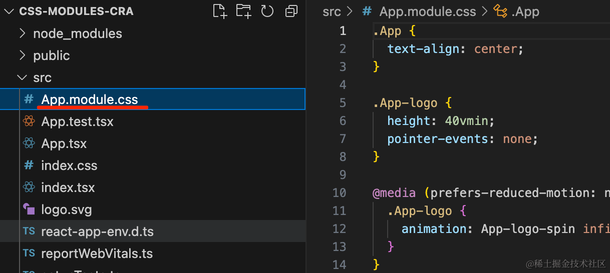

在 App.tsx 引入下：

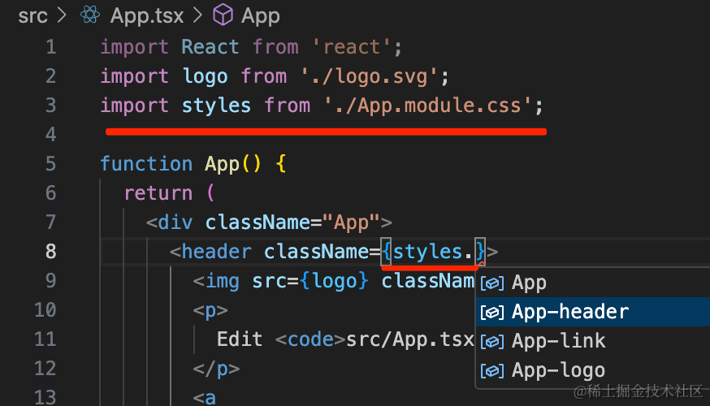

这样就开启了 css modules：

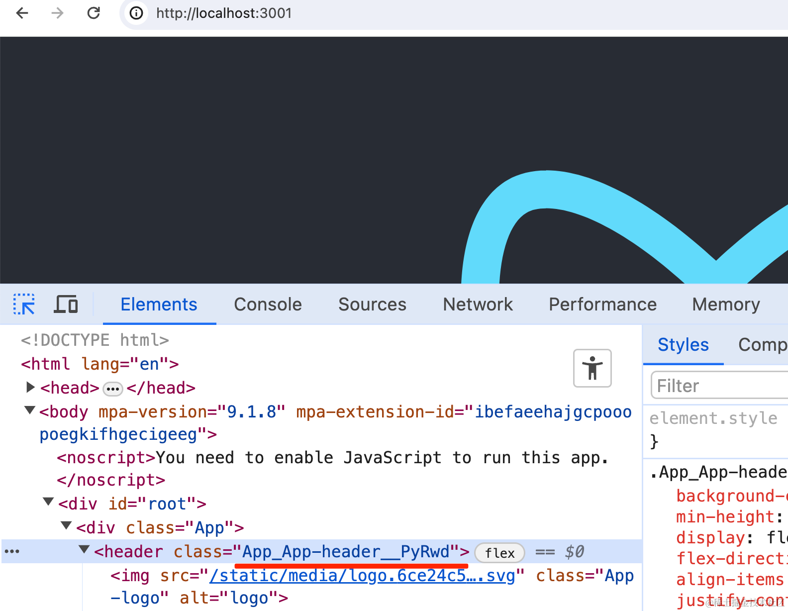

用法是一样的。

实现 css modules 也是用的 postcss-modules 这个 postcss 插件。

只不过是用 webpack 的 css-loader 封装了一层。

我们把本地代码保存：

```
git init 
git add .
git commit -m 'init'
```
然后把 webpack 配置放出来：

```
npm run eject
```
项目下会多一个 config 目录这下面就是 webpack 配置：

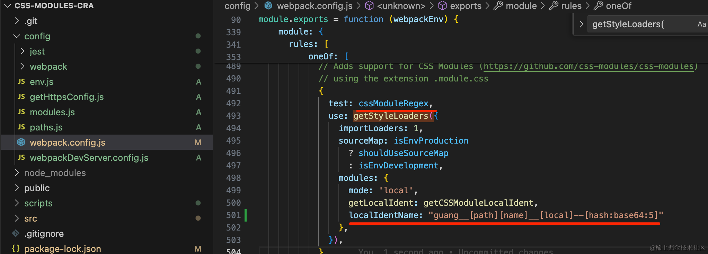
改一下配置：
```javascript
modules: {
  mode: 'local',
  // getLocalIdent: getCSSModuleLocalIdent,
  localIdentName: "guang__[path][name]__[local]--[hash:base64:5]"
},
```
重新跑开发服务：
```
npm run start
```
现在的 className 就变了：

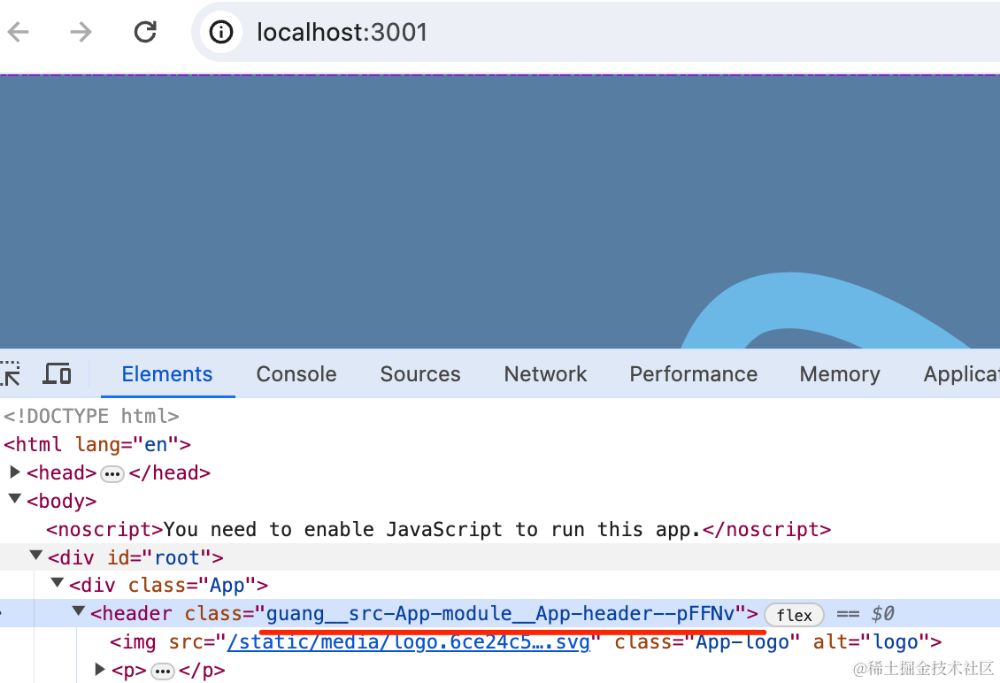
更多配置可以看 [css-loader 的文档](https://github.com/webpack-contrib/css-loader?tab=readme-ov-file#object-2)

和 vite 的 css modules 配置都差不多，虽然配置项名字不一样。

## 总结

不同组件的 className 可能会一样，导致样式冲突。

为此，我们希望 css 能实现像 js 的 es module 一样的模块化功能。

可以用 BEM 的命名规范来避免冲突，但是这需要人为保证，不够可靠。

一般都是用编译的方式，比如 CSS Modules 或者 vue 的 Scoped CSS。

它是通过 postcss-modules 实现的，可以把 css 的 className  编译成带 hash 的形式。

然后在组件里用 styles.xxx 的方式引入。

在 vite、cra 里都对 css modules 做了支持，只要用 xx.module.css、xxx.module.scss 等结尾，就默认开启了 css modules。

还可以通过各种配置来做更多定制：

- scopeBehaviour： 默认 local 或者 global
- getJSON：可以拿到 css 模块导出的对象
- exportGlobals： 全局的 className 也导出到对象
- globalModulePaths：哪些文件路径默认是全局 className
- generateScopedName：定制 local className 的格式
- localsConvention： 导出的对象的 key 的格式

在 webpack 的 css-loader 里也有类似的配置。

现在的组件开发基本都有模块化的要求，所以 CSS Modules 在日常开发中用的特别多。
